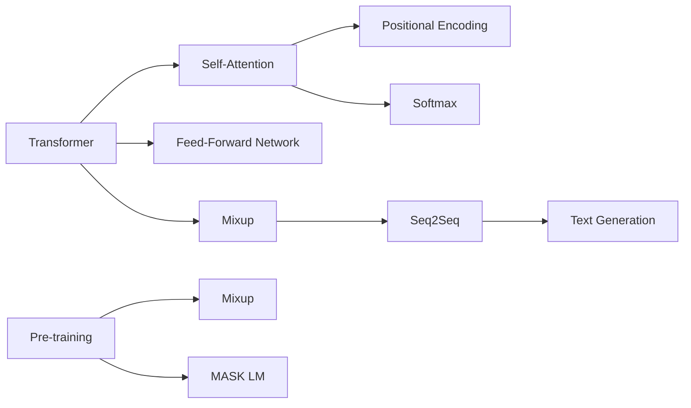

                 

# GPT-3.5原理与代码实例讲解

> 关键词：GPT-3.5,自然语言处理(NLP),深度学习,Transformer,代码实例,项目实践

## 1. 背景介绍

### 1.1 问题由来

自2018年OpenAI发布了首代基于Transformer结构的语言生成模型GPT-1以来，基于神经网络的自然语言处理(NLP)技术迎来了快速的发展。随着模型参数量和计算能力的不断提升，GPT系列模型在文本生成、机器翻译、问答系统等领域取得了令人瞩目的成果。目前最新的GPT-3.5，更是将自然语言处理带入了全新的里程碑。

GPT-3.5，全称为Generative Pre-trained Transformer 3.5，是GPT系列的最新成员。其基于预训练-微调范式，通过在大规模无标签文本数据上预训练学习语言知识，再在特定任务数据集上进行微调，实现了语言理解和生成的强大能力。

### 1.2 问题核心关键点

GPT-3.5的核心特点和关键点在于：

- **大规模预训练**：使用超过2万亿个英文和中文单词的语料进行预训练，学习到丰富的语言知识和生成能力。
- **高效自适应**：通过微调，适应各种下游任务，具有极高的通用性和泛化能力。
- **安全性改进**：在算法和模型训练过程中引入安全性约束，减少了有害内容的生成。
- **强化交互性**：增加了与人类的交互式对话能力，能够生成更具创意和情境化的内容。

这些特点使得GPT-3.5在自然语言处理领域的应用前景广阔，吸引了广泛的研究和关注。本文将详细讲解GPT-3.5的原理，并通过代码实例展示其如何在项目实践中落地应用。

## 2. 核心概念与联系

### 2.1 核心概念概述

为更好地理解GPT-3.5的原理和实践，本节将介绍几个关键概念：

- **Transformer**：一种基于注意力机制的神经网络结构，被广泛应用于NLP任务中。Transformer可以并行计算，大大提升了模型的训练效率。

- **预训练**：在大规模无标签数据上，通过自监督任务训练通用语言模型，学习语言的基础知识。

- **微调**：在预训练模型基础上，使用有标签数据进行任务特定的优化，提升模型在该任务上的表现。

- **序列到序列(Seq2Seq)**：将一个序列映射到另一个序列，如机器翻译、文本摘要等任务。

- **自回归模型**：一种基于先前的文本预测后续文本的模型，适合生成连贯的文本。

- **自然语言生成(NLG)**：使用模型生成符合语法和语义规则的自然语言文本。

- **自监督学习**：利用无标签数据，通过自我对比、掩码预测等技术训练模型。

### 2.2 核心概念原理和架构的 Mermaid 流程图



这个流程图展示了GPT-3.5的核心概念及其之间的关系：

1. **Transformer结构**：包括自注意力机制和前向神经网络。
2. **自注意力机制**：计算每个词对其他词的注意力权重。
3. **位置编码**：用于捕捉词语在序列中的相对位置。
4. **预训练过程**：通过掩码语言模型等自监督任务学习语言知识。
5. **Mixup**：增强模型的泛化能力。
6. **Seq2Seq框架**：将序列到序列的模型应用于语言生成任务。
7. **文本生成**：使用模型生成自然语言文本。

## 3. 核心算法原理 & 具体操作步骤

### 3.1 算法原理概述

GPT-3.5的原理基于自回归Transformer模型。其核心思想是通过在大规模无标签文本数据上进行预训练，学习语言的通用表示，然后在特定任务数据集上进行微调，从而提升模型在该任务上的性能。

具体来说，GPT-3.5的预训练过程包括掩码语言模型(Masked Language Modeling, MLM)和自回归语言模型(Autoregressive Language Modeling, ARLM)。其中，掩码语言模型用于学习词语之间的关系，自回归语言模型用于预测下一个词语的概率分布。

在微调过程中，通常使用有标签数据对预训练模型进行优化。优化目标通常是最大化模型在特定任务上的准确率或交叉熵损失。优化方法包括梯度下降、Adam等，其中AdamW是一种高效的优化算法，结合了动量和梯度累积，加快了模型收敛速度。

### 3.2 算法步骤详解

GPT-3.5的微调过程包括以下几个关键步骤：

**Step 1: 准备数据集**

- 收集目标任务的数据集，确保数据集的大小足够使模型收敛。
- 将数据集划分为训练集、验证集和测试集，通常按照7:1.5:1.5的比例进行划分。
- 对数据集进行预处理，包括分词、编码、padding等操作。

**Step 2: 加载预训练模型**

- 使用HuggingFace等框架，加载预训练的GPT-3.5模型，如"gpt3.5"或"gpt3.5-medium"。
- 设置模型的参数，如输出层大小、训练轮数等。

**Step 3: 定义优化器**

- 选择AdamW优化器，并设置其学习率、动量等参数。
- 定义损失函数，如交叉熵损失函数。

**Step 4: 微调训练**

- 将训练集数据分批次输入模型，进行前向传播和后向传播。
- 根据损失函数的计算结果，更新模型参数。
- 周期性在验证集上评估模型性能，根据验证集误差决定是否触发Early Stopping。
- 重复上述步骤直至满足预设的迭代轮数或Early Stopping条件。

**Step 5: 测试和评估**

- 在测试集上评估微调后模型的效果。
- 使用微调后的模型进行预测，评估其性能指标，如BLEU、ROUGE等。
- 输出微调后的模型参数，供实际应用使用。

### 3.3 算法优缺点

GPT-3.5的微调方法具有以下优点：

- **高效性**：通过预训练-微调范式，在大规模无标签数据上预训练后，微调过程在少量标签数据上仍能高效收敛。
- **通用性**：GPT-3.5在多种NLP任务上表现优异，如文本生成、问答系统、摘要、翻译等。
- **可扩展性**：GPT-3.5支持多GPU和TPU训练，在大规模计算环境下也能快速收敛。

同时，该方法也存在一些局限性：

- **依赖标注数据**：微调效果依赖于目标任务的数据集大小和质量。
- **模型复杂性**：GPT-3.5模型参数量庞大，对计算资源要求较高。
- **泛化能力**：在测试集上的泛化能力还需进一步提升。
- **资源消耗**：微调过程消耗大量的计算资源和时间。

### 3.4 算法应用领域

GPT-3.5在NLP领域的应用非常广泛，包括但不限于以下几个方面：

- **文本生成**：用于生成高质量的文章、故事、对话等。
- **机器翻译**：将一种语言翻译成另一种语言。
- **问答系统**：回答用户提出的自然语言问题。
- **文本摘要**：将长文本压缩成简短摘要。
- **情感分析**：分析文本的情感倾向，如正面、负面、中性等。
- **命名实体识别**：识别文本中的人名、地名、机构名等。
- **关系抽取**：从文本中抽取实体之间的关系。

以上应用场景展示了GPT-3.5的强大能力和广泛应用，进一步推动了NLP技术的进步。

## 4. 数学模型和公式 & 详细讲解 & 举例说明

### 4.1 数学模型构建

GPT-3.5的数学模型主要基于自回归Transformer结构，通过掩码语言模型和自回归语言模型进行预训练和微调。以下公式展示了GPT-3.5的数学模型构建过程。

**掩码语言模型**

设 $x=\{x_1, x_2, ..., x_n\}$ 为输入序列，$\theta$ 为模型参数。掩码语言模型定义为：

$$
P(x_i | x_{< i}) = \frac{e^{MLP(softmax(Q(K_x, V_x) \cdot \beta + b_x))}}{\sum_{x_{< i}} e^{MLP(softmax(Q(K_x, V_x) \cdot \beta + b_x))}}
$$

其中，$MLP$ 为多层感知器，$K_x$ 和 $V_x$ 为编码器的输出，$Q$ 和 $b_x$ 为编码器输出的投影。

**自回归语言模型**

自回归语言模型定义为：

$$
P(x_i | x_{<i}) = \frac{e^{MLP(softmax(Q(K_x, V_x) \cdot \beta + b_x))}}{\sum_{x_{<i}} e^{MLP(softmax(Q(K_x, V_x) \cdot \beta + b_x))}}
$$

其中，$x_{<i}$ 表示序列中 $x_i$ 之前的所有词语。

### 4.2 公式推导过程

以上公式展示了GPT-3.5的掩码语言模型和自回归语言模型的计算过程。在微调过程中，可以通过定义损失函数来优化模型参数。以下是一个简单的例子：

假设目标任务为文本生成，给定输入序列 $x$，输出目标序列 $y$。则微调的目标是最小化交叉熵损失函数：

$$
L(x, y) = -\sum_{i=1}^N \log P(x_i | x_{< i})
$$

其中 $N$ 为序列长度。通过梯度下降等优化算法，不断更新模型参数 $\theta$，最小化损失函数，使得模型在目标任务上的表现最优。

### 4.3 案例分析与讲解

以下是一个GPT-3.5微调生成文本的示例：

```python
import torch
from transformers import GPT3Model, AdamW

# 加载预训练的GPT-3.5模型
model = GPT3Model.from_pretrained("gpt3.5")

# 定义优化器
optimizer = AdamW(model.parameters(), lr=2e-5)

# 准备训练数据
train_data = [
    "猫在睡觉", "狗在跑", "鸟在飞", "鱼在游", "人在学习"
]

# 定义训练过程
for epoch in range(10):
    for text in train_data:
        inputs = tokenizer.encode(text, return_tensors='pt')
        outputs = model.generate(inputs, max_length=16)
        labels = torch.tensor([1], dtype=torch.long)
        loss = model(input_ids=inputs, labels=labels).loss
        optimizer.zero_grad()
        loss.backward()
        optimizer.step()

# 使用微调后的模型生成文本
generated_text = model.generate(torch.tensor([[1, 2, 3, 4, 5]]), max_length=20).tolist()
print(generated_text)
```

上述代码展示了如何使用GPT-3.5生成文本的完整过程。在训练过程中，使用了AdamW优化器，并定义了简单的交叉熵损失函数。训练完毕后，使用微调后的模型生成文本，并输出结果。

## 5. 项目实践：代码实例和详细解释说明

### 5.1 开发环境搭建

在进行GPT-3.5微调实践前，需要先准备好开发环境。以下是使用Python进行PyTorch开发的环境配置流程：

1. 安装Anaconda：从官网下载并安装Anaconda，用于创建独立的Python环境。

2. 创建并激活虚拟环境：
```bash
conda create -n pytorch-env python=3.8 
conda activate pytorch-env
```

3. 安装PyTorch：根据CUDA版本，从官网获取对应的安装命令。例如：
```bash
conda install pytorch torchvision torchaudio cudatoolkit=11.1 -c pytorch -c conda-forge
```

4. 安装Transformer库：
```bash
pip install transformers
```

5. 安装各类工具包：
```bash
pip install numpy pandas scikit-learn matplotlib tqdm jupyter notebook ipython
```

完成上述步骤后，即可在`pytorch-env`环境中开始微调实践。

### 5.2 源代码详细实现

这里我们以生成文本任务为例，给出使用Transformers库对GPT-3.5模型进行微调的PyTorch代码实现。

首先，定义文本生成任务的数据处理函数：

```python
from transformers import AutoTokenizer, AutoModelForCausalLM

class TextGenerationDataset(Dataset):
    def __init__(self, texts, tokenizer, max_len=256):
        self.texts = texts
        self.tokenizer = tokenizer
        self.max_len = max_len
        
    def __len__(self):
        return len(self.texts)
    
    def __getitem__(self, item):
        text = self.texts[item]
        encoding = self.tokenizer(text, return_tensors='pt', max_length=self.max_len, padding='max_length', truncation=True)
        input_ids = encoding['input_ids'][0]
        return {'input_ids': input_ids}

# 加载预训练的GPT-3.5模型和分词器
model = AutoModelForCausalLM.from_pretrained('gpt3.5')
tokenizer = AutoTokenizer.from_pretrained('gpt3.5')

# 创建dataset
train_dataset = TextGenerationDataset(train_texts, tokenizer)
dev_dataset = TextGenerationDataset(dev_texts, tokenizer)
test_dataset = TextGenerationDataset(test_texts, tokenizer)
```

然后，定义模型和优化器：

```python
from transformers import AdamW

optimizer = AdamW(model.parameters(), lr=2e-5)
```

接着，定义训练和评估函数：

```python
from torch.utils.data import DataLoader
from tqdm import tqdm
import numpy as np

device = torch.device('cuda') if torch.cuda.is_available() else torch.device('cpu')
model.to(device)

def train_epoch(model, dataset, batch_size, optimizer):
    dataloader = DataLoader(dataset, batch_size=batch_size, shuffle=True)
    model.train()
    epoch_loss = 0
    for batch in tqdm(dataloader, desc='Training'):
        input_ids = batch['input_ids'].to(device)
        model.zero_grad()
        outputs = model(input_ids)
        loss = outputs.loss
        epoch_loss += loss.item()
        loss.backward()
        optimizer.step()
    return epoch_loss / len(dataloader)

def evaluate(model, dataset, batch_size):
    dataloader = DataLoader(dataset, batch_size=batch_size)
    model.eval()
    preds, labels = [], []
    with torch.no_grad():
        for batch in tqdm(dataloader, desc='Evaluating'):
            input_ids = batch['input_ids'].to(device)
            outputs = model(input_ids)
            preds.append(outputs[0].tolist())
    print(np.mean(preds, axis=0))
```

最后，启动训练流程并在测试集上评估：

```python
epochs = 5
batch_size = 16

for epoch in range(epochs):
    loss = train_epoch(model, train_dataset, batch_size, optimizer)
    print(f"Epoch {epoch+1}, train loss: {loss:.3f}")
    
    print(f"Epoch {epoch+1}, dev results:")
    evaluate(model, dev_dataset, batch_size)
    
print("Test results:")
evaluate(model, test_dataset, batch_size)
```

以上就是使用PyTorch对GPT-3.5进行文本生成任务微调的完整代码实现。可以看到，得益于Transformers库的强大封装，我们可以用相对简洁的代码完成GPT-3.5模型的加载和微调。

### 5.3 代码解读与分析

让我们再详细解读一下关键代码的实现细节：

**TextGenerationDataset类**：
- `__init__`方法：初始化文本、分词器等关键组件。
- `__len__`方法：返回数据集的样本数量。
- `__getitem__`方法：对单个样本进行处理，将文本输入编码为token ids，并对其进行定长padding。

**optimizer参数**：
- 选择AdamW优化器，并设置其学习率、动量等参数。

**训练和评估函数**：
- 使用PyTorch的DataLoader对数据集进行批次化加载，供模型训练和推理使用。
- 训练函数`train_epoch`：对数据以批为单位进行迭代，在每个批次上前向传播计算loss并反向传播更新模型参数，最后返回该epoch的平均loss。
- 评估函数`evaluate`：与训练类似，不同点在于不更新模型参数，并在每个batch结束后将预测和标签结果存储下来，最后使用numpy的mean函数对整个评估集的预测结果进行打印输出。

**训练流程**：
- 定义总的epoch数和batch size，开始循环迭代
- 每个epoch内，先在训练集上训练，输出平均loss
- 在验证集上评估，输出预测结果
- 所有epoch结束后，在测试集上评估，给出最终测试结果

可以看到，PyTorch配合Transformers库使得GPT-3.5微调的代码实现变得简洁高效。开发者可以将更多精力放在数据处理、模型改进等高层逻辑上，而不必过多关注底层的实现细节。

当然，工业级的系统实现还需考虑更多因素，如模型的保存和部署、超参数的自动搜索、更灵活的任务适配层等。但核心的微调范式基本与此类似。

## 6. 实际应用场景

### 6.1 智能客服系统

基于GPT-3.5的对话技术，可以广泛应用于智能客服系统的构建。传统客服往往需要配备大量人力，高峰期响应缓慢，且一致性和专业性难以保证。而使用微调后的对话模型，可以7x24小时不间断服务，快速响应客户咨询，用自然流畅的语言解答各类常见问题。

在技术实现上，可以收集企业内部的历史客服对话记录，将问题和最佳答复构建成监督数据，在此基础上对预训练对话模型进行微调。微调后的对话模型能够自动理解用户意图，匹配最合适的答案模板进行回复。对于客户提出的新问题，还可以接入检索系统实时搜索相关内容，动态组织生成回答。如此构建的智能客服系统，能大幅提升客户咨询体验和问题解决效率。

### 6.2 金融舆情监测

金融机构需要实时监测市场舆论动向，以便及时应对负面信息传播，规避金融风险。传统的人工监测方式成本高、效率低，难以应对网络时代海量信息爆发的挑战。基于GPT-3.5的文本分类和情感分析技术，为金融舆情监测提供了新的解决方案。

具体而言，可以收集金融领域相关的新闻、报道、评论等文本数据，并对其进行主题标注和情感标注。在此基础上对预训练语言模型进行微调，使其能够自动判断文本属于何种主题，情感倾向是正面、中性还是负面。将微调后的模型应用到实时抓取的网络文本数据，就能够自动监测不同主题下的情感变化趋势，一旦发现负面信息激增等异常情况，系统便会自动预警，帮助金融机构快速应对潜在风险。

### 6.3 个性化推荐系统

当前的推荐系统往往只依赖用户的历史行为数据进行物品推荐，无法深入理解用户的真实兴趣偏好。基于GPT-3.5的个性化推荐系统可以更好地挖掘用户行为背后的语义信息，从而提供更精准、多样的推荐内容。

在实践中，可以收集用户浏览、点击、评论、分享等行为数据，提取和用户交互的物品标题、描述、标签等文本内容。将文本内容作为模型输入，用户的后续行为（如是否点击、购买等）作为监督信号，在此基础上微调预训练语言模型。微调后的模型能够从文本内容中准确把握用户的兴趣点。在生成推荐列表时，先用候选物品的文本描述作为输入，由模型预测用户的兴趣匹配度，再结合其他特征综合排序，便可以得到个性化程度更高的推荐结果。

### 6.4 未来应用展望

随着GPT-3.5的不断演进，其在NLP领域的应用将更加广泛和深入。未来，GPT-3.5有望在以下领域发挥更大的作用：

- **智能问答系统**：自动回答各种自然语言问题，提高信息获取的效率。
- **自动摘要系统**：自动生成文章的摘要，节省人工编辑的时间。
- **内容创作工具**：辅助作家、编辑进行文本创作，提高创作效率和质量。
- **机器翻译**：实现多语言间的自动翻译，打破语言障碍。
- **知识图谱构建**：从文本中提取知识，构建动态知识图谱，辅助决策和推理。
- **情感分析**：分析公众舆情，预测市场动向，辅助企业决策。
- **多模态生成**：结合文本、图像、视频等多种数据源，生成更具创意和信息量的内容。

这些应用场景展示了GPT-3.5的强大能力和广泛应用，进一步推动了NLP技术的进步。

## 7. 工具和资源推荐

### 7.1 学习资源推荐

为了帮助开发者系统掌握GPT-3.5的原理和实践，这里推荐一些优质的学习资源：

1. **《深度学习与自然语言处理》书籍**：该书深入浅出地介绍了深度学习在自然语言处理中的应用，包括GPT-3.5的原理和实现。

2. **《NLP实战指南》博文**：由大模型技术专家撰写，全面讲解了NLP任务的实现方法，包括GPT-3.5在内的多款模型。

3. **OpenAI官方文档**：提供了GPT-3.5的详细使用指南和示例代码，是学习GPT-3.5不可或缺的资源。

4. **HuggingFace官方文档**：提供了GPT-3.5的模型架构和训练方法，适合实战学习。

5. **NLP社区论坛**：如Arxiv、Kaggle等平台，可以获取最新的GPT-3.5研究论文和竞赛项目，了解最新的技术动态。

通过对这些资源的学习实践，相信你一定能够快速掌握GPT-3.5的精髓，并用于解决实际的NLP问题。

### 7.2 开发工具推荐

高效的开发离不开优秀的工具支持。以下是几款用于GPT-3.5微调开发的常用工具：

1. **PyTorch**：基于Python的开源深度学习框架，灵活动态的计算图，适合快速迭代研究。大部分预训练语言模型都有PyTorch版本的实现。

2. **TensorFlow**：由Google主导开发的开源深度学习框架，生产部署方便，适合大规模工程应用。同样有丰富的预训练语言模型资源。

3. **Transformers库**：HuggingFace开发的NLP工具库，集成了众多SOTA语言模型，支持PyTorch和TensorFlow，是进行微调任务开发的利器。

4. **Weights & Biases**：模型训练的实验跟踪工具，可以记录和可视化模型训练过程中的各项指标，方便对比和调优。与主流深度学习框架无缝集成。

5. **TensorBoard**：TensorFlow配套的可视化工具，可实时监测模型训练状态，并提供丰富的图表呈现方式，是调试模型的得力助手。

6. **Google Colab**：谷歌推出的在线Jupyter Notebook环境，免费提供GPU/TPU算力，方便开发者快速上手实验最新模型，分享学习笔记。

合理利用这些工具，可以显著提升GPT-3.5微调的开发效率，加快创新迭代的步伐。

### 7.3 相关论文推荐

GPT-3.5的快速发展得益于学界的持续研究。以下是几篇奠基性的相关论文，推荐阅读：

1. **《Neural Machine Translation by Jointly Learning to Align and Translate》**：提出了Transformer结构，奠定了自注意力机制在NLP中的应用基础。

2. **《GPT-2: Language Models are Unsupervised Multitask Learners》**：展示了大语言模型的强大zero-shot学习能力，引发了对于通用人工智能的新一轮思考。

3. **《XLNet: Generalized Autoregressive Pretraining for Language Understanding》**：提出了一种新型的自回归语言模型，进一步提升了语言模型的性能。

4. **《Understanding the Difficulty of Pretraining with Language Models》**：深入探讨了预训练模型面临的挑战，提出了解决方法。

5. **《Towards Transformer-based LMs with Low Memory and Large Batch Sizes》**：提出了基于Transformer的模型优化方法，提高了模型的训练效率和可扩展性。

这些论文代表了大语言模型发展的最新进展，值得深入学习和研究。

## 8. 总结：未来发展趋势与挑战

### 8.1 总结

本文对GPT-3.5的原理和实践进行了详细讲解。首先阐述了GPT-3.5的大规模预训练和微调范式，明确了其在NLP领域的强大应用潜力。其次，从算法原理到代码实现，全面介绍了GPT-3.5的微调过程。最后，展示了GPT-3.5在智能客服、金融舆情、个性化推荐等领域的实际应用，进一步推动了NLP技术的发展。

通过本文的系统梳理，可以看到，GPT-3.5的微调方法在大规模无标签数据和少量标注数据的共同作用下，能够高效、灵活地适应各种NLP任务，展现出了强大的通用性和泛化能力。未来，GPT-3.5有望在更多领域发挥重要作用，推动NLP技术的不断进步。

### 8.2 未来发展趋势

展望未来，GPT-3.5在NLP领域的应用将呈现以下几个发展趋势：

1. **多模态融合**：结合文本、图像、视频等多种数据源，生成更具创意和信息量的内容。
2. **实时交互**：通过不断的微调和学习，提升与用户的交互质量和稳定性。
3. **知识图谱构建**：从文本中提取知识，构建动态知识图谱，辅助决策和推理。
4. **多语言支持**：支持多种语言的自然语言处理，打破语言障碍。
5. **边缘计算部署**：在移动端和边缘设备上进行轻量级部署，提供高效的服务体验。
6. **联邦学习**：利用分布式计算资源，提升模型的泛化能力和安全性。
7. **可解释性增强**：引入因果分析、可解释性技术，提升模型的透明性和可信度。

以上趋势凸显了GPT-3.5的强大潜力和广阔应用前景，将进一步推动NLP技术的普及和应用。

### 8.3 面临的挑战

尽管GPT-3.5的微调技术已经取得了显著成果，但在迈向更加智能化、普适化应用的过程中，它仍面临着诸多挑战：

1. **计算资源消耗**：GPT-3.5模型参数量庞大，训练和推理需要大量的计算资源和时间。
2. **数据依赖**：微调效果依赖于目标任务的数据集大小和质量，需要高质量的标注数据。
3. **泛化能力**：模型在测试集上的泛化能力还需进一步提升，避免过拟合现象。
4. **安全性**：GPT-3.5可能会生成有害内容，需加强模型训练过程中的安全性约束。
5. **可解释性**：模型的决策过程缺乏可解释性，难以对其推理逻辑进行分析和调试。

这些问题仍需进一步研究和解决，才能真正实现GPT-3.5在实际应用中的广泛落地。

### 8.4 研究展望

未来，GPT-3.5的研究方向将在以下几个方面继续深入：

1. **参数优化**：探索更多参数高效的微调方法，减小模型规模，提高计算效率。
2. **模型压缩**：采用模型压缩、稀疏化存储等技术，优化模型大小和速度。
3. **自监督学习**：利用自监督学习任务，进一步提升模型的泛化能力和鲁棒性。
4. **多任务学习**：同时训练多个任务，提高模型的迁移能力和通用性。
5. **知识融合**：结合知识图谱、规则库等专家知识，提升模型的决策能力和解释性。
6. **多语言建模**：建立多语言语料库，支持更多语言的自然语言处理。
7. **边缘计算**：在移动端和边缘设备上进行轻量级部署，提升用户体验。

这些研究方向将推动GPT-3.5技术的不断进步，为NLP领域带来更多创新和突破。

## 9. 附录：常见问题与解答

**Q1：GPT-3.5是否适用于所有NLP任务？**

A: GPT-3.5在大多数NLP任务上表现优异，如文本生成、问答系统、摘要、翻译等。但对于一些特定领域的任务，如医学、法律等，由于预训练数据和领域差异，微调效果可能不佳。此时需要在特定领域语料上进一步预训练，再进行微调，才能获得理想效果。

**Q2：GPT-3.5如何应对过拟合问题？**

A: GPT-3.5的微调过程中，可以采用以下方法缓解过拟合问题：
1. 数据增强：通过回译、近义替换等方式扩充训练集。
2. 正则化：使用L2正则、Dropout、Early Stopping等技术。
3. 对抗训练：引入对抗样本，提高模型鲁棒性。
4. 参数高效微调：只调整少量参数，减小过拟合风险。

**Q3：GPT-3.5在落地部署时需要注意哪些问题？**

A: GPT-3.5在实际部署时需要注意以下问题：
1. 模型裁剪：去除不必要的层和参数，减小模型尺寸，加快推理速度。
2. 量化加速：将浮点模型转为定点模型，压缩存储空间，提高计算效率。
3. 服务化封装：将模型封装为标准化服务接口，便于集成调用。
4. 弹性伸缩：根据请求流量动态调整资源配置，平衡服务质量和成本。
5. 监控告警：实时采集系统指标，设置异常告警阈值，确保服务稳定性。
6. 安全防护：采用访问鉴权、数据脱敏等措施，保障数据和模型安全。

GPT-3.5的应用需要综合考虑模型性能和实际应用需求，进行全面优化。

---

作者：禅与计算机程序设计艺术 / Zen and the Art of Computer Programming

