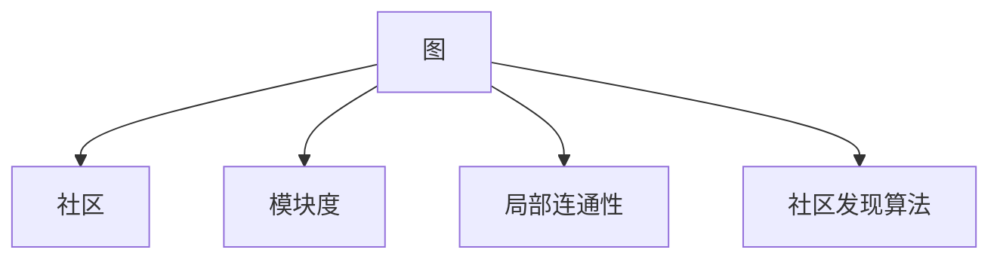

                 

## 1. 背景介绍

### 1.1 问题由来
在网络数据挖掘和社交网络分析中，社区检测（Community Detection）是一个重要且具有挑战性的问题。社区指的是在网络中具有相同特征、行为或联系的节点集合。通过社区检测，可以识别出网络中的核心群体，挖掘出重要的关系和信息。社区检测算法可以应用到许多领域，如社交网络、生物信息学、交通网络等。社区检测的效果直接关系到后续分析和应用的准确性和有效性，因此受到了广泛关注。

### 1.2 问题核心关键点
社区检测算法的核心在于寻找网络中节点之间的相似性和连接性，将相似的节点划分到同一社区中。该问题可以形式化为图（Graph）上的划分问题，即在无向图 $G=(V,E)$ 中，将节点集合 $V$ 划分为若干个互不相交的子集（社区），使得同一社区内的节点连接密度高于不同社区之间的连接密度。社区检测的核心目标是通过优化某个衡量标准（如模块度、连通性等），找到最优的社区划分。

## 2. 核心概念与联系

### 2.1 核心概念概述

为更好地理解社区检测算法，本节将介绍几个关键概念：

- 图（Graph）：由节点（Vertex）和边（Edge）构成的数学模型，用于表示现实世界中的关系和连接。
- 社区（Community）：在图中找到一组节点，它们之间有较高的连接密度和较小的度数差异，即节点关系密切、分布集中。
- 模块度（Modularity）：用于衡量社区划分的质量，通过最大化模块度来优化社区划分。
- 局部连通性（Local Conductivity）：节点之间连接密度的局部特性，是衡量社区内节点联系强度的指标。
- 社区发现算法（Community Detection Algorithm）：找到图上的社区划分，常用的算法包括Greedy、Louvain、GN等。

这些概念之间的逻辑关系可以通过以下Mermaid流程图来展示：



这个流程图展示了几大核心概念及其之间的关系：

1. 图通过节点和边来表示网络中的关系。
2. 社区是图中节点间具有紧密联系的子集。
3. 模块度是衡量社区划分质量的指标。
4. 局部连通性是社区内节点联系强度的指标。
5. 社区发现算法用于寻找社区划分，常用的算法包括Greedy、Louvain、GN等。

这些概念共同构成了社区检测算法的理论基础，使我们能够理解如何从图中识别出社区，并评估社区划分的质量。

## 3. 核心算法原理 & 具体操作步骤
### 3.1 算法原理概述

社区检测算法主要分为两个方向：基于密度的算法和基于凝聚性的算法。其中，基于密度的算法（如Density-Based Clustering）通过节点间密度的差异来识别社区，而基于凝聚性的算法（如Modularity-Based Clustering）通过最大化模块度来优化社区划分。

本节重点介绍基于凝聚性的社区检测算法，特别是GN（Girvan-Newman）算法。GN算法通过迭代地移除边来寻找社区，逐步构建更小的社区，直到只剩下整个图为止。其核心思想是移除边时优先选择网络密度较高的边，因为网络密度高的边更有可能是社区内部边。

### 3.2 算法步骤详解

GN算法的步骤如下：

1. **初始化**：给定一个无向图 $G=(V,E)$，其中 $V$ 为节点集合，$E$ 为边集合。
2. **计算连通性**：计算每个节点与邻居节点之间的连通性，记为 $S_{i}$。
3. **初始社区划分**：将每个节点初始化为单独的社区，即 $C_1 = \{v_1\}, C_2 = \{v_2\}, \cdots, C_n = \{v_n\}$。
4. **迭代**：重复以下步骤，直到只剩下一个社区：
   - 找到连通性最高的社区，记为 $C_k$。
   - 从社区 $C_k$ 中随机选择一个边 $e_{ik}$，并将其从图中移除。
   - 将与 $e_{ik}$ 的两个节点 $u$ 和 $v$ 加入新的社区 $C_{k+1}$。
5. **输出**：最终得到的社区划分即为GN算法的结果。

GN算法的核心在于通过迭代地移除边来逐步构建社区，每次移除的边都是当前连通性最高的边，这样可以保证社区内部的连通性，同时去除社区间的联系。

### 3.3 算法优缺点

GN算法的优点包括：

- 算法简单高效，易于实现。
- 通过最大化连通性来优化社区划分，具有良好的理论基础。
- 适用于多种图结构，包括稀疏图和稠密图。

GN算法的缺点包括：

- 对于大规模图，计算复杂度较高。
- 可能会产生不稳定的结果，不同运行序列得到的结果可能不同。
- 对于噪声或异常节点较多的图，效果可能不理想。

### 3.4 算法应用领域

GN算法在社交网络分析、生物信息学、交通网络等领域得到了广泛应用。例如，在社交网络中，可以通过GN算法识别出核心团体和社区，帮助分析群体行为和网络结构；在生物信息学中，可以用于分析蛋白质相互作用网络，识别出功能模块；在交通网络中，可以用于分析城市交通网络，发现交通热点和瓶颈。

## 4. 数学模型和公式 & 详细讲解 & 举例说明
### 4.1 数学模型构建

设无向图 $G=(V,E)$，其中 $V=\{v_1,v_2,\cdots,v_n\}$ 为节点集合，$E=\{e_{ij}\}_{i,j=1}^n$ 为边集合。假设节点 $v_i$ 的邻居节点集合为 $N_i$，则连通性 $S_{i}$ 定义为：

$$
S_i = \frac{2|N_i|}{\sum_{j \in N_i} k_j}
$$

其中 $k_j$ 为节点 $j$ 的度数，即邻居节点的个数。

GN算法的目标是最大化连通性 $S_i$，即通过不断移除边，使得社区内部连通性最大化。GN算法的核心在于每次移除边时，选择当前连通性最高的社区，并将其中的边随机移除。

### 4.2 公式推导过程

设当前社区 $C_k$ 的连通性为 $S_{C_k}$，则 GN算法的每次迭代更新如下：

1. 计算每个节点与邻居节点的连通性 $S_i$。
2. 找到连通性最高的社区 $C_k$。
3. 从社区 $C_k$ 中随机选择一个边 $e_{ik}$，将其移除。
4. 将与 $e_{ik}$ 的两个节点 $u$ 和 $v$ 加入新的社区 $C_{k+1}$。

为了简化计算，可以使用邻接矩阵 $A$ 来表示图 $G$。设 $A_{ij} = 1$ 表示节点 $i$ 和节点 $j$ 之间有边相连，否则 $A_{ij} = 0$。则节点 $i$ 的邻居节点集合 $N_i$ 可以表示为：

$$
N_i = \{j \mid A_{ij} = 1\}
$$

节点 $i$ 的连通性 $S_i$ 可以表示为：

$$
S_i = \frac{2|N_i|}{\sum_{j \in N_i} k_j} = \frac{2A_{ii} + 2\sum_{j \in N_i} A_{ij}}{d_i + \sum_{j \in N_i} k_j}
$$

其中 $d_i = \sum_{j=1}^n A_{ij}$ 为节点 $i$ 的度数。

### 4.3 案例分析与讲解

以一个简单的无向图为例，分析GN算法的工作过程。考虑以下无向图：

```
  1 -- 2 -- 3
  |      /    \
  4 -- 5 -- 6 -- 7
```

初始状态为每个节点单独构成一个社区。首先计算每个节点的连通性：

- $S_1 = \frac{2 \times 2}{2+4} = 0.667$
- $S_2 = \frac{2 \times 2}{4+2} = 0.667$
- $S_3 = \frac{2 \times 2}{4+4} = 0.333$
- $S_4 = \frac{2 \times 1}{2+1} = 0.5$
- $S_5 = \frac{2 \times 2}{2+2} = 0.5$
- $S_6 = \frac{2 \times 2}{2+2} = 0.5$
- $S_7 = \frac{2 \times 1}{2+1} = 0.5$

连通性最高的社区为节点 $1, 2, 3$，连通性 $S_{1,2,3} = 0.667$。从社区 $1, 2, 3$ 中随机选择一个边，例如 $e_{13}$，将其移除，得到以下新图：

```
  1 -- 2
  |      \
  4 -- 5 -- 6 -- 7
```

将节点 $1$ 和 $3$ 加入新的社区 $C_2$，得到以下社区划分：

- $C_1 = \{4, 5, 6, 7\}$
- $C_2 = \{1, 2, 3\}$

重复以上过程，直到只剩下一个社区为止。

## 5. 项目实践：代码实例和详细解释说明
### 5.1 开发环境搭建

在进行社区检测算法实现前，我们需要准备好开发环境。以下是使用Python进行NetworkX库开发的环境配置流程：

1. 安装Anaconda：从官网下载并安装Anaconda，用于创建独立的Python环境。
2. 创建并激活虚拟环境：
```bash
conda create -n graph-env python=3.8 
conda activate graph-env
```

3. 安装NetworkX库：
```bash
conda install networkx
```

4. 安装NumPy库：
```bash
pip install numpy
```

5. 安装Matplotlib库：
```bash
pip install matplotlib
```

完成上述步骤后，即可在`graph-env`环境中开始社区检测算法的开发。

### 5.2 源代码详细实现

以下是一个简单的GN算法的Python代码实现：

```python
import networkx as nx
import numpy as np
import matplotlib.pyplot as plt

def community_detection(graph):
    # 计算每个节点的连通性
    S = [2 * len(neighbors) / sum(neighbors.values()) for neighbors in graph.degree]
    
    # 初始化社区
    communities = [set(range(len(S)))]
    
    while len(communities) > 1:
        # 找到连通性最高的社区
        max_S = max(S)
        max_i = S.index(max_S)
        
        # 随机选择一个边并移除
        edges = list(graph.edges())
        edge = edges[np.random.randint(0, len(edges))]
        
        # 将两个节点加入新的社区
        new_community = communities.pop(max_i) | set([edge[1]])
        communities.append(new_community)
        
        # 更新连通性
        S = [S[i] - 1 / (len(communities[i]) * sum(communities[i])) for i in range(len(S))]
    
    # 返回社区划分
    return communities

# 创建一个简单的无向图
graph = nx.Graph()
graph.add_edges_from([(1, 2), (1, 3), (4, 5), (5, 6), (6, 7)])

# 执行社区检测
communities = community_detection(graph)

# 可视化社区划分
pos = nx.spring_layout(graph)
nx.draw(graph, pos=pos, with_labels=True, node_size=500)
for community in communities:
    for node in community:
        nx.nodes[graph.nodes[node]]['color'] = 'blue'
    nx.draw_networkx_labels(graph, pos, labels={node: str(node) for node in graph.nodes})

# 显示结果
plt.show()
```

### 5.3 代码解读与分析

让我们再详细解读一下关键代码的实现细节：

**community_detection函数**：
- 首先计算每个节点的连通性 $S_i$。
- 初始化社区为每个节点单独构成一个社区。
- 在社区数量大于1的情况下，重复以下步骤：
  - 找到连通性最高的社区 $C_k$。
  - 从社区 $C_k$ 中随机选择一个边 $e_{ik}$，并将其从图中移除。
  - 将与 $e_{ik}$ 的两个节点 $u$ 和 $v$ 加入新的社区 $C_{k+1}$。
- 最终返回社区划分。

**创建无向图**：
- 使用NetworkX库创建一个简单的无向图。
- 添加边表示节点之间的连接关系。

**可视化社区划分**：
- 使用NetworkX库的可视化工具绘制图。
- 将社区内的节点设置为蓝色，以便于观察。

可以看到，使用Python和NetworkX库，我们可以很方便地实现GN算法。代码实现简洁高效，易于理解和调试。

## 6. 实际应用场景

### 6.1 社交网络分析

在社交网络中，GN算法可以用于识别出核心团体和社区，分析群体行为和网络结构。例如，Twitter上的用户可以根据GN算法被划分为多个社区，每个社区的用户具有相似的兴趣爱好和互动行为，可以帮助分析网络中的热点话题和舆论趋势。

### 6.2 生物信息学

在生物信息学中，GN算法可以用于分析蛋白质相互作用网络，识别出功能模块。蛋白质相互作用网络表示不同蛋白质之间的相互作用关系，GN算法可以将其划分为多个功能模块，每个模块内的蛋白质具有相似的相互作用关系，可以帮助分析生物过程和细胞功能。

### 6.3 交通网络分析

在交通网络中，GN算法可以用于分析城市交通网络，发现交通热点和瓶颈。城市交通网络表示不同节点（交叉口、路段等）之间的连接关系，GN算法可以将其划分为多个社区，每个社区内的节点具有相似的交通特性，可以帮助分析交通拥堵和流量分布。

## 7. 工具和资源推荐
### 7.1 学习资源推荐

为了帮助开发者系统掌握社区检测的理论基础和实践技巧，这里推荐一些优质的学习资源：

1. **社区检测原理与算法**：斯坦福大学的在线课程，涵盖社区检测的基本概念、算法原理和应用案例。
2. **Python网络分析基础**：NetworkX库的官方文档，详细介绍了网络分析的基本概念和常用算法。
3. **Graph Community Detection算法**：Coursera上的课程，系统讲解了GN算法的原理和实现细节。

通过对这些资源的学习实践，相信你一定能够快速掌握社区检测的精髓，并用于解决实际的图数据问题。

### 7.2 开发工具推荐

高效的开发离不开优秀的工具支持。以下是几款用于社区检测算法的常用工具：

1. **NetworkX**：Python中的网络分析库，提供了丰富的网络数据结构和算法实现，适用于各种图数据的分析。
2. **Gephi**：开源网络可视化工具，支持多种网络格式导入，提供丰富的可视化展示和交互功能。
3. **GraphStudio**：可视化网络分析工具，支持多种网络格式导入，提供丰富的网络可视化展示和分析功能。

合理利用这些工具，可以显著提升社区检测算法的开发效率，加快创新迭代的步伐。

### 7.3 相关论文推荐

社区检测技术的发展源于学界的持续研究。以下是几篇奠基性的相关论文，推荐阅读：

1. **《Girvan-Newman algorithm for community detection in networks》**：Girvan-Newman算法的原始论文，详细介绍了GN算法的原理和实现细节。
2. **《Finding and evaluating community structure in social and information networks》**：社区检测技术的开创性论文，提出了模块度作为衡量社区划分质量的重要指标。
3. **《Community detection in networks: A survey》**：社区检测技术综述论文，总结了多种社区检测算法及其应用效果。

这些论文代表了大社区检测技术的发展脉络。通过学习这些前沿成果，可以帮助研究者把握学科前进方向，激发更多的创新灵感。

## 8. 总结：未来发展趋势与挑战
### 8.1 总结

本文对GN算法进行了全面系统的介绍。首先阐述了社区检测算法的背景和核心关键点，明确了GN算法在优化社区划分方面的独特优势。其次，从原理到实践，详细讲解了GN算法的数学模型和操作步骤，给出了算法实现的完整代码实例。同时，本文还广泛探讨了GN算法在多个领域的应用前景，展示了GN算法在网络分析中的广泛应用。此外，本文精选了GN算法的各类学习资源，力求为读者提供全方位的技术指引。

通过本文的系统梳理，可以看到，GN算法在社区检测领域具有重要的理论和实践价值。该算法通过最大化连通性来优化社区划分，具有直观易懂的理论基础和良好的实际效果。未来，GN算法将在更多领域得到应用，为网络分析提供新的突破。

### 8.2 未来发展趋势

展望未来，GN算法的发展趋势包括：

1. **大规模图处理**：GN算法在大规模图上的处理效率较低，未来需要通过优化算法和并行计算来提升其在大规模图上的性能。
2. **社区分类**：将社区进行分类，识别出核心社区和边缘社区，可以更好地理解网络结构和功能。
3. **多尺度社区发现**：在网络中发现不同尺度的社区，识别出不同层次的社区结构。
4. **多模态社区发现**：将GN算法扩展到多模态数据，如文本和图像，分析跨模态数据中的社区结构。

这些趋势将进一步推动GN算法在网络分析和社区检测领域的发展，为网络结构和功能分析提供新的工具和方法。

### 8.3 面临的挑战

尽管GN算法在社区检测领域已经取得了不错的成果，但在实际应用中仍面临诸多挑战：

1. **计算复杂度**：GN算法在大规模图上的计算复杂度较高，需要优化算法和并行计算来提高效率。
2. **社区划分不稳定**：GN算法可能产生不稳定的结果，不同运行序列得到的结果可能不同。
3. **噪声和异常节点**：GN算法对噪声和异常节点较为敏感，需要进行预处理和过滤。
4. **模块度优化**：模块度优化是社区检测的核心，但如何最大化模块度仍是一个开放问题。

这些问题需要在未来的研究中得到解决，才能更好地推广GN算法在实际应用中的使用。

### 8.4 研究展望

未来，GN算法的研究方向包括：

1. **优化算法**：通过优化算法和并行计算，提高GN算法在大规模图上的性能。
2. **社区分类**：研究如何将社区进行分类，识别出核心社区和边缘社区。
3. **多尺度社区发现**：在网络中发现不同尺度的社区，识别出不同层次的社区结构。
4. **多模态社区发现**：将GN算法扩展到多模态数据，如文本和图像，分析跨模态数据中的社区结构。
5. **社区演化分析**：研究社区随时间变化的演化规律，分析社区结构的动态变化。

这些研究方向将进一步推动GN算法的发展，为网络分析和社区检测提供新的方法和工具。

## 9. 附录：常见问题与解答

**Q1: 社区检测算法是否可以处理有向图？**

A: 社区检测算法通常用于无向图，但对于有向图，可以将其转换为无向图进行处理。具体方法是通过保留有向图中的反向边，将有向图转换为无向图。

**Q2: 社区检测算法是否可以处理加权图？**

A: 社区检测算法可以处理加权图，只需将加权边的权重作为节点之间的连接强度即可。GN算法中的连通性计算也适用于加权图。

**Q3: 社区检测算法的计算复杂度如何？**

A: 社区检测算法的计算复杂度取决于图的大小和社区的分布情况。GN算法的时间复杂度为 $O(N^3)$，其中 $N$ 为节点数。对于大规模图，可能需要优化算法和并行计算来提高效率。

**Q4: 社区检测算法有哪些优化策略？**

A: 社区检测算法的优化策略包括：
1. 基于并行计算的优化，使用多线程或分布式计算加速算法执行。
2. 基于启发式优化的优化，如改进的GN算法、基于模块度的启发式算法等。
3. 基于局部优化的优化，如局部社区发现算法、基于密度的社区发现算法等。

这些优化策略可以显著提高社区检测算法的性能，尤其是在大规模图上的处理效率。

**Q5: 社区检测算法的实际应用效果如何？**

A: 社区检测算法在实际应用中取得了不错的效果。例如，在社交网络中，GN算法可以识别出核心团体和社区，帮助分析群体行为和网络结构；在生物信息学中，可以用于分析蛋白质相互作用网络，识别出功能模块；在交通网络中，可以用于分析城市交通网络，发现交通热点和瓶颈。社区检测算法在多个领域得到了广泛应用，展示了其在实际应用中的强大生命力。

---

作者：禅与计算机程序设计艺术 / Zen and the Art of Computer Programming

