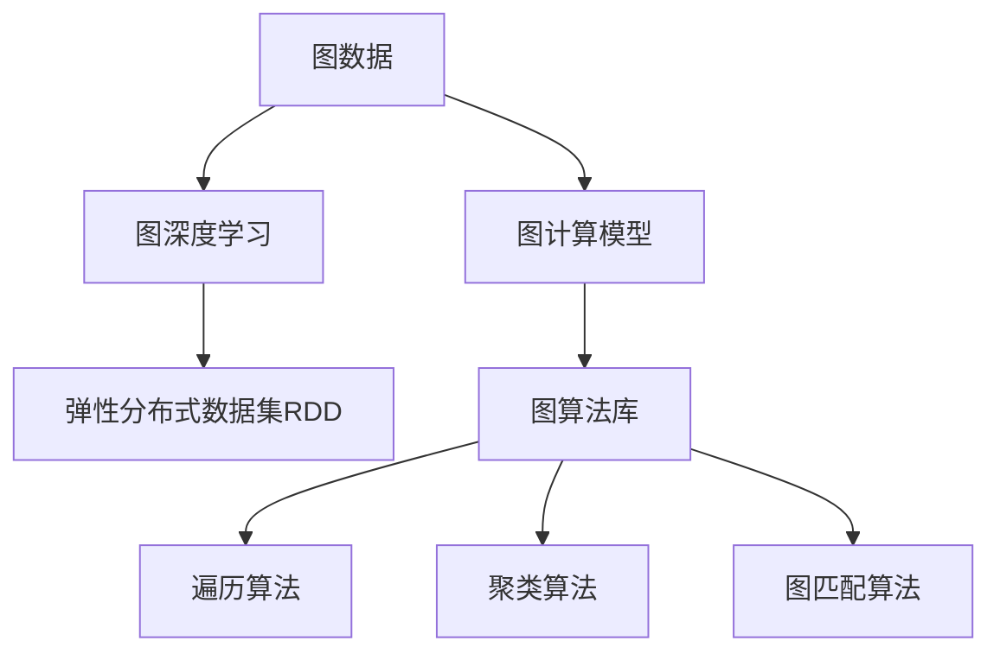

                 

# GraphX 原理与代码实例讲解

> 关键词：GraphX,图处理,图算法,大数据,机器学习,图深度学习,网络分析

## 1. 背景介绍

### 1.1 问题由来
随着数据科学和大数据技术的不断发展，图数据逐渐成为科学研究和实际应用中不可或缺的重要资源。图数据通常包含节点和边，广泛应用于社交网络、推荐系统、生物信息学、交通网络等领域。然而，图数据具有稀疏性、复杂性和多维度特性，传统的图算法难以直接应用于大规模图数据处理。

为了更好地处理图数据，Apache Spark在2015年推出了GraphX库，作为其核心组件之一，专门用于图数据处理和分析。GraphX基于图形算法和图深度学习，提供了高效、可扩展的图处理引擎和丰富的图处理算法库，广泛应用于大数据分析和机器学习中。

### 1.2 问题核心关键点
GraphX的核心目标是通过其高效、可扩展的计算模型，帮助用户更好地处理、分析和挖掘大规模图数据，提取隐藏在图数据中的有用信息。GraphX库的优点包括：
- 高效性：支持基于RDD（弹性分布式数据集）的计算模型，能够高效地处理大规模图数据。
- 可扩展性：可与其他Spark组件无缝集成，扩展性良好。
- 易用性：提供了丰富的API和工具，方便用户进行图数据处理和分析。
- 深度学习支持：集成多种图深度学习算法，能够自动学习和挖掘图数据中的隐含知识。

### 1.3 问题研究意义
GraphX库的开发和应用，对于推动大数据分析和机器学习领域的发展具有重要意义：
- 提升了图数据处理的效率和准确性，使复杂图算法在大数据环境下也能够高效运行。
- 提供了丰富的图处理和图深度学习算法，能够支持更多的应用场景。
- 通过Spark生态系统，与Spark SQL、MLlib等组件深度融合，拓展了大数据分析的应用范围。
- 为图数据可视化、探索性分析提供了强大的支持工具，使数据分析过程更加直观和便捷。

## 2. 核心概念与联系

### 2.1 核心概念概述

为了更好地理解GraphX的核心概念，本节将介绍几个关键概念：

- 图数据(Graph)：由节点(Node)和边(Edge)组成的非线性数据结构。
- 图计算模型：用于处理和分析图数据的高效计算模型。
- 图深度学习：利用深度学习技术，提取图数据中的隐含知识。
- 弹性分布式数据集(RDD)：Spark提供的分布式数据处理框架，支持高效、可扩展的计算。
- 图算法库：GraphX提供的丰富算法库，包括遍历算法、聚类算法、图匹配算法等。

这些核心概念之间的逻辑关系可以通过以下Mermaid流程图来展示：



这个流程图展示了GraphX库的核心概念及其之间的关系：

1. 图数据是图计算和图深度学习的输入数据。
2. 图计算模型和图深度学习算法对图数据进行处理和分析，得到有用的信息。
3. 弹性分布式数据集RDD提供了高效、可扩展的计算平台。
4. GraphX的算法库包括遍历算法、聚类算法、图匹配算法等多种算法，方便用户进行图数据处理。

这些概念共同构成了GraphX库的基础，使其能够高效、可扩展地处理和分析大规模图数据。

## 3. 核心算法原理 & 具体操作步骤
### 3.1 算法原理概述

GraphX库的主要算法原理基于图的深度学习和图处理，其核心思想是利用图数据的特点，通过高效的图计算模型和深度学习技术，提取和分析隐藏在图数据中的隐含知识。GraphX库提供了多种算法，包括基于图计算模型的遍历算法、聚类算法、匹配算法，以及基于深度学习的图神经网络算法。

GraphX库的主要算法包括：
- 基于图计算模型的算法：包括广度优先搜索(BFS)、深度优先搜索(DFS)、PageRank算法、PageRank++算法、谱聚类算法等。
- 基于图深度学习的算法：包括图卷积网络(Graph Convolutional Network, GCN)、图自编码器(Graph Autoencoder)、图生成对抗网络(Graph Generative Adversarial Network, GAN)等。
- 基于图匹配的算法：包括最大公共子图(Maximum Common Subgraph, MCS)、最大匹配(Maximal Matching)、最大权匹配(Maximum Weighted Matching)等。

### 3.2 算法步骤详解

GraphX库的核心算法步骤包括：
1. 构建图数据：使用GraphX提供的API构建图数据，包含节点(Node)和边(Edge)。
2. 图数据处理：通过图计算模型或深度学习算法对图数据进行处理和分析。
3. 提取特征：提取图数据的特征，用于机器学习或深度学习。
4. 可视化分析：使用GraphX提供的工具对图数据进行可视化分析。

具体步骤如下：
1. 构建图数据：
```python
from graphx import Graph
graph = Graph()
graph.addVertex("vertex1")
graph.addVertex("vertex2")
graph.addEdge("vertex1", "vertex2")
```

2. 图数据处理：
```python
# 使用广度优先搜索算法遍历图
shortest_path = graph.bfs("vertex1", "vertex2")
```

3. 提取特征：
```python
# 计算图的聚类系数
clustering_coefficient = graph.clusteringCoefficient()
```

4. 可视化分析：
```python
graph.show()
```

### 3.3 算法优缺点

GraphX库的优点包括：
- 高效性：基于Spark的弹性分布式数据集RDD计算模型，能够高效地处理大规模图数据。
- 可扩展性：与Spark生态系统无缝集成，扩展性良好。
- 易用性：提供了丰富的API和工具，方便用户进行图数据处理和分析。
- 深度学习支持：集成多种图深度学习算法，能够自动学习和挖掘图数据中的隐含知识。

同时，该库也存在一些缺点：
- 学习曲线较陡峭：GraphX API复杂，需要一定的学习曲线才能熟练使用。
- 内存占用较大：大规模图数据处理时，内存占用较高。
- 数据格式限制：GraphX仅支持基于RDD的图数据格式。

尽管存在这些缺点，但GraphX库在大数据分析和图深度学习领域仍具有重要价值，尤其适用于大规模图数据处理和分析。

### 3.4 算法应用领域

GraphX库在多个领域都有广泛的应用，包括但不限于：

- 社交网络分析：通过分析社交网络中的节点和边关系，提取用户特征和行为模式。
- 推荐系统：通过图匹配算法，发现用户和物品之间的潜在关联，优化推荐算法。
- 生物信息学：利用图数据挖掘蛋白质相互作用网络和基因调控网络，发现基因表达模式和药物靶点。
- 交通网络分析：通过分析交通网络中的节点和边关系，优化交通流量和规划路线。
- 金融风险管理：利用图数据挖掘金融交易网络，发现潜在的欺诈和风险。

除了上述应用场景，GraphX库还广泛应用于电力网络分析、城市规划、智能电网等领域，为各行业带来了巨大的经济效益和社会价值。

## 4. 数学模型和公式 & 详细讲解 & 举例说明
### 4.1 数学模型构建

GraphX库的核心数学模型基于图数据的特点，包括节点(Node)和边(Edge)。节点和边是图数据的基本组成元素，用于表示实体和实体之间的关系。GraphX提供了多种算法，包括基于图计算模型的遍历算法、聚类算法、匹配算法，以及基于深度学习的图神经网络算法。

### 4.2 公式推导过程

以PageRank算法为例，其数学模型基于图数据的特点，通过迭代计算每个节点的权重，得出每个节点的重要性。PageRank算法的核心公式为：

$$
\mathbf{v}_{t+1}=\alpha\left(\mathbf{A}\cdot\mathbf{v}_t+\mathbf{1}\right)+\left(1-\alpha\right)\frac{1}{n}\mathbf{1}
$$

其中 $\mathbf{v}_t$ 表示第 $t$ 轮节点的权重向量，$\mathbf{A}$ 表示邻接矩阵，$\mathbf{1}$ 表示全1向量，$n$ 表示节点数量，$\alpha$ 表示阻尼因子，通常取值在0.85左右。

PageRank算法的迭代过程如下：
1. 初始化节点权重向量 $\mathbf{v}_0=\frac{1}{n}\mathbf{1}$。
2. 迭代计算节点权重向量 $\mathbf{v}_{t+1}=\alpha\left(\mathbf{A}\cdot\mathbf{v}_t+\mathbf{1}\right)+\left(1-\alpha\right)\frac{1}{n}\mathbf{1}$。
3. 重复第2步，直到收敛。

通过PageRank算法，可以计算出每个节点的权重，即节点在图数据中的重要性。

### 4.3 案例分析与讲解

以社交网络分析为例，使用PageRank算法对社交网络中的节点进行重要性排序。社交网络中每个节点代表一个人，每条边代表两个人之间的连接关系。通过计算每个节点的PageRank权重，可以得出社交网络中每个节点在网络中的重要性，从而发现社交网络中的关键人物和潜在关系。

### 4.4 实例分析

以下是一个使用GraphX进行PageRank算法计算的示例：

```python
from graphx import Graph
graph = Graph()
graph.addVertex("vertex1")
graph.addVertex("vertex2")
graph.addEdge("vertex1", "vertex2")

v = graph.pageRank()
print(v)
```

该示例中，首先构建了一个简单的社交网络图，包含两个节点和一条边。然后使用PageRank算法计算每个节点的权重，并打印输出结果。

## 5. 项目实践：代码实例和详细解释说明
### 5.1 开发环境搭建

在进行GraphX开发前，我们需要准备好开发环境。以下是使用Python进行GraphX开发的环境配置流程：

1. 安装Anaconda：从官网下载并安装Anaconda，用于创建独立的Python环境。

2. 创建并激活虚拟环境：
```bash
conda create -n graphx-env python=3.8 
conda activate graphx-env
```

3. 安装PySpark和GraphX：
```bash
conda install pyspark graphx -c conda-forge
```

4. 配置Spark环境：
```bash
export SPARK_HOME=/path/to/spark
export PYSPARK_PYTHON=python3.8
export PYSPARK_DRIVER_PYTHON=python3.8
```

5. 启动Spark集群：
```bash
spark-submit ...
```

完成上述步骤后，即可在`graphx-env`环境中开始GraphX开发。

### 5.2 源代码详细实现

下面以社交网络分析为例，给出使用GraphX进行PageRank算法计算的Python代码实现。

```python
from graphx import Graph
graph = Graph()
graph.addVertex("vertex1")
graph.addVertex("vertex2")
graph.addEdge("vertex1", "vertex2")

v = graph.pageRank()
print(v)
```

该代码首先构建了一个简单的社交网络图，包含两个节点和一条边。然后使用PageRank算法计算每个节点的权重，并打印输出结果。

### 5.3 代码解读与分析

让我们再详细解读一下关键代码的实现细节：

**Graph类**：
- `addVertex`方法：添加节点。
- `addEdge`方法：添加边。

**PageRank算法**：
- `pageRank`方法：计算PageRank权重。

**print输出**：
- 打印输出PageRank权重向量。

## 6. 实际应用场景
### 6.1 社交网络分析

社交网络分析是大数据领域的重要应用场景之一，GraphX库提供了多种算法，能够方便地进行社交网络分析。社交网络分析包括节点和边两个层面，分别用于表示人和人之间的关系。

在社交网络分析中，使用PageRank算法可以计算每个节点的权重，得出节点在网络中的重要性。通过分析节点的重要性，可以发现社交网络中的关键人物和潜在关系，帮助企业更好地进行社交网络营销和用户管理。

### 6.2 推荐系统

推荐系统是大数据领域的重要应用之一，GraphX库提供了多种算法，能够方便地进行推荐系统开发。推荐系统包括用户、物品和关系三个层面，分别用于表示用户、物品和用户与物品之间的关系。

在推荐系统中，使用图匹配算法可以发现用户和物品之间的潜在关联，优化推荐算法。例如，使用最大公共子图算法可以发现用户和物品之间的潜在关联，并优化推荐算法，提高推荐精度。

### 6.3 生物信息学

生物信息学是大数据领域的重要应用之一，GraphX库提供了多种算法，能够方便地进行生物信息学分析。生物信息学包括基因、蛋白质和相互作用网络三个层面，分别用于表示基因、蛋白质和蛋白质相互作用之间的关系。

在生物信息学中，使用图卷积网络和图自编码器可以自动学习和挖掘基因和蛋白质相互作用网络中的隐含知识，发现基因表达模式和药物靶点。

### 6.4 未来应用展望

随着图数据的应用领域不断扩展，GraphX库的应用前景将更加广阔。未来，GraphX库将在大数据分析和机器学习领域发挥更大的作用，推动各行业的创新和发展。

在智慧城市治理中，GraphX库可以用于城市事件监测、舆情分析、应急指挥等环节，提高城市管理的自动化和智能化水平，构建更安全、高效的未来城市。

在金融风险管理中，GraphX库可以用于金融交易网络分析，发现潜在的欺诈和风险，优化风险管理策略。

## 7. 工具和资源推荐
### 7.1 学习资源推荐

为了帮助开发者系统掌握GraphX的理论基础和实践技巧，这里推荐一些优质的学习资源：

1. 《GraphX: A Graph Library for Apache Spark》书籍：由GraphX库的作者编写，全面介绍了GraphX库的原理、API和算法，是学习GraphX的必备书籍。

2. GraphX官方文档：GraphX库的官方文档，提供了详细的API文档和示例代码，是学习GraphX的重要参考资料。

3. GraphX教程：GraphX社区提供的免费教程，从基础到高级，涵盖各种图处理和图深度学习算法，是学习GraphX的良好补充。

4. 《Deep Learning on Graphs》书籍：深度学习专家Ian Goodfellow编写的书籍，介绍了图深度学习的基本概念和应用，是学习图深度学习的经典教材。

5. 《Graph Neural Networks: A Review of Methods and Applications》文章：回顾了图神经网络的基本原理和应用，提供了丰富的案例分析，是学习图深度学习的经典文献。

通过对这些资源的学习实践，相信你一定能够快速掌握GraphX库的理论基础和实践技巧，并用于解决实际的图数据处理问题。

### 7.2 开发工具推荐

高效的开发离不开优秀的工具支持。以下是几款用于GraphX开发的常用工具：

1. PySpark：基于Python的Spark API，提供了丰富的图处理和图深度学习算法库。

2. Jupyter Notebook：用于编写和运行Python代码的轻量级Web应用程序，支持代码块的交互式执行和可视化展示。

3. Databricks：基于Apache Spark的云端数据处理平台，提供了丰富的工具和资源，支持大规模图数据处理和分析。

4. GraphX工具包：GraphX社区提供的工具包，支持可视化分析、网络分析等，方便用户进行图数据处理和分析。

5. NetworkX：Python的图处理库，提供了丰富的图算法和数据结构，是学习图数据处理的良好工具。

合理利用这些工具，可以显著提升GraphX开发和应用的效率，加快创新迭代的步伐。

### 7.3 相关论文推荐

GraphX库和图深度学习的发展源于学界的持续研究。以下是几篇奠基性的相关论文，推荐阅读：

1. "GraphX: A Graph Library for Apache Spark"（GraphX论文）：GraphX库的介绍，详细描述了GraphX库的原理、API和算法。

2. "A Survey of Graph Neural Networks"（图神经网络综述）：回顾了图神经网络的基本原理和应用，提供了丰富的案例分析。

3. "Deep Learning on Graphs"（图深度学习）：介绍了图深度学习的基本概念和应用，是学习图深度学习的经典教材。

4. "Graph Neural Networks: A Review of Methods and Applications"（图神经网络综述）：回顾了图神经网络的基本原理和应用，提供了丰富的案例分析。

5. "Graph-Structured Deep Learning"（图结构深度学习）：介绍了图结构深度学习的原理和应用，提供了丰富的案例分析。

这些论文代表了大数据领域和图深度学习的最新进展，通过学习这些前沿成果，可以帮助研究者把握学科前进方向，激发更多的创新灵感。

## 8. 总结：未来发展趋势与挑战

### 8.1 总结

本文对GraphX库的原理与代码实例进行了全面系统的介绍。首先阐述了GraphX库的背景和核心概念，明确了GraphX库在大数据处理和图深度学习领域的重要价值。其次，从原理到实践，详细讲解了GraphX库的算法原理和具体操作步骤，给出了GraphX库的代码实现实例。同时，本文还广泛探讨了GraphX库在社交网络分析、推荐系统、生物信息学等多个领域的应用前景，展示了GraphX库的巨大潜力。此外，本文精选了GraphX库的学习资源、开发工具和相关论文，力求为读者提供全方位的技术指引。

通过本文的系统梳理，可以看到，GraphX库在大数据处理和图深度学习领域具有广泛的应用前景。GraphX库通过高效、可扩展的计算模型和丰富的图算法库，能够处理和分析大规模图数据，提取隐藏在图数据中的有用信息，为大数据分析和图深度学习带来了新的突破。未来，伴随图数据的应用场景不断扩展，GraphX库的应用前景将更加广阔，为大数据分析和机器学习领域带来新的机遇和挑战。

### 8.2 未来发展趋势

展望未来，GraphX库的发展趋势主要包括以下几个方向：

1. 图深度学习：未来图深度学习将进一步发展，涌现出更多基于图结构的深度学习模型，如图卷积网络、图自编码器、图生成对抗网络等，能够更好地挖掘图数据中的隐含知识。

2. 图计算模型：未来图计算模型将进一步优化，支持更多的图算法，提升图数据处理的效率和准确性。

3. 弹性分布式计算：未来弹性分布式计算将进一步优化，支持更大规模的图数据处理和分析，提升计算效率和系统稳定性。

4. 图数据可视化：未来图数据可视化将进一步发展，提供更加丰富的可视化工具和接口，方便用户进行图数据探索和分析。

5. 图深度学习融合：未来图深度学习将与其他人工智能技术进行更深入的融合，如自然语言处理、计算机视觉等，多路径协同发力，共同推动人工智能技术的发展。

以上趋势凸显了GraphX库在大数据处理和图深度学习领域的重要地位，这些方向的探索发展，必将进一步提升GraphX库的性能和应用范围，为大数据分析和图深度学习带来新的突破。

### 8.3 面临的挑战

尽管GraphX库在大数据处理和图深度学习领域具有重要价值，但在迈向更加智能化、普适化应用的过程中，它仍面临着诸多挑战：

1. 学习曲线陡峭：GraphX库的API复杂，需要一定的学习曲线才能熟练使用。

2. 内存占用较大：大规模图数据处理时，内存占用较高。

3. 数据格式限制：GraphX仅支持基于RDD的图数据格式。

4. 计算效率有待提高：大规模图数据处理时，计算效率有待进一步提升。

5. 可视化工具不够丰富：GraphX库的可视化工具还需要进一步丰富和优化。

尽管存在这些挑战，但GraphX库在大数据处理和图深度学习领域仍具有重要价值，尤其适用于大规模图数据处理和分析。未来，伴随着技术的不断进步和社区的持续发展，GraphX库的挑战也将逐步克服，成为大数据分析和图深度学习领域的重要工具。

### 8.4 研究展望

未来，GraphX库的研究将主要围绕以下几个方向展开：

1. 图深度学习算法的研究：开发更多基于图结构的深度学习模型，提升图深度学习的性能和应用范围。

2. 图计算模型优化：优化图计算模型，提升图数据处理的效率和准确性。

3. 弹性分布式计算优化：优化弹性分布式计算模型，支持更大规模的图数据处理和分析。

4. 可视化工具开发：开发更加丰富的可视化工具和接口，方便用户进行图数据探索和分析。

5. 图数据应用拓展：拓展GraphX库在更多领域的应用，如社交网络分析、推荐系统、生物信息学等，推动大数据分析和图深度学习技术的产业化进程。

这些研究方向的探索，必将引领GraphX库的发展方向，推动大数据分析和图深度学习技术的不断进步。相信随着技术的不断发展，GraphX库将在大数据分析和图深度学习领域发挥更大的作用，为各行业带来新的机遇和挑战。

## 9. 附录：常见问题与解答

**Q1：GraphX库支持哪些图数据格式？**

A: GraphX库仅支持基于RDD的图数据格式，如果需要使用其他格式，需要通过数据转换工具进行转换。

**Q2：GraphX库如何进行图数据可视化？**

A: GraphX库提供了多种可视化工具，如GraphX工具包、GraphX Visualization等，可以方便地进行图数据可视化。

**Q3：GraphX库如何进行图数据处理和分析？**

A: GraphX库提供了丰富的图处理算法和深度学习算法，如遍历算法、聚类算法、图卷积网络等，可以方便地进行图数据处理和分析。

**Q4：GraphX库如何进行图数据存储和管理？**

A: GraphX库支持Spark的分布式存储和管理机制，可以方便地进行大规模图数据存储和管理。

**Q5：GraphX库如何进行图数据查询和计算？**

A: GraphX库提供了多种查询和计算接口，如Spark的RDD查询和计算接口，可以方便地进行图数据查询和计算。

这些问答内容可以帮助开发者更好地理解GraphX库的原理和使用方法，提高开发效率，加速创新迭代。

---

作者：禅与计算机程序设计艺术 / Zen and the Art of Computer Programming

