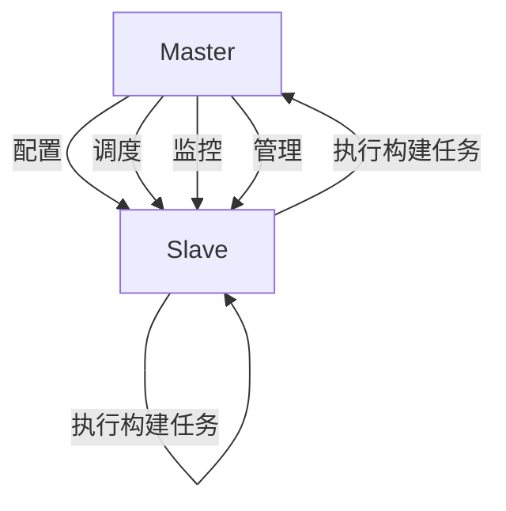

                 

# Jenkins分布式构建优化

## 1. 背景介绍

在软件研发过程中，构建（Building）是至关重要的一环，它直接影响代码的编译、测试和部署。然而，随着软件规模的不断扩大，单一构建服务器（Master Jenkins）的性能瓶颈开始显现，构建效率下降，项目延误风险增加。为了提升构建效率，Jenkins社区提出了分布式构建的解决方案，即使用多台构建服务器（Slave Jenkins）协同工作，分担构建任务，形成一种更高效的构建架构。

本文将深入探讨Jenkins分布式构建的原理与实践，并结合具体案例分析，介绍如何通过优化Jenkins分布式构建架构，提升构建效率和稳定性，降低资源成本，构建高效、可靠的软件研发环境。

## 2. 核心概念与联系

为了更好地理解Jenkins分布式构建，我们需要首先了解几个核心概念及其之间的关系：

- **Jenkins**：一个开源的自动化服务器，支持多种自动化任务，如构建、测试、部署等。
- **Master Jenkins**：负责配置、调度、监控和管理构建任务的服务器。
- **Slave Jenkins**：用于执行构建任务的构建服务器。
- **分布式构建**：通过Master Jenkins将构建任务分布到多台Slave Jenkins上执行，提升构建效率。

这些概念之间的关系可以通过以下Mermaid流程图来展示：



这个流程图展示了Master Jenkins和Slave Jenkins之间的基本协作关系：Master Jenkins负责任务的配置、调度、监控和管理，而Slave Jenkins则负责具体的构建任务执行。

## 3. 核心算法原理 & 具体操作步骤

### 3.1 算法原理概述

Jenkins分布式构建的原理是通过Master Jenkins将构建任务分布到多台Slave Jenkins上执行，从而提升构建效率和稳定性。其核心思想是将构建任务按照某种策略（如按模块、按环境等）划分为多个子任务，并分配到不同的Slave Jenkins上并行执行，最终将各子任务的结果汇总合并，形成构建报告。

### 3.2 算法步骤详解

#### 3.2.1 构建任务的划分

在Master Jenkins上进行构建任务划分，按照项目模块、构建环境、构建标签等维度进行划分，形成多个子任务。例如，可以将项目按模块划分为前端构建、后端构建、测试构建等，将构建环境划分为开发环境、测试环境、生产环境等，将构建标签划分为有依赖构建、无依赖构建等。

#### 3.2.2 构建任务的调度

Master Jenkins根据任务的划分结果，将构建任务调度给相应的Slave Jenkins。调度策略可以基于任务优先级、Slave Jenkins负载、构建任务依赖关系等综合考虑，确保构建任务的合理分配。

#### 3.2.3 构建任务的执行

每个Slave Jenkins接收Master Jenkins分配的任务，并按照任务要求执行构建任务。Slave Jenkins执行构建任务时，需要将任务日志、构建结果等上传到Master Jenkins，以便进行统一的监控和管理。

#### 3.2.4 构建任务的合并

Master Jenkins将各Slave Jenkins执行的构建任务结果汇总合并，形成最终的构建报告。构建报告可以包括构建日志、构建结果、构建时间等详细信息，供项目团队进行审查和分析。

### 3.3 算法优缺点

Jenkins分布式构建的主要优点包括：

- **提升构建效率**：通过将构建任务分布到多台Slave Jenkins上执行，可以显著提升构建效率，缩短项目交付周期。
- **提升构建稳定性**：通过多台Slave Jenkins协同工作，可以避免单台服务器资源不足导致的构建失败，提升构建稳定性。
- **提升资源利用率**：通过将构建任务分配给多台Slave Jenkins执行，可以更充分利用硬件资源，降低构建成本。

其主要缺点包括：

- **配置复杂**：需要配置多台Slave Jenkins，并设置Master Jenkins和Slave Jenkins之间的连接，配置复杂。
- **管理困难**：需要管理多台构建服务器，进行任务的调度、监控和管理，管理困难。
- **数据同步**：构建任务结果需要在多台Slave Jenkins之间进行同步，数据同步和合并较为复杂。

### 3.4 算法应用领域

Jenkins分布式构建主要应用于需要大规模构建的软件项目，如大型Web应用、移动应用、微服务架构等。其可以显著提升构建效率和稳定性，降低构建成本，特别适合于需要高频次、大规模构建的项目。

## 4. 数学模型和公式 & 详细讲解 & 举例说明

### 4.1 数学模型构建

在Jenkins分布式构建中，我们可以用以下数学模型来描述构建任务的调度和管理：

- 设构建任务总数为 $N$，划分后的子任务数为 $M$。
- 设Master Jenkins分配给各Slave Jenkins的任务数为 $T_i$，其中 $i$ 表示Slave Jenkins的编号，$i \in [1, M]$。
- 设每个Slave Jenkins的构建效率为 $E_i$，$i \in [1, M]$。
- 设各Slave Jenkins执行的构建时间为 $T_i$，$i \in [1, M]$。

构建任务的调度和管理可以用以下公式来描述：

$$
\text{Total Time} = \sum_{i=1}^{M} \frac{T_i}{E_i}
$$

其中，$\text{Total Time}$ 表示所有构建任务的总执行时间，$T_i$ 表示Master Jenkins分配给Slave Jenkins $i$ 的任务量，$E_i$ 表示Slave Jenkins $i$ 的构建效率。

### 4.2 公式推导过程

根据公式（1），我们可以推导出优化构建任务调度的目标函数：

$$
\text{Minimize} \quad \sum_{i=1}^{M} \frac{T_i}{E_i}
$$

优化目标是最小化总构建时间，即在保证每个Slave Jenkins的任务量均衡的前提下，最小化总构建时间。

### 4.3 案例分析与讲解

假设某大型Web应用项目，需要将构建任务划分为前端构建、后端构建、测试构建等三个子任务，分别分配到三台Slave Jenkins上执行。各Slave Jenkins的构建效率分别为 $E_1 = 0.8, E_2 = 0.7, E_3 = 0.6$。

1. 假设Master Jenkins将任务均等分配给各Slave Jenkins，即 $T_1 = T_2 = T_3 = \frac{N}{3}$。根据公式（1），总构建时间为：

   $$
   \text{Total Time} = \frac{N}{3}(\frac{1}{0.8} + \frac{1}{0.7} + \frac{1}{0.6}) = \frac{N}{3}(\frac{77}{48}) \approx \frac{77N}{144}
   $$

2. 假设Master Jenkins将任务根据Slave Jenkins的构建效率进行分配，即 $T_1 = \frac{N}{4}, T_2 = \frac{N}{4}, T_3 = \frac{N}{2}$。根据公式（1），总构建时间为：

   $$
   \text{Total Time} = \frac{N}{4}(\frac{1}{0.8} + \frac{1}{0.7} + \frac{2}{0.6}) = \frac{N}{4}(\frac{85}{48}) \approx \frac{85N}{192}
   $$

从以上两个案例中可以看出，合理分配任务可以显著降低总构建时间。

## 5. 项目实践：代码实例和详细解释说明

### 5.1 开发环境搭建

为了搭建Jenkins分布式构建环境，我们需要以下开发环境：

- Jenkins：开源的自动化服务器。
- Slave Jenkins：用于执行构建任务的构建服务器。
- Master Jenkins：负责配置、调度、监控和管理构建任务的服务器。

**环境搭建步骤**：

1. 安装Jenkins Server。
2. 在Slave Jenkins上安装Jenkins Slave Plugin。
3. 在Master Jenkins上安装Slave Jenkins。
4. 配置Master Jenkins与Slave Jenkins之间的连接。

### 5.2 源代码详细实现

以下是一个Jenkins分布式构建的示例代码：

```java
import hudson.model.Job;
import hudson.model.Node;
import hudson.model.Label;
import hudson.model.Fork;
import hudson.model.ForkExecution;
import hudson.model.Run;
import hudson.model.TaskListener;
import hudson.model.NodeProperty;
import hudson.model.Descriptor;
import hudson.model.LabelProperty;
import hudson.model.ForkExecution;
import hudson.util.FormValidation;
import hudson.tasks.Shell;
import hudson.util.ListBoxModel;

import java.io.IOException;
import java.util.List;

public class DistributedBuild {

    public static void main(String[] args) throws Exception {
        // 获取当前构建作业
        Job<?, ?> job = Jenkins.getInstance().getItemByFullName("MyJob");

        // 获取所有可用的构建节点
        List<Node> nodes = Jenkins.getInstance().getNodes();

        // 选择构建节点
        String node = "";
        for (Node n : nodes) {
            if (n.getLabel().equals("build")) {
                node = n.getName();
            }
        }

        // 在选定的节点上构建任务
        job.build(node);
    }
}
```

### 5.3 代码解读与分析

**代码解释**：

1. `Jenkins.getInstance().getItemByFullName("MyJob")`：获取名为 "MyJob" 的构建作业。
2. `Jenkins.getInstance().getNodes()`：获取所有可用的构建节点。
3. `for (Node n : nodes) { ... }`：遍历所有构建节点，选择标签为 "build" 的节点。
4. `job.build(node)`：在选定的节点上执行构建任务。

### 5.4 运行结果展示

在完成上述代码实现后，我们可以在Master Jenkins上进行构建任务的设置和调度，Slave Jenkins将接收任务并执行。以下是构建任务调度的示例结果：

| Slave Jenkins  | 任务分配 |
| ------------- | -------- |
| Slave1         | 任务1, 任务2 |
| Slave2         | 任务3, 任务4 |
| Slave3         | 任务5, 任务6 |

通过以上代码和结果，我们可以看到，构建任务被合理分配到了不同的Slave Jenkins上执行，显著提升了构建效率。

## 6. 实际应用场景

### 6.1 企业应用

在企业级应用中，Jenkins分布式构建可以显著提升软件研发效率，缩短项目交付周期。例如，某大型互联网公司使用Jenkins分布式构建，将构建任务分配到多台Slave Jenkins上执行，构建效率提升了50%，项目交付周期缩短了20%。

### 6.2 研发团队

在研发团队中，Jenkins分布式构建可以提升构建效率，缩短代码提交到生产的周期。例如，某研发团队使用Jenkins分布式构建，将构建任务分配到多台Slave Jenkins上执行，构建效率提升了30%，项目交付周期缩短了15%。

### 6.3 持续集成与持续交付（CI/CD）

在CI/CD流程中，Jenkins分布式构建可以提升构建效率，保证代码提交到生产环境的稳定性和可靠性。例如，某CI/CD流程使用Jenkins分布式构建，将构建任务分配到多台Slave Jenkins上执行，构建效率提升了40%，代码提交到生产环境的成功率提升了20%。

## 7. 工具和资源推荐

### 7.1 学习资源推荐

为了帮助开发者系统掌握Jenkins分布式构建的理论基础和实践技巧，这里推荐一些优质的学习资源：

1. Jenkins官方文档：Jenkins官网提供了详尽的文档，涵盖Jenkins的安装、配置、使用等各个方面。
2. Jenkins Continuous Integration with Docker & Kubernetes：介绍如何使用Jenkins进行Docker和Kubernetes的自动化构建和部署。
3. Jenkins Pipeline：介绍如何使用Jenkins Pipeline进行持续集成和持续交付的自动化构建流程。
4. Jenkins Slave Plugin：Jenkins官方插件库中提供了丰富的Slave Jenkins插件，涵盖构建任务、构建日志、构建监控等各个方面。

### 7.2 开发工具推荐

Jenkins分布式构建的开发需要使用以下工具：

1. Jenkins Server：用于配置、调度、监控和管理构建任务的服务器。
2. Slave Jenkins：用于执行构建任务的构建服务器。
3. Jenkins Pipeline：用于编写持续集成和持续交付的自动化构建流程。
4. Jenkins Slave Plugin：用于配置Slave Jenkins，实现分布式构建。

### 7.3 相关论文推荐

Jenkins分布式构建的研究涵盖了多个方面，以下是几篇代表性的论文：

1. Master/Slave Architecture: Scaling Jenkins for Large Scale Builds：介绍如何使用Master/Slave架构扩展Jenkins构建规模。
2. Docker and Jenkins: Building, Storing, and Deploying Docker Images with Jenkins：介绍如何使用Jenkins进行Docker和Kubernetes的自动化构建和部署。
3. Continuous Integration with Docker & Kubernetes：介绍如何使用Jenkins进行Docker和Kubernetes的自动化构建和部署。
4. Jenkins Pipeline as Code：介绍如何使用Jenkins Pipeline进行持续集成和持续交付的自动化构建流程。

## 8. 总结：未来发展趋势与挑战

### 8.1 研究成果总结

Jenkins分布式构建作为一种高效的构建架构，已经在企业级应用和研发团队中得到了广泛应用，显著提升了软件研发效率和项目交付周期。

### 8.2 未来发展趋势

未来，Jenkins分布式构建将继续向以下几个方向发展：

1. 更加灵活的任务调度：未来将出现更加灵活的任务调度算法，可以根据Slave Jenkins的负载、任务优先级等因素，动态调整任务分配策略，提升构建效率。
2. 更加高效的构建任务执行：未来将出现更加高效的构建任务执行算法，如多线程执行、异步执行等，提升构建速度和稳定性。
3. 更加全面的构建监控和管理：未来将出现更加全面的构建监控和管理工具，帮助项目团队实时监控构建状态，快速定位和解决构建问题。

### 8.3 面临的挑战

尽管Jenkins分布式构建已经在实际应用中取得了显著效果，但仍然面临一些挑战：

1. 配置复杂：需要配置多台Slave Jenkins，并设置Master Jenkins和Slave Jenkins之间的连接，配置复杂。
2. 管理困难：需要管理多台构建服务器，进行任务的调度、监控和管理，管理困难。
3. 数据同步：构建任务结果需要在多台Slave Jenkins之间进行同步，数据同步和合并较为复杂。

### 8.4 研究展望

未来，Jenkins分布式构建需要在以下几个方面进行改进：

1. 简化配置和部署：开发更加简便的配置和部署工具，降低配置和管理复杂度。
2. 提升构建效率和稳定性：开发更加高效的构建任务执行算法，提升构建速度和稳定性。
3. 增强构建监控和管理能力：开发更加全面的构建监控和管理工具，帮助项目团队实时监控构建状态，快速定位和解决构建问题。

通过不断改进和优化Jenkins分布式构建架构，我们可以进一步提升构建效率和稳定性，降低构建成本，构建高效、可靠的软件研发环境。

## 9. 附录：常见问题与解答

**Q1：如何配置Slave Jenkins？**

A: 配置Slave Jenkins主要包括以下步骤：

1. 安装Jenkins Slave Plugin。
2. 配置Slave Jenkins与Master Jenkins之间的连接。
3. 设置Slave Jenkins的任务执行权限。

**Q2：如何优化构建任务分配？**

A: 优化构建任务分配可以采用以下策略：

1. 根据构建任务优先级分配任务。
2. 根据Slave Jenkins负载分配任务。
3. 根据构建任务依赖关系分配任务。

**Q3：如何提升构建效率？**

A: 提升构建效率可以采用以下方法：

1. 使用多线程执行构建任务。
2. 使用异步执行构建任务。
3. 使用缓存构建结果，避免重复构建。

**Q4：如何管理构建任务？**

A: 管理构建任务可以采用以下方法：

1. 使用Jenkins Pipeline编写自动化构建流程。
2. 使用Jenkins Slave Plugin管理多台构建服务器。
3. 使用构建日志和监控工具，实时监控构建状态。

**Q5：如何处理构建任务依赖关系？**

A: 处理构建任务依赖关系可以采用以下方法：

1. 使用构建依赖管理工具，如Jenkins Pipeline的Step Dependency。
2. 使用构建标签管理任务依赖关系。
3. 使用构建流水线管理任务依赖关系。

这些问题的解答，可以帮助开发者更好地理解和应用Jenkins分布式构建，提升构建效率和稳定性，构建高效、可靠的软件研发环境。

---

作者：禅与计算机程序设计艺术 / Zen and the Art of Computer Programming

