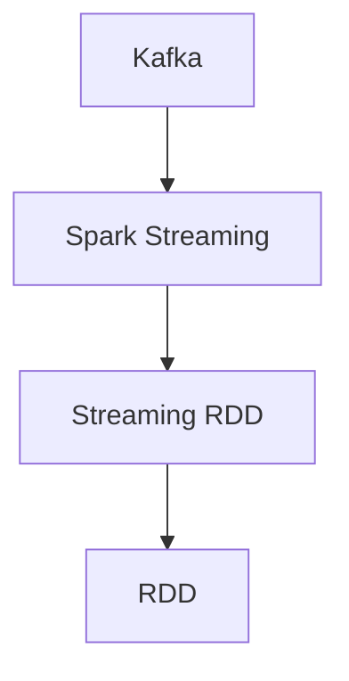

                 

# Kafka-Spark Streaming整合原理与代码实例讲解

> 关键词：Kafka, Spark, Streaming, 实时数据处理, 高吞吐量, 低延迟, 微批处理, 高可扩展性

## 1. 背景介绍

### 1.1 问题由来

在大数据时代，实时数据的处理和分析成为各行业中的关键需求。传统的数据处理流程往往存在延迟大、处理效率低、系统扩展性差等问题，难以满足实时性和高可用性的要求。

Kafka-Spark Streaming（Kafka + Spark Streaming）是一个广受欢迎的大数据处理框架，将Kafka的高吞吐量、低延迟和Spark的高可扩展性、高效性完美结合，形成了强大的实时数据处理能力。

### 1.2 问题核心关键点

Kafka-Spark Streaming的核心在于实现数据流式处理，即利用Kafka的高吞吐量和Spark的高处理能力，实现实时数据的采集、存储、处理和分析。其关键点包括：

- Kafka：分布式流处理平台，用于实时数据的采集、传输和存储。
- Spark Streaming：基于Spark的大数据流处理框架，用于实时数据的分布式处理和分析。

Kafka-Spark Streaming通过Kafka的可靠消息队列作为Spark Streaming的输入源，实现数据的高效流式传输和处理，显著提升实时数据的处理效率和系统的扩展性。

### 1.3 问题研究意义

Kafka-Spark Streaming在实时数据处理中的应用极为广泛，尤其是在电商、金融、社交网络、物联网等领域，具有显著的优势：

1. **高吞吐量**：通过分布式架构，Kafka-Spark Streaming可以处理海量实时数据，满足大数据时代的实时需求。
2. **低延迟**：采用微批处理方式，Kafka-Spark Streaming能够快速响应数据变化，降低数据处理延迟。
3. **高可扩展性**：支持水平扩展，Kafka-Spark Streaming可以动态调整节点数量，提升系统的处理能力。
4. **高可用性**：基于分布式架构和容错机制，Kafka-Spark Streaming能够保障系统的高可用性和数据可靠性。

Kafka-Spark Streaming的应用不仅能够显著提高数据处理效率，还能优化资源利用率，降低系统复杂度，是构建高性能、高可用、高扩展性的实时数据处理系统的理想选择。

## 2. 核心概念与联系

### 2.1 核心概念概述

为了更好地理解Kafka-Spark Streaming的整合原理，本节将介绍几个密切相关的核心概念：

- Kafka：分布式流处理平台，提供高性能、可靠的消息传输服务。
- Spark Streaming：基于Spark的实时数据流处理框架，支持高可扩展性和高效处理。
- RDD：弹性分布式数据集，Spark的核心数据抽象，支持高效的内存计算和分布式处理。
- Streaming RDD：Spark Streaming中的核心数据结构，用于流式数据处理。

这些核心概念之间的逻辑关系可以通过以下Mermaid流程图来展示：



这个流程图展示了Kafka、Spark Streaming、Streaming RDD和RDD之间的关系：

1. Kafka作为数据的输入源，提供高吞吐量的消息传输服务。
2. Spark Streaming利用Kafka的流数据，通过Streaming RDD进行高效处理。
3. Streaming RDD建立在RDD之上，支持流式数据的分布式处理和分析。

## 3. 核心算法原理 & 具体操作步骤

### 3.1 算法原理概述

Kafka-Spark Streaming的核心算法原理主要涉及两个方面：

1. **数据流式传输与处理**：利用Kafka的消息队列，实现数据的可靠传输。通过Spark Streaming的Streaming RDD，实现数据的高效处理。
2. **微批处理**：采用微批处理方式，将实时数据划分为多个微批次进行处理，提升处理效率和系统稳定性。

### 3.2 算法步骤详解

Kafka-Spark Streaming的实现过程主要包括以下几个关键步骤：

**Step 1: 准备Kafka和Spark Streaming环境**

1. 安装Apache Kafka和Apache Spark。
2. 配置Kafka和Spark Streaming的参数，包括broker地址、分区数、批处理大小等。

**Step 2: 创建Kafka生产者和消费者**

1. 在Kafka中创建主题。
2. 使用Kafka-producer API创建数据生产者，将数据写入Kafka主题。
3. 使用Kafka-consumer API创建数据消费者，从Kafka主题中读取数据。

**Step 3: 创建Spark Streaming应用程序**

1. 创建Spark Streaming Context，指定Kafka主题为输入源。
2. 创建Streaming RDD，用于处理Kafka中的数据。
3. 对Streaming RDD进行各种操作，如过滤、聚合、转换等。
4. 对处理结果进行持久化或输出，如写入数据库、存储到文件等。

**Step 4: 运行和监控Spark Streaming应用程序**

1. 启动Spark Streaming应用程序。
2. 使用Spark Streaming的监控工具（如Web UI），实时查看处理过程和性能指标。

### 3.3 算法优缺点

Kafka-Spark Streaming的主要优点包括：

1. **高吞吐量**：Kafka的高吞吐量特性，结合Spark的分布式计算能力，可以实现大规模数据的实时处理。
2. **低延迟**：通过微批处理方式，Kafka-Spark Streaming可以显著降低数据处理延迟，满足实时需求。
3. **高可扩展性**：Kafka和Spark都可以水平扩展，系统可以根据数据量和处理需求动态调整节点数量。
4. **高可用性**：Kafka和Spark都具备高可用性，支持故障转移和数据备份，保障系统的可靠性和数据安全。

Kafka-Spark Streaming的主要缺点包括：

1. **系统复杂度**：实现和维护Kafka-Spark Streaming需要较高的技术门槛，系统复杂度较高。
2. **资源消耗**：由于需要同时运行Kafka和Spark，系统的资源消耗较大，对硬件要求较高。
3. **延迟限制**：微批处理的机制虽然减少了延迟，但在某些场景下可能无法满足对延迟要求极高的应用。

### 3.4 算法应用领域

Kafka-Spark Streaming广泛应用于需要实时数据处理的各个领域，例如：

- **电商推荐系统**：利用Kafka实时收集用户行为数据，通过Spark Streaming进行数据分析，生成推荐结果。
- **金融交易监控**：实时监控股票、基金等金融产品的交易数据，及时发现异常交易行为。
- **社交媒体分析**：实时分析社交媒体平台上的用户言论和行为数据，进行舆情分析和用户行为预测。
- **物联网数据处理**：实时处理物联网设备生成的数据，进行设备状态监测和异常检测。
- **物流监控**：实时监控物流运输过程中的数据，提高运输效率和安全性。

这些应用场景展示了Kafka-Spark Streaming在实时数据处理中的广泛适用性，是构建高性能、高可用、高扩展性的实时数据处理系统的有力工具。

## 4. 数学模型和公式 & 详细讲解 & 举例说明

### 4.1 数学模型构建

Kafka-Spark Streaming的数学模型主要涉及两个方面：

1. **数据流模型**：用于描述数据从Kafka传输到Spark Streaming的过程。
2. **批处理模型**：用于描述微批处理的过程。

### 4.2 公式推导过程

#### 4.2.1 数据流模型

设$K(t)$表示Kafka在时间$t$时刻的累积数据量，$S(t)$表示Spark Streaming在时间$t$时刻的累积数据量，$T(t)$表示Spark Streaming和Kafka之间的数据传输延迟，则数据流模型可以表示为：

$$
S(t) = K(t) + T(t)
$$

#### 4.2.2 批处理模型

设$D_{i,j}$表示第$i$个微批次包含的$j$个数据项，$W$表示微批处理的窗口大小，$B(t)$表示时间$t$时刻正在处理的数据项数量，则批处理模型可以表示为：

$$
B(t) = \sum_{j=0}^{W-1} D_{i,j}
$$

其中$i$表示微批处理的编号。

### 4.3 案例分析与讲解

以电商推荐系统为例，分析Kafka-Spark Streaming的工作流程和数学模型：

1. **数据收集**：用户点击、浏览、购买等行为数据通过Web日志、APP日志等形式，实时写入Kafka主题。
2. **数据传输**：Kafka将数据以高吞吐量的方式传输到Spark Streaming。
3. **数据处理**：Spark Streaming将数据分成微批次进行处理，对用户行为数据进行分析和建模。
4. **推荐生成**：根据用户行为数据，生成推荐结果，并将其输出到推荐引擎中。

在这个过程中，数据的流式传输和微批处理模型可以表示为：

$$
S(t) = K(t) + T(t)
$$

$$
B(t) = \sum_{j=0}^{W-1} D_{i,j}
$$

其中$K(t)$表示Kafka在时间$t$时刻的累积数据量，$S(t)$表示Spark Streaming在时间$t$时刻的累积数据量，$T(t)$表示数据传输延迟，$D_{i,j}$表示第$i$个微批次包含的$j$个数据项，$W$表示微批处理的窗口大小。

## 5. 项目实践：代码实例和详细解释说明

### 5.1 开发环境搭建

在进行Kafka-Spark Streaming开发前，需要准备以下开发环境：

1. 安装Apache Kafka和Apache Spark。
2. 配置Kafka和Spark Streaming的参数，包括broker地址、分区数、批处理大小等。
3. 下载并配置Kafka-producer API和Kafka-consumer API。

以下是Kafka和Spark Streaming的安装和配置示例：

**安装Kafka和Spark**：

```bash
# 安装Kafka
wget https://downloads.apache.org/kafka/2.12.0/kafka_2.12-2.12.0.tgz
tar -xzf kafka_2.12-2.12.0.tgz
cd kafka_2.12-2.12.0

# 安装Spark
wget https://downloads.apache.org/spark/spark-3.1.2/spark-3.1.2.tgz
tar -xzf spark-3.1.2.tgz
cd spark-3.1.2
```

**配置Kafka和Spark Streaming参数**：

```bash
# Kafka参数配置
export KAFKA_HOME=/path/to/kafka_2.12-2.12.0
export KAFKA_CONFIG_DIR=$KAFKA_HOME/config

# Spark Streaming参数配置
export SPARK_HOME=/path/to/spark-3.1.2
export SPARK_CONFIG_DIR=$SPARK_HOME/config
export SPARK_MASTER=local
export SPARK_UI_PORT=4040
```

### 5.2 源代码详细实现

以下是一个Kafka-Spark Streaming的应用示例，用于实时监控日志数据并输出到数据库：

**Kafka生产者代码**：

```python
from kafka import KafkaProducer

# 创建Kafka生产者
producer = KafkaProducer(bootstrap_servers='localhost:9092',
                        key_serializer=str.encode,
                        value_serializer=str.encode)

# 发送数据到Kafka主题
producer.send('log_topic', 'This is a log message.')
producer.flush()
```

**Kafka消费者代码**：

```python
from kafka import KafkaConsumer
from pyspark.sql.functions import col, lit

# 创建Kafka消费者
consumer = KafkaConsumer('log_topic',
                        bootstrap_servers='localhost:9092',
                        value_deserializer=lambda v: v.decode())

# 将Kafka数据转换为RDD
rdd = spark.sparkContext.parallelize(consumer)

# 将RDD写入数据库
table = rdd.map(lambda x: (col(x[0]), lit(x[1]))).toDF(['id', 'message'])
table.write.format('jdbc').options(url='jdbc:mysql://localhost:3306/mydb',
                               dbtable='log_table', user='root', password='password').mode('append').save()
```

**Spark Streaming应用程序代码**：

```python
from pyspark.streaming import StreamingContext
from pyspark.streaming.kafka import KafkaUtils
from pyspark.sql.functions import col, lit

# 创建Spark Streaming Context
spark = SparkSession.builder.appName('KafkaSparkStreaming').getOrCreate()
ssc = StreamingContext(spark.sparkContext, 2)

# 创建Kafka Stream
kafka_stream = KafkaUtils.createDirectStream(ssc, ['topic'], {
    'bootstrap.servers': 'localhost:9092',
    'key.deserializer': str,
    'value.deserializer': str
})

# 创建Streaming RDD
streaming_rdd = kafka_stream.map(lambda (k, v): (v, 1)).reduceByKey(lambda a, b: a + b)

# 将Streaming RDD写入数据库
table = streaming_rdd.toDF('message', 'count').withColumn('timestamp', lit(ssc.elapsedTime().totalSeconds()))
table.write.format('jdbc').options(url='jdbc:mysql://localhost:3306/mydb',
                               dbtable='log_table', user='root', password='password').mode('append').save()

# 启动Spark Streaming应用程序
ssc.start()
ssc.awaitTermination()
```

### 5.3 代码解读与分析

**Kafka生产者**：

- 使用KafkaProducer发送数据到Kafka主题。
- `bootstrap_servers`参数指定Kafka集群地址。
- `key_serializer`和`value_serializer`参数指定数据的序列化方式。

**Kafka消费者**：

- 使用KafkaConsumer从Kafka主题中读取数据。
- `value_deserializer`参数指定数据的反序列化方式。
- 将Kafka数据转换为RDD，并进行必要的数据处理。

**Spark Streaming应用程序**：

- 创建Spark Streaming Context，并设置批处理间隔时间。
- 使用KafkaUtils创建Kafka Stream，将Kafka数据转换为Streaming RDD。
- 对Streaming RDD进行聚合操作，计算每个消息的出现次数。
- 将处理结果写入数据库，保存为日志表。
- 启动Spark Streaming应用程序，并等待程序结束。

## 6. 实际应用场景

### 6.1 智能推荐系统

Kafka-Spark Streaming在智能推荐系统中发挥着关键作用。通过实时收集用户行为数据，并进行数据分析和建模，可以生成个性化推荐结果，提升用户体验和推荐效果。

具体实现步骤如下：

1. **数据采集**：利用Kafka实时采集用户行为数据，如点击、浏览、购买等。
2. **数据处理**：使用Spark Streaming对数据进行处理，进行特征提取和建模。
3. **推荐生成**：基于处理后的数据，使用机器学习算法生成推荐结果。
4. **推荐输出**：将推荐结果输出到推荐引擎中，实时推送给用户。

**代码实现示例**：

```python
# 数据采集
kafka_producer = KafkaProducer(bootstrap_servers='localhost:9092',
                              key_serializer=str.encode,
                              value_serializer=str.encode)

kafka_producer.send('user_behavior_topic', 'User clicked item id: 12345')

# 数据处理
spark = SparkSession.builder.appName('RecommendationSystem').getOrCreate()
ssc = StreamingContext(spark.sparkContext, 2)

kafka_stream = KafkaUtils.createDirectStream(ssc, ['user_behavior_topic'], {
    'bootstrap.servers': 'localhost:9092',
    'key.deserializer': str,
    'value.deserializer': str
})

# 特征提取和建模
rdd = kafka_stream.map(lambda x: (x[1], 1)).reduceByKey(lambda a, b: a + b)

# 推荐生成
recommender = MLlibRegressionRecommender()
recommender.train(rdd)

# 推荐输出
recommender.predict(rdd).saveAsStream('recommendations')
```

### 6.2 金融交易监控

Kafka-Spark Streaming在金融交易监控中也有广泛应用。通过实时监控交易数据，及时发现异常交易行为，保障金融系统的安全和稳定。

具体实现步骤如下：

1. **数据采集**：利用Kafka实时采集交易数据，包括交易时间、金额、交易对象等。
2. **数据处理**：使用Spark Streaming对数据进行处理，进行异常检测和统计分析。
3. **异常报警**：根据处理结果，触发异常报警机制，通知相关人员进行处理。

**代码实现示例**：

```python
# 数据采集
kafka_producer = KafkaProducer(bootstrap_servers='localhost:9092',
                              key_serializer=str.encode,
                              value_serializer=str.encode)

kafka_producer.send('trade_topic', 'Trade time: 2022-01-01 08:00:00, amount: 1000000, trader: A001')

# 数据处理
spark = SparkSession.builder.appName('TradeMonitor').getOrCreate()
ssc = StreamingContext(spark.sparkContext, 2)

kafka_stream = KafkaUtils.createDirectStream(ssc, ['trade_topic'], {
    'bootstrap.servers': 'localhost:9092',
    'key.deserializer': str,
    'value.deserializer': str
})

# 异常检测和统计分析
rdd = kafka_stream.map(lambda x: (x[1], 1)).reduceByKey(lambda a, b: a + b)

# 异常报警
if rdd.count() > 10:
    print('Exception detected!')

# 保存处理结果
rdd.saveAsStream('trade_results')
```

### 6.3 物联网数据处理

Kafka-Spark Streaming在物联网数据处理中也有重要应用。通过实时处理物联网设备生成的数据，进行设备状态监测和异常检测，提升物联网系统的可靠性和安全性。

具体实现步骤如下：

1. **数据采集**：利用Kafka实时采集物联网设备生成的数据，如温度、湿度、压力等。
2. **数据处理**：使用Spark Streaming对数据进行处理，进行状态监测和异常检测。
3. **设备告警**：根据处理结果，发送告警信息到相关设备，进行故障恢复或维护。

**代码实现示例**：

```python
# 数据采集
kafka_producer = KafkaProducer(bootstrap_servers='localhost:9092',
                              key_serializer=str.encode,
                              value_serializer=str.encode)

kafka_producer.send('sensor_topic', 'Sensor ID: 123456, temperature: 25.5, humidity: 60.2')

# 数据处理
spark = SparkSession.builder.appName('IoTDataMonitor').getOrCreate()
ssc = StreamingContext(spark.sparkContext, 2)

kafka_stream = KafkaUtils.createDirectStream(ssc, ['sensor_topic'], {
    'bootstrap.servers': 'localhost:9092',
    'key.deserializer': str,
    'value.deserializer': str
})

# 设备告警
if kafka_stream.count() > 0:
    print('Device alert!')

# 保存处理结果
kafka_stream.saveAsStream('sensor_results')
```

## 7. 工具和资源推荐

### 7.1 学习资源推荐

为了帮助开发者系统掌握Kafka-Spark Streaming的理论基础和实践技巧，这里推荐一些优质的学习资源：

1. **Kafka官方文档**：Kafka官网提供了详细的文档，包括安装、配置、使用等方面的详细说明。
2. **Spark官方文档**：Spark官网提供了详细的文档，包括安装、配置、使用等方面的详细说明。
3. **Kafka与Spark Streaming实战**：一本详细介绍Kafka和Spark Streaming应用的书籍，适合实战练习。
4. **Spark Streaming官方示例**：Spark官网提供了丰富的示例代码，涵盖数据采集、处理、输出等各个环节。
5. **Kafka与Spark Streaming案例分析**：一系列关于Kafka和Spark Streaming的实际应用案例，帮助理解其在实际项目中的应用。

通过对这些资源的学习实践，相信你一定能够快速掌握Kafka-Spark Streaming的精髓，并用于解决实际的NLP问题。

### 7.2 开发工具推荐

高效的开发离不开优秀的工具支持。以下是几款用于Kafka-Spark Streaming开发的常用工具：

1. Kafka：用于实时数据采集和传输的分布式流处理平台。
2. Spark：用于实时数据处理和分析的分布式计算框架。
3. PySpark：Python版本的Spark，提供易用的API和接口。
4. Web UI：Kafka和Spark Streaming的监控工具，用于实时查看处理过程和性能指标。
5. Jupyter Notebook：交互式编程环境，适合快速原型设计和实验验证。

合理利用这些工具，可以显著提升Kafka-Spark Streaming开发的效率，加快创新迭代的步伐。

### 7.3 相关论文推荐

Kafka-Spark Streaming的研究和应用也在不断演进，以下是几篇奠基性的相关论文，推荐阅读：

1. **Kafka: A Real-Time Distributed Streaming Platform**：Kafka的原创论文，介绍了Kafka的架构和核心功能。
2. **Spark Streaming with Kafka: Fast and Scalable Streaming Processing**：关于Kafka和Spark Streaming结合的论文，介绍了两者的优势和整合方法。
3. **Efficient Real-time Processing of Data Streams**：关于Spark Streaming的论文，介绍了Spark Streaming的架构和高效处理机制。
4. **Real-time Streaming with Apache Spark Streaming**：关于Spark Streaming的论文，介绍了Spark Streaming的实时处理能力。
5. **Kafka and Spark Streaming: Towards Fast and Scalable Stream Processing**：关于Kafka和Spark Streaming结合的论文，介绍了两者的高效数据处理能力。

这些论文代表了大数据流处理的演进，展示了Kafka-Spark Streaming的发展脉络和前沿技术，是深入理解其工作原理的宝贵资源。

## 8. 总结：未来发展趋势与挑战

### 8.1 总结

本文对Kafka-Spark Streaming进行了全面系统的介绍。首先阐述了Kafka-Spark Streaming的研究背景和意义，明确了其在实时数据处理中的关键作用。其次，从原理到实践，详细讲解了Kafka-Spark Streaming的数学模型和算法步骤，给出了完整的代码实例。同时，本文还广泛探讨了Kafka-Spark Streaming在智能推荐、金融交易监控、物联网数据处理等多个领域的应用前景，展示了其强大的实时数据处理能力。此外，本文精选了Kafka-Spark Streaming的学习资源、开发工具和相关论文，力求为读者提供全方位的技术指引。

通过本文的系统梳理，可以看到，Kafka-Spark Streaming在实时数据处理中的应用极为广泛，是大数据时代不可或缺的重要工具。未来，随着技术的不断演进，Kafka-Spark Streaming必将在实时数据处理领域发挥更大的作用，推动大数据技术的发展和应用。

### 8.2 未来发展趋势

展望未来，Kafka-Spark Streaming的发展趋势主要体现在以下几个方面：

1. **高吞吐量**：随着硬件设备和网络带宽的提升，Kafka-Spark Streaming的处理能力将进一步提升，满足更多大规模数据的实时处理需求。
2. **低延迟**：通过优化批处理机制，采用更精细的时间粒度，Kafka-Spark Streaming将进一步降低数据处理延迟，满足更多对实时性要求高的应用场景。
3. **高可扩展性**：通过改进分布式架构和优化资源调度，Kafka-Spark Streaming将实现更高效的扩展，支持更大规模的数据处理。
4. **高可用性**：通过引入容错机制和备份策略，Kafka-Spark Streaming将保障更高的系统可用性和数据可靠性。

这些趋势将使Kafka-Spark Streaming在实时数据处理领域占据更加重要的地位，成为构建高性能、高可用、高扩展性的实时数据处理系统的有力工具。

### 8.3 面临的挑战

尽管Kafka-Spark Streaming在实时数据处理中已经取得了显著成就，但在迈向更加智能化、普适化应用的过程中，它仍面临着诸多挑战：

1. **系统复杂度**：实现和维护Kafka-Spark Streaming需要较高的技术门槛，系统复杂度较高，对于开发者要求较高。
2. **资源消耗**：由于需要同时运行Kafka和Spark，系统的资源消耗较大，对硬件要求较高。
3. **延迟限制**：微批处理的机制虽然减少了延迟，但在某些场景下可能无法满足对延迟要求极高的应用。
4. **异常处理**：在实时数据处理过程中，可能会遇到各种异常情况，需要更加完善的异常处理机制。

### 8.4 研究展望

面对Kafka-Spark Streaming所面临的挑战，未来的研究需要在以下几个方面寻求新的突破：

1. **降低系统复杂度**：简化Kafka-Spark Streaming的实现流程，提供更加易用的API和工具。
2. **优化资源消耗**：改进系统的资源调度和管理，降低硬件成本，提升资源利用率。
3. **提升延迟性能**：优化批处理机制，引入更加灵活的时间粒度，满足对延迟要求更高的应用。
4. **完善异常处理**：引入更加完善的异常处理机制，提高系统的稳定性和鲁棒性。

这些研究方向的探索，必将引领Kafka-Spark Streaming技术迈向更高的台阶，为构建高性能、高可用、高扩展性的实时数据处理系统提供有力支撑。

## 9. 附录：常见问题与解答

**Q1: Kafka-Spark Streaming和Apache Flink、Apache Storm等其他实时数据处理框架有何区别？**

A: Kafka-Spark Streaming、Apache Flink、Apache Storm都是常用的实时数据处理框架，它们的主要区别在于数据流处理的原理和实现方式：

1. Kafka-Spark Streaming基于微批处理机制，采用流式RDD进行数据处理。
2. Apache Flink采用流式计算框架，支持流式和批式数据的混合处理。
3. Apache Storm采用微批处理机制，支持实时数据的处理和状态维护。

Kafka-Spark Streaming的优势在于其高吞吐量和低延迟特性，适用于处理海量实时数据；Apache Flink适用于需要复杂状态维护和事务处理的场景；Apache Storm适用于高可用性和低延迟要求高的应用。

**Q2: Kafka-Spark Streaming如何处理数据延迟？**

A: Kafka-Spark Streaming的数据延迟主要受以下几个因素影响：

1. Kafka的分区数和批处理大小：分区数过多或批处理过大会增加数据传输延迟。
2. 网络带宽和硬件设备：网络带宽和硬件设备性能不足会增加数据处理延迟。
3. 数据量大小和数据处理方式：数据量过大或处理方式不当会增加数据处理延迟。

为降低数据延迟，可以采取以下措施：

1. 优化分区数和批处理大小：合理设置分区数和批处理大小，避免过度细粒度和过度粗粒度。
2. 提高网络带宽和硬件设备性能：使用高性能的网络设备和硬件设备，提升数据传输和处理能力。
3. 优化数据处理方式：采用更高效的数据处理方式，如按需触发、异步处理等，降低数据处理延迟。

**Q3: Kafka-Spark Streaming如何保证数据的可靠性？**

A: Kafka-Spark Streaming通过分布式架构和容错机制，保障数据的可靠性和高可用性：

1. Kafka采用分布式架构，通过多副本机制，确保数据的冗余和可靠性。
2. Spark Streaming通过数据持久化和备份机制，确保数据的可靠性和高可用性。
3. 结合Kafka和Spark Streaming，可以进一步提升数据的可靠性，确保数据的完整性和一致性。

通过上述措施，Kafka-Spark Streaming能够有效保证数据的可靠性，满足高可用性要求的应用场景。

**Q4: Kafka-Spark Streaming在多节点环境下如何进行优化？**

A: 在多节点环境下，Kafka-Spark Streaming可以通过以下措施进行优化：

1. 合理配置Kafka和Spark Streaming参数，避免过度细粒度和过度粗粒度。
2. 使用多节点分布式架构，提升系统的处理能力和扩展性。
3. 使用缓存和异步处理机制，减少数据传输和处理延迟。
4. 优化资源调度和管理，确保系统的高可用性和稳定性。

通过这些优化措施，可以提升Kafka-Spark Streaming在多节点环境下的性能和可靠性。

**Q5: Kafka-Spark Streaming在实时数据处理中如何应用机器学习？**

A: Kafka-Spark Streaming结合机器学习，可以实现更加复杂和智能的数据处理任务：

1. 利用Kafka实时采集数据，通过Spark Streaming进行数据清洗和预处理。
2. 利用机器学习算法，对数据进行建模和分析，提取特征和规律。
3. 利用机器学习模型，对数据进行预测和分类，生成智能输出。

通过将机器学习算法与Kafka-Spark Streaming结合，可以实现更加智能和高效的数据处理任务，满足更多复杂的业务需求。

---

作者：禅与计算机程序设计艺术 / Zen and the Art of Computer Programming

