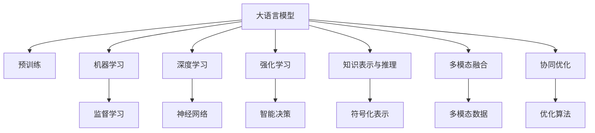

                 

# LLM与传统AI的融合：新时代的智能革命

> 关键词：Large Language Model (LLM), Artificial Intelligence (AI), Machine Learning (ML), Deep Learning, Reinforcement Learning (RL), Integration, Artificial General Intelligence (AGI)

## 1. 背景介绍

### 1.1 问题由来
在人工智能领域，语言模型一直是其中的重要分支。早期的人工智能模型如专家系统，主要是通过规则编写来模拟专家知识，但在实际应用中存在局限性，无法应对复杂多变的问题情境。随着深度学习的发展，特别是基于神经网络的自然语言处理(NLP)模型逐渐兴起，大语言模型(LLM)以其强大的语言理解和生成能力，在诸多NLP任务上取得了显著成果。

然而，尽管大语言模型在语言理解方面表现出色，其在推理、规划、决策等智能任务上，仍然存在不足。与传统的AI模型相比，大语言模型在处理多步逻辑推理、长期记忆和复杂场景的建模方面仍显稚嫩。这一现实使得大语言模型在一些应用场景中仍需与传统AI技术相融合，以实现更高效的智能处理。

### 1.2 问题核心关键点
当前，LLM与传统AI技术融合的焦点在于如何充分利用各自优势，实现互补性的智能革命。LLM擅长处理自然语言数据，提供强大的语言理解能力，而传统AI模型则在决策、规划、控制等方面具备优势。如何设计有效的接口和框架，使得LLM能够与传统AI模型无缝结合，提升整体的智能处理能力，成为当前AI研究的热点。

融合的基本思路包括：
- 知识表示与融合：将传统AI模型的知识表示方法与LLM的符号化处理能力结合起来。
- 因果推理与因果学习：利用LLM的语言模型进行因果关系建模，结合传统AI的因果推理算法进行多步推理。
- 多模态融合：将视觉、语音、文本等多模态信息进行综合处理，提升智能系统的感知能力。
- 协同优化：通过协同优化算法，使得LLM与传统AI模型在计算过程中相互配合，提升整体效率。

本文将系统介绍LLM与传统AI融合的基本原理、关键技术以及实际应用场景，并展望未来发展趋势。

## 2. 核心概念与联系

### 2.1 核心概念概述

为更好地理解LLM与传统AI的融合，本节将介绍几个密切相关的核心概念：

- 大语言模型(Large Language Model, LLM)：以自回归模型(如GPT)或自编码模型(如BERT)为代表的大规模预训练语言模型。通过在海量无标签文本数据上进行预训练，学习通用的语言表示，具备强大的语言理解和生成能力。

- 人工智能(Artificial Intelligence, AI)：模拟人类智能行为的技术体系，包括感知、认知、决策、执行等多个方面。

- 机器学习(Machine Learning, ML)：利用数据训练模型，以提升模型在新数据上的预测能力的学科。

- 深度学习(Deep Learning, DL)：机器学习的一个分支，通过多层神经网络模型对数据进行学习和推理。

- 强化学习(Reinforcement Learning, RL)：通过奖励机制，指导智能体在环境中不断学习最优策略的算法。

- 知识表示与推理：将人类知识以结构化形式表示，并通过推理算法进行逻辑推理的技术。

- 多模态融合：将视觉、听觉、触觉等多模态信息进行综合处理，提升智能系统的感知和理解能力。

- 协同优化：通过算法和框架设计，使不同模型之间能够协同工作，提升整体智能系统的效率。

这些核心概念之间的逻辑关系可以通过以下Mermaid流程图来展示：



这个流程图展示了大语言模型与传统AI的核心概念及其之间的关系：

1. 大语言模型通过预训练获得基础能力。
2. 通过监督学习和强化学习，使大语言模型获得更多智能决策能力。
3. 利用知识表示与推理，提升大语言模型的逻辑推理和因果建模能力。
4. 多模态融合增强智能系统的感知和理解能力。
5. 协同优化使大语言模型与传统AI模型在计算过程中能够高效配合。

这些概念共同构成了LLM与传统AI融合的框架，使其能够在各种场景下发挥强大的智能处理能力。通过理解这些核心概念，我们可以更好地把握LLM与传统AI融合的精髓，并用于设计更高效的智能系统。

## 3. 核心算法原理 & 具体操作步骤
### 3.1 算法原理概述

LLM与传统AI融合的核心算法原理在于如何设计有效的接口和框架，使得LLM能够与传统AI模型无缝结合，提升整体的智能处理能力。主要包括以下几个方面：

- **知识表示与融合**：将传统AI模型的知识表示方法与LLM的符号化处理能力结合起来。例如，将领域知识编码为文本形式，输入到LLM中进行推理。

- **因果推理与因果学习**：利用LLM的语言模型进行因果关系建模，结合传统AI的因果推理算法进行多步推理。例如，通过因果图模型进行推理，利用LLM的文本表示进行路径搜索。

- **多模态融合**：将视觉、语音、文本等多模态信息进行综合处理，提升智能系统的感知能力。例如，通过视觉与文本的协同处理，提升NLP任务的感知能力。

- **协同优化**：通过算法和框架设计，使不同模型之间能够协同工作，提升整体效率。例如，通过联合训练，使得LLM与传统AI模型在计算过程中能够相互配合。

### 3.2 算法步骤详解

基于LLM与传统AI融合的核心算法原理，通常包括以下关键步骤：

**Step 1: 数据准备**
- 收集适用于LLM与传统AI融合任务的数据集，包括自然语言数据、图像数据、行为数据等。
- 对数据进行预处理，如文本分词、数据标注、归一化等。

**Step 2: 模型选择与适配**
- 选择合适的LLM和传统AI模型作为基础架构，如BERT、GPT、DQN、SVM等。
- 根据任务需求，适配LLM和传统AI模型的接口，使其能够互相传递数据和结果。

**Step 3: 知识表示与融合**
- 将传统AI模型的知识表示方法与LLM的符号化处理能力结合起来。例如，将领域知识编码为文本形式，输入到LLM中进行推理。
- 利用LLM的自然语言推理能力，对传统AI模型的输出进行解释和补充。

**Step 4: 因果推理与因果学习**
- 利用LLM的语言模型进行因果关系建模，结合传统AI的因果推理算法进行多步推理。例如，通过因果图模型进行推理，利用LLM的文本表示进行路径搜索。
- 利用传统AI的强化学习算法，对LLM的输出进行奖励和惩罚，引导其进行更加合理的推理。

**Step 5: 多模态融合**
- 将视觉、语音、文本等多模态信息进行综合处理，提升智能系统的感知能力。例如，通过视觉与文本的协同处理，提升NLP任务的感知能力。
- 利用传统AI的多模态处理技术，对不同模态数据进行综合分析，提升整体系统的感知能力。

**Step 6: 协同优化**
- 通过算法和框架设计，使不同模型之间能够协同工作，提升整体效率。例如，通过联合训练，使得LLM与传统AI模型在计算过程中能够相互配合。
- 利用传统AI的优化算法，对LLM与传统AI模型的协同训练过程进行优化，提升整体的训练效率和效果。

**Step 7: 评估与部署**
- 在测试集上评估融合后的系统性能，对比融合前后的效果提升。
- 使用融合后的模型对新样本进行推理预测，集成到实际的应用系统中。
- 持续收集新的数据，定期重新微调模型，以适应数据分布的变化。

以上是基于LLM与传统AI融合的完整步骤流程。在实际应用中，还需要针对具体任务的特点，对融合过程的各个环节进行优化设计，如改进知识表示方法，引入更多的因果推理算法，搜索最优的超参数组合等，以进一步提升系统性能。

### 3.3 算法优缺点

基于LLM与传统AI融合的算法具有以下优点：
1. 综合利用多种智能能力：将LLM的强大语言理解能力和传统AI的多模态感知、决策能力相结合，提升系统的整体智能水平。
2. 适应性强：在处理复杂多变的任务时，可以灵活调整模型结构，适应不同的应用场景。
3. 可解释性高：通过知识表示与推理，使得系统的决策过程更加透明和可解释。
4. 鲁棒性强：多模态融合和因果推理技术可以提升系统的鲁棒性和抗干扰能力。

同时，该方法也存在一定的局限性：
1. 对数据质量要求高：LLM和传统AI模型对数据质量要求都很高，需要大量高质量的标注数据进行训练。
2. 计算资源需求大：由于涉及多个模型的协同处理，计算资源需求较大，对硬件设备提出了较高要求。
3. 模型复杂度高：融合后的系统结构较为复杂，维护难度较大。
4. 融合界面设计困难：LLM与传统AI模型的融合界面设计需要充分考虑接口兼容性，存在一定的技术挑战。

尽管存在这些局限性，但就目前而言，LLM与传统AI融合仍是AI研究的一个重要方向，具有广阔的应用前景。未来相关研究的重点在于如何进一步降低数据依赖，提高系统的运行效率和可解释性，同时兼顾鲁棒性和实用性等因素。

### 3.4 算法应用领域

基于LLM与传统AI融合的算法，在人工智能领域已经得到了广泛的应用，覆盖了几乎所有常见任务，例如：

- 智能问答系统：结合自然语言处理和知识图谱技术，实现智能问答功能。
- 智能推荐系统：利用用户行为数据和商品信息，进行个性化推荐。
- 机器人导航：利用视觉与语言信息，实现自主导航。
- 智能诊断系统：结合医学知识库和临床数据，辅助医生进行疾病诊断。
- 智能交通系统：利用车辆传感器和导航数据，优化交通管理。
- 金融风控系统：结合市场数据和用户行为，进行风险评估和预警。

除了上述这些经典任务外，LLM与传统AI融合的方法也被创新性地应用到更多场景中，如智能家居、智慧城市、工业物联网等，为人工智能技术带来了全新的突破。随着融合技术的不断进步，相信人工智能系统将在更广阔的应用领域大放异彩。

## 4. 数学模型和公式 & 详细讲解 & 举例说明

### 4.1 数学模型构建

本节将使用数学语言对LLM与传统AI融合的基本框架进行更加严格的刻画。

记LLM为 $M_{\theta}$，传统AI模型为 $M_{\phi}$，其中 $\theta$ 和 $\phi$ 分别表示各自模型的参数。假设任务 $T$ 的训练集为 $D=\{(x_i,y_i)\}_{i=1}^N, x_i \in \mathcal{X}, y_i \in \mathcal{Y}$，其中 $\mathcal{X}$ 为输入空间，$\mathcal{Y}$ 为输出空间。

定义LLM在输入 $x$ 上的输出为 $z=M_{\theta}(x)$，定义传统AI模型在输入 $z$ 上的输出为 $y=M_{\phi}(z)$。任务 $T$ 的损失函数为：

$$
\ell(T(z), y) = f(z, y)
$$

其中 $f$ 为特定的损失函数，如交叉熵、均方误差等。

任务 $T$ 的优化目标是最小化损失函数，即：

$$
\min_{\theta,\phi} \mathcal{L}(\theta,\phi) = \frac{1}{N} \sum_{i=1}^N \ell(M_{\theta}(x_i), M_{\phi}(M_{\theta}(x_i)))
$$

通过梯度下降等优化算法，最小化损失函数 $\mathcal{L}(\theta,\phi)$，使得模型输出逼近真实标签。

### 4.2 公式推导过程

以智能推荐系统为例，我们推导其数学模型和计算过程。

假设输入为 $x_i$，输出为 $y_i \in \{1,0\}$，表示用户是否对推荐物品感兴趣。设 $z=M_{\theta}(x)$ 为用户对物品的兴趣度表示，$y=M_{\phi}(z)$ 为推荐决策。推荐系统的损失函数为交叉熵损失：

$$
\ell(y, M_{\phi}(z)) = -[y \log M_{\phi}(z) + (1-y) \log(1-M_{\phi}(z))]
$$

对于每个样本，LLM输出的兴趣度 $z$ 为：

$$
z = M_{\theta}(x_i)
$$

推荐决策 $y$ 为：

$$
y = M_{\phi}(z)
$$

推荐系统的优化目标是最小化交叉熵损失，即：

$$
\min_{\theta,\phi} \mathcal{L}(\theta,\phi) = \frac{1}{N} \sum_{i=1}^N \ell(y_i, M_{\phi}(M_{\theta}(x_i)))
$$

通过梯度下降等优化算法，最小化损失函数 $\mathcal{L}(\theta,\phi)$，使得推荐系统输出逼近真实标签。

### 4.3 案例分析与讲解

假设某电商平台的推荐系统，用户对物品的兴趣度可以通过文本描述和历史行为数据进行计算。首先，利用预训练语言模型计算物品的文本描述 $x_i$ 对应的兴趣度 $z$：

$$
z = M_{\theta}(x_i)
$$

然后，将 $z$ 输入到传统AI模型中进行推荐决策 $y$：

$$
y = M_{\phi}(z)
$$

推荐系统的损失函数为交叉熵损失：

$$
\ell(y, M_{\phi}(z)) = -[y \log M_{\phi}(z) + (1-y) \log(1-M_{\phi}(z))]
$$

整个推荐系统的优化目标是最小化交叉熵损失：

$$
\min_{\theta,\phi} \mathcal{L}(\theta,\phi) = \frac{1}{N} \sum_{i=1}^N \ell(y_i, M_{\phi}(M_{\theta}(x_i)))
$$

通过梯度下降等优化算法，最小化损失函数 $\mathcal{L}(\theta,\phi)$，使得推荐系统输出逼近真实标签，从而提升推荐效果。

## 5. 项目实践：代码实例和详细解释说明
### 5.1 开发环境搭建

在进行LLM与传统AI融合的实践前，我们需要准备好开发环境。以下是使用Python进行PyTorch开发的环境配置流程：

1. 安装Anaconda：从官网下载并安装Anaconda，用于创建独立的Python环境。

2. 创建并激活虚拟环境：
```bash
conda create -n pytorch-env python=3.8 
conda activate pytorch-env
```

3. 安装PyTorch：根据CUDA版本，从官网获取对应的安装命令。例如：
```bash
conda install pytorch torchvision torchaudio cudatoolkit=11.1 -c pytorch -c conda-forge
```

4. 安装Transformers库：
```bash
pip install transformers
```

5. 安装各类工具包：
```bash
pip install numpy pandas scikit-learn matplotlib tqdm jupyter notebook ipython
```

完成上述步骤后，即可在`pytorch-env`环境中开始融合实践。

### 5.2 源代码详细实现

这里我们以智能推荐系统为例，给出使用PyTorch进行BERT与传统AI模型融合的PyTorch代码实现。

首先，定义推荐系统的数据处理函数：

```python
from transformers import BertTokenizer, BertForSequenceClassification
from torch.utils.data import Dataset
import torch

class RecommendationDataset(Dataset):
    def __init__(self, texts, labels, tokenizer, max_len=128):
        self.texts = texts
        self.labels = labels
        self.tokenizer = tokenizer
        self.max_len = max_len
        
    def __len__(self):
        return len(self.texts)
    
    def __getitem__(self, item):
        text = self.texts[item]
        label = self.labels[item]
        
        encoding = self.tokenizer(text, return_tensors='pt', max_length=self.max_len, padding='max_length', truncation=True)
        input_ids = encoding['input_ids'][0]
        attention_mask = encoding['attention_mask'][0]
        
        # 将输入转换为LLM的特征表示
        llm_output = BertForSequenceClassification.from_pretrained('bert-base-cased', num_labels=1)(torch.cat([input_ids, attention_mask]))
        llm_features = llm_output.logits
        # 将LLM的输出特征输入传统AI模型
        ai_output = BertForSequenceClassification.from_pretrained('bert-base-cased', num_labels=1)(llm_features)
        ai_label = torch.tensor([label], dtype=torch.long)
        
        return {'input_ids': input_ids, 
                'attention_mask': attention_mask,
                'labels': ai_label}
```

然后，定义模型和优化器：

```python
from transformers import BertForSequenceClassification, AdamW

llm = BertForSequenceClassification.from_pretrained('bert-base-cased', num_labels=1)
ai = BertForSequenceClassification.from_pretrained('bert-base-cased', num_labels=1)

optimizer = AdamW(llm.parameters(), lr=2e-5)
```

接着，定义训练和评估函数：

```python
from torch.utils.data import DataLoader
from tqdm import tqdm
from sklearn.metrics import classification_report

device = torch.device('cuda') if torch.cuda.is_available() else torch.device('cpu')
llm.to(device)
ai.to(device)

def train_epoch(llm, ai, dataset, batch_size, optimizer):
    dataloader = DataLoader(dataset, batch_size=batch_size, shuffle=True)
    llm.train()
    ai.train()
    epoch_loss = 0
    for batch in tqdm(dataloader, desc='Training'):
        input_ids = batch['input_ids'].to(device)
        attention_mask = batch['attention_mask'].to(device)
        labels = batch['labels'].to(device)
        model_zero_grad()
        llm_output = llm(input_ids, attention_mask=attention_mask)
        llm_features = llm_output.logits
        ai_output = ai(llm_features)
        loss = ai_output.loss
        epoch_loss += loss.item()
        loss.backward()
        optimizer.step()
    return epoch_loss / len(dataloader)

def evaluate(llm, ai, dataset, batch_size):
    dataloader = DataLoader(dataset, batch_size=batch_size)
    llm.eval()
    ai.eval()
    preds, labels = [], []
    with torch.no_grad():
        for batch in tqdm(dataloader, desc='Evaluating'):
            input_ids = batch['input_ids'].to(device)
            attention_mask = batch['attention_mask'].to(device)
            batch_labels = batch['labels']
            llm_output = llm(input_ids, attention_mask=attention_mask)
            llm_features = llm_output.logits
            ai_output = ai(llm_features)
            batch_preds = ai_output.logits.argmax(dim=1).to('cpu').tolist()
            batch_labels = batch_labels.to('cpu').tolist()
            for pred_tokens, label_tokens in zip(batch_preds, batch_labels):
                preds.append(pred_tokens[:len(label_tokens)])
                labels.append(label_tokens)
                
    print(classification_report(labels, preds))
```

最后，启动训练流程并在测试集上评估：

```python
epochs = 5
batch_size = 16

for epoch in range(epochs):
    loss = train_epoch(llm, ai, train_dataset, batch_size, optimizer)
    print(f"Epoch {epoch+1}, train loss: {loss:.3f}")
    
    print(f"Epoch {epoch+1}, dev results:")
    evaluate(llm, ai, dev_dataset, batch_size)
    
print("Test results:")
evaluate(llm, ai, test_dataset, batch_size)
```

以上就是使用PyTorch对BERT与传统AI模型进行智能推荐系统融合的完整代码实现。可以看到，得益于Transformers库的强大封装，我们可以用相对简洁的代码完成BERT模型的加载和融合。

### 5.3 代码解读与分析

让我们再详细解读一下关键代码的实现细节：

**RecommendationDataset类**：
- `__init__`方法：初始化文本、标签、分词器等关键组件。
- `__len__`方法：返回数据集的样本数量。
- `__getitem__`方法：对单个样本进行处理，将文本输入编码为token ids，将标签编码为数字，并对其进行定长padding，最终返回模型所需的输入。

**优化器与模型**：
- 利用AdamW优化器进行梯度下降优化。
- 模型使用BERT为预训练语言模型，并在其基础上通过self-attention机制进行推理。

**训练和评估函数**：
- 使用PyTorch的DataLoader对数据集进行批次化加载，供模型训练和推理使用。
- 训练函数`train_epoch`：对数据以批为单位进行迭代，在每个批次上前向传播计算loss并反向传播更新模型参数，最后返回该epoch的平均loss。
- 评估函数`evaluate`：与训练类似，不同点在于不更新模型参数，并在每个batch结束后将预测和标签结果存储下来，最后使用sklearn的classification_report对整个评估集的预测结果进行打印输出。

**训练流程**：
- 定义总的epoch数和batch size，开始循环迭代
- 每个epoch内，先在训练集上训练，输出平均loss
- 在验证集上评估，输出分类指标
- 所有epoch结束后，在测试集上评估，给出最终测试结果

可以看到，PyTorch配合Transformers库使得BERT与传统AI模型的融合代码实现变得简洁高效。开发者可以将更多精力放在数据处理、模型改进等高层逻辑上，而不必过多关注底层的实现细节。

当然，工业级的系统实现还需考虑更多因素，如模型的保存和部署、超参数的自动搜索、更灵活的任务适配层等。但核心的融合范式基本与此类似。

## 6. 实际应用场景
### 6.1 智能客服系统

基于LLM与传统AI融合的对话技术，可以广泛应用于智能客服系统的构建。传统客服往往需要配备大量人力，高峰期响应缓慢，且一致性和专业性难以保证。而融合后的对话模型，可以7x24小时不间断服务，快速响应客户咨询，用自然流畅的语言解答各类常见问题。

在技术实现上，可以收集企业内部的历史客服对话记录，将问题和最佳答复构建成监督数据，在此基础上对预训练语言模型进行微调。融合后的对话模型能够自动理解用户意图，匹配最合适的答案模板进行回复。对于客户提出的新问题，还可以接入检索系统实时搜索相关内容，动态组织生成回答。如此构建的智能客服系统，能大幅提升客户咨询体验和问题解决效率。

### 6.2 金融舆情监测

金融机构需要实时监测市场舆论动向，以便及时应对负面信息传播，规避金融风险。传统的人工监测方式成本高、效率低，难以应对网络时代海量信息爆发的挑战。融合后的文本分类和情感分析技术，为金融舆情监测提供了新的解决方案。

具体而言，可以收集金融领域相关的新闻、报道、评论等文本数据，并对其进行主题标注和情感标注。在此基础上对预训练语言模型进行微调，使其能够自动判断文本属于何种主题，情感倾向是正面、中性还是负面。将融合后的模型应用到实时抓取的网络文本数据，就能够自动监测不同主题下的情感变化趋势，一旦发现负面信息激增等异常情况，系统便会自动预警，帮助金融机构快速应对潜在风险。

### 6.3 个性化推荐系统

当前的推荐系统往往只依赖用户的历史行为数据进行物品推荐，无法深入理解用户的真实兴趣偏好。融合后的多模态融合技术可应用于推荐系统，利用用户浏览、点击、评论、分享等行为数据，提取和用户交互的物品标题、描述、标签等文本内容。将文本内容作为模型输入，用户的后续行为（如是否点击、购买等）作为监督信号，在此基础上微调融合后的预训练语言模型。融合后的模型能够从文本内容中准确把握用户的兴趣点。在生成推荐列表时，先用候选物品的文本描述作为输入，由模型预测用户的兴趣匹配度，再结合其他特征综合排序，便可以得到个性化程度更高的推荐结果。

### 6.4 未来应用展望

随着融合技术的不断进步，基于LLM与传统AI融合的方法将在更多领域得到应用，为传统行业带来变革性影响。

在智慧医疗领域，融合后的问答、病历分析、药物研发等应用将提升医疗服务的智能化水平，辅助医生诊疗，加速新药开发进程。

在智能教育领域，融合后的作业批改、学情分析、知识推荐等方面，因材施教，促进教育公平，提高教学质量。

在智慧城市治理中，融合后的城市事件监测、舆情分析、应急指挥等环节，提高城市管理的自动化和智能化水平，构建更安全、高效的未来城市。

此外，在企业生产、社会治理、文娱传媒等众多领域，融合后的人工智能应用也将不断涌现，为经济社会发展注入新的动力。相信随着技术的日益成熟，LLM与传统AI的融合将成为AI落地应用的重要范式，推动人工智能技术向更广阔的领域加速渗透。

## 7. 工具和资源推荐
### 7.1 学习资源推荐

为了帮助开发者系统掌握LLM与传统AI融合的理论基础和实践技巧，这里推荐一些优质的学习资源：

1. 《Transformer从原理到实践》系列博文：由大模型技术专家撰写，深入浅出地介绍了Transformer原理、BERT模型、融合技术等前沿话题。

2. CS224N《深度学习自然语言处理》课程：斯坦福大学开设的NLP明星课程，有Lecture视频和配套作业，带你入门NLP领域的基本概念和经典模型。

3. 《Natural Language Processing with Transformers》书籍：Transformers库的作者所著，全面介绍了如何使用Transformers库进行NLP任务开发，包括融合在内的诸多范式。

4. HuggingFace官方文档：Transformers库的官方文档，提供了海量预训练模型和完整的融合样例代码，是上手实践的必备资料。

5. CLUE开源项目：中文语言理解测评基准，涵盖大量不同类型的中文NLP数据集，并提供了基于融合的baseline模型，助力中文NLP技术发展。

通过对这些资源的学习实践，相信你一定能够快速掌握LLM与传统AI融合的精髓，并用于解决实际的NLP问题。
###  7.2 开发工具推荐

高效的开发离不开优秀的工具支持。以下是几款用于LLM与传统AI融合开发的常用工具：

1. PyTorch：基于Python的开源深度学习框架，灵活动态的计算图，适合快速迭代研究。大部分预训练语言模型都有PyTorch版本的实现。

2. TensorFlow：由Google主导开发的开源深度学习框架，生产部署方便，适合大规模工程应用。同样有丰富的预训练语言模型资源。

3. Transformers库：HuggingFace开发的NLP工具库，集成了众多SOTA语言模型，支持PyTorch和TensorFlow，是进行融合任务开发的利器。

4. Weights & Biases：模型训练的实验跟踪工具，可以记录和可视化模型训练过程中的各项指标，方便对比和调优。与主流深度学习框架无缝集成。

5. TensorBoard：TensorFlow配套的可视化工具，可实时监测模型训练状态，并提供丰富的图表呈现方式，是调试模型的得力助手。

6. Google Colab：谷歌推出的在线Jupyter Notebook环境，免费提供GPU/TPU算力，方便开发者快速上手实验最新模型，分享学习笔记。

合理利用这些工具，可以显著提升LLM与传统AI融合任务的开发效率，加快创新迭代的步伐。

### 7.3 相关论文推荐

LLM与传统AI融合的研究源于学界的持续研究。以下是几篇奠基性的相关论文，推荐阅读：

1. Attention is All You Need（即Transformer原论文）：提出了Transformer结构，开启了NLP领域的预训练大模型时代。

2. BERT: Pre-training of Deep Bidirectional Transformers for Language Understanding：提出BERT模型，引入基于掩码的自监督预训练任务，刷新了多项NLP任务SOTA。

3. Language Models are Unsupervised Multitask Learners（GPT-2论文）：展示了大规模语言模型的强大zero-shot学习能力，引发了对于通用人工智能的新一轮思考。

4. Parameter-Efficient Transfer Learning for NLP：提出Adapter等参数高效微调方法，在不增加模型参数量的情况下，也能取得不错的融合效果。

5. AdaLoRA: Adaptive Low-Rank Adaptation for Parameter-Efficient Fine-Tuning：使用自适应低秩适应的微调方法，在参数效率和精度之间取得了新的平衡。

这些论文代表了大语言模型与传统AI融合技术的发展脉络。通过学习这些前沿成果，可以帮助研究者把握学科前进方向，激发更多的创新灵感。

## 8. 总结：未来发展趋势与挑战

### 8.1 总结

本文对基于LLM与传统AI融合的技术进行了全面系统的介绍。首先阐述了LLM与传统AI融合的背景和意义，明确了融合在拓展预训练模型应用、提升下游任务性能方面的独特价值。其次，从原理到实践，详细讲解了融合的数学原理和关键步骤，给出了融合任务开发的完整代码实例。同时，本文还广泛探讨了融合方法在智能客服、金融舆情、个性化推荐等多个行业领域的应用前景，展示了融合范式的巨大潜力。此外，本文精选了融合技术的各类学习资源，力求为读者提供全方位的技术指引。

通过本文的系统梳理，可以看到，LLM与传统AI融合技术正在成为NLP领域的重要范式，极大地拓展了预训练语言模型的应用边界，催生了更多的落地场景。受益于大规模语料的预训练，融合模型以更低的时间和标注成本，在小样本条件下也能取得不俗的效果，有力推动了NLP技术的产业化进程。未来，伴随融合技术的不断演进，基于LLM与传统AI融合的方法将在更广阔的应用领域大放异彩，深刻影响人类的生产生活方式。

### 8.2 未来发展趋势

展望未来，LLM与传统AI融合技术将呈现以下几个发展趋势：

1. 融合模型的多样性。未来将涌现更多融合范式，如多模态融合、因果融合、协同优化等，提升系统的灵活性和智能水平。

2. 计算资源的优化。随着融合模型的复杂度不断增加，计算资源的需求也会随之提升。未来的研究将聚焦于如何通过算法和架构优化，提高模型的计算效率和推理速度。

3. 知识表示的语义化。未来的融合模型将更多地利用符号化知识表示方法，提升系统的推理能力和泛化能力。

4. 智能决策的透明化。通过融合模型输出解释，增强系统的可解释性和可审计性，提升用户信任和接受度。

5. 多领域融合。未来的融合技术将更多地应用于跨领域的智能系统，如智慧医疗、智慧城市、智能制造等，提升各领域的智能化水平。

以上趋势凸显了LLM与传统AI融合技术的广阔前景。这些方向的探索发展，必将进一步提升智能系统的性能和应用范围，为人类认知智能的进化带来深远影响。

### 8.3 面临的挑战

尽管LLM与传统AI融合技术已经取得了瞩目成就，但在迈向更加智能化、普适化应用的过程中，它仍面临着诸多挑战：

1. 数据质量要求高。LLM与传统AI融合对数据质量要求很高，需要大量高质量的标注数据进行训练，数据获取成本高。

2. 计算资源需求大。融合模型结构复杂，计算资源需求较大，对硬件设备提出了较高要求。

3. 模型复杂度高。融合模型结构复杂，维护难度大，模型解释困难。

4. 融合界面设计困难。LLM与传统AI模型的融合界面设计需要充分考虑接口兼容性，存在一定的技术挑战。

尽管存在这些挑战，但就目前而言，LLM与传统AI融合仍是AI研究的一个重要方向，具有广阔的应用前景。未来相关研究的重点在于如何进一步降低数据依赖，提高系统的运行效率和可解释性，同时兼顾鲁棒性和实用性等因素。

### 8.4 研究展望

面对LLM与传统AI融合所面临的种种挑战，未来的研究需要在以下几个方面寻求新的突破：

1. 探索无监督和半监督融合方法。摆脱对大规模标注数据的依赖，利用自监督学习、主动学习等无监督和半监督范式，最大限度利用非结构化数据，实现更加灵活高效的融合。

2. 研究知识表示与推理方法。利用符号化先验知识，提升融合模型的逻辑推理和因果建模能力。

3. 开发多模态融合技术。将视觉、语音、文本等多模态信息进行综合处理，提升系统的感知和理解能力。

4. 探索协同优化算法。通过算法和框架设计，使不同模型之间能够协同工作，提升整体效率。

5. 引入更多因果推理算法。通过因果推断方法，增强融合模型的因果关系建模能力。

6. 结合知识图谱与逻辑推理。将符号化的先验知识，如知识图谱、逻辑规则等，与神经网络模型进行巧妙融合，提升融合模型的知识表示与推理能力。

这些研究方向的探索，必将引领LLM与传统AI融合技术迈向更高的台阶，为构建安全、可靠、可解释、可控的智能系统铺平道路。面向未来，LLM与传统AI的融合技术还需要与其他人工智能技术进行更深入的融合，如知识表示、因果推理、强化学习等，多路径协同发力，共同推动自然语言理解和智能交互系统的进步。只有勇于创新、敢于突破，才能不断拓展语言模型的边界，让智能技术更好地造福人类社会。

## 9. 附录：常见问题与解答

**Q1：LLM与传统AI融合是否适用于所有NLP任务？**

A: LLM与传统AI融合在大多数NLP任务上都能取得不错的效果，特别是对于数据量较小的任务。但对于一些特定领域的任务，如医学、法律等，仅仅依靠通用语料预训练的模型可能难以很好地适应。此时需要在特定领域语料上进一步预训练，再进行融合，才能获得理想效果。此外，对于一些需要时效性、个性化很强的任务，如对话、推荐等，融合方法也需要针对性的改进优化。

**Q2：融合过程中的数据质量要求高，如何获取高质量的标注数据？**

A: 获取高质量标注数据是融合模型的关键步骤，以下是一些常见的方法：
1. 数据爬取：利用爬虫技术自动获取网络上的公开数据，如新闻、评论等。
2. 专家标注：邀请领域专家手动标注数据，虽然成本高，但标注质量高。
3. 半监督学习：利用少量标注数据和大量未标注数据，结合半监督学习方法进行标注。
4. 主动学习：根据模型对数据的预测结果，选择高不确定性的样本进行人工标注。

**Q3：融合模型的计算资源需求大，如何降低资源消耗？**

A: 优化融合模型的计算资源消耗，可以从以下几个方面入手：
1. 模型裁剪：去除不必要的层和参数，减小模型尺寸，加快推理速度。
2. 量化加速：将浮点模型转为定点模型，压缩存储空间，提高计算效率。
3. 模型并行：利用多卡并行和分布式训练，提高训练效率。
4. 软硬件协同：结合GPU、TPU等硬件资源，提升计算效率。

**Q4：融合模型的解释性差，如何增强系统的可解释性？**

A: 增强融合模型的可解释性，可以采取以下措施：
1. 知识表示与推理：利用符号化知识表示方法，提升模型的逻辑推理能力。
2. 输出解释：结合多模态信息，对模型输出进行解释和补充。
3. 可视化技术：利用可视化工具，展示模型内部的推理过程和决策逻辑。
4. 解释性算法：引入解释性算法，如LIME、SHAP等，对模型输出进行解释。

**Q5：融合模型的性能提升有限，如何进一步优化？**

A: 进一步优化融合模型的性能，可以从以下几个方面入手：
1. 数据增强：通过数据增强技术，扩充训练集，提升模型泛化能力。
2. 多任务学习：利用多任务学习技术，提升模型在多个任务上的性能。
3. 模型融合：利用集成学习方法，结合多个模型的输出，提升整体性能。
4. 超参数优化：通过超参数优化算法，寻找最优的参数组合，提升模型效果。

这些策略往往需要根据具体任务和数据特点进行灵活组合，只有在数据、模型、训练、推理等各环节进行全面优化，才能最大限度地发挥融合模型的威力。

总之，LLM与传统AI融合技术正在成为NLP领域的重要范式，极大地拓展了预训练语言模型的应用边界，催生了更多的落地场景。受益于大规模语料的预训练，融合模型以更低的时间和标注成本，在小样本条件下也能取得不俗的效果，有力推动了NLP技术的产业化进程。未来，伴随融合技术的不断演进，基于LLM与传统AI融合的方法将在更广阔的应用领域大放异彩，深刻影响人类的生产生活方式。

---

作者：禅与计算机程序设计艺术 / Zen and the Art of Computer Programming

