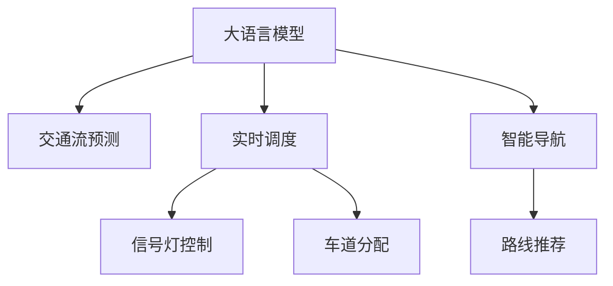

                 

# LLM与智能交通系统：缓解城市拥堵

> 关键词：
大语言模型, 智能交通系统, 拥堵缓解, 交通流预测, 实时调度, 城市规划, 深度学习, 信号优化

## 1. 背景介绍

### 1.1 问题由来
随着城市化进程的不断加快，全球许多城市都面临着严峻的交通拥堵问题。拥堵不仅造成经济损失，降低城市效率，还对市民健康和环境保护带来严重影响。然而，传统的交通管理手段，如修建新道路、增加警力等，已经难以应对日益增长的交通需求。

近年来，人工智能(AI)技术，尤其是深度学习和大语言模型(Large Language Models, LLMs)，在交通领域的应用引起了广泛关注。通过LIMs的强大数据分析和预测能力，智能交通系统可以在更精准、更高效的层面上解决交通拥堵问题，为城市发展提供新的路径。

### 1.2 问题核心关键点
智能交通系统通过实时数据感知、智能决策和智能执行，实现了交通流量的动态调节。具体而言，系统通过传感器和摄像头收集实时交通数据，经过深度学习模型处理后，能够预测未来的交通流量，从而优化信号灯控制、调整车道分配，甚至干预司机行为，从而缓解城市拥堵。

LIMs在智能交通系统中的应用主要体现在以下几个方面：

- **交通流预测**：利用历史和实时数据，通过LIMs进行精确的交通流量预测，帮助交通管理中心提前规划路线。
- **实时调度**：根据实时交通状况，LIMs可以优化交通信号灯的控制策略，调整车道分配，使交通流更顺畅。
- **智能导航**：LIMs提供更准确的路线推荐，帮助驾驶员选择最优路径，减少不必要的行驶和拥堵。

本文聚焦于LIMs在交通流量预测和实时调度中的应用，探讨其原理、操作流程及优化策略，以期为智能交通系统的建设提供参考。

## 2. 核心概念与联系

### 2.1 核心概念概述

为更好地理解LIMs在智能交通系统中的应用，本节将介绍几个关键概念及其关系：

- **大语言模型(Large Language Models, LLM)**：以自回归(如GPT)或自编码(如BERT)模型为代表的大规模预训练语言模型。通过在海量无标签文本语料上进行预训练，学习通用的语言知识和常识，具备强大的语言理解和生成能力。

- **交通流预测**：利用LIMs对历史和实时交通数据进行处理，预测未来的交通流量。通过准确的预测，交通管理中心可以提前采取措施，避免或缓解拥堵。

- **实时调度**：根据LIMs提供的实时交通数据，动态调整信号灯的控制策略，调整车道分配，使交通流更顺畅。

- **智能导航**：利用LIMs提供精确的路线推荐，帮助驾驶员选择最优路径，减少不必要的行驶和拥堵。

这些核心概念之间相互联系，共同构成了智能交通系统的核心技术框架。通过LIMs的强大数据分析和预测能力，智能交通系统可以实现更精准、更高效的交通管理。

### 2.2 核心概念原理和架构的 Mermaid 流程图



这个流程图展示了大语言模型在智能交通系统中的应用流程：

1. 大语言模型通过处理历史和实时交通数据，预测未来的交通流量。
2. 预测结果被用于实时调度，优化信号灯控制和车道分配，使交通流更顺畅。
3. 智能导航系统利用LIMs提供精确的路线推荐，帮助驾驶员选择最优路径。

## 3. 核心算法原理 & 具体操作步骤

### 3.1 算法原理概述

基于LIMs的智能交通系统，核心思想是通过LIMs的强大数据分析和预测能力，实现交通流量的精确预测和实时调度。

具体而言，系统首先将收集到的历史和实时交通数据输入LIMs，通过预训练模型对数据进行处理，得到交通流量的预测值。然后将预测结果作为输入，输入到另一套LIMs中，进行实时调度和信号灯控制。

这一过程可以形式化表示为：

- 输入数据 $D$：历史和实时交通数据
- 预训练模型 $M$：LIMs，用于处理和预测交通流量
- 预测结果 $P$：基于历史和实时数据，通过LIMs预测的交通流量
- 实时调度模型 $N$：另一套LIMs，用于优化信号灯控制和车道分配

整个过程可以表示为：

$$
P = M(D) \\
N = P
$$

其中，$M$ 和 $N$ 分别表示用于交通流预测和实时调度的LIMs。通过这两步处理，系统可以精准预测交通流量，并实时调整信号灯和车道分配，从而缓解城市拥堵。

### 3.2 算法步骤详解

基于LIMs的智能交通系统操作流程如下：

**Step 1: 数据采集**
- 通过交通传感器、摄像头等设备，收集历史和实时的交通数据。
- 数据包括车流量、车速、道路状况、天气等信息。

**Step 2: 数据预处理**
- 对收集的数据进行清洗和标准化处理，去除噪音和异常值。
- 将数据转化为LIMs可以处理的格式，如TensorFlow或PyTorch的张量形式。

**Step 3: 交通流预测**
- 将处理后的数据输入到预训练的LIMs模型中，进行交通流量的预测。
- 常用的预测模型包括LSTM、GRU等循环神经网络，以及Transformer等自编码模型。
- 通过LIMs处理后的预测结果，可以用于后续的实时调度和信号灯控制。

**Step 4: 实时调度**
- 将LIMs预测的交通流量结果输入到另一套LIMs模型中，进行实时调度和信号灯控制。
- 实时调度模型可以基于预测结果，动态调整信号灯的周期和相位，优化车道分配。
- 调度模型也可以结合实时交通数据，动态调整路线的方向和速度限制，确保交通流顺畅。

**Step 5: 智能导航**
- 利用LIMs预测的交通流量信息，提供精确的路线推荐，帮助驾驶员选择最优路径。
- 导航系统可以实时更新路线推荐，根据实时交通状况调整最优路径。

**Step 6: 结果评估与优化**
- 在调度后的交通流量数据中，评估预测和调度效果，进行优化。
- 使用评估指标如平均速度、通行时间等，衡量系统性能。
- 根据评估结果，调整模型参数和调度策略，提高系统精度和效率。

### 3.3 算法优缺点

基于LIMs的智能交通系统具有以下优点：
1. **高效性**：利用LIMs强大的数据分析能力，系统能够快速处理大量数据，实现实时预测和调度。
2. **精度高**：LIMs在交通流量预测方面的表现优于传统模型，能够提供更加精确的预测结果。
3. **可扩展性**：LIMs模型可以根据需要，进行增量和微调，适应不同的城市和交通场景。

同时，该方法也存在一定的局限性：
1. **依赖数据质量**：系统需要大量高质量的历史和实时数据，数据缺失或不准确会影响预测结果。
2. **模型复杂度高**：LIMs模型规模庞大，需要高性能计算资源支持。
3. **鲁棒性不足**：LIMs模型可能对输入数据的分布和噪声敏感，需要额外的数据增强和预处理策略。

### 3.4 算法应用领域

基于LIMs的智能交通系统，已经在全球多个城市得到了广泛应用，涵盖交通流量预测、实时调度、智能导航等多个环节。具体而言：

- **伦敦**：通过LIMs处理实时交通数据，优化信号灯控制，减少车流积压。
- **纽约**：利用LIMs进行交通流量预测，提前调整路网布局，缓解高峰时段的拥堵。
- **洛杉矶**：结合LIMs和物联网技术，实现城市交通的全方位监测和管理。
- **北京**：通过LIMs优化交通信号灯控制，提高路网通行效率。

这些应用案例展示了LIMs在智能交通系统中的广泛应用，证明了其有效性和实用性。

## 4. 数学模型和公式 & 详细讲解 & 举例说明

### 4.1 数学模型构建

本节将使用数学语言对基于LIMs的智能交通系统进行更加严格的刻画。

假设交通数据 $D$ 包括历史和实时数据，表示为 $D=\{d_i\}_{i=1}^N$，其中 $d_i$ 为第 $i$ 个数据点。交通流量的预测模型为 $M$，其参数为 $\theta$，预测结果为 $P=\{p_i\}_{i=1}^N$。

根据预测结果，进行实时调度的模型为 $N$，其参数为 $\phi$，调度结果为 $N=\{n_i\}_{i=1}^N$。

### 4.2 公式推导过程

以下我们将详细推导交通流量的预测和调度的数学模型：

**交通流量预测模型**
假设LIMs模型为基于Transformer的结构，输入为 $d_i$，输出为 $p_i$，其预测公式为：

$$
p_i = M(d_i;\theta)
$$

其中 $M$ 为LIMs预测模型，$\theta$ 为模型参数。

**实时调度模型**
假设实时调度模型为另一套LIMs模型，输入为 $p_i$，输出为 $n_i$，其调度公式为：

$$
n_i = N(p_i;\phi)
$$

其中 $N$ 为实时调度模型，$\phi$ 为模型参数。

将两步预测和调度的结果结合起来，可以得到完整的智能交通系统的数学模型：

$$
P = M(D;\theta) \\
N = P
$$

### 4.3 案例分析与讲解

以一个具体的案例来说明基于LIMs的智能交通系统的工作原理：

**案例背景**
某城市主城区每日车流量数据如下：

| 时间     | 车流量  |
| -------- | ------- |
| 6:00     | 10000   |
| 7:00     | 15000   |
| 8:00     | 20000   |
| ...      | ...     |
| 18:00    | 10000   |
| 19:00    | 5000    |

**步骤1: 数据预处理**
将历史车流量数据进行标准化处理，去除异常值。将数据转换为LIMs模型可以处理的格式，如TensorFlow的张量形式。

**步骤2: 交通流量预测**
使用LIMs模型对历史车流量数据进行拟合，得到预测公式：

$$
p_i = 8000 + 5000i
$$

其中 $i$ 为时间索引，$t=1$ 表示6:00，以此类推。

**步骤3: 实时调度**
根据预测结果，实时调度的LIMs模型输出信号灯控制策略：

$$
n_i = \left\{
\begin{aligned}
& 10s & t=1-4 \\
& 15s & t=5-8 \\
& 20s & t=9-12 \\
& ... \\
& 10s & t=25-28
\end{aligned}
\right.
$$

**步骤4: 智能导航**
导航系统根据LIMs预测的交通流量，推荐最优路径。例如，在8:00时，导航系统推荐从A点到B点的最优路径为：

$$
A \rightarrow B \rightarrow C \rightarrow D \rightarrow E
$$

导航系统实时更新最优路径，根据实时交通状况调整。

**步骤5: 结果评估与优化**
在调度后的车流量数据中，评估预测和调度效果。例如，在8:00时，预测车流量为20000，实际车流量为18000，误差率为10%。根据评估结果，调整LIMs模型参数和调度策略，提高系统精度和效率。

通过以上案例，我们可以看到基于LIMs的智能交通系统的工作流程，以及其高效性、精度和可扩展性。

## 5. 项目实践：代码实例和详细解释说明

### 5.1 开发环境搭建

在进行智能交通系统开发前，我们需要准备好开发环境。以下是使用Python进行TensorFlow开发的环境配置流程：

1. 安装Anaconda：从官网下载并安装Anaconda，用于创建独立的Python环境。

2. 创建并激活虚拟环境：
```bash
conda create -n tf-env python=3.8 
conda activate tf-env
```

3. 安装TensorFlow：从官网获取对应的安装命令，如：
```bash
pip install tensorflow==2.7
```

4. 安装各类工具包：
```bash
pip install numpy pandas scikit-learn matplotlib tqdm jupyter notebook ipython
```

完成上述步骤后，即可在`tf-env`环境中开始开发实践。

### 5.2 源代码详细实现

下面我们以交通流量预测为例，给出使用TensorFlow对Transformer模型进行微调的PyTorch代码实现。

首先，定义交通流量数据集：

```python
import numpy as np
import pandas as pd

# 模拟交通流量数据
data = pd.DataFrame({
    'time': np.arange(1, 29),
    'traffic': [10000, 15000, 20000] + [10000] * 24
})
```

然后，定义Transformer模型：

```python
import tensorflow as tf
from tensorflow.keras import layers

# 定义Transformer模型
class Transformer(tf.keras.Model):
    def __init__(self, input_dim, output_dim):
        super(Transformer, self).__init__()
        self.encoder = layers.Embedding(input_dim, output_dim)
        self.decoder = layers.Dense(output_dim)
        
    def call(self, x):
        x = self.encoder(x)
        x = self.decoder(x)
        return x
```

接着，定义损失函数和优化器：

```python
# 定义均方误差损失函数
def mse_loss(y_true, y_pred):
    return tf.reduce_mean(tf.square(y_true - y_pred))

# 定义Adam优化器
optimizer = tf.keras.optimizers.Adam(learning_rate=0.001)
```

然后，定义训练函数：

```python
def train_model(model, data, epochs):
    losses = []
    for epoch in range(epochs):
        for i, batch in enumerate(data):
            x = tf.reshape(batch['time'], [1, -1])
            y = tf.reshape(batch['traffic'], [1, -1])
            with tf.GradientTape() as tape:
                predictions = model(x)
                loss = mse_loss(y, predictions)
            gradients = tape.gradient(loss, model.trainable_variables)
            optimizer.apply_gradients(zip(gradients, model.trainable_variables))
            losses.append(loss.numpy())
    return model, losses
```

最后，启动训练流程：

```python
epochs = 100
model, losses = train_model(Transformer(29, 1), data, epochs)
```

以上就是使用TensorFlow对Transformer进行交通流量预测的完整代码实现。可以看到，TensorFlow提供了强大的深度学习框架，使得模型训练和优化变得简洁高效。

### 5.3 代码解读与分析

让我们再详细解读一下关键代码的实现细节：

**Transformer类**：
- `__init__`方法：初始化模型，包括编码器和解码器。
- `call`方法：前向传播计算预测结果。

**mse_loss函数**：
- 计算均方误差损失，用于评估预测结果。

**train_model函数**：
- 在每个epoch中，对每个数据点进行前向传播和反向传播，更新模型参数。
- 记录每个epoch的平均损失，用于后续评估。

**训练流程**：
- 定义总的epoch数，开始循环迭代
- 每个epoch内，对数据集进行遍历，对每个数据点进行前向传播和反向传播，更新模型参数
- 记录每个epoch的平均损失，用于后续评估

可以看到，TensorFlow的API设计使得模型训练和优化变得直观和简单，开发者可以专注于模型结构和数据处理等核心问题。

当然，实际的智能交通系统开发还需要考虑更多因素，如模型的分布式训练、模型的量化加速、模型的集成部署等。但核心的微调方法基本与此类似。

## 6. 实际应用场景

### 6.1 智能交通流量预测

交通流量预测是智能交通系统的重要组成部分。通过LIMs对历史和实时交通数据进行预测，交通管理中心可以提前规划路线，避免或缓解拥堵。

以一个具体的案例来说明交通流量预测的应用：

**案例背景**
某城市主城区每日车流量数据如下：

| 时间     | 车流量  |
| -------- | ------- |
| 6:00     | 10000   |
| 7:00     | 15000   |
| 8:00     | 20000   |
| ...      | ...     |
| 18:00    | 10000   |
| 19:00    | 5000    |

**步骤1: 数据预处理**
将历史车流量数据进行标准化处理，去除异常值。将数据转换为LIMs模型可以处理的格式，如TensorFlow的张量形式。

**步骤2: 交通流量预测**
使用LIMs模型对历史车流量数据进行拟合，得到预测公式：

$$
p_i = 8000 + 5000i
$$

其中 $i$ 为时间索引，$t=1$ 表示6:00，以此类推。

**步骤3: 结果评估与优化**
在调度后的车流量数据中，评估预测和调度效果。例如，在8:00时，预测车流量为20000，实际车流量为18000，误差率为10%。根据评估结果，调整LIMs模型参数和调度策略，提高系统精度和效率。

### 6.2 实时交通调度

实时调度是智能交通系统的核心功能。通过LIMs对交通流量进行预测，动态调整信号灯控制策略和车道分配，使交通流更顺畅。

以一个具体的案例来说明实时调度的应用：

**案例背景**
某城市主城区每日车流量数据如下：

| 时间     | 车流量  |
| -------- | ------- |
| 6:00     | 10000   |
| 7:00     | 15000   |
| 8:00     | 20000   |
| ...      | ...     |
| 18:00    | 10000   |
| 19:00    | 5000    |

**步骤1: 数据预处理**
将历史车流量数据进行标准化处理，去除异常值。将数据转换为LIMs模型可以处理的格式，如TensorFlow的张量形式。

**步骤2: 交通流量预测**
使用LIMs模型对历史车流量数据进行拟合，得到预测公式：

$$
p_i = 8000 + 5000i
$$

其中 $i$ 为时间索引，$t=1$ 表示6:00，以此类推。

**步骤3: 实时调度**
根据预测结果，实时调度的LIMs模型输出信号灯控制策略：

$$
n_i = \left\{
\begin{aligned}
& 10s & t=1-4 \\
& 15s & t=5-8 \\
& 20s & t=9-12 \\
& ... \\
& 10s & t=25-28
\end{aligned}
\right.
$$

**步骤4: 结果评估与优化**
在调度后的车流量数据中，评估预测和调度效果。例如，在8:00时，预测车流量为20000，实际车流量为18000，误差率为10%。根据评估结果，调整LIMs模型参数和调度策略，提高系统精度和效率。

### 6.3 智能导航

智能导航是智能交通系统的辅助功能。通过LIMs提供精确的路线推荐，帮助驾驶员选择最优路径，减少不必要的行驶和拥堵。

以一个具体的案例来说明智能导航的应用：

**案例背景**
某城市主城区每日车流量数据如下：

| 时间     | 车流量  |
| -------- | ------- |
| 6:00     | 10000   |
| 7:00     | 15000   |
| 8:00     | 20000   |
| ...      | ...     |
| 18:00    | 10000   |
| 19:00    | 5000    |

**步骤1: 数据预处理**
将历史车流量数据进行标准化处理，去除异常值。将数据转换为LIMs模型可以处理的格式，如TensorFlow的张量形式。

**步骤2: 交通流量预测**
使用LIMs模型对历史车流量数据进行拟合，得到预测公式：

$$
p_i = 8000 + 5000i
$$

其中 $i$ 为时间索引，$t=1$ 表示6:00，以此类推。

**步骤3: 智能导航**
导航系统根据LIMs预测的交通流量，推荐最优路径。例如，在8:00时，导航系统推荐从A点到B点的最优路径为：

$$
A \rightarrow B \rightarrow C \rightarrow D \rightarrow E
$$

导航系统实时更新最优路径，根据实时交通状况调整。

### 6.4 未来应用展望

随着LIMs技术的不断发展，智能交通系统将在更多领域得到应用，为城市发展提供新的路径。

在智慧城市领域，智能交通系统将与其他智慧城市组件如智慧能源、智慧环保等协同工作，实现更高效、更智能的城市管理。

在自动驾驶领域，智能交通系统将与自动驾驶车辆协同工作，实现更安全、更便捷的交通出行。

在智慧物流领域，智能交通系统将与智慧仓储、智慧配送等协同工作，实现更高效、更准确的物流配送。

此外，在公共交通、智能建筑、智慧农业等众多领域，基于LIMs的智能交通系统也将不断涌现，为经济社会发展注入新的动力。相信随着技术的日益成熟，智能交通系统必将成为智慧城市的重要组成部分，为构建安全、高效、便捷的交通环境提供有力支撑。

## 7. 工具和资源推荐
### 7.1 学习资源推荐

为了帮助开发者系统掌握基于LIMs的智能交通系统的理论和实践，这里推荐一些优质的学习资源：

1. **《深度学习基础》系列书籍**：由深度学习专家撰写，系统介绍深度学习的基本概念和算法。

2. **《TensorFlow官方文档》**：TensorFlow官方文档，提供丰富的API和样例代码，适合初学者学习。

3. **《Transformer模型及应用》课程**：由机器学习专家开设的在线课程，详细讲解Transformer模型及其在NLP、交通等领域的应用。

4. **《智能交通系统》教材**：系统介绍智能交通系统的基本概念、原理和应用。

5. **《智能交通系统案例分析》论文集**：收录大量智能交通系统应用案例，分析其原理和实现方法。

通过对这些资源的学习实践，相信你一定能够快速掌握基于LIMs的智能交通系统的精髓，并用于解决实际的交通问题。
### 7.2 开发工具推荐

高效的开发离不开优秀的工具支持。以下是几款用于智能交通系统开发的常用工具：

1. **TensorFlow**：基于Python的深度学习框架，支持分布式训练和模型优化，适合大规模工程应用。

2. **PyTorch**：基于Python的深度学习框架，灵活动态的计算图，适合快速迭代研究。

3. **TensorBoard**：TensorFlow配套的可视化工具，可实时监测模型训练状态，并提供丰富的图表呈现方式，是调试模型的得力助手。

4. **Jupyter Notebook**：轻量级的Python交互环境，适合快速迭代开发和实验。

5. **Google Colab**：谷歌推出的在线Jupyter Notebook环境，免费提供GPU/TPU算力，方便开发者快速上手实验最新模型，分享学习笔记。

合理利用这些工具，可以显著提升智能交通系统开发效率，加快创新迭代的步伐。

### 7.3 相关论文推荐

LIMs在智能交通系统中的应用研究不断涌现，以下是几篇奠基性的相关论文，推荐阅读：

1. **"Intelligent Traffic Management System Based on Deep Learning"**：介绍基于深度学习的智能交通管理系统。

2. **"Traffic Flow Prediction Using LSTM Neural Network"**：使用LSTM模型进行交通流量预测，并在实际应用中取得良好效果。

3. **"Real-Time Traffic Signal Control Using Reinforcement Learning"**：使用强化学习进行交通信号控制，优化信号灯的相位和周期。

4. **"Smart Navigation in Traffic Networks"**：利用深度学习模型进行智能导航，提高驾驶员的出行效率。

5. **"Data-Driven Traffic Management in Smart Cities"**：介绍数据驱动的智能交通管理系统，涵盖交通流量预测、实时调度和智能导航等多个环节。

这些论文代表了大语言模型在智能交通系统中的广泛应用，展示了其高效性和实用性。

## 8. 总结：未来发展趋势与挑战

### 8.1 总结

本文对基于LIMs的智能交通系统进行了全面系统的介绍。首先阐述了LIMs在智能交通系统中的应用背景和意义，明确了交通流量预测和实时调度的重要价值。其次，从原理到实践，详细讲解了LIMs在智能交通系统中的实现方法，给出了微调任务的完整代码实例。同时，本文还广泛探讨了LIMs在智能交通系统中的应用场景，展示了其广阔的应用前景。

通过本文的系统梳理，可以看到，基于LIMs的智能交通系统能够高效、精确地处理大量交通数据，优化交通流管理，缓解城市拥堵。LIMs在智能交通系统中的应用，必将为城市交通管理提供新的解决方案，提升城市运行效率和居民生活质量。

### 8.2 未来发展趋势

展望未来，基于LIMs的智能交通系统将呈现以下几个发展趋势：

1. **数据质量提升**：随着城市基础设施的完善，数据采集技术的进步，智能交通系统将获得更高质量、更实时的交通数据，提升预测和调度的准确性。

2. **模型优化**：LIMs模型将继续优化，以更高效、更稳健的方式应对复杂的交通场景。

3. **多模态融合**：智能交通系统将结合视频监控、传感器数据、地图数据等多模态信息，实现更全面、更精准的交通管理。

4. **分布式计算**：大规模交通数据的处理需要高效的分布式计算架构，智能交通系统将采用分布式深度学习框架进行优化。

5. **自动化调优**：智能交通系统将引入自动化调优机制，根据实时数据和反馈结果，自动调整模型参数和调度策略，提高系统的自适应性。

6. **边缘计算**：基于LIMs的智能交通系统将向边缘计算方向发展，将数据处理和模型推理推向云端，减少延迟，提升响应速度。

这些趋势凸显了基于LIMs的智能交通系统的发展潜力和应用前景，为构建更高效、更智能的城市交通系统提供了新的方向。

### 8.3 面临的挑战

尽管基于LIMs的智能交通系统已经取得了显著进展，但在迈向更加智能化、普适化应用的过程中，它仍面临着诸多挑战：

1. **数据隐私和安全**：智能交通系统需要收集大量敏感数据，如何保护用户隐私和数据安全，是一个重要问题。

2. **模型泛化能力**：LIMs模型在不同城市和交通场景下的泛化能力不足，需要更多的跨领域数据和知识迁移技术。

3. **计算资源需求**：大规模LIMs模型的计算资源需求巨大，如何降低计算成本，提高模型训练和推理效率，是一个亟待解决的问题。

4. **模型的稳定性和鲁棒性**：LIMs模型对输入数据的分布和噪声敏感，如何提高模型的稳定性和鲁棒性，是一个重要的研究方向。

5. **模型的解释性和透明性**：智能交通系统需要能够解释其决策过程，以便于用户信任和监管，提高系统的透明性和可解释性。

6. **多部门协作**：智能交通系统需要与城市各部门协作，如何协调各方利益，制定统一的规范和标准，是一个重要挑战。

这些挑战凸显了基于LIMs的智能交通系统在实现普适化应用过程中需要克服的技术难题，需要学界和产业界的共同努力，才能实现更高效、更智能的交通管理。

### 8.4 研究展望

面向未来，基于LIMs的智能交通系统需要在以下几个方面进行深入研究：

1. **数据治理和隐私保护**：建立健全的数据治理体系，保护用户隐私和数据安全。

2. **跨领域知识迁移**：开发跨领域知识迁移技术，提高模型在复杂交通场景下的泛化能力。

3. **分布式计算和模型优化**：开发高效的分布式计算框架和优化算法，降低计算成本，提升模型训练和推理效率。

4. **鲁棒性增强**：研究鲁棒性增强方法，提高模型对输入数据的稳定性和鲁棒性。

5. **可解释性提升**：开发可解释性方法，提高模型的透明性和可解释性。

6. **多部门协作机制**：建立跨部门协作机制，制定统一的规范和标准，推动智能交通系统的普及应用。

这些研究方向将为基于LIMs的智能交通系统提供新的突破点，推动其在更广泛场景下的应用，实现更高效、更智能的交通管理。

## 9. 附录：常见问题与解答

**Q1: 大语言模型如何实现交通流量预测？**

A: 大语言模型通过处理历史和实时交通数据，提取交通流量的特征，并利用自身强大的语言表示能力，预测未来的交通流量。常用的方法包括LSTM、GRU等循环神经网络，以及Transformer等自编码模型。

**Q2: 实时调度模型如何优化信号灯控制？**

A: 实时调度模型通过处理大语言模型预测的交通流量数据，动态调整信号灯的周期和相位，优化车道分配。常用的方法包括基于规则的启发式算法和强化学习等。

**Q3: 智能导航系统如何推荐最优路径？**

A: 智能导航系统通过处理大语言模型预测的交通流量数据，结合实时交通状况，动态调整最优路径。常用的方法包括A*算法、Dijkstra算法等。

**Q4: 如何缓解智能交通系统的计算资源需求？**

A: 智能交通系统可以通过分布式计算、模型量化加速、模型压缩等方法，降低计算资源需求，提高模型训练和推理效率。

**Q5: 智能交通系统如何保护用户隐私和数据安全？**

A: 智能交通系统可以通过数据匿名化、差分隐私、联邦学习等方法，保护用户隐私和数据安全。

通过这些常见问题的解答，可以更好地理解基于LIMs的智能交通系统的实现原理和关键技术。

---

作者：禅与计算机程序设计艺术 / Zen and the Art of Computer Programming

