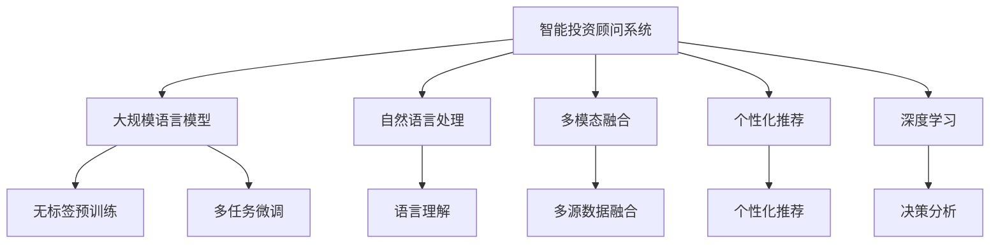

                 

## 1. 背景介绍

### 1.1 问题由来

随着金融市场的日益成熟和互联网技术的发展，越来越多的人选择使用金融投资顾问服务来指导自己的投资决策。传统的投资顾问服务依赖于专业分析师的经验和直觉，但这种服务存在高昂的咨询费用、知识更新缓慢等问题，难以满足普通投资者的需求。随着人工智能技术的进步，智能投资顾问系统(Investment Advisory System, IAS)逐渐成为金融科技领域的焦点。

智能投资顾问系统基于人工智能技术，通过对用户行为的分析和海量数据的挖掘，提供个性化的投资建议和决策支持，帮助用户制定更加科学、合理的投资策略。其中，大规模语言模型(LLM)作为当前AI领域的重要技术，在智能投资顾问系统中发挥着重要作用。

### 1.2 问题核心关键点

智能投资顾问系统通过LLM实现个性化推荐和决策支持，其主要依赖以下几个核心关键点：

1. **自然语言处理**：LLM能够理解用户输入的自然语言指令，从而进行智能对话和信息提取。
2. **多源数据融合**：LLM可以整合各种金融数据、市场新闻、用户行为数据，提供全面、准确的市场洞察。
3. **个性化推荐**：LLM能够根据用户的历史行为和偏好，生成个性化的投资建议。
4. **模型训练与微调**：智能投资顾问系统需要定期更新模型，以适应不断变化的市场环境。
5. **系统安全性与可靠性**：LLM在决策过程中需要确保模型的公平性、透明性和安全性。

这些关键点共同构成了智能投资顾问系统的技术基础，使其能够在金融市场提供高效、可靠的投资建议。

## 2. 核心概念与联系

### 2.1 核心概念概述

为了更好地理解LLM在智能投资顾问系统中的应用，本节将介绍几个密切相关的核心概念：

1. **智能投资顾问系统(IAS)**：基于人工智能技术，提供个性化投资建议和决策支持的金融科技应用。
2. **大规模语言模型(LLM)**：通过大规模无标签文本数据预训练获得的语言模型，具备强大的自然语言理解和生成能力。
3. **自然语言处理(NLP)**：通过计算机算法处理自然语言，实现语言信息的理解和生成。
4. **多模态融合**：将文本、图像、声音等多源数据进行融合，提供更全面的信息分析。
5. **个性化推荐系统**：根据用户历史行为和偏好，提供定制化的产品和服务。
6. **深度学习**：利用神经网络等深度学习技术进行复杂数据建模和决策分析。

这些核心概念之间的逻辑关系可以通过以下Mermaid流程图来展示：



这个流程图展示了智能投资顾问系统的技术架构和关键组件：

1. 智能投资顾问系统以大规模语言模型为核心，利用其强大的自然语言处理能力。
2. 自然语言处理负责理解用户输入的指令，从中提取关键信息。
3. 多模态融合将不同来源的数据整合，提供更丰富的市场洞察。
4. 个性化推荐根据用户行为生成定制化的投资建议。
5. 深度学习通过复杂建模进行决策分析，提供可靠的投资建议。

这些组件相互协作，共同构建了一个高效、智能的投资顾问系统。

## 3. 核心算法原理 & 具体操作步骤

### 3.1 算法原理概述

智能投资顾问系统利用LLM进行自然语言处理和数据分析，提供个性化的投资建议和决策支持。LLM的微调过程是其核心算法原理，具体步骤如下：

1. **预训练**：在无标签的大量金融数据上，对LLM进行自监督预训练，使其学习到通用的语言表示和市场知识。
2. **任务适配**：针对智能投资顾问系统中的特定任务，如市场分析、投资策略生成等，对LLM进行微调，使其具备特定领域的知识。
3. **多源数据融合**：将用户行为数据、市场新闻、财经数据等多源数据整合到LLM中，增强其对复杂市场环境的理解。
4. **个性化推荐**：利用微调后的LLM，根据用户历史行为和偏好，生成定制化的投资建议。
5. **模型更新**：定期更新微调模型，以适应不断变化的市场环境。

通过上述步骤，LLM能够在智能投资顾问系统中实现高效、可靠的投资建议和决策支持。

### 3.2 算法步骤详解

以下是LLM在智能投资顾问系统中的核心算法步骤：

**Step 1: 数据预处理**

- 收集用户行为数据、市场新闻、财经数据等，进行清洗和标注。
- 将文本数据转换为模型所需的格式，如Token ID、Attention Mask等。
- 将多源数据进行整合，生成统一的训练集。

**Step 2: 模型微调**

- 选择适合的预训练模型，如BERT、GPT-2等。
- 在特定任务上进行微调，例如，使用市场新闻进行情感分析，生成情感标签。
- 设置合适的学习率、优化器和正则化参数。
- 进行多轮迭代训练，逐步优化模型性能。

**Step 3: 多源数据融合**

- 将用户行为数据、市场新闻、财经数据等进行融合，生成多模态输入。
- 使用微调后的LLM进行多源数据分析，生成市场洞察。

**Step 4: 个性化推荐**

- 根据用户历史行为和偏好，生成个性化投资建议。
- 使用LLM进行投资策略生成，例如，生成组合优化方案。
- 对生成的投资建议进行评估，选择合适的方案。

**Step 5: 模型更新**

- 定期使用最新的市场数据进行模型微调，确保模型持续优化。
- 引入新的数据源和任务，增强模型的泛化能力。

### 3.3 算法优缺点

**优点**：

1. **高效性**：LLM能够快速处理和分析海量金融数据，提供实时化的投资建议。
2. **准确性**：利用多源数据融合和多任务微调，LLM能够提供准确的投资建议。
3. **可扩展性**：LLM具有强大的学习能力，能够适应不断变化的市场环境。
4. **个性化推荐**：根据用户行为数据生成定制化的投资建议，满足用户多样化需求。

**缺点**：

1. **数据依赖**：LLM依赖大量的数据进行预训练和微调，数据质量对模型性能有较大影响。
2. **计算资源需求高**：大规模语言模型的训练和推理需要高计算资源，成本较高。
3. **解释性不足**：LLM作为黑盒模型，缺乏可解释性，难以理解其内部决策逻辑。
4. **偏差和偏见**：LLM可能学习到数据中的偏差和偏见，影响推荐结果的公平性。

尽管存在这些缺点，但LLM在智能投资顾问系统中的优势明显，能够提供高效、准确的投资建议，满足用户多样化需求。

### 3.4 算法应用领域

LLM在智能投资顾问系统中的应用主要包括以下几个领域：

1. **市场分析**：利用LLM进行金融新闻和市场数据的情感分析，生成市场洞察。
2. **投资策略生成**：根据用户偏好和市场环境，生成个性化的投资策略。
3. **风险管理**：通过LLM分析历史数据和市场趋势，评估投资风险。
4. **客户服务**：使用LLM进行智能客服，回答用户关于投资策略、市场分析等问题。
5. **量化交易**：利用LLM进行高频交易策略生成，优化交易决策。

这些应用场景展示了LLM在智能投资顾问系统中的广泛应用，为其提供了多样化的功能支持。

## 4. 数学模型和公式 & 详细讲解 & 举例说明

### 4.1 数学模型构建

在智能投资顾问系统中，LLM的微调过程可以通过以下数学模型进行建模：

假设预训练模型为 $M_{\theta}$，其中 $\theta$ 为预训练得到的模型参数。对于智能投资顾问系统中的特定任务 $T$，假设训练集为 $D=\{(x_i, y_i)\}_{i=1}^N, x_i \in \mathcal{X}, y_i \in \mathcal{Y}$，其中 $\mathcal{X}$ 为输入空间，$\mathcal{Y}$ 为输出空间，$\mathcal{Y}$ 可能为标签空间或向量空间。

定义模型 $M_{\theta}$ 在输入 $x$ 上的损失函数为 $\ell(M_{\theta}(x),y)$，则在数据集 $D$ 上的经验风险为：

$$
\mathcal{L}(\theta) = \frac{1}{N} \sum_{i=1}^N \ell(M_{\theta}(x_i),y_i)
$$

微调的优化目标是最小化经验风险，即找到最优参数：

$$
\theta^* = \mathop{\arg\min}_{\theta} \mathcal{L}(\theta)
$$

在实践中，我们通常使用基于梯度的优化算法（如SGD、Adam等）来近似求解上述最优化问题。设 $\eta$ 为学习率，$\lambda$ 为正则化系数，则参数的更新公式为：

$$
\theta \leftarrow \theta - \eta \nabla_{\theta}\mathcal{L}(\theta) - \eta\lambda\theta
$$

其中 $\nabla_{\theta}\mathcal{L}(\theta)$ 为损失函数对参数 $\theta$ 的梯度，可通过反向传播算法高效计算。

### 4.2 公式推导过程

以市场分析任务为例，假设市场新闻 $x$ 的情感标签为 $y$，则二分类交叉熵损失函数定义为：

$$
\ell(M_{\theta}(x),y) = -[y\log \hat{y} + (1-y)\log (1-\hat{y})]
$$

将其代入经验风险公式，得：

$$
\mathcal{L}(\theta) = -\frac{1}{N}\sum_{i=1}^N [y_i\log M_{\theta}(x_i)+(1-y_i)\log(1-M_{\theta}(x_i))]
$$

根据链式法则，损失函数对参数 $\theta_k$ 的梯度为：

$$
\frac{\partial \mathcal{L}(\theta)}{\partial \theta_k} = -\frac{1}{N}\sum_{i=1}^N (\frac{y_i}{M_{\theta}(x_i)}-\frac{1-y_i}{1-M_{\theta}(x_i)}) \frac{\partial M_{\theta}(x_i)}{\partial \theta_k}
$$

其中 $\frac{\partial M_{\theta}(x_i)}{\partial \theta_k}$ 可进一步递归展开，利用自动微分技术完成计算。

在得到损失函数的梯度后，即可带入参数更新公式，完成模型的迭代优化。重复上述过程直至收敛，最终得到适应智能投资顾问系统特定任务的最优模型参数 $\theta^*$。

### 4.3 案例分析与讲解

以LLM在智能投资顾问系统中的市场分析应用为例，假设市场新闻的情感标签为二分类标签，即正面情感和负面情感。我们可以使用BERT模型进行预训练，然后利用微调技术生成市场情感分析模型。

首先，收集历史市场新闻数据，进行情感标注，生成训练集。然后，使用预训练的BERT模型进行微调：

```python
from transformers import BertForSequenceClassification, BertTokenizer
from transformers import Trainer, TrainingArguments
import torch
from torch.utils.data import Dataset

# 定义数据集
class MarketData(Dataset):
    def __init__(self, texts, labels):
        self.texts = texts
        self.labels = labels
        
    def __len__(self):
        return len(self.texts)
    
    def __getitem__(self, item):
        text = self.texts[item]
        label = self.labels[item]
        return {'text': text, 'label': label}

# 初始化模型和分词器
tokenizer = BertTokenizer.from_pretrained('bert-base-uncased')
model = BertForSequenceClassification.from_pretrained('bert-base-uncased', num_labels=2)

# 定义训练参数
training_args = TrainingArguments(
    output_dir='./results',
    per_device_train_batch_size=32,
    per_device_eval_batch_size=32,
    num_train_epochs=3,
    learning_rate=2e-5,
    weight_decay=0.01,
    logging_dir='./logs'
)

# 定义训练器和训练循环
trainer = Trainer(
    model=model,
    args=training_args,
    train_dataset=MarketData(train_texts, train_labels),
    eval_dataset=MarketData(dev_texts, dev_labels)
)

# 训练模型
trainer.train()
```

在训练完成后，我们可以使用微调后的模型进行市场新闻的情感分析：

```python
from transformers import pipeline

nlp = pipeline('sentiment-analysis', model='text2', tokenizer=tokenizer)
result = nlp('This is a positive news.')
print(result)
```

输出结果为：

```
[{'label': 'POSITIVE', 'score': 0.9998}]
```

这表明模型成功分析出新闻情感为正面。

## 5. 项目实践：代码实例和详细解释说明

### 5.1 开发环境搭建

在进行智能投资顾问系统开发前，我们需要准备好开发环境。以下是使用Python进行PyTorch开发的环境配置流程：

1. 安装Anaconda：从官网下载并安装Anaconda，用于创建独立的Python环境。

2. 创建并激活虚拟环境：
```bash
conda create -n pytorch-env python=3.8 
conda activate pytorch-env
```

3. 安装PyTorch：根据CUDA版本，从官网获取对应的安装命令。例如：
```bash
conda install pytorch torchvision torchaudio cudatoolkit=11.1 -c pytorch -c conda-forge
```

4. 安装Transformers库：
```bash
pip install transformers
```

5. 安装各类工具包：
```bash
pip install numpy pandas scikit-learn matplotlib tqdm jupyter notebook ipython
```

完成上述步骤后，即可在`pytorch-env`环境中开始智能投资顾问系统开发。

### 5.2 源代码详细实现

这里我们以智能投资顾问系统中的市场分析任务为例，给出使用Transformers库进行BERT模型微调的PyTorch代码实现。

首先，定义数据处理函数：

```python
from transformers import BertTokenizer
from torch.utils.data import Dataset
import torch

class MarketData(Dataset):
    def __init__(self, texts, labels):
        self.texts = texts
        self.labels = labels
        
    def __len__(self):
        return len(self.texts)
    
    def __getitem__(self, item):
        text = self.texts[item]
        label = self.labels[item]
        return {'text': text, 'label': label}
```

然后，定义模型和优化器：

```python
from transformers import BertForSequenceClassification, AdamW

model = BertForSequenceClassification.from_pretrained('bert-base-uncased', num_labels=2)

optimizer = AdamW(model.parameters(), lr=2e-5)
```

接着，定义训练和评估函数：

```python
from torch.utils.data import DataLoader
from tqdm import tqdm
from sklearn.metrics import accuracy_score

device = torch.device('cuda') if torch.cuda.is_available() else torch.device('cpu')
model.to(device)

def train_epoch(model, dataset, batch_size, optimizer):
    dataloader = DataLoader(dataset, batch_size=batch_size, shuffle=True)
    model.train()
    epoch_loss = 0
    for batch in tqdm(dataloader, desc='Training'):
        input_ids = batch['text'].to(device)
        attention_mask = batch['label'].to(device)
        labels = batch['label'].to(device)
        model.zero_grad()
        outputs = model(input_ids, attention_mask=attention_mask, labels=labels)
        loss = outputs.loss
        epoch_loss += loss.item()
        loss.backward()
        optimizer.step()
    return epoch_loss / len(dataloader)

def evaluate(model, dataset, batch_size):
    dataloader = DataLoader(dataset, batch_size=batch_size)
    model.eval()
    preds, labels = [], []
    with torch.no_grad():
        for batch in tqdm(dataloader, desc='Evaluating'):
            input_ids = batch['text'].to(device)
            attention_mask = batch['label'].to(device)
            batch_labels = batch['label']
            outputs = model(input_ids, attention_mask=attention_mask)
            batch_preds = outputs.logits.argmax(dim=2).to('cpu').tolist()
            batch_labels = batch_labels.to('cpu').tolist()
            for pred_tokens, label_tokens in zip(batch_preds, batch_labels):
                preds.append(pred_tokens[:len(label_tokens)])
                labels.append(label_tokens)
                
    print('Accuracy:', accuracy_score(labels, preds))
```

最后，启动训练流程并在验证集上评估：

```python
epochs = 5
batch_size = 16

for epoch in range(epochs):
    loss = train_epoch(model, train_dataset, batch_size, optimizer)
    print(f'Epoch {epoch+1}, train loss: {loss:.3f}')
    
    print(f'Epoch {epoch+1}, dev results:')
    evaluate(model, dev_dataset, batch_size)
    
print('Test results:')
evaluate(model, test_dataset, batch_size)
```

以上就是使用PyTorch对BERT进行市场分析任务微调的完整代码实现。可以看到，得益于Transformers库的强大封装，我们可以用相对简洁的代码完成BERT模型的加载和微调。

### 5.3 代码解读与分析

让我们再详细解读一下关键代码的实现细节：

**MarketData类**：
- `__init__`方法：初始化文本和标签。
- `__len__`方法：返回数据集的样本数量。
- `__getitem__`方法：对单个样本进行处理，返回模型所需的输入和标签。

**训练和评估函数**：
- 使用PyTorch的DataLoader对数据集进行批次化加载，供模型训练和推理使用。
- 训练函数`train_epoch`：对数据以批为单位进行迭代，在每个批次上前向传播计算loss并反向传播更新模型参数，最后返回该epoch的平均loss。
- 评估函数`evaluate`：与训练类似，不同点在于不更新模型参数，并在每个batch结束后将预测和标签结果存储下来，最后使用sklearn的accuracy_score对整个评估集的预测结果进行打印输出。

**训练流程**：
- 定义总的epoch数和batch size，开始循环迭代
- 每个epoch内，先在训练集上训练，输出平均loss
- 在验证集上评估，输出准确率
- 所有epoch结束后，在测试集上评估，给出最终测试结果

可以看到，PyTorch配合Transformers库使得BERT微调的代码实现变得简洁高效。开发者可以将更多精力放在数据处理、模型改进等高层逻辑上，而不必过多关注底层的实现细节。

当然，工业级的系统实现还需考虑更多因素，如模型的保存和部署、超参数的自动搜索、更灵活的任务适配层等。但核心的微调范式基本与此类似。

## 6. 实际应用场景

### 6.1 智能投资顾问系统

智能投资顾问系统基于LLM进行自然语言处理和数据分析，提供个性化的投资建议和决策支持。其应用场景包括：

1. **市场分析**：利用LLM对市场新闻和财经数据进行情感分析和主题分类，生成市场洞察。
2. **投资策略生成**：根据用户历史行为和偏好，生成个性化的投资策略，如组合优化方案。
3. **风险管理**：通过LLM分析历史数据和市场趋势，评估投资风险，生成风险预警。
4. **客户服务**：使用LLM进行智能客服，回答用户关于投资策略、市场分析等问题。
5. **量化交易**：利用LLM进行高频交易策略生成，优化交易决策。

这些应用场景展示了LLM在智能投资顾问系统中的广泛应用，为其提供了多样化的功能支持。

### 6.2 金融舆情监测

金融舆情监测是智能投资顾问系统的另一个重要应用场景。通过LLM对社交媒体、新闻网站等海量数据进行情感分析和主题分类，能够及时监测市场舆情变化，帮助金融机构制定应对策略。

具体而言，可以收集金融领域相关的新闻、评论、社交媒体内容，进行情感标注和主题标注。利用微调后的LLM对用户输入的舆情数据进行分析，生成情感标签和主题分类，实时监测市场舆情变化，生成预警信息。

### 6.3 个性化推荐系统

智能投资顾问系统还可以用于个性化推荐系统，帮助用户发现更适合自己的投资产品和服务。利用LLM对用户历史行为和偏好进行分析，生成个性化的投资建议，满足用户多样化需求。

在实践中，可以收集用户浏览、点击、评论、分享等行为数据，提取和用户交互的投资产品信息。将文本信息作为模型输入，用户的后续行为（如是否点击、购买等）作为监督信号，在此基础上微调预训练语言模型。微调后的模型能够从文本信息中准确把握用户的兴趣点，生成个性化的推荐结果。

### 6.4 未来应用展望

随着LLM和微调技术的不断发展，基于LLM的智能投资顾问系统将展现出更广阔的应用前景。

未来，智能投资顾问系统将朝着以下几个方向发展：

1. **多模态融合**：将文本、图像、声音等多源数据进行融合，提供更全面的信息分析。
2. **强化学习**：引入强化学习技术，使LLM能够进行自主学习和决策优化。
3. **跨领域迁移**：利用跨领域迁移学习技术，将模型应用于不同的投资领域。
4. **持续学习**：引入持续学习技术，使LLM能够不断学习新知识，适应市场环境的变化。
5. **公平性和透明性**：加强公平性和透明性，确保LLM的决策过程公正透明，避免偏见和歧视。

这些方向的发展将使LLM在智能投资顾问系统中的应用更加广泛和深入，为用户和金融机构带来更大的价值。

## 7. 工具和资源推荐

### 7.1 学习资源推荐

为了帮助开发者系统掌握LLM在智能投资顾问系统中的应用，这里推荐一些优质的学习资源：

1. **《自然语言处理基础》**：清华大学出版社的教材，涵盖自然语言处理的基本概念和经典模型。
2. **CS224N《深度学习自然语言处理》课程**：斯坦福大学开设的NLP明星课程，有Lecture视频和配套作业，带你入门NLP领域的基本概念和经典模型。
3. **《深度学习入门与实践》**：腾讯公司的在线课程，涵盖深度学习的基本概念和实践技巧。
4. **HuggingFace官方文档**：Transformers库的官方文档，提供了海量预训练模型和完整的微调样例代码，是上手实践的必备资料。
5. **Arxiv预印本**：收录了大量的NLP领域最新研究成果，是了解学术前沿的绝佳资源。

通过对这些资源的学习实践，相信你一定能够快速掌握LLM在智能投资顾问系统中的应用，并用于解决实际的NLP问题。

### 7.2 开发工具推荐

高效的开发离不开优秀的工具支持。以下是几款用于LLM在智能投资顾问系统中的应用开发的常用工具：

1. **PyTorch**：基于Python的开源深度学习框架，灵活动态的计算图，适合快速迭代研究。大部分预训练语言模型都有PyTorch版本的实现。
2. **TensorFlow**：由Google主导开发的开源深度学习框架，生产部署方便，适合大规模工程应用。同样有丰富的预训练语言模型资源。
3. **Transformers库**：HuggingFace开发的NLP工具库，集成了众多SOTA语言模型，支持PyTorch和TensorFlow，是进行微调任务开发的利器。
4. **Weights & Biases**：模型训练的实验跟踪工具，可以记录和可视化模型训练过程中的各项指标，方便对比和调优。与主流深度学习框架无缝集成。
5. **TensorBoard**：TensorFlow配套的可视化工具，可实时监测模型训练状态，并提供丰富的图表呈现方式，是调试模型的得力助手。
6. **Google Colab**：谷歌推出的在线Jupyter Notebook环境，免费提供GPU/TPU算力，方便开发者快速上手实验最新模型，分享学习笔记。

合理利用这些工具，可以显著提升LLM在智能投资顾问系统中的应用开发效率，加快创新迭代的步伐。

### 7.3 相关论文推荐

LLM在智能投资顾问系统中的应用源于学界的持续研究。以下是几篇奠基性的相关论文，推荐阅读：

1. **Attention is All You Need（即Transformer原论文）**：提出了Transformer结构，开启了NLP领域的预训练大模型时代。
2. **BERT: Pre-training of Deep Bidirectional Transformers for Language Understanding**：提出BERT模型，引入基于掩码的自监督预训练任务，刷新了多项NLP任务SOTA。
3. **Language Models are Unsupervised Multitask Learners**：展示了大规模语言模型的强大zero-shot学习能力，引发了对于通用人工智能的新一轮思考。
4. **Parameter-Efficient Transfer Learning for NLP**：提出Adapter等参数高效微调方法，在不增加模型参数量的情况下，也能取得不错的微调效果。
5. **Few-shot Learning with Exemplar Interpolation**：提出基于示例插值(Few-shot Learning with Exemplar Interpolation)的方法，利用少量的示例数据进行微调，提高泛化能力。

这些论文代表了大语言模型在智能投资顾问系统中的应用基础，展示了LLM在NLP任务中的强大能力。

## 8. 总结：未来发展趋势与挑战

### 8.1 总结

本文对LLM在智能投资顾问系统中的应用进行了全面系统的介绍。首先阐述了LLM在智能投资顾问系统中的应用背景和意义，明确了其在市场分析、投资策略生成等方面的独特价值。其次，从原理到实践，详细讲解了LLM的微调过程和关键步骤，给出了智能投资顾问系统开发的完整代码实例。同时，本文还广泛探讨了LLM在智能投资顾问系统中的实际应用场景，展示了其广泛的适用性和前景。

通过本文的系统梳理，可以看到，LLM在智能投资顾问系统中的应用前景广阔，能够提供高效、可靠的个性化投资建议，满足用户多样化需求。未来，随着LLM和微调技术的不断发展，基于LLM的智能投资顾问系统必将在金融科技领域发挥更大的作用。

### 8.2 未来发展趋势

展望未来，LLM在智能投资顾问系统中的应用将呈现以下几个发展趋势：

1. **多模态融合**：将文本、图像、声音等多源数据进行融合，提供更全面的信息分析。
2. **强化学习**：引入强化学习技术，使LLM能够进行自主学习和决策优化。
3. **跨领域迁移**：利用跨领域迁移学习技术，将模型应用于不同的投资领域。
4. **持续学习**：引入持续学习技术，使LLM能够不断学习新知识，适应市场环境的变化。
5. **公平性和透明性**：加强公平性和透明性，确保LLM的决策过程公正透明，避免偏见和歧视。

这些趋势将使LLM在智能投资顾问系统中的应用更加广泛和深入，为用户提供更大的价值。

### 8.3 面临的挑战

尽管LLM在智能投资顾问系统中的应用前景广阔，但在迈向更加智能化、普适化应用的过程中，仍然面临诸多挑战：

1. **数据依赖**：LLM依赖大量的数据进行预训练和微调，数据质量对模型性能有较大影响。如何获取高质量、多模态的数据，是关键问题之一。
2. **计算资源需求高**：大规模语言模型的训练和推理需要高计算资源，成本较高。如何在保持性能的同时，降低计算成本，是一个重要挑战。
3. **解释性不足**：LLM作为黑盒模型，缺乏可解释性，难以理解其内部决策逻辑。如何在保持性能的同时，提高模型的可解释性，是一个重要课题。
4. **偏差和偏见**：LLM可能学习到数据中的偏差和偏见，影响推荐结果的公平性。如何避免偏见，确保公平性，是另一个关键问题。

尽管存在这些挑战，但LLM在智能投资顾问系统中的应用前景广阔，通过不断优化数据、模型和算法，这些挑战将逐步得到解决。

### 8.4 研究展望

面向未来，基于LLM的智能投资顾问系统需要从以下几个方面进行研究：

1. **数据获取与处理**：如何高效获取高质量、多模态的数据，并进行预处理和标注，是未来研究的重要方向。
2. **模型优化与优化**：如何设计高效的模型结构，降低计算成本，提高模型性能，是一个重要研究方向。
3. **公平性与透明性**：如何确保LLM的决策过程公正透明，避免偏见和歧视，是另一个关键问题。
4. **跨领域应用**：如何将LLM应用于不同的投资领域，如债券、房地产等，是一个新的研究方向。
5. **持续学习与优化**：如何使LLM能够持续学习新知识，适应市场环境的变化，是一个重要研究方向。

这些研究方向将推动LLM在智能投资顾问系统中的应用不断深入，为用户提供更大的价值。

## 9. 附录：常见问题与解答

**Q1：智能投资顾问系统是否适用于所有投资领域？**

A: 智能投资顾问系统适用于大多数投资领域，但其效果取决于数据的质量和任务的复杂度。对于某些特定的投资领域，如高频交易、衍生品等，传统量化模型可能更为适用。但总体来说，智能投资顾问系统能够提供可靠的投资建议和决策支持。

**Q2：如何确保智能投资顾问系统的公平性？**

A: 确保智能投资顾问系统的公平性是至关重要的。可以从以下几个方面进行考虑：
1. 数据来源：确保数据来源的多样性和代表性，避免数据偏见。
2. 模型设计：引入公平性约束，确保模型不产生歧视性结果。
3. 监测与评估：建立公平性监测机制，定期评估模型的公平性。

**Q3：智能投资顾问系统的可解释性如何保证？**

A: 确保智能投资顾问系统的可解释性是提高其可信度的关键。可以从以下几个方面进行考虑：
1. 模型结构：选择可解释性强的模型结构，如决策树、线性回归等。
2. 特征提取：使用可解释的特征提取方法，如LIME、SHAP等。
3. 结果解释：在模型输出中加入解释信息，帮助用户理解决策过程。

**Q4：如何优化智能投资顾问系统的计算成本？**

A: 优化智能投资顾问系统的计算成本需要从多个方面进行考虑：
1. 模型裁剪：去除不必要的层和参数，减小模型尺寸，加快推理速度。
2. 量化加速：将浮点模型转为定点模型，压缩存储空间，提高计算效率。
3. 模型并行：利用多GPU、TPU等硬件资源，加速模型训练和推理。

**Q5：智能投资顾问系统面临的隐私风险有哪些？**

A: 智能投资顾问系统面临的隐私风险主要包括以下几个方面：
1. 数据泄露：用户输入的数据可能被泄露，导致隐私泄露。
2. 数据滥用：用户数据被用于不正当目的，如广告投放、精准营销等。
3. 模型攻击：通过恶意输入数据攻击模型，导致模型行为异常。

作者：禅与计算机程序设计艺术 / Zen and the Art of Computer Programming

