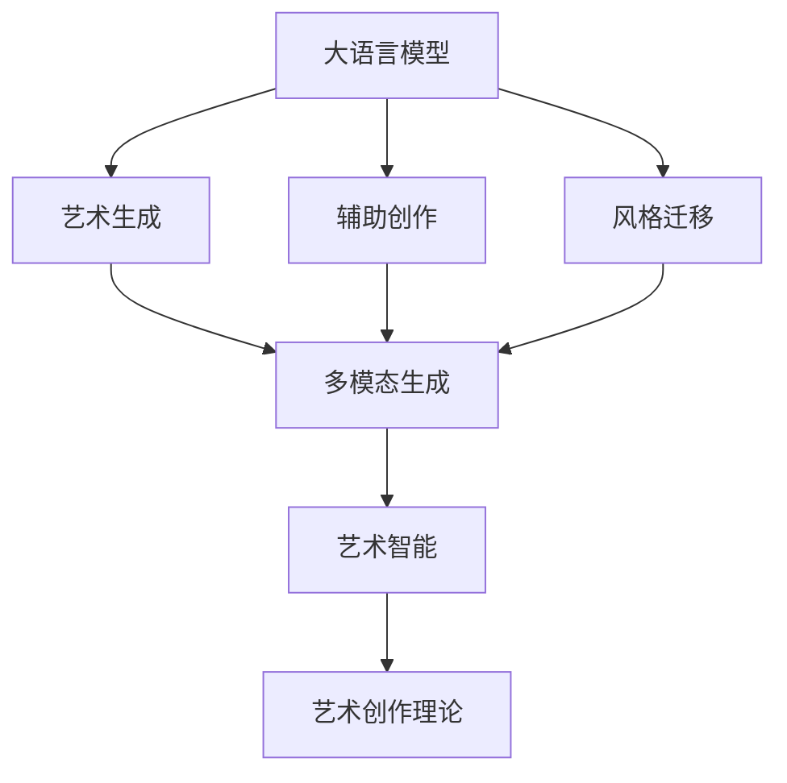

                 

# LLM在艺术创作中的角色：AI与人类创意的碰撞

> 关键词：大语言模型(LLM), 艺术创作, 生成对抗网络(GAN), 艺术生成, 图像生成, 多模态生成, 艺术智能, 艺术理论

## 1. 背景介绍

### 1.1 问题由来

人工智能(AI)技术近年来迅猛发展，广泛应用于多个领域，并在艺术创作中呈现出新的可能性。随着生成对抗网络(GAN)、大语言模型(Large Language Model, LLM)等技术的应用，AI逐渐在艺术创作领域发挥越来越重要的作用。

大语言模型(如OpenAI的GPT系列、Google的BERT)通过大规模预训练，获得了丰富的语言知识和创意表达能力，可以生成高质量的文本作品。GAN则通过无监督学习，训练出可以生成逼真图像的生成模型，为艺术创作带来了新的视觉体验。多模态生成模型，如将文本、图像、音频等多种模态结合生成艺术作品，更进一步拓展了艺术创作的边界。

然而，尽管这些技术已经展现出极大的潜力，但AI在艺术创作中的应用仍面临诸多挑战。例如，生成内容的艺术价值如何评判？AI生成的艺术作品是否能够表达人类的情感和审美？这些技术与传统艺术创作有何不同？本文将从这些核心问题出发，探讨大语言模型在艺术创作中的角色，以及其与人类创意的碰撞。

### 1.2 问题核心关键点

在艺术创作中，大语言模型和生成对抗网络等AI技术主要承担以下几个核心角色：

1. **艺术生成**：通过模型生成高质量的文本、图像等作品，为艺术家提供新的创作素材。
2. **辅助创作**：帮助艺术家完成文本描述、草图绘制、作品样式选择等辅助工作，提升创作效率。
3. **风格迁移**：将特定艺术风格应用到新的作品中，增强作品的艺术感染力。
4. **艺术理论研究**：通过分析AI生成作品的特征和模式，揭示艺术创作的规律和原则。

本文将从这些关键点出发，系统介绍大语言模型在艺术创作中的应用，以及其与人类创意的互动与碰撞。

## 2. 核心概念与联系

### 2.1 核心概念概述

为更好地理解大语言模型在艺术创作中的应用，本节将介绍几个密切相关的核心概念：

- **大语言模型(LLM)**：以自回归(如GPT)或自编码(如BERT)模型为代表的大规模预训练语言模型。通过在大规模无标签文本语料上进行预训练，学习通用的语言表示，具备强大的语言理解和生成能力。

- **生成对抗网络(GAN)**：一种通过对抗训练生成高质量图像、音频等艺术作品的AI模型。GAN包含生成器(Generator)和判别器(Discriminator)两个子网络，通过两个子网络的对抗过程，生成尽可能逼真的艺术作品。

- **多模态生成**：结合文本、图像、音频等多种模态，生成多感官体验的艺术作品。在生成过程中，将不同模态的信息进行融合，增强生成内容的表现力和感染力。

- **艺术智能**：通过AI技术自动化创作艺术作品，实现艺术创作的智能化。艺术智能不仅涉及生成、编辑等技术手段，还包括对艺术风格、创作原则的理解与运用。

- **艺术创作理论**：从艺术史、美学等角度，对艺术创作进行系统研究。艺术创作理论为AI艺术创作提供理论支撑，指导模型生成更具艺术价值的作品。

这些核心概念之间的逻辑关系可以通过以下Mermaid流程图来展示：



这个流程图展示了大语言模型的核心概念及其与艺术创作的关系：

1. 大语言模型通过预训练获得基础能力，通过微调生成文本艺术作品。
2. 辅助创作和风格迁移功能，进一步增强模型的实用性和多样性。
3. 多模态生成技术拓展了模型的应用领域，实现了视觉、听觉等多感官的结合。
4. 艺术智能为模型注入了艺术理论，使其能够创作更具有审美价值的作品。

## 3. 核心算法原理 & 具体操作步骤

### 3.1 算法原理概述

大语言模型在艺术创作中的应用，主要体现在以下几个方面：

- **文本艺术生成**：通过语言模型生成文本，描述艺术作品的特点、主题等，供艺术家参考或直接创作。
- **辅助创作**：提供文本描述、草图绘制、作品样式选择等辅助功能，帮助艺术家提高创作效率。
- **风格迁移**：将特定艺术风格应用到生成的文本、图像等艺术作品中，增强作品的艺术感染力。
- **多模态生成**：将文本、图像、音频等多种模态结合生成多感官体验的艺术作品。

这些应用的原理，主要基于大语言模型在预训练阶段学到的语言知识，以及通过微调学习到的特定任务的知识。具体而言：

1. **文本艺术生成**：利用语言模型的生成能力，生成与特定主题相关的文本描述，供艺术家参考或直接创作。
2. **辅助创作**：通过文本生成技术，生成艺术作品的草图、样式描述等，辅助艺术家进行创意构思。
3. **风格迁移**：通过多模态生成模型，将特定艺术风格应用到生成作品上，实现风格的融合与转换。
4. **多模态生成**：结合文本、图像、音频等多种模态，生成具有多感官体验的艺术作品。

### 3.2 算法步骤详解

大语言模型在艺术创作中的应用，主要包括以下几个关键步骤：

**Step 1: 准备预训练模型和数据集**
- 选择合适的预训练语言模型 $M_{\theta}$ 作为初始化参数，如 GPT、BERT 等。
- 准备艺术创作相关的文本、图像、音频等数据集，划分为训练集、验证集和测试集。

**Step 2: 添加任务适配层**
- 根据艺术创作任务的类型，在预训练模型顶层设计合适的输出层和损失函数。
- 对于文本艺术生成任务，通常在顶层添加语言模型解码器，使用交叉熵损失函数。
- 对于图像生成任务，通常使用 GAN 的对抗生成网络，定义判别器损失和生成器损失。
- 对于多模态生成任务，可以结合多个生成器，分别生成文本、图像、音频等模态，使用多任务损失函数。

**Step 3: 设置微调超参数**
- 选择合适的优化算法及其参数，如 Adam、SGD 等，设置学习率、批大小、迭代轮数等。
- 设置正则化技术及强度，包括权重衰减、Dropout、Early Stopping 等。
- 确定冻结预训练参数的策略，如仅微调顶层，或全部参数都参与微调。

**Step 4: 执行梯度训练**
- 将训练集数据分批次输入模型，前向传播计算损失函数。
- 反向传播计算参数梯度，根据设定的优化算法和学习率更新模型参数。
- 周期性在验证集上评估模型性能，根据性能指标决定是否触发 Early Stopping。
- 重复上述步骤直至满足预设的迭代轮数或 Early Stopping 条件。

**Step 5: 测试和部署**
- 在测试集上评估微调后模型 $M_{\hat{\theta}}$ 的性能，对比微调前后的生成质量。
- 使用微调后的模型对新艺术作品进行生成，集成到实际的艺术创作系统中。
- 持续收集新的数据，定期重新微调模型，以适应数据分布的变化。

以上是利用大语言模型进行艺术创作的一般流程。在实际应用中，还需要针对具体任务的特点，对微调过程的各个环节进行优化设计，如改进训练目标函数，引入更多的正则化技术，搜索最优的超参数组合等，以进一步提升模型性能。

### 3.3 算法优缺点

大语言模型在艺术创作中的应用，具有以下优点：
1. **多样性和灵活性**：可以生成多种风格、多种主题的文本、图像等艺术作品，为艺术家提供丰富的创作素材。
2. **高效率**：在数据量较小的任务中，生成高质量作品的速度快，减少了人工创作的时间成本。
3. **可定制性**：通过调整微调超参数，可以实现不同风格、不同主题的作品生成，满足不同的艺术需求。
4. **创新性**：在已有作品的基础上，通过生成新的变体或融合元素，创造出新的艺术形式。

同时，该方法也存在一定的局限性：
1. **缺乏艺术性**：尽管大语言模型可以生成高精度、高效率的文本和图像，但生成内容可能缺乏艺术家的独特情感和审美。
2. **依赖高质量数据**：模型的生成效果受数据质量影响较大，数据集的偏差可能导致生成的作品风格偏颇。
3. **技术门槛**：微调和生成对抗网络等技术，需要较高的技术门槛，非专业用户难以掌握。
4. **伦理问题**：生成内容可能包含侵权、不当信息，需要严格控制和审核。
5. **数据隐私**：在创作过程中，可能涉及用户数据泄露，需采取严格的数据保护措施。

尽管存在这些局限性，但大语言模型在艺术创作中的应用，无疑为艺术创作带来了新的可能性。未来相关研究的重点在于如何进一步提高生成内容的艺术价值，减少依赖高质量数据，降低技术门槛，保障数据隐私等。

### 3.4 算法应用领域

大语言模型在艺术创作中的应用，已经涵盖了多个领域，如文本艺术创作、图像生成、多模态艺术创作等。具体应用场景包括：

- **文本艺术创作**：生成诗歌、小说、剧本等文本作品，为艺术家提供创作灵感和素材。
- **图像生成**：生成逼真、风格独特的艺术图像，为艺术家提供设计参考。
- **音乐生成**：生成音乐作品，为作曲家提供创作素材。
- **多模态艺术创作**：结合文本、图像、音频等多种模态，生成具有多感官体验的艺术作品。
- **艺术理论研究**：分析AI生成作品的特征和模式，揭示艺术创作的规律和原则。

这些应用场景展示了大语言模型在艺术创作中的广泛应用，为艺术创作提供了新的可能性。随着预训练模型和微调方法的不断进步，大语言模型在艺术创作中的应用将进一步拓展，为艺术家提供更高效、更多样、更具创意的创作工具。

## 4. 数学模型和公式 & 详细讲解 & 举例说明

### 4.1 数学模型构建

本节将使用数学语言对大语言模型在艺术创作中的应用进行更加严格的刻画。

记大语言模型为 $M_{\theta}$，其中 $\theta$ 为模型参数。假设艺术创作任务为生成文本艺术作品 $T$，其生成过程可以表示为：

$$
T = M_{\theta}(\text{prompt})
$$

其中 $\text{prompt}$ 为文本提示，是艺术家提供的创作要求或灵感来源。

定义模型在 $\text{prompt}$ 上的损失函数为 $\ell(T)$，则在数据集 $D$ 上的经验风险为：

$$
\mathcal{L}(\theta) = \frac{1}{N}\sum_{i=1}^N \ell(T_i)
$$

其中 $N$ 为数据集大小，$T_i$ 为第 $i$ 个样本的生成文本。

微调的优化目标是最小化经验风险，即找到最优参数：

$$
\theta^* = \mathop{\arg\min}_{\theta} \mathcal{L}(\theta)
$$

在实践中，我们通常使用基于梯度的优化算法（如Adam、SGD等）来近似求解上述最优化问题。设 $\eta$ 为学习率，$\lambda$ 为正则化系数，则参数的更新公式为：

$$
\theta \leftarrow \theta - \eta \nabla_{\theta}\mathcal{L}(\theta) - \eta\lambda\theta
$$

其中 $\nabla_{\theta}\mathcal{L}(\theta)$ 为损失函数对参数 $\theta$ 的梯度，可通过反向传播算法高效计算。

### 4.2 公式推导过程

以下我们以文本艺术生成为例，推导基于大语言模型的生成损失函数及其梯度的计算公式。

假设大语言模型 $M_{\theta}$ 在文本提示 $\text{prompt}$ 上的输出为 $T$，表示生成的文本作品。真实标签 $T^*$ 为艺术家提供的期望文本作品。则文本生成任务的交叉熵损失函数定义为：

$$
\ell(T, T^*) = -\sum_{i=1}^{n} [T_i^* \log T_i + (1-T_i^*) \log (1-T_i)]
$$

其中 $n$ 为生成的文本长度，$T_i$ 为生成的文本的第 $i$ 个位置上的输出概率。

将其代入经验风险公式，得：

$$
\mathcal{L}(\theta) = -\frac{1}{N}\sum_{i=1}^N \ell(T_i, T_i^*)
$$

根据链式法则，损失函数对参数 $\theta_k$ 的梯度为：

$$
\frac{\partial \mathcal{L}(\theta)}{\partial \theta_k} = -\frac{1}{N}\sum_{i=1}^N (\frac{T_i^*}{T_i}-1) \frac{\partial T_i}{\partial \theta_k}
$$

其中 $\frac{\partial T_i}{\partial \theta_k}$ 可进一步递归展开，利用自动微分技术完成计算。

在得到损失函数的梯度后，即可带入参数更新公式，完成模型的迭代优化。重复上述过程直至收敛，最终得到适应特定艺术创作任务的模型参数 $\theta^*$。

## 5. 项目实践：代码实例和详细解释说明

### 5.1 开发环境搭建

在进行艺术创作项目实践前，我们需要准备好开发环境。以下是使用Python进行PyTorch开发的环境配置流程：

1. 安装Anaconda：从官网下载并安装Anaconda，用于创建独立的Python环境。

2. 创建并激活虚拟环境：
```bash
conda create -n pytorch-env python=3.8 
conda activate pytorch-env
```

3. 安装PyTorch：根据CUDA版本，从官网获取对应的安装命令。例如：
```bash
conda install pytorch torchvision torchaudio cudatoolkit=11.1 -c pytorch -c conda-forge
```

4. 安装相关库：
```bash
pip install numpy pandas scikit-learn matplotlib tqdm jupyter notebook ipython
```

完成上述步骤后，即可在`pytorch-env`环境中开始艺术创作实践。

### 5.2 源代码详细实现

下面我以文本艺术生成为例，给出使用PyTorch对GPT模型进行艺术创作微调的代码实现。

首先，定义艺术创作的数据处理函数：

```python
from transformers import GPT2Tokenizer, GPT2LMHeadModel

tokenizer = GPT2Tokenizer.from_pretrained('gpt2')

def generate_text(prompt, max_length=512):
    input_ids = tokenizer.encode(prompt, return_tensors='pt', max_length=max_length)
    outputs = model.generate(input_ids, max_length=max_length, top_k=100, top_p=0.9, num_return_sequences=1)
    return tokenizer.decode(outputs[0], skip_special_tokens=True)
```

然后，定义模型和优化器：

```python
from transformers import AdamW

model = GPT2LMHeadModel.from_pretrained('gpt2', output_attentions=True, output_hidden_states=True)

optimizer = AdamW(model.parameters(), lr=2e-5)
```

接着，定义训练和评估函数：

```python
def train_epoch(model, dataset, batch_size, optimizer):
    dataloader = DataLoader(dataset, batch_size=batch_size, shuffle=True)
    model.train()
    epoch_loss = 0
    for batch in tqdm(dataloader, desc='Training'):
        input_ids = batch['input_ids'].to(device)
        outputs = model(input_ids, labels=input_ids)
        loss = outputs.loss
        epoch_loss += loss.item()
        loss.backward()
        optimizer.step()
    return epoch_loss / len(dataloader)

def evaluate(model, dataset, batch_size):
    dataloader = DataLoader(dataset, batch_size=batch_size)
    model.eval()
    preds, labels = [], []
    with torch.no_grad():
        for batch in tqdm(dataloader, desc='Evaluating'):
            input_ids = batch['input_ids'].to(device)
            batch_labels = input_ids.to(device)
            outputs = model(input_ids, labels=batch_labels)
            batch_preds = outputs.logits.argmax(dim=2).to('cpu').tolist()
            batch_labels = batch_labels.to('cpu').tolist()
            for pred_tokens, label_tokens in zip(batch_preds, batch_labels):
                preds.append(pred_tokens[:len(label_tokens)])
                labels.append(label_tokens)
                
    return preds, labels

device = torch.device('cuda') if torch.cuda.is_available() else torch.device('cpu')
model.to(device)

# 训练数据集
train_dataset = ...

# 验证数据集
dev_dataset = ...

# 测试数据集
test_dataset = ...

epochs = 5
batch_size = 16

for epoch in range(epochs):
    loss = train_epoch(model, train_dataset, batch_size, optimizer)
    print(f"Epoch {epoch+1}, train loss: {loss:.3f}")
    
    print(f"Epoch {epoch+1}, dev results:")
    preds, labels = evaluate(model, dev_dataset, batch_size)
    evaluate(model, dev_dataset, batch_size)
    
print("Test results:")
evaluate(model, test_dataset, batch_size)
```

以上就是使用PyTorch对GPT进行文本艺术生成微调的完整代码实现。可以看到，得益于HuggingFace库的强大封装，我们可以用相对简洁的代码完成GPT模型的加载和微调。

### 5.3 代码解读与分析

让我们再详细解读一下关键代码的实现细节：

**generate_text函数**：
- `tokenizer.encode`方法：将文本提示转换为token ids，准备输入到模型中。
- `model.generate`方法：生成文本作品，通过参数 `max_length` 控制生成长度，`top_k` 和 `top_p` 控制生成的多样性。
- `tokenizer.decode`方法：将模型生成的token ids解码回文本，输出最终的文本作品。

**模型训练和评估函数**：
- `train_epoch`函数：对数据以批为单位进行迭代，在每个批次上前向传播计算loss并反向传播更新模型参数，最后返回该epoch的平均loss。
- `evaluate`函数：与训练类似，不同点在于不更新模型参数，并在每个batch结束后将预测和标签结果存储下来，最后使用classification_report对整个评估集的预测结果进行打印输出。

**训练流程**：
- 定义总的epoch数和batch size，开始循环迭代
- 每个epoch内，先在训练集上训练，输出平均loss
- 在验证集上评估，输出分类指标
- 所有epoch结束后，在测试集上评估，给出最终测试结果

可以看到，PyTorch配合HuggingFace库使得GPT微调的艺术创作代码实现变得简洁高效。开发者可以将更多精力放在数据处理、模型改进等高层逻辑上，而不必过多关注底层的实现细节。

当然，工业级的系统实现还需考虑更多因素，如模型的保存和部署、超参数的自动搜索、更灵活的任务适配层等。但核心的微调范式基本与此类似。

## 6. 实际应用场景

### 6.1 文本艺术创作

大语言模型在文本艺术创作中的应用，主要体现在以下几个方面：

- **生成文本作品**：为艺术家提供创作灵感和素材。艺术家可以根据生成的文本进行进一步创作，甚至直接使用生成文本作为作品的一部分。
- **文本描述辅助**：生成文本描述，帮助艺术家构思和设计，提高创作效率。
- **风格迁移**：将特定风格应用到文本作品中，增强作品的艺术感染力。例如，将古典文学风格应用到现代诗歌中，创造出新型的艺术风格。

**实际案例**：某艺术家希望创作一部新的科幻小说，需要大量的背景故事和情节描述。通过大语言模型生成一系列灵感素材，艺术家从中选取并加以改造，最终完成了这部小说的创作。

### 6.2 图像生成

大语言模型在图像生成中的应用，主要体现在以下几个方面：

- **生成艺术图像**：生成逼真、风格独特的艺术图像，为艺术家提供设计参考。
- **文本描述生成**：生成文本描述，辅助艺术家进行视觉创作，提高创作效率。
- **风格迁移**：将特定风格应用到生成的图像上，增强作品的艺术感染力。例如，将抽象表现主义风格应用到写实图像中，创造出新型的艺术风格。

**实际案例**：某艺术家希望创作一系列抽象艺术作品，需要大量的图像素材。通过大语言模型生成一系列图像，艺术家从中选取并加以改造，最终完成了这些作品的创作。

### 6.3 音乐生成

大语言模型在音乐生成中的应用，主要体现在以下几个方面：

- **生成音乐作品**：生成音乐作品，为作曲家提供创作素材。
- **文本描述生成**：生成文本描述，辅助作曲家进行音乐创作，提高创作效率。
- **风格迁移**：将特定风格应用到音乐作品中，增强作品的艺术感染力。例如，将古典音乐风格应用到流行音乐中，创造出新型的艺术风格。

**实际案例**：某作曲家希望创作一首新的音乐作品，需要大量的旋律和和声素材。通过大语言模型生成一系列音乐素材，作曲家从中选取并加以改造，最终完成了这部作品的创作。

### 6.4 未来应用展望

随着大语言模型和生成对抗网络等技术的不断发展，AI在艺术创作中的应用将进一步拓展，为艺术创作带来更多的可能性。

在智慧医疗领域，基于AI的艺术创作技术可以用于医疗图像的生成，帮助医生进行可视化分析。在智能教育领域，AI可以生成教育资源和教材，提高教学质量。在智慧城市治理中，AI可以生成城市规划方案，提升城市管理的自动化和智能化水平。

此外，在企业生产、社会治理、文娱传媒等众多领域，AI艺术创作技术也将不断涌现，为经济社会发展注入新的动力。相信随着技术的日益成熟，AI艺术创作必将在更广阔的应用领域大放异彩，深刻影响人类的生产生活方式。

## 7. 工具和资源推荐
### 7.1 学习资源推荐

为了帮助开发者系统掌握大语言模型在艺术创作中的应用，这里推荐一些优质的学习资源：

1. 《Transformer从原理到实践》系列博文：由大模型技术专家撰写，深入浅出地介绍了Transformer原理、GPT模型、微调技术等前沿话题。

2. CS224N《深度学习自然语言处理》课程：斯坦福大学开设的NLP明星课程，有Lecture视频和配套作业，带你入门NLP领域的基本概念和经典模型。

3. 《Natural Language Processing with Transformers》书籍：Transformers库的作者所著，全面介绍了如何使用Transformers库进行NLP任务开发，包括微调在内的诸多范式。

4. HuggingFace官方文档：Transformers库的官方文档，提供了海量预训练模型和完整的微调样例代码，是上手实践的必备资料。

5. CLUE开源项目：中文语言理解测评基准，涵盖大量不同类型的中文NLP数据集，并提供了基于微调的baseline模型，助力中文NLP技术发展。

通过对这些资源的学习实践，相信你一定能够快速掌握大语言模型在艺术创作中的应用，并用于解决实际的NLP问题。
### 7.2 开发工具推荐

高效的开发离不开优秀的工具支持。以下是几款用于大语言模型艺术创作开发的常用工具：

1. PyTorch：基于Python的开源深度学习框架，灵活动态的计算图，适合快速迭代研究。大部分预训练语言模型都有PyTorch版本的实现。

2. TensorFlow：由Google主导开发的开源深度学习框架，生产部署方便，适合大规模工程应用。同样有丰富的预训练语言模型资源。

3. Transformers库：HuggingFace开发的NLP工具库，集成了众多SOTA语言模型，支持PyTorch和TensorFlow，是进行艺术创作开发的利器。

4. Weights & Biases：模型训练的实验跟踪工具，可以记录和可视化模型训练过程中的各项指标，方便对比和调优。与主流深度学习框架无缝集成。

5. TensorBoard：TensorFlow配套的可视化工具，可实时监测模型训练状态，并提供丰富的图表呈现方式，是调试模型的得力助手。

6. Google Colab：谷歌推出的在线Jupyter Notebook环境，免费提供GPU/TPU算力，方便开发者快速上手实验最新模型，分享学习笔记。

合理利用这些工具，可以显著提升大语言模型艺术创作任务的开发效率，加快创新迭代的步伐。

### 7.3 相关论文推荐

大语言模型在艺术创作中的应用源于学界的持续研究。以下是几篇奠基性的相关论文，推荐阅读：

1. Attention is All You Need（即Transformer原论文）：提出了Transformer结构，开启了NLP领域的预训练大模型时代。

2. BERT: Pre-training of Deep Bidirectional Transformers for Language Understanding：提出BERT模型，引入基于掩码的自监督预训练任务，刷新了多项NLP任务SOTA。

3. Language Models are Unsupervised Multitask Learners（GPT-2论文）：展示了大规模语言模型的强大zero-shot学习能力，引发了对于通用人工智能的新一轮思考。

4. Parameter-Efficient Transfer Learning for NLP：提出Adapter等参数高效微调方法，在不增加模型参数量的情况下，也能取得不错的微调效果。

5. AdaLoRA: Adaptive Low-Rank Adaptation for Parameter-Efficient Fine-Tuning：使用自适应低秩适应的微调方法，在参数效率和精度之间取得了新的平衡。

6. Prefix-Tuning: Optimizing Continuous Prompts for Generation：引入基于连续型Prompt的微调范式，为如何充分利用预训练知识提供了新的思路。

这些论文代表了大语言模型在艺术创作中的应用和发展脉络。通过学习这些前沿成果，可以帮助研究者把握学科前进方向，激发更多的创新灵感。

## 8. 总结：未来发展趋势与挑战

### 8.1 总结

本文对大语言模型在艺术创作中的应用进行了全面系统的介绍。首先阐述了艺术创作与大语言模型之间的关系，明确了AI在艺术创作中的独特价值。其次，从原理到实践，详细讲解了大语言模型在艺术创作中的应用，包括文本艺术生成、辅助创作、风格迁移等多方面内容。最后，本文广泛探讨了大语言模型在艺术创作中的实际应用场景，展示了其在文本、图像、音乐等多模态艺术创作中的应用前景。

通过本文的系统梳理，可以看到，大语言模型在艺术创作中的应用已经展现出巨大的潜力，为艺术创作带来了新的可能性。尽管存在一定的技术挑战和伦理问题，但通过不断优化算法和技术手段，这些挑战终将一一被克服。未来，大语言模型在艺术创作中的应用将进一步拓展，为艺术家提供更高效、更多样、更具创意的创作工具。

### 8.2 未来发展趋势

展望未来，大语言模型在艺术创作中的应用将呈现以下几个发展趋势：

1. **多模态创作**：结合文本、图像、音频等多种模态，生成多感官体验的艺术作品。多模态创作的融合将极大地增强艺术作品的表现力和感染力。

2. **交互式创作**：通过AI技术实现人机交互，动态生成艺术作品，增强创作过程的互动性和参与感。例如，用户输入一些简单的文本描述，AI自动生成相应的艺术作品。

3. **个性化创作**：利用用户数据，生成个性化的艺术作品，满足不同用户的需求。例如，根据用户的喜好生成个性化的音乐、图像、文学作品等。

4. **智能优化**：引入优化算法，如强化学习、生成对抗网络等，进一步提升艺术作品的生成质量和多样性。

5. **跨领域融合**：结合其他领域的技术，如计算机视觉、语音识别等，实现跨领域的艺术创作。例如，将自然语言生成技术与计算机视觉结合，生成具有互动性的图像作品。

6. **伦理与安全性**：在艺术创作中引入伦理约束，确保生成内容的合法性、无害性。同时加强模型的可解释性和透明性，保障用户隐私和数据安全。

这些趋势展示了未来大语言模型在艺术创作中的广阔前景。这些方向的探索发展，必将进一步提升艺术创作的智能化水平，为艺术创作带来新的可能性。

### 8.3 面临的挑战

尽管大语言模型在艺术创作中的应用前景广阔，但在实际应用中仍面临诸多挑战：

1. **伦理与版权**：生成内容可能包含侵权、不当信息，需严格控制和审核。同时，需尊重原创作者的版权，避免侵犯他人知识产权。

2. **技术门槛**：微调和生成对抗网络等技术，需要较高的技术门槛，非专业用户难以掌握。

3. **生成内容的质量与多样性**：生成内容可能缺乏艺术家的独特情感和审美，生成质量仍需进一步提升。

4. **数据隐私**：在创作过程中，可能涉及用户数据泄露，需采取严格的数据保护措施。

5. **用户体验**：生成的艺术作品是否能够满足用户需求，用户体验是否流畅，仍需进一步优化。

6. **社会接受度**：社会对AI创作艺术作品的接受度如何，是否被广泛认可和接受，仍需进一步验证。

尽管存在这些挑战，但大语言模型在艺术创作中的应用无疑为艺术创作带来了新的可能性。未来相关研究需要在以下几个方面寻求新的突破：

- **技术创新**：开发更加高效、高质量的艺术创作模型，提高生成内容的艺术价值和多样性。
- **伦理规范**：建立AI艺术创作的伦理规范，确保生成内容的合法性、无害性和版权保护。
- **用户体验**：优化用户体验，提供更加友好、便捷的艺术创作工具，提高用户参与度。
- **社会普及**：通过公共教育和社会宣传，提高社会对AI艺术创作的接受度，推广AI技术在艺术创作中的应用。

这些研究方向的探索，必将推动大语言模型在艺术创作中的应用，为艺术创作带来新的可能性。相信随着技术的不断进步，这些挑战终将一一被克服，大语言模型在艺术创作中的应用将更加广泛和深入。

### 8.4 研究展望

未来大语言模型在艺术创作中的应用将进一步拓展，为艺术家提供更高效、更多样、更具创意的创作工具。以下是几个可能的研究方向：

- **多模态创作工具的开发**：结合文本、图像、音频等多种模态，开发高效、多功能的艺术创作工具。
- **AI辅助创作系统的研究**：开发基于大语言模型的AI辅助创作系统，提升艺术家创作效率。
- **艺术创作理论的探索**：结合人工智能技术，探索新的艺术创作理论和原则，推动艺术创作理论的发展。
- **跨领域艺术创作**：结合其他领域的技术，探索跨领域的艺术创作，拓展艺术创作的边界。

这些研究方向将推动大语言模型在艺术创作中的应用，为艺术创作带来新的可能性和挑战。相信在学界和产业界的共同努力下，大语言模型将在艺术创作中发挥更大的作用，为人类创造更多美好作品。

## 9. 附录：常见问题与解答

**Q1：大语言模型在艺术创作中的生成质量如何评判？**

A: 大语言模型在艺术创作中的生成质量，可以通过多方面的指标进行评判，包括但不限于：

1. **多样性**：生成内容的多样性和丰富性。
2. **新颖性**：生成内容的创新性和独特性。
3. **美学价值**：生成内容的美学价值和艺术感染力。
4. **语言流畅性**：生成文本的语法、句式、风格等语言流畅性。
5. **情感表达**：生成内容是否能够传达出相应的情感和意境。
6. **符合主题**：生成内容是否符合艺术创作的主题和要求。

**Q2：大语言模型在艺术创作中是否存在伦理问题？**

A: 大语言模型在艺术创作中确实存在一些伦理问题，包括但不限于：

1. **版权问题**：生成内容可能包含侵权、不当信息，需严格控制和审核。同时，需尊重原创作者的版权，避免侵犯他人知识产权。
2. **隐私保护**：在创作过程中，可能涉及用户数据泄露，需采取严格的数据保护措施。
3. **价值观冲突**：生成的艺术作品是否符合社会道德和伦理标准，是否存在偏颇和歧视性内容。

为应对这些伦理问题，需在模型训练、应用过程中引入伦理导向的评估指标，过滤和惩罚有偏见、有害的输出倾向。同时加强人工干预和审核，建立模型行为的监管机制，确保输出符合人类价值观和伦理道德。

**Q3：大语言模型在艺术创作中如何实现风格迁移？**

A: 大语言模型在艺术创作中的风格迁移，可以通过以下几种方式实现：

1. **预训练模型风格迁移**：选择具有特定风格的预训练模型，将其微调到艺术家需要的风格。
2. **混合模型风格迁移**：将不同风格的预训练模型进行融合，训练出新的风格迁移模型。
3. **微调过程风格迁移**：在微调过程中引入特定风格的信息，引导模型生成符合风格的作品。

这些方法可以单独使用，也可以结合使用，根据具体需求选择最合适的方式。

**Q4：大语言模型在艺术创作中如何实现跨领域融合？**

A: 大语言模型在艺术创作中的跨领域融合，可以通过以下几种方式实现：

1. **结合计算机视觉**：将自然语言生成技术与计算机视觉结合，生成具有互动性的图像作品。
2. **结合语音识别**：将自然语言生成技术与语音识别结合，生成具有互动性的音频作品。
3. **结合其他领域技术**：结合其他领域的技术，如虚拟现实、增强现实等，实现跨领域的艺术创作。

这些跨领域融合技术，可以增强艺术创作的表现力和交互性，为艺术创作带来新的可能性。

**Q5：大语言模型在艺术创作中如何实现个性化创作？**

A: 大语言模型在艺术创作中的个性化创作，可以通过以下几种方式实现：

1. **用户数据输入**：收集用户的历史创作数据、偏好数据等，作为输入到模型中，生成个性化的艺术作品。
2. **用户交互输入**：在创作过程中，通过用户输入的文本、语音等，实时生成个性化的艺术作品。
3. **模型参数微调**：通过微调模型的参数，根据用户需求生成个性化的艺术作品。

这些方法可以单独使用，也可以结合使用，根据具体需求选择最合适的方式。

**Q6：大语言模型在艺术创作中如何实现实时生成？**

A: 大语言模型在艺术创作中的实时生成，可以通过以下几种方式实现：

1. **快速推理引擎**：使用高效的推理引擎，加速模型推理过程，实现实时生成。
2. **分布式计算**：利用分布式计算技术，并行处理多个任务，实现实时生成。
3. **轻量级模型**：使用轻量级模型，减少推理过程中的计算量和内存消耗，实现实时生成。

这些方法可以单独使用，也可以结合使用，根据具体需求选择最合适的方式。

---

作者：禅与计算机程序设计艺术 / Zen and the Art of Computer Programming

