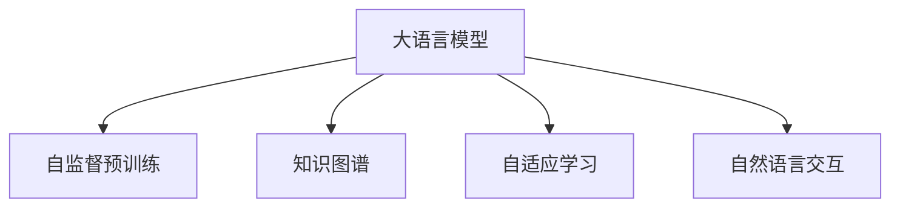

                 

## 1. 背景介绍

### 1.1 问题由来
随着人工智能和大数据技术的迅猛发展，特别是语言模型的进步，自然语言处理（Natural Language Processing, NLP）领域取得了显著的突破。大规模语言模型（Large Language Model, LLM），如BERT、GPT等，通过在大规模无标签文本数据上进行自监督预训练，已经能够理解并生成自然语言文本。这些模型不仅在语言理解和生成上表现出色，还能在多个下游任务上取得优异的效果，如问答系统、文本分类、情感分析等。

然而，尽管大语言模型在许多方面表现出色，其在教育领域的应用仍面临挑战。传统教育方法，如讲授、讨论、实验等，在传授知识和技能方面有其独特优势，但这些方法往往受到时间和空间的限制，且难以适应每个学生的个性化需求。而大语言模型的出现，为教育模式的创新提供了新的可能。

### 1.2 问题核心关键点
大语言模型在教育中的应用，可以简化为两个核心关键点：

1. **个性化学习**：大语言模型能够根据学生的学习进度和需求，提供个性化的学习资源和指导，从而提高学习效率和效果。
2. **泛化能力**：大语言模型具有较强的泛化能力，能够处理多种类型的文本数据，适用于不同领域和学科的教育需求。

## 2. 核心概念与联系

### 2.1 核心概念概述

为更好地理解大语言模型在教育中的应用，本节将介绍几个密切相关的核心概念：

- **大语言模型 (LLM)**：通过在大规模无标签文本语料上进行自监督预训练，学习通用语言知识和表示。
- **自监督预训练**：在大规模文本数据上，通过语言模型、掩码语言模型等任务，让模型自行学习语言结构和特征，无需标注数据。
- **知识图谱**：结构化的语义知识库，用于提供结构化的知识信息，辅助语言模型的理解和推理。
- **自适应学习**：根据学生的学习进度和反馈，动态调整学习计划和内容，以适应个体差异。
- **自然语言交互**：通过语言模型的双向对话能力，实现学生和教师之间的自然语言交互，提升教学互动性。

这些核心概念之间的逻辑关系可以通过以下Mermaid流程图来展示：



这个流程图展示了大语言模型在教育中的应用核心概念及其之间的关系：

1. 大语言模型通过自监督预训练获得语言知识和表示。
2. 知识图谱为语言模型提供结构化的知识信息，辅助理解。
3. 自适应学习利用大语言模型的能力，动态调整教学内容。
4. 自然语言交互利用大语言模型的双向对话能力，提升教学互动性。

这些概念共同构成了大语言模型在教育中的应用框架，使其能够在不同场景下发挥其独特的教育功能。通过理解这些核心概念，我们可以更好地把握大语言模型在教育中的应用潜力。

## 3. 核心算法原理 & 具体操作步骤
### 3.1 算法原理概述

大语言模型在教育中的应用，本质上是一种基于自监督学习和大规模预训练的个性化教育模式。其核心思想是：利用大语言模型的通用语言知识和表示，通过自适应学习和自然语言交互，提供个性化的教育资源和指导。

具体而言，假设预训练模型为 $M_{\theta}$，其中 $\theta$ 为预训练得到的模型参数。给定教育任务 $T$ 的学生学习数据集 $D=\{(x_i, y_i)\}_{i=1}^N$，其中 $x_i$ 为学生的学习样本，$y_i$ 为对应的目标输出（如答案、反馈等）。

教育任务的微调过程包括以下几个步骤：

1. **任务适配**：根据教育任务类型，在预训练模型顶层设计合适的输出层和损失函数。例如，在问答任务中，可以添加一个分类器，使用交叉熵损失函数；在情感分析任务中，可以添加一个情感分类器，使用二分类交叉熵损失函数。

2. **微调训练**：使用学生的学习数据集 $D$，对模型进行有监督的微调。微调过程中，使用自适应学习策略，根据学生的学习反馈，动态调整模型的输出。

3. **自然语言交互**：利用大语言模型的双向对话能力，与学生进行自然语言交互，获取学生的反馈和问题，并据此调整教学内容。

### 3.2 算法步骤详解

基于大语言模型的个性化教育方法，主要包括以下几个关键步骤：

**Step 1: 准备教育数据和模型**
- 选择合适的预训练语言模型 $M_{\theta}$ 作为初始化参数，如 BERT、GPT 等。
- 准备教育任务 $T$ 的学生学习数据集 $D$，包括学生的文本、反馈、问答等数据。

**Step 2: 任务适配层设计**
- 根据教育任务类型，在预训练模型顶层设计合适的输出层和损失函数。
- 对于问答任务，可以添加一个分类器，使用交叉熵损失函数。
- 对于情感分析任务，可以添加一个情感分类器，使用二分类交叉熵损失函数。

**Step 3: 设计自适应学习策略**
- 根据学生的学习进度和反馈，动态调整模型的输出。
- 可以使用基于规则的自适应学习策略，或结合强化学习等技术，优化学习过程。

**Step 4: 执行微调训练**
- 将学生的学习数据集 $D$ 分批次输入模型，前向传播计算损失函数。
- 反向传播计算参数梯度，根据设定的优化算法和学习率更新模型参数。
- 周期性在验证集上评估模型性能，根据性能指标决定是否触发 Early Stopping。
- 重复上述步骤直到满足预设的迭代轮数或 Early Stopping 条件。

**Step 5: 自然语言交互**
- 利用大语言模型的双向对话能力，与学生进行自然语言交互，获取学生的反馈和问题。
- 根据学生的反馈，动态调整教学内容和策略。
- 使用学生的问题作为模型输入，进行推理生成，提供个性化的学习资源和指导。

以上是基于大语言模型进行教育微调的一般流程。在实际应用中，还需要针对具体教育任务的特点，对微调过程的各个环节进行优化设计，如改进训练目标函数，引入更多的正则化技术，搜索最优的超参数组合等，以进一步提升模型性能。

### 3.3 算法优缺点

基于大语言模型的教育微调方法具有以下优点：
1. 个性化教育：根据学生的学习进度和反馈，提供个性化的学习资源和指导，提高学习效率和效果。
2. 泛化能力强：大语言模型具有较强的泛化能力，能够处理多种类型的文本数据，适用于不同领域和学科的教育需求。
3. 高效互动：利用大语言模型的双向对话能力，提升教学互动性，增强学习体验。

同时，该方法也存在一定的局限性：
1. 对标注数据依赖：微调效果很大程度上取决于标注数据的质量和数量，获取高质量标注数据的成本较高。
2. 数据隐私问题：学生的学习数据可能包含敏感信息，需要特别注意数据隐私保护。
3. 可解释性不足：大语言模型的决策过程缺乏可解释性，难以对其推理逻辑进行分析和调试。

尽管存在这些局限性，但就目前而言，基于大语言模型的教育微调方法仍然是教育领域的一种重要尝试。未来相关研究的重点在于如何进一步降低对标注数据的依赖，提高数据隐私保护能力，同时兼顾可解释性和伦理安全性等因素。

### 3.4 算法应用领域

基于大语言模型的教育微调方法，已经在多个教育应用中得到验证，以下是几个典型的应用场景：

- **在线教育**：利用大语言模型，开发智能辅导系统，为学生提供个性化学习资源和实时反馈。
- **虚拟助教**：通过大语言模型，开发虚拟助教应用，帮助学生解答问题，提供学习指导。
- **智能作业批改**：利用大语言模型，开发智能作业批改系统，自动评价学生作业，提供详细的反馈和建议。
- **阅读推荐**：根据学生的阅读偏好和历史数据，推荐个性化的阅读材料，提升阅读兴趣和效果。
- **在线考试**：利用大语言模型，开发智能考试系统，自动出题、评分，评估学生的学习效果。

除了上述这些经典应用外，大语言模型在教育领域的应用还在不断拓展，如课程设计、课堂管理等，为教育模式的创新提供了新的路径。

## 4. 数学模型和公式 & 详细讲解 & 举例说明

### 4.1 数学模型构建

本节将使用数学语言对基于大语言模型的个性化教育方法进行更加严格的刻画。

假设大语言模型为 $M_{\theta}$，其中 $\theta$ 为模型参数。给定教育任务 $T$ 的学生学习数据集 $D=\{(x_i, y_i)\}_{i=1}^N$，其中 $x_i$ 为学生的学习样本，$y_i$ 为对应的目标输出。

定义模型 $M_{\theta}$ 在学生学习样本 $x_i$ 上的损失函数为 $\ell(M_{\theta}(x_i),y_i)$，则在数据集 $D$ 上的经验风险为：

$$
\mathcal{L}(\theta) = \frac{1}{N} \sum_{i=1}^N \ell(M_{\theta}(x_i),y_i)
$$

微调的优化目标是最小化经验风险，即找到最优参数：

$$
\theta^* = \mathop{\arg\min}_{\theta} \mathcal{L}(\theta)
$$

在实践中，我们通常使用基于梯度的优化算法（如SGD、Adam等）来近似求解上述最优化问题。设 $\eta$ 为学习率，$\lambda$ 为正则化系数，则参数的更新公式为：

$$
\theta \leftarrow \theta - \eta \nabla_{\theta}\mathcal{L}(\theta) - \eta\lambda\theta
$$

其中 $\nabla_{\theta}\mathcal{L}(\theta)$ 为损失函数对参数 $\theta$ 的梯度，可通过反向传播算法高效计算。

### 4.2 公式推导过程

以下我们以问答任务为例，推导交叉熵损失函数及其梯度的计算公式。

假设模型 $M_{\theta}$ 在输入 $x$ 上的输出为 $\hat{y}=M_{\theta}(x) \in [0,1]$，表示模型认为问题的正确答案的概率。真实标签 $y \in \{0,1\}$。则二分类交叉熵损失函数定义为：

$$
\ell(M_{\theta}(x),y) = -[y\log \hat{y} + (1-y)\log (1-\hat{y})]
$$

将其代入经验风险公式，得：

$$
\mathcal{L}(\theta) = -\frac{1}{N}\sum_{i=1}^N [y_i\log M_{\theta}(x_i)+(1-y_i)\log(1-M_{\theta}(x_i))]
$$

根据链式法则，损失函数对参数 $\theta_k$ 的梯度为：

$$
\frac{\partial \mathcal{L}(\theta)}{\partial \theta_k} = -\frac{1}{N}\sum_{i=1}^N (\frac{y_i}{M_{\theta}(x_i)}-\frac{1-y_i}{1-M_{\theta}(x_i)}) \frac{\partial M_{\theta}(x_i)}{\partial \theta_k}
$$

其中 $\frac{\partial M_{\theta}(x_i)}{\partial \theta_k}$ 可进一步递归展开，利用自动微分技术完成计算。

在得到损失函数的梯度后，即可带入参数更新公式，完成模型的迭代优化。重复上述过程直至收敛，最终得到适应教育任务的最优模型参数 $\theta^*$。

## 5. 项目实践：代码实例和详细解释说明

### 5.1 开发环境搭建

在进行教育微调实践前，我们需要准备好开发环境。以下是使用Python进行PyTorch开发的环境配置流程：

1. 安装Anaconda：从官网下载并安装Anaconda，用于创建独立的Python环境。

2. 创建并激活虚拟环境：
```bash
conda create -n pytorch-env python=3.8 
conda activate pytorch-env
```

3. 安装PyTorch：根据CUDA版本，从官网获取对应的安装命令。例如：
```bash
conda install pytorch torchvision torchaudio cudatoolkit=11.1 -c pytorch -c conda-forge
```

4. 安装Transformers库：
```bash
pip install transformers
```

5. 安装各类工具包：
```bash
pip install numpy pandas scikit-learn matplotlib tqdm jupyter notebook ipython
```

完成上述步骤后，即可在`pytorch-env`环境中开始教育微调实践。

### 5.2 源代码详细实现

这里我们以问答任务为例，给出使用Transformers库对BERT模型进行教育微调的PyTorch代码实现。

首先，定义问答任务的数据处理函数：

```python
from transformers import BertTokenizer
from torch.utils.data import Dataset
import torch

class QuestionDataset(Dataset):
    def __init__(self, texts, labels, tokenizer, max_len=128):
        self.texts = texts
        self.labels = labels
        self.tokenizer = tokenizer
        self.max_len = max_len
        
    def __len__(self):
        return len(self.texts)
    
    def __getitem__(self, item):
        text = self.texts[item]
        label = self.labels[item]
        
        encoding = self.tokenizer(text, return_tensors='pt', max_length=self.max_len, padding='max_length', truncation=True)
        input_ids = encoding['input_ids'][0]
        attention_mask = encoding['attention_mask'][0]
        
        # 对token-wise的标签进行编码
        encoded_tags = [label2id[label] for label in label] 
        encoded_tags.extend([label2id['None']] * (self.max_len - len(encoded_tags)))
        labels = torch.tensor(encoded_tags, dtype=torch.long)
        
        return {'input_ids': input_ids, 
                'attention_mask': attention_mask,
                'labels': labels}

# 标签与id的映射
label2id = {'None': 0, 'A': 1, 'B': 2, 'C': 3}
id2label = {v: k for k, v in label2id.items()}

# 创建dataset
tokenizer = BertTokenizer.from_pretrained('bert-base-cased')

train_dataset = QuestionDataset(train_texts, train_labels, tokenizer)
dev_dataset = QuestionDataset(dev_texts, dev_labels, tokenizer)
test_dataset = QuestionDataset(test_texts, test_labels, tokenizer)
```

然后，定义模型和优化器：

```python
from transformers import BertForTokenClassification, AdamW

model = BertForTokenClassification.from_pretrained('bert-base-cased', num_labels=len(label2id))

optimizer = AdamW(model.parameters(), lr=2e-5)
```

接着，定义训练和评估函数：

```python
from torch.utils.data import DataLoader
from tqdm import tqdm
from sklearn.metrics import classification_report

device = torch.device('cuda') if torch.cuda.is_available() else torch.device('cpu')
model.to(device)

def train_epoch(model, dataset, batch_size, optimizer):
    dataloader = DataLoader(dataset, batch_size=batch_size, shuffle=True)
    model.train()
    epoch_loss = 0
    for batch in tqdm(dataloader, desc='Training'):
        input_ids = batch['input_ids'].to(device)
        attention_mask = batch['attention_mask'].to(device)
        labels = batch['labels'].to(device)
        model.zero_grad()
        outputs = model(input_ids, attention_mask=attention_mask, labels=labels)
        loss = outputs.loss
        epoch_loss += loss.item()
        loss.backward()
        optimizer.step()
    return epoch_loss / len(dataloader)

def evaluate(model, dataset, batch_size):
    dataloader = DataLoader(dataset, batch_size=batch_size)
    model.eval()
    preds, labels = [], []
    with torch.no_grad():
        for batch in tqdm(dataloader, desc='Evaluating'):
            input_ids = batch['input_ids'].to(device)
            attention_mask = batch['attention_mask'].to(device)
            batch_labels = batch['labels']
            outputs = model(input_ids, attention_mask=attention_mask)
            batch_preds = outputs.logits.argmax(dim=2).to('cpu').tolist()
            batch_labels = batch_labels.to('cpu').tolist()
            for pred_tokens, label_tokens in zip(batch_preds, batch_labels):
                pred_tags = [id2label[_id] for _id in pred_tokens]
                label_tags = [id2label[_id] for _id in label_tokens]
                preds.append(pred_tags[:len(label_tags)])
                labels.append(label_tags)
                
    print(classification_report(labels, preds))
```

最后，启动训练流程并在测试集上评估：

```python
epochs = 5
batch_size = 16

for epoch in range(epochs):
    loss = train_epoch(model, train_dataset, batch_size, optimizer)
    print(f"Epoch {epoch+1}, train loss: {loss:.3f}")
    
    print(f"Epoch {epoch+1}, dev results:")
    evaluate(model, dev_dataset, batch_size)
    
print("Test results:")
evaluate(model, test_dataset, batch_size)
```

以上就是使用PyTorch对BERT进行问答任务教育微调的完整代码实现。可以看到，得益于Transformers库的强大封装，我们可以用相对简洁的代码完成BERT模型的加载和微调。

### 5.3 代码解读与分析

让我们再详细解读一下关键代码的实现细节：

**QuestionDataset类**：
- `__init__`方法：初始化文本、标签、分词器等关键组件。
- `__len__`方法：返回数据集的样本数量。
- `__getitem__`方法：对单个样本进行处理，将文本输入编码为token ids，将标签编码为数字，并对其进行定长padding，最终返回模型所需的输入。

**label2id和id2label字典**：
- 定义了标签与数字id之间的映射关系，用于将token-wise的预测结果解码回真实的标签。

**训练和评估函数**：
- 使用PyTorch的DataLoader对数据集进行批次化加载，供模型训练和推理使用。
- 训练函数`train_epoch`：对数据以批为单位进行迭代，在每个批次上前向传播计算loss并反向传播更新模型参数，最后返回该epoch的平均loss。
- 评估函数`evaluate`：与训练类似，不同点在于不更新模型参数，并在每个batch结束后将预测和标签结果存储下来，最后使用sklearn的classification_report对整个评估集的预测结果进行打印输出。

**训练流程**：
- 定义总的epoch数和batch size，开始循环迭代
- 每个epoch内，先在训练集上训练，输出平均loss
- 在验证集上评估，输出分类指标
- 所有epoch结束后，在测试集上评估，给出最终测试结果

可以看到，PyTorch配合Transformers库使得BERT微调的代码实现变得简洁高效。开发者可以将更多精力放在数据处理、模型改进等高层逻辑上，而不必过多关注底层的实现细节。

当然，工业级的系统实现还需考虑更多因素，如模型的保存和部署、超参数的自动搜索、更灵活的任务适配层等。但核心的教育微调范式基本与此类似。

## 6. 实际应用场景

### 6.1 智能辅导系统

基于大语言模型的教育微调方法，可以应用于智能辅导系统的开发。传统的教育辅导往往依赖于人力，不仅成本高，而且效率低。而使用微调后的语言模型，可以实时、动态地为学生提供个性化学习资源和指导，大幅提升教育效果。

在技术实现上，可以收集学生的学习历史、测试成绩、反馈等信息，将这些数据作为监督信号，训练微调后的语言模型。微调后的模型能够根据学生的学习进度和偏好，推荐个性化的学习资源，如练习题、视频、文章等。同时，模型还能实时回答学生的问题，提供个性化的反馈和建议。

### 6.2 虚拟助教

虚拟助教是大语言模型在教育领域的一个重要应用场景。传统的助教角色往往需要人工干预，既耗费人力又难以保证一致性。而使用微调后的语言模型，可以24小时在线，为学生提供随时随地的学习支持。

在技术实现上，可以利用微调后的语言模型，开发虚拟助教应用，通过自然语言交互，获取学生的问题和需求，提供相应的回答和建议。例如，在在线学习平台中，学生可以随时向虚拟助教提出问题，模型能够即时回答，并根据学生的学习进度和偏好，推荐相应的学习资源。

### 6.3 智能作业批改

传统的作业批改往往依赖人工，耗时耗力，且难以保证一致性。使用微调后的语言模型，可以自动批改学生的作业，提高批改效率和准确性。

在技术实现上，可以将学生的作业输入微调后的语言模型，模型能够自动识别并分析学生的作业，给出评分和详细的反馈。例如，在数学作业批改系统中，模型能够自动识别学生的解题步骤和答案，根据设定的评分标准，给出相应的分数和建议。

### 6.4 未来应用展望

随着大语言模型和教育微调技术的不断发展，基于大语言模型的教育应用将在更多领域得到应用，为教育模式的创新提供新的可能。

在智慧教室中，智能化的教学设备和大语言模型结合，可以实现自动化的教学管理，提升教学质量。例如，通过智能黑板、虚拟现实等设备，将学生的注意力集中在教学内容上，增强教学效果。

在远程教育中，大语言模型可以实时互动，为学生提供个性化的学习支持。例如，在在线课堂中，虚拟助教能够实时回答学生的问题，提供个性化的学习资源。

在职业培训中，微调后的语言模型可以提供定制化的培训方案，帮助学员快速掌握新技能。例如，在IT培训课程中，模型能够根据学员的学习进度和偏好，推荐相应的课程内容和学习资源。

除了上述这些经典应用外，大语言模型在教育领域的应用还在不断拓展，如课程设计、课堂管理等，为教育模式的创新提供新的路径。

## 7. 工具和资源推荐
### 7.1 学习资源推荐

为了帮助开发者系统掌握大语言模型在教育中的应用，这里推荐一些优质的学习资源：

1. 《Transformer from Principles to Practice》系列博文：由大模型技术专家撰写，深入浅出地介绍了Transformer原理、BERT模型、教育微调技术等前沿话题。

2. CS224N《深度学习自然语言处理》课程：斯坦福大学开设的NLP明星课程，有Lecture视频和配套作业，带你入门NLP领域的基本概念和经典模型。

3. 《Natural Language Processing with Transformers》书籍：Transformers库的作者所著，全面介绍了如何使用Transformers库进行NLP任务开发，包括教育微调在内的诸多范式。

4. HuggingFace官方文档：Transformers库的官方文档，提供了海量预训练模型和完整的教育微调样例代码，是上手实践的必备资料。

5. CLUE开源项目：中文语言理解测评基准，涵盖大量不同类型的中文NLP数据集，并提供了基于教育微调的baseline模型，助力中文教育技术发展。

通过对这些资源的学习实践，相信你一定能够快速掌握大语言模型在教育中的应用精髓，并用于解决实际的NLP问题。
###  7.2 开发工具推荐

高效的开发离不开优秀的工具支持。以下是几款用于大语言模型教育微调开发的常用工具：

1. PyTorch：基于Python的开源深度学习框架，灵活动态的计算图，适合快速迭代研究。大部分预训练语言模型都有PyTorch版本的实现。

2. TensorFlow：由Google主导开发的开源深度学习框架，生产部署方便，适合大规模工程应用。同样有丰富的预训练语言模型资源。

3. Transformers库：HuggingFace开发的NLP工具库，集成了众多SOTA语言模型，支持PyTorch和TensorFlow，是进行教育微调任务开发的利器。

4. Weights & Biases：模型训练的实验跟踪工具，可以记录和可视化模型训练过程中的各项指标，方便对比和调优。与主流深度学习框架无缝集成。

5. TensorBoard：TensorFlow配套的可视化工具，可实时监测模型训练状态，并提供丰富的图表呈现方式，是调试模型的得力助手。

6. Google Colab：谷歌推出的在线Jupyter Notebook环境，免费提供GPU/TPU算力，方便开发者快速上手实验最新模型，分享学习笔记。

合理利用这些工具，可以显著提升大语言模型教育微调的开发效率，加快创新迭代的步伐。

### 7.3 相关论文推荐

大语言模型和教育微调技术的发展源于学界的持续研究。以下是几篇奠基性的相关论文，推荐阅读：

1. Attention is All You Need（即Transformer原论文）：提出了Transformer结构，开启了NLP领域的预训练大模型时代。

2. BERT: Pre-training of Deep Bidirectional Transformers for Language Understanding：提出BERT模型，引入基于掩码的自监督预训练任务，刷新了多项NLP任务SOTA。

3. Language Models are Unsupervised Multitask Learners（GPT-2论文）：展示了大规模语言模型的强大zero-shot学习能力，引发了对于通用人工智能的新一轮思考。

4. Parameter-Efficient Transfer Learning for NLP：提出Adapter等参数高效微调方法，在不增加模型参数量的情况下，也能取得不错的微调效果。

5. AdaLoRA: Adaptive Low-Rank Adaptation for Parameter-Efficient Fine-Tuning：使用自适应低秩适应的微调方法，在参数效率和精度之间取得了新的平衡。

这些论文代表了大语言模型教育微调技术的发展脉络。通过学习这些前沿成果，可以帮助研究者把握学科前进方向，激发更多的创新灵感。

## 8. 总结：未来发展趋势与挑战

### 8.1 总结

本文对基于大语言模型的教育微调方法进行了全面系统的介绍。首先阐述了大语言模型在教育中的应用背景和意义，明确了教育微调在个性化教育、泛化能力、高效互动等方面的独特优势。其次，从原理到实践，详细讲解了教育微调的数学原理和关键步骤，给出了教育微调任务开发的完整代码实例。同时，本文还广泛探讨了教育微调方法在智能辅导系统、虚拟助教、智能作业批改等多个教育应用中的实际应用场景，展示了教育微调范式的巨大潜力。

通过本文的系统梳理，可以看到，基于大语言模型的教育微调方法正在成为教育领域的一种重要尝试，极大地拓展了教育模式的创新边界，提高了教育质量和效率。未来，伴随大语言模型和教育微调技术的持续演进，基于大语言模型的教育应用必将不断拓展，为教育模式的创新提供新的路径。

### 8.2 未来发展趋势

展望未来，大语言模型教育微调技术将呈现以下几个发展趋势：

1. **个性化教育**：随着大语言模型的不断发展，个性化教育将成为教育模式的重要组成部分。模型能够根据学生的学习进度和偏好，提供个性化的学习资源和指导，提高学习效率和效果。

2. **动态调整**：大语言模型能够实时获取学生的学习反馈，动态调整学习内容和策略，实现更高效的学习路径规划。

3. **多模态融合**：教育微调不仅仅局限于文本数据，未来还将融合视觉、听觉等多模态数据，提升教育内容的丰富性和交互性。

4. **自适应学习**：利用大语言模型的双向对话能力，开发自适应学习系统，实时获取学生的学习状态和需求，提供个性化指导。

5. **智能助教**：虚拟助教和大语言模型结合，实现更智能、更自然的教学互动，提升学生的学习体验。

6. **跨领域应用**：教育微调技术将跨越学科界限，应用于更多领域和学科的教育中，实现知识整合和跨领域迁移。

以上趋势凸显了大语言模型教育微调技术的广阔前景。这些方向的探索发展，必将进一步提升教育模式的个性化和智能化水平，为学生的全面发展提供新的支持。

### 8.3 面临的挑战

尽管大语言模型教育微调技术已经取得了瞩目成就，但在迈向更加智能化、普适化应用的过程中，它仍面临着诸多挑战：

1. **数据隐私问题**：学生的学习数据可能包含敏感信息，需要特别注意数据隐私保护。

2. **模型鲁棒性不足**：教育微调模型面对复杂的教育场景时，泛化性能可能不够理想，需要进一步提升模型的鲁棒性和泛化能力。

3. **计算资源消耗大**：大语言模型的计算资源消耗大，需要高效的计算优化技术，如梯度累加、混合精度训练等。

4. **交互的自然性**：大语言模型与学生的自然语言交互仍需进一步提升，实现更流畅、更自然的对话。

5. **可解释性不足**：教育微调模型的决策过程缺乏可解释性，难以对其推理逻辑进行分析和调试。

6. **技术门槛高**：教育微调技术需要跨领域的知识储备，技术门槛较高，需要更多的人才投入和资源支持。

尽管存在这些挑战，但通过学界和产业界的共同努力，这些问题终将逐步得到解决，大语言模型教育微调技术必将在大规模、个性化教育中发挥更大的作用。

### 8.4 研究展望

面向未来，大语言模型教育微调技术的研究方向和突破点主要包括以下几个方面：

1. **数据隐私保护**：研究数据隐私保护技术，确保学生数据的隐私和安全。

2. **模型鲁棒性提升**：研究鲁棒性提升技术，使模型在复杂教育场景中表现更稳定、更可靠。

3. **交互的自然性**：研究自然语言交互技术，提升模型的自然语言理解能力，实现更流畅、自然的对话。

4. **计算效率优化**：研究计算优化技术，减少大语言模型的计算资源消耗，提高教育应用的响应速度。

5. **可解释性增强**：研究可解释性增强技术，提高模型的决策过程的可解释性，便于教师和学生理解和调试。

6. **跨领域应用拓展**：研究跨领域应用拓展技术，使教育微调技术在不同领域和学科中得到广泛应用。

通过以上方向的探索，大语言模型教育微调技术必将在教育模式的创新中发挥更大的作用，为学生的全面发展提供新的支持。

## 9. 附录：常见问题与解答

**Q1：大语言模型教育微调是否适用于所有教育场景？**

A: 大语言模型教育微调在大多数教育场景中都能取得不错的效果，特别是对于数据量较小的教育任务。但对于一些特定领域的教育，如医学、法律等，仅仅依靠通用语料预训练的模型可能难以很好地适应。此时需要在特定领域语料上进一步预训练，再进行微调，才能获得理想效果。

**Q2：微调过程中如何选择合适的学习率？**

A: 微调的学习率一般要比预训练时小1-2个数量级，如果使用过大的学习率，容易破坏预训练权重，导致过拟合。一般建议从1e-5开始调参，逐步减小学习率，直至收敛。也可以使用warmup策略，在开始阶段使用较小的学习率，再逐渐过渡到预设值。需要注意的是，不同的优化器(如AdamW、Adafactor等)以及不同的学习率调度策略，可能需要设置不同的学习率阈值。

**Q3：大语言模型教育微调是否需要考虑学生的学习进度和反馈？**

A: 大语言模型教育微调的核心优势在于能够根据学生的学习进度和反馈，提供个性化的学习资源和指导。在技术实现上，可以利用学生的学习数据，训练微调后的语言模型，使其能够动态调整教学内容和策略，实现更高效的学习路径规划。

**Q4：大语言模型教育微调是否需要考虑知识图谱的引入？**

A: 知识图谱可以为语言模型提供结构化的知识信息，辅助语言模型的理解和推理。在教育微调中，引入知识图谱可以进一步提升模型的泛化能力和知识整合能力，使学生能够更好地理解抽象概念和复杂关系。

**Q5：大语言模型教育微调是否需要考虑多模态融合？**

A: 大语言模型教育微调不仅可以处理文本数据，还可以融合视觉、听觉等多模态数据。例如，在智能教室中，可以同时采集学生的表情、语音等信息，结合语言模型进行处理，提升教学互动性和学习效果。

这些问答展示了大语言模型教育微调的重要应用场景和技术细节，希望能为你提供全面的理解和指导。

