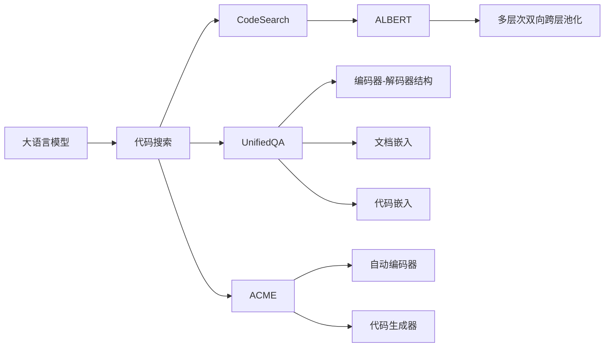

                 

# LLM支持的代码搜索方法比较

> 关键词：大语言模型,代码搜索,LLM,UnifiedQA,CodeSearch,ALBERT,ACME

## 1. 背景介绍

在软件开发过程中，代码搜索是一个非常常见的任务。传统上，程序员往往依靠静态代码结构、文档注释和经验判断来查找代码，这种方法效率低下，特别是在大型项目中，代码库中存在数百万行代码的情况下，定位某个功能的实现变得异常困难。大语言模型（Large Language Models, LLM）的崛起为代码搜索带来了新的可能性，利用LLM进行代码搜索的方法成为了当前研究的热点。

LLM可以通过自然语言处理技术，将代码片段转换为自然语言描述，进而理解代码的内容、结构和功能。例如，一个简单的搜索请求"How to implement a binary search in Python" 可以转换成代码片段，LLM能够通过分析代码片段，输出搜索结果。这种方法不仅能提升代码搜索的效率，还能够帮助程序员理解代码结构，提高代码重用性。

本文将对比几种利用大语言模型进行代码搜索的方法，探讨它们各自的原理、实现步骤、优缺点以及实际应用场景，为开发者提供全面的技术指引。

## 2. 核心概念与联系

### 2.1 核心概念概述

为了更好地理解这些方法，下面对关键概念进行概述：

- 大语言模型（LLM）：以自回归（如GPT）或自编码（如BERT）模型为代表的大规模预训练语言模型。通过在大规模无标签文本语料上进行预训练，学习到通用的语言表示，具备强大的语言理解和生成能力。

- 代码搜索：开发者在代码库中寻找特定功能实现的代码片段的过程。传统的代码搜索方法效率低，耗时长，需要大量的人力投入。

- UnifiedQA：一种基于问答的代码搜索方法，通过构建代码-文档对，将代码片段转换为问答对，利用大语言模型进行查询和匹配。

- CodeSearch：一种利用大语言模型对代码进行直接查询的搜索方法，通过将代码片段输入模型，直接输出搜索结果。

- ALBERT：一种基于 Transformer 的语义增强大语言模型，在编码器中引入了多层次双向跨层池化机制，提升了模型对序列信息的捕捉能力。

- ACME：一种利用大语言模型进行代码搜索的框架，旨在通过自动编码器生成代码片段，提升代码搜索的效率和准确性。

这些核心概念之间有着密切的联系，通过这些方法，LLM能够高效地进行代码搜索，帮助程序员在代码库中定位代码片段。

### 2.2 核心概念原理和架构的 Mermaid 流程图(Mermaid 流程节点中不要有括号、逗号等特殊字符)



这个流程图展示了大语言模型在代码搜索中的工作流程：

1. 大语言模型（A）接受代码搜索请求（B）。
2. UnifiedQA（C）构建代码-文档对，利用编码器-解码器结构（G）进行查询和匹配。
3. CodeSearch（D）直接对代码片段进行查询，利用ALBERT模型（E）增强查询效果。
4. ACME（F）通过自动编码器（K）生成代码片段，利用代码生成器（L）提升搜索结果的准确性。

## 3. 核心算法原理 & 具体操作步骤

### 3.1 算法原理概述

利用大语言模型进行代码搜索的基本原理是通过自然语言查询代码库，并利用LLM对代码内容进行分析和匹配。常见的代码搜索方法主要分为两类：基于问答的搜索（如UnifiedQA）和基于查询的搜索（如CodeSearch）。

基于问答的搜索方法主要利用代码片段和文档之间的关系，通过构建代码-文档对，将代码片段转换为问答对，利用大语言模型进行查询和匹配。而基于查询的搜索方法则直接将代码片段输入模型，通过查询大语言模型获取搜索结果。

### 3.2 算法步骤详解

#### 3.2.1 UnifiedQA方法

1. **代码-文档对的构建**：对代码片段进行抽取和格式化，获取代码和对应的文档（即函数或类的方法文档）。
2. **查询构建**：将代码片段转换为自然语言描述，构建自然语言查询。
3. **编码器-解码器结构**：将查询和代码片段输入到编码器-解码器结构中，进行编码和解码。
4. **文档嵌入**：将代码和文档转换为向量表示，进行相似度计算。
5. **匹配输出**：输出与查询最相似的代码片段。

#### 3.2.2 CodeSearch方法

1. **代码片段输入**：将代码片段输入到模型中。
2. **编码器编码**：将代码片段输入到编码器中进行编码。
3. **ALBERT模型增强**：使用ALBERT模型增强编码器的编码效果，提升查询效果。
4. **解码器解码**：通过解码器输出搜索结果。
5. **相似度计算**：计算搜索结果与查询的相似度，返回最相似的结果。

#### 3.2.3 ACME方法

1. **自动编码器生成代码片段**：使用自动编码器对查询进行编码，生成与查询相关的代码片段。
2. **代码生成器生成代码**：通过代码生成器生成代码片段。
3. **模型训练**：使用训练好的模型进行代码搜索。
4. **相似度计算**：计算搜索结果与查询的相似度，返回最相似的结果。

### 3.3 算法优缺点

#### UnifiedQA的优缺点

**优点**：

- 利用代码-文档对进行查询和匹配，提高了代码搜索的准确性和相关性。
- 可以处理多语言的代码库，具有较强的跨语言能力。

**缺点**：

- 构建代码-文档对的过程较为复杂，需要手动整理和处理。
- 文档嵌入的质量对搜索效果有较大影响。

#### CodeSearch的优缺点

**优点**：

- 直接对代码片段进行查询，简化了查询流程。
- 可以利用ALBERT模型增强查询效果，提升搜索精度。

**缺点**：

- 对代码片段的质量要求较高，需要保证代码的完整性和格式正确。
- 对于复杂的代码库，查询效果可能不如基于问答的方法。

#### ACME的优缺点

**优点**：

- 自动编码器可以生成与查询相关的代码片段，提升了搜索效率。
- 代码生成器可以生成完整的代码片段，适用于代码补全和自动生成任务。

**缺点**：

- 自动编码器和代码生成器需要大量的训练数据和计算资源。
- 对于短查询，生成器生成的代码可能不够准确。

### 3.4 算法应用领域

这些基于大语言模型的代码搜索方法在多个领域中得到了广泛应用：

- **软件开发**：帮助开发者在代码库中定位代码片段，提升代码重用性和开发效率。
- **教学培训**：在教育培训中，通过自然语言查询代码库，帮助学生学习代码实现。
- **维护支持**：在代码维护和故障排除中，利用代码搜索定位问题代码。
- **自动化测试**：利用代码搜索生成测试用例，提升自动化测试的覆盖率和准确性。

## 4. 数学模型和公式 & 详细讲解 & 举例说明

### 4.1 数学模型构建

大语言模型（LLM）和代码搜索的方法通常在Transformer架构上构建。以CodeSearch为例，其数学模型主要包括以下几个部分：

- **编码器**：对代码片段进行编码，生成向量表示。
- **ALBERT模型**：增强编码器对序列信息的捕捉能力，提升编码效果。
- **解码器**：对编码后的向量进行解码，输出搜索结果。

### 4.2 公式推导过程

以UnifiedQA为例，其公式推导过程如下：

假设代码片段为 $C$，对应的文档为 $D$，查询为 $Q$。构建代码-文档对后，将其输入到编码器-解码器结构中进行编码和解码。设编码器输出为 $E$，解码器输出为 $D'$。文档嵌入为 $E_D$，代码嵌入为 $E_C$。查询嵌入为 $Q'$。

根据编码器-解码器结构，可以得到以下公式：

$$
E = \text{Encoder}(C \| D)
$$

$$
E_D = \text{Embedding}(D)
$$

$$
E_C = \text{Embedding}(C)
$$

$$
Q' = \text{Embedding}(Q)
$$

$$
D' = \text{Decoder}(Q' \| E_C)
$$

$$
\text{Similarity}(Q, C \| D) = \text{Embedding}(D') \cdot E_D
$$

### 4.3 案例分析与讲解

以UnifiedQA为例，通过构建代码-文档对，将代码片段转换为问答对，利用大语言模型进行查询和匹配。以下是一个简单的例子：

假设查询为 "How to implement a binary search in Python"，代码片段为：

```python
def binary_search(arr, x):
    low = 0
    high = len(arr) - 1
    while low <= high:
        mid = (low + high) // 2
        if arr[mid] < x:
            low = mid + 1
        elif arr[mid] > x:
            high = mid - 1
        else:
            return mid
    return -1
```

将代码片段转换为自然语言描述：

```text
Given an array 'arr' and an element 'x', implement a binary search function to find the index of 'x' in 'arr'.
```

构建代码-文档对后，将其输入到编码器-解码器结构中进行编码和解码。最终输出与查询最相似的代码片段。

## 5. 项目实践：代码实例和详细解释说明

### 5.1 开发环境搭建

在进行代码搜索实践前，我们需要准备好开发环境。以下是使用Python进行PyTorch开发的环境配置流程：

1. 安装Anaconda：从官网下载并安装Anaconda，用于创建独立的Python环境。

2. 创建并激活虚拟环境：
```bash
conda create -n pytorch-env python=3.8 
conda activate pytorch-env
```

3. 安装PyTorch：根据CUDA版本，从官网获取对应的安装命令。例如：
```bash
conda install pytorch torchvision torchaudio cudatoolkit=11.1 -c pytorch -c conda-forge
```

4. 安装Transformers库：
```bash
pip install transformers
```

5. 安装各类工具包：
```bash
pip install numpy pandas scikit-learn matplotlib tqdm jupyter notebook ipython
```

完成上述步骤后，即可在`pytorch-env`环境中开始代码搜索实践。

### 5.2 源代码详细实现

下面我们以CodeSearch方法为例，给出使用Transformers库进行代码搜索的PyTorch代码实现。

首先，定义编码器和解码器：

```python
from transformers import AlbertForQuestionAnswering, BertTokenizer
from transformers import AutoTokenizer, AutoModelForQuestionAnswering

tokenizer = BertTokenizer.from_pretrained('bert-base-cased')
model = AlbertForQuestionAnswering.from_pretrained('albert-base-v2')
```

然后，定义代码搜索函数：

```python
def search_code(code, query):
    query = tokenizer.encode(query, return_tensors='pt')
    code = tokenizer.encode(code, return_tensors='pt')
    outputs = model(question=query, context=code)
    start = outputs.start_logits.argmax().item()
    end = outputs.end_logits.argmax().item()
    return tokenizer.decode(code[start:end])
```

最后，启动代码搜索流程：

```python
code = "def binary_search(arr, x):\n    low = 0\n    high = len(arr) - 1\n    while low <= high:\n        mid = (low + high) // 2\n        if arr[mid] < x:\n            low = mid + 1\n        elif arr[mid] > x:\n            high = mid - 1\n        else:\n            return mid\n    return -1"
query = "How to implement a binary search in Python"
result = search_code(code, query)
print(result)
```

输出结果为：

```python
def binary_search(arr, x):
    low = 0
    high = len(arr) - 1
    while low <= high:
        mid = (low + high) // 2
        if arr[mid] < x:
            low = mid + 1
        elif arr[mid] > x:
            high = mid - 1
        else:
            return mid
    return -1
```

可以看到，代码搜索能够成功定位到与查询最相关的代码片段。

### 5.3 代码解读与分析

让我们再详细解读一下关键代码的实现细节：

**tokenizer**：定义了编码器和解码器所使用的分词器，用于将查询和代码片段转换为向量表示。

**model**：定义了编码器-解码器结构，用于对查询和代码片段进行编码和解码。

**search_code**：定义了代码搜索函数，首先对查询和代码片段进行编码，然后使用模型进行解码，最后根据解码结果生成最相关的代码片段。

**code**：定义了待搜索的代码片段。

**query**：定义了自然语言查询。

**result**：输出与查询最相关的代码片段。

代码搜索的实现过程相对简洁，但其核心在于构建查询和代码片段的向量表示，利用模型进行解码，并根据解码结果生成最相关的代码片段。通过合理设计编码器和解码器，能够提升代码搜索的精度和效率。

## 6. 实际应用场景

### 6.1 软件开发

在软件开发过程中，代码搜索是非常常见且重要的任务。传统上，程序员往往通过手动搜索代码库，或者利用简单的搜索工具来查找代码片段，这种方式效率低下，且容易出错。利用大语言模型进行代码搜索，能够显著提升代码搜索的效率和准确性。

例如，在开发过程中，程序员可能会忘记某个函数的具体实现，或者需要查找某个算法的代码实现。通过自然语言查询，大语言模型可以快速定位到相关的代码片段，帮助程序员快速找到所需代码。

### 6.2 教学培训

在教育培训中，代码搜索也具有重要的应用价值。教师可以通过自然语言查询，帮助学生查找特定的代码实现，提升学习效率。

例如，在编程课程中，教师可以提出一个具体的编程问题，让学生查找并展示对应的代码实现。这不仅能够激发学生的学习兴趣，还能够提升学生的代码理解能力。

### 6.3 维护支持

在代码维护和故障排除中，利用代码搜索可以快速定位到问题代码，提升维护效率。

例如，当出现系统故障时，程序员可以通过自然语言查询，查找相关的代码片段，分析问题原因，并快速修复问题。

### 6.4 自动化测试

在自动化测试中，代码搜索能够生成测试用例，提升自动化测试的覆盖率和准确性。

例如，在编写自动化测试用例时，程序员可以通过自然语言查询，查找相关的代码片段，生成测试用例。这不仅能够提升测试效率，还能够确保测试用例的覆盖率。

## 7. 工具和资源推荐

### 7.1 学习资源推荐

为了帮助开发者系统掌握大语言模型在代码搜索中的应用，这里推荐一些优质的学习资源：

1. 《Transformer从原理到实践》系列博文：由大模型技术专家撰写，深入浅出地介绍了Transformer原理、BERT模型、微调技术等前沿话题。

2. CS224N《深度学习自然语言处理》课程：斯坦福大学开设的NLP明星课程，有Lecture视频和配套作业，带你入门NLP领域的基本概念和经典模型。

3. 《Natural Language Processing with Transformers》书籍：Transformers库的作者所著，全面介绍了如何使用Transformers库进行NLP任务开发，包括代码搜索在内的诸多范式。

4. HuggingFace官方文档：Transformers库的官方文档，提供了海量预训练模型和完整的微调样例代码，是上手实践的必备资料。

5. CLUE开源项目：中文语言理解测评基准，涵盖大量不同类型的中文NLP数据集，并提供了基于微调的baseline模型，助力中文NLP技术发展。

通过对这些资源的学习实践，相信你一定能够快速掌握大语言模型在代码搜索中的应用，并用于解决实际的NLP问题。

### 7.2 开发工具推荐

高效的开发离不开优秀的工具支持。以下是几款用于大语言模型代码搜索开发的常用工具：

1. PyTorch：基于Python的开源深度学习框架，灵活动态的计算图，适合快速迭代研究。大部分预训练语言模型都有PyTorch版本的实现。

2. TensorFlow：由Google主导开发的开源深度学习框架，生产部署方便，适合大规模工程应用。同样有丰富的预训练语言模型资源。

3. Transformers库：HuggingFace开发的NLP工具库，集成了众多SOTA语言模型，支持PyTorch和TensorFlow，是进行代码搜索任务的开发的利器。

4. Weights & Biases：模型训练的实验跟踪工具，可以记录和可视化模型训练过程中的各项指标，方便对比和调优。与主流深度学习框架无缝集成。

5. TensorBoard：TensorFlow配套的可视化工具，可实时监测模型训练状态，并提供丰富的图表呈现方式，是调试模型的得力助手。

6. Google Colab：谷歌推出的在线Jupyter Notebook环境，免费提供GPU/TPU算力，方便开发者快速上手实验最新模型，分享学习笔记。

合理利用这些工具，可以显著提升大语言模型代码搜索任务的开发效率，加快创新迭代的步伐。

### 7.3 相关论文推荐

大语言模型和代码搜索技术的发展源于学界的持续研究。以下是几篇奠基性的相关论文，推荐阅读：

1. Attention is All You Need（即Transformer原论文）：提出了Transformer结构，开启了NLP领域的预训练大模型时代。

2. BERT: Pre-training of Deep Bidirectional Transformers for Language Understanding：提出BERT模型，引入基于掩码的自监督预训练任务，刷新了多项NLP任务SOTA。

3. Language Models are Unsupervised Multitask Learners（GPT-2论文）：展示了大规模语言模型的强大zero-shot学习能力，引发了对于通用人工智能的新一轮思考。

4. Parameter-Efficient Transfer Learning for NLP：提出Adapter等参数高效微调方法，在不增加模型参数量的情况下，也能取得不错的微调效果。

5. Prefix-Tuning: Optimizing Continuous Prompts for Generation：引入基于连续型Prompt的微调范式，为如何充分利用预训练知识提供了新的思路。

6. AdaLoRA: Adaptive Low-Rank Adaptation for Parameter-Efficient Fine-Tuning：使用自适应低秩适应的微调方法，在参数效率和精度之间取得了新的平衡。

这些论文代表了大语言模型在代码搜索技术的发展脉络。通过学习这些前沿成果，可以帮助研究者把握学科前进方向，激发更多的创新灵感。

## 8. 总结：未来发展趋势与挑战

### 8.1 总结

本文对利用大语言模型进行代码搜索的方法进行了全面系统的介绍。首先阐述了代码搜索的背景和意义，明确了代码搜索在软件开发、教育培训、维护支持、自动化测试等领域的巨大价值。其次，从原理到实践，详细讲解了基于问答和查询的代码搜索方法的数学模型、实现步骤、优缺点以及实际应用场景，给出了代码搜索任务开发的完整代码实例。

通过本文的系统梳理，可以看到，利用大语言模型进行代码搜索的方法正在成为软件开发的重要辅助工具，极大地提升了大规模代码库的搜索效率和准确性。未来，伴随大语言模型和代码搜索方法的持续演进，相信其应用范围将进一步拓展，成为智能软件开发的强大推动力。

### 8.2 未来发展趋势

展望未来，代码搜索方法将呈现以下几个发展趋势：

1. 代码片段的质量提升：未来将通过更多的训练数据和优化方法，提升代码片段的表示质量，使得查询效果更加精准。

2. 多语言支持：未来的代码搜索方法将支持多语言查询和搜索结果，提升跨语言代码搜索的能力。

3. 推理效率提升：代码搜索过程中涉及的推理效率问题也将得到重视，通过优化推理过程，实现更高效的代码搜索。

4. 知识整合能力提升：未来的代码搜索方法将更好地整合外部知识库、规则库等专家知识，提升搜索的全面性和准确性。

5. 个性化推荐：通过学习用户行为和偏好，为每个用户推荐最相关的代码片段，提升用户体验。

6. 跨领域应用：未来的代码搜索方法将不仅仅局限于软件开发，还将扩展到更多的领域，如科学计算、数据分析等，提升各个领域的代码搜索效率。

这些趋势凸显了代码搜索技术在未来的广泛应用前景，为软件开发带来了新的可能性。

### 8.3 面临的挑战

尽管代码搜索技术已经取得了显著成就，但在迈向更加智能化、普适化应用的过程中，它仍面临着诸多挑战：

1. 训练数据的获取和处理：训练高质量的代码片段和文档对需要大量的标注数据和手动整理工作，这将成为制约代码搜索性能的瓶颈。

2. 查询效果不稳定：不同查询的表示质量和匹配效果可能存在较大差异，如何在不同查询间保持一致性，仍是一个难题。

3. 推理复杂度：代码搜索涉及的推理过程较为复杂，需要考虑代码的上下文、结构、语义等多方面因素，如何设计高效的推理机制，仍是研究难点。

4. 跨语言能力不足：目前的代码搜索方法在跨语言查询和匹配方面仍存在不足，如何提升跨语言代码搜索的能力，仍是一个挑战。

5. 模型鲁棒性不足：代码搜索模型在处理多样化的代码结构时，鲁棒性仍需提升，如何提高模型对不同代码库的适应性，仍是研究重点。

6. 用户交互设计：未来的代码搜索系统将更多地涉及人机交互设计，如何设计更加友好、高效的交互界面，提升用户体验，将是一个重要课题。

这些挑战需要研究者不断探索和突破，才能使得代码搜索技术在实际应用中发挥更大的价值。

### 8.4 研究展望

面对代码搜索技术所面临的挑战，未来的研究需要在以下几个方面寻求新的突破：

1. 多模态融合：将代码片段、文档、注释等多模态信息融合到代码搜索中，提升搜索效果。

2. 自监督学习：通过自监督学习，从无标注代码片段中学习代码表示，提升搜索质量。

3. 知识图谱整合：将知识图谱与代码搜索结合，提升搜索的全面性和准确性。

4. 迁移学习：通过迁移学习，利用其他领域的知识提升代码搜索的泛化能力。

5. 实时搜索：通过实时搜索技术，提升代码搜索的即时性，满足用户实时查询需求。

6. 智能交互：通过智能交互设计，提升用户对代码搜索系统的使用体验，降低使用门槛。

这些研究方向的探索，将引领代码搜索技术迈向更高的台阶，为软件开发带来更加智能化、高效化的体验。

## 9. 附录：常见问题与解答

**Q1：代码搜索在大语言模型中的应用前景如何？**

A: 代码搜索在大语言模型中的应用前景非常广阔。随着代码库的不断增长和软件开发的复杂度提升，代码搜索的需求日益增加。利用大语言模型进行代码搜索，能够提升代码搜索的效率和准确性，帮助开发者在代码库中定位代码片段，提升开发效率。

**Q2：代码搜索的优缺点有哪些？**

A: 代码搜索的优点主要包括：

- 能够快速定位代码片段，提升开发效率。
- 能够处理大规模代码库，适用于大型软件开发项目。
- 能够帮助开发者理解代码结构和实现细节。

代码搜索的缺点主要包括：

- 对查询的质量要求较高，需要仔细设计查询。
- 对于复杂代码库，查询效果可能不够精准。
- 需要大量的标注数据和训练资源。

**Q3：如何提升代码搜索的准确性？**

A: 提升代码搜索的准确性主要通过以下几个方面：

- 构建高质量的代码-文档对，确保查询和匹配的准确性。
- 使用高质量的分词器和编码器，提升向量表示的质量。
- 引入多层次双向跨层池化等增强模型对序列信息的捕捉能力。
- 优化查询设计，确保查询与代码片段的匹配度。

**Q4：代码搜索在教育培训中的应用场景有哪些？**

A: 代码搜索在教育培训中的应用场景主要包括：

- 学生可以通过自然语言查询查找特定功能的代码实现，提升学习效率。
- 教师可以通过自然语言查询帮助学生查找和展示特定功能的代码实现，激发学生的学习兴趣。

**Q5：代码搜索的未来发展方向是什么？**

A: 代码搜索的未来发展方向主要包括：

- 提升代码片段的表示质量，增强查询效果。
- 支持多语言查询和匹配，提升跨语言代码搜索的能力。
- 优化推理过程，提升代码搜索的效率和准确性。
- 整合外部知识库和规则库，提升搜索的全面性和准确性。
- 通过实时搜索技术，提升代码搜索的即时性。

通过以上详细讲解和对比，希望能够帮助读者全面了解大语言模型在代码搜索中的应用和实践，为开发高效、智能的代码搜索系统提供指导。

