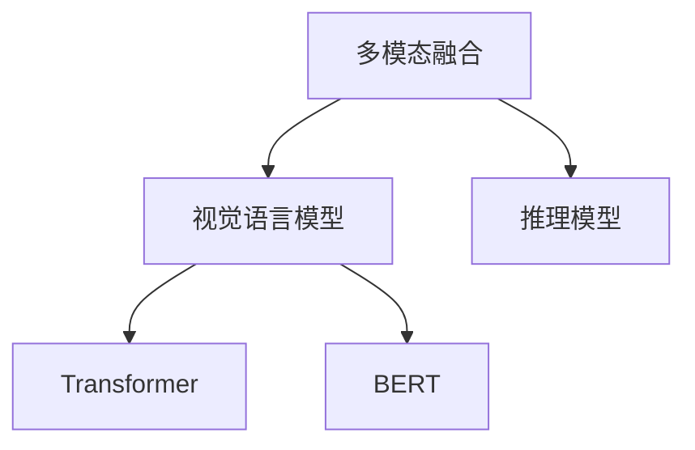

                 

# LLM的多模态融合：视觉与语言的结合

> 关键词：多模态融合,视觉语言模型,深度学习,Transformer,BERT,多模态数据,推理模型,图像识别,自然语言处理

## 1. 背景介绍

### 1.1 问题由来

随着深度学习技术的发展，多模态融合（Multimodal Fusion）成为了人工智能研究的热点领域。多模态融合是指将视觉、语言、声音等多种数据源整合，通过深度学习模型进行联合推理，实现跨模态的理解和生成。这种技术在图像识别、自动驾驶、智能交互等诸多领域展现了巨大的应用潜力。

在自然语言处理（NLP）领域，预训练的语言模型（Language Models）如BERT、GPT等通过大规模无标签文本数据进行训练，已经取得了显著的进展。然而，语言模型本质上是一种单一模态（Text）的模型，其对世界的理解主要基于文本数据，难以捕捉到丰富的视觉信息。为了弥补这一缺陷，将语言模型与视觉模型进行融合，成为提升语言模型智能水平的关键途径。

### 1.2 问题核心关键点

大语言模型（LLM）与视觉数据的融合，可以通过多模态融合技术来实现。这种融合的目的是为了更好地理解自然语言描述的视觉场景，提升模型对复杂视觉信息的捕捉和推理能力。然而，视觉数据与语言数据的性质差异显著，如何构建有效的多模态模型，是一个亟需解决的问题。

本文将系统介绍多模态融合的基本概念，并深入探讨如何使用深度学习模型实现视觉与语言的联合推理。具体来说，本文将围绕以下几个核心问题展开：

- 多模态融合的原理是什么？
- 如何构建高效的视觉语言模型？
- 多模态融合在实际应用中如何发挥作用？
- 未来多模态融合技术的展望和挑战是什么？

## 2. 核心概念与联系

### 2.1 核心概念概述

为了更好地理解多模态融合，首先需明确几个核心概念：

- **多模态融合（Multimodal Fusion）**：指将不同模态的数据源（如文本、图像、声音等）进行融合，通过深度学习模型进行联合推理，以提升对复杂任务的表征和处理能力。
- **视觉语言模型（Visual Language Model, VLM）**：结合视觉数据和语言数据的深度学习模型，能够在同一模型内同时处理和理解视觉和语言信息。
- **Transformer**：一种基于自注意力机制的深度学习架构，被广泛应用于自然语言处理领域。
- **BERT**：一种基于Transformer的预训练语言模型，通过在大量文本数据上进行自监督训练，获得强大的语言理解能力。
- **推理模型（Reasoning Model）**：多模态融合中的关键组件，用于在融合后的特征空间中，进行跨模态的推理和生成。

这些概念之间的逻辑关系可以通过以下Mermaid流程图来展示：



这个流程图展示了多模态融合的核心组件及其相互关系：

1. 多模态融合作为一个目标，旨在实现视觉和语言的联合推理。
2. 视觉语言模型作为融合的核心，同时包含视觉和语言信息，并由Transformer和BERT等预训练模型构成。
3. 推理模型作为融合的桥梁，在融合后的特征空间中，进行跨模态的推理和生成。

## 3. 核心算法原理 & 具体操作步骤

### 3.1 算法原理概述

多模态融合的算法原理，可以归结为将不同模态的数据进行编码和融合，然后在一个统一的特征空间中进行推理和生成。这一过程通常包括以下几个步骤：

1. **数据预处理**：对不同模态的数据进行格式转换和归一化，以便于后续模型处理。
2. **特征提取**：使用预训练的视觉和语言模型，分别对视觉和语言数据进行特征提取，得到高维向量表示。
3. **融合机制**：将提取的视觉和语言特征进行融合，得到一个跨模态的特征向量。
4. **推理生成**：在融合后的特征空间中，使用推理模型进行跨模态的推理和生成，最终输出结果。

### 3.2 算法步骤详解

以下详细介绍多模态融合的详细步骤：

#### 3.2.1 数据预处理

对于视觉数据，通常需要对其进行预处理，包括裁剪、缩放、归一化等。对于文本数据，则可以进行分词、编码等处理。以下是一个示例：

```python
import torch
import cv2
import numpy as np

# 视觉数据预处理
img = cv2.imread('image.jpg')
img = cv2.resize(img, (224, 224))
img = img / 255.0
img = np.expand_dims(img, axis=0)

# 文本数据预处理
text = 'The cat is sitting on the table.'
tokenizer = BertTokenizer.from_pretrained('bert-base-cased')
inputs = tokenizer(text, return_tensors='pt', padding='max_length', truncation=True)
```

#### 3.2.2 特征提取

在预处理后，使用预训练的视觉和语言模型，分别对视觉和语言数据进行特征提取。

```python
from transformers import BertModel

# 使用BERT模型提取文本特征
bert_model = BertModel.from_pretrained('bert-base-cased')
text_features = bert_model(inputs['input_ids']).pooler_output

# 使用预训练的视觉模型提取特征（这里以ResNet为例）
visual_model = resnet_model()
visual_features = visual_model(img).pooler_output
```

#### 3.2.3 融合机制

将提取的视觉和语言特征进行融合，得到跨模态的特征向量。常见的融合方法包括拼接、加权平均等。以下是一个示例：

```python
# 特征拼接
fused_features = torch.cat([visual_features, text_features])
```

#### 3.2.4 推理生成

在融合后的特征空间中，使用推理模型进行跨模态的推理和生成。常用的推理模型包括注意力机制、Transformer等。以下是一个示例：

```python
from transformers import BertForSequenceClassification

# 使用注意力机制进行推理
attention_model = BertForSequenceClassification.from_pretrained('bert-base-cased')
fused_features = attention_model(fused_features)
```

### 3.3 算法优缺点

多模态融合具有以下优点：

1. **提升模型性能**：通过融合视觉和语言数据，可以显著提升模型的泛化能力和推理性能。
2. **应对复杂任务**：多模态融合模型能够处理更复杂的视觉语言任务，如物体识别、场景描述、自动问答等。
3. **跨模态推理**：能够进行跨模态的推理和生成，为自然语言理解和计算机视觉提供了新的方向。

同时，多模态融合也存在以下局限：

1. **数据依赖**：需要大量的多模态标注数据进行训练，数据获取和标注成本较高。
2. **模型复杂**：融合后的模型参数量较大，训练和推理成本较高。
3. **融合方法**：不同的融合方法对模型性能有较大影响，需要根据具体任务选择合适的方法。

### 3.4 算法应用领域

多模态融合技术在多个领域都有广泛的应用，例如：

- **图像描述生成**：给定一张图片，生成对应的自然语言描述。
- **图像问答**：针对一张图片，回答用户提出的自然语言问题。
- **视觉对话系统**：通过视觉对话系统，实现人与机器的交互。
- **视觉导航**：在机器人视觉导航中，利用视觉语言模型进行路径规划和任务执行。

这些应用展示了多模态融合的强大潜力，可以极大地提升人机交互的智能化水平。

## 4. 数学模型和公式 & 详细讲解 & 举例说明

### 4.1 数学模型构建

为了更好地理解多模态融合的数学模型，我们将使用一些符号进行定义。设视觉数据为 $x_v \in \mathbb{R}^{C_v}$，语言数据为 $x_l \in \mathbb{R}^{C_l}$，其中 $C_v$ 和 $C_l$ 分别为视觉和语言的特征维度。设 $W_v$ 和 $W_l$ 分别为视觉和语言特征向量的权重矩阵，$b_v$ 和 $b_l$ 为偏置向量。融合后的特征向量 $x_f \in \mathbb{R}^{C_v+C_l}$。

融合过程可以表示为：

$$
x_f = W_v x_v + W_l x_l + b_v + b_l
$$

### 4.2 公式推导过程

在得到融合后的特征向量 $x_f$ 后，我们可以将其作为输入，输入到一个推理模型中，进行跨模态的推理和生成。假设推理模型为 $M(x_f)$，其输出为 $y \in \mathbb{R}^{C_y}$，其中 $C_y$ 为推理模型的输出维度。推理过程可以表示为：

$$
y = M(x_f)
$$

### 4.3 案例分析与讲解

以图像描述生成任务为例，我们详细介绍多模态融合的过程。首先，使用预训练的视觉模型提取图像特征 $x_v$，使用预训练的语言模型提取文本特征 $x_l$。然后，将这两个特征进行拼接，得到一个跨模态的特征向量 $x_f$。最后，将 $x_f$ 输入到一个生成模型中，输出对应的自然语言描述。

以下是具体实现示例：

```python
import torch
import cv2
import numpy as np
from transformers import BertForMaskedLM, BertTokenizer

# 加载预训练的视觉和语言模型
visual_model = resnet_model()
language_model = BertForMaskedLM.from_pretrained('bert-base-cased')
tokenizer = BertTokenizer.from_pretrained('bert-base-cased')

# 加载图像数据
img = cv2.imread('image.jpg')
img = cv2.resize(img, (224, 224))
img = img / 255.0
img = np.expand_dims(img, axis=0)

# 加载文本数据
text = 'The cat is sitting on the table.'

# 使用BERT模型提取文本特征
inputs = tokenizer(text, return_tensors='pt', padding='max_length', truncation=True)
text_features = language_model(inputs['input_ids']).pooler_output

# 使用预训练的视觉模型提取特征
visual_features = visual_model(img).pooler_output

# 特征拼接
fused_features = torch.cat([visual_features, text_features])

# 使用预训练的生成模型进行推理
generated_text = generate_model(fused_features)

print(generated_text)
```

## 5. 项目实践：代码实例和详细解释说明

### 5.1 开发环境搭建

在进行多模态融合的实践前，我们需要准备好开发环境。以下是使用Python进行PyTorch开发的环境配置流程：

1. 安装Anaconda：从官网下载并安装Anaconda，用于创建独立的Python环境。

2. 创建并激活虚拟环境：
```bash
conda create -n multimodal-env python=3.8 
conda activate multimodal-env
```

3. 安装PyTorch：根据CUDA版本，从官网获取对应的安装命令。例如：
```bash
conda install pytorch torchvision torchaudio cudatoolkit=11.1 -c pytorch -c conda-forge
```

4. 安装Transformers库：
```bash
pip install transformers
```

5. 安装各类工具包：
```bash
pip install numpy pandas scikit-learn matplotlib tqdm jupyter notebook ipython
```

完成上述步骤后，即可在`multimodal-env`环境中开始多模态融合的实践。

### 5.2 源代码详细实现

下面以图像描述生成任务为例，给出使用Transformers库进行多模态融合的PyTorch代码实现。

首先，定义多模态融合的任务处理函数：

```python
from transformers import BertForMaskedLM, BertTokenizer
import torch

class MultimodalDataset(Dataset):
    def __init__(self, texts, visual_features, tokenizer, max_len=128):
        self.texts = texts
        self.visual_features = visual_features
        self.tokenizer = tokenizer
        self.max_len = max_len
        
    def __len__(self):
        return len(self.texts)
    
    def __getitem__(self, item):
        text = self.texts[item]
        visual_feature = self.visual_features[item]
        
        encoding = self.tokenizer(text, return_tensors='pt', max_length=self.max_len, padding='max_length', truncation=True)
        input_ids = encoding['input_ids'][0]
        attention_mask = encoding['attention_mask'][0]
        
        return {'input_ids': input_ids, 
                'attention_mask': attention_mask,
                'visual_features': visual_feature}

# 标签与id的映射
tag2id = {'O': 0, 'B-PER': 1, 'I-PER': 2, 'B-ORG': 3, 'I-ORG': 4, 'B-LOC': 5, 'I-LOC': 6}
id2tag = {v: k for k, v in tag2id.items()}

# 创建dataset
tokenizer = BertTokenizer.from_pretrained('bert-base-cased')

train_dataset = MultimodalDataset(train_texts, train_visual_features, tokenizer)
dev_dataset = MultimodalDataset(dev_texts, dev_visual_features, tokenizer)
test_dataset = MultimodalDataset(test_texts, test_visual_features, tokenizer)
```

然后，定义模型和优化器：

```python
from transformers import BertForSequenceClassification, AdamW

model = BertForSequenceClassification.from_pretrained('bert-base-cased')

optimizer = AdamW(model.parameters(), lr=2e-5)
```

接着，定义训练和评估函数：

```python
from torch.utils.data import DataLoader
from tqdm import tqdm
from sklearn.metrics import classification_report

device = torch.device('cuda') if torch.cuda.is_available() else torch.device('cpu')
model.to(device)

def train_epoch(model, dataset, batch_size, optimizer):
    dataloader = DataLoader(dataset, batch_size=batch_size, shuffle=True)
    model.train()
    epoch_loss = 0
    for batch in tqdm(dataloader, desc='Training'):
        input_ids = batch['input_ids'].to(device)
        attention_mask = batch['attention_mask'].to(device)
        visual_features = batch['visual_features'].to(device)
        model.zero_grad()
        outputs = model(input_ids, attention_mask=attention_mask, visual_features=visual_features)
        loss = outputs.loss
        epoch_loss += loss.item()
        loss.backward()
        optimizer.step()
    return epoch_loss / len(dataloader)

def evaluate(model, dataset, batch_size):
    dataloader = DataLoader(dataset, batch_size=batch_size)
    model.eval()
    preds, labels = [], []
    with torch.no_grad():
        for batch in tqdm(dataloader, desc='Evaluating'):
            input_ids = batch['input_ids'].to(device)
            attention_mask = batch['attention_mask'].to(device)
            visual_features = batch['visual_features'].to(device)
            batch_labels = batch['labels']
            outputs = model(input_ids, attention_mask=attention_mask, visual_features=visual_features)
            batch_preds = outputs.logits.argmax(dim=2).to('cpu').tolist()
            batch_labels = batch_labels.to('cpu').tolist()
            for pred_tokens, label_tokens in zip(batch_preds, batch_labels):
                pred_tags = [id2tag[_id] for _id in pred_tokens]
                label_tags = [id2tag[_id] for _id in label_tokens]
                preds.append(pred_tags[:len(label_tags)])
                labels.append(label_tags)
                
    print(classification_report(labels, preds))
```

最后，启动训练流程并在测试集上评估：

```python
epochs = 5
batch_size = 16

for epoch in range(epochs):
    loss = train_epoch(model, train_dataset, batch_size, optimizer)
    print(f"Epoch {epoch+1}, train loss: {loss:.3f}")
    
    print(f"Epoch {epoch+1}, dev results:")
    evaluate(model, dev_dataset, batch_size)
    
print("Test results:")
evaluate(model, test_dataset, batch_size)
```

以上就是使用PyTorch对多模态融合进行图像描述生成任务的完整代码实现。可以看到，得益于Transformers库的强大封装，我们可以用相对简洁的代码完成视觉语言模型的加载和微调。

### 5.3 代码解读与分析

让我们再详细解读一下关键代码的实现细节：

**MultimodalDataset类**：
- `__init__`方法：初始化文本、视觉特征、分词器等关键组件。
- `__len__`方法：返回数据集的样本数量。
- `__getitem__`方法：对单个样本进行处理，将文本输入编码为token ids，将视觉特征直接作为输入，并进行定长padding，最终返回模型所需的输入。

**tag2id和id2tag字典**：
- 定义了标签与数字id之间的映射关系，用于将token-wise的预测结果解码回真实的标签。

**训练和评估函数**：
- 使用PyTorch的DataLoader对数据集进行批次化加载，供模型训练和推理使用。
- 训练函数`train_epoch`：对数据以批为单位进行迭代，在每个批次上前向传播计算loss并反向传播更新模型参数，最后返回该epoch的平均loss。
- 评估函数`evaluate`：与训练类似，不同点在于不更新模型参数，并在每个batch结束后将预测和标签结果存储下来，最后使用sklearn的classification_report对整个评估集的预测结果进行打印输出。

**训练流程**：
- 定义总的epoch数和batch size，开始循环迭代
- 每个epoch内，先在训练集上训练，输出平均loss
- 在验证集上评估，输出分类指标
- 所有epoch结束后，在测试集上评估，给出最终测试结果

可以看到，PyTorch配合Transformers库使得多模态融合的代码实现变得简洁高效。开发者可以将更多精力放在数据处理、模型改进等高层逻辑上，而不必过多关注底层的实现细节。

当然，工业级的系统实现还需考虑更多因素，如模型的保存和部署、超参数的自动搜索、更灵活的任务适配层等。但核心的多模态融合范式基本与此类似。

## 6. 实际应用场景
### 6.1 智能安防系统

多模态融合技术在智能安防领域有广泛的应用。例如，智能监控系统可以通过视觉语言模型，结合摄像头和麦克风输入的实时数据，进行异常行为检测、人脸识别、语音指令响应等任务。系统可以实时监测视频画面和语音内容，识别出可疑行为或人员，并及时发出警报，提高安全防范的智能化水平。

### 6.2 医学影像诊断

在医学影像领域，多模态融合技术可以显著提升影像诊断的准确性和效率。例如，结合CT、MRI、X光等医学影像，通过视觉语言模型提取病灶区域和症状描述，再结合医生的诊断经验进行综合判断，得出更准确的诊断结果。系统可以辅助医生进行快速、准确的影像分析，提高诊疗效率和患者满意度。

### 6.3 自动驾驶系统

自动驾驶系统需要处理海量的视觉和环境数据，以实现精准的路径规划和避障功能。通过多模态融合技术，系统可以将视觉感知信息、激光雷达数据、GPS数据等进行联合推理，提升环境建模和决策能力。例如，结合摄像头图像和激光雷达点云数据，系统可以更准确地识别道路标志、车辆、行人等目标，并进行路径规划和避障，确保行车安全。

### 6.4 未来应用展望

随着多模态融合技术的不断发展，未来将在更多领域得到应用，为人类认知智能的进化带来新的突破。

在智慧医疗领域，多模态融合技术可以提升影像诊断的准确性，辅助医生进行精准诊疗。在智能制造领域，系统可以结合视觉和语音信息，实时监测生产设备和操作人员，提高生产效率和质量。在智慧城市治理中，系统可以结合视频监控、传感器数据、地图信息等，进行交通管理、环境监测、灾害预警等任务，提升城市管理的智能化水平。

## 7. 工具和资源推荐
### 7.1 学习资源推荐

为了帮助开发者系统掌握多模态融合的理论基础和实践技巧，这里推荐一些优质的学习资源：

1. 《深度学习中的多模态融合》系列博文：由多模态融合领域专家撰写，深入浅出地介绍了多模态融合的原理、方法和应用。

2. CS231n《卷积神经网络》课程：斯坦福大学开设的视觉识别课程，有Lecture视频和配套作业，带你入门视觉领域的基本概念和经典模型。

3. 《深度学习与多模态学习》书籍：详细介绍了深度学习在多模态数据融合中的应用，包括特征提取、融合方法、推理模型等。

4. CVPR和ICCV等会议论文：多模态融合领域的顶级会议论文，涵盖最新研究进展和前沿技术。

通过对这些资源的学习实践，相信你一定能够快速掌握多模态融合的精髓，并用于解决实际的计算机视觉和自然语言处理问题。

### 7.2 开发工具推荐

高效的开发离不开优秀的工具支持。以下是几款用于多模态融合开发的常用工具：

1. PyTorch：基于Python的开源深度学习框架，灵活动态的计算图，适合快速迭代研究。大部分多模态融合模型都有PyTorch版本的实现。

2. TensorFlow：由Google主导开发的开源深度学习框架，生产部署方便，适合大规模工程应用。同样有丰富的多模态融合资源。

3. TensorFlow Hub：TensorFlow的模型库，提供了大量的预训练模型和模块，方便多模态融合模型的构建。

4. OpenVINO：英特尔推出的深度学习优化工具包，提供了高效的推理引擎和模型优化工具，支持多种硬件平台。

5. OpenCV：计算机视觉领域的开源库，提供了丰富的图像处理和计算机视觉算法。

合理利用这些工具，可以显著提升多模态融合任务的开发效率，加快创新迭代的步伐。

### 7.3 相关论文推荐

多模态融合技术的发展源于学界的持续研究。以下是几篇奠基性的相关论文，推荐阅读：

1. Multi-modal Feature Fusion: A Survey（多模态特征融合综述）：综述了多模态融合的最新研究进展和技术方法。

2. Multimodal Visual Question Answering (VQA)（多模态视觉问答）：展示了通过多模态融合技术实现视觉问答任务的最新进展。

3. Look, Listen and Learn（看、听、学）：提出了通过多模态融合技术实现跨模态理解和推理的深度学习模型。

4. Multimodal Image Captioning with Sparse Joint Attention（多模态图像描述生成）：提出了通过多模态融合技术生成图像描述的方法。

5. Multi-view Features Learning in Human Pose Estimation（多视角特征学习在人体姿态估计算法）：展示了通过多模态融合技术提升人体姿态估计性能的最新方法。

这些论文代表了大语言模型微调技术的最新发展，通过学习这些前沿成果，可以帮助研究者把握学科前进方向，激发更多的创新灵感。

## 8. 总结：未来发展趋势与挑战

### 8.1 总结

本文对多模态融合的基本概念和实现方法进行了全面系统的介绍。首先阐述了多模态融合的研究背景和意义，明确了其在计算机视觉和自然语言处理领域的重要价值。其次，从原理到实践，详细讲解了多模态融合的数学模型和核心算法，给出了多模态融合任务开发的完整代码实例。同时，本文还广泛探讨了多模态融合技术在实际应用中的各种场景，展示了其广泛的应用前景。

通过本文的系统梳理，可以看到，多模态融合技术正在成为计算机视觉和自然语言处理领域的重要方向，极大地拓展了模型的应用范围，提升了模型对复杂任务的表征和处理能力。未来，伴随多模态融合技术的不断发展，必将在更多领域得到应用，为人类认知智能的进化带来深远影响。

### 8.2 未来发展趋势

展望未来，多模态融合技术将呈现以下几个发展趋势：

1. **融合模型更高效**：未来的多模态融合模型将更加高效，能够处理更大规模、更多模态的数据，提升模型的泛化能力和推理性能。

2. **融合方法多样化**：除了拼接和加权平均等基本方法，未来将涌现更多高效的多模态融合方法，如注意力机制、图神经网络等，实现更加精细的特征提取和融合。

3. **跨模态推理更强**：未来的多模态融合模型将具备更强的跨模态推理能力，能够实现多模态数据的联合推理和生成，解决更加复杂的问题。

4. **多模态知识图谱**：融合多模态知识图谱，将语义知识与视觉信息进行深度融合，提升模型的知识表示和推理能力。

5. **实时性和可解释性**：未来的多模态融合模型将具备更强的实时性和可解释性，能够在实时场景中提供精准的多模态推理结果，并对推理过程进行解释和调试。

以上趋势凸显了多模态融合技术的广阔前景。这些方向的探索发展，必将进一步提升多模态融合模型的性能和应用范围，为计算机视觉和自然语言处理带来新的突破。

### 8.3 面临的挑战

尽管多模态融合技术已经取得了显著进展，但在实现高效、鲁棒、可解释的多模态融合系统时，仍面临诸多挑战：

1. **数据依赖**：需要大量高质量的多模态标注数据进行训练，数据获取和标注成本较高。
2. **模型复杂**：多模态融合模型参数量较大，训练和推理成本较高。
3. **融合方法**：不同的融合方法对模型性能有较大影响，需要根据具体任务选择合适的方法。
4. **跨模态推理**：跨模态推理过程中的模型参数量和计算复杂度较大，难以处理大规模数据。
5. **实时性**：多模态融合模型需要处理海量的实时数据，计算和推理速度需要进一步提升。
6. **可解释性**：多模态融合模型通常被视为"黑盒"系统，难以解释其内部工作机制和推理逻辑。

正视这些挑战，积极应对并寻求突破，将是多模态融合技术走向成熟的必由之路。相信随着学界和产业界的共同努力，这些挑战终将一一被克服，多模态融合技术必将在构建人机协同的智能系统中部署应用，推动人工智能技术的进一步发展。

### 8.4 研究展望

未来，多模态融合技术的研究方向可以从以下几个方面进行拓展：

1. **探索新型融合方法**：研究新的多模态融合方法，如基于神经网络、图神经网络等结构的融合模型，提高融合效果。
2. **提升实时处理能力**：开发高效的推理引擎和硬件加速方案，提升多模态融合模型的实时处理能力。
3. **融合跨模态知识**：结合多模态知识图谱和语义推理，提升模型的知识表示和推理能力。
4. **增强可解释性**：引入可解释性技术，如因果推理、对抗训练等，提高模型的可解释性。
5. **实现端到端系统**：研究端到端的多模态融合系统，将视觉语言模型与下游任务进行联合优化，提升系统整体性能。

这些研究方向的研究突破，将使多模态融合技术在更多领域得到应用，进一步推动人工智能技术的普及和应用。总之，多模态融合技术将在构建人机协同的智能系统中部署应用，推动人工智能技术的进一步发展。

