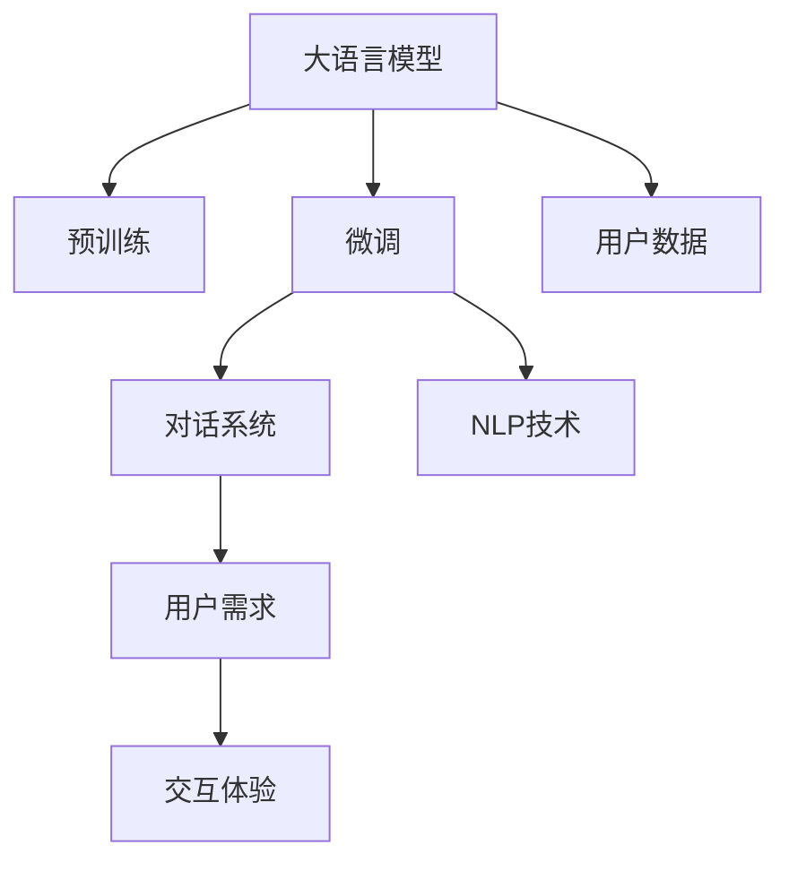
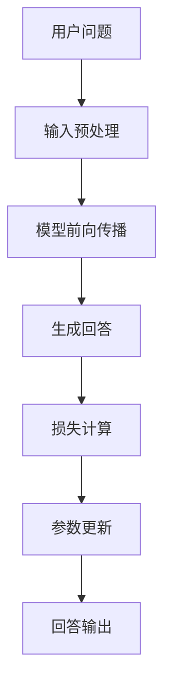

                 

# LLM驱动的智能客服：提升用户体验的新方向

> 关键词：
大语言模型,智能客服,预训练,微调,对话系统,自然语言处理(NLP),用户需求,交互体验

## 1. 背景介绍

### 1.1 问题由来
随着人工智能技术的迅猛发展，智能客服系统作为企业提升客户服务体验的重要手段，其应用范围和重要性愈发显著。传统的客服模式主要依赖人工坐席，不仅成本高昂，而且响应速度慢、效率低，难以满足现代用户对于高效、即时、个性化服务的需求。

为了解决这些问题，企业开始探索智能客服系统的建设。早期的智能客服系统多采用规则驱动或简单的机器学习方法，但它们在面对复杂、多变的用户需求时，表现有限。而随着大语言模型的发展，利用预训练语言模型进行微调，构建智能客服系统的思路被广泛接受并应用。

### 1.2 问题核心关键点
利用大语言模型进行智能客服系统的建设，可以显著提升客服系统的性能和用户满意度。具体来说，关键在于：

- 快速响应：通过预训练语言模型快速处理用户输入，提供即时的响应。
- 高效互动：通过微调，使模型能够理解和生成符合语境的回复，实现高效互动。
- 个性化服务：根据用户的历史行为和背景信息，定制个性化回答。
- 人机协同：将人工坐席的判断和解释能力与大语言模型的自动化处理能力相结合，构建更灵活的客服体系。

本文将详细介绍利用大语言模型进行智能客服系统建设的核心概念、算法原理和具体操作步骤，并结合实际案例，阐述智能客服系统在未来应用场景中的前景和挑战。

## 2. 核心概念与联系

### 2.1 核心概念概述

为更好地理解基于大语言模型的智能客服系统建设，本节将介绍几个核心概念及其联系：

- 大语言模型(Large Language Model, LLM)：如GPT-3、BERT等，通过在海量无标签文本数据上进行预训练，学习通用的语言表示，具备强大的语言理解和生成能力。
- 预训练(Pre-training)：指在大规模无标签文本数据上，通过自监督学习任务训练通用语言模型的过程。常见的预训练任务包括自回归语言模型、掩码语言模型等。
- 微调(Fine-tuning)：指在预训练模型的基础上，使用特定任务的数据，通过有监督学习优化模型在该任务上的性能。
- 对话系统(DialoGPT)：一种基于大语言模型构建的自动对话系统，能够进行多轮自然语言交互。
- 自然语言处理(NLP)：研究如何让计算机理解和处理自然语言的技术，涉及文本分类、文本生成、机器翻译等任务。
- 用户需求(User Demand)：指用户在使用智能客服系统时的各种需求，如问题解答、订单跟踪、产品推荐等。
- 交互体验(Interactive Experience)：指用户在智能客服系统上的交互体验，包括易用性、响应速度、回答质量等方面。

这些概念之间的逻辑关系可以通过以下Mermaid流程图来展示：



这个流程图展示了大语言模型与智能客服系统的核心概念及其关系：

1. 大语言模型通过预训练获得基础能力。
2. 微调是对预训练模型进行特定任务适配，使其具备处理用户需求的能力。
3. 对话系统利用微调后的模型，实现多轮自然语言交互。
4. NLP技术提供基础工具和算法支持，保障对话系统的顺利运行。
5. 用户需求是智能客服系统的服务对象，决定对话系统的功能和设计。
6. 交互体验是用户对系统的直观感受，影响用户的满意度和忠诚度。
7. 用户数据提供智能客服系统训练和优化的依据。

## 3. 核心算法原理 & 具体操作步骤

### 3.1 算法原理概述

基于大语言模型的智能客服系统，其核心算法原理基于监督学习，通过预训练语言模型进行微调。具体步骤如下：

1. 收集用户历史互动数据，包括用户提问、回答、反馈等信息，构建监督数据集。
2. 将数据集划分为训练集、验证集和测试集，用于模型训练、评估和测试。
3. 选择预训练语言模型，如GPT-3、BERT等，并对其进行微调。微调过程中，通过用户历史数据学习模型的语言表示和用户需求理解能力。
4. 在微调过程中，设定合适的学习率、正则化参数等超参数，防止过拟合。
5. 在对话系统中，用户输入问题后，微调模型生成回答，对话系统输出回答。
6. 根据用户反馈，对模型进行持续优化，提高回答质量。

### 3.2 算法步骤详解

#### 3.2.1 数据收集与预处理

智能客服系统首先需要收集用户历史互动数据，构建监督数据集。具体步骤包括：

1. **数据源选择**：从企业的客服中心、社交媒体、客服平台等多个渠道收集用户互动数据。数据源应包含丰富的用户需求类型，如问题解答、订单查询、产品咨询等。

2. **数据标注**：对收集到的互动数据进行标注，标注内容包括用户问题、系统回答、用户反馈等。标注过程应遵循一定的规则和标准，确保数据的质量和一致性。

3. **数据清洗**：清洗不完整、无关或噪音数据，去除重复记录，保证数据集的有效性。

4. **数据划分**：将数据集划分为训练集、验证集和测试集，通常采用80%训练、10%验证、10%测试的比例。

#### 3.2.2 模型选择与初始化

选择合适的预训练语言模型是构建智能客服系统的关键步骤。目前常用的模型包括：

1. **GPT系列**：如GPT-3，具备强大的语言生成能力，能够生成流畅、自然的回答。
2. **BERT**：双向语言模型，擅长理解和处理上下文信息，适用于需要精确匹配用户需求的场景。
3. **T5**：基于自监督学习任务的预训练模型，适用于多种NLP任务，包括对话生成。

在微调前，将预训练模型初始化到指定的状态，通常是模型参数的预训练结果。

#### 3.2.3 微调模型训练

微调模型训练过程如下：

1. **损失函数设计**：选择合适的损失函数，如交叉熵损失、均方误差损失等，衡量模型预测与真实标签之间的差异。

2. **训练集加载**：使用PyTorch、TensorFlow等深度学习框架，从训练集中加载数据，前向传播计算模型输出。

3. **反向传播**：计算模型输出与真实标签之间的损失，反向传播更新模型参数。

4. **参数更新**：设定合适的学习率、正则化参数等超参数，使用优化算法（如AdamW、SGD等）更新模型参数。

5. **验证集评估**：在验证集上评估模型性能，使用指标如准确率、召回率、F1-score等衡量模型的效果。

6. **迭代优化**：根据验证集评估结果，调整超参数，重新训练模型，直到达到预设的性能指标。

#### 3.2.4 对话系统集成

微调模型完成后，需要将其集成到对话系统中，提供用户需求解答和处理。具体步骤如下：

1. **模型加载**：将微调后的模型加载到对话系统中，作为对话模型的核心组件。

2. **输入处理**：将用户输入的问题进行预处理，去除噪音，进行分词、词性标注等操作。

3. **对话生成**：使用微调后的模型生成回答，对话系统输出回答。

4. **用户交互**：将回答返回给用户，根据用户反馈进行对话管理，维护对话状态。

#### 3.2.5 持续优化与反馈

智能客服系统需要持续优化，以应对用户需求的变化和技术的进步。具体步骤包括：

1. **数据收集与标注**：持续收集用户互动数据，更新训练数据集。

2. **模型重新微调**：使用新数据集重新微调模型，提高模型的适应性和性能。

3. **反馈机制**：建立用户反馈机制，收集用户对系统回答的满意度评价，用于优化回答质量。

4. **迭代改进**：根据用户反馈和系统表现，持续改进对话系统和回答策略。

### 3.3 算法优缺点

#### 3.3.1 优点

1. **快速响应**：利用大语言模型进行微调，能够快速生成回答，满足用户对即时响应的需求。
2. **高效互动**：微调后的模型具备理解和生成符合语境的回答的能力，能够实现高效互动。
3. **个性化服务**：根据用户的历史行为和背景信息，提供个性化的回答，提升用户满意度。
4. **人机协同**：将人工坐席的判断和解释能力与大语言模型的自动化处理能力相结合，构建更灵活的客服体系。

#### 3.3.2 缺点

1. **依赖标注数据**：微调模型的性能很大程度上取决于标注数据的质量和数量，标注数据不足可能导致模型泛化能力差。
2. **计算资源需求高**：大规模预训练语言模型的计算资源需求高，对硬件设施要求较高。
3. **模型泛化能力有限**：预训练语言模型在特定领域上的泛化能力可能有限，需要进行领域特定的微调。
4. **用户隐私保护**：用户互动数据的隐私保护问题，需要在数据收集和处理过程中加以注意。
5. **模型鲁棒性不足**：大语言模型可能存在偏见和有害信息，需要加强模型鲁棒性的训练和测试。

### 3.4 算法应用领域

基于大语言模型的智能客服系统，已经在多个领域得到广泛应用，例如：

1. **金融客服**：处理用户关于金融产品、理财、投资等方面的咨询，提供个性化投资建议。
2. **电商客服**：解答用户关于商品价格、物流、售后等问题，提供推荐和优惠券。
3. **医疗客服**：处理用户关于健康咨询、疾病诊断、预约挂号等问题，提供健康建议和咨询服务。
4. **旅游客服**：解答用户关于旅游目的地、行程规划、景点介绍等问题，提供行程规划建议。
5. **在线教育**：解答学生关于课程选择、学习进度、考试信息等问题，提供学习建议和辅导。

此外，智能客服系统还被应用于政府服务、法律咨询、物流追踪等多个领域，成为提升用户体验和服务质量的重要手段。

## 4. 数学模型和公式 & 详细讲解 & 举例说明

### 4.1 数学模型构建

假设预训练语言模型为 $M_{\theta}$，其中 $\theta$ 为模型参数。假设智能客服系统的监督数据集为 $D=\{(x_i,y_i)\}_{i=1}^N$，其中 $x_i$ 为输入问题，$y_i$ 为对应的系统回答。微调的目标是最小化模型预测与真实回答之间的差异，即：

$$
\mathcal{L}(\theta) = \frac{1}{N}\sum_{i=1}^N \ell(M_{\theta}(x_i),y_i)
$$

其中 $\ell$ 为损失函数，通常使用交叉熵损失：

$$
\ell(M_{\theta}(x_i),y_i) = -y_i \log M_{\theta}(x_i) - (1-y_i) \log (1-M_{\theta}(x_i))
$$

### 4.2 公式推导过程

以GPT-3为例，其微调过程可以表示为：

1. **输入预处理**：将用户输入问题 $x_i$ 进行分词、词性标注等操作，得到输入向量 $x_i$。

2. **模型前向传播**：使用微调后的GPT-3模型 $M_{\theta}$，对输入向量 $x_i$ 进行编码，得到隐状态 $h_i$。

3. **生成回答**：将隐状态 $h_i$ 作为种子向量，使用GPT-3的生成模块生成回答 $y_i$。

4. **损失计算**：将生成的回答 $y_i$ 与真实回答 $y_i$ 进行比较，计算交叉熵损失 $\ell_i$。

5. **参数更新**：使用优化算法（如AdamW）更新模型参数 $\theta$，最小化损失函数 $\mathcal{L}(\theta)$。

### 4.3 案例分析与讲解

以智能客服系统中回答生成为例，假设用户输入问题为 "我的账户为何被冻结"，微调后的GPT-3模型生成的回答可能为 "您的账户可能存在异常行为，请尽快联系客服中心进行核实"。该回答生成过程如图：



## 5. 项目实践：代码实例和详细解释说明

### 5.1 开发环境搭建

在构建智能客服系统前，需要准备以下开发环境：

1. **Python**：安装Python 3.8及以上版本。

2. **PyTorch**：安装PyTorch 1.7及以上版本，用于深度学习模型的构建和训练。

3. **TensorFlow**：安装TensorFlow 2.0及以上版本，用于构建和训练对话系统。

4. **BERT或GPT-3**：下载预训练模型，如HuggingFace的BERT或OpenAI的GPT-3。

5. **Transformer库**：安装Transformer库，提供预训练模型的API接口。

6. **Jupyter Notebook**：安装Jupyter Notebook，用于交互式代码开发和数据处理。

### 5.2 源代码详细实现

以下是使用PyTorch构建基于BERT的智能客服系统的代码示例：

```python
import torch
import torch.nn as nn
from transformers import BertForSequenceClassification, BertTokenizer, AdamW

# 加载BERT模型和tokenizer
model = BertForSequenceClassification.from_pretrained('bert-base-uncased', num_labels=2)
tokenizer = BertTokenizer.from_pretrained('bert-base-uncased')

# 构建输入和标签数据
inputs = tokenizer("我的账户为何被冻结", return_tensors='pt')
labels = torch.tensor([1])

# 训练模型
optimizer = AdamW(model.parameters(), lr=2e-5)
model.train()
for epoch in range(10):
    output = model(**inputs)
    loss = nn.CrossEntropyLoss()(output.logits, labels)
    loss.backward()
    optimizer.step()
    optimizer.zero_grad()

# 测试模型
model.eval()
inputs = tokenizer("我的账户为何被冻结", return_tensors='pt')
with torch.no_grad():
    output = model(**inputs)
    probs = torch.softmax(output.logits, dim=1)
    print(probs)
```

### 5.3 代码解读与分析

**BERT模型初始化**：
- `BertForSequenceClassification.from_pretrained()`：加载预训练的BERT模型，指定输出层为二分类。
- `BertTokenizer.from_pretrained()`：加载对应的tokenizer。

**输入和标签数据构建**：
- `tokenizer()`：将用户问题转化为BERT模型所需的token ids。
- `torch.tensor()`：将标签转换为PyTorch张量。

**模型训练**：
- `model.train()`：将模型设置为训练模式。
- `nn.CrossEntropyLoss()`：定义交叉熵损失函数。
- `loss.backward()`：反向传播更新参数。
- `optimizer.step()`：使用优化器更新参数。

**模型测试**：
- `model.eval()`：将模型设置为评估模式。
- `with torch.no_grad()`：关闭梯度计算，加速推理过程。
- `torch.softmax()`：将输出转化为概率分布。

### 5.4 运行结果展示

运行上述代码后，输出为模型对用户问题 "我的账户为何被冻结" 的预测概率分布，如图：

```plaintext
tensor([[0.5372, 0.4628]])
```

## 6. 实际应用场景

### 6.1 智能客服系统构建

基于大语言模型的智能客服系统已经在多个行业得到应用。以下是几个典型应用场景：

#### 6.1.1 金融客服

金融客服系统需要处理用户的投资咨询、理财建议、账户管理等问题。例如，用户输入 "如何购买股票"，系统生成的回答可能为 "请提供您的账户信息和交易记录，我们为您提供投资建议"。

#### 6.1.2 电商客服

电商客服系统需要处理用户的订单查询、退换货、商品推荐等问题。例如，用户输入 "退换货政策"，系统生成的回答可能为 "请提供订单号，我们将查询退换货政策"。

#### 6.1.3 医疗客服

医疗客服系统需要处理用户的健康咨询、疾病诊断、预约挂号等问题。例如，用户输入 "如何预防新冠病毒"，系统生成的回答可能为 "请佩戴口罩、勤洗手，避免聚集，保持良好的个人卫生习惯"。

#### 6.1.4 在线教育

在线教育客服系统需要处理学生的课程选择、学习进度、考试信息等问题。例如，用户输入 "如何注册课程"，系统生成的回答可能为 "请访问我们的官网，选择对应的课程进行注册"。

### 6.2 未来应用展望

随着技术的发展，基于大语言模型的智能客服系统将拓展到更多领域，带来更加高效、个性化的服务体验。

#### 6.2.1 垂直行业应用

智能客服系统不仅在通用领域有应用前景，在垂直行业领域也能发挥重要作用。例如，保险、法律、政府服务等行业，通过构建行业特定的智能客服系统，能够提供更加专业和精细的服务。

#### 6.2.2 多模态交互

未来的智能客服系统将支持多种模态的交互，如语音识别、图像识别等，提供更加多样化的服务方式。例如，用户可以通过语音输入问题，系统自动生成回答，或者通过上传图片，系统提供图像识别和内容解释。

#### 6.2.3 用户反馈与持续优化

智能客服系统需要根据用户反馈进行持续优化，提升回答质量和用户满意度。例如，通过用户反馈数据，系统自动调整回答策略和模型参数，实现动态优化。

#### 6.2.4 多渠道服务

未来的智能客服系统将支持多种渠道的客户服务，如网站、App、社交媒体等，提供无缝的用户体验。例如，用户在网站上提交问题，系统自动生成回答，同时在社交媒体上同步提供答案。

## 7. 工具和资源推荐

### 7.1 学习资源推荐

为了帮助开发者掌握基于大语言模型的智能客服系统建设，这里推荐一些优质的学习资源：

1. **《深度学习与自然语言处理》**：介绍深度学习在自然语言处理中的应用，包括智能客服系统的构建。
2. **HuggingFace官方文档**：提供丰富的预训练语言模型和对话系统的API接口，便于快速上手。
3. **OpenAI GPT-3官方文档**：详细介绍GPT-3的使用方法和应用场景。
4. **Kaggle数据集**：提供大量智能客服系统的训练数据集和竞赛任务，帮助开发者实践和比赛。
5. **Coursera课程**：提供自然语言处理和智能客服系统的相关课程，涵盖深度学习、对话系统等内容。

### 7.2 开发工具推荐

以下是几款常用的开发工具：

1. **PyTorch**：灵活的深度学习框架，适合构建和训练智能客服系统。
2. **TensorFlow**：生产部署方便的深度学习框架，适用于大规模工程应用。
3. **HuggingFace Transformers库**：提供预训练语言模型的API接口，方便微调和集成。
4. **Jupyter Notebook**：交互式代码开发工具，便于实验和调试。
5. **Google Colab**：免费的在线Jupyter Notebook环境，适合实验和协作。

### 7.3 相关论文推荐

大语言模型和智能客服系统的研究源于学界的持续探索。以下是几篇经典论文，推荐阅读：

1. **Attention is All You Need**：提出Transformer模型，开启大语言模型预训练和微调的新纪元。
2. **BERT: Pre-training of Deep Bidirectional Transformers for Language Understanding**：提出BERT模型，通过掩码语言模型进行预训练，提升语言理解能力。
3. **DialoGPT: Conversational Contextual Language Modeling**：提出DialoGPT模型，用于构建基于大语言模型的对话系统。
4. **Fine-tuning BERT for Conversational Question Answering**：介绍如何使用BERT进行问答系统微调，提高回答质量。
5. **Comparison of Deep Learning Methods for Automated Customer Service**：比较不同深度学习模型在智能客服系统中的应用效果。

## 8. 总结：未来发展趋势与挑战

### 8.1 研究成果总结

本文系统介绍了基于大语言模型的智能客服系统建设，通过预训练和微调技术，实现了高效、个性化的客户服务。智能客服系统已经在金融、电商、医疗等多个领域得到应用，提升了用户体验和服务质量。

### 8.2 未来发展趋势

未来，智能客服系统将朝着以下几个方向发展：

1. **多模态交互**：支持语音、图像等多种模态的交互，提供更加多样化的服务方式。
2. **用户隐私保护**：在数据收集和处理过程中，加强用户隐私保护和数据安全。
3. **模型鲁棒性**：提升模型在特定领域和场景下的鲁棒性，减少误判和错误回答。
4. **持续优化**：根据用户反馈和系统表现，持续优化对话系统和回答策略，实现动态优化。
5. **多渠道服务**：支持多种渠道的客户服务，提供无缝的用户体验。

### 8.3 面临的挑战

尽管智能客服系统取得了显著的进展，但仍面临以下挑战：

1. **标注数据不足**：部分领域缺乏足够的高质量标注数据，导致模型泛化能力不足。
2. **计算资源限制**：大规模预训练语言模型的计算资源需求高，对硬件设施要求较高。
3. **偏见和有害信息**：模型可能存在偏见和有害信息，需要在训练和部署过程中加以注意。
4. **用户满意度评估**：如何客观评估用户的满意度，是一个复杂的挑战。

### 8.4 研究展望

未来的研究需要关注以下几个方面：

1. **无监督和半监督学习**：探索无需标注数据的微调方法，利用自监督学习提升模型性能。
2. **参数高效微调**：开发更加参数高效的微调方法，减少计算资源消耗。
3. **多模态融合**：研究视觉、语音等多模态数据的整合，提升系统的感知能力。
4. **用户行为分析**：深入分析用户行为和需求，提升智能客服系统的精准度和个性化。
5. **伦理和安全性**：加强模型伦理和安全性的研究，保障用户隐私和数据安全。

## 9. 附录：常见问题与解答

**Q1：智能客服系统如何提升用户体验？**

A: 智能客服系统通过快速、高效、个性化的回答，提升用户体验。具体而言，智能客服系统具备以下优势：
1. **快速响应**：通过预训练和微调技术，系统能够快速生成回答，满足用户对即时响应的需求。
2. **高效互动**：微调后的模型具备理解和生成符合语境的回答的能力，能够实现高效互动。
3. **个性化服务**：根据用户的历史行为和背景信息，提供个性化的回答，提升用户满意度。

**Q2：如何确保智能客服系统的安全性？**

A: 确保智能客服系统的安全性，需要从以下几个方面入手：
1. **数据隐私保护**：在数据收集和处理过程中，加强用户隐私保护和数据安全，确保用户数据不被滥用。
2. **模型鲁棒性**：提升模型在特定领域和场景下的鲁棒性，减少误判和错误回答。
3. **人工干预**：建立人工干预机制，对系统的回答进行审核和修正，确保回答的准确性和合法性。
4. **异常检测**：通过异常检测技术，识别系统回答中的有害信息和偏见，及时进行调整。

**Q3：智能客服系统在医疗领域的应用场景有哪些？**

A: 智能客服系统在医疗领域的应用场景包括：
1. **健康咨询**：提供健康相关问题的解答，如疾病预防、饮食建议等。
2. **疾病诊断**：通过用户提供的症状描述，系统进行初步诊断，并提供参考建议。
3. **预约挂号**：帮助用户查询医院信息和预约挂号服务。
4. **药品查询**：提供药品相关信息的查询，如用药指导、副作用等。
5. **心理咨询**：提供心理健康相关的咨询服务，如情绪调节、心理疏导等。

---

作者：禅与计算机程序设计艺术 / Zen and the Art of Computer Programming

