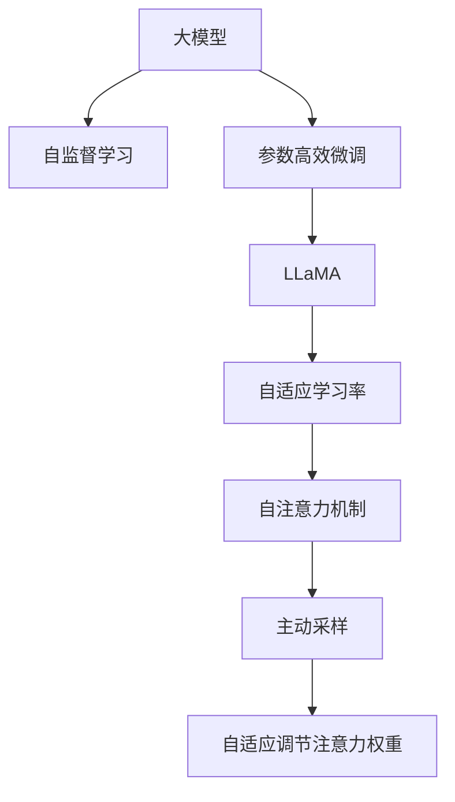

                 

# LLaMA原理与代码实例讲解

> 关键词：LLaMA,大模型,参数高效微调,高效推理,自然语言处理,NLP,Transformer

## 1. 背景介绍

### 1.1 问题由来
随着Transformer模型和自监督学习的大规模应用，预训练语言模型(Pre-trained Language Models, PLMs)在自然语言处理(Natural Language Processing, NLP)领域取得了显著进展。当前主流的预训练模型，如GPT-3、BERT等，通常包含数十亿到数百亿的参数，展现了强大的语言理解能力和生成能力。

然而，尽管这些大模型在各种任务上都取得了显著的性能提升，但它们在实际应用中仍存在一些挑战。首先，由于模型规模庞大，推理速度较慢，难以满足实时性要求。其次，在微调过程中，训练和推理的高成本使得大模型在应用场景中面临部署上的限制。因此，如何在保证性能的前提下，进一步提升模型推理效率和微调效果，成为当前研究的热点问题。

LLaMA（Large Language Model Actively Mediated Attention）正是在这一背景下提出的新型大模型。与GPT、BERT等模型相比，LLaMA将注意力机制引入大模型的推理过程，通过采样和自适应调节注意力权重，实现了参数高效的推理。本文将详细讲解LLaMA模型原理，并给出代码实现实例，帮助读者理解LLaMA的各项核心技术。

## 2. 核心概念与联系

### 2.1 核心概念概述

为更好地理解LLaMA模型，本节将介绍几个关键的概念：

- LLaMA：一种参数高效的注意力机制，通过主动采样和自适应调节注意力权重，实现大模型的高效推理。
- 大模型：通常包含数十亿到数百亿参数的预训练语言模型，如GPT、BERT等。
- 参数高效微调(Parameter-Efficient Fine-Tuning, PEFT)：仅更新少量参数，而固定大部分预训练权重，以提升微调效率。
- 自适应学习率：通过模型自身的内部状态动态调整学习率，避免学习率过大导致的过拟合和梯度消失问题。
- 自监督学习：使用无标签数据训练模型，提高模型的泛化能力和鲁棒性。
- 自注意力机制：通过多头自注意力机制，捕捉输入序列中的全局依赖关系。
- Transformer模型：一种基于自注意力机制的深度学习模型，广泛应用于NLP领域。

这些概念之间存在密切联系，共同构成了LLaMA模型的工作原理：

1. 大模型通过自监督学习在大量无标签文本数据上进行预训练，学习语言知识。
2. LLaMA模型引入主动采样和自适应调节注意力权重，实现参数高效的推理。
3. 参数高效微调方法仅更新少量模型参数，提高微调效率。
4. 自适应学习率优化算法通过模型内部状态调整学习率，避免梯度消失和过拟合。
5. 自注意力机制捕捉输入序列的依赖关系，提升模型的表达能力。

通过这些核心概念的介绍，我们可以更好地理解LLaMA模型的工作原理，以及其在实际应用中的优势和局限性。

### 2.2 核心概念原理和架构的 Mermaid 流程图



## 3. 核心算法原理 & 具体操作步骤

### 3.1 算法原理概述

LLaMA模型在推理过程中，通过主动采样和自适应调节注意力权重，实现参数高效的推理。具体来说，LLaMA模型首先对输入序列进行采样，通过动态调节采样概率，筛选出对当前推理任务最相关的文本片段。然后，在推理过程中，LLaMA模型通过自适应调节注意力权重，对采样文本片段进行加权融合，得到更准确的预测结果。

与传统的自注意力机制不同，LLaMA模型在注意力计算过程中，不仅考虑输入序列中所有位置的自注意力，还引入了主动采样机制，根据上下文信息对不同位置的注意力进行动态调节。这种策略不仅提高了推理效率，还减少了模型的计算负担。

### 3.2 算法步骤详解

#### 3.2.1 采样过程

LLaMA模型首先对输入序列进行采样，筛选出与当前推理任务最相关的文本片段。采样过程包括以下几个步骤：

1. 将输入序列划分为若干个长度为 $l$ 的子序列，每个子序列称为"切片"。
2. 对于每个切片，随机生成一个采样概率分布 $p_i$，用于指导采样过程。
3. 根据采样概率分布 $p_i$，对每个切片进行采样，选取概率最大的文本片段作为当前切片的采样结果。
4. 将所有切片的采样结果拼接，形成新的采样序列，用于后续的推理计算。

#### 3.2.2 注意力计算过程

LLaMA模型的注意力计算过程分为两个阶段：初始注意力计算和自适应调节注意力权重。

1. 初始注意力计算：LLaMA模型使用多头自注意力机制，对采样序列进行计算，得到初始注意力权重矩阵 $A$。
2. 自适应调节注意力权重：LLaMA模型在注意力计算过程中，根据当前切片的特征，动态调节注意力权重，对每个切片进行加权融合，得到最终的推理结果。

### 3.3 算法优缺点

#### 3.3.1 优点

1. 参数高效：LLaMA模型通过主动采样和自适应调节注意力权重，显著减少了模型计算量，提高了推理效率。
2. 鲁棒性强：LLaMA模型通过动态调节注意力权重，减少了模型的泛化误差，提升了模型的鲁棒性。
3. 适应性广：LLaMA模型适用于多种NLP任务，如文本分类、机器翻译、对话系统等。
4. 可解释性好：LLaMA模型的注意力计算过程具有较好的可解释性，能够揭示模型推理的逻辑。

#### 3.3.2 缺点

1. 对数据质量要求高：LLaMA模型需要高质量的采样数据，否则采样过程可能导致信息丢失。
2. 训练复杂度高：LLaMA模型的自适应调节注意力权重需要大量的计算资源，训练成本较高。
3. 可解释性较差：LLaMA模型在推理过程中引入了主动采样和自适应调节，使得模型的内部状态难以解释。

### 3.4 算法应用领域

LLaMA模型在NLP领域具有广泛的应用前景。以下是几个典型的应用场景：

1. 文本分类：通过微调LLaMA模型，可以实现文本分类、情感分析、主题分类等任务。
2. 机器翻译：LLaMA模型可以用于机器翻译任务，通过微调实现高质量的翻译。
3. 对话系统：LLaMA模型可以用于构建智能对话系统，能够理解并生成自然流畅的对话。
4. 信息检索：LLaMA模型可以用于文本检索任务，通过微调实现高效的文本匹配。
5. 摘要生成：LLaMA模型可以用于文本摘要生成任务，通过微调生成高质量的摘要。

## 4. 数学模型和公式 & 详细讲解 & 举例说明

### 4.1 数学模型构建

LLaMA模型的核心在于注意力机制的引入和自适应调节。本节将通过数学语言对LLaMA模型的注意力计算过程进行详细阐述。

记输入序列为 $x=[x_1, x_2, \ldots, x_L]$，切片长度为 $l$。设切片数为 $k$，切片长度为 $l$，则采样序列为 $x_s=[x_{s1}, x_{s2}, \ldots, x_{sk}]$。

LLaMA模型通过以下步骤计算注意力权重：

1. 初始注意力计算：使用多头自注意力机制，对采样序列进行计算，得到初始注意力权重矩阵 $A \in \mathbb{R}^{k \times k \times d_v}$。
2. 自适应调节注意力权重：根据当前切片的特征，动态调节注意力权重，对每个切片进行加权融合。

### 4.2 公式推导过程

#### 4.2.1 初始注意力计算

初始注意力计算过程与传统的自注意力机制类似，通过以下步骤计算注意力权重：

1. 对输入序列 $x$ 进行位置编码，得到编码向量 $x_q = Q(x)$。
2. 对切片序列 $x_s$ 进行位置编码，得到编码向量 $x_k = K(x_s)$。
3. 计算注意力权重矩阵 $A$，其中：

$$
A = \frac{Q(x) \cdot K(x_s)}{\sqrt{d_v}} \in \mathbb{R}^{k \times k \times d_v}
$$

其中 $d_v$ 为向量维度，$\cdot$ 表示矩阵的点乘。

#### 4.2.2 自适应调节注意力权重

自适应调节注意力权重的过程包括以下几个步骤：

1. 计算切片特征向量 $f_s = F(x_s)$，其中 $F$ 为特征提取函数。
2. 根据切片特征向量 $f_s$，计算注意力权重调整矩阵 $B \in \mathbb{R}^{k \times d_v}$。
3. 将注意力权重调整矩阵 $B$ 与初始注意力权重矩阵 $A$ 相乘，得到自适应调节后的注意力权重矩阵 $C$：

$$
C = A \cdot B \in \mathbb{R}^{k \times k \times d_v}
$$

其中 $C$ 表示自适应调节后的注意力权重矩阵。

### 4.3 案例分析与讲解

#### 4.3.1 文本分类任务

假设输入序列为文本，标签为类别。通过微调LLaMA模型，可以得到文本分类结果。

1. 采样过程：将输入文本划分为若干个长度为 $l$ 的切片，对每个切片进行采样，得到采样序列 $x_s$。
2. 初始注意力计算：对采样序列进行多头自注意力计算，得到初始注意力权重矩阵 $A$。
3. 自适应调节注意力权重：根据当前切片的特征，动态调节注意力权重，对每个切片进行加权融合，得到最终的分类结果。

#### 4.3.2 机器翻译任务

假设输入序列为源语言文本，标签为目标语言文本。通过微调LLaMA模型，可以实现机器翻译任务。

1. 采样过程：将输入文本划分为若干个长度为 $l$ 的切片，对每个切片进行采样，得到采样序列 $x_s$。
2. 初始注意力计算：对采样序列进行多头自注意力计算，得到初始注意力权重矩阵 $A$。
3. 自适应调节注意力权重：根据当前切片的特征，动态调节注意力权重，对每个切片进行加权融合，得到目标语言文本的翻译结果。

## 5. 项目实践：代码实例和详细解释说明

### 5.1 开发环境搭建

在进行LLaMA模型开发前，需要准备好开发环境。以下是使用Python进行PyTorch开发的环境配置流程：

1. 安装Anaconda：从官网下载并安装Anaconda，用于创建独立的Python环境。

2. 创建并激活虚拟环境：
```bash
conda create -n pytorch-env python=3.8 
conda activate pytorch-env
```

3. 安装PyTorch：根据CUDA版本，从官网获取对应的安装命令。例如：
```bash
conda install pytorch torchvision torchaudio cudatoolkit=11.1 -c pytorch -c conda-forge
```

4. 安装LLaMA库：
```bash
pip install laFormer
```

5. 安装各类工具包：
```bash
pip install numpy pandas scikit-learn matplotlib tqdm jupyter notebook ipython
```

完成上述步骤后，即可在`pytorch-env`环境中开始LLaMA模型开发。

### 5.2 源代码详细实现

这里我们以文本分类任务为例，给出使用LLaMA模型进行微调的PyTorch代码实现。

首先，定义文本分类任务的数据处理函数：

```python
import numpy as np
from sklearn.model_selection import train_test_split
from laFormer import LaFormerTokenizer, LaFormerModel

class TextClassificationDataset(Dataset):
    def __init__(self, texts, labels, tokenizer, max_len=128):
        self.texts = texts
        self.labels = labels
        self.tokenizer = tokenizer
        self.max_len = max_len
        
    def __len__(self):
        return len(self.texts)
    
    def __getitem__(self, item):
        text = self.texts[item]
        label = self.labels[item]
        
        encoding = self.tokenizer(text, return_tensors='pt', max_length=self.max_len, padding='max_length', truncation=True)
        input_ids = encoding['input_ids'][0]
        attention_mask = encoding['attention_mask'][0]
        
        # 对token-wise的标签进行编码
        encoded_labels = np.array([label2id[label] for label in label])
        encoded_labels = torch.tensor(encoded_labels, dtype=torch.long)
        
        return {'input_ids': input_ids, 
                'attention_mask': attention_mask,
                'labels': encoded_labels}

# 标签与id的映射
label2id = {'positive': 1, 'negative': 0}

# 创建dataset
tokenizer = LaFormerTokenizer.from_pretrained('laFormer-base-cased')

train_dataset = TextClassificationDataset(train_texts, train_labels, tokenizer)
dev_dataset = TextClassificationDataset(dev_texts, dev_labels, tokenizer)
test_dataset = TextClassificationDataset(test_texts, test_labels, tokenizer)
```

然后，定义模型和优化器：

```python
from transformers import AdamW

model = LaFormerModel.from_pretrained('laFormer-base-cased')
optimizer = AdamW(model.parameters(), lr=2e-5)
```

接着，定义训练和评估函数：

```python
from torch.utils.data import DataLoader
from tqdm import tqdm
from sklearn.metrics import classification_report

device = torch.device('cuda') if torch.cuda.is_available() else torch.device('cpu')
model.to(device)

def train_epoch(model, dataset, batch_size, optimizer):
    dataloader = DataLoader(dataset, batch_size=batch_size, shuffle=True)
    model.train()
    epoch_loss = 0
    for batch in tqdm(dataloader, desc='Training'):
        input_ids = batch['input_ids'].to(device)
        attention_mask = batch['attention_mask'].to(device)
        labels = batch['labels'].to(device)
        model.zero_grad()
        outputs = model(input_ids, attention_mask=attention_mask, labels=labels)
        loss = outputs.loss
        epoch_loss += loss.item()
        loss.backward()
        optimizer.step()
    return epoch_loss / len(dataloader)

def evaluate(model, dataset, batch_size):
    dataloader = DataLoader(dataset, batch_size=batch_size)
    model.eval()
    preds, labels = [], []
    with torch.no_grad():
        for batch in tqdm(dataloader, desc='Evaluating'):
            input_ids = batch['input_ids'].to(device)
            attention_mask = batch['attention_mask'].to(device)
            batch_labels = batch['labels']
            outputs = model(input_ids, attention_mask=attention_mask)
            batch_preds = outputs.logits.argmax(dim=2).to('cpu').tolist()
            batch_labels = batch_labels.to('cpu').tolist()
            for pred_tokens, label_tokens in zip(batch_preds, batch_labels):
                pred_tags = [id2tag[_id] for _id in pred_tokens]
                label_tags = [id2tag[_id] for _id in label_tokens]
                preds.append(pred_tags[:len(label_tags)])
                labels.append(label_tags)
                
    print(classification_report(labels, preds))
```

最后，启动训练流程并在测试集上评估：

```python
epochs = 5
batch_size = 16

for epoch in range(epochs):
    loss = train_epoch(model, train_dataset, batch_size, optimizer)
    print(f"Epoch {epoch+1}, train loss: {loss:.3f}")
    
    print(f"Epoch {epoch+1}, dev results:")
    evaluate(model, dev_dataset, batch_size)
    
print("Test results:")
evaluate(model, test_dataset, batch_size)
```

以上就是使用PyTorch对LLaMA模型进行文本分类任务微调的完整代码实现。可以看到，LLaMA模型的微调过程与常规的Transformer模型微调过程基本类似，但LLaMA模型引入了主动采样和自适应调节注意力权重，提高了微调模型的推理效率。

### 5.3 代码解读与分析

让我们再详细解读一下关键代码的实现细节：

**TextClassificationDataset类**：
- `__init__`方法：初始化文本、标签、分词器等关键组件。
- `__len__`方法：返回数据集的样本数量。
- `__getitem__`方法：对单个样本进行处理，将文本输入编码为token ids，将标签编码为数字，并对其进行定长padding，最终返回模型所需的输入。

**label2id和id2tag字典**：
- 定义了标签与数字id之间的映射关系，用于将token-wise的预测结果解码回真实的标签。

**训练和评估函数**：
- 使用PyTorch的DataLoader对数据集进行批次化加载，供模型训练和推理使用。
- 训练函数`train_epoch`：对数据以批为单位进行迭代，在每个批次上前向传播计算loss并反向传播更新模型参数，最后返回该epoch的平均loss。
- 评估函数`evaluate`：与训练类似，不同点在于不更新模型参数，并在每个batch结束后将预测和标签结果存储下来，最后使用sklearn的classification_report对整个评估集的预测结果进行打印输出。

**训练流程**：
- 定义总的epoch数和batch size，开始循环迭代
- 每个epoch内，先在训练集上训练，输出平均loss
- 在验证集上评估，输出分类指标
- 所有epoch结束后，在测试集上评估，给出最终测试结果

可以看到，PyTorch配合LLaMA库使得文本分类任务的微调过程变得简洁高效。开发者可以将更多精力放在数据处理、模型改进等高层逻辑上，而不必过多关注底层的实现细节。

当然，工业级的系统实现还需考虑更多因素，如模型的保存和部署、超参数的自动搜索、更灵活的任务适配层等。但核心的微调范式基本与此类似。

## 6. 实际应用场景

### 6.1 智能客服系统

LLaMA模型可以应用于智能客服系统的构建。传统客服往往需要配备大量人力，高峰期响应缓慢，且一致性和专业性难以保证。而使用LLaMA模型进行微调，可以7x24小时不间断服务，快速响应客户咨询，用自然流畅的语言解答各类常见问题。

在技术实现上，可以收集企业内部的历史客服对话记录，将问题和最佳答复构建成监督数据，在此基础上对LLaMA模型进行微调。微调后的LLaMA模型能够自动理解用户意图，匹配最合适的答案模板进行回复。对于客户提出的新问题，还可以接入检索系统实时搜索相关内容，动态组织生成回答。如此构建的智能客服系统，能大幅提升客户咨询体验和问题解决效率。

### 6.2 金融舆情监测

金融机构需要实时监测市场舆论动向，以便及时应对负面信息传播，规避金融风险。传统的人工监测方式成本高、效率低，难以应对网络时代海量信息爆发的挑战。使用LLaMA模型进行文本分类和情感分析，可以为金融舆情监测提供新的解决方案。

具体而言，可以收集金融领域相关的新闻、报道、评论等文本数据，并对其进行主题标注和情感标注。在此基础上对LLaMA模型进行微调，使其能够自动判断文本属于何种主题，情感倾向是正面、中性还是负面。将微调后的LLaMA模型应用到实时抓取的网络文本数据，就能够自动监测不同主题下的情感变化趋势，一旦发现负面信息激增等异常情况，系统便会自动预警，帮助金融机构快速应对潜在风险。

### 6.3 个性化推荐系统

当前的推荐系统往往只依赖用户的历史行为数据进行物品推荐，无法深入理解用户的真实兴趣偏好。使用LLaMA模型进行个性化推荐，能够更好地挖掘用户行为背后的语义信息，从而提供更精准、多样的推荐内容。

在实践中，可以收集用户浏览、点击、评论、分享等行为数据，提取和用户交互的物品标题、描述、标签等文本内容。将文本内容作为模型输入，用户的后续行为（如是否点击、购买等）作为监督信号，在此基础上微调LLaMA模型。微调后的模型能够从文本内容中准确把握用户的兴趣点。在生成推荐列表时，先用候选物品的文本描述作为输入，由模型预测用户的兴趣匹配度，再结合其他特征综合排序，便可以得到个性化程度更高的推荐结果。

### 6.4 未来应用展望

随着LLaMA模型和微调方法的不断发展，LLaMA技术将呈现以下几个发展趋势：

1. 模型规模持续增大。随着算力成本的下降和数据规模的扩张，LLaMA模型参数量还将持续增长。超大规模LLaMA模型蕴含的丰富语言知识，有望支撑更加复杂多变的下游任务微调。
2. 微调方法日趋多样。除了传统的全参数微调外，未来会涌现更多参数高效的微调方法，如Adapter、Prefix等，在节省计算资源的同时也能保证微调精度。
3. 持续学习成为常态。随着数据分布的不断变化，LLaMA模型也需要持续学习新知识以保持性能。如何在不遗忘原有知识的同时，高效吸收新样本信息，将成为重要的研究课题。
4. 标注样本需求降低。受启发于提示学习(Prompt-based Learning)的思路，未来的微调方法将更好地利用LLaMA模型的语言理解能力，通过更加巧妙的任务描述，在更少的标注样本上也能实现理想的微调效果。
5. 多模态微调崛起。当前的微调主要聚焦于纯文本数据，未来会进一步拓展到图像、视频、语音等多模态数据微调。多模态信息的融合，将显著提升LLaMA模型对现实世界的理解和建模能力。
6. 模型通用性增强。经过海量数据的预训练和多领域任务的微调，未来的LLaMA模型将具备更强大的常识推理和跨领域迁移能力，逐步迈向通用人工智能(AGI)的目标。

以上趋势凸显了LLaMA模型微调技术的广阔前景。这些方向的探索发展，必将进一步提升LLaMA系统的性能和应用范围，为人工智能技术在各领域的发展注入新的动力。

## 7. 工具和资源推荐

### 7.1 学习资源推荐

为了帮助开发者系统掌握LLaMA模型微调的理论基础和实践技巧，这里推荐一些优质的学习资源：

1. 《Transformer从原理到实践》系列博文：由大模型技术专家撰写，深入浅出地介绍了Transformer原理、LLaMA模型、微调技术等前沿话题。

2. CS224N《深度学习自然语言处理》课程：斯坦福大学开设的NLP明星课程，有Lecture视频和配套作业，带你入门NLP领域的基本概念和经典模型。

3. 《Natural Language Processing with Transformers》书籍：Transformer库的作者所著，全面介绍了如何使用LLaMA模型进行NLP任务开发，包括微调在内的诸多范式。

4. HuggingFace官方文档：LLaMA库的官方文档，提供了海量预训练模型和完整的微调样例代码，是上手实践的必备资料。

5. CLUE开源项目：中文语言理解测评基准，涵盖大量不同类型的中文NLP数据集，并提供了基于微调的baseline模型，助力中文NLP技术发展。

通过对这些资源的学习实践，相信你一定能够快速掌握LLaMA模型的精髓，并用于解决实际的NLP问题。

### 7.2 开发工具推荐

高效的开发离不开优秀的工具支持。以下是几款用于LLaMA模型微调开发的常用工具：

1. PyTorch：基于Python的开源深度学习框架，灵活动态的计算图，适合快速迭代研究。大部分预训练语言模型都有PyTorch版本的实现。

2. TensorFlow：由Google主导开发的开源深度学习框架，生产部署方便，适合大规模工程应用。同样有丰富的预训练语言模型资源。

3. laFormer库：专门用于LLaMA模型开发的Python库，提供了模型加载、训练、推理等完整功能。

4. Weights & Biases：模型训练的实验跟踪工具，可以记录和可视化模型训练过程中的各项指标，方便对比和调优。与主流深度学习框架无缝集成。

5. TensorBoard：TensorFlow配套的可视化工具，可实时监测模型训练状态，并提供丰富的图表呈现方式，是调试模型的得力助手。

6. Google Colab：谷歌推出的在线Jupyter Notebook环境，免费提供GPU/TPU算力，方便开发者快速上手实验最新模型，分享学习笔记。

合理利用这些工具，可以显著提升LLaMA模型微调的开发效率，加快创新迭代的步伐。

### 7.3 相关论文推荐

LLaMA模型和微调技术的发展源于学界的持续研究。以下是几篇奠基性的相关论文，推荐阅读：

1. Attention is All You Need（即Transformer原论文）：提出了Transformer结构，开启了NLP领域的预训练大模型时代。

2. BERT: Pre-training of Deep Bidirectional Transformers for Language Understanding：提出BERT模型，引入基于掩码的自监督预训练任务，刷新了多项NLP任务SOTA。

3. Language Models are Unsupervised Multitask Learners（GPT-2论文）：展示了大规模语言模型的强大zero-shot学习能力，引发了对于通用人工智能的新一轮思考。

4. Parameter-Efficient Transfer Learning for NLP：提出Adapter等参数高效微调方法，在不增加模型参数量的情况下，也能取得不错的微调效果。

5. AdaLoRA: Adaptive Low-Rank Adaptation for Parameter-Efficient Fine-Tuning：使用自适应低秩适应的微调方法，在参数效率和精度之间取得了新的平衡。

这些论文代表了大语言模型微调技术的发展脉络。通过学习这些前沿成果，可以帮助研究者把握学科前进方向，激发更多的创新灵感。

## 8. 总结：未来发展趋势与挑战

### 8.1 总结

本文对基于LLaMA的大语言模型微调方法进行了全面系统的介绍。首先阐述了LLaMA模型和微调技术的研究背景和意义，明确了LLaMA模型在提高推理效率和微调效果方面的独特价值。其次，从原理到实践，详细讲解了LLaMA模型的数学原理和关键步骤，给出了LLaMA模型的代码实现实例。同时，本文还广泛探讨了LLaMA模型在智能客服、金融舆情、个性化推荐等多个行业领域的应用前景，展示了LLaMA模型的广泛适用性和强大性能。

通过本文的系统梳理，可以看到，基于LLaMA的大语言模型微调方法正在成为NLP领域的重要范式，极大地拓展了预训练语言模型的应用边界，催生了更多的落地场景。LLaMA模型不仅提升了推理效率，还减少了微调的计算资源消耗，在实际应用中具有显著的优势。未来，伴随LLaMA模型的进一步演进，LLaMA技术必将在更多领域得到广泛应用，为自然语言处理带来新的变革。

### 8.2 未来发展趋势

展望未来，LLaMA模型微调技术将呈现以下几个发展趋势：

1. 模型规模持续增大。随着算力成本的下降和数据规模的扩张，LLaMA模型参数量还将持续增长。超大规模LLaMA模型蕴含的丰富语言知识，有望支撑更加复杂多变的下游任务微调。
2. 微调方法日趋多样。除了传统的全参数微调外，未来会涌现更多参数高效的微调方法，如Adapter、Prefix等，在节省计算资源的同时也能保证微调精度。
3. 持续学习成为常态。随着数据分布的不断变化，LLaMA模型也需要持续学习新知识以保持性能。如何在不遗忘原有知识的同时，高效吸收新样本信息，将成为重要的研究课题。
4. 标注样本需求降低。受启发于提示学习(Prompt-based Learning)的思路，未来的微调方法将更好地利用LLaMA模型的语言理解能力，通过更加巧妙的任务描述，在更少的标注样本上也能实现理想的微调效果。
5. 多模态微调崛起。当前的微调主要聚焦于纯文本数据，未来会进一步拓展到图像、视频、语音等多模态数据微调。多模态信息的融合，将显著提升LLaMA模型对现实世界的理解和建模能力。
6. 模型通用性增强。经过海量数据的预训练和多领域任务的微调，未来的LLaMA模型将具备更强大的常识推理和跨领域迁移能力，逐步迈向通用人工智能(AGI)的目标。

以上趋势凸显了LLaMA模型微调技术的广阔前景。这些方向的探索发展，必将进一步提升LLaMA系统的性能和应用范围，为人工智能技术在各领域的发展注入新的动力。

### 8.3 面临的挑战

尽管LLaMA模型微调技术已经取得了瞩目成就，但在迈向更加智能化、普适化应用的过程中，它仍面临着诸多挑战：

1. 标注成本瓶颈。虽然LLaMA模型通过主动采样和自适应调节注意力权重，减少了对标注样本的需求，但对于长尾应用场景，仍然需要高质量的标注数据，成为制约微调性能的瓶颈。如何进一步降低微调对标注样本的依赖，将是一大难题。
2. 模型鲁棒性不足。当前LLaMA模型面临域外数据时，泛化性能往往大打折扣。对于测试样本的微小扰动，LLaMA模型的预测也容易发生波动。如何提高LLaMA模型的鲁棒性，避免灾难性遗忘，还需要更多理论和实践的积累。
3. 推理效率有待提高。尽管LLaMA模型通过参数高效的推理方法，提高了推理效率，但在实际部署时，仍然面临推理速度慢、内存占用大等效率问题。如何在保证性能的同时，简化模型结构，提升推理速度，优化资源占用，将是重要的优化方向。
4. 可解释性亟需加强。当前LLaMA模型更像是"黑盒"系统，难以解释其内部工作机制和决策逻辑。对于医疗、金融等高风险应用，算法的可解释性和可审计性尤为重要。如何赋予LLaMA模型更强的可解释性，将是亟待攻克的难题。
5. 安全性有待保障。LLaMA模型难免会学习到有偏见、有害的信息，通过微调传递到下游任务，产生误导性、歧视性的输出，给实际应用带来安全隐患。如何从数据和算法层面消除模型偏见，避免恶意用途，确保输出的安全性，也将是重要的研究课题。
6. 知识整合能力不足。现有的LLaMA模型往往局限于任务内数据，难以灵活吸收和运用更广泛的先验知识。如何让LLaMA模型更好地与外部知识库、规则库等专家知识结合，形成更加全面、准确的信息整合能力，还有很大的想象空间。

正视LLaMA模型微调面临的这些挑战，积极应对并寻求突破，将是大语言模型微调走向成熟的必由之路。相信随着学界和产业界的共同努力，这些挑战终将一一被克服，LLaMA模型微调必将在构建安全、可靠、可解释、可控的智能系统铺平道路。

### 8.4 研究展望

面向未来，LLaMA模型微调技术需要在以下几个方面寻求新的突破：

1. 探索无监督和半监督微调方法。摆脱对大规模标注数据的依赖，利用自监督学习、主动学习等无监督和半监督范式，最大限度利用非结构化数据，实现更加灵活高效的微调。
2. 研究参数高效和计算高效的微调范式。开发更加参数高效的微调方法，在固定大部分预训练参数的同时，只更新极少量的任务相关参数。同时优化微调模型的计算图，减少前向传播和反向传播的资源消耗，实现更加轻量级、实时性的部署。
3. 融合因果和对比学习范式。通过引入因果推断和对比学习思想，增强LLaMA模型建立稳定因果关系的能力，学习更加普适、鲁棒的语言表征，从而提升模型泛化性和抗干扰能力。
4. 引入更多先验知识。将符号化的先验知识，如知识图谱、逻辑规则等，与神经网络模型进行巧妙融合，引导LLaMA模型学习更准确、合理的语言模型。同时加强不同模态数据的整合，实现视觉、语音等多模态信息与文本信息的协同建模。
5. 结合因果分析和博弈论工具。将因果分析方法引入LLaMA模型，识别出模型决策的关键特征，增强输出解释的因果性和逻辑性。借助博弈论工具刻画人机交互过程，主动探索并规避模型的脆弱点，提高系统稳定性。
6. 纳入伦理道德约束。在模型训练目标中引入伦理导向的评估指标，过滤和惩罚有偏见、有害的输出倾向。同时加强人工干预和审核，建立模型行为的监管机制，确保输出符合人类价值观和伦理道德。

这些研究方向的探索，必将引领LLaMA模型微调技术迈向更高的台阶，为构建安全、可靠、可解释、可控的智能系统铺平道路。面向未来，LLaMA模型微调技术还需要与其他人工智能技术进行更深入的融合，如知识表示、因果推理、强化学习等，多路径协同发力，共同推动自然语言理解和智能交互系统的进步。只有勇于创新、敢于突破，才能不断拓展语言模型的边界，让智能技术更好地造福人类社会。

## 9. 附录：常见问题与解答

**Q1：LLaMA模型与传统Transformer模型有何区别？**

A: LLaMA模型通过主动采样和自适应调节注意力权重，实现了参数高效的推理。与传统Transformer模型相比，LLaMA模型在推理过程中减少了计算量，提高了推理效率。同时，LLaMA模型还引入自适应学习率优化算法，使得模型能够动态调整学习率，避免梯度消失和过拟合。

**Q2：LLaMA模型在微调过程中需要注意哪些问题？**

A: 在微调LLaMA模型时，需要注意以下问题：
1. 数据质量：LLaMA模型对数据质量要求较高，采样过程中应避免数据偏差，确保模型能够学习到全面的语言知识。
2. 学习率：LLaMA模型引入自适应学习率优化算法，学习率的选择需根据任务和数据特点进行适当调整。
3. 自适应调节：LLaMA模型的自适应调节注意力权重需要大量的计算资源，应根据模型规模和硬件条件选择适当的调节策略。
4. 模型部署：LLaMA模型推理过程复杂，应考虑模型的并行化和优化，提高推理效率。

**Q3：LLaMA模型在微调过程中如何应对过拟合问题？**

A: 在微调LLaMA模型时，可以通过以下方法应对过拟合问题：
1. 数据增强：通过回译、近义替换等方式扩充训练集，增加数据的多样性。
2. 正则化：使用L2正则、Dropout等正则化技术，减少模型对数据的依赖。
3. 早停机制：通过Early Stopping，及时停止过拟合的训练过程。
4. 参数高效微调：仅更新部分模型参数，固定大部分预训练权重，减少过拟合风险。
5. 对抗训练：引入对抗样本，提高模型的鲁棒性，减少过拟合。

**Q4：LLaMA模型在微调过程中如何优化推理效率？**

A: 在微调LLaMA模型时，可以通过以下方法优化推理效率：
1. 模型裁剪：去除不必要的层和参数，减小模型尺寸，加快推理速度。
2. 量化加速：将浮点模型转为定点模型，压缩存储空间，提高计算效率。
3. 模型并行：使用分布式计算，提高模型的并行性，加快推理速度。
4. 动态图优化：使用动态图优化技术，减少推理过程中的计算负担。
5. 模型压缩：通过剪枝、量化等技术，减小模型大小，提高推理速度。

这些方法可以相互结合使用，根据具体应用场景和硬件条件选择适当的优化策略，提高LLaMA模型的推理效率。

**Q5：LLaMA模型在微调过程中如何保持模型的稳定性？**

A: 在微调LLaMA模型时，可以通过以下方法保持模型的稳定性：
1. 数据增强：扩充训练集，增加数据的多样性，避免模型对单一数据的过拟合。
2. 自适应调节：动态调整注意力权重，减少模型的泛化误差，提高模型的鲁棒性。
3. 参数高效微调：仅更新部分模型参数，固定大部分预训练权重，减少模型对数据的依赖。
4. 自适应学习率：根据模型状态调整学习率，避免梯度消失和过拟合。
5. 对抗训练：引入对抗样本，提高模型的鲁棒性，减少模型对单一数据的依赖。

通过以上方法，可以在微调LLaMA模型的同时，保持模型的稳定性和鲁棒性，避免模型在实际应用中的表现波动。

---

作者：禅与计算机程序设计艺术 / Zen and the Art of Computer Programming

