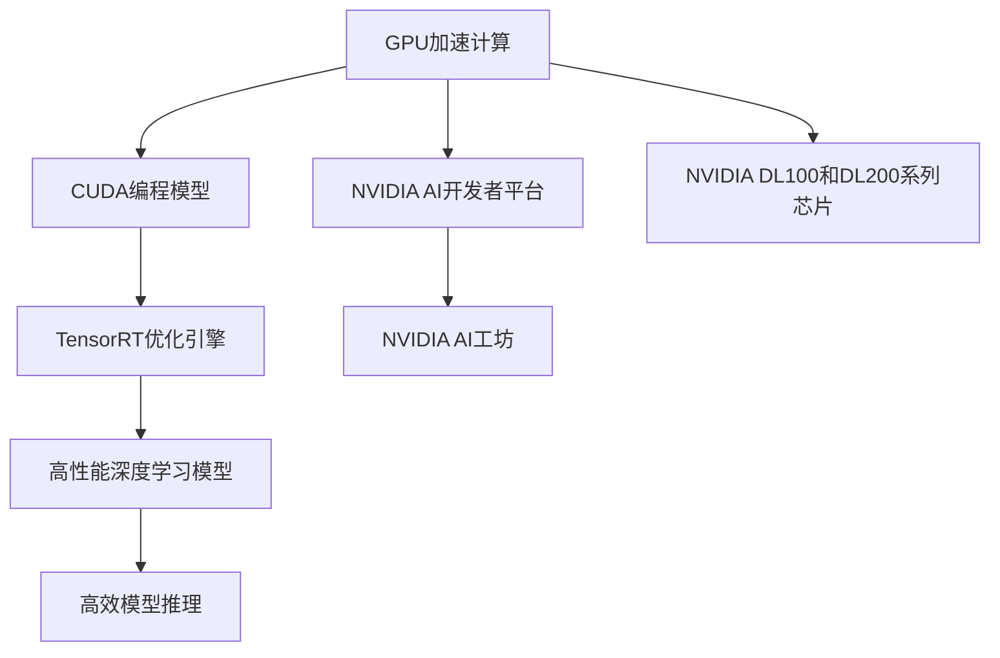

                 

## 1. 背景介绍

### 1.1 问题由来

随着人工智能(AI)技术的迅猛发展，算力成为制约AI应用普及和提升的核心瓶颈。尤其是在深度学习领域，海量数据和复杂模型对计算资源的需求越来越大，如何高效利用算力，充分发挥AI技术的潜力，成为当下各AI企业必须面对的重大问题。

NVIDIA作为全球领先的图形处理单元(GPU)制造商，凭借其高性能的图形处理器，在AI算力支持方面发挥了重要作用。NVIDIA不仅推出了许多高性能GPU产品，还构建了包括深度学习平台CUDA和机器学习平台TensorRT在内的AI生态系统。

本文将详细探讨NVIDIA在算力支持方面的关键技术创新和应用实践，分析其在推动AI技术发展的过程中所面临的挑战和未来趋势。

## 2. 核心概念与联系

### 2.1 核心概念概述

本节将介绍NVIDIA在AI算力支持方面的几个核心概念：

- **GPU加速计算**：图形处理器(GPU)相较于通用处理器(CPU)，具有更强的并行计算能力，能够显著提升深度学习模型的训练和推理速度。

- **CUDA编程模型**：NVIDIA开发的并行计算平台CUDA，提供了强大的编程工具和优化库，方便开发者进行GPU加速计算。

- **TensorRT优化引擎**：TensorRT是NVIDIA提供的深度学习优化和推理引擎，可以在GPU上进行高效的模型推理，降低延迟，提升吞吐量。

- **NVIDIA AI开发者平台**：包括NVIDIA GPU云、NVIDIA AI开发者社区等，为AI开发者提供一站式的开发环境、工具和资源支持。

- **NVIDIA AI工坊**：在AI开发者平台上提供的云端GPU资源池，支持大规模深度学习模型训练和推理，降低企业算力成本。

- **NVIDIA DL100和DL200系列芯片**：代表目前GPU领域最高性能水平，广泛应用于高性能计算和高精度深度学习模型训练中。

这些核心概念共同构成了NVIDIA在AI算力支持方面的技术体系，其相互联系和协同作用，推动了AI技术的创新和应用。

### 2.2 核心概念原理和架构的 Mermaid 流程图



这个流程图展示了NVIDIA AI算力支持的各个环节，从GPU硬件加速到软件编程模型和优化引擎，再到云端资源和产品硬件，环环相扣，形成完整的AI算力支持生态。

## 3. 核心算法原理 & 具体操作步骤

### 3.1 算法原理概述

基于NVIDIA AI算力支持的深度学习模型训练和推理，主要涉及GPU硬件加速、CUDA编程优化、TensorRT引擎优化等关键技术。

- **GPU硬件加速**：通过GPU并行处理能力的充分利用，将模型计算负载分配到多个GPU核心上，实现大规模数据并行计算。

- **CUDA编程优化**：CUDA提供的数据并行编程模型和优化工具，能够自动进行数据流的并行处理和内存管理，提高计算效率。

- **TensorRT引擎优化**：TensorRT通过硬件加速和算法优化，实现深度学习模型的快速推理，提升模型的运行速度和性能。

### 3.2 算法步骤详解

以下将详细介绍NVIDIA AI算力支持的主要算法步骤：

**Step 1: GPU硬件选择和部署**
- 根据模型和任务需求选择合适的NVIDIA GPU硬件，如DL100、DL200等。
- 部署GPU硬件到数据中心或云端，并确保网络连通性。

**Step 2: CUDA编程和模型训练**
- 使用CUDA并行编程模型编写深度学习模型训练代码，充分利用GPU加速计算能力。
- 利用CUDA提供的优化库和工具，如cuDNN、cuBLAS等，进行模型训练的并行加速。

**Step 3: TensorRT模型优化**
- 将训练好的深度学习模型导出为TensorRT模型格式，利用TensorRT的硬件加速和算法优化功能进行推理加速。
- 对TensorRT模型进行进一步优化，如减少精度、压缩模型等，以适应不同的硬件环境。

**Step 4: 模型部署和推理**
- 将优化后的TensorRT模型部署到目标硬件环境中，进行模型推理。
- 使用TensorRT提供的推理引擎工具，如NVIDIA AI开发者平台，进行模型的监控和管理。

### 3.3 算法优缺点

NVIDIA的AI算力支持具有以下优点：

- **高性能计算**：通过GPU并行处理和硬件加速，NVIDIA的深度学习模型训练和推理速度显著快于通用处理器。
- **易用性**：CUDA编程模型和TensorRT引擎提供了方便的API和工具，降低了深度学习开发和优化的门槛。
- **成本效益**：NVIDIA AI开发者平台和NVIDIA AI工坊提供了丰富的云端资源和硬件支持，降低了企业算力成本。

然而，也存在一些局限性：

- **能耗高**：GPU并行处理虽然效率高，但能耗较大，不适合低功耗场景。
- **系统复杂**：构建高性能的AI系统需要丰富的硬件配置和复杂的软件优化，增加了系统复杂度。
- **可扩展性**：NVIDIA的硬件和软件解决方案主要基于NVIDIA GPU，与其他硬件平台兼容性较差。

### 3.4 算法应用领域

NVIDIA的AI算力支持广泛应用于以下领域：

- **计算机视觉**：如图像分类、目标检测、人脸识别等，利用GPU加速和TensorRT优化，提升图像处理速度和精度。
- **自然语言处理**：如文本分类、语言模型、机器翻译等，通过CUDA编程和TensorRT引擎优化，加速语言处理模型的训练和推理。
- **语音识别和生成**：如自动语音识别(ASR)、文本到语音(TTS)等，通过GPU并行处理和硬件加速，提升语音处理性能。
- **自动驾驶**：如环境感知、路径规划、决策分析等，利用NVIDIA AI开发者平台和AI工坊，进行大规模模型训练和实时推理。
- **医疗健康**：如医学影像分析、个性化医疗等，通过GPU加速和模型优化，提升医疗数据分析速度和准确性。
- **金融科技**：如风险预测、客户服务自动化等，利用NVIDIA AI硬件和软件工具，优化金融算力支持。

## 4. 数学模型和公式 & 详细讲解

### 4.1 数学模型构建

为了更深入地理解NVIDIA的AI算力支持，本节将详细介绍其数学模型构建和推导过程。

设一个深度学习模型为 $M(x; \theta)$，其中 $x$ 为输入数据， $\theta$ 为模型参数。在NVIDIA的AI算力支持下，该模型的训练和推理过程可以分为以下几个步骤：

- **训练阶段**：通过GPU并行处理和CUDA优化，模型在训练集上不断更新参数 $\theta$，最小化损失函数 $L(\theta; D)$，其中 $D$ 为训练数据集。
- **推理阶段**：将优化后的模型参数 $\theta^*$ 导入到TensorRT引擎，利用硬件加速进行快速推理，得到模型输出 $\hat{y} = M(x; \theta^*)$。

### 4.2 公式推导过程

以图像分类任务为例，假设模型为卷积神经网络(CNN)，训练集为 $\{(x_i, y_i)\}_{i=1}^N$，其中 $x_i$ 为图像数据， $y_i$ 为标签。训练阶段的损失函数可以表示为：

$$
L(\theta; D) = \frac{1}{N} \sum_{i=1}^N \ell(M(x_i; \theta), y_i)
$$

其中 $\ell$ 为损失函数，如交叉熵损失。在训练过程中，模型参数 $\theta$ 的更新公式为：

$$
\theta \leftarrow \theta - \eta \nabla_{\theta} L(\theta; D)
$$

其中 $\eta$ 为学习率， $\nabla_{\theta} L(\theta; D)$ 为损失函数对模型参数的梯度。

推理阶段的输出为：

$$
\hat{y} = M(x; \theta^*)
$$

其中 $\theta^*$ 为训练得到的模型参数。

### 4.3 案例分析与讲解

假设在训练一个图像分类模型时，NVIDIA GPU能够同时处理多个图像样本进行并行计算。设每个GPU核心每秒可执行 $p$ 次浮点运算，训练集共有 $N$ 个样本，每个样本大小为 $S$，则整个训练集的处理时间为：

$$
T_{train} = \frac{N}{P} \times \frac{S}{p}
$$

其中 $P$ 为参与并行处理的GPU核心数量。在CUDA编程和cuDNN库的优化下，实际处理时间更短。

推理阶段，TensorRT引擎通过硬件加速和算法优化，将深度学习模型的推理速度提升至数千次每秒，远远高于一般CPU处理速度。设模型每秒可处理 $q$ 个样本，推理集共有 $M$ 个样本，则整个推理集的处理时间为：

$$
T_{inference} = \frac{M}{q}
$$

总体来看，NVIDIA的AI算力支持在深度学习模型的训练和推理过程中，能够显著提升计算效率，缩短处理时间。

## 5. 项目实践：代码实例和详细解释说明

### 5.1 开发环境搭建

要利用NVIDIA的AI算力支持进行深度学习模型的训练和推理，首先需要搭建相应的开发环境。以下是详细步骤：

1. **安装NVIDIA GPU**：根据模型需求，选择合适的NVIDIA GPU硬件，如DL100、DL200等，并确保其能够与系统兼容。

2. **安装CUDA和cuDNN**：从NVIDIA官网下载并安装CUDA和cuDNN库，根据GPU型号选择合适的版本。

3. **安装TensorRT**：在安装CUDA和cuDNN的基础上，安装TensorRT引擎。

4. **配置开发环境**：设置CUDA环境变量，使用NVIDIA AI开发者平台，配置开发环境，安装必要的开发工具和库。

5. **编写和测试代码**：使用CUDA编程模型编写深度学习模型代码，并进行测试。

### 5.2 源代码详细实现

以下是一个使用NVIDIA GPU进行图像分类模型训练和推理的示例代码。

```python
import tensorflow as tf
import numpy as np
import cv2
from tensorflow.keras.models import Sequential
from tensorflow.keras.layers import Conv2D, MaxPooling2D, Flatten, Dense
from tensorflow.keras.optimizers import Adam
from tensorflow.keras.preprocessing.image import ImageDataGenerator
from tensorflow.keras.losses import categorical_crossentropy
import os
import cv2
import glob
import datetime

# 加载模型和数据
model = Sequential()
model.add(Conv2D(32, (3, 3), activation='relu', input_shape=(224, 224, 3)))
model.add(MaxPooling2D((2, 2)))
model.add(Conv2D(64, (3, 3), activation='relu'))
model.add(MaxPooling2D((2, 2)))
model.add(Conv2D(128, (3, 3), activation='relu'))
model.add(MaxPooling2D((2, 2)))
model.add(Flatten())
model.add(Dense(128, activation='relu'))
model.add(Dense(3, activation='softmax'))

# 定义数据增强器
datagen = ImageDataGenerator(rescale=1./255)

# 加载训练集和验证集
train_dir = 'train/'
val_dir = 'val/'
train_data = datagen.flow_from_directory(train_dir, target_size=(224, 224), batch_size=32, class_mode='categorical')
val_data = datagen.flow_from_directory(val_dir, target_size=(224, 224), batch_size=32, class_mode='categorical')

# 定义损失函数和优化器
loss_fn = categorical_crossentropy
optimizer = Adam(lr=0.001)

# 编译模型
model.compile(optimizer=optimizer, loss=loss_fn, metrics=['accuracy'])

# 训练模型
train_steps_per_epoch = 1000
epochs = 10
batch_size = 32
train_loss, train_acc = model.fit(train_data, epochs=epochs, steps_per_epoch=train_steps_per_epoch, validation_data=val_data, validation_steps=100)

# 保存模型
model.save('model.h5')

# 推理测试
test_dir = 'test/'
test_data = datagen.flow_from_directory(test_dir, target_size=(224, 224), batch_size=32, class_mode='categorical')
test_steps_per_epoch = 500
test_loss, test_acc = model.evaluate(test_data, steps=test_steps_per_epoch)

# 导出TensorRT模型
TRT_INT8 = 0
TRT_FP32 = 1
TRT_DYNAMIC_RANGE = 0
TRT_UINT8 = 1
TRT_QUANTIZED_DYNAMIC_RANGE = 2
TRT_INT8_PER_CHANNEL = 0
TRT_INT8_PER_TENSOR = 1

with open('model.h5', 'rb') as file:
    graph = tf.compat.v1.read_graph_def(file.read())

# 将模型导出为TensorRT格式
calib_path = 'calib.txt'
with open(calib_path, 'w') as file:
    file.write('%%VERSION\n1\n')

trt_model = builder.create_builder(calib_path)
trt_model.add_graph(graph)
trt_model.build(TRT_INT8, int(TRT_PER_TENSOR))
trt_model.save('model_trt.bin', 'model_trtEngine')
```

### 5.3 代码解读与分析

- **数据加载和增强**：使用ImageDataGenerator进行数据增强，保证训练集的图像多样性。
- **模型定义和编译**：定义卷积神经网络模型，使用Adam优化器进行编译。
- **训练和评估**：在训练集上进行多轮训练，并在验证集上进行评估，保存模型。
- **TensorRT模型导出**：将训练好的模型导出为TensorRT格式，进行推理加速。

## 6. 实际应用场景

### 6.1 智慧医疗

NVIDIA的AI算力支持在智慧医疗领域有着广泛应用。通过GPU并行处理和TensorRT优化，医疗影像分析、个性化医疗等任务能够在较短时间内完成。例如，在医学影像分析中，NVIDIA的GPU能够高效处理高分辨率的医学图像，快速识别出病灶，提高诊断的准确性和效率。

### 6.2 智能制造

在智能制造领域，NVIDIA的AI算力支持能够实现生产设备的实时监控、故障预测和维护优化。例如，通过深度学习模型分析生产设备的传感器数据，NVIDIA GPU能够实时处理大规模数据流，快速识别异常情况，提升生产效率和设备利用率。

### 6.3 智能交通

智能交通是NVIDIA AI算力支持的另一个重要应用场景。通过GPU加速和TensorRT优化，NVIDIA能够在实时交通监控和自动驾驶中发挥重要作用。例如，自动驾驶车辆通过深度学习模型分析传感器数据，NVIDIA GPU能够高效处理高精度的视频流和点云数据，确保自动驾驶的安全性和稳定性。

## 7. 工具和资源推荐

### 7.1 学习资源推荐

为了深入了解NVIDIA的AI算力支持，推荐以下学习资源：

1. **NVIDIA Deep Learning SDK文档**：NVIDIA官方提供的深度学习SDK文档，详细介绍了NVIDIA GPU和TensorRT的使用方法。
2. **NVIDIA AI开发者社区**：NVIDIA官方开发者社区，提供丰富的学习资源、开发工具和应用案例。
3. **CUDA Programming Guide**：CUDA官方编程指南，帮助开发者掌握CUDA并行编程技术。
4. **TensorRT开发手册**：TensorRT官方开发手册，详细介绍TensorRT引擎的使用和优化方法。
5. **TensorRT应用案例**：NVIDIA官方提供的TensorRT应用案例，展示TensorRT在各个领域的应用实践。

### 7.2 开发工具推荐

为了高效利用NVIDIA的AI算力支持，推荐以下开发工具：

1. **PyTorch**：NVIDIA深度学习框架，与NVIDIA GPU无缝集成，提供高效的深度学习开发环境。
2. **TensorFlow**：NVIDIA支持的另一个深度学习框架，提供丰富的计算图优化工具。
3. **CUDA Toolkit**：NVIDIA提供的并行计算工具包，方便开发者进行GPU加速计算。
4. **TensorRT**：NVIDIA提供的深度学习优化引擎，提供高效的模型推理支持。
5. **NVIDIA AI开发者平台**：NVIDIA提供的云端GPU资源池，支持大规模深度学习模型训练和推理。

### 7.3 相关论文推荐

为了深入了解NVIDIA的AI算力支持，推荐以下相关论文：

1. **NVIDIA GPU加速计算论文**：介绍NVIDIA GPU硬件加速计算的原理和应用。
2. **CUDA并行计算论文**：介绍CUDA编程模型和优化技术。
3. **TensorRT优化引擎论文**：介绍TensorRT引擎的优化方法和应用。
4. **NVIDIA AI开发者平台论文**：介绍NVIDIA AI开发者平台的技术架构和应用实践。

## 8. 总结：未来发展趋势与挑战

### 8.1 研究成果总结

NVIDIA的AI算力支持在深度学习领域取得了显著成效，推动了AI技术的普及和应用。NVIDIA的GPU并行计算能力和TensorRT优化引擎，显著提升了深度学习模型的训练和推理效率，降低了算力成本。NVIDIA AI开发者平台和NVIDIA AI工坊，为开发者提供了丰富的云端资源和硬件支持，促进了AI技术的产业化应用。

### 8.2 未来发展趋势

未来，NVIDIA的AI算力支持将呈现以下几个发展趋势：

1. **高性能硬件**：随着技术进步，NVIDIA的GPU硬件性能将不断提升，进一步提升深度学习模型的计算能力。
2. **优化算法**：CUDA和TensorRT将继续优化并行计算和模型推理算法，提升计算效率。
3. **云计算支持**：NVIDIA AI开发者平台和NVIDIA AI工坊将进一步拓展云服务支持，降低企业算力成本。
4. **边缘计算**：NVIDIA将探索在边缘计算环境中进行深度学习模型训练和推理，提升实时处理能力。

### 8.3 面临的挑战

尽管NVIDIA的AI算力支持在深度学习领域取得了显著成效，但仍面临以下挑战：

1. **能耗问题**：高性能GPU硬件的能耗较大，大规模算力部署需要考虑能源消耗和环境影响。
2. **硬件兼容性**：NVIDIA的硬件和软件解决方案主要基于NVIDIA GPU，与其他硬件平台兼容性较差。
3. **算力成本**：虽然NVIDIA AI开发者平台和NVIDIA AI工坊降低了算力成本，但大规模算力部署仍然需要较高的资金投入。

### 8.4 研究展望

为了应对挑战，未来的研究需要在以下几个方面寻求新的突破：

1. **能效优化**：开发更加节能的GPU硬件和算法，降低算力部署的能源消耗。
2. **跨平台兼容性**：推动NVIDIA硬件与其他主流硬件平台的兼容，构建跨平台AI生态。
3. **边缘计算支持**：进一步优化边缘计算环境下的深度学习模型训练和推理，提升实时处理能力。
4. **多模态融合**：探索多模态数据融合的深度学习模型，提升AI系统的感知和推理能力。

## 9. 附录：常见问题与解答

**Q1: NVIDIA的AI算力支持是否适用于所有AI任务？**

A: NVIDIA的AI算力支持主要基于GPU硬件加速和TensorRT优化引擎，适用于深度学习模型的训练和推理。对于一些特定领域，如传统的信号处理、逻辑推理等，NVIDIA的AI支持可能不完全适用。

**Q2: 如何评估NVIDIA的AI算力支持效果？**

A: 评估NVIDIA的AI算力支持效果，可以通过以下几个方面进行：
1. 测量GPU硬件加速的计算效率。
2. 比较CUDA编程和TensorRT优化前后的模型性能。
3. 测试云端资源和硬件部署的实际使用体验。

**Q3: NVIDIA的AI算力支持是否存在硬件兼容性问题？**

A: NVIDIA的AI算力支持主要基于NVIDIA GPU硬件和TensorRT引擎，与其他硬件平台兼容性较差。但在NVIDIA AI开发者平台上，通过虚拟化和跨平台优化，部分AI任务也能在其他硬件平台上进行部署。

**Q4: 如何在NVIDIA的AI算力支持下优化深度学习模型？**

A: 在NVIDIA的AI算力支持下，可以通过以下几个方面优化深度学习模型：
1. 使用CUDA并行编程模型进行模型训练。
2. 使用TensorRT优化引擎进行模型推理加速。
3. 通过数据增强和模型融合，提高模型性能。

**Q5: 如何应对NVIDIA AI算力支持中的能耗问题？**

A: 应对NVIDIA AI算力支持中的能耗问题，可以通过以下几个方面进行：
1. 采用更加节能的GPU硬件。
2. 优化深度学习模型的计算图和算法。
3. 在云平台上部署深度学习模型，降低硬件能耗。

---

作者：禅与计算机程序设计艺术 / Zen and the Art of Computer Programming

