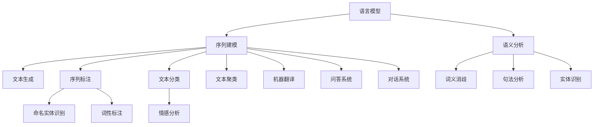

                 

# Natural Language Processing

> 关键词：Natural Language Processing, NLP, 语言模型, 神经网络, 序列建模, 语义分析, 文本生成

## 1. 背景介绍

### 1.1 问题由来

自然语言处理（Natural Language Processing, NLP）是计算机科学、人工智能和语言学的交叉领域，旨在使计算机能够理解、处理和生成人类语言。语言是人类交流的基础，通过自然语言处理，机器可以理解人类的语言需求，提供智能化的解决方案，极大地提升了人机交互的效率和质量。

NLP技术在诸如机器翻译、语音识别、智能客服、情感分析、文本分类、信息抽取、对话系统等领域得到了广泛应用。然而，传统的基于规则或特征工程的NLP方法难以处理大规模、复杂和多样化的语言数据。近年来，深度学习特别是神经网络的兴起，使得NLP技术得以突破瓶颈，取得了显著进展。

### 1.2 问题核心关键点

NLP的核心问题在于如何让机器更好地理解和生成自然语言。目前，NLP中应用最广泛的深度学习方法基于序列建模，特别是使用神经网络对序列数据（如文本、语音等）进行建模。

主要的关键点包括：

- **语言模型（Language Model）**：是NLP的基础，用于计算给定文本序列的概率，并据此预测下一个单词或字。

- **序列建模（Sequence Modeling）**：通过神经网络对序列数据进行建模，其中RNN（递归神经网络）和Transformer模型是最常用的。

- **语义分析（Semantic Analysis）**：包括词义消歧、句法分析、实体识别等，是理解语言深层次含义的关键。

- **文本生成（Text Generation）**：利用语言模型生成自然语言文本，如机器翻译、对话系统、文本摘要等。

### 1.3 问题研究意义

NLP技术在提升信息处理效率、增强人机交互质量、辅助决策等方面具有重要意义：

1. **信息处理效率**：通过自动化处理文本、语音等大规模数据，节省了大量人工处理的时间和成本。
2. **人机交互质量**：使机器能够理解人类语言，提供智能化、个性化的交互体验。
3. **决策辅助**：通过分析大量文本数据，辅助决策过程，如舆情分析、风险评估等。
4. **语言服务**：为非母语者提供翻译、口译、语音合成等服务，促进跨文化交流。

NLP技术的广泛应用，极大地推动了各行各业的数字化转型和智能化升级。

## 2. 核心概念与联系

### 2.1 核心概念概述

为更好地理解NLP的核心概念和它们之间的关系，本节将详细介绍几个关键概念及其联系。

- **语言模型（Language Model）**：计算给定文本序列的概率，即预测下一个单词或字。是NLP的基础，广泛应用于机器翻译、语音识别、文本生成等任务。

- **神经网络（Neural Network）**：由神经元和连接组成的计算模型，广泛应用于图像识别、语音处理、自然语言处理等领域。

- **序列建模（Sequence Modeling）**：对序列数据（如文本、语音等）进行建模，使用神经网络处理。RNN和Transformer模型是其常用方法。

- **语义分析（Semantic Analysis）**：分析语言背后的深层含义，如词义消歧、句法分析、实体识别等。

- **文本生成（Text Generation）**：利用语言模型生成自然语言文本，如机器翻译、对话系统、文本摘要等。

- **序列标注（Sequence Labeling）**：将标签分配到序列中的每个位置，如命名实体识别、词性标注等。

- **文本分类（Text Classification）**：将文本分为不同的类别，如情感分析、主题分类等。

- **文本聚类（Text Clustering）**：将文本按照相似度分组，如信息检索、文档组织等。

- **机器翻译（Machine Translation）**：将一种语言的文本翻译成另一种语言，如Google Translate。

- **问答系统（Question Answering）**：根据问题提供准确的答案，如IBM Watson。

- **对话系统（Dialog System）**：与用户进行多轮交互，提供智能化的对话服务。

这些概念之间的逻辑关系可以通过以下Mermaid流程图来展示：



这个流程图展示了NLP核心概念之间的相互联系，每个概念都对NLP技术的进步至关重要。

## 3. 核心算法原理 & 具体操作步骤

### 3.1 算法原理概述

NLP中的核心算法主要基于深度学习，尤其是神经网络对序列数据的建模。本节将详细介绍基于序列建模的NLP算法原理。

#### 3.1.1 语言模型

语言模型的基本思想是通过统计语言数据，计算出给定文本序列的概率，即下一个单词或字的条件概率。

以预测下一个单词为例，可以使用n-gram模型或更复杂的语言模型如LSTM、GRU、Transformer等。

$$ P(w_t | w_1, w_2, ..., w_{t-1}) = \frac{p(w_1, w_2, ..., w_t)}{p(w_1, w_2, ..., w_{t-1})} $$

其中，$w_t$表示下一个单词，$w_1, w_2, ..., w_{t-1}$表示前文。

语言模型的训练通常使用最大似然估计法，即通过统计大量文本数据，求得各个单词出现的概率，从而得到条件概率。

#### 3.1.2 序列建模

序列建模是指使用神经网络对序列数据进行建模，其中RNN和Transformer模型是最常用的。

- **RNN**：通过将前文信息传递到下一个时间步，对序列数据进行建模。

- **Transformer**：通过自注意力机制，同时考虑所有上下文信息，建模序列数据。

Transformer模型因其在处理长序列和并行计算上的优势，成为目前NLP中最流行的序列建模方法。

#### 3.1.3 语义分析

语义分析旨在理解语言背后的深层含义，包括词义消歧、句法分析、实体识别等。

- **词义消歧**：确定一个词在特定上下文中的具体含义。

- **句法分析**：分析句子的语法结构，如依存句法分析、成分句法分析等。

- **实体识别**：识别文本中的命名实体，如人名、地名、机构名等。

语义分析通常使用深度学习模型，如BERT、GPT等，通过预训练和微调来实现。

#### 3.1.4 文本生成

文本生成是指利用语言模型生成自然语言文本，如机器翻译、对话系统、文本摘要等。

- **机器翻译**：将一种语言的文本翻译成另一种语言，通常使用编码-解码模型，如Seq2Seq、Transformer等。

- **对话系统**：与用户进行多轮交互，提供智能化的对话服务。

- **文本摘要**：将长文本压缩成简短摘要，如BERT、GPT等模型。

文本生成的关键在于模型的训练，通常使用序列到序列（Seq2Seq）模型，通过预训练和微调来实现。

### 3.2 算法步骤详解

#### 3.2.1 数据预处理

数据预处理是NLP中的重要步骤，主要包括文本分词、去除停用词、标记化等。

- **分词**：将文本分割成单词或字，分词是NLP的基础。

- **去除停用词**：去除常用但无实际意义的词汇，如“的”、“是”等。

- **标记化**：将文本转换成机器可以处理的格式，如序列标签、向量等。

#### 3.2.2 模型构建

模型的构建通常包括编码器和解码器。

- **编码器**：对输入序列进行编码，输出表示输入的向量。

- **解码器**：对编码器输出的向量进行解码，生成目标序列。

常见的模型包括RNN、LSTM、GRU、Transformer等。

#### 3.2.3 模型训练

模型训练通常包括前向传播和反向传播两个步骤。

- **前向传播**：将输入数据输入模型，得到预测结果。

- **反向传播**：根据预测结果与真实标签的差异，调整模型参数。

训练过程中，通常使用梯度下降等优化算法，最小化损失函数。

### 3.3 算法优缺点

基于序列建模的NLP算法具有以下优点：

- **处理长序列**：适用于处理长文本序列，如文本、语音等。

- **并行计算**：Transformer等模型可以通过并行计算提高训练效率。

- **自动特征提取**：通过神经网络自动提取特征，避免了手工特征工程。

然而，该算法也存在以下缺点：

- **训练时间长**：由于模型参数较多，训练时间较长。

- **计算资源需求高**：需要大量的计算资源进行训练和推理。

- **模型复杂度较高**：模型结构复杂，难以解释。

### 3.4 算法应用领域

NLP算法在许多领域得到了广泛应用，如：

- **机器翻译**：将一种语言的文本翻译成另一种语言，如Google Translate。

- **语音识别**：将语音转换成文本，如苹果的Siri、亚马逊的Alexa。

- **智能客服**：通过理解用户问题，自动提供解决方案，如阿里巴巴的阿里云智能客服。

- **情感分析**：分析用户评论、社交媒体等，了解用户情感，如Twitter情感分析。

- **文本分类**：将文本分为不同的类别，如情感分类、主题分类等。

- **文本生成**：生成自然语言文本，如对话系统、文本摘要等。

- **信息抽取**：从文本中抽取结构化信息，如命名实体识别、关系抽取等。

- **问答系统**：根据问题提供准确的答案，如IBM Watson。

- **文本聚类**：将文本按照相似度分组，如信息检索、文档组织等。

这些应用领域展示了NLP技术的强大能力，未来将有更广泛的应用前景。

## 4. 数学模型和公式 & 详细讲解

### 4.1 数学模型构建

本节将使用数学语言对NLP中的核心算法进行更加严格的刻画。

#### 4.1.1 语言模型

语言模型的基本公式为：

$$ P(w_1, w_2, ..., w_t) = \prod_{i=1}^t P(w_i | w_1, w_2, ..., w_{i-1}) $$

其中，$w_1, w_2, ..., w_t$表示文本序列，$P(w_i | w_1, w_2, ..., w_{i-1})$表示在上下文条件下，单词$i$的条件概率。

#### 4.1.2 序列建模

Transformer模型的编码器通常包括多个自注意力层，每个自注意力层可以表示为：

$$ \text{Attention}(Q, K, V) = \text{Softmax}(\frac{QK^T}{\sqrt{d_k}})V $$

其中，$Q$、$K$、$V$分别表示查询向量、键向量和值向量，$d_k$是键向量的维度。

Transformer的解码器通常包括多头自注意力层和前馈神经网络层，表示为：

$$ \text{Attention}(Q, K, V) = \text{Softmax}(\frac{QK^T}{\sqrt{d_k}})V $$
$$ F = FFN(\text{Attention}(Q, K, V)) $$

其中，$FFN$表示前馈神经网络。

#### 4.1.3 语义分析

语义分析通常使用BERT、GPT等预训练模型，通过微调实现。

BERT模型的预训练任务包括掩码语言模型和下一句预测，表示为：

$$ P(y | X) = \text{Softmax}(\frac{e^{w^Ty}}{\Sigma_i e^{w^Ty_i}}) $$

其中，$X$表示输入的文本序列，$y$表示目标标签，$w$表示模型参数。

#### 4.1.4 文本生成

文本生成的目标是最小化交叉熵损失函数，表示为：

$$ \mathcal{L} = -\frac{1}{N} \sum_{i=1}^N \sum_{t=1}^T \log P(w_t | w_1, w_2, ..., w_{t-1}) $$

其中，$N$表示样本数量，$T$表示序列长度。

### 4.2 公式推导过程

#### 4.2.1 语言模型

语言模型的推导过程如下：

1. 假设文本序列$w_1, w_2, ..., w_t$的联合概率为$P(w_1, w_2, ..., w_t)$，则下一个单词的条件概率为：

   $$ P(w_t | w_1, w_2, ..., w_{t-1}) = \frac{P(w_1, w_2, ..., w_t)}{P(w_1, w_2, ..., w_{t-1})} $$

2. 使用最大似然估计法，即通过统计大量文本数据，求得各个单词出现的概率，从而得到条件概率：

   $$ P(w_t | w_1, w_2, ..., w_{t-1}) = \frac{n(w_1, w_2, ..., w_t)}{n(w_1, w_2, ..., w_{t-1})} $$

   其中，$n(w_1, w_2, ..., w_t)$表示文本序列$w_1, w_2, ..., w_t$出现的次数。

#### 4.2.2 序列建模

Transformer模型的自注意力层推导过程如下：

1. 假设输入的查询向量为$Q$，键向量为$K$，值向量为$V$，则自注意力层的输出为：

   $$ \text{Attention}(Q, K, V) = \text{Softmax}(\frac{QK^T}{\sqrt{d_k}})V $$

2. 其中，$Q$、$K$、$V$分别表示查询向量、键向量和值向量，$d_k$是键向量的维度。

3. 使用矩阵乘法和Softmax函数，将查询向量与键向量进行相似度计算，得到注意力权重，再将注意力权重与值向量进行加权求和，得到自注意力层的输出。

#### 4.2.3 语义分析

BERT模型的预训练任务推导过程如下：

1. 假设文本序列$X$的掩码语言模型概率为$P(y | X)$，则下一个单词的条件概率为：

   $$ P(y | X) = \text{Softmax}(\frac{e^{w^Ty}}{\Sigma_i e^{w^Ty_i}}) $$

2. 其中，$X$表示输入的文本序列，$y$表示目标标签，$w$表示模型参数。

3. 使用Softmax函数，将模型参数$w$与目标标签$y$进行相似度计算，得到概率分布。

#### 4.2.4 文本生成

文本生成模型的推导过程如下：

1. 假设文本序列$w_1, w_2, ..., w_t$的联合概率为$P(w_1, w_2, ..., w_t)$，则下一个单词的条件概率为：

   $$ P(w_t | w_1, w_2, ..., w_{t-1}) = \frac{P(w_1, w_2, ..., w_t)}{P(w_1, w_2, ..., w_{t-1})} $$

2. 使用交叉熵损失函数，即最小化预测概率与真实标签的差异，表示为：

   $$ \mathcal{L} = -\frac{1}{N} \sum_{i=1}^N \sum_{t=1}^T \log P(w_t | w_1, w_2, ..., w_{t-1}) $$

3. 其中，$N$表示样本数量，$T$表示序列长度。

### 4.3 案例分析与讲解

#### 4.3.1 机器翻译

机器翻译是NLP中的经典任务，通常使用Seq2Seq模型进行实现。

- **编码器**：将源语言文本转换成向量表示。

- **解码器**：将向量表示转换成目标语言文本。

- **损失函数**：通常使用BLEU分数衡量翻译质量。

#### 4.3.2 情感分析

情感分析旨在分析用户评论、社交媒体等，了解用户情感。

- **数据集**：使用情感标注数据集，如IMDb影评数据集。

- **模型**：通常使用LSTM或Transformer模型，通过情感分类任务进行训练。

- **评估指标**：使用准确率、F1分数等评估模型性能。

## 5. 项目实践：代码实例和详细解释说明

### 5.1 开发环境搭建

在进行NLP实践前，我们需要准备好开发环境。以下是使用Python进行PyTorch开发的环境配置流程：

1. 安装Anaconda：从官网下载并安装Anaconda，用于创建独立的Python环境。

2. 创建并激活虚拟环境：
```bash
conda create -n pytorch-env python=3.8 
conda activate pytorch-env
```

3. 安装PyTorch：根据CUDA版本，从官网获取对应的安装命令。例如：
```bash
conda install pytorch torchvision torchaudio cudatoolkit=11.1 -c pytorch -c conda-forge
```

4. 安装Transformers库：
```bash
pip install transformers
```

5. 安装各类工具包：
```bash
pip install numpy pandas scikit-learn matplotlib tqdm jupyter notebook ipython
```

完成上述步骤后，即可在`pytorch-env`环境中开始NLP实践。

### 5.2 源代码详细实现

下面我们以情感分析任务为例，给出使用Transformers库对BERT模型进行训练和微调的PyTorch代码实现。

首先，定义情感分析任务的数据处理函数：

```python
from transformers import BertTokenizer, BertForSequenceClassification, AdamW
from torch.utils.data import Dataset, DataLoader
import torch
import numpy as np

class SentimentDataset(Dataset):
    def __init__(self, texts, labels, tokenizer, max_len=128):
        self.texts = texts
        self.labels = labels
        self.tokenizer = tokenizer
        self.max_len = max_len
        
    def __len__(self):
        return len(self.texts)
    
    def __getitem__(self, item):
        text = self.texts[item]
        label = self.labels[item]
        
        encoding = self.tokenizer(text, return_tensors='pt', max_length=self.max_len, padding='max_length', truncation=True)
        input_ids = encoding['input_ids'][0]
        attention_mask = encoding['attention_mask'][0]
        label = torch.tensor(label, dtype=torch.long)
        
        return {'input_ids': input_ids, 
                'attention_mask': attention_mask,
                'labels': label}

# 加载数据集
tokenizer = BertTokenizer.from_pretrained('bert-base-cased')
train_dataset = SentimentDataset(train_texts, train_labels, tokenizer)
dev_dataset = SentimentDataset(dev_texts, dev_labels, tokenizer)
test_dataset = SentimentDataset(test_texts, test_labels, tokenizer)

# 定义模型和优化器
model = BertForSequenceClassification.from_pretrained('bert-base-cased', num_labels=2)
optimizer = AdamW(model.parameters(), lr=2e-5)

# 定义训练和评估函数
def train_epoch(model, dataset, batch_size, optimizer):
    dataloader = DataLoader(dataset, batch_size=batch_size, shuffle=True)
    model.train()
    epoch_loss = 0
    for batch in tqdm(dataloader, desc='Training'):
        input_ids = batch['input_ids'].to(device)
        attention_mask = batch['attention_mask'].to(device)
        labels = batch['labels'].to(device)
        model.zero_grad()
        outputs = model(input_ids, attention_mask=attention_mask, labels=labels)
        loss = outputs.loss
        epoch_loss += loss.item()
        loss.backward()
        optimizer.step()
    return epoch_loss / len(dataloader)

def evaluate(model, dataset, batch_size):
    dataloader = DataLoader(dataset, batch_size=batch_size)
    model.eval()
    preds, labels = [], []
    with torch.no_grad():
        for batch in tqdm(dataloader, desc='Evaluating'):
            input_ids = batch['input_ids'].to(device)
            attention_mask = batch['attention_mask'].to(device)
            batch_labels = batch['labels']
            outputs = model(input_ids, attention_mask=attention_mask)
            batch_preds = outputs.logits.argmax(dim=1).to('cpu').tolist()
            batch_labels = batch_labels.to('cpu').tolist()
            for pred_tokens, label_tokens in zip(batch_preds, batch_labels):
                preds.append(pred_tokens[:len(label_tokens)])
                labels.append(label_tokens)
                
    print(classification_report(labels, preds))
```

然后，定义训练和评估流程：

```python
epochs = 5
batch_size = 16

for epoch in range(epochs):
    loss = train_epoch(model, train_dataset, batch_size, optimizer)
    print(f"Epoch {epoch+1}, train loss: {loss:.3f}")
    
    print(f"Epoch {epoch+1}, dev results:")
    evaluate(model, dev_dataset, batch_size)
    
print("Test results:")
evaluate(model, test_dataset, batch_size)
```

以上就是使用PyTorch对BERT进行情感分析任务微调的完整代码实现。可以看到，得益于Transformers库的强大封装，我们可以用相对简洁的代码完成BERT模型的加载和微调。

### 5.3 代码解读与分析

让我们再详细解读一下关键代码的实现细节：

**SentimentDataset类**：
- `__init__`方法：初始化文本、标签、分词器等关键组件。
- `__len__`方法：返回数据集的样本数量。
- `__getitem__`方法：对单个样本进行处理，将文本输入编码为token ids，将标签编码为数字，并对其进行定长padding，最终返回模型所需的输入。

**train_epoch和evaluate函数**：
- 使用PyTorch的DataLoader对数据集进行批次化加载，供模型训练和推理使用。
- 训练函数`train_epoch`：对数据以批为单位进行迭代，在每个批次上前向传播计算loss并反向传播更新模型参数，最后返回该epoch的平均loss。
- 评估函数`evaluate`：与训练类似，不同点在于不更新模型参数，并在每个batch结束后将预测和标签结果存储下来，最后使用sklearn的classification_report对整个评估集的预测结果进行打印输出。

**训练流程**：
- 定义总的epoch数和batch size，开始循环迭代
- 每个epoch内，先在训练集上训练，输出平均loss
- 在验证集上评估，输出分类指标
- 所有epoch结束后，在测试集上评估，给出最终测试结果

可以看到，PyTorch配合Transformers库使得BERT微调的代码实现变得简洁高效。开发者可以将更多精力放在数据处理、模型改进等高层逻辑上，而不必过多关注底层的实现细节。

当然，工业级的系统实现还需考虑更多因素，如模型的保存和部署、超参数的自动搜索、更灵活的任务适配层等。但核心的微调范式基本与此类似。

## 6. 实际应用场景

### 6.1 智能客服系统

智能客服系统是NLP技术的重要应用场景之一。传统的客服系统需要配备大量人力，高峰期响应缓慢，且一致性和专业性难以保证。使用基于NLP的智能客服系统，可以大幅提升客户咨询体验和问题解决效率。

通过使用微调后的NLP模型，智能客服系统能够自动理解用户意图，匹配最合适的回答。对于客户提出的新问题，还可以接入检索系统实时搜索相关内容，动态组织生成回答。如此构建的智能客服系统，能显著提升客户咨询体验和问题解决效率。

### 6.2 金融舆情监测

金融机构需要实时监测市场舆论动向，以便及时应对负面信息传播，规避金融风险。传统的监控方式成本高、效率低，难以应对网络时代海量信息爆发的挑战。基于NLP的舆情监测系统，可以自动监测金融领域的各类信息，及时预警风险。

具体而言，可以收集金融领域相关的新闻、报道、评论等文本数据，并对其进行情感分析。将微调后的NLP模型应用到实时抓取的网络文本数据，自动监测不同情感变化趋势，一旦发现负面信息激增等异常情况，系统便会自动预警，帮助金融机构快速应对潜在风险。

### 6.3 个性化推荐系统

当前的推荐系统往往只依赖用户的历史行为数据进行物品推荐，难以深入理解用户的真实兴趣偏好。基于NLP的个性化推荐系统，可以更好地挖掘用户行为背后的语义信息，从而提供更精准、多样的推荐内容。

在实践中，可以收集用户浏览、点击、评论、分享等行为数据，提取和用户交互的物品标题、描述、标签等文本内容。将文本内容作为模型输入，用户的后续行为（如是否点击、购买等）作为监督信号，在此基础上微调预训练语言模型。微调后的模型能够从文本内容中准确把握用户的兴趣点。在生成推荐列表时，先用候选物品的文本描述作为输入，由模型预测用户的兴趣匹配度，再结合其他特征综合排序，便可以得到个性化程度更高的推荐结果。

### 6.4 未来应用展望

随着NLP技术的不断发展，未来基于NLP的应用场景将更加广泛，潜力巨大。

- **智慧医疗**：基于NLP的问答系统、病历分析、药物研发等，提升医疗服务的智能化水平，辅助医生诊疗，加速新药开发进程。

- **智能教育**：基于NLP的作业批改、学情分析、知识推荐等，因材施教，促进教育公平，提高教学质量。

- **智慧城市**：基于NLP的信息检索、舆情分析、应急指挥等，提高城市管理的自动化和智能化水平，构建更安全、高效的未来城市。

此外，在企业生产、社会治理、文娱传媒等众多领域，基于NLP的人工智能应用也将不断涌现，为经济社会发展注入新的动力。相信随着技术的日益成熟，NLP技术将成为各行各业数字化转型和智能化升级的重要驱动力。

## 7. 工具和资源推荐

### 7.1 学习资源推荐

为了帮助开发者系统掌握NLP的理论基础和实践技巧，这里推荐一些优质的学习资源：

1. **《Natural Language Processing》系列书籍**：由NLP领域知名学者编写，系统介绍了NLP的基本概念、算法和技术。

2. **斯坦福大学CS224N《自然语言处理与深度学习》课程**：斯坦福大学开设的NLP明星课程，有Lecture视频和配套作业，带你入门NLP领域的基本概念和经典模型。

3. **Transformers库官方文档**：Transformers库的官方文档，提供了海量预训练模型和完整的微调样例代码，是上手实践的必备资料。

4. **HuggingFace官方博客**：HuggingFace的官方博客，分享了大量的NLP研究进展和最佳实践，适合进阶学习。

5. **ACL、EMNLP等顶级会议论文**：顶级会议的论文代表了NLP领域的最新研究进展，值得深入阅读。

通过对这些资源的学习实践，相信你一定能够快速掌握NLP技术的精髓，并用于解决实际的NLP问题。

### 7.2 开发工具推荐

高效的开发离不开优秀的工具支持。以下是几款用于NLP开发的常用工具：

1. **PyTorch**：基于Python的开源深度学习框架，灵活动态的计算图，适合快速迭代研究。

2. **TensorFlow**：由Google主导开发的开源深度学习框架，生产部署方便，适合大规模工程应用。

3. **Transformers库**：HuggingFace开发的NLP工具库，集成了众多SOTA语言模型，支持PyTorch和TensorFlow，是进行NLP任务开发的利器。

4. **spaCy**：Python的自然语言处理库，提供了分词、命名实体识别、依存句法分析等功能。

5. **NLTK**：Python的自然语言处理库，提供了词性标注、情感分析、文本分类等功能。

6. **Stanford CoreNLP**：斯坦福大学开发的自然语言处理工具包，提供了命名实体识别、句法分析、情感分析等功能。

7. **spaCy+Transformers**：结合了spaCy和Transformers库的NLP处理框架，性能高、易用性强。

合理利用这些工具，可以显著提升NLP任务的开发效率，加快创新迭代的步伐。

### 7.3 相关论文推荐

NLP技术的不断发展离不开学界的持续研究。以下是几篇奠基性的相关论文，推荐阅读：

1. **Attention is All You Need**：提出了Transformer结构，开启了NLP领域的预训练大模型时代。

2. **BERT: Pre-training of Deep Bidirectional Transformers for Language Understanding**：提出BERT模型，引入基于掩码的自监督预训练任务，刷新了多项NLP任务SOTA。

3. **Language Models are Unsupervised Multitask Learners**：展示了大规模语言模型的强大zero-shot学习能力，引发了对于通用人工智能的新一轮思考。

4. **A Survey on Transfer Learning and Domain Adaptation in Natural Language Processing**：综述了NLP中的迁移学习和领域适应技术，为NLP实践提供了理论指导。

5. **BART: Denoising Sequence-to-Sequence Pre-training for Natural Language Generation, Translation, and Comprehension**：提出了BART模型，结合自监督预训练和序列到序列训练，提升了文本生成和机器翻译的效果。

这些论文代表了大NLP模型的微调技术的发展脉络。通过学习这些前沿成果，可以帮助研究者把握学科前进方向，激发更多的创新灵感。

## 8. 总结：未来发展趋势与挑战

### 8.1 总结

本文对NLP的核心算法和微调方法进行了全面系统的介绍。首先阐述了NLP的研究背景和意义，明确了微调在拓展预训练模型应用、提升下游任务性能方面的独特价值。其次，从原理到实践，详细讲解了NLP中的核心算法，给出了NLP任务开发的完整代码实例。同时，本文还广泛探讨了NLP技术在智能客服、金融舆情、个性化推荐等多个行业领域的应用前景，展示了NLP技术的强大能力。

通过本文的系统梳理，可以看到，NLP技术在提升信息处理效率、增强人机交互质量、辅助决策等方面具有重要意义。NLP技术的广泛应用，极大地推动了各行各业的数字化转型和智能化升级。

### 8.2 未来发展趋势

展望未来，NLP技术将呈现以下几个发展趋势：

1. **模型规模持续增大**：随着算力成本的下降和数据规模的扩张，预训练语言模型的参数量还将持续增长。超大规模语言模型蕴含的丰富语言知识，有望支撑更加复杂多变的下游任务微调。

2. **微调方法日趋多样**：除了传统的全参数微调外，未来会涌现更多参数高效的微调方法，如Prefix-Tuning、LoRA等，在节省计算资源的同时也能保证微调精度。

3. **持续学习成为常态**：随着数据分布的不断变化，微调模型也需要持续学习新知识以保持性能。如何在不遗忘原有知识的同时，高效吸收新样本信息，将成为重要的研究课题。

4. **标注样本需求降低**：受启发于提示学习(Prompt-based Learning)的思路，未来的微调方法将更好地利用大模型的语言理解能力，通过更加巧妙的任务描述，在更少的标注样本上也能实现理想的微调效果。

5. **多模态微调崛起**：当前的微调主要聚焦于纯文本数据，未来会进一步拓展到图像、视频、语音等多模态数据微调。多模态信息的融合，将显著提升语言模型对现实世界的理解和建模能力。

6. **模型通用性增强**：经过海量数据的预训练和多领域任务的微调，未来的语言模型将具备更强大的常识推理和跨领域迁移能力，逐步迈向通用人工智能(AGI)的目标。

以上趋势凸显了NLP技术的广阔前景。这些方向的探索发展，必将进一步提升NLP系统的性能和应用范围，为人类认知智能的进化带来深远影响。

### 8.3 面临的挑战

尽管NLP技术已经取得了瞩目成就，但在迈向更加智能化、普适化应用的过程中，它仍面临着诸多挑战：

1. **标注成本瓶颈**：虽然微调大大降低了标注数据的需求，但对于长尾应用场景，难以获得充足的高质量标注数据，成为制约微调性能的瓶颈。如何进一步降低微调对标注样本的依赖，将是一大难题。

2. **模型鲁棒性不足**：当前微调模型面对域外数据时，泛化性能往往大打折扣。对于测试样本的微小扰动，微调模型的预测也容易发生波动。如何提高微调模型的鲁棒性，避免灾难性遗忘，还需要更多理论和实践的积累。

3. **推理效率有待提高**：大规模语言模型虽然精度高，但在实际部署时往往面临推理速度慢、内存占用大等效率问题。如何在保证性能的同时，简化模型结构，提升推理速度，优化资源占用，将是重要的优化方向。

4. **可解释性亟需加强**：当前微调模型更像是"黑盒"系统，难以解释其内部工作机制和决策逻辑。对于医疗、金融等高风险应用，算法的可解释性和可审计性尤为重要。如何赋予微调模型更强的可解释性，将是亟待攻克的难题。

5. **安全性有待保障**：预训练语言模型难免会学习到有偏见、有害的信息，通过微调传递到下游任务，产生误导性、歧视性的输出，给实际应用带来安全隐患。如何从数据和算法层面消除模型偏见，避免恶意用途，确保输出的安全性，也将是重要的研究课题。

6. **知识整合能力不足**：现有的微调模型往往局限于任务内数据，难以灵活吸收和运用更广泛的先验知识。如何让微调过程更好地与外部知识库、规则库等专家知识结合，形成更加全面、准确的信息整合能力，还有很大的想象空间。

正视NLP面临的这些挑战，积极应对并寻求突破，将是大语言模型微调走向成熟的必由之路。相信随着学界和产业界的共同努力，这些挑战终将一一被克服，NLP技术必将推动人工智能技术在各行各业的广泛应用。

### 8.4 研究展望

面对NLP所面临的种种挑战，未来的研究需要在以下几个方面寻求新的突破：

1. **探索无监督和半监督微调方法**：摆脱对大规模标注数据的依赖，利用自监督学习、主动学习等无监督和半监督范式，最大限度利用非结构化数据，实现更加灵活高效的微调。

2. **研究参数高效和计算高效的微调范式**：开发更加参数高效的微调方法，在固定大部分预训练参数的同时，只更新极少量的任务相关参数。同时优化微调模型的计算图，减少前向传播和反向传播的资源消耗，实现更加轻量级、实时性的部署。

3. **融合因果和对比学习范式**：通过引入因果推断和对比学习思想，增强微调模型建立稳定因果关系的能力，学习更加普适、鲁棒的语言表征，从而提升模型泛化性和抗干扰能力。

4. **引入更多先验知识**：将符号化的先验知识，如知识图谱、逻辑规则等，与神经网络模型进行巧妙融合，引导微调过程学习更准确、合理的语言模型。同时加强不同模态数据的整合，实现视觉、语音等多模态信息与文本信息的协同建模。

5. **结合因果分析和博弈论工具**：将因果分析方法引入微调模型，识别出模型决策的关键特征，增强输出解释的因果性和逻辑性。借助博弈论工具刻画人机交互过程，主动探索并规避模型的脆弱点，提高系统稳定性。

6. **纳入伦理道德约束**：在模型训练目标中引入伦理导向的评估指标，过滤和惩罚有偏见、有害的输出倾向。同时加强人工干预和审核，建立模型行为的监管机制，确保输出符合人类价值观和伦理道德。

这些研究方向的探索，必将引领NLP技术迈向更高的台阶，为构建安全、可靠、可解释、可控的智能系统铺平道路。面向未来，NLP技术还需要与其他人工智能技术进行更深入的融合，如知识表示、因果推理、强化学习等，多路径协同发力，共同推动自然语言理解和智能交互系统的进步。只有勇于创新、敢于突破，才能不断拓展语言模型的边界，让智能技术更好地造福人类社会。

## 9. 附录：常见问题与解答

**Q1: NLP任务中的序列建模方法有哪些？**

A: NLP任务中的序列建模方法主要包括RNN、LSTM、GRU和Transformer。其中，RNN是最基础的序列建模方法，LSTM和GRU是对RNN的改进，解决其梯度消失和梯度爆炸问题。Transformer则是目前最先进的序列建模方法，具有并行计算和长序列建模能力。

**Q2: 微调NLP模型时需要注意哪些问题？**

A: 微调NLP模型时需要注意以下问题：

1. **学习率的选择**：通常要比预训练时小1-2个数量级，避免破坏预训练权重。

2. **正则化的使用**：如L2正则、Dropout等，防止模型过拟合。

3. **数据增强**：通过回译、近义替换等方式扩充训练集，提高模型鲁棒性。

4. **对抗训练**：引入对抗样本，提高模型鲁棒性。

5. **参数高效微调**：只调整少量参数，固定大部分预训练参数。

6. **超参数的调优**：如batch size、epochs等，需要通过实验找到最优值。

**Q3: 如何降低NLP任务的标注成本？**

A: 降低NLP任务的标注成本可以从以下几个方面入手：

1. **数据清洗**：清洗数据，去除噪声和不必要的数据，提高标注数据的质量。

2. **主动学习**：使用主动学习算法，选择最具代表性的样本进行标注。

3. **半监督学习**：利用无标签数据，结合少量有标签数据进行训练，提高模型性能。

4. **零样本学习**：通过精心设计的输入文本格式，引导模型按期望方式输出，减少标注样本。

5. **知识图谱**：结合知识图谱，利用先验知识进行标注，减少标注工作量。

6. **自监督学习**：利用自监督学习任务，如语言模型、掩码语言模型等，减少标注需求。

**Q4: 如何提高NLP模型的推理效率？**

A: 提高NLP模型的推理效率可以从以下几个方面入手：

1. **模型压缩**：通过剪枝、量化等技术，减少模型参数量。

2. **硬件加速**：使用GPU、TPU等硬件设备，提升模型推理速度。

3. **并行计算**：使用分布式计算框架，如TensorFlow、PyTorch等，进行并行计算。

4. **模型优化**：通过模型优化算法，如Adam、SGD等，提升模型收敛速度。

5. **缓存技术**：使用缓存技术，减少重复计算，提高推理效率。

6. **剪枝和量化**：使用剪枝和量化技术，减少模型参数量，提升推理效率。

**Q5: 如何提高NLP模型的可解释性？**

A: 提高NLP模型的可解释性可以从以下几个方面入手：

1. **注意力机制**：通过可视化注意力机制，了解模型关注的关键部分。

2. **层级解释**：通过逐层解释模型输出，理解模型的推理过程。

3. **特征可视化**：通过特征可视化技术，了解模型的特征提取过程。

4. **模型可视化**：通过模型可视化工具，理解模型的结构和参数。

5. **可解释性模块**：使用可解释性模块，如LIME、SHAP等，提供模型输出的解释。

6. **规则和知识图谱**：结合规则和知识图谱，提供更直观的模型解释。

通过这些方法，可以大大提高NLP模型的可解释性，帮助开发者更好地理解模型行为，提高模型应用的可信度和透明度。

---

作者：禅与计算机程序设计艺术 / Zen and the Art of Computer Programming

