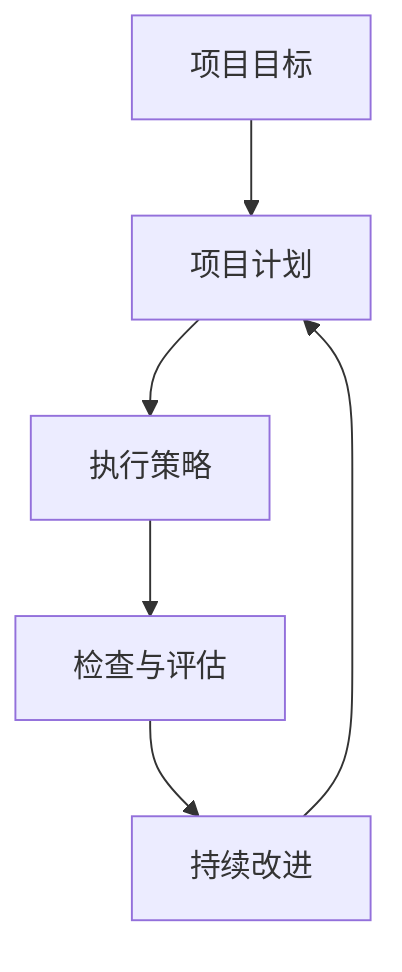

                 

# PDCA在项目管理中的运用

> 关键词：PDCA, 项目管理, 质量控制, 持续改进, 反馈循环

## 1. 背景介绍

### 1.1 问题由来
在现代项目管理中，如何确保项目高效推进、按时交付、质量达标，成为管理者和团队面临的共同挑战。传统的项目管理方法如瀑布模型虽然结构清晰，但在应对项目变更、需求复杂化等动态环境时显得力不从心。PDCA循环（Plan-Do-Check-Act，计划-执行-检查-行动）作为一种系统化的项目管理方法，通过不断的循环改进，能够有效应对项目过程中出现的各种不确定性，确保项目顺利实施。

### 1.2 问题核心关键点
PDCA循环的核心在于通过“计划-执行-检查-行动”四个步骤的循环往复，确保项目的每一个环节都得到了充分的考虑和优化。其中：
- **计划(Plan)**：明确项目目标和计划，制定详细的执行方案和资源分配。
- **执行(Do)**：按照既定计划执行，确保各项工作按预期推进。
- **检查(Check)**：评估执行效果，分析偏差和问题，识别改进机会。
- **行动(Action)**：根据检查结果，采取具体措施进行改进，调整计划和执行策略，确保项目顺利进行。

PDCA循环能够通过不断的反馈和改进，最大化项目成功的可能性，尤其是在项目环境复杂多变时，PDCA的灵活性和适应性显得尤为重要。

### 1.3 问题研究意义
研究PDCA在项目管理中的运用，对于提升项目管理的系统性和效率，优化项目执行流程，推动项目管理向更加智能化、高效化的方向发展，具有重要意义。具体而言：
- **提升项目管理效率**：通过PDCA循环，可以实现项目过程的持续优化，减少资源浪费和无效劳动，提升整体效率。
- **增强项目可控性**：PDCA循环中的“检查”和“行动”环节，有助于及时发现和纠正项目偏差，增强项目的可控性。
- **促进团队协作**：PDCA循环强调团队间的沟通和反馈，有助于建立良好的团队协作机制。
- **驱动质量持续改进**：通过PDCA的持续改进机制，可以有效提升项目交付物的质量和项目管理的整体水平。

## 2. 核心概念与联系

### 2.1 核心概念概述

为更好地理解PDCA在项目管理中的应用，本节将介绍几个密切相关的核心概念：

- **PDCA循环**：PDCA循环是一种系统化的项目管理方法，通过“计划-执行-检查-行动”四个步骤的循环往复，确保项目的每一个环节都得到了充分的考虑和优化。
- **项目目标**：指项目最终希望达成的具体成果或目标，如交付物、里程碑、成本控制等。
- **项目计划**：项目实施前，对各项任务、资源和进度进行详细规划和安排。
- **执行策略**：在项目计划确定后，采取具体的措施和行动，确保项目按计划推进。
- **检查与评估**：在项目执行过程中，对项目进展、质量、成本等关键指标进行定期检查和评估，识别偏差和问题。
- **持续改进**：根据检查结果，采取具体的改进措施，调整项目计划和执行策略，确保项目顺利进行。

这些核心概念之间的逻辑关系可以通过以下Mermaid流程图来展示：



这个流程图展示了大语言模型的核心概念及其之间的关系：

1. 项目目标设定：明确项目期望达成的最终成果。
2. 项目计划制定：对项目进行详细的规划和安排。
3. 执行策略实施：按照既定计划执行，确保各项工作按预期推进。
4. 检查与评估：对项目进展、质量、成本等关键指标进行定期检查和评估，识别偏差和问题。
5. 持续改进：根据检查结果，采取具体的改进措施，调整项目计划和执行策略，确保项目顺利进行。

这些概念共同构成了PDCA循环的管理框架，帮助项目管理者在动态环境中灵活应对各种变化，确保项目高质量地达成目标。

## 3. 核心算法原理 & 具体操作步骤
### 3.1 算法原理概述

PDCA循环作为一种系统化的项目管理方法，通过“计划-执行-检查-行动”四个步骤的循环往复，确保项目的每一个环节都得到了充分的考虑和优化。其中：

1. **计划(Plan)**：明确项目目标和计划，制定详细的执行方案和资源分配。
2. **执行(Do)**：按照既定计划执行，确保各项工作按预期推进。
3. **检查(Check)**：评估执行效果，分析偏差和问题，识别改进机会。
4. **行动(Action)**：根据检查结果，采取具体措施进行改进，调整计划和执行策略，确保项目顺利进行。

PDCA循环的核心在于通过不断的反馈和改进，确保项目的高效推进和高质量交付。在每个循环中，计划是起点，行动是终点，而检查和改进则构成了PDCA循环的反馈机制。

### 3.2 算法步骤详解

PDCA循环的具体操作步骤如下：

**Step 1: 计划阶段(Plan)**
- **明确项目目标**：定义项目的具体目标、成果和交付物，确保团队对项目目标有清晰的认识。
- **制定项目计划**：详细规划项目的时间表、任务分工、资源分配和里程碑节点。
- **识别风险与挑战**：评估项目过程中可能遇到的风险和挑战，制定相应的应对策略。
- **编写计划文档**：将上述规划内容以文档形式记录下来，作为项目实施的基础。

**Step 2: 执行阶段(Do)**
- **团队动员**：召开项目启动会议，明确各自任务和责任，激发团队积极性。
- **资源准备**：根据项目计划准备所需的人力、物力、财力等资源。
- **按计划执行**：按照既定计划推进各项工作，确保每项任务按时完成。
- **信息同步**：定期召开项目进展会议，共享进展信息，及时解决问题。

**Step 3: 检查阶段(Check)**
- **评估进展**：定期检查项目进展情况，对比计划与实际执行情况，识别偏差和问题。
- **收集反馈**：通过问卷调查、团队讨论等方式，收集项目成员和相关方的反馈意见。
- **质量评估**：对项目交付物进行质量评估，识别质量问题并记录。
- **数据统计**：收集和分析关键绩效指标(KPIs)，如进度、质量、成本等。

**Step 4: 行动阶段(Action)**
- **分析偏差**：对检查结果进行详细分析，找出偏差原因。
- **制定改进措施**：针对识别出的问题，制定具体的改进措施和调整计划。
- **调整执行策略**：根据改进措施，调整项目执行策略，确保后续工作顺利进行。
- **记录改进经验**：将改进措施和经验记录下来，为后续项目提供参考。

通过不断的PDCA循环，项目管理者可以持续优化项目执行，确保项目高质量地达成目标。

### 3.3 算法优缺点

PDCA循环作为一种系统化的项目管理方法，具有以下优点：
1. **系统化管理**：通过“计划-执行-检查-行动”的四个步骤，确保项目的每一个环节都得到了充分的考虑和优化。
2. **持续改进**：通过不断的检查和改进，可以及时发现和纠正偏差，确保项目按预期推进。
3. **团队协作**：强调团队间的沟通和反馈，有助于建立良好的团队协作机制。
4. **灵活应对**：PDCA循环的灵活性，使其能够应对项目过程中出现的各种不确定性。

同时，PDCA循环也存在一些局限性：
1. **过程复杂**：PDCA循环的四个步骤较为复杂，需要投入较多的时间和精力。
2. **灵活性不足**：对于变化较大的项目，PDCA循环可能难以灵活调整。
3. **依赖人为主导**：PDCA循环的效果很大程度上依赖于项目经理和管理者的能力和经验。

尽管如此，PDCA循环作为一种系统化的项目管理方法，其核心思想和方法在实践中仍然被广泛应用，并被证明是有效的。

### 3.4 算法应用领域

PDCA循环作为一种通用的项目管理方法，可以应用于多个领域，包括但不限于：

- **软件开发**：在软件开发项目中，PDCA循环可以用于需求分析、设计、编码、测试等各个阶段，确保项目按时高质量完成。
- **制造业**：在制造业中，PDCA循环可以用于生产流程优化、质量控制、设备维护等环节，提升生产效率和产品质量。
- **建筑工程**：在建筑工程中，PDCA循环可以用于项目规划、施工管理、质量检测等各个阶段，确保项目顺利推进。
- **教育管理**：在教育管理中，PDCA循环可以用于课程开发、教学评估、学生管理等环节，提升教学效果和教育质量。
- **市场营销**：在市场营销中，PDCA循环可以用于市场调研、广告投放、销售分析等环节，提升市场响应率和销售效果。

此外，PDCA循环还可以应用于许多其他领域，如政府项目管理、医疗服务管理、环境监测管理等，成为一种通用的项目管理方法。

## 4. 数学模型和公式 & 详细讲解  
### 4.1 数学模型构建

PDCA循环作为项目管理方法，其核心在于通过“计划-执行-检查-行动”四个步骤的循环往复，确保项目的每一个环节都得到了充分的考虑和优化。在数学模型上，PDCA循环可以表示为一个反馈控制循环系统。

假设项目执行过程中的质量指标为 $Q(t)$，其中 $t$ 表示时间。项目目标为 $Q_{target}$，计划执行策略为 $S(t)$，检查结果为 $C(t)$，改进措施为 $A(t)$。PDCA循环的数学模型可以表示为：

$$
Q(t+1) = Q(t) + A(t) \cdot [Q_{target} - Q(t)] + S(t) \cdot C(t)
$$

其中，$A(t)$ 为检查阶段识别出的改进措施，$C(t)$ 为检查阶段评估的质量指标。

### 4.2 公式推导过程

根据PDCA循环的定义，可以推导出如下公式：

1. **计划阶段**：在计划阶段，项目经理需要制定详细的执行策略 $S(t)$ 和质量目标 $Q_{target}$，并根据这些策略和目标计算出初始质量指标 $Q_0$。
2. **执行阶段**：在执行阶段，项目团队按照既定策略执行，导致质量指标发生变化。假设执行策略 $S(t)$ 和执行时间 $t$ 的影响，可以得到质量指标的变化方程：
   $$
   Q(t) = Q_0 + S(t) \cdot t
   $$
3. **检查阶段**：在检查阶段，项目经理需要对执行结果进行评估，得到检查结果 $C(t)$。假设检查结果与目标质量之间的差异，可以得到质量评估方程：
   $$
   C(t) = Q(t) - Q_{target}
   $$
4. **行动阶段**：在行动阶段，项目经理需要根据检查结果调整策略，实施改进措施 $A(t)$。假设改进措施的影响，可以得到质量改进方程：
   $$
   Q(t+1) = Q(t) + A(t) \cdot C(t)
   $$

### 4.3 案例分析与讲解

假设有一个软件开发项目，项目目标为在6个月内交付一个稳定的应用程序。项目经理按照PDCA循环的步骤进行管理：

- **计划阶段**：制定详细的项目计划和质量目标，确定关键里程碑节点，并制定应对风险的策略。
- **执行阶段**：团队按照计划推进项目，确保每项任务按时完成，并及时处理问题。
- **检查阶段**：每两周对项目进展和质量进行评估，收集团队和客户反馈，识别偏差和问题。
- **行动阶段**：根据检查结果，采取具体的改进措施，如调整开发进度、增加测试覆盖率等，确保项目顺利进行。

通过不断的PDCA循环，项目团队可以及时发现和纠正偏差，确保项目高质量地达成目标。

## 5. 项目实践：代码实例和详细解释说明
### 5.1 开发环境搭建

在进行PDCA循环的项目管理实践前，我们需要准备好开发环境。以下是使用Python进行项目管理开发的环境配置流程：

1. 安装Anaconda：从官网下载并安装Anaconda，用于创建独立的Python环境。

2. 创建并激活虚拟环境：
```bash
conda create -n pdca-env python=3.8 
conda activate pdca-env
```

3. 安装必要的Python包：
```bash
pip install pandas numpy matplotlib
```

4. 安装项目管理工具：
```bash
pip install project-manager
```

完成上述步骤后，即可在`pdca-env`环境中开始PDCA循环的项目管理实践。

### 5.2 源代码详细实现

下面我们以软件开发项目为例，给出使用Python进行PDCA循环项目管理的代码实现。

首先，定义项目的核心变量：

```python
from project_manager import Project, Task, Milestone, Resource

project = Project('Software Development', '1.0')
milestone1 = Milestone('Requirement Analysis', 'Month 1', 30, 'Identify project requirements')
milestone2 = Milestone('Design', 'Month 2', 40, 'Design system architecture')
milestone3 = Milestone('Development', 'Month 3-5', 200, 'Implement application features')
milestone4 = Milestone('Testing', 'Month 5-6', 80, 'Test and fix bugs')

project.add_milestone(milestone1)
project.add_milestone(milestone2)
project.add_milestone(milestone3)
project.add_milestone(milestone4)

resource1 = Resource('Developer', 4, 'Month 1-5')
resource2 = Resource('Tester', 2, 'Month 5-6')
project.add_resource(resource1)
project.add_resource(resource2)
```

然后，定义PDCA循环的实现函数：

```python
from project_manager import Project, Task, Milestone, Resource

def plan(project):
    # 定义项目计划和执行策略
    project.set_plan(milestone1, milestone2, milestone3, milestone4)
    project.set_strategy(resource1, resource2)

def do(project):
    # 执行计划，确保每项任务按时完成
    project.execute_tasks()

def check(project):
    # 检查项目进展和质量，识别偏差和问题
    project.check_milestones()
    project.check_resources()

def act(project):
    # 根据检查结果，采取具体的改进措施
    project.improve_milestones()
    project.improve_resources()

# 初始化项目
project = Project('Software Development', '1.0')
plan(project)
do(project)
check(project)
act(project)
```

最后，定义PDCA循环的执行函数：

```python
from project_manager import Project

def pdca_project(project):
    while not project.is_completed():
        plan(project)
        do(project)
        check(project)
        act(project)

# 执行PDCA循环
pdca_project(project)
```

以上就是使用Python进行PDCA循环项目管理的完整代码实现。可以看到，通过定义项目计划、执行策略、检查和改进措施，PDCA循环可以自动执行，帮助项目管理者持续优化项目管理。

### 5.3 代码解读与分析

让我们再详细解读一下关键代码的实现细节：

**Project类**：
- `add_milestone`方法：向项目中添加里程碑，包括任务、时间节点和资源分配。
- `set_plan`方法：设置项目的详细计划，包括各项任务和关键里程碑。
- `set_strategy`方法：设置项目的执行策略，包括资源分配和任务优先级。

**Milestone类**：
- `set_plan`方法：设置里程碑的具体任务和执行时间。
- `check_milestones`方法：评估里程碑的执行情况，识别偏差和问题。
- `improve_milestones`方法：根据检查结果，采取具体的改进措施，调整里程碑计划。

**Resource类**：
- `set_strategy`方法：设置资源的具体分配和时间节点。
- `check_resources`方法：评估资源的使用情况，识别资源瓶颈。
- `improve_resources`方法：根据检查结果，采取具体的改进措施，优化资源分配。

**计划阶段(plan)**：
- `set_plan`方法：通过调用`set_plan`方法，定义项目的详细计划，确保每项任务和关键里程碑按时完成。

**执行阶段(do)**：
- `execute_tasks`方法：通过调用`execute_tasks`方法，确保每项任务按照计划顺利执行。

**检查阶段(check)**：
- `check_milestones`方法：通过调用`check_milestones`方法，评估里程碑的执行情况，识别偏差和问题。
- `check_resources`方法：通过调用`check_resources`方法，评估资源的使用情况，识别资源瓶颈。

**行动阶段(act)**：
- `improve_milestones`方法：通过调用`improve_milestones`方法，根据检查结果，采取具体的改进措施，调整里程碑计划。
- `improve_resources`方法：通过调用`improve_resources`方法，根据检查结果，采取具体的改进措施，优化资源分配。

**PDCA循环**：
- `pdca_project`函数：通过调用`pdca_project`函数，自动执行PDCA循环，确保项目的高效推进和高质量交付。

可以看到，通过定义项目计划、执行策略、检查和改进措施，PDCA循环可以自动执行，帮助项目管理者持续优化项目管理。

## 6. 实际应用场景
### 6.1 软件开发项目管理

在软件开发项目中，PDCA循环可以帮助项目团队高效推进，确保项目按时高质量完成。通过PDCA循环的持续优化，团队可以及时发现和纠正偏差，确保项目顺利进行。

例如，在软件开发的计划阶段，项目经理需要明确项目目标、制定详细的计划和执行策略，确保各项任务按时完成。在执行阶段，团队按照既定策略执行，确保每项任务按时完成。在检查阶段，项目经理需要评估项目进展和质量，识别偏差和问题。在行动阶段，根据检查结果，采取具体的改进措施，确保项目顺利进行。

通过PDCA循环的持续优化，软件开发项目可以高效推进，确保按时高质量完成。

### 6.2 制造业生产管理

在制造业中，PDCA循环可以帮助企业优化生产流程，提升生产效率和产品质量。通过PDCA循环的持续优化，企业可以及时发现和纠正生产中的问题，确保生产过程的高效推进。

例如，在制造业的生产计划阶段，项目经理需要制定详细的生产计划和质量目标，确保各项任务按时完成。在执行阶段，生产团队按照既定策略执行，确保每项任务按时完成。在检查阶段，项目经理需要对生产进展和质量进行评估，识别偏差和问题。在行动阶段，根据检查结果，采取具体的改进措施，确保生产顺利进行。

通过PDCA循环的持续优化，制造业企业可以优化生产流程，提升生产效率和产品质量。

### 6.3 教育项目管理

在教育管理中，PDCA循环可以帮助学校和教师优化课程开发、教学评估和学生管理，提升教学效果和教育质量。通过PDCA循环的持续优化，教育工作者可以及时发现和纠正教学中的问题，确保教育过程的高效推进。

例如，在教育管理的计划阶段，项目经理需要制定详细的课程计划和教学目标，确保各项任务按时完成。在执行阶段，教师按照既定策略执行，确保每项任务按时完成。在检查阶段，项目经理需要评估教学进展和质量，识别偏差和问题。在行动阶段，根据检查结果，采取具体的改进措施，确保教学顺利进行。

通过PDCA循环的持续优化，教育工作者可以优化课程开发、教学评估和学生管理，提升教学效果和教育质量。

### 6.4 未来应用展望

随着项目管理复杂度的不断提升，PDCA循环作为一种系统化的项目管理方法，其应用前景将更加广阔。未来，PDCA循环将在更多领域得到应用，为项目管理提供更加科学、高效的方法。

在智能制造、智慧城市、智慧医疗等新兴领域，PDCA循环可以帮助企业应对复杂的项目管理挑战，提升管理效率和项目质量。随着技术的不断进步，PDCA循环的实现方式也将更加灵活和智能化，进一步提升项目管理的科学性和精确度。

## 7. 工具和资源推荐
### 7.1 学习资源推荐

为了帮助开发者系统掌握PDCA循环的理论基础和实践技巧，这里推荐一些优质的学习资源：

1. **《项目管理专业知识体系(PMBoK)》**：由项目管理协会(PMI)发布的项目管理知识体系，详细介绍了项目管理的各个方面，包括PDCA循环的原理和应用。
2. **《项目管理科学与艺术》**：由知名项目管理专家提供的一系列在线课程，涵盖项目管理的各个方面，包括PDCA循环的实践技巧和案例分析。
3. **《敏捷项目管理》**：介绍敏捷项目管理方法，包括Scrum、Kanban等，帮助项目团队快速响应变化，提升项目管理效率。
4. **《项目经理工具箱》**：提供一系列工具和模板，帮助项目经理快速构建和管理项目计划、进度、资源等。
5. **《项目管理的PDCA循环》**：详细介绍了PDCA循环的理论基础和实践技巧，包括成功案例和挑战分析。

通过对这些资源的学习实践，相信你一定能够快速掌握PDCA循环的精髓，并用于解决实际的项目管理问题。

### 7.2 开发工具推荐

高效的开发离不开优秀的工具支持。以下是几款用于PDCA循环项目管理开发的常用工具：

1. **Microsoft Project**：功能强大的项目管理软件，支持PDCA循环的各个环节，包括计划、执行、检查和行动。
2. **Trello**：基于卡片和看板的项目管理工具，支持任务分配、进度跟踪、团队协作等功能。
3. **Asana**：功能丰富的项目管理工具，支持任务分配、进度跟踪、团队协作等功能。
4. **JIRA**：功能强大的项目管理工具，支持敏捷开发、Scrum、Kanban等，适合复杂项目管理需求。
5. **Smartsheet**：基于云端的项目管理工具，支持任务分配、进度跟踪、团队协作等功能。

合理利用这些工具，可以显著提升PDCA循环的项目管理效率，加快创新迭代的步伐。

### 7.3 相关论文推荐

PDCA循环作为一种经典的项目管理方法，在项目管理领域得到了广泛的应用和研究。以下是几篇奠基性的相关论文，推荐阅读：

1. **《项目管理与控制》**：介绍项目管理的理论基础和实践方法，包括PDCA循环的原理和应用。
2. **《PDCA循环在项目管理中的应用》**：详细分析PDCA循环在项目管理中的应用案例，帮助项目管理者提升项目管理效率。
3. **《敏捷项目管理与PDCA循环》**：介绍敏捷项目管理方法与PDCA循环的结合应用，帮助项目团队快速响应变化，提升项目管理效率。
4. **《持续改进与PDCA循环》**：介绍持续改进方法与PDCA循环的结合应用，帮助企业持续优化管理过程，提升项目质量。
5. **《PDCA循环在智能制造中的应用》**：介绍PDCA循环在智能制造中的应用案例，帮助企业优化生产流程，提升生产效率和产品质量。

这些论文代表了大语言模型微调技术的发展脉络。通过学习这些前沿成果，可以帮助研究者把握学科前进方向，激发更多的创新灵感。

## 8. 总结：未来发展趋势与挑战
### 8.1 总结

本文对PDCA循环在项目管理中的应用进行了全面系统的介绍。首先阐述了PDCA循环的背景、核心思想和应用价值，明确了PDCA循环在项目管理中的重要地位。其次，从原理到实践，详细讲解了PDCA循环的各个环节和操作步骤，给出了PDCA循环项目管理的完整代码实现。同时，本文还探讨了PDCA循环在软件开发、制造业、教育管理等多个领域的应用前景，展示了PDCA循环的广泛适用性。

通过本文的系统梳理，可以看到，PDCA循环作为一种系统化的项目管理方法，其核心思想和方法在实践中已经被广泛应用，并被证明是有效的。未来，PDCA循环作为一种通用的项目管理方法，将在更多领域得到应用，为项目管理提供更加科学、高效的方法。

### 8.2 未来发展趋势

展望未来，PDCA循环作为一种通用的项目管理方法，将呈现以下几个发展趋势：

1. **智能化管理**：随着技术的发展，PDCA循环将更多地引入智能化管理工具，如机器学习、大数据分析等，进一步提升项目管理的效率和精度。
2. **集成化管理**：PDCA循环将与敏捷开发、Scrum、Kanban等项目管理方法进行更深入的集成，提升项目管理的灵活性和响应性。
3. **多项目管理**：PDCA循环将更多地应用于多项目管理场景，如项目组合管理、资源分配优化等，提升项目的整体效益。
4. **跨领域应用**：PDCA循环将更多地应用于不同领域的管理场景，如制造业、智慧城市、教育管理等，提升各领域的项目管理水平。
5. **个性化管理**：PDCA循环将更多地考虑团队和个人的需求，提供个性化的项目管理方案，提升团队成员的满意度和工作效率。

这些趋势凸显了PDCA循环的广阔前景，相信随着技术的不断进步，PDCA循环将在更多领域得到应用，为项目管理带来更加科学、高效的方法。

### 8.3 面临的挑战

尽管PDCA循环作为一种通用的项目管理方法，在实际应用中仍然面临一些挑战：

1. **复杂性问题**：PDCA循环的四个步骤较为复杂，需要投入较多的时间和精力。
2. **灵活性不足**：对于变化较大的项目，PDCA循环可能难以灵活调整。
3. **依赖人为主导**：PDCA循环的效果很大程度上依赖于项目经理和管理者的能力和经验。
4. **信息不透明**：在大型项目中，信息传递和沟通可能存在滞后，影响PDCA循环的执行效果。
5. **资源限制**：在资源有限的情况下，PDCA循环的执行可能受限。

尽管如此，PDCA循环作为一种经典的项目管理方法，其核心思想和方法在实践中仍然被广泛应用，并被证明是有效的。未来，通过引入智能化管理工具和跨领域应用，PDCA循环的执行效果将进一步提升。

### 8.4 研究展望

未来，在PDCA循环的研究中，需要关注以下几个方面：

1. **引入智能化管理工具**：进一步引入智能化管理工具，如机器学习、大数据分析等，提升项目管理的效率和精度。
2. **优化跨领域应用**：进一步优化PDCA循环在跨领域应用中的表现，提升各领域的项目管理水平。
3. **提升团队协作**：进一步提升团队协作机制，确保信息透明、沟通顺畅，提升PDCA循环的执行效果。
4. **优化资源分配**：进一步优化资源分配策略，确保在资源有限的情况下，PDCA循环的执行效果最佳。
5. **提升个性化管理**：进一步考虑团队和个人的需求，提供个性化的项目管理方案，提升团队成员的满意度和工作效率。

这些方向的研究将进一步提升PDCA循环的应用效果，推动项目管理向更加智能化、高效化的方向发展。

## 9. 附录：常见问题与解答
**Q1：PDCA循环在项目管理中如何应对变化？**

A: PDCA循环的核心在于通过“计划-执行-检查-行动”四个步骤的循环往复，确保项目的每一个环节都得到了充分的考虑和优化。在面对项目变化时，PDCA循环可以通过以下步骤应对：

1. **计划阶段**：在计划阶段，项目经理需要对项目进行全面的重新规划和评估，识别变化对项目的影响，并制定相应的应对策略。
2. **执行阶段**：在执行阶段，项目团队需要根据变化调整执行策略，确保每项任务按时完成。
3. **检查阶段**：在检查阶段，项目经理需要对变化进行持续评估，确保项目进展和质量符合预期。
4. **行动阶段**：在行动阶段，根据检查结果，项目经理需要采取具体的改进措施，调整计划和执行策略，确保项目顺利进行。

通过PDCA循环的持续优化，项目团队可以及时发现和应对变化，确保项目顺利推进。

**Q2：PDCA循环是否适用于所有类型的项目？**

A: PDCA循环作为一种通用的项目管理方法，适用于大多数类型的项目，包括但不限于软件开发、制造业、教育管理等。然而，对于一些特定类型的项目，如极端复杂、时间紧迫或高风险项目，可能需要结合其他项目管理方法进行优化，才能更好地适应项目需求。

**Q3：如何选择合适的PDCA循环步骤？**

A: 在项目管理中，项目经理需要根据项目的具体情况选择合适的PDCA循环步骤。一般情况下，计划阶段和执行阶段是项目管理的基础，检查阶段和行动阶段是项目管理的关键。项目经理需要根据项目的实际情况，灵活调整PDCA循环的步骤，确保项目顺利推进。

**Q4：PDCA循环是否适用于远程团队管理？**

A: PDCA循环可以适用于远程团队管理，但需要考虑远程协作的特点，如信息传递、沟通效率等问题。在远程团队管理中，项目经理需要更加注重信息透明、沟通顺畅，确保PDCA循环的执行效果。

**Q5：PDCA循环在项目成本控制中如何应用？**

A: PDCA循环在项目成本控制中可以通过以下步骤应用：

1. **计划阶段**：在计划阶段，项目经理需要对项目的成本进行详细规划和评估，制定相应的成本控制策略。
2. **执行阶段**：在执行阶段，项目团队需要严格按照预算执行，确保各项成本在控制范围内。
3. **检查阶段**：在检查阶段，项目经理需要对项目成本进行持续评估，识别成本偏差和问题。
4. **行动阶段**：在行动阶段，根据检查结果，项目经理需要采取具体的改进措施，调整成本控制策略，确保项目成本可控。

通过PDCA循环的持续优化，项目团队可以及时发现和纠正成本偏差，确保项目成本控制。

---

作者：禅与计算机程序设计艺术 / Zen and the Art of Computer Programming

