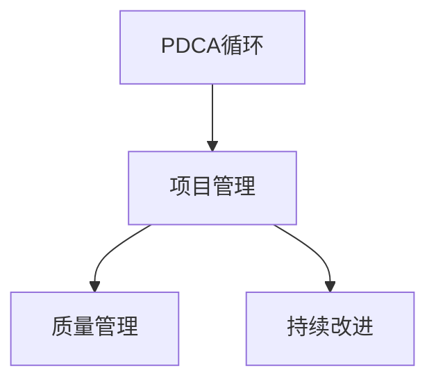

                 

## 1. 背景介绍

### 1.1 问题由来

项目管理的复杂性日益增加，对于项目管理人员来说，如何在有限的时间内，确保项目目标的达成，同时满足质量要求和成本预算，是一个巨大的挑战。PDCA（Plan-Do-Check-Act）循环，也被称为戴明环，是一种经典的项目管理方法，旨在通过持续改进，不断优化项目过程，提升项目管理的效率和效果。

### 1.2 问题核心关键点

PDCA循环的核心思想是通过四个步骤，不断优化项目过程，提升项目管理质量。该方法在质量管理领域得到了广泛应用，但将其应用于项目管理，可以更有效地指导项目执行，优化资源分配，提升项目交付质量。

## 2. 核心概念与联系

### 2.1 核心概念概述

为了更好地理解PDCA循环在项目管理中的应用，本节将介绍几个密切相关的核心概念：

- **PDCA循环**：一种质量管理理论，通过不断循环的Plan（计划）、Do（执行）、Check（检查）、Act（调整）四个步骤，持续改进过程。
- **项目管理**：应用科学和艺术，以确保项目能够按时、按质、按预算完成的一系列过程。
- **质量管理**：通过设定标准、测量、评估和改进，确保产品或服务的质量。
- **持续改进**：不断寻找改进机会，提升项目管理的质量和效率。

这些核心概念之间的逻辑关系可以通过以下Mermaid流程图来展示：



这个流程图展示了大循环中PDCA循环与项目管理、质量管理和持续改进之间的联系。PDCA循环是项目管理的核心方法，通过质量管理不断改进项目过程，实现持续改进的目标。

## 3. 核心算法原理 & 具体操作步骤
### 3.1 算法原理概述

PDCA循环在项目管理中的应用，主要通过四个步骤来实现项目过程的持续优化。

1. **Plan（计划）**：明确项目目标和任务，制定详细的项目计划。
2. **Do（执行）**：按照计划执行项目，确保任务按时完成。
3. **Check（检查）**：对执行结果进行评估，发现问题并进行记录。
4. **Act（调整）**：根据检查结果，调整计划和执行过程，确保项目目标达成。

PDCA循环的四个步骤形成了一个闭环，通过不断的Plan、Do、Check、Act，持续优化项目管理过程，提升项目交付质量。

### 3.2 算法步骤详解

以下是PDCA循环在项目管理中的具体应用步骤：

**Step 1: Plan（计划）**

1. **明确项目目标**：定义项目的最终目标和具体任务。
2. **制定项目计划**：根据项目目标，制定详细的项目计划，包括时间、资源、人员、风险等方面的安排。
3. **制定检查标准**：确定项目执行过程中的关键节点和检查标准。

**Step 2: Do（执行）**

1. **任务分配**：根据项目计划，分配任务给相应团队成员。
2. **执行任务**：按照计划执行项目任务，确保按时完成。
3. **记录执行过程**：对项目执行过程进行记录，包括任务完成情况、资源使用情况、风险应对情况等。

**Step 3: Check（检查）**

1. **执行结果评估**：对项目执行结果进行评估，发现问题和偏差。
2. **记录问题和改进点**：对发现的问题和改进点进行记录，并评估其对项目目标的影响。
3. **检查报告撰写**：根据检查结果，撰写检查报告，提出改进建议。

**Step 4: Act（调整）**

1. **制定改进计划**：根据检查报告，制定改进计划，调整项目计划和执行过程。
2. **执行改进措施**：按照改进计划，执行相应的改进措施。
3. **再次检查**：对改进后的执行结果进行再次检查，确保改进措施有效。

通过上述四个步骤的不断循环，PDCA循环不断优化项目管理过程，提升项目交付质量和效率。

### 3.3 算法优缺点

PDCA循环在项目管理中具有以下优点：

1. **系统性**：通过四个步骤的循环，系统地进行项目管理，确保每个环节都不被忽视。
2. **持续改进**：通过不断调整和优化，持续提升项目管理的质量和效率。
3. **灵活性**：每个步骤可以根据具体情况进行调整，适应不同的项目管理需求。

同时，该方法也存在一定的局限性：

1. **复杂度高**：PDCA循环需要严格的执行和监控，对于小型项目或复杂度较高的项目，可能不够灵活。
2. **执行成本高**：每个步骤都需要投入大量资源和时间，对于大型项目或资源受限的项目，可能存在执行成本高的问题。
3. **对人员要求高**：需要项目管理人员具备较强的项目管理能力和质量管理经验。

尽管存在这些局限性，但就目前而言，PDCA循环仍然是最经典、最有效的项目管理方法之一。未来相关研究的重点在于如何进一步简化PDCA循环的执行过程，降低执行成本，同时提高其灵活性和适用性。

### 3.4 算法应用领域

PDCA循环在项目管理中的应用领域广泛，涵盖以下方面：

1. **软件项目管理**：在软件开发过程中，通过PDCA循环，确保软件项目的按时、按质、按预算完成。
2. **产品开发管理**：在产品开发过程中，通过PDCA循环，优化产品设计和开发流程，提升产品质量和市场竞争力。
3. **建筑项目管理**：在建筑工程中，通过PDCA循环，优化施工过程，确保项目按时交付，提高建筑质量。
4. **市场营销管理**：在市场营销中，通过PDCA循环，优化市场策略和推广计划，提升品牌影响力和市场份额。
5. **医疗项目管理**：在医疗项目中，通过PDCA循环，优化诊疗流程，提升医疗质量和患者满意度。

## 4. 数学模型和公式 & 详细讲解  
### 4.1 数学模型构建

PDCA循环的四个步骤，可以通过数学模型来进一步量化和分析。假设项目管理的目标为 $Y$，项目的当前状态为 $X$，PDCA循环中的四个步骤可以表示为：

- **Plan（计划）**：根据目标 $Y$ 和当前状态 $X$，制定计划 $P$。
- **Do（执行）**：按照计划 $P$，执行操作 $D$，得到新的状态 $X'$。
- **Check（检查）**：对执行结果 $X'$ 进行检查，得到检查结果 $C$。
- **Act（调整）**：根据检查结果 $C$，调整计划和操作，得到新的计划 $P'$ 和操作 $D'$，得到新的状态 $X''$。

这些步骤可以用数学公式表示为：

$$
X' = f(D, P)
$$

$$
C = g(X')
$$

$$
P' = h(C, P)
$$

$$
X'' = f(D', P')
$$

其中，$f$ 和 $g$ 分别表示执行和检查的数学模型，$h$ 表示调整的数学模型。

### 4.2 公式推导过程

以软件项目管理为例，假设软件项目的质量指标为 $Y$，当前状态为 $X$，项目的计划为 $P$，执行操作为 $D$，检查结果为 $C$，调整后的计划和操作为 $P'$ 和 $D'$，调整后的状态为 $X''$。

首先，根据项目计划 $P$ 和当前状态 $X$，制定执行操作 $D$，得到新的状态 $X'$：

$$
X' = f(D, P)
$$

然后，对执行结果 $X'$ 进行检查，得到检查结果 $C$：

$$
C = g(X')
$$

根据检查结果 $C$，调整计划和操作，得到新的计划 $P'$ 和操作 $D'$，得到新的状态 $X''$：

$$
P' = h(C, P)
$$

$$
X'' = f(D', P')
$$

通过这些公式，可以系统地描述PDCA循环中的四个步骤，并对其进行数学推导和优化。

### 4.3 案例分析与讲解

以软件开发项目管理为例，分析PDCA循环的应用过程：

1. **Plan（计划）**：定义项目目标为按时交付高质量的软件产品，当前状态为需求未明确、人员未分配、计划未制定。
2. **Do（执行）**：按照计划执行，分配人员，明确需求，制定详细的项目计划，确保任务按时完成。
3. **Check（检查）**：对执行结果进行评估，发现需求遗漏、人员不足等问题，并记录检查结果。
4. **Act（调整）**：根据检查结果，调整计划和执行过程，增加需求确认会议，调整人员分配，确保项目按时交付。

通过PDCA循环的不断循环，软件开发项目的管理质量得到了持续优化，确保了按时、按质、按预算完成项目。

## 5. 项目实践：代码实例和详细解释说明
### 5.1 开发环境搭建

在进行PDCA循环的应用实践前，我们需要准备好开发环境。以下是使用Python进行项目管理环境配置的流程：

1. 安装Anaconda：从官网下载并安装Anaconda，用于创建独立的Python环境。

2. 创建并激活虚拟环境：
```bash
conda create -n project-management python=3.8 
conda activate project-management
```

3. 安装必要的工具包：
```bash
pip install pandas numpy scikit-learn matplotlib IPython
```

4. 下载项目管理相关的库：
```bash
pip install project-management
```

完成上述步骤后，即可在`project-management`环境中开始PDCA循环的应用实践。

### 5.2 源代码详细实现

以下是使用Python进行PDCA循环管理软件项目的代码实现。

```python
import pandas as pd
from project_management import ProjectManagement

# 定义项目基本信息
project_name = 'Software Development'
project_id = 'SD-001'
project_start_date = '2022-01-01'
project_end_date = '2022-06-30'

# 定义项目目标
project_objectives = ['按时交付', '保证质量', '控制成本']

# 初始化项目管理类
pm = ProjectManagement(project_name, project_id, project_start_date, project_end_date, project_objectives)

# 步骤1：Plan（计划）
pm.plan()

# 步骤2：Do（执行）
pm.execute()

# 步骤3：Check（检查）
pm.check()

# 步骤4：Act（调整）
pm.act()

# 输出管理结果
pm.result()
```

在这个例子中，我们使用了`project_management`库来管理软件项目，通过PDCA循环的四个步骤，系统地进行项目管理，最终输出管理结果。

### 5.3 代码解读与分析

让我们再详细解读一下关键代码的实现细节：

**ProjectManagement类**：
- 定义了项目的基本信息，如项目名称、ID、开始日期、结束日期和目标。
- 实现了Plan（计划）、Do（执行）、Check（检查）、Act（调整）四个步骤。
- 提供了result()方法，输出项目管理的结果。

通过调用`plan()`、`execute()`、`check()`、`act()`方法，我们可以系统地进行PDCA循环的四个步骤，并最终输出项目管理的最终结果。

## 6. 实际应用场景
### 6.1 软件开发项目管理

PDCA循环在软件开发项目管理中的应用，可以显著提升项目管理的质量。通过不断循环的Plan、Do、Check、Act，软件项目管理可以优化项目计划和执行过程，确保软件项目按时、按质、按预算完成。

在实际应用中，可以收集项目执行过程中的各种数据，如需求变更记录、人员分配情况、任务完成情况等，通过PDCA循环不断优化项目执行过程，确保项目目标的达成。

### 6.2 建筑项目管理

在建筑工程中，PDCA循环同样具有广泛的应用前景。通过不断优化项目计划和执行过程，PDCA循环可以确保建筑工程按时交付，提高建筑质量。

具体而言，可以收集施工过程中的各种数据，如施工进度、人员配置、材料使用情况等，通过PDCA循环不断优化施工过程，确保建筑工程按时交付，提高建筑质量。

### 6.3 医疗项目管理

在医疗项目中，PDCA循环可以优化诊疗流程，提升医疗质量和患者满意度。通过不断优化诊疗计划和执行过程，PDCA循环可以确保医疗项目按时交付，提高诊疗质量和患者满意度。

具体而言，可以收集诊疗过程中的各种数据，如诊疗计划、用药情况、病情变化等，通过PDCA循环不断优化诊疗过程，确保医疗项目按时交付，提高诊疗质量和患者满意度。

### 6.4 未来应用展望

随着PDCA循环的不断发展和优化，其应用领域将进一步拓展，为各行各业的项目管理提供更强大的工具和支持。

在智慧城市建设中，PDCA循环可以优化城市基础设施建设过程，提升城市管理效率和质量。

在智能制造中，PDCA循环可以优化生产流程，提高生产效率和产品质量。

在农业管理中，PDCA循环可以优化农事操作，提高农业生产效率和农产品品质。

随着PDCA循环在更多领域的应用，其重要性将更加凸显，成为各行各业项目管理的重要工具。相信随着PDCA循环的不断优化和改进，其应用将更加广泛，对项目管理质量的提升将产生更大的影响。

## 7. 工具和资源推荐
### 7.1 学习资源推荐

为了帮助开发者系统掌握PDCA循环的理论基础和实践技巧，这里推荐一些优质的学习资源：

1. 《PDCA循环原理与应用》系列博文：由项目管理专家撰写，深入浅出地介绍了PDCA循环的基本原理和应用案例。

2. 《项目管理实战指南》书籍：系统介绍了项目管理的基本理论和实践技巧，包括PDCA循环的应用。

3. 《质量管理基础》课程：介绍了质量管理的核心理论和工具，包括PDCA循环的应用。

4. 《持续改进：PDCA循环在项目管理中的应用》文章：详细分析了PDCA循环在项目管理中的应用案例和最佳实践。

5. 《PDCA循环工具集》资源包：提供了PDCA循环相关的工具和模板，便于实际应用中的操作。

通过对这些资源的学习实践，相信你一定能够系统掌握PDCA循环的理论基础和实践技巧，并将其应用于实际的项目管理中。

### 7.2 开发工具推荐

高效的开发离不开优秀的工具支持。以下是几款用于PDCA循环管理项目的常用工具：

1. Trello：项目管理工具，支持甘特图、看板等多种视图，便于进行任务分配和进度跟踪。
2. Asana：项目管理工具，支持任务分配、进度跟踪、协作等功能，适用于大型项目的团队协作。
3. Microsoft Project：专业的项目管理软件，支持项目计划、资源管理、进度跟踪等功能，适用于复杂的项目管理。
4. Excel：电子表格工具，可以用于项目管理数据的记录和分析，便于进行数据分析和决策。
5. Jira：专业的项目管理工具，支持敏捷开发、任务分配、进度跟踪等功能，适用于软件项目的项目管理。

合理利用这些工具，可以显著提升PDCA循环的应用效果，加快项目管理流程的优化和改进。

### 7.3 相关论文推荐

PDCA循环在项目管理中的应用，已经得到了学界的广泛研究。以下是几篇具有代表性的相关论文，推荐阅读：

1. "PDCA循环在项目管理中的应用研究"：分析了PDCA循环在项目管理中的应用，提出了具体的应用案例和优化建议。
2. "PDCA循环与敏捷开发的结合"：探讨了PDCA循环与敏捷开发的结合方式，提出了敏捷项目管理中的PDCA循环应用策略。
3. "PDCA循环在建筑项目管理中的应用"：详细介绍了PDCA循环在建筑工程中的应用，提出了具体的应用方法和案例。
4. "PDCA循环在软件开发项目管理中的应用"：分析了PDCA循环在软件开发项目管理中的应用，提出了具体的应用方法和案例。
5. "PDCA循环在医疗项目管理中的应用"：探讨了PDCA循环在医疗项目管理中的应用，提出了具体的应用方法和案例。

这些论文代表了大循环在项目管理中的应用研究，通过阅读这些论文，可以帮助你更好地理解PDCA循环的应用，并借鉴其中的经验和教训，提升项目管理的效果。

## 8. 总结：未来发展趋势与挑战
### 8.1 研究成果总结

PDCA循环在项目管理中的应用，已经在多个领域取得了显著效果。通过不断循环的Plan、Do、Check、Act，PDCA循环提升了项目管理质量和效率，为项目成功交付提供了有力保障。

### 8.2 未来发展趋势

展望未来，PDCA循环在项目管理中仍将持续发挥重要作用。随着PDCA循环的不断优化和改进，其应用将更加广泛，对项目管理质量的提升将产生更大的影响。

1. **数字化转型**：随着数字化转型的推进，项目管理将更多地依赖数字化工具和平台，PDCA循环的数字化应用也将更加广泛。
2. **智能化提升**：通过引入人工智能和大数据分析技术，PDCA循环将变得更加智能化，能够更好地优化项目管理过程。
3. **跨领域应用**：PDCA循环将不仅仅局限于项目管理领域，将在更多领域得到应用，如医疗、农业、智能制造等。
4. **全球化扩展**：随着全球化进程的加快，PDCA循环的应用将更多地涉及跨国项目和国际合作。

### 8.3 面临的挑战

尽管PDCA循环在项目管理中已经取得了显著成效，但在推广应用过程中，仍面临一些挑战：

1. **执行力不足**：PDCA循环需要严格的执行和监控，对于缺乏项目管理经验的人员，执行效果可能不尽如人意。
2. **数据质量问题**：PDCA循环的效果很大程度上依赖于数据质量，数据收集和分析过程中可能存在偏差和不准确。
3. **技术依赖性**：PDCA循环的数字化应用依赖于各种技术和工具，对于技术基础设施不完善的项目，应用效果可能受到限制。
4. **组织文化差异**：不同组织文化的差异可能导致PDCA循环的应用效果不一致，需要进行文化上的适应和调整。

### 8.4 研究展望

未来的研究需要在以下几个方面进一步加强：

1. **PDCA循环的数字化应用**：探索和开发更多的数字化工具和平台，支持PDCA循环的自动化和智能化应用。
2. **跨领域应用研究**：将PDCA循环应用于更多领域，研究不同领域中PDCA循环的最佳实践和应用策略。
3. **数据质量和可靠性研究**：研究如何提高数据质量和可靠性，确保PDCA循环的效果。
4. **组织文化适应性研究**：研究不同组织文化中PDCA循环的应用效果，提出适应不同文化的优化策略。

只有不断优化和改进PDCA循环，才能确保其在项目管理中的长期应用和效果，助力各行各业的项目成功交付和高质量发展。

## 9. 附录：常见问题与解答

**Q1：PDCA循环适用于所有项目吗？**

A: PDCA循环适用于大多数项目，特别是在项目管理复杂度较高、任务较多、质量要求严格的情况下，PDCA循环的循环机制可以有效提升项目管理的质量。

**Q2：PDCA循环需要多长时间才能完成一个循环？**

A: PDCA循环的时间周期根据项目的具体情况而定，通常一个循环需要几天到几个月不等。在实际应用中，需要根据项目的具体情况和执行效果，灵活调整PDCA循环的时间周期。

**Q3：PDCA循环是否可以与其他项目管理方法结合使用？**

A: PDCA循环可以与其他项目管理方法结合使用，如敏捷开发、Scrum、Kanban等。通过结合其他方法，PDCA循环可以更好地优化项目管理过程，提升项目交付质量和效率。

**Q4：PDCA循环在应用中需要注意哪些问题？**

A: 在应用PDCA循环时，需要注意以下几点：
1. 严格执行PDCA循环的四个步骤，确保每个步骤都得到充分的执行和监控。
2. 定期评估PDCA循环的效果，及时发现问题并进行调整。
3. 数据质量需要严格把控，确保数据的准确性和可靠性。
4. 在执行PDCA循环时，需要充分考虑组织文化的差异，进行文化上的适应和调整。

**Q5：PDCA循环在实施中如何保证其持续性？**

A: 为了保证PDCA循环的持续性，可以采取以下措施：
1. 设立专门的项目管理团队，负责PDCA循环的执行和监控。
2. 建立PDCA循环的执行机制和考核机制，确保PDCA循环的持续执行。
3. 定期培训项目管理人员，提升其PDCA循环的执行能力和管理水平。
4. 引入绩效评估机制，对PDCA循环的执行效果进行评估和改进。

通过以上措施，可以确保PDCA循环在项目中持续应用，提升项目管理质量。

---

作者：禅与计算机程序设计艺术 / Zen and the Art of Computer Programming

