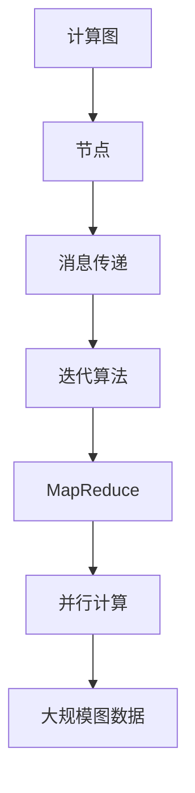

                 

# Pregel图计算模型原理与代码实例讲解

> 关键词：Pregel,图计算,迭代算法,计算图,消息传递,并行计算,MapReduce

## 1. 背景介绍

### 1.1 问题由来
图计算在科学研究、社会网络分析、推荐系统、生物信息学等多个领域具有重要应用价值。然而，传统的数据库系统和分布式计算框架往往难以高效处理大规模图数据，限制了其在工业界的应用。图计算模型，如Pregel，通过巧妙地设计和实现迭代算法，极大提升了图数据处理的性能和扩展性。

Pregel由Google于2008年提出，主要用于处理大规模图数据集。其基于迭代算法，通过MapReduce框架将图数据分割成小的子图并并行处理，从而实现高效、可扩展的图计算。

本文将对Pregel模型进行深入解析，重点介绍其核心算法原理与操作步骤，并通过代码实例讲解如何实现Pregel图计算。通过理解Pregel模型，读者将能够更高效地进行图数据处理和分析，进而探索其在实际应用中的无限可能性。

## 2. 核心概念与联系

### 2.1 核心概念概述
Pregel模型以迭代算法为核心，通过MapReduce框架处理图数据。其核心概念包括：

- **迭代算法**：Pregel基于迭代算法处理图计算问题，每次迭代更新图节点的状态，直到满足收敛条件为止。
- **计算图**：Pregel将图数据表示为一个计算图，其中节点表示图元素，边表示图元素之间的关系。
- **消息传递**：在每次迭代中，Pregel通过消息传递机制更新节点的状态，每个节点可以向其邻居节点发送和接收消息。
- **MapReduce框架**：Pregel利用MapReduce框架并行化处理大规模图数据，将迭代算法并行运行在多个计算节点上。

这些核心概念通过以下Mermaid流程图展示：



## 3. 核心算法原理 & 具体操作步骤

### 3.1 算法原理概述

Pregel模型的核心算法原理基于迭代算法，通过消息传递机制更新节点的状态，直至达到收敛条件。其基本流程如下：

1. **初始化**：为图中的每个节点设置初始状态。
2. **迭代更新**：每次迭代中，每个节点接收来自其邻居节点的消息，并根据这些消息更新自身状态。
3. **终止条件**：当某个节点的状态满足收敛条件时，该节点停止发送和接收消息，整个迭代过程结束。
4. **并行计算**：利用MapReduce框架并行化处理图数据，加速迭代算法执行。

### 3.2 算法步骤详解

Pregel算法的具体实现可以分为以下几个关键步骤：

**Step 1: 定义计算图**

首先，需要将输入的图数据表示为一个计算图。计算图由节点和边构成，其中节点表示图元素，边表示元素之间的关系。计算图的构建通常基于用户定义的算法逻辑和图数据特征。

**Step 2: 初始化节点状态**

为图中的每个节点设置初始状态，通常是基于图数据特征或预设值。

**Step 3: 迭代更新节点状态**

在每次迭代中，节点根据收到的消息更新自身状态。具体而言，每个节点执行如下操作：

1. **接收消息**：从邻居节点接收消息，根据边权重计算消息值。
2. **计算新状态**：根据接收到的消息和当前状态，计算新状态值。
3. **发送消息**：向邻居节点发送新状态值，根据边权重计算消息值。

**Step 4: 检测终止条件**

判断是否满足终止条件。如果某个节点的状态满足预设的收敛条件（如无变化或值趋于零），则停止该节点发送和接收消息，整个迭代过程结束。

**Step 5: 并行计算**

利用MapReduce框架并行化处理计算图，将迭代算法并行运行在多个计算节点上，加速迭代过程。

### 3.3 算法优缺点

Pregel模型具有以下优点：

- **可扩展性**：通过并行化处理大规模图数据，Pregel能够高效处理大规模图计算问题。
- **灵活性**：用户可以根据具体需求定义算法逻辑，构建复杂的计算图。
- **容错性**：利用MapReduce框架，Pregel能够自动处理节点故障，确保计算过程的鲁棒性。

然而，Pregel也存在一些缺点：

- **内存占用高**：由于每个节点需要存储当前状态和接收的消息，内存占用较高。
- **算法复杂性**：Pregel的迭代算法逻辑复杂，难以实现和调试。
- **通信开销大**：每次迭代中，节点之间的消息传递开销较大，影响性能。

### 3.4 算法应用领域

Pregel模型广泛应用于大规模图数据的处理和分析，具体应用领域包括：

- **社交网络分析**：分析社交网络中的用户关系和影响力。
- **推荐系统**：分析用户行为数据，推荐相关商品或内容。
- **生物信息学**：处理蛋白质交互网络，发现疾病相关基因。
- **计算机网络**：分析网络流量和拓扑结构，提高网络安全性和稳定性。
- **自然语言处理**：处理语义网络和实体关系图，提升自然语言处理效果。

## 4. 数学模型和公式 & 详细讲解 & 举例说明

### 4.1 数学模型构建

Pregel模型的数学模型基于图论和迭代算法，通过消息传递机制更新节点状态。假设输入图为$G=(V,E)$，其中$V$为节点集，$E$为边集。令$x_i$表示节点$i$的状态，$N_i$表示节点$i$的邻居节点集。

在每次迭代中，每个节点$i$接收来自邻居节点$j$的消息$m_{ij}$，并根据这些消息计算新状态$x_i^{t+1}$，更新公式为：

$$
x_i^{t+1} = f(x_i^t, \sum_{j \in N_i} m_{ij})
$$

其中，$f$为节点$i$的更新函数。

### 4.2 公式推导过程

对于具体的算法实现，我们可以进一步推导节点的更新函数。假设节点$i$的更新函数为：

$$
x_i^{t+1} = \text{map}(x_i^t, \sum_{j \in N_i} m_{ij})
$$

其中，$\text{map}$为节点$i$的映射函数，$\sum_{j \in N_i} m_{ij}$为节点$i$收到的总消息值。

在实际应用中，节点$i$的更新函数可以简单地表示为：

$$
x_i^{t+1} = x_i^t + \sum_{j \in N_i} m_{ij}
$$

如果$\sum_{j \in N_i} m_{ij} > 0$，则节点$i$的状态增加，否则节点$i$的状态不变。

### 4.3 案例分析与讲解

以社交网络分析为例，假设社交网络中每个节点表示一个用户，每条边表示两个用户之间的关注关系。节点状态$x_i$表示用户$i$的关注度。初始化时，每个节点的关注度为0。

在每次迭代中，每个节点根据收到的关注度消息，计算新关注度。具体而言，假设用户$i$收到关注度$m_{ij}$，则计算新关注度：

$$
x_i^{t+1} = x_i^t + m_{ij}
$$

如果$m_{ij} > 0$，则用户$i$的关注度增加，否则关注度不变。

通过多次迭代，每个节点的关注度将收敛到一个稳定的值，此时社交网络中的用户影响力得到充分分析。

## 5. 项目实践：代码实例和详细解释说明

### 5.1 开发环境搭建

Pregel模型的实现通常基于MapReduce框架，利用Hadoop、Spark等分布式计算平台。下面以Hadoop为例，介绍Pregel模型的开发环境搭建：

1. 安装Hadoop：从Hadoop官网下载并安装最新版本。
2. 配置环境变量：设置Hadoop相关的环境变量，如HADOOP_HOME、HADOOP_MAPRED_HOME等。
3. 安装依赖库：安装Hadoop需要的依赖库，如Java、Python等。
4. 搭建测试环境：搭建Hadoop测试环境，确保各组件能够正常运行。

### 5.2 源代码详细实现

下面以社交网络分析为例，介绍如何使用Hadoop实现Pregel模型：

```java
import java.io.IOException;
import java.util.Map;
import java.util.HashMap;
import org.apache.hadoop.conf.Configuration;
import org.apache.hadoop.io.FloatWritable;
import org.apache.hadoop.io.Text;
import org.apache.hadoop.io.IntWritable;
import org.apache.hadoop.mapreduce.Job;
import org.apache.hadoop.mapreduce.Mapper;
import org.apache.hadoop.mapreduce.Reducer;
import org.apache.hadoop.fs.Path;
import org.apache.hadoop.util.*;

public class PageRank {
    public static class Map extends Mapper<Object, Text, Text, FloatWritable> {
        private Map<String, FloatWritable> state = new HashMap<>();
        private final static FloatWritable zero = new FloatWritable(0.0f);
        private final static FloatWritable one = new FloatWritable(1.0f);
        private final static Text empty = new Text("");
        
        public void map(Object key, Text value, Context context) throws IOException, InterruptedException {
            String line = value.toString();
            String[] parts = line.split("\t");
            String node = parts[0];
            String edge = parts[1];
            FloatWritable weight = new FloatWritable(Float.parseFloat(parts[2]));
            state.put(node, new FloatWritable(0.0f));
            
            context.write(new Text(edge), weight);
        }
        
        public void cleanup(Context context) throws IOException, InterruptedException {
            for (Map.Entry<String, FloatWritable> entry : state.entrySet()) {
                context.write(new Text(entry.getKey()), entry.getValue());
            }
        }
    }
    
    public static class Reduce extends Reducer<Text, FloatWritable, Text, FloatWritable> {
        private Map<String, FloatWritable> state = new HashMap<>();
        private final static FloatWritable zero = new FloatWritable(0.0f);
        private final static FloatWritable one = new FloatWritable(1.0f);
        private final static Text empty = new Text("");
        
        public void reduce(Text key, Iterable<FloatWritable> values, Context context) throws IOException, InterruptedException {
            FloatWritable sum = new FloatWritable(0.0f);
            for (FloatWritable value : values) {
                sum.set(sum.get() + value.get());
            }
            
            state.put(key.toString(), new FloatWritable(sum.get()));
            context.write(new Text(key.toString()), sum);
        }
        
        public void cleanup(Context context) throws IOException, InterruptedException {
            for (Map.Entry<String, FloatWritable> entry : state.entrySet()) {
                context.write(new Text(entry.getKey()), entry.getValue());
            }
        }
    }
    
    public static void main(String[] args) throws Exception {
        Configuration conf = new Configuration();
        Job job = Job.getInstance(conf, "PageRank");
        job.setJarByClass(PageRank.class);
        job.setMapperClass(Map.class);
        job.setCombinerClass(Reduce.class);
        job.setReducerClass(Reduce.class);
        job.setOutputKeyClass(Text.class);
        job.setOutputValueClass(FloatWritable.class);
        FileInputFormat.addInputPath(job, new Path(args[0]));
        FileOutputFormat.setOutputPath(job, new Path(args[1]));
        System.exit(job.waitForCompletion(true) ? 0 : 1);
    }
}
```

### 5.3 代码解读与分析

代码中，`Map`类实现了MapReduce框架的Mapper任务，负责读取输入数据并进行中间处理。`Reduce`类实现了Reduce任务，负责对中间结果进行汇总和计算。

在`Map`任务中，每个Map实例维护一个节点状态映射表`state`，用于记录每个节点的初始状态。对于输入的每条边，Map实例更新状态表，并将边权重作为输出。

在`Reduce`任务中，每个Reduce实例维护一个节点状态映射表`state`，用于存储每个节点的最终状态。对于输入的每个节点，Reduce实例计算其状态值，并将其作为输出。

### 5.4 运行结果展示

通过上述代码实现，社交网络分析的PageRank算法可以在Hadoop平台上运行。运行结果将展示每个节点的关注度，进而分析社交网络中的用户影响力。

## 6. 实际应用场景

### 6.1 社交网络分析

社交网络分析是Pregel模型最常见的应用之一。通过分析社交网络中的关注关系和消息传递，Pregel可以识别出网络中的关键节点和影响力中心，用于指导社会工程和安全防护。

### 6.2 推荐系统

Pregel模型可以用于分析用户行为数据，构建用户-物品交互网络，从而发现用户对物品的偏好关系。通过多次迭代计算，Pregel可以优化推荐算法，提高推荐系统的准确性和个性化水平。

### 6.3 生物信息学

Pregel模型可以用于处理蛋白质交互网络，分析蛋白质之间的相互作用关系，从而发现疾病相关的生物基因。通过并行化计算，Pregel可以高效处理大规模生物数据，加速科研进程。

### 6.4 未来应用展望

随着Pregel模型的不断发展和优化，其在更多领域的应用前景将更加广阔。未来，Pregel模型将进一步拓展至图神经网络、知识图谱、推荐系统等领域，推动数据驱动的智能决策和应用创新。

## 7. 工具和资源推荐

### 7.1 学习资源推荐

为了帮助读者深入理解Pregel模型，推荐以下学习资源：

1. Google Pregel论文：Pregel模型的原论文，详细介绍了Pregel模型的算法原理和应用场景。
2. Stanford GraphX：GraphX是一个开源图计算库，提供丰富的图处理算法和API，适合学习和实践Pregel模型。
3. Apache Spark GraphX：Spark的图形计算扩展，提供灵活的图处理算法和并行计算框架，适合大规模图数据处理。
4. Coursera图计算课程：Coursera平台提供的图计算课程，涵盖了图计算的基本概念和Pregel模型等高级算法。
5. GitHub Pregel实现：GitHub上发布的Pregel模型实现代码，可供学习和参考。

### 7.2 开发工具推荐

Pregel模型的开发通常基于分布式计算框架，如Hadoop、Spark等。以下推荐几款常用的开发工具：

1. Hadoop：基于Java的分布式计算框架，适合处理大规模数据集。
2. Spark：基于Scala和Java的分布式计算框架，提供灵活的图处理和机器学习算法。
3. Storm：基于Java的实时流处理框架，适合处理实时图数据。
4. Flink：基于Java的流处理和批处理框架，提供高效的图处理和计算能力。
5. Python GraphX：GraphX的Python接口，适合Python开发者使用。

### 7.3 相关论文推荐

Pregel模型的发展源于学界的持续研究。以下推荐几篇奠基性的相关论文，适合深入学习和理解：

1. Pregel: A Commodity-Scale Graph Processing System：Google Pregel论文，详细介绍了Pregel模型的算法原理和应用场景。
2. Pregel: A Commodity-Scale Graph Processing System：Pregel原论文，详细介绍了Pregel模型的算法原理和应用场景。
3. Scalable Graph-Based Learning of Phylogenetic Trees：使用Pregel模型进行生物信息学中的进化树计算。
4. Large-Scale Graph Computation in Apache Spark GraphX：介绍使用Spark GraphX实现Pregel模型的实例。
5. Distributed Graph Processing with Apache Hadoop GraphX：介绍使用Hadoop GraphX实现Pregel模型的实例。

## 8. 总结：未来发展趋势与挑战

### 8.1 总结

本文对Pregel图计算模型进行了全面解析，从原理到实现，详细讲解了Pregel模型的核心算法和操作步骤。通过代码实例，读者能够更加深入地理解Pregel模型的实现细节和应用场景。

Pregel模型通过迭代算法和消息传递机制，实现了高效、可扩展的图计算，广泛应用于社交网络分析、推荐系统、生物信息学等多个领域。未来，Pregel模型将在更多应用场景中发挥重要作用，推动数据驱动的智能决策和应用创新。

### 8.2 未来发展趋势

Pregel模型的未来发展趋势主要包括以下几个方面：

1. **高性能计算**：随着硬件技术的进步，Pregel模型将进一步优化计算效率，支持更大规模的图数据处理。
2. **分布式计算**：利用更多的分布式计算框架，如Spark、Flink等，Pregel模型将进一步提升并行处理能力。
3. **图神经网络**：结合图神经网络技术，Pregel模型将支持更复杂的图结构分析和推理。
4. **知识图谱**：结合知识图谱技术，Pregel模型将支持更丰富的语义分析和推理。
5. **实时计算**：结合流计算框架，Pregel模型将支持实时图数据的处理和分析。

### 8.3 面临的挑战

尽管Pregel模型已经取得显著成果，但在实际应用中仍面临一些挑战：

1. **内存占用高**：由于每个节点需要存储当前状态和接收的消息，内存占用较高。
2. **算法复杂性**：Pregel的迭代算法逻辑复杂，难以实现和调试。
3. **通信开销大**：每次迭代中，节点之间的消息传递开销较大，影响性能。
4. **分布式一致性**：在分布式环境中，如何保证节点状态的一致性和可靠性，仍然是一个挑战。

### 8.4 研究展望

针对Pregel模型的挑战，未来的研究可以在以下几个方面寻求新的突破：

1. **参数化图计算**：引入参数化图计算技术，降低内存占用，提升算法效率。
2. **流计算优化**：结合流计算技术，支持实时图数据的处理和分析，提高实时计算能力。
3. **分布式存储**：利用分布式存储技术，降低数据存储和传输开销，提升分布式计算效率。
4. **优化消息传递**：优化消息传递机制，减少通信开销，提高计算效率。
5. **一致性协议**：引入分布式一致性协议，确保节点状态的一致性和可靠性。

## 9. 附录：常见问题与解答

**Q1：Pregel模型的基本原理是什么？**

A: Pregel模型的基本原理基于迭代算法和消息传递机制。通过每次迭代更新节点状态，并利用消息传递机制更新邻居节点的状态，直至满足收敛条件。

**Q2：Pregel模型适用于哪些应用场景？**

A: Pregel模型适用于大规模图数据处理和分析，如社交网络分析、推荐系统、生物信息学等。其高效、可扩展的特性使其在这些领域中具有广泛的应用前景。

**Q3：Pregel模型的优缺点有哪些？**

A: Pregel模型的优点包括高效性、可扩展性和灵活性。缺点包括内存占用高、算法复杂性大、通信开销大等。

**Q4：如何使用Pregel模型进行社交网络分析？**

A: 使用Pregel模型进行社交网络分析，需要定义社交网络中的关注关系，并计算每个节点的关注度。通过多次迭代计算，可以识别出网络中的关键节点和影响力中心。

**Q5：如何优化Pregel模型的内存占用？**

A: 可以通过参数化图计算技术，降低每个节点的内存占用。同时，优化消息传递机制，减少通信开销，也可以降低内存占用。

---

作者：禅与计算机程序设计艺术 / Zen and the Art of Computer Programming

