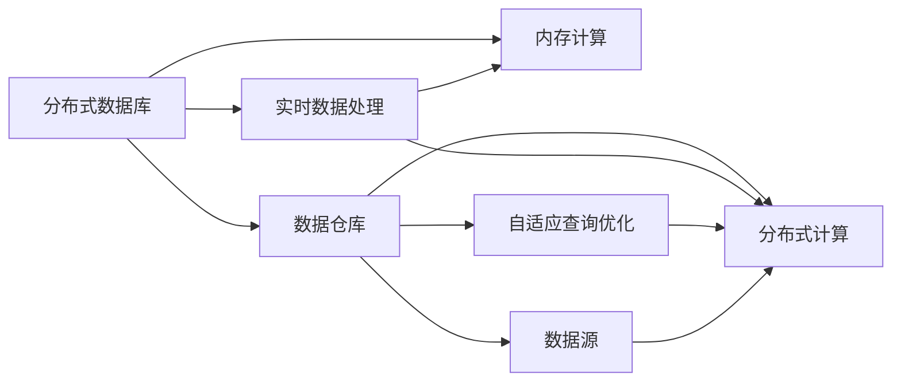

                 

# Presto原理与代码实例讲解

> 关键词：Presto, 分布式数据库, 数据仓库, 实时数据处理, 数据集成, 分布式计算, 开源数据库, 代码实例

## 1. 背景介绍

### 1.1 问题由来

在当今大数据时代，企业需要处理的数据量呈指数级增长。传统的数据处理系统，如关系型数据库，已经无法满足高吞吐量、高实时性、海量数据存储的需求。分布式数据库系统，如Apache Hive、Apache Flink等，虽然在处理大规模数据方面表现出色，但它们往往难以满足企业在数据采集、存储、计算、分析等各个环节的实时性需求。

与此同时，数据仓库的建设也面临着众多挑战。数据仓库是一个复杂的数据处理系统，需要支持高复杂度的数据查询、多维分析、联机分析等任务。传统的ETL（Extract-Transform-Load）流程在数据量增大的情况下，不仅效率低下，而且容易产生数据一致性和完整性的问题。

为了应对这些挑战，Apache Presto应运而生。Presto是一个开源的分布式数据库系统，旨在提供一种高效、灵活、易于使用的大数据处理方案，支持大规模数据的实时处理和复杂查询分析。Presto基于内存和分布式计算架构，可以在高并发、低延迟的条件下，提供快速的查询响应和数据处理能力。

### 1.2 问题核心关键点

Presto的核心概念和关键技术包括以下几点：

- 分布式计算：Presto基于分布式计算架构，支持在多台计算机上并行处理大规模数据。每个节点负责处理一部分数据，并将处理结果合并起来，大大提升了数据处理的效率和可靠性。

- 内存计算：Presto采用内存计算模式，将数据缓存在内存中，加快了查询速度。同时，通过合理的内存使用策略，确保内存不溢出。

- 实时数据处理：Presto支持实时数据流处理，能够实时更新数据仓库中的数据。通过流式查询和事件驱动架构，确保数据处理的实时性和一致性。

- 无状态架构：Presto采用无状态架构，每个查询在执行时都从数据源中读取数据，不会受到之前查询的影响。这种架构大大提升了查询的灵活性和可扩展性。

- 自适应查询优化：Presto采用基于统计的查询优化器，可以根据数据分布和查询模式，动态调整查询计划，优化查询性能。

- 丰富的数据源支持：Presto支持多种数据源，包括关系型数据库、非关系型数据库、文件系统、分布式文件系统等，能够满足企业在数据存储和查询分析方面的多样化需求。

这些核心概念和关键技术共同构成了Presto的强大能力，使其能够在高并发、高实时性、海量数据的场景中，提供高效、灵活、可靠的数据处理解决方案。

## 2. 核心概念与联系

### 2.1 核心概念概述

为了更好地理解Presto的核心概念和原理，本节将介绍几个密切相关的核心概念及其之间的联系：

- 分布式数据库：分布式数据库系统是指将数据分布在多个节点上进行处理，各节点之间通过网络通信，协同工作以完成数据处理任务。

- 数据仓库：数据仓库是一种集中存储企业业务数据的数据库系统，旨在支持企业的数据查询、分析和管理需求。数据仓库通过ETL流程将原始数据抽取、清洗、转换和加载到仓库中，并提供一致性的数据视图。

- 实时数据处理：实时数据处理是指在数据生成后，能够实时、不间断地对其进行分析和处理。实时数据处理系统能够快速响应用户请求，提供准确的实时数据视图。

- 内存计算：内存计算是指将数据缓存在内存中进行计算，能够提高数据处理的效率和速度。内存计算适用于高并发、低延迟的应用场景。

- 分布式计算：分布式计算是指将数据分布在多个节点上进行处理，各节点之间通过网络通信，协同工作以完成数据处理任务。

- 自适应查询优化：自适应查询优化是指基于统计和模型的方法，动态调整查询计划，优化查询性能。

这些核心概念之间的联系如图1所示：



图1：Presto核心概念联系图

## 3. 核心算法原理 & 具体操作步骤
### 3.1 算法原理概述

Presto的核心算法原理主要包括分布式计算、内存计算和自适应查询优化三个方面：

- 分布式计算：Presto基于分布式计算架构，支持在多台计算机上并行处理大规模数据。每个节点负责处理一部分数据，并将处理结果合并起来，大大提升了数据处理的效率和可靠性。

- 内存计算：Presto采用内存计算模式，将数据缓存在内存中，加快了查询速度。同时，通过合理的内存使用策略，确保内存不溢出。

- 自适应查询优化：Presto采用基于统计的查询优化器，可以根据数据分布和查询模式，动态调整查询计划，优化查询性能。

### 3.2 算法步骤详解

Presto的算法步骤主要包括以下几个方面：

**Step 1: 数据存储与分布**

- 将数据存储在分布式文件系统（如HDFS、S3）中，并根据数据大小和分布情况，将其划分为多个分片。
- 将数据分片部署到多个节点上进行处理。

**Step 2: 数据读取与转换**

- 根据查询请求，将需要处理的数据分片读取到内存中。
- 使用转换操作对数据进行处理，生成中间结果。

**Step 3: 数据计算与合并**

- 对中间结果进行分布式计算，得到最终结果。
- 将各节点的计算结果进行合并，得到最终的查询结果。

**Step 4: 查询优化与执行**

- 使用自适应查询优化器，根据数据分布和查询模式，动态调整查询计划，优化查询性能。
- 根据优化后的查询计划，将查询请求提交到分布式计算系统中执行。

**Step 5: 结果返回与存储**

- 将查询结果返回给客户端，或直接存储在数据仓库中。

### 3.3 算法优缺点

Presto的核心算法具有以下优点：

- 高并发处理能力：Presto采用分布式计算架构，支持高并发数据处理，能够同时处理大量数据请求。

- 高效内存计算：Presto采用内存计算模式，能够快速处理大规模数据，并提供低延迟的查询响应。

- 灵活查询优化：Presto采用自适应查询优化器，能够根据数据分布和查询模式，动态调整查询计划，优化查询性能。

- 丰富的数据源支持：Presto支持多种数据源，包括关系型数据库、非关系型数据库、文件系统等，能够满足企业在数据存储和查询分析方面的多样化需求。

Presto的缺点主要包括：

- 内存使用限制：由于内存计算模式，Presto对内存使用有较高要求，无法处理过于庞大的数据集。

- 不适合复杂查询：对于复杂的联机分析查询，Presto的处理效率可能不如传统的关系型数据库。

### 3.4 算法应用领域

Presto的应用领域广泛，主要包括以下几个方面：

- 数据仓库：Presto可以用于构建数据仓库，支持企业的数据查询、分析和管理需求。

- 实时数据处理：Presto可以用于实时数据处理，支持对海量数据进行实时分析、计算和处理。

- 大数据分析：Presto可以用于大数据分析，支持对大规模数据进行复杂查询和统计分析。

- 数据集成：Presto可以用于数据集成，支持将多个数据源的数据进行整合和统一。

- 分布式计算：Presto可以用于分布式计算，支持在多台计算机上并行处理大规模数据。

Presto在各个领域的应用，使得企业能够高效、灵活地处理和分析数据，为企业的数字化转型和业务创新提供了有力的支持。

## 4. 数学模型和公式 & 详细讲解 & 举例说明

### 4.1 数学模型构建

Presto的核心算法原理可以通过数学模型进行描述。以下是一个基本的数学模型，用于描述Presto的分布式计算过程：

设$D$为数据集，$N$为数据集的大小，$P$为节点数量，$S$为每个节点处理的样本数量，则分布式计算过程可以表示为：

$$
D = \{d_1, d_2, ..., d_N\} \\
P = \{p_1, p_2, ..., p_P\} \\
D_p = \{d_1, d_2, ..., d_S\}
$$

其中，$D_p$表示节点$p$处理的数据样本集。

### 4.2 公式推导过程

为了更好地理解Presto的核心算法原理，下面对数学模型进行详细推导。

首先，将数据集$D$划分为$P$个样本集$D_p$，每个样本集的大小为$S$，满足$S < N/P$。

其次，每个节点$p$将数据样本集$D_p$进行处理，生成中间结果$R_p$。

最后，将各节点的中间结果$R_p$进行合并，得到最终的查询结果$R$。

### 4.3 案例分析与讲解

为了更好地理解Presto的核心算法原理，下面通过一个具体的案例进行讲解。

假设有一个包含1000万条记录的数据集，需要对其进行查询分析。该数据集被划分为100个样本集，每个样本集大小为10万条记录。将这100个样本集分布到100个节点上进行处理，每个节点处理1万条记录。

节点1处理数据样本集$D_1 = \{d_1, d_2, ..., d_{10}\}$，得到中间结果$R_1$。

节点2处理数据样本集$D_2 = \{d_{11}, d_{12}, ..., d_{20}\}$，得到中间结果$R_2$。

...

节点100处理数据样本集$D_{100} = \{d_{91}, d_{92}, ..., d_{100}\}$，得到中间结果$R_{100}$。

最后，将各节点的中间结果$R_1, R_2, ..., R_{100}$进行合并，得到最终的查询结果$R$。

## 5. 项目实践：代码实例和详细解释说明

### 5.1 开发环境搭建

在进行Presto实践前，我们需要准备好开发环境。以下是使用Python进行Presto开发的环境配置流程：

1. 安装Java：从官网下载并安装Java Runtime Environment (JRE)，用于运行Presto的JVM。

2. 安装Hadoop：从官网下载并安装Apache Hadoop，用于存储和管理数据。

3. 安装Presto：从官网下载并安装Apache Presto，并将其部署到Hadoop集群中。

4. 安装Presto客户端：使用Python安装Presto的客户端库PrestoClient，用于进行数据查询和操作。

5. 安装PyHive：使用Python安装PyHive，用于连接Hive数据仓库，并使用Presto进行查询。

完成上述步骤后，即可在Hadoop集群上启动Presto，并通过Python客户端进行数据查询和操作。

### 5.2 源代码详细实现

下面我们以Presto的分布式计算为例，给出使用PrestoClient进行数据查询的Python代码实现。

首先，连接Hadoop集群和Presto集群，并设置Presto的查询接口：

```python
from presto import PrestoClient

# 连接Hadoop集群和Presto集群
presto_client = PrestoClient(hosts='localhost:9090')
```

然后，定义Presto查询语句，并进行查询操作：

```python
# 查询数据集D的大小
query = "SELECT COUNT(*) FROM D;"
result = presto_client.execute(query)
print(result)
```

接着，将查询结果保存到文件中：

```python
# 保存查询结果到文件中
with open('result.txt', 'w') as f:
    f.write(result)
```

最后，结束Presto客户端连接：

```python
presto_client.close()
```

### 5.3 代码解读与分析

让我们再详细解读一下关键代码的实现细节：

**PrestoClient类**：
- `connect`方法：连接Hadoop集群和Presto集群，返回PrestoClient对象。
- `execute`方法：执行Presto查询语句，返回查询结果。
- `close`方法：关闭Presto客户端连接。

**Presto查询语句**：
- `SELECT COUNT(*) FROM D;`：查询数据集D的大小，即返回D中的记录数。

**结果保存**：
- 使用Python的`open`函数将查询结果保存到文件中，以便后续分析和处理。

可以看到，使用PrestoClient进行数据查询操作，代码实现相对简单，仅需要连接集群、执行查询、保存结果等基本操作，即可快速完成数据查询。

## 6. 实际应用场景

### 6.1 智慧城市

智慧城市是一个庞大的工程，需要集成各种传感器、设备和系统，进行实时监控和数据分析。Presto可以用于构建智慧城市的数据仓库，支持实时数据处理和复杂查询分析，为智慧城市的建设和管理提供有力支持。

在智慧城市中，Presto可以用于监控城市交通、环境、安全等各个方面，提供实时数据视图和分析报告。例如，Presto可以实时监控交通流量、空气质量、犯罪事件等数据，分析其变化趋势，预测未来情况，为城市管理提供决策依据。

### 6.2 金融行业

金融行业的数据量巨大，需要实时处理和分析海量数据。Presto可以用于构建金融行业的数据仓库，支持实时数据处理和复杂查询分析，为金融业务的运营和管理提供支持。

在金融行业，Presto可以用于实时处理交易数据、市场数据、客户数据等，进行实时分析和预警。例如，Presto可以实时监控市场行情，分析交易数据，预测市场趋势，为投资者提供决策依据。

### 6.3 互联网企业

互联网企业的数据量庞大，需要实时处理和分析海量数据。Presto可以用于构建互联网企业的数据仓库，支持实时数据处理和复杂查询分析，为业务运营和数据分析提供支持。

在互联网企业中，Presto可以用于实时处理用户行为数据、广告数据、运营数据等，进行实时分析和优化。例如，Presto可以实时监控用户行为，分析广告效果，优化广告投放策略，提高广告效果。

### 6.4 未来应用展望

随着Presto的不断发展，未来的应用场景将会更加广泛，主要包括以下几个方面：

- 数据湖：Presto可以用于构建数据湖，支持对海量数据的存储、查询和分析。

- 实时流处理：Presto可以用于实时流处理，支持对实时数据进行实时分析和处理。

- 数据集成：Presto可以用于数据集成，支持将多个数据源的数据进行整合和统一。

- 分布式计算：Presto可以用于分布式计算，支持在多台计算机上并行处理大规模数据。

- 人工智能：Presto可以与人工智能技术结合，支持对海量数据进行深度学习和数据挖掘。

总之，Presto作为一款开源的分布式数据库系统，其高效、灵活、易于使用的特性，将使其在未来的数字化转型中发挥重要作用。

## 7. 工具和资源推荐

### 7.1 学习资源推荐

为了帮助开发者系统掌握Presto的理论基础和实践技巧，这里推荐一些优质的学习资源：

1. Presto官方文档：Presto官方文档提供了全面的API和SDK参考，以及丰富的使用示例，是上手Presto的最佳资料。

2. Apache Hadoop官方文档：Hadoop是Presto的底层平台，了解Hadoop的架构和使用方法，对Presto的应用具有重要的参考价值。

3. Apache Spark官方文档：Spark是Presto的合作项目，了解Spark的分布式计算原理和用法，对Presto的分布式计算有重要的参考价值。

4. Python相关文档：Python是Presto客户端的开发语言，掌握Python的语法和库的使用，对Presto客户端的开发具有重要的参考价值。

5. Presto社区：Presto社区是一个活跃的开发社区，提供了丰富的资源和讨论，可以与开发者交流经验，获取最新进展。

通过对这些资源的学习实践，相信你一定能够快速掌握Presto的核心技术，并用于解决实际的业务问题。

### 7.2 开发工具推荐

高效的开发离不开优秀的工具支持。以下是几款用于Presto开发的常用工具：

1. Eclipse：Eclipse是一个流行的IDE，支持Python、Java等多种语言的开发，可以用于Presto客户端的开发。

2. PyCharm：PyCharm是一个Python IDE，支持Python语言的开发和调试，可以用于Presto客户端的开发。

3. Hadoop生态工具：Hadoop生态工具包括HDFS、YARN、Hive等，可以与Presto无缝集成，用于数据的存储、处理和管理。

4. Spark生态工具：Spark生态工具包括Spark Core、Spark SQL、Spark Streaming等，可以与Presto无缝集成，用于数据的分布式计算和流处理。

5. Jupyter Notebook：Jupyter Notebook是一个开源的交互式笔记本，可以用于数据分析和可视化，与Presto结合使用，可以进行数据探索和分析。

合理利用这些工具，可以显著提升Presto开发的效率和质量，加快创新的迭代步伐。

### 7.3 相关论文推荐

Presto作为一款快速发展的开源项目，其研究和实践成果也得到了学界的广泛关注。以下是几篇奠基性的相关论文，推荐阅读：

1. Presto: A Distributed SQL Engine for Big Data: 介绍Presto的架构和设计，描述了Presto的核心技术原理和应用场景。

2. Apache Presto: 介绍Presto的特点和优势，描述了Presto在分布式计算、内存计算和查询优化等方面的应用。

3. Data查询优化和执行: 介绍Presto的查询优化和执行机制，描述了Presto在查询优化和性能调优方面的技术实现。

4. Streaming Data Processing with Apache Flink: 介绍Flink的流处理机制和应用，描述了Flink与Presto的协同工作方式，以及数据流的存储和处理。

5. Spark Streaming and Presto: 介绍Spark Streaming和Presto的集成，描述了Spark Streaming与Presto的协同工作方式，以及数据流的存储和处理。

这些论文代表了大数据处理领域的最新进展，对于理解Presto的技术细节和应用场景，具有重要的参考价值。

## 8. 总结：未来发展趋势与挑战

### 8.1 总结

本文对Presto的核心算法原理和实践技巧进行了全面系统的介绍。首先阐述了Presto的研究背景和意义，明确了Presto在处理大规模数据、支持实时数据处理和复杂查询分析等方面的独特价值。其次，从原理到实践，详细讲解了Presto的分布式计算、内存计算和自适应查询优化等核心算法，并给出了完整的代码实例。同时，本文还广泛探讨了Presto在智慧城市、金融行业、互联网企业等多个行业领域的应用前景，展示了Presto的强大能力。

通过本文的系统梳理，可以看到，Presto作为一款开源的分布式数据库系统，其高效、灵活、易于使用的特性，将使其在未来的数字化转型中发挥重要作用。

### 8.2 未来发展趋势

展望未来，Presto的发展趋势包括以下几个方面：

1. 支持更多数据源：Presto将支持更多数据源，包括NoSQL数据库、流式数据源等，提供更加多样化的数据处理和分析能力。

2. 优化内存计算：Presto将继续优化内存计算模式，提高内存使用效率，支持更大的数据集处理。

3. 增强实时处理能力：Presto将继续增强实时处理能力，支持更多的实时数据流处理应用，提供更高的实时性和响应速度。

4. 集成人工智能：Presto将与人工智能技术结合，支持对海量数据进行深度学习和数据挖掘，提供更加智能的数据分析能力。

5. 支持分布式事务：Presto将支持分布式事务处理，提供数据一致性和事务隔离性保障，支持更复杂的数据处理场景。

6. 提升可扩展性：Presto将继续提升可扩展性，支持更多的节点和任务调度，支持更大规模的数据处理。

这些发展趋势凸显了Presto作为一款分布式数据库系统的强大能力，预示着其在未来数字化转型中的重要地位。

### 8.3 面临的挑战

尽管Presto在处理大规模数据和支持实时数据处理方面表现出色，但其仍然面临诸多挑战：

1. 内存使用限制：由于内存计算模式，Presto对内存使用有较高要求，无法处理过于庞大的数据集。

2. 复杂查询处理：对于复杂的联机分析查询，Presto的处理效率可能不如传统的关系型数据库。

3. 分布式计算复杂性：分布式计算架构虽然高效，但实现和维护复杂，容易受到网络延迟和故障的影响。

4. 数据一致性和隔离性：分布式事务处理仍然存在数据一致性和事务隔离性的问题，需要进一步优化。

5. 开源生态支持：Presto的生态系统还在不断完善中，需要更多的第三方工具和库支持，才能更好地支持企业的数据处理和分析需求。

6. 社区和用户支持：Presto社区的活跃度和用户支持还有待提升，需要更多企业和开发者加入，共同推动Presto的发展和应用。

### 8.4 研究展望

面对Presto面临的这些挑战，未来的研究需要在以下几个方面寻求新的突破：

1. 优化内存计算模式：研究更加高效的内存计算模式，支持更大的数据集处理，提高内存使用效率。

2. 优化查询优化器：研究更加高效的查询优化器，支持复杂的联机分析查询，提高查询性能。

3. 优化分布式计算架构：研究更加高效和稳定的分布式计算架构，支持更多的节点和任务调度，提升分布式计算的性能和可靠性。

4. 支持分布式事务：研究支持分布式事务处理的技术，提高数据一致性和事务隔离性，支持更复杂的数据处理场景。

5. 优化生态系统：研究更多的第三方工具和库支持，支持企业的数据处理和分析需求，提升Presto的生态系统支持能力。

6. 加强社区和用户支持：加强Presto社区的活跃度和用户支持，吸引更多的企业和开发者加入，共同推动Presto的发展和应用。

这些研究方向的探索，将推动Presto技术不断进步，为企业的数字化转型和业务创新提供更加强大和可靠的数据处理和分析能力。

## 9. 附录：常见问题与解答

**Q1：Presto与Hadoop、Spark等大数据处理系统相比，有何优势？**

A: Presto相比Hadoop和Spark等大数据处理系统，具有以下优势：

1. 高并发处理能力：Presto采用分布式计算架构，支持高并发数据处理，能够同时处理大量数据请求。

2. 高效内存计算：Presto采用内存计算模式，能够快速处理大规模数据，并提供低延迟的查询响应。

3. 灵活查询优化：Presto采用自适应查询优化器，能够根据数据分布和查询模式，动态调整查询计划，优化查询性能。

4. 丰富的数据源支持：Presto支持多种数据源，包括关系型数据库、非关系型数据库、文件系统等，能够满足企业在数据存储和查询分析方面的多样化需求。

**Q2：Presto在处理大规模数据时，如何进行数据分割和分布？**

A: Presto在处理大规模数据时，通过将数据分割成多个分片，并将分片分配到多个节点上进行处理，从而实现数据分割和分布。具体来说，数据分割通常由Hadoop的HDFS文件系统实现，将数据文件切分成多个块，并将块分配到不同的节点上进行处理。在Presto中，通过设置分片大小和节点数量，可以灵活控制数据分割和分布的粒度。

**Q3：Presto如何优化内存计算模式？**

A: Presto通过以下几种方式优化内存计算模式：

1. 数据缓存：Presto使用内存缓存机制，将频繁访问的数据缓存在内存中，减少磁盘I/O操作。

2. 内存压缩：Presto使用内存压缩技术，减小内存使用空间，提高内存使用效率。

3. 内存分区：Presto使用内存分区技术，将内存空间划分成多个分区，不同分区处理不同数据，提高内存使用效率。

4. 数据倾斜处理：Presto使用数据倾斜处理技术，对数据倾斜严重的分片进行优化，减少内存使用和查询时间。

**Q4：Presto如何进行实时数据处理？**

A: Presto支持实时数据处理，通过以下几种方式实现：

1. 实时流处理：Presto支持实时流处理，可以将实时数据流进入Presto进行实时分析和处理。

2. 事件驱动架构：Presto采用事件驱动架构，支持将事件驱动的数据流进入Presto进行实时分析和处理。

3. 分布式计算：Presto采用分布式计算架构，支持在多个节点上并行处理实时数据，提高实时处理能力。

4. 查询优化：Presto采用自适应查询优化器，可以根据实时数据的分布和查询模式，动态调整查询计划，优化查询性能。

**Q5：Presto在处理分布式计算时，如何保证数据一致性和隔离性？**

A: Presto在处理分布式计算时，通过以下几种方式保证数据一致性和隔离性：

1. 分布式事务：Presto支持分布式事务处理，通过分布式事务控制和协调，保证数据一致性和隔离性。

2. 分布式锁：Presto使用分布式锁机制，保证数据的一致性和隔离性，防止多个节点同时访问同一份数据。

3. 数据分区：Presto使用数据分区技术，将数据划分成多个分区，每个分区独立处理，减少数据竞争和冲突。

4. 分布式查询缓存：Presto使用分布式查询缓存机制，缓存查询结果，减少重复查询和数据传输，提高查询性能。

---

作者：禅与计算机程序设计艺术 / Zen and the Art of Computer Programming

