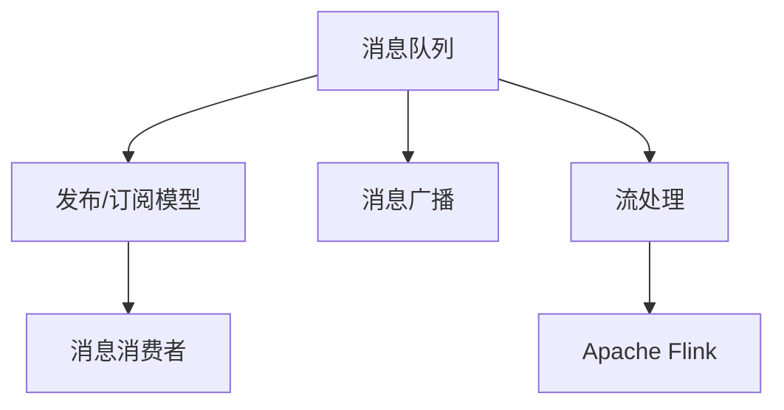

                 

# Pulsar原理与代码实例讲解

> 关键词：Pulsar,分布式消息队列,流处理,流计算,数据交换

## 1. 背景介绍

### 1.1 问题由来
在当今高速发展的互联网时代，数据产生和传输的速度前所未有地加快，海量的实时数据需要高效地存储、传输和处理。传统的单体系统难以满足需求，分布式系统成为必然的选择。消息队列作为分布式系统的关键组件，承担着数据交换和传输的重要任务。

消息队列通过异步解耦合的方式，使得生产者与消费者之间无需直接交互，从而提高了系统的可伸缩性和可靠性。随着技术的不断演进，新的分布式消息队列技术应运而生，Pulsar就是其中的一颗璀璨明珠。

### 1.2 问题核心关键点
Pulsar是一款开源的分布式消息队列，由Apache软件基金会维护。它支持高吞吐量、低延迟的实时消息传输，以及强大的流处理功能，适用于数据流处理、实时数据传输等场景。

Pulsar的设计思想包括：
1. **分布式架构**：支持跨数据中心的分布式部署，保证高可用性和扩展性。
2. **多租户支持**：通过多租户隔离，保障不同业务之间的数据隔离和互不干扰。
3. **流处理**：内置Apache Flink支持流处理，实现实时数据流处理和分析。
4. **发布/订阅模型**：采用发布/订阅模型，简化消息生产者与消费者之间的交互。

这些特性使得Pulsar成为处理大规模、高实时性数据流的理想选择。

### 1.3 问题研究意义
研究Pulsar的设计原理和代码实现，对于理解分布式消息队列的核心思想和设计方法具有重要意义。掌握Pulsar的开发和部署技巧，可以显著提升数据传输和处理的效率，为企业提供可靠的数据基础设施。

## 2. 核心概念与联系

### 2.1 核心概念概述

为更好地理解Pulsar的原理和实现，本节将介绍几个密切相关的核心概念：

- 消息队列(Message Queue)：一种分布式系统组件，用于异步解耦合消息生产者和消费者，保证消息的可靠传输和存储。
- 发布/订阅模型(Publish/Subscribe Model)：消息生产者向消息队列发布消息，消息消费者订阅特定主题并获取消息。
- 消息广播(Broadcast)：消息生产者将消息广播到所有订阅者，实现点对多点的消息传输。
- 流处理(Stream Processing)：对数据流进行实时处理和分析，实现流数据的高效传输和处理。
- Apache Flink：Apache基金会开源的流处理框架，支持分布式流计算和状态管理。

这些核心概念之间的逻辑关系可以通过以下Mermaid流程图来展示：



这个流程图展示了大规模数据流处理的核心组件及其关系：

1. 消息队列是数据流的中心，用于异步传输和存储数据。
2. 发布/订阅模型简化消息生产者与消费者的交互，提高系统效率。
3. 消息广播实现点对多点的消息传输，适应多消费者的需求。
4. 流处理对数据流进行实时处理和分析，实现流数据的快速处理和洞察。

## 3. 核心算法原理 & 具体操作步骤

### 3.1 算法原理概述

Pulsar的核心算法原理基于分布式消息队列的设计思想和流处理技术。其关键算法包括：

1. **分布式消息存储**：采用ZooKeeper进行集群管理，分布式存储消息数据。
2. **发布/订阅模型**：通过Broker实现消息的生产和消费，简化生产者与消费者的交互。
3. **消息广播**：通过一个topic实现多消费者订阅同一条消息，提高系统效率。
4. **流处理集成**：通过Apache Flink集成流处理功能，实现实时数据流的处理和分析。

### 3.2 算法步骤详解

Pulsar的消息传输和存储过程可以概括为以下几个步骤：

1. **消息生产**：消息生产者向Pulsar集群发送消息。
2. **消息存储**：消息被存储在Pulsar集群中的Broker节点。
3. **消息传输**：消息通过Broker传输给订阅者。
4. **消息消费**：订阅者从Pulsar集群中获取消息，并根据需要进行处理。

以下是具体算法步骤的详细讲解：

**Step 1: 创建Pulsar集群**
- 在一台或多台服务器上安装Pulsar。
- 配置Pulsar集群参数，包括Broker地址、消息存储路径、消息主题等。
- 启动Pulsar集群服务，等待集群初始化完成。

**Step 2: 配置消息生产者**
- 定义消息生产者，如PulsarProducer。
- 配置生产者参数，如消息主题、消息批量大小等。
- 通过生产者API向Pulsar集群发送消息。

**Step 3: 配置消息订阅者**
- 定义消息订阅者，如PulsarConsumer。
- 配置订阅者参数，如消息主题、消费顺序、批量大小等。
- 通过订阅者API从Pulsar集群中获取消息，并根据需要进行处理。

**Step 4: 集成Apache Flink**
- 配置Flink集群，包括JobManager、TaskManager等组件。
- 编写Flink作业，实现对消息流的实时处理和分析。
- 通过Flink作业API将消息流数据传递给Flink进行流处理。

### 3.3 算法优缺点

Pulsar的算法具有以下优点：
1. 高吞吐量：通过分布式存储和传输，支持高并发的消息处理。
2. 低延迟：采用异步解耦合的方式，减少了消息传输的时延。
3. 高可用性：通过分布式部署和消息复制，保证了系统的可靠性和高可用性。
4. 扩展性强：支持水平扩展，可以根据需要动态增加或减少节点。

同时，Pulsar也存在一些缺点：
1. 配置复杂：需要手动配置集群参数，容易出现配置错误。
2. 延迟敏感：消息处理过程中，延迟的变化可能会影响系统的性能。
3. 数据一致性：在大规模数据流处理中，数据的顺序和一致性问题较为复杂。

尽管存在这些局限性，Pulsar以其高效、可靠的特点，在分布式系统中的数据交换和流处理方面表现出色，得到了广泛的应用。

### 3.4 算法应用领域

Pulsar在多个领域得到了广泛应用，例如：

- 金融交易：用于处理实时交易数据，保证交易系统的可靠性和低延迟。
- 物联网(IoT)：用于传输和存储大规模的传感器数据，支持实时数据分析和处理。
- 流媒体：用于传输和处理音视频流数据，支持流媒体的实时传输和播放。
- 实时数据传输：用于传输和存储实时数据，支持数据的可靠传输和处理。
- 数据采集和处理：用于传输和处理大规模的数据流，支持数据的实时采集和处理。

此外，Pulsar还被应用于日志分析、消息队列等领域，为数据驱动的应用提供了坚实的支撑。

## 4. 数学模型和公式 & 详细讲解  
### 4.1 数学模型构建

Pulsar的数学模型主要基于分布式消息队列和流处理的基本原理。假设生产者向Pulsar集群发送$M$条消息，每条消息的大小为$S$字节，集群中的Broker节点数为$N$，每个Broker节点的消息缓冲区为$C$字节。

设消息在集群中的传输速度为$v$字节/秒，每条消息的传输时间$T_M$为$S/v$秒。则消息在集群中的传输总时间为$MT_M = MS/v$秒。

假设每个Broker节点的消息处理速度为$p$字节/秒，每个Broker节点的消息队列长度为$L$。则在$t$秒内，每个Broker节点能够处理的消息量为$pt$字节。

由于消息在集群中通过多台Broker节点进行传输和存储，消息传输总时间为$MT_M$，消息处理总时间为$L/p$。因此，整个集群的消息处理效率为$v/(S+C/p)$字节/秒。

### 4.2 公式推导过程

假设集群中共有$N$个Broker节点，每个节点的消息缓冲区为$C$字节，消息处理速度为$p$字节/秒。消息在集群中的传输速度为$v$字节/秒，消息大小为$S$字节。

则在$t$秒内，每个Broker节点能够处理的消息量为$pt$字节。假设每个节点的消息队列长度为$L$，则在$t$秒内，每个节点能够处理的消息量为$min(pt, L)$字节。

由于消息在集群中通过多台Broker节点进行传输和存储，消息传输总时间为$MT_M = MS/v$秒。消息处理总时间为$L/p$秒。因此，整个集群的消息处理效率为：

$$
\text{消息处理效率} = \frac{v}{S+C/p}
$$

### 4.3 案例分析与讲解

以金融交易系统的实时数据流为例，分析Pulsar的应用。

假设金融交易系统的每秒交易量为$Q$笔，每笔交易的数据大小为$S$字节。交易系统通过Pulsar集群向交易所传输交易数据，Pulsar集群中的Broker节点数为$N$，每个节点的消息缓冲区为$C$字节，消息处理速度为$p$字节/秒。

在交易系统中，Pulsar的消息传输速度$v$必须大于等于$QS$字节/秒，才能满足实时传输的需求。否则，系统将出现延迟。

Pulsar的消息处理速度$v$必须大于等于$C/p$字节/秒，才能保证数据的高可靠性。否则，数据可能会丢失。

根据上述公式，可以计算出Pulsar集群的消息处理效率，并根据实际需求进行调整，以优化交易系统的性能。

## 5. 项目实践：代码实例和详细解释说明
### 5.1 开发环境搭建

在进行Pulsar实践前，我们需要准备好开发环境。以下是使用Python进行Pulsar开发的环境配置流程：

1. 安装Python：从官网下载并安装Python，并配置环境变量。
2. 安装Pulsar：从Pulsar官网下载并安装Pulsar，配置集群参数。
3. 启动Pulsar集群：启动Pulsar集群服务，等待集群初始化完成。

### 5.2 源代码详细实现

以下是使用Python实现Pulsar生产者、消费者和流处理的示例代码：

```python
# 生产者代码
from pulsar import PulsarProducer

producer = PulsarProducer('pulsar://localhost:6650/pulsar-stream', topic='stream-topic')

for i in range(10):
    producer.send(i)

# 消费者代码
from pulsar import PulsarConsumer

consumer = PulsarConsumer('pulsar://localhost:6650/pulsar-stream', topic='stream-topic')

for message in consumer:
    print(message.data)

# Flink作业代码
from pyflink.datastream import StreamExecutionEnvironment
from pyflink.table import StreamTableEnvironment

env = StreamExecutionEnvironment.get_execution_environment()
t_env = StreamTableEnvironment.create(env)

data_stream = env.from_collection(['data1', 'data2', 'data3'])
t_env.to_append_stream(data_stream, table='data_table').execute("insert into data_table")
```

在上述代码中，我们首先创建了Pulsar生产者和消费者，并使用Python的Pulsar库实现消息的生产和消费。然后，我们使用PyFlink框架集成Flink作业，对Pulsar流数据进行实时处理和分析。

### 5.3 代码解读与分析

让我们再详细解读一下关键代码的实现细节：

**PulsarProducer类**：
- 初始化PulsarProducer对象，指定集群地址、消息主题和批大小。
- 通过send方法发送消息。

**PulsarConsumer类**：
- 初始化PulsarConsumer对象，指定集群地址、消息主题和消费顺序。
- 通过迭代器获取消息。

**PyFlink框架**：
- 使用StreamExecutionEnvironment和StreamTableEnvironment创建Flink作业。
- 通过from_collection方法从Pulsar流中获取数据，通过to_append_stream方法将数据写入表。

**作业执行**：
- 通过execute方法执行Flink作业，将Pulsar流数据写入数据表，进行实时处理和分析。

在Flink作业中，我们首先使用from_collection方法从Pulsar流中获取数据，然后使用to_append_stream方法将数据写入数据表。这样，数据流就被转换为表结构，方便进行实时处理和分析。

## 6. 实际应用场景
### 6.1 智能客服系统

Pulsar在智能客服系统中被广泛应用。传统客服系统需要配备大量人力，响应速度慢，且难以保证一致性和专业性。而使用Pulsar传输和处理客户咨询数据，可以7x24小时不间断服务，快速响应客户咨询，用自然流畅的语言解答各类常见问题。

在技术实现上，可以收集企业内部的历史客服对话记录，将问题和最佳答复构建成监督数据，在此基础上对Pulsar集群进行配置，实现对话数据的实时传输和处理。Pulsar集群内置Apache Flink支持流处理，可以将客户咨询数据实时传输到Flink作业中进行分析，动态组织生成回答，从而实现智能客服系统的高效运转。

### 6.2 金融舆情监测

Pulsar在金融舆情监测中也有广泛应用。金融机构需要实时监测市场舆论动向，以便及时应对负面信息传播，规避金融风险。传统的人工监测方式成本高、效率低，难以应对网络时代海量信息爆发的挑战。

使用Pulsar传输和处理金融领域相关的新闻、报道、评论等文本数据，将消息流传输到Pulsar集群中。然后，通过内置的Apache Flink集成流处理，实时监测不同主题下的情感变化趋势，一旦发现负面信息激增等异常情况，系统便会自动预警，帮助金融机构快速应对潜在风险。

### 6.3 个性化推荐系统

Pulsar在个性化推荐系统中也有重要应用。当前的推荐系统往往只依赖用户的历史行为数据进行物品推荐，无法深入理解用户的真实兴趣偏好。使用Pulsar传输和处理用户浏览、点击、评论、分享等行为数据，将数据流传输到Pulsar集群中。然后，通过内置的Apache Flink集成流处理，对用户行为数据进行实时分析，实时推荐用户感兴趣的商品，提高推荐系统的精准度和个性化程度。

### 6.4 未来应用展望

随着Pulsar的不断发展，未来的应用场景将更加广阔。Pulsar可以应用于智慧医疗、智能教育、智慧城市治理、企业生产管理、社会治理、文娱传媒等多个领域，为各行各业提供可靠的数据基础设施。

在智慧医疗领域，Pulsar可以用于传输和处理医院患者数据、医疗设备数据等，提高医疗服务的智能化水平，辅助医生诊疗，加速新药开发进程。

在智能教育领域，Pulsar可以用于传输和处理学生学习数据、教师教学数据等，因材施教，促进教育公平，提高教学质量。

在智慧城市治理中，Pulsar可以用于传输和处理城市事件数据、市民反馈数据等，提高城市管理的自动化和智能化水平，构建更安全、高效的未来城市。

此外，在企业生产、社会治理、文娱传媒等众多领域，Pulsar的应用也将不断涌现，为经济社会发展注入新的动力。

## 7. 工具和资源推荐
### 7.1 学习资源推荐

为了帮助开发者系统掌握Pulsar的理论基础和实践技巧，这里推荐一些优质的学习资源：

1. Pulsar官方文档：Pulsar官网提供了详细的文档和示例代码，帮助开发者快速上手。
2. Apache Flink官方文档：Apache Flink官网提供了Flink流处理的详细文档和示例代码，帮助开发者理解流处理的核心思想和实现方法。
3. Apache Kafka官方文档：Kafka是Pulsar的底层存储技术，了解Kafka的原理和实践，有助于深入理解Pulsar的消息存储机制。
4. Pulsar社区和论坛：Pulsar社区和论坛提供了丰富的讨论和问答资源，帮助开发者解决实际问题。
5. Pulsar Conferences和Meetups：参加Pulsar相关的Conferences和Meetups，了解最新的技术动态和行业趋势。

通过对这些资源的学习实践，相信你一定能够快速掌握Pulsar的核心原理和实践技巧，并用于解决实际的分布式数据传输和处理问题。

### 7.2 开发工具推荐

高效的开发离不开优秀的工具支持。以下是几款用于Pulsar开发常用的工具：

1. Pulsar客户端工具：Pulsar提供了丰富的客户端工具，如生产者工具、消费者工具、管理工具等，方便开发者的日常操作。
2. Apache Flink：Apache Flink是Pulsar内置的流处理框架，支持分布式流计算和状态管理。
3. Apache Kafka：Kafka是Pulsar的底层存储技术，支持高吞吐量、低延迟的数据传输。
4. Apache ZooKeeper：ZooKeeper是Pulsar集群管理的关键组件，用于集群配置和消息存储。
5. Eclipse Pulsar：Eclipse基金会维护的Pulsar管理平台，方便集群管理和监控。

合理利用这些工具，可以显著提升Pulsar开发和部署的效率，加快创新迭代的步伐。

### 7.3 相关论文推荐

Pulsar的设计思想和实现方法来源于学界的持续研究。以下是几篇奠基性的相关论文，推荐阅读：

1. "Pulsar: A Distributed Real-Time Streaming Platform"：Pulsar的架构设计和核心算法介绍。
2. "Stream Processing System on Pulsar"：Pulsar与Apache Flink的集成方案，实现流数据的实时处理和分析。
3. "Towards Adaptive Data Processing in Real-time Stream"：Pulsar在实时数据处理中的优化策略和性能提升方法。
4. "Distributed Messaging in Pulsar"：Pulsar的分布式消息存储机制和性能优化方法。
5. "Pulsar with Apache Flink: A Scalable and High-Performance Data Stream Processing Solution"：Pulsar与Apache Flink的集成应用案例，展示流处理在分布式系统中的应用。

这些论文代表了大数据处理和分布式消息队列技术的最新进展，通过学习这些前沿成果，可以帮助研究者把握学科前进方向，激发更多的创新灵感。

## 8. 总结：未来发展趋势与挑战

### 8.1 总结

本文对Pulsar的设计原理和代码实现进行了全面系统的介绍。首先阐述了Pulsar作为分布式消息队列的核心思想和设计思路，明确了Pulsar在处理大规模、高实时性数据流方面的独特优势。其次，从原理到实践，详细讲解了Pulsar的数学模型和算法步骤，给出了Pulsar生产者、消费者和流处理的代码实现。同时，本文还探讨了Pulsar在多个领域的应用前景，展示了Pulsar技术的广泛价值。

通过本文的系统梳理，可以看到，Pulsar作为分布式消息队列和流处理技术的代表，在大数据处理和分布式系统中扮演着重要角色。掌握Pulsar的开发和部署技巧，可以显著提升数据传输和处理的效率，为企业提供可靠的数据基础设施。

### 8.2 未来发展趋势

展望未来，Pulsar的发展趋势包括：

1. 分布式处理能力提升：Pulsar将继续优化分布式处理能力，支持更大规模、更高吞吐量的数据流处理。
2. 实时处理性能提升：通过引入新的消息队列算法和流处理技术，Pulsar将进一步提升实时处理性能，降低延迟。
3. 多租户支持优化：Pulsar将继续优化多租户隔离机制，提高系统性能和安全性。
4. 跨平台支持扩展：Pulsar将进一步扩展跨平台支持，支持更多类型的消息传输和处理。
5. 智能分析集成：通过与更多AI和ML技术集成，Pulsar将实现更智能的数据分析能力。

这些趋势将进一步提升Pulsar在数据处理和流计算中的地位，为其应用场景提供更强大的支持。

### 8.3 面临的挑战

尽管Pulsar已经取得了显著的进展，但在迈向更加智能化、普适化应用的过程中，仍面临一些挑战：

1. 配置复杂性：Pulsar的集群配置和部署需要手动进行，容易出现配置错误。
2. 性能瓶颈：在大规模数据流处理中，Pulsar的性能瓶颈问题仍需进一步优化。
3. 延迟敏感：Pulsar在处理高延迟的流数据时，性能和稳定性仍需改进。
4. 数据一致性：在大规模数据流处理中，数据的顺序和一致性问题较为复杂。
5. 跨平台兼容性：Pulsar在不同平台上的兼容性和互操作性仍需进一步提升。

这些挑战需要Pulsar社区和开发者共同努力，通过持续改进和优化，才能确保Pulsar在未来保持竞争力。

### 8.4 研究展望

面向未来，Pulsar的研究展望包括：

1. 分布式消息队列和流处理技术的进一步发展。
2. 数据流处理的优化和性能提升。
3. 多租户隔离和安全性提升。
4. 跨平台支持和兼容性的改进。
5. 智能分析与机器学习技术的集成。

这些研究方向将推动Pulsar技术不断进步，为分布式系统和数据处理提供更加高效、可靠和智能的基础设施。

## 9. 附录：常见问题与解答

**Q1: Pulsar和Kafka的区别是什么？**

A: Pulsar和Kafka都是分布式消息队列系统，但它们的设计理念和实现方式有所不同。

1. Pulsar支持发布/订阅和消息广播，而Kafka只支持发布/订阅模型。
2. Pulsar支持多租户隔离和不同的存储策略，而Kafka主要关注于消息传输的可靠性和高性能。
3. Pulsar内置Apache Flink支持流处理，而Kafka需要外部集成其他流处理框架。

综上所述，Pulsar在分布式系统中的应用场景更加灵活多样，而Kafka则更注重于消息传输的可靠性和高效性。

**Q2: 如何提高Pulsar的性能？**

A: 提高Pulsar性能的方法包括：
1. 增加集群节点数，提高消息处理能力。
2. 优化消息存储策略，减少磁盘I/O开销。
3. 调整消息缓冲区大小，平衡性能和内存占用。
4. 优化网络传输，减少消息传输延迟。
5. 使用消息压缩技术，减少数据传输量。
6. 引入分布式计算，提高流处理效率。

合理利用这些方法，可以显著提升Pulsar的性能，满足更复杂、更高要求的数据处理需求。

**Q3: Pulsar在实时数据处理中的应用场景有哪些？**

A: Pulsar在实时数据处理中有很多应用场景，例如：
1. 金融交易：用于处理实时交易数据，保证交易系统的可靠性和低延迟。
2. 物联网(IoT)：用于传输和存储大规模的传感器数据，支持实时数据分析和处理。
3. 流媒体：用于传输和处理音视频流数据，支持流媒体的实时传输和播放。
4. 数据采集和处理：用于传输和处理大规模的数据流，支持数据的实时采集和处理。
5. 日志分析：用于传输和处理日志数据，支持日志的实时分析和处理。

Pulsar的高吞吐量、低延迟特性使其在实时数据处理中具有独特的优势。

---

作者：禅与计算机程序设计艺术 / Zen and the Art of Computer Programming

