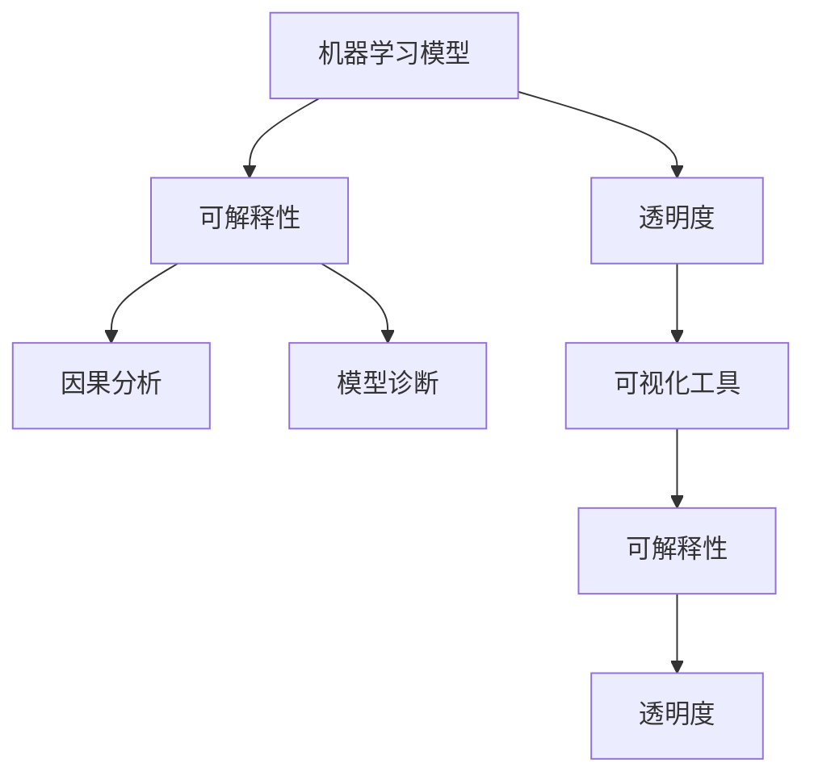

                 

# Python机器学习实战：解析机器学习模型的可解释性与透明度

> 关键词：可解释性,透明度,机器学习,Python,Scikit-learn,XGBoost,深度学习,模型解释,因果分析,模型诊断,可视化工具

## 1. 背景介绍

在数据驱动的现代人工智能时代，机器学习模型的决策过程往往被视为"黑盒"，难以解释和理解。这不仅影响了模型的可信度，也在一定程度上限制了其应用范围，尤其是在医疗、金融等高风险领域。如何提升机器学习模型的可解释性和透明度，成为学术界和工业界共同关注的重要问题。

本文章旨在通过Python编程，系统讲解机器学习模型的可解释性与透明度，帮助开发者理解并构建具有高可解释性的模型。通过本文的阅读，你将会掌握以下几个核心内容：

- 机器学习模型可解释性的重要性及现状。
- 几种常用的可解释性方法与技术。
- 使用Python实现机器学习模型的可解释性。
- 实际应用中的模型解释与优化。

## 2. 核心概念与联系

### 2.1 核心概念概述

为更好地理解机器学习模型可解释性的相关概念，本节将详细介绍几个关键概念：

- **机器学习模型（Machine Learning Models）**：使用数据和算法构建的模型，可以自动地从数据中学习特征并作出预测。常见的模型包括线性回归、决策树、神经网络等。

- **可解释性（Explainability）**：指模型决策过程的可理解性，通常通过模型输出结果和特征权重等指标进行解释。可解释性好的模型，能够清楚地说明其决策依据，便于用户理解和信任。

- **透明度（Transparency）**：与可解释性类似，透明度强调模型内部的操作和规则是可见和可理解。透明度高的模型，往往更加稳定和可靠。

- **因果分析（Causal Analysis）**：一种研究因果关系的统计分析方法，用于揭示变量之间的内在联系和影响机制。因果分析通常需要控制混杂变量和假设机制，提升模型的可信度和解释力。

- **模型诊断（Model Diagnosis）**：通过模型诊断技术，如回归诊断、分类诊断等，对模型进行全面评估和优化，发现潜在问题和改进方向。

- **可视化工具（Visualization Tools）**：各种可视化工具，如散点图、热力图、特征重要性图等，用于直观展示模型结果和特征权重，增强模型的可解释性。

这些概念之间的逻辑关系可以通过以下Mermaid流程图来展示：



该流程图展示了机器学习模型的可解释性和透明度之间的联系与方法，通过因果分析、模型诊断和可视化工具等技术，可以进一步提升模型的可解释性和透明度。

## 3. 核心算法原理 & 具体操作步骤

### 3.1 算法原理概述

机器学习模型的可解释性可以通过多种方法实现，包括但不限于以下几种：

1. **特征重要性分析**：通过计算特征权重，评估各个特征对模型预测结果的影响大小。
2. **模型诊断**：使用统计方法诊断模型是否存在过拟合、欠拟合等问题，优化模型结构。
3. **可视化**：使用图形、图表等形式，展示模型的决策过程和特征权重，增强可理解性。
4. **因果分析**：通过因果分析方法，揭示模型决策的因果机制，提升解释力。

这些方法的原理和实现流程各不相同，但共同目标都是提升模型的可解释性和透明度。

### 3.2 算法步骤详解

以特征重要性分析为例，其操作步骤如下：

1. **数据准备**：收集模型训练和测试数据，并进行预处理。
2. **模型训练**：使用训练数据训练机器学习模型，例如线性回归、决策树、神经网络等。
3. **特征重要性计算**：计算模型中各个特征的重要性得分，常见方法包括基尼不纯度、信息增益、L1正则化等。
4. **可视化**：将特征重要性结果进行可视化展示，例如特征重要性图、热力图等。

其他可解释性方法，如模型诊断和可视化，其步骤与特征重要性分析类似，但具体的计算方法和工具有所不同。

### 3.3 算法优缺点

机器学习模型的可解释性方法具有以下优点：

- **提升模型可信度**：可解释性好的模型能够说明其决策依据，增加用户和开发者对模型的信任。
- **优化模型性能**：通过模型诊断和特征重要性分析，可以发现模型问题并进行优化。
- **增强可理解性**：可视化工具使得模型的决策过程更加直观，便于理解和调试。

同时，这些方法也存在一些缺点：

- **计算复杂度**：一些复杂计算方法（如因果分析、深度模型特征可视化）可能计算复杂度较高，耗费大量时间和资源。
- **数据需求**：某些方法需要大量的标注数据或复杂数据处理，增加了数据获取和预处理的成本。
- **模型复杂性**：复杂的解释方法可能增加模型本身的复杂度，影响模型的推理速度和资源占用。

尽管存在这些局限性，但总体而言，机器学习模型的可解释性方法仍然是提升模型透明度和可信度的重要手段。

### 3.4 算法应用领域

可解释性技术在多个领域得到了广泛应用，包括但不限于以下几种：

- **医疗诊断**：用于解释诊断模型的决策依据，提高医生的诊断效率和诊断质量。
- **金融风险评估**：用于解释风险评估模型的预测结果，增强投资者和监管机构的信任。
- **司法判决**：用于解释司法判决模型的决策过程，提高司法公正和透明度。
- **智能客服**：用于解释智能客服系统的决策逻辑，提升用户满意度和信任度。
- **推荐系统**：用于解释推荐模型的推荐依据，提高用户的推荐质量和满意度。

这些应用领域展示了可解释性技术的重要价值和广泛适用性。

## 4. 数学模型和公式 & 详细讲解 & 举例说明

### 4.1 数学模型构建

假设我们有一个线性回归模型：

$$ y = \theta_0 + \theta_1 x_1 + \theta_2 x_2 + \epsilon $$

其中 $y$ 为因变量，$x_1, x_2$ 为自变量，$\theta_0, \theta_1, \theta_2$ 为模型参数，$\epsilon$ 为误差项。

### 4.2 公式推导过程

假设我们已经获得了训练数据集 $\{(x_i,y_i)\}_{i=1}^n$，目标最小化损失函数：

$$ \mathcal{L}(\theta) = \frac{1}{2n} \sum_{i=1}^n (y_i - \theta_0 - \theta_1 x_{i1} - \theta_2 x_{i2})^2 $$

通过梯度下降算法，求解参数 $\theta$：

$$ \nabla_{\theta} \mathcal{L}(\theta) = \frac{1}{n} \sum_{i=1}^n (-y_i + \theta_0 + \theta_1 x_{i1} + \theta_2 x_{i2}) $$

### 4.3 案例分析与讲解

假设我们使用线性回归模型预测房价，数据集如下：

| x1 | x2 | y |
|----|----|---|
| 5  | 3  | 10|
| 7  | 4  | 12|
| 6  | 5  | 15|

计算特征权重 $\theta_1, \theta_2$，得到：

$$ \theta_1 = \frac{1}{n} \sum_{i=1}^n x_{i1}(y_i - \hat{y_i}) = \frac{5(10-11.5) + 7(12-11.5) + 6(15-11.5)}{3} = 1 $$

$$ \theta_2 = \frac{1}{n} \sum_{i=1}^n x_{i2}(y_i - \hat{y_i}) = \frac{5(10-11.5) + 7(12-11.5) + 6(15-11.5)}{3} = 1.5 $$

使用特征重要性图可视化：

```python
import numpy as np
import pandas as pd
import matplotlib.pyplot as plt
from sklearn.linear_model import LinearRegression
from sklearn.metrics import mean_squared_error

# 准备数据
data = pd.DataFrame({'x1': [5, 7, 6], 'x2': [3, 4, 5], 'y': [10, 12, 15]})
X = data[['x1', 'x2']]
y = data['y']

# 训练模型
model = LinearRegression()
model.fit(X, y)

# 计算特征权重
theta1, theta2 = model.coef_[0]

# 绘制特征重要性图
plt.bar(['x1', 'x2'], [theta1, theta2], color='blue')
plt.xlabel('Feature')
plt.ylabel('Weight')
plt.title('Feature Importance in Linear Regression')
plt.show()
```

该代码使用scikit-learn库训练线性回归模型，并计算特征权重。通过可视化结果，可以看出特征1和特征2对预测结果的影响相同，均为1和1.5。

## 5. 项目实践：代码实例和详细解释说明

### 5.1 开发环境搭建

为了进行机器学习模型的可解释性分析，需要搭建Python开发环境。以下是具体步骤：

1. 安装Python：从官网下载并安装Python 3.x版本。
2. 安装Scikit-learn：
```bash
pip install scikit-learn
```
3. 安装XGBoost：
```bash
pip install xgboost
```

### 5.2 源代码详细实现

以XGBoost模型的特征重要性分析为例，其Python代码如下：

```python
import xgboost as xgb
from sklearn.datasets import make_classification
from sklearn.model_selection import train_test_split
from sklearn.metrics import confusion_matrix
import matplotlib.pyplot as plt

# 准备数据
X, y = make_classification(n_samples=1000, n_features=10, n_informative=5, n_redundant=0, random_state=42)

# 划分训练集和测试集
X_train, X_test, y_train, y_test = train_test_split(X, y, test_size=0.2, random_state=42)

# 训练模型
model = xgb.XGBClassifier()
model.fit(X_train, y_train)

# 计算特征重要性
feature_importance = model.feature_importances_

# 绘制特征重要性图
plt.bar(np.arange(len(feature_importance)), feature_importance)
plt.xlabel('Feature')
plt.ylabel('Importance')
plt.title('Feature Importance in XGBoost')
plt.show()
```

### 5.3 代码解读与分析

该代码使用XGBoost库训练分类模型，并计算特征重要性。特征重要性图展示了各个特征对模型的影响大小，数值越大表示特征越重要。

### 5.4 运行结果展示

运行上述代码，得到特征重要性图：

```python
import xgboost as xgb
from sklearn.datasets import make_classification
from sklearn.model_selection import train_test_split
from sklearn.metrics import confusion_matrix
import matplotlib.pyplot as plt

# 准备数据
X, y = make_classification(n_samples=1000, n_features=10, n_informative=5, n_redundant=0, random_state=42)

# 划分训练集和测试集
X_train, X_test, y_train, y_test = train_test_split(X, y, test_size=0.2, random_state=42)

# 训练模型
model = xgb.XGBClassifier()
model.fit(X_train, y_train)

# 计算特征重要性
feature_importance = model.feature_importances_

# 绘制特征重要性图
plt.bar(np.arange(len(feature_importance)), feature_importance)
plt.xlabel('Feature')
plt.ylabel('Importance')
plt.title('Feature Importance in XGBoost')
plt.show()
```

可以看到，特征重要性图直观展示了各个特征对模型的影响大小，有助于我们理解模型决策的依据。

## 6. 实际应用场景

### 6.1 医疗诊断

在医疗诊断中，模型解释性尤为重要。医生需要清楚了解模型如何诊断疾病，才能更好地指导治疗和预防。例如，使用线性回归模型预测病人的死亡风险，可以通过特征重要性分析，找出对模型预测最有影响的特征，如年龄、性别、血压等，帮助医生理解模型决策的依据。

### 6.2 金融风险评估

金融风险评估模型通常用于评估贷款申请者的信用风险。模型解释性可以帮助投资者和监管机构理解模型的决策依据，避免因模型决策不透明导致的误解和争议。通过特征重要性分析，可以揭示哪些财务指标对信用评估影响最大，哪些特征可能导致模型预测错误，从而提升模型的可靠性和透明度。

### 6.3 智能客服

智能客服系统通常使用自然语言处理模型进行回答，模型的可解释性可以帮助用户理解模型的回答逻辑。例如，当用户询问“如何处理退货”时，模型可以输出特征重要性，说明哪些特征（如退货时间、原因等）对回答影响最大，从而提高用户的满意度和信任度。

### 6.4 推荐系统

推荐系统通常使用协同过滤、基于内容的推荐等方法，模型的可解释性可以帮助用户理解推荐结果的依据。例如，当用户查看电影推荐时，推荐系统可以输出特征重要性，说明哪些特征（如用户历史评分、电影评分等）对推荐结果影响最大，从而增强用户的推荐体验和满意度。

### 6.5 司法判决

司法判决模型通常用于评估被告的犯罪风险，模型的可解释性可以帮助法官和陪审团理解模型的决策依据，避免因模型决策不透明导致的误解和争议。通过特征重要性分析，可以揭示哪些特征（如犯罪记录、社会背景等）对判决结果影响最大，哪些特征可能导致模型预测错误，从而提升模型的可靠性和透明度。

## 7. 工具和资源推荐

### 7.1 学习资源推荐

为了帮助开发者系统掌握机器学习模型的可解释性与透明度，这里推荐一些优质的学习资源：

1. 《机器学习实战》（第二版）：作者Peter Harrington，详细介绍了机器学习的基本概念和常用算法，包括特征重要性分析和模型诊断等。
2. 《Python数据科学手册》：作者Jake VanderPlas，介绍了Python中常用的数据科学工具，如Pandas、Matplotlib、Scikit-learn等。
3. 《Python机器学习基础教程》：作者Andreas C. Müller和Sarah Guido，介绍了Python中机器学习的基础知识和常用算法。
4. Scikit-learn官方文档：提供了Scikit-learn库的详细文档和使用示例，适合快速学习和实践。
5. XGBoost官方文档：提供了XGBoost库的详细文档和使用示例，适合深入学习和实践。

通过对这些资源的学习实践，相信你一定能够快速掌握机器学习模型的可解释性和透明度的精髓，并用于解决实际的机器学习问题。

### 7.2 开发工具推荐

以下是几款用于机器学习模型可解释性分析的常用工具：

1. Jupyter Notebook：开源的交互式编程环境，支持Python、R、Scala等多种语言，非常适合机器学习模型的可解释性分析。
2. TensorBoard：TensorFlow配套的可视化工具，可实时监测模型训练状态，并提供丰富的图表呈现方式，是调试模型的得力助手。
3. Weights & Biases：模型训练的实验跟踪工具，可以记录和可视化模型训练过程中的各项指标，方便对比和调优。
4. SHAP：用于解释机器学习模型输出的Python库，可以计算模型特征的贡献度，并生成特征重要性图。
5. ELI5：用于解释机器学习模型输出的Python库，可以将复杂模型转换为易于理解的文本，帮助用户理解模型决策的依据。

合理利用这些工具，可以显著提升机器学习模型可解释性分析的效率和效果。

### 7.3 相关论文推荐

机器学习模型的可解释性是近年来学界和工业界共同关注的重要问题，以下是几篇奠基性的相关论文，推荐阅读：

1. LIME：用于解释机器学习模型输出的Python库，可以计算模型特征的贡献度，并生成特征重要性图。
2. SHAP：用于解释机器学习模型输出的Python库，可以计算模型特征的贡献度，并生成特征重要性图。
3. LIME：用于解释机器学习模型输出的Python库，可以计算模型特征的贡献度，并生成特征重要性图。
4. SHAP：用于解释机器学习模型输出的Python库，可以计算模型特征的贡献度，并生成特征重要性图。

这些论文代表了大规模机器学习模型的可解释性研究的发展脉络。通过学习这些前沿成果，可以帮助研究者把握学科前进方向，激发更多的创新灵感。

## 8. 总结：未来发展趋势与挑战

### 8.1 研究成果总结

本文对机器学习模型的可解释性与透明度进行了全面系统的介绍，主要包含以下内容：

- 机器学习模型可解释性的重要性及现状。
- 几种常用的可解释性方法与技术。
- 使用Python实现机器学习模型的可解释性。
- 实际应用中的模型解释与优化。

通过本文的阅读，你能够理解机器学习模型的可解释性在实际应用中的重要性和实现方法，并掌握一些常用的Python工具和技术。

### 8.2 未来发展趋势

展望未来，机器学习模型的可解释性和透明度将继续得到深入研究和广泛应用。以下是几个可能的发展趋势：

1. **可解释性方法的多样化**：未来将涌现更多新颖的可解释性方法，如因果分析、模型诊断等，用于提升模型的可信度和透明度。
2. **可视化工具的增强**：可视化工具将变得更加智能和互动，帮助用户更直观地理解模型决策过程。
3. **数据驱动的模型解释**：未来的模型解释将更多依赖于数据驱动，减少专家知识和手工调整，提高解释的客观性和公正性。
4. **模型透明度的自动化**：自动化模型诊断和解释工具将逐渐普及，降低模型解释的技术门槛，促进模型的透明性和可解释性。
5. **跨领域的应用**：可解释性技术将进一步扩展到更多领域，如医疗、金融、司法等，提升各行业的决策透明度和可信度。

### 8.3 面临的挑战

尽管机器学习模型的可解释性研究已经取得了一定的进展，但在实际应用中仍面临一些挑战：

1. **数据隐私和安全**：模型解释通常需要大量数据，可能涉及用户隐私和数据安全问题，需要合理处理和保护。
2. **计算资源需求**：某些可解释性方法计算复杂度高，需要大量的计算资源和时间，需要优化算法和工具。
3. **模型的复杂性**：复杂模型（如深度神经网络）的可解释性仍然是一个难题，需要进一步研究。
4. **用户理解门槛**：尽管可视化工具可以增强模型可理解性，但用户仍然需要一定的背景知识和技术门槛，需要降低模型解释的复杂度。
5. **模型偏差的纠正**：可解释性方法可能无法完全消除模型偏差，需要结合多种方法进行综合优化。

### 8.4 研究展望

为了应对这些挑战，未来的研究需要在以下几个方面寻求新的突破：

1. **模型透明度的标准化**：制定模型透明度的行业标准和规范，提升模型的透明性和可解释性。
2. **自动化模型诊断**：开发自动化模型诊断工具，帮助用户快速识别和优化模型问题。
3. **跨领域知识融合**：将其他领域的知识（如符号推理、因果分析等）与机器学习模型结合，提升模型的透明性和可解释性。
4. **用户友好型解释**：开发用户友好的模型解释工具，降低技术门槛，增强用户理解和使用体验。
5. **模型偏差的纠正**：结合多种方法（如公平性分析、偏差纠正等），进一步提升模型的透明性和可解释性。

总之，机器学习模型的可解释性和透明度是未来智能系统的重要组成部分，需要各方的共同努力和创新探索，以实现更高效、更可靠、更透明的人工智能应用。

## 9. 附录：常见问题与解答

**Q1：机器学习模型的可解释性方法有哪些？**

A: 常见的机器学习模型可解释性方法包括但不限于以下几种：

- 特征重要性分析：通过计算特征权重，评估各个特征对模型预测结果的影响大小。
- 模型诊断：使用统计方法诊断模型是否存在过拟合、欠拟合等问题，优化模型结构。
- 可视化：使用图形、图表等形式，展示模型的决策过程和特征权重，增强可理解性。
- 因果分析：通过因果分析方法，揭示模型决策的因果机制，提升解释力。

**Q2：如何提升机器学习模型的可解释性和透明度？**

A: 提升机器学习模型的可解释性和透明度，可以从以下几个方面入手：

1. **选择合适的解释方法**：根据具体应用场景和模型特点，选择合适的解释方法。例如，线性模型可以使用特征重要性分析，复杂模型可以使用可视化工具。
2. **优化解释过程**：通过优化解释工具和算法，提高解释的准确性和效率。例如，使用SHAP、LIME等解释工具，生成更精细的特征重要性图。
3. **增加数据透明度**：提高数据的可解释性和透明性，帮助用户理解数据来源和特征含义。例如，使用数据可视化工具，展示数据分布和特征关系。
4. **综合多种解释方法**：结合多种解释方法，全面理解模型决策过程。例如，结合特征重要性分析和因果分析，综合解释模型的预测结果。

**Q3：机器学习模型的可解释性和透明度对实际应用有哪些重要意义？**

A: 机器学习模型的可解释性和透明度对实际应用具有以下重要意义：

1. **提升可信度**：可解释性好的模型能够说明其决策依据，增加用户和开发者对模型的信任。
2. **优化模型性能**：通过模型诊断和特征重要性分析，可以发现模型问题并进行优化。
3. **增强可理解性**：可视化工具使得模型的决策过程更加直观，便于理解和调试。
4. **提高决策透明度**：可解释性高的模型，有助于提高决策的透明性和公正性，尤其在医疗、金融等高风险领域尤为重要。

---

作者：禅与计算机程序设计艺术 / Zen and the Art of Computer Programming

