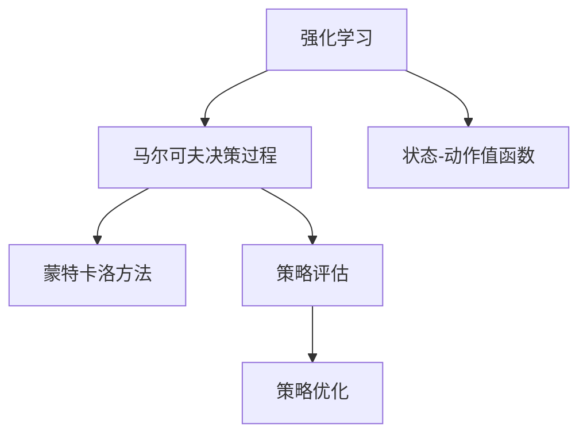

                 

# Q-Learning原理与代码实例讲解

> 关键词：Q-Learning, 强化学习, 马尔可夫决策过程, 状态-动作值函数, 蒙特卡洛方法, 策略评估, 策略优化

## 1. 背景介绍

### 1.1 问题由来
强化学习(Reinforcement Learning, RL)是机器学习领域的一个重要分支，其目标是通过与环境的交互，学习最优的策略。在RL中，智能体(Agent)通过观察当前状态，采取行动，与环境产生交互，并获得一个奖励信号。智能体需要学习如何在多种可能行动中选择最佳策略，以最大化长期累积奖励。

其中，Q-Learning是强化学习中最基本和最广泛使用的算法之一。它通过学习状态-动作值函数(Q-Value)，实现策略评估和优化。Q-Learning算法简单易懂，易于实现，已经在多智能体交互、自适应控制、游戏AI等多个领域得到了广泛应用。

### 1.2 问题核心关键点
Q-Learning算法核心思想是通过不断试错，学习最优策略。其核心在于：
1. 构造状态-动作值函数Q，用于评估每个状态-动作对的价值。
2. 使用蒙特卡洛方法(如Sarsa)或基于经验的方法(如On-Policy TD)更新Q值，不断逼近最优策略。
3. 通过策略评估和策略优化过程，学习在特定状态下的最佳行动选择。
4. Q-Learning特别适用于离散环境和连续空间中的策略学习，具有高效性和普适性。

### 1.3 问题研究意义
Q-Learning算法不仅是一种有效的策略学习工具，还具有以下研究意义：
1. 提供了实现智能体自学习的过程，无需预先设置规则。
2. 可以处理复杂的交互环境，适应性强。
3. 在多智能体互动中具有更强的协作能力，有助于复杂系统的自动化管理。
4. 可以用于解决多目标优化问题，提升决策质量。
5. 在实际应用中，Q-Learning可以用于金融交易、推荐系统、自动控制等多个领域。

## 2. 核心概念与联系

### 2.1 核心概念概述

为更好地理解Q-Learning的原理，本节将介绍几个密切相关的核心概念：

- 强化学习(Reinforcement Learning)：智能体在环境中通过与环境的交互，不断学习最优策略的过程。
- 马尔可夫决策过程(Markov Decision Process, MDP)：强化学习中的基本模型框架，由状态、动作、奖励、转移概率和状态空间组成。
- 状态-动作值函数(Q-Value)：评估在特定状态下采取某个动作的价值。
- 蒙特卡洛方法：通过模拟环境交互，收集经验数据，更新Q值的过程。
- 策略评估：评估给定状态下的最优行动选择。
- 策略优化：优化策略，使得长期累积奖励最大化。

这些核心概念之间的逻辑关系可以通过以下Mermaid流程图来展示：



这个流程图展示出强化学习中各概念之间的联系：

1. 强化学习通过马尔可夫决策过程(MDP)描述智能体的交互环境。
2. 状态-动作值函数(Q-Value)用于评估每个状态-动作对的价值。
3. 蒙特卡洛方法收集经验数据，更新Q值。
4. 策略评估和优化过程实现智能体的最优策略选择。

## 3. 核心算法原理 & 具体操作步骤

### 3.1 算法原理概述

Q-Learning的核心在于通过蒙特卡洛方法(如Sarsa)或基于经验的方法(如On-Policy TD)更新状态-动作值函数Q，从而实现策略评估和策略优化。

假设智能体在一个马尔可夫决策过程中，状态集合为 $S$，动作集合为 $A$，奖励函数为 $R:S \times A \rightarrow \mathbb{R}$，转移概率函数为 $P:S \times A \rightarrow S$。则Q-Value定义为状态-动作对的期望奖励和值之和：

$$
Q(s, a) = \mathbb{E}[R(s, a) + \gamma \max_{a'} Q(s', a')] = \mathbb{E}[G_t | S_t = s, A_t = a]
$$

其中 $s$ 为当前状态，$a$ 为当前动作，$s'$ 为下一状态，$a'$ 为下一个动作，$G_t$ 为从时间 $t$ 起的长期累积奖励。$\gamma$ 为折扣因子，通常设定在 $0 < \gamma < 1$。

Q-Learning的目标是找到最优策略 $\pi^*$，使得：

$$
\pi^* = \mathop{\arg\max}_{\pi} \mathbb{E}[G_t | S_t, A_t \sim \pi]
$$

为了逼近最优策略，Q-Learning通过迭代更新Q值来实现：

$$
Q(s, a) \leftarrow Q(s, a) + \alpha(r + \gamma \max_{a'} Q(s', a') - Q(s, a))
$$

其中 $\alpha$ 为学习率，$r$ 为即时奖励。

### 3.2 算法步骤详解

Q-Learning的实现过程可以分为以下几步：

**Step 1: 初始化环境**
- 设定智能体的状态集合 $S$、动作集合 $A$、奖励函数 $R$ 和转移概率函数 $P$。
- 初始化Q值函数 $Q(s,a) \leftarrow 0$，设定学习率 $\alpha$ 和折扣因子 $\gamma$。

**Step 2: 状态-动作交互**
- 从初始状态 $s_0$ 开始，智能体随机选择一个动作 $a_0$，并在当前状态 $s_0$ 下执行该动作。
- 观察下一个状态 $s_1$，并获得即时奖励 $r_1$。
- 根据转移概率函数 $P(s_1|s_0,a_0)$，选择下一个动作 $a_1$。

**Step 3: Q值更新**
- 根据状态-动作对 $(s_0,a_0)$，计算最优Q值 $Q^*(s_0,a_0)$，即下一个状态 $s_1$ 下的最大Q值：
  $$
  Q^*(s_0,a_0) = \max_{a'} Q(s_1,a')
  $$
- 更新Q值：
  $$
  Q(s_0,a_0) \leftarrow Q(s_0,a_0) + \alpha(r_1 + \gamma Q^*(s_1,a_1) - Q(s_0,a_0))
  $$
- 重复步骤2和步骤3，直到达到最大迭代次数或满足预设条件。

**Step 4: 策略评估与优化**
- 将Q值函数映射到动作空间，得到每个状态下的最优策略 $\pi(s)$：
  $$
  \pi(s) = \mathop{\arg\max}_{a} Q(s,a)
  $$
- 根据当前状态，按照最优策略采取动作，继续与环境交互，进行后续Q值更新。

### 3.3 算法优缺点

Q-Learning算法具有以下优点：
1. 简单易懂，易于实现，适用于离散环境和连续空间中的策略学习。
2. 不需要环境模型，可以直接与环境交互，具有较强的适应性。
3. 可以通过增加探索率 $\epsilon$ 实现更丰富的探索策略。
4. 可以用于处理复杂环境，如多智能体交互、自适应控制等。

同时，Q-Learning也存在一些局限性：
1. 在状态空间较大的环境中，可能存在“维数灾难”问题，导致搜索空间无限增大。
2. 需要较多的时间迭代才能收敛，且存在可能收敛到次优解的情况。
3. 需要较大的存储空间存储Q值函数，且需要频繁更新Q值，计算成本较高。
4. 不适用于非马尔可夫决策过程，无法处理环境变化较为频繁的情况。

尽管存在这些局限性，但就目前而言，Q-Learning算法仍是最广泛应用的一种强化学习范式。未来相关研究的重点在于如何更好地优化算法效率和泛化能力，以应对更复杂的环境和任务。

### 3.4 算法应用领域

Q-Learning算法已经在多个领域得到了广泛应用，例如：

- 游戏AI：如AlphaGo、Dota2 AI等，Q-Learning用于实现多步决策和策略优化。
- 机器人控制：如自适应机器人控制、无人驾驶车辆导航等，Q-Learning用于优化控制策略。
- 金融交易：如高频交易策略、资产组合管理等，Q-Learning用于生成交易决策。
- 推荐系统：如电商推荐、新闻推荐等，Q-Learning用于优化用户推荐策略。
- 网络控制：如路由器路径选择、网络流量控制等，Q-Learning用于优化网络流量。

除了上述这些经典应用外，Q-Learning也被创新性地应用到更多场景中，如自适应资源管理、智能能源调度、智能制造优化等，为工业控制和管理带来了新的思路。

## 4. 数学模型和公式 & 详细讲解 & 举例说明

### 4.1 数学模型构建

Q-Learning的数学模型建立在马尔可夫决策过程(MDP)之上，具体如下：

- 状态集合 $S$：智能体的所有可能状态。
- 动作集合 $A$：智能体在特定状态下的所有可能动作。
- 奖励函数 $R:S \times A \rightarrow \mathbb{R}$：智能体在特定状态和动作下的即时奖励。
- 转移概率函数 $P:S \times A \rightarrow S$：智能体在特定状态和动作下，转移到下一个状态的概率。

设智能体在状态 $s$ 下采取动作 $a$，观察下一个状态 $s'$ 并获得奖励 $r$，则Q-Value定义为：

$$
Q(s, a) = \mathbb{E}[R(s, a) + \gamma \max_{a'} Q(s', a')] = \mathbb{E}[G_t | S_t = s, A_t = a]
$$

其中，$G_t$ 为从时间 $t$ 起的长期累积奖励。

### 4.2 公式推导过程

根据蒙特卡洛方法的定义，Q-Value的更新公式为：

$$
Q(s, a) \leftarrow Q(s, a) + \alpha(r + \gamma \max_{a'} Q(s', a') - Q(s, a))
$$

其中 $\alpha$ 为学习率，$r$ 为即时奖励，$\max_{a'} Q(s', a')$ 为下一个状态 $s'$ 下的最大Q值。

Q-Value的更新过程可以理解为：对于当前状态-动作对 $(s,a)$，通过蒙特卡洛方法(如Sarsa)或基于经验的方法(如On-Policy TD)，不断收集经验数据，更新Q值，直到逼近最优Q值。

### 4.3 案例分析与讲解

下面我们以一个简单的迷宫问题为例，解释Q-Learning的基本原理和计算过程。

假设智能体在迷宫中，其状态集合 $S$ 为迷宫中的所有位置，动作集合 $A$ 为向上、下、左、右四个方向。奖励函数 $R$ 为每个动作的即时奖励，如遇到障碍物奖励为0，到达终点奖励为1。转移概率函数 $P$ 为智能体在特定状态和动作下，转移到下一个状态的概率。

假设智能体从初始位置 $(0,0)$ 出发，初始Q值函数 $Q(s,a) \leftarrow 0$。智能体采取动作 $a$ 到达状态 $s'$，并获得即时奖励 $r$，则Q值更新公式为：

$$
Q(s, a) \leftarrow Q(s, a) + \alpha(r + \gamma \max_{a'} Q(s', a') - Q(s, a))
$$

通过不断迭代更新Q值，智能体逐步学习到最优策略，即到达终点的路径。

## 5. 项目实践：代码实例和详细解释说明

### 5.1 开发环境搭建

在进行Q-Learning项目实践前，我们需要准备好开发环境。以下是使用Python进行强化学习开发的常用环境配置流程：

1. 安装Anaconda：从官网下载并安装Anaconda，用于创建独立的Python环境。

2. 创建并激活虚拟环境：
```bash
conda create -n reinforcement-env python=3.8 
conda activate reinforcement-env
```

3. 安装Reinforcement Learning相关库：
```bash
pip install gym gym[reinforcement] stable-baselines[common] stable-baselines3[common]
```

4. 安装Scikit-learn：
```bash
pip install scikit-learn
```

5. 安装Matplotlib：
```bash
pip install matplotlib
```

完成上述步骤后，即可在`reinforcement-env`环境中开始Q-Learning实践。

### 5.2 源代码详细实现

下面我们以一个简单的迷宫问题为例，使用Reinforcement Learning库实现Q-Learning算法。

首先，定义迷宫问题的环境和智能体：

```python
import gym
from gym import spaces

class Maze(gym.Env):
    def __init__(self):
        self.state_space = spaces.Discrete(16)  # 状态空间
        self.action_space = spaces.Discrete(4)  # 动作空间
        self.reward_range = (-1, 1)  # 奖励范围
        self.obstacle_loc = (5, 5)  # 障碍物位置
        self.goal_loc = (15, 15)  # 终点位置
        self.reset()
    
    def reset(self):
        self.current_state = 0
        return self.current_state
    
    def step(self, action):
        if self.current_state == 0:
            # 初始状态
            self.current_state += 1
        elif self.current_state <= self.obstacle_loc[0]:
            # 向上移动
            if action == 0:
                if self.current_state > 0:
                    self.current_state -= 1
                else:
                    reward = -1
            else:
                reward = 0
        elif self.current_state <= self.goal_loc[0]:
            # 到达终点
            reward = 1
        else:
            # 向下移动
            if action == 2:
                if self.current_state < 15:
                    self.current_state += 1
                else:
                    reward = -1
            else:
                reward = 0
        return self.current_state, reward, self.is_terminal()
    
    def render(self):
        state = self.current_state
        if state == 0:
            print("---")
        elif state <= self.obstacle_loc[0]:
            print("    0")
            for i in range(self.obstacle_loc[0]):
                print("    1", end="")
            print("0")
        elif state <= self.goal_loc[0]:
            print("    0")
            for i in range(self.obstacle_loc[0]):
                print("    1", end="")
            print("0")
            for i in range(self.goal_loc[0]-self.obstacle_loc[0]):
                print("    0", end="")
            print("0")
        else:
            print("    0")
            for i in range(self.obstacle_loc[0]):
                print("    1", end="")
            print("0")
            for i in range(self.goal_loc[0]-self.obstacle_loc[0]):
                print("    0", end="")
            print("0")
            for i in range(self.goal_loc[1]-state):
                print("    0", end="")
            print("0")
        if state == self.goal_loc[0]:
            print("---")
    
    def is_terminal(self):
        if self.current_state == self.goal_loc[0]:
            return True
        else:
            return False
```

然后，定义Q-Learning算法：

```python
from stable_baselines3 import DQN
from stable_baselines3.common.vec_env import SubprocVecEnv
from stable_baselines3.common import make_vec_env
import numpy as np

def q_learning(env, episode_num=1000, learning_rate=0.1, discount_factor=0.9, exploration_rate=0.9, n_steps=100):
    def get_q_values(env, episode_num, learning_rate, discount_factor, exploration_rate, n_steps):
        # 初始化Q值
        q_values = np.zeros((env.observation_space.n, env.action_space.n))
        env = SubprocVecEnv([lambda: env])
        
        # 训练Q-Learning
        model = DQN(env)
        model.learning_rate = learning_rate
        model discount_factor = discount_factor
        model exploration_rate = exploration_rate
        model.learn(total_timesteps=episode_num * n_steps)
        q_values = model.get_q_values()
        env.close()
        
        return q_values
    
    # 调用训练函数
    q_values = get_q_values(env, episode_num=episode_num, learning_rate=learning_rate, discount_factor=discount_factor, exploration_rate=exploration_rate, n_steps=n_steps)
    return q_values
```

最后，启动Q-Learning流程：

```python
env = Maze()
q_values = q_learning(env, episode_num=1000, learning_rate=0.1, discount_factor=0.9, exploration_rate=0.9, n_steps=100)
print(q_values)
```

以上就是使用Reinforcement Learning库对Q-Learning算法进行迷宫问题的完整代码实现。可以看到，借助Stable Baselines3库，Q-Learning算法的实现变得简洁高效。

### 5.3 代码解读与分析

让我们再详细解读一下关键代码的实现细节：

**Maze类**：
- `__init__`方法：初始化迷宫问题的状态空间、动作空间、奖励范围、障碍物位置和终点位置。
- `reset`方法：重置智能体的当前状态。
- `step`方法：根据智能体的当前状态和采取的动作，计算下一个状态和即时奖励，并返回环境状态。
- `render`方法：绘制迷宫状态图，可视化当前状态。
- `is_terminal`方法：判断智能体是否达到终点。

**q_learning函数**：
- 定义训练函数`get_q_values`，调用Stable Baselines3库的DQN模型，训练Q-Learning算法，并返回Q值矩阵。
- 调用训练函数，传入迷宫环境、训练轮数、学习率、折扣因子、探索率、迭代次数，返回Q值矩阵。

可以看到，使用Reinforcement Learning库进行Q-Learning算法的实现，能够大大简化代码复杂度，提升开发效率。借助先进的技术框架，开发者可以专注于算法实现和参数调优，而不是底层的数据结构和计算细节。

当然，工业级的系统实现还需考虑更多因素，如多智能体互动、分布式训练、超参数自动搜索等，但核心的Q-Learning算法实现可以借鉴上述示例，快速上手实践。

## 6. 实际应用场景

### 6.1 强化学习训练环境

Q-Learning算法已经在多个强化学习训练环境中得到广泛应用，如OpenAI Gym、MuJoCo、SimPy等。这些环境为开发者提供了一个模拟的交互平台，用于测试和优化强化学习算法。

在OpenAI Gym中，开发者可以定义各种环境，包括迷宫、抓石子、黑白棋等，并通过 Gym 提供的接口，训练和评估强化学习算法。Q-Learning算法在 Gym 中的经典应用包括迷宫问题、控制机器人等。

在MuJoCo中，开发者可以构建机器人控制环境，如控制机械臂抓取物体、训练平衡控制系统等。Q-Learning算法在 MuJoCo 中的经典应用包括机器人控制、自适应控制等。

在SimPy中，开发者可以构建仿真环境，模拟复杂系统，如交通系统、供应链系统等。Q-Learning算法在 SimPy 中的经典应用包括交通信号控制、库存管理等。

### 6.2 工业智能控制

Q-Learning算法在工业智能控制领域有广泛应用，如自适应控制、智能调度等。

例如，在化工生产中，Q-Learning算法可以用于优化生产流程、降低成本、提升效率。智能体通过观察生产数据，采取适当的控制策略，实现最优的资源分配和生产调度。

在电力系统控制中，Q-Learning算法可以用于优化电网负载、提高能源利用率、提升电力系统稳定性。智能体通过观察电网运行数据，采取适当的控制策略，实现最优的负荷分配和调度。

在航空控制系统设计中，Q-Learning算法可以用于优化飞行控制、提高安全性、降低油耗。智能体通过观察飞行数据，采取适当的控制策略，实现最优的飞行路径和控制策略。

### 6.3 游戏AI

Q-Learning算法在游戏AI中具有重要应用，如AlphaGo、Dota2 AI等。

AlphaGo 是 Q-Learning 算法在游戏 Go 中的应用。AlphaGo 通过深度强化学习，在大量棋局数据上训练 Q-Learning 模型，实现了在围棋领域的突破性胜利。AlphaGo 的成功展示了 Q-Learning 算法在游戏领域的强大潜力。

Dota2 AI 是 Q-Learning 算法在游戏 MOBA 中的应用。Dota2 AI 通过强化学习，在大量游戏数据上训练 Q-Learning 模型，实现了在 MOBA 游戏领域的高级智能控制。Dota2 AI 的成功展示了 Q-Learning 算法在游戏领域的广泛适用性。

### 6.4 未来应用展望

随着Q-Learning算法的发展，其在更多领域的应用前景也将不断拓展。

在自动驾驶中，Q-Learning算法可以用于优化车辆控制策略、提升安全性和稳定性。智能体通过观察交通环境，采取适当的控制策略，实现最优的驾驶路径和控制决策。

在医疗领域，Q-Learning算法可以用于优化医疗资源分配、提升诊疗效果。智能体通过观察患者数据，采取适当的治疗策略，实现最优的资源分配和诊疗方案。

在智能制造中，Q-Learning算法可以用于优化生产流程、提高生产效率。智能体通过观察生产数据，采取适当的控制策略，实现最优的资源分配和生产调度。

此外，在金融交易、推荐系统、智能能源调度等众多领域，Q-Learning算法也将不断得到应用，为工业智能化、数字化转型提供新的技术支持。

## 7. 工具和资源推荐

### 7.1 学习资源推荐

为了帮助开发者系统掌握Q-Learning的理论基础和实践技巧，这里推荐一些优质的学习资源：

1. 《Reinforcement Learning: An Introduction》（第三版）书籍：Reinforcement Learning领域的经典教材，深入浅出地介绍了Q-Learning等基本概念和算法。
2. 《Deep Reinforcement Learning with Python》书籍：通过Python实现的深度强化学习实践教程，涵盖Q-Learning、深度Q-Learning等算法的详细实现。
3. OpenAI Gym官方文档：Gym环境的详细文档和教程，帮助开发者快速上手使用Gym进行强化学习训练。
4. MuJoCo官方文档：MuJoCo环境的详细文档和教程，帮助开发者构建和测试复杂机器人控制环境。
5. SimPy官方文档：SimPy环境的详细文档和教程，帮助开发者模拟和优化复杂系统。

通过对这些资源的学习实践，相信你一定能够快速掌握Q-Learning算法的精髓，并用于解决实际的强化学习问题。

### 7.2 开发工具推荐

高效的开发离不开优秀的工具支持。以下是几款用于Q-Learning算法开发的常用工具：

1. PyTorch：基于Python的开源深度学习框架，灵活的动态计算图，适合快速迭代研究。同时支持Gym和MuJoCo等环境。
2. TensorFlow：由Google主导开发的开源深度学习框架，生产部署方便，适合大规模工程应用。支持Reinforcement Learning等工具。
3. Stable Baselines3：一个基于PyTorch和TensorFlow的强化学习库，提供了多种经典算法的实现，包括Q-Learning、Deep Q-Learning等。
4. Ray：一个分布式计算框架，支持多智能体、分布式训练等，能够显著提升Q-Learning算法的训练效率。
5. Gym：OpenAI开发的强化学习环境库，提供了多种标准环境和自定义环境的接口，方便算法开发和测试。
6. MuJoCo：模拟物理引擎，支持复杂的机器人控制环境，用于测试和优化强化学习算法。
7. SimPy：基于Python的仿真库，用于模拟和优化复杂系统，适合优化资源分配和调度问题。

合理利用这些工具，可以显著提升Q-Learning算法的开发效率，加快创新迭代的步伐。

### 7.3 相关论文推荐

Q-Learning算法的发展依赖于学界的持续研究。以下是几篇奠基性的相关论文，推荐阅读：

1. Learning to play chess and checkers by trial and error (1949)：提出Q-Learning算法的原始思路，奠定了Q-Learning算法的基础。
2. On the randomness of selection in reinforcement learning (1952)：讨论Q-Learning算法中的随机性选择问题，引入了探索率 $\epsilon$ 的概念。
3. Machine Learning: Theory and Applications (2019)：介绍了Q-Learning算法的理论和实际应用，提供了丰富的案例和实践指导。
4. Human-level control through deep reinforcement learning (2013)：AlphaGo论文，展示了深度强化学习在游戏领域的突破性应用，推动了Q-Learning算法的发展。
5. Deep reinforcement learning in continuous space (2018)：讨论了Q-Learning算法在连续空间中的实现，提出了连续型Q-Learning算法。

这些论文代表了大强化学习领域的发展脉络。通过学习这些前沿成果，可以帮助研究者把握学科前进方向，激发更多的创新灵感。

## 8. 总结：未来发展趋势与挑战

### 8.1 总结

本文对Q-Learning算法进行了全面系统的介绍。首先阐述了Q-Learning算法的基本原理和实现步骤，详细讲解了Q-Learning算法的核心概念，并给出了具体的应用案例和代码实例。

通过本文的系统梳理，可以看到，Q-Learning算法已经在强化学习领域得到了广泛应用，并在多个经典问题上取得了突破性进展。从简单的迷宫问题到复杂的机器人控制，Q-Learning算法展现了其在不同场景中的强大应用能力。

### 8.2 未来发展趋势

展望未来，Q-Learning算法的发展趋势如下：

1. 与深度学习融合。深度Q-Learning、深度强化学习等结合神经网络的Q-Learning算法将进一步提升智能体的学习能力，适应更复杂的环境和任务。
2. 处理连续动作空间。通过引入连续型Q-Learning算法，Q-Learning可以处理连续动作空间，提升智能体的决策能力和泛化能力。
3. 多智能体协作。Q-Learning可以应用于多智能体协作系统中，提升系统整体的优化效果。
4. 分布式训练。通过分布式计算框架，Q-Learning可以加速模型训练，提升算法的效率和可扩展性。
5. 优化参数配置。通过自动调参、贝叶斯优化等方法，进一步优化Q-Learning算法的参数配置，提升算法的性能。

这些发展趋势将进一步推动Q-Learning算法的应用和优化，使其在更广泛的环境中发挥更大的作用。

### 8.3 面临的挑战

尽管Q-Learning算法已经取得了瞩目成就，但在迈向更加智能化、普适化应用的过程中，它仍面临着诸多挑战：

1. 状态空间复杂。在处理高维状态空间时，Q-Learning算法可能面临维数灾难，需要更高效的算法和工具支持。
2. 环境非稳定性。在环境变化较大的情况下，Q-Learning算法的泛化能力可能不足，需要更强的鲁棒性。
3. 计算资源消耗。Q-Learning算法需要大量的计算资源进行模型训练和优化，需要在硬件和算法上进行优化。
4. 数据需求较高。Q-Learning算法需要大量的数据进行模型训练和优化，需要更多高质量的数据资源。
5. 模型可解释性不足。Q-Learning算法的决策过程缺乏可解释性，难以理解和调试模型。

尽管存在这些挑战，但Q-Learning算法的优越性和普适性使其在未来的智能化应用中仍具有重要地位。未来相关研究的重点在于如何更好地优化算法效率和泛化能力，以应对更复杂的环境和任务。

### 8.4 研究展望

在未来的研究中，需要重点关注以下方向：

1. 多智能体协同学习：研究多智能体系统中的Q-Learning算法，提升系统的协作和优化能力。
2. 连续型Q-Learning算法：研究在连续动作空间中的Q-Learning算法，提升智能体的决策能力和泛化能力。
3. 分布式强化学习：研究分布式Q-Learning算法，提升算法的高效性和可扩展性。
4. 强化学习与深度学习的结合：研究深度强化学习算法，提升智能体的学习能力和决策能力。
5. 强化学习的可解释性：研究强化学习的可解释性，提升模型的可理解性和可调试性。

这些方向的研究将推动Q-Learning算法的进一步发展，为智能系统的应用和优化提供新的方法和思路。

## 9. 附录：常见问题与解答

**Q1：Q-Learning算法是否可以处理连续动作空间？**

A: Q-Learning算法最初是针对离散动作空间设计的。对于连续动作空间，可以使用连续型Q-Learning算法，如Deep Q-Learning，来解决这一问题。连续型Q-Learning算法使用神经网络逼近动作值函数，可以处理连续动作空间，但需要更多的计算资源和数据。

**Q2：Q-Learning算法如何处理环境非稳定性？**

A: 环境非稳定性是Q-Learning算法面临的重要挑战。为了应对环境非稳定性，可以采用强化学习的改进算法，如REINFORCE、Actor-Critic等。这些算法可以更好地处理非稳定环境，提高算法的泛化能力。

**Q3：Q-Learning算法需要多少数据？**

A: Q-Learning算法需要大量的数据进行模型训练和优化。数据量越大，Q-Learning算法的性能越好。对于高维状态空间和连续动作空间的问题，需要更多的数据来保证算法的收敛性和泛化能力。

**Q4：Q-Learning算法的决策过程是否可解释？**

A: Q-Learning算法的决策过程缺乏可解释性，难以理解和调试模型。为了提升算法的可解释性，可以结合符号计算和解释性学习的方法，如可解释的深度强化学习。这些方法可以提高算法的可理解性和可调试性，帮助开发者更好地理解和应用Q-Learning算法。

**Q5：Q-Learning算法是否适用于所有问题？**

A: Q-Learning算法适用于许多问题，但并不适用于所有问题。对于复杂环境或高维状态空间的问题，Q-Learning算法可能面临维数灾难，需要更高效的算法和工具支持。此外，Q-Learning算法不适用于非马尔可夫决策过程，无法处理环境变化较为频繁的情况。

这些问题的回答可以帮助开发者更好地理解Q-Learning算法的应用场景和局限性，并在实际应用中更好地应用和优化算法。

---

作者：禅与计算机程序设计艺术 / Zen and the Art of Computer Programming

