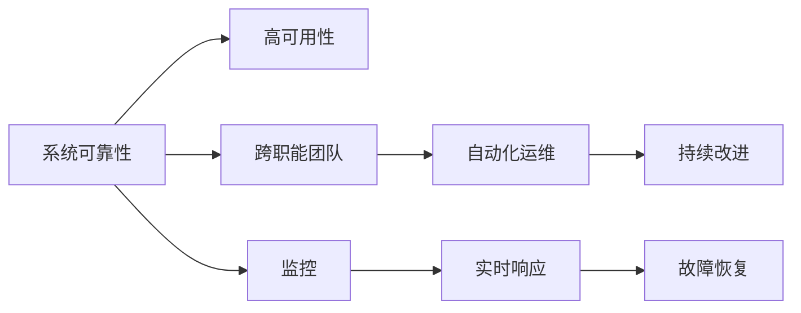

                 

## 1. 背景介绍

### 1.1 问题由来

随着互联网技术的迅猛发展，网站系统的复杂度和规模不断扩大。用户在享受丰富应用服务的同时，也对网站的可靠性提出了更高的要求。一个高可靠性的网站不仅需要提供快速响应和高可用性，还要确保数据的完整性、机密性和可用性。这不仅是对技术架构的挑战，更是对运维团队的专业能力的考验。

与此同时，越来越多的互联网企业开始重视站点可靠性工程（Site Reliability Engineering, SRE），将SRE作为保证系统可靠性的重要手段。SRE通过跨职能团队协作，关注系统设计、开发和运维的全生命周期，确保技术、流程和文化在各个环节中的协同作用，从而提升系统的可靠性。

### 1.2 问题核心关键点

SRE的核心目标是通过跨职能团队协作，构建高可靠性的系统。SRE的实施需要关注以下几个关键点：

- **跨职能团队协作**：SRE团队由开发和运维的复合型人才组成，同时关注代码质量和系统运维，实现从开发到运维的无缝衔接。
- **系统设计优化**：在系统设计阶段就考虑可靠性，合理设计架构、数据结构、接口协议等，减少系统设计和实现中的潜在风险。
- **自动化运维**：通过自动化工具和流程，减少人为错误，提高运维效率。
- **实时监控和响应**：通过实时监控和自动化响应，快速定位和解决问题，确保系统稳定运行。
- **持续改进**：不断评估和改进系统可靠性，持续优化运维流程和技术栈。

### 1.3 问题研究意义

研究SRE的方法论和实践，对于提升网站系统的可靠性和用户体验具有重要意义：

1. **提升用户体验**：高可靠性的系统能够保证用户快速、稳定地访问应用，减少用户等待和不满，提升满意度。
2. **降低运维成本**：通过自动化运维，减少人为错误，提升运维效率，降低运维成本。
3. **保障业务连续性**：高可靠性系统能够在故障发生时迅速恢复，保障业务的连续性。
4. **推动技术创新**：SRE实践不仅关注可靠性的提升，也推动了技术架构和运维工具的创新。
5. **增强团队协作**：SRE强调跨职能团队协作，推动技术团队与运维团队之间的紧密合作。

## 2. 核心概念与联系

### 2.1 核心概念概述

为更好地理解SRE的核心概念和机制，我们首先介绍以下几个关键概念：

- **系统可靠性（System Reliability）**：系统在运行时能够持续提供满足用户需求的服务。
- **高可用性（High Availability）**：系统能够保证在一定时间内不间断地提供服务，通常用"5个9"（99.999%）的可用性来衡量。
- **跨职能团队（Cross-Functional Team）**：由开发、运维、测试、设计等多个职能部门组成的复合型团队，共同关注系统可靠性。
- **自动化运维（Automated Operations）**：使用自动化工具和流程，减少人为错误，提升运维效率。
- **持续改进（Continuous Improvement）**：通过不断的评估和改进，持续优化系统的可靠性和运维流程。

这些概念之间的联系通过以下Mermaid流程图来展示：



这个流程图展示了系统可靠性与高可用性之间的联系，并通过跨职能团队、自动化运维和持续改进来保障系统可靠性。同时，监控、实时响应和故障恢复是系统可靠性的关键支撑点。

## 3. 核心算法原理 & 具体操作步骤

### 3.1 算法原理概述

SRE的实施离不开对系统可靠性的理论支撑，包括以下几个关键算法原理：

- **可用性计算**：通过公式计算系统在一定时间内的可用性，评估系统可靠性。
- **事件链分析**：通过事件链分析法，确定系统故障的根本原因，为后续改进提供数据支持。
- **负载均衡算法**：通过算法优化负载分配，减少资源瓶颈，提升系统性能。
- **容错设计**：通过设计容错机制，保证系统在部分组件故障时仍能正常运行。
- **故障恢复策略**：制定有效的故障恢复策略，在故障发生时迅速恢复正常服务。

### 3.2 算法步骤详解

SRE的实施步骤主要包括以下几个关键环节：

**Step 1: 系统设计和评估**

- 在项目启动阶段，进行系统设计和评估，确定系统的关键组件和架构，评估系统的可靠性需求和目标。
- 使用可靠性模型进行系统设计和架构评估，确定系统的可靠性指标和风险点。

**Step 2: 构建跨职能团队**

- 组建跨职能团队，包括开发、运维、测试、设计等多个职能部门。
- 明确团队目标和职责，制定协作流程和沟通机制，确保团队成员理解和认同SRE目标。

**Step 3: 实现自动化运维**

- 引入自动化工具和流程，减少人为错误，提升运维效率。
- 使用CI/CD管道，实现自动化构建、测试和部署。
- 实现自动化监控和告警，实时获取系统运行状态，及时发现问题。

**Step 4: 实施实时监控和响应**

- 部署实时监控系统，监控关键指标和告警信息。
- 制定快速响应的故障处理流程，明确团队成员的职责和任务。
- 使用自动化工具和脚本，快速定位和解决问题。

**Step 5: 实施故障恢复策略**

- 制定故障恢复策略，明确故障恢复流程和优先级。
- 使用自动化的故障恢复工具和脚本，快速恢复服务。
- 定期演练故障恢复策略，确保团队成员熟练掌握。

**Step 6: 持续改进**

- 定期评估系统可靠性和运维流程，找出问题和改进点。
- 优化系统设计和运维流程，减少潜在的风险和瓶颈。
- 引入新技术和工具，提升系统可靠性和运维效率。

### 3.3 算法优缺点

SRE方法论具有以下优点：

1. **提升系统可靠性**：通过系统设计和运维的全生命周期管理，确保系统可靠性和高可用性。
2. **提升运维效率**：通过自动化工具和流程，减少人为错误，提升运维效率。
3. **跨职能协作**：通过跨职能团队的协作，确保技术团队与运维团队之间的紧密合作，提升系统可靠性和用户体验。
4. **持续改进**：通过不断的评估和改进，持续优化系统可靠性和运维流程。

同时，SRE方法论也存在一些缺点：

1. **实施难度高**：SRE需要跨职能团队协作，实施难度较大，需要团队成员具备较高的技术水平和协作能力。
2. **资源投入大**：引入自动化工具和流程，需要一定的资金和资源投入。
3. **依赖技术水平**：SRE依赖团队成员的技术水平和经验，技术水平不足可能导致系统问题未能及时发现和解决。

### 3.4 算法应用领域

SRE方法论已经广泛应用于多个领域，包括：

- **互联网应用**：如电商平台、社交网络、在线教育等。
- **金融服务**：如银行系统、证券交易系统、保险系统等。
- **医疗系统**：如电子病历、药品管理系统、健康数据平台等。
- **智能制造**：如工业控制系统、智能工厂、物联网平台等。
- **公共服务**：如政府门户网站、公共信息平台、在线教育平台等。

## 4. 数学模型和公式 & 详细讲解 & 举例说明

### 4.1 数学模型构建

SRE方法论的数学模型主要包括以下几个关键概念：

- **可用性（Availability）**：表示系统在一定时间内提供服务的概率，通常用公式表示：
$$
A = \frac{U}{U+D+R}
$$
其中，$U$表示可用时间，$D$表示宕机时间，$R$表示恢复时间。
- **故障率（Failure Rate）**：表示系统在单位时间内发生故障的概率，通常用公式表示：
$$
F = \frac{D}{U}
$$
- **恢复时间（Recovery Time）**：表示系统从故障发生到恢复正常服务所需的时间，通常用公式表示：
$$
R = T_{R} - T_{D}
$$
其中，$T_{R}$表示恢复时间，$T_{D}$表示宕机时间。

### 4.2 公式推导过程

以下我们以一个简单的系统为例，推导可用性和故障率的计算公式。

假设一个系统的可用时间为$U = 8760$小时，宕机时间为$D = 30$小时，恢复时间为$R = 10$小时。

**计算可用性**：
$$
A = \frac{U}{U+D+R} = \frac{8760}{8760+30+10} = \frac{8760}{8800} \approx 99.09\%
$$

**计算故障率**：
$$
F = \frac{D}{U} = \frac{30}{8760} \approx 0.0034\%
$$

通过这些计算公式，可以评估系统的可靠性和设计是否满足要求，并根据实际情况进行优化。

### 4.3 案例分析与讲解

以一家大型电商平台的订单系统为例，展示SRE如何保障系统可靠性：

1. **系统设计**：订单系统采用微服务架构，通过服务划分减少系统复杂性，提高系统可维护性。
2. **跨职能团队**：组建由开发、运维、测试、设计等多职能部门组成的SRE团队，共同关注系统可靠性。
3. **自动化运维**：使用CI/CD管道实现自动化构建、测试和部署，使用自动化监控和告警系统，实时获取系统运行状态。
4. **实时监控和响应**：部署实时监控系统，监控关键指标和告警信息，制定快速响应的故障处理流程。
5. **故障恢复策略**：制定故障恢复策略，确保系统在故障发生时迅速恢复正常服务。
6. **持续改进**：定期评估系统可靠性和运维流程，优化系统设计和运维流程。

通过这些措施，该电商平台的订单系统实现了高可靠性和高可用性，保障了用户的购物体验。

## 5. 项目实践：代码实例和详细解释说明

### 5.1 开发环境搭建

在进行SRE项目实践前，我们需要准备好开发环境。以下是使用Python进行Django开发的开发环境配置流程：

1. 安装Anaconda：从官网下载并安装Anaconda，用于创建独立的Python环境。

2. 创建并激活虚拟环境：
```bash
conda create -n sre-env python=3.8 
conda activate sre-env
```

3. 安装Django：
```bash
pip install django
```

4. 安装相关库：
```bash
pip install Pillow django-cors-headers django-rq
```

5. 安装PostgreSQL数据库：
```bash
brew install postgresql
```

6. 配置数据库：
```bash
createdb sre_db
psql -U postgres -d sre_db -c "CREATE USER sre_user WITH PASSWORD 'sre_password';"
psql -U postgres -d sre_db -c "ALTER USER sre_user SET search_path TO sre_db;"
```

完成上述步骤后，即可在`sre-env`环境中开始SRE项目的开发实践。

### 5.2 源代码详细实现

下面我们以一个简单的故障监控系统为例，展示SRE项目的具体实现。

首先，定义故障监控系统的数据模型：

```python
from django.db import models

class Event(models.Model):
    event_type = models.CharField(max_length=100)
    event_time = models.DateTimeField(auto_now_add=True)
    event_message = models.TextField()

    def __str__(self):
        return self.event_type
```

然后，定义故障监控系统的前端页面：

```html
<!DOCTYPE html>
<html>
<head>
    <title>SRE故障监控系统</title>
</head>
<body>
    <h1>故障监控系统</h1>
    <ul>
        
            <li>{{ event.event_type }} - {{ event.event_time }} - {{ event.event_message }}</li>
        
    </ul>
</body>
</html>
```

接下来，定义故障监控系统的后端逻辑：

```python
from django.shortcuts import render
from .models import Event

def event_list(request):
    events = Event.objects.all()
    return render(request, 'sre/event_list.html', {'events': events})
```

最后，启动故障监控系统的开发流程并在前端页面上展示故障信息：

```python
from django.urls import path
from . import views

urlpatterns = [
    path('events/', views.event_list, name='event_list'),
]
```

以上就是使用Django框架实现简单的故障监控系统的完整代码实现。可以看到，SRE项目开发的基本流程与其他Web项目类似，通过定义数据模型、前端页面和后端逻辑，实现系统功能。

### 5.3 代码解读与分析

让我们再详细解读一下关键代码的实现细节：

**数据模型**：
- `Event`模型定义了故障事件的基本信息，包括事件类型、发生时间和事件描述。

**前端页面**：
- HTML页面展示故障事件列表，通过循环展示每个事件的详细信息。

**后端逻辑**：
- `event_list`函数查询数据库中的所有故障事件，并将结果渲染到前端页面上。

**URL映射**：
- `urlpatterns`定义了系统的URL映射关系，将`event_list`函数映射到`/events/`路径。

可以看到，Django框架的简洁性和易用性使得SRE项目开发变得相对简单，开发者可以快速实现功能并进行测试。

## 6. 实际应用场景

### 6.1 电商平台的订单系统

电商平台是典型的互联网应用场景，订单系统的高可靠性和高可用性对用户体验至关重要。通过SRE方法论，可以保障订单系统的稳定运行，提升用户满意度。

具体措施包括：

- **系统设计**：采用微服务架构，提高系统的可维护性和扩展性。
- **跨职能团队**：组建由开发、运维、测试、设计等多个职能部门组成的SRE团队，共同关注系统可靠性。
- **自动化运维**：使用CI/CD管道实现自动化构建、测试和部署，使用自动化监控和告警系统，实时获取系统运行状态。
- **实时监控和响应**：部署实时监控系统，监控关键指标和告警信息，制定快速响应的故障处理流程。
- **故障恢复策略**：制定故障恢复策略，确保系统在故障发生时迅速恢复正常服务。
- **持续改进**：定期评估系统可靠性和运维流程，优化系统设计和运维流程。

通过这些措施，电商平台的订单系统实现了高可靠性和高可用性，保障了用户的购物体验。

### 6.2 金融系统的交易系统

金融系统是典型的金融服务场景，交易系统的高可靠性和高可用性对业务连续性至关重要。通过SRE方法论，可以保障交易系统的稳定运行，确保业务的连续性。

具体措施包括：

- **系统设计**：采用分布式架构，提高系统的可用性和扩展性。
- **跨职能团队**：组建由开发、运维、测试、设计等多个职能部门组成的SRE团队，共同关注系统可靠性。
- **自动化运维**：使用CI/CD管道实现自动化构建、测试和部署，使用自动化监控和告警系统，实时获取系统运行状态。
- **实时监控和响应**：部署实时监控系统，监控关键指标和告警信息，制定快速响应的故障处理流程。
- **故障恢复策略**：制定故障恢复策略，确保系统在故障发生时迅速恢复正常服务。
- **持续改进**：定期评估系统可靠性和运维流程，优化系统设计和运维流程。

通过这些措施，金融系统的交易系统实现了高可靠性和高可用性，保障了业务的连续性。

### 6.3 医疗系统的电子病历系统

医疗系统是典型的医疗服务场景，电子病历系统的高可靠性和高可用性对医疗数据的安全性和完整性至关重要。通过SRE方法论，可以保障电子病历系统的稳定运行，确保医疗数据的安全性和完整性。

具体措施包括：

- **系统设计**：采用分布式架构，提高系统的可用性和扩展性。
- **跨职能团队**：组建由开发、运维、测试、设计等多个职能部门组成的SRE团队，共同关注系统可靠性。
- **自动化运维**：使用CI/CD管道实现自动化构建、测试和部署，使用自动化监控和告警系统，实时获取系统运行状态。
- **实时监控和响应**：部署实时监控系统，监控关键指标和告警信息，制定快速响应的故障处理流程。
- **故障恢复策略**：制定故障恢复策略，确保系统在故障发生时迅速恢复正常服务。
- **持续改进**：定期评估系统可靠性和运维流程，优化系统设计和运维流程。

通过这些措施，医疗系统的电子病历系统实现了高可靠性和高可用性，保障了医疗数据的安全性和完整性。

### 6.4 智能制造的工业控制系统

智能制造是典型的智能制造场景，工业控制系统的高可靠性和高可用性对生产线的稳定性和安全性至关重要。通过SRE方法论，可以保障工业控制系统的稳定运行，确保生产线的稳定性和安全性。

具体措施包括：

- **系统设计**：采用分布式架构，提高系统的可用性和扩展性。
- **跨职能团队**：组建由开发、运维、测试、设计等多个职能部门组成的SRE团队，共同关注系统可靠性。
- **自动化运维**：使用CI/CD管道实现自动化构建、测试和部署，使用自动化监控和告警系统，实时获取系统运行状态。
- **实时监控和响应**：部署实时监控系统，监控关键指标和告警信息，制定快速响应的故障处理流程。
- **故障恢复策略**：制定故障恢复策略，确保系统在故障发生时迅速恢复正常服务。
- **持续改进**：定期评估系统可靠性和运维流程，优化系统设计和运维流程。

通过这些措施，智能制造的工业控制系统实现了高可靠性和高可用性，保障了生产线的稳定性和安全性。

## 7. 工具和资源推荐

### 7.1 学习资源推荐

为了帮助开发者系统掌握SRE的理论基础和实践技巧，这里推荐一些优质的学习资源：

1. **《Site Reliability Engineering: How Google Runs Production Systems》**：Google官方出版，介绍了Google公司内部如何进行站点可靠性工程的实践经验，涵盖系统设计、运维流程和工具等多个方面。
2. **《Microservices: Principles and Patterns》**：O'Reilly出版社出版，介绍了微服务架构的设计原则和实现模式，是SRE项目中的重要参考书籍。
3. **《Building Web Services with Python and Django》**：O'Reilly出版社出版，介绍了使用Django框架构建Web服务系统的实践经验，涵盖项目开发、测试和部署等多个环节。
4. **《Django Web Development》**：O'Reilly出版社出版，介绍了使用Django框架开发Web应用程序的实践经验，涵盖数据模型、视图、URL映射等多个方面。
5. **《Building Reliable and Robust Systems: An Introduction to SRE》**：O'Reilly出版社出版，介绍了构建可靠和稳健系统的实践经验，涵盖系统设计、运维流程和工具等多个方面。

通过对这些资源的学习实践，相信你一定能够快速掌握SRE的精髓，并用于解决实际的系统可靠性问题。

### 7.2 开发工具推荐

高效的开发离不开优秀的工具支持。以下是几款用于SRE开发的常用工具：

1. **Django框架**：Python的Web开发框架，支持快速构建Web应用，拥有丰富的第三方库和插件，适合SRE项目开发。
2. **CI/CD工具**：如Jenkins、Travis CI、CircleCI等，实现自动化构建、测试和部署，提升开发效率。
3. **监控工具**：如Prometheus、Grafana、ELK Stack等，实时监控系统状态，支持告警和可视化分析。
4. **故障恢复工具**：如Kubernetes、Rocket.Chat等，提供容器化运维和协作工具，支持故障恢复和告警。
5. **日志管理工具**：如Elasticsearch、Fluentd等，集中管理和分析日志，提供丰富的搜索和分析功能。

合理利用这些工具，可以显著提升SRE项目的开发效率，加快创新迭代的步伐。

### 7.3 相关论文推荐

SRE实践源于学界的持续研究。以下是几篇奠基性的相关论文，推荐阅读：

1. **《Site Reliability Engineering: A Practitioner's Approach to Understanding and Implementing Reliable Systems》**：Betsy Beyer等人，介绍了SRE的基本概念、实践和案例，是SRE实践的重要参考书籍。
2. **《Towards a Unified Theory of Reliability and Availability: Reliability as Availability》**：H.A. Chau等人，深入探讨了系统可靠性和可用性的理论基础，提供了系统的数学建模和分析方法。
3. **《The Rise of SRE》**：Vincent Wilcox等人，介绍了SRE在Google公司内部的发展历程和实践经验，涵盖了系统设计、运维流程和工具等多个方面。
4. **《Site Reliability Engineering in Production at Netflix》**：Netflix公司官方博客，介绍了Netflix内部的SRE实践经验，涵盖了系统设计、运维流程和工具等多个方面。
5. **《Site Reliability Engineering in Production at Google》**：Google公司官方博客，介绍了Google内部的SRE实践经验，涵盖了系统设计、运维流程和工具等多个方面。

这些论文代表了大规模系统可靠性的前沿研究，通过学习这些前沿成果，可以帮助研究者把握SRE实践的方向，激发更多的创新灵感。

## 8. 总结：未来发展趋势与挑战

### 8.1 总结

本文对SRE方法论进行了全面系统的介绍。首先阐述了SRE背景和意义，明确了跨职能团队协作、系统设计优化、自动化运维、实时监控和响应等关键点。其次，从原理到实践，详细讲解了SRE的数学模型和关键步骤，给出了SRE项目开发的完整代码实例。同时，本文还广泛探讨了SRE方法论在电商、金融、医疗、智能制造等多个领域的应用前景，展示了SRE范式的巨大潜力。

通过本文的系统梳理，可以看到，SRE方法论在大规模系统可靠性保障方面具有重要价值。这些方法能够通过跨职能团队协作、系统设计和运维的全生命周期管理，确保系统可靠性和高可用性。未来，随着SRE方法的不断演进和优化，相信大规模系统将更加稳定、可靠、高效。

### 8.2 未来发展趋势

展望未来，SRE方法论将呈现以下几个发展趋势：

1. **自动化程度提升**：随着自动化工具和流程的不断成熟，SRE的自动化程度将进一步提升，减少人为错误，提升运维效率。
2. **跨职能协作深入**：跨职能团队的协作将更加紧密，技术团队与运维团队的合作将更加深入，确保系统可靠性和高可用性。
3. **持续改进成为常态**：通过不断的评估和改进，持续优化系统可靠性和运维流程，提升系统的稳定性和性能。
4. **新工具和技术的引入**：随着新技术和新工具的不断涌现，SRE将引入更多高效的工具和方法，提升系统可靠性和运维效率。
5. **系统设计和运维的协同优化**：SRE将更加注重系统设计和运维的协同优化，通过跨职能团队的紧密合作，确保系统的高可靠性和高可用性。

以上趋势凸显了SRE方法论的广阔前景，这些方向的探索发展，必将进一步提升大规模系统的可靠性和用户体验。

### 8.3 面临的挑战

尽管SRE方法论已经取得了显著成效，但在迈向更加智能化、普适化应用的过程中，它仍面临诸多挑战：

1. **实施难度高**：SRE需要跨职能团队协作，实施难度较大，需要团队成员具备较高的技术水平和协作能力。
2. **资源投入大**：引入自动化工具和流程，需要一定的资金和资源投入。
3. **依赖技术水平**：SRE依赖团队成员的技术水平和经验，技术水平不足可能导致系统问题未能及时发现和解决。
4. **系统复杂度增加**：随着系统规模的扩大，系统的复杂度不断增加，对SRE的实施提出了更高的要求。
5. **故障恢复复杂**：在高可用性系统设计中，故障恢复的复杂度不断增加，需要更多的技术和工具支持。

正视SRE面临的这些挑战，积极应对并寻求突破，将是大规模系统可靠性保障的关键。相信随着学界和产业界的共同努力，这些挑战终将一一被克服，SRE方法论必将在构建高可靠系统方面发挥更大的作用。

### 8.4 研究展望

面对SRE所面临的挑战，未来的研究需要在以下几个方面寻求新的突破：

1. **自动化工具和流程的优化**：开发更加高效和灵活的自动化工具和流程，减少人为错误，提升运维效率。
2. **跨职能团队的协作优化**：优化跨职能团队的协作机制，提升团队成员之间的沟通和合作，确保系统可靠性和高可用性。
3. **新工具和技术的引入**：引入新技术和新工具，提升系统可靠性和运维效率，如容器化、微服务架构等。
4. **系统设计和运维的协同优化**：通过跨职能团队的紧密合作，确保系统设计和运维的协同优化，提升系统的高可靠性和高可用性。
5. **故障恢复策略的优化**：制定更加高效的故障恢复策略，确保系统在故障发生时迅速恢复正常服务。

这些研究方向的探索，必将引领SRE方法论迈向更高的台阶，为构建高可靠系统提供更多技术支持。只有勇于创新、敢于突破，才能不断拓展SRE的边界，提升大规模系统的可靠性和用户体验。

## 9. 附录：常见问题与解答

**Q1：SRE的实施难度大吗？**

A: SRE的实施确实需要跨职能团队协作，实施难度较大，需要团队成员具备较高的技术水平和协作能力。但随着SRE方法的不断演进和优化，SRE的实施难度也在逐步降低，越来越多的企业开始采用SRE方法论。

**Q2：如何降低SRE的资源投入？**

A: 引入自动化工具和流程，可以减少人为错误，提升运维效率，从而降低SRE的资源投入。使用容器化技术，如Kubernetes、Docker等，可以优化资源使用，提升系统的扩展性和可靠性。

**Q3：如何提升SRE的实施效果？**

A: 通过跨职能团队的紧密合作，确保系统可靠性和高可用性。定期评估和改进系统可靠性，优化系统设计和运维流程，引入新技术和新工具，提升系统可靠性和运维效率。

**Q4：如何应对SRE的挑战？**

A: 优化自动化工具和流程，提升跨职能团队的协作效率，引入新技术和新工具，优化系统设计和运维流程，制定高效的故障恢复策略，确保系统在故障发生时迅速恢复正常服务。

**Q5：SRE的未来发展趋势是什么？**

A: SRE的自动化程度将进一步提升，跨职能团队的协作将更加紧密，持续改进成为常态，引入更多高效的工具和方法，系统设计和运维的协同优化将更加深入。

这些问题的解答展示了SRE方法论在实施过程中需要注意的关键点和应对策略，相信通过系统学习和实践，SRE方法论将在更多企业中得到应用和推广，为构建高可靠系统提供更多的实践经验和技术支持。

---

作者：禅与计算机程序设计艺术 / Zen and the Art of Computer Programming

