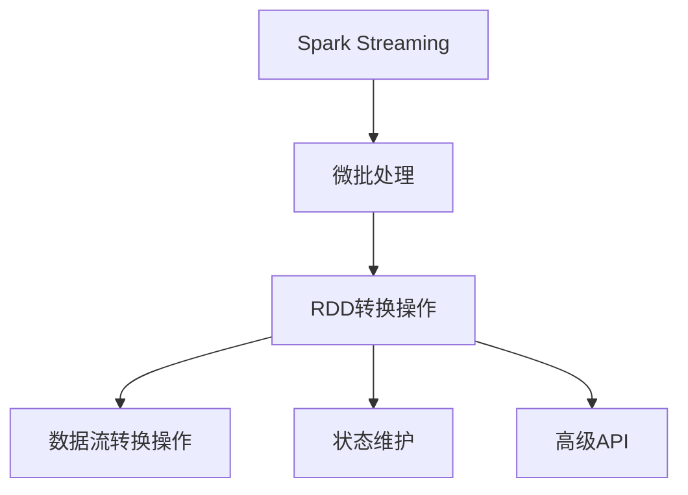

                 

# Spark Streaming 原理与代码实例讲解

> 关键词：Spark Streaming, 实时数据流处理, 微批处理, RDD转换操作, 状态维护, 高级API

## 1. 背景介绍

### 1.1 问题由来
随着互联网和物联网技术的飞速发展，实时数据流的生成与处理成为了当今大数据时代的重要课题。传统的数据仓库和批处理系统难以满足实时性和交互性需求，实时流处理技术应运而生。Spark Streaming作为Apache Spark的一个重要组件，以微批处理为核心，提供了一套完整且高效的流处理解决方案。

### 1.2 问题核心关键点
Spark Streaming的主要特点包括：
1. **微批处理**：将实时数据流划分为固定大小的时间窗口进行处理，每个时间窗口内的数据在内存中批处理，以提高处理效率。
2. **容错性**：支持数据重放和自动重启机制，保证数据处理不会因为单个任务故障而失败。
3. **可扩展性**：基于Spark的弹性计算框架，支持动态扩展集群资源，满足不同规模的数据处理需求。
4. **易用性**：提供简单易用的API接口，开发者可以方便地进行数据流的采集、处理和分析。

### 1.3 问题研究意义
研究Spark Streaming的原理与代码实现，对于提升实时数据流的处理能力和效率，以及构建高效、稳定、可扩展的流处理系统，具有重要意义。此外，深入理解Spark Streaming的工作机制和实现细节，还能帮助开发者更好地优化代码性能，提高数据处理的质量和可靠性。

## 2. 核心概念与联系

### 2.1 核心概念概述

为更好地理解Spark Streaming的工作原理和实现，本节将介绍几个密切相关的核心概念：

- **Spark Streaming**：Apache Spark的一个子模块，专注于实时流数据的处理，提供微批处理的架构。
- **微批处理**：将实时数据流分成固定时间窗口，在每个时间窗口内进行批处理，以提高效率。
- **Resilient Distributed Dataset (RDD)**：Spark的核心数据结构，用于分布式并行计算，支持一系列的操作和转换。
- **数据流转换操作**：包括map、filter、reduceByKey、join等，用于对微批数据进行处理和转换。
- **状态维护**：通过RDD的状态管理机制，实现对流数据的持久化和维护。
- **高级API**：提供流处理高级API，支持窗口化操作、定时器等复杂逻辑。

这些概念之间的逻辑关系可以通过以下Mermaid流程图来展示：



这个流程图展示出Spark Streaming的核心概念及其之间的关系：

1. Spark Streaming基于微批处理，将实时数据流划分为固定大小的时间窗口。
2. 在每个时间窗口内，Spark Streaming使用RDD进行分布式并行计算。
3. RDD支持一系列转换操作，对数据进行处理和聚合。
4. 利用RDD的状态管理机制，可以实现对流数据的持久化和状态维护。
5. 通过高级API，实现复杂的窗口化操作、定时器等高级逻辑。

这些概念共同构成了Spark Streaming的数据处理框架，使其能够高效、稳定地处理大规模实时数据流。

## 3. 核心算法原理 & 具体操作步骤

### 3.1 算法原理概述

Spark Streaming的核心算法原理是基于微批处理和时间窗口机制的。其基本流程如下：

1. **数据采集**：从外部数据源（如Kafka、Flume等）读取实时数据流。
2. **批处理**：将实时数据流划分为固定大小的时间窗口，在每个时间窗口内进行批处理。
3. **数据转换**：使用RDD的转换操作对批数据进行处理和转换。
4. **状态维护**：利用RDD的状态管理机制，实现对流数据的持久化和状态维护。
5. **高级操作**：通过高级API实现窗口化、定时器等复杂逻辑。
6. **结果输出**：将处理结果定期输出到外部存储或可视化系统。

Spark Streaming的微批处理机制通过固定时间窗口的划分，保证了数据处理的实时性和一致性。同时，RDD的分布式计算和状态管理机制，确保了数据处理的高效性和容错性。

### 3.2 算法步骤详解

#### 3.2.1 数据采集

Spark Streaming支持多种数据源，包括Kafka、Flume、HDFS等。以下以Kafka数据源为例，展示数据采集的过程：

```python
from pyspark.streaming import StreamingContext
from pyspark.streaming.kafka import KafkaUtils

# 创建Spark Streaming上下文
sc = StreamingContext(spark, batch_interval)

# 创建Kafka数据流，指定Kafka主题和分区信息
kafka_stream = KafkaUtils.createDirectStream(
    sc,
    {"my-topic": 0},
    {"bootstrap.servers": "localhost:9092"}
)

# 打印流数据
kafka_stream.foreachRDD(lambda rdd: print(rdd.collect()))
```

在上述代码中，首先创建Spark Streaming上下文，并指定微批处理时间间隔（batch_interval）。然后使用KafkaUtils.createDirectStream创建Kafka数据流，指定Kafka主题和分区信息。最后，通过foreachRDD方法对Kafka数据流进行处理，并打印数据。

#### 3.2.2 批处理

Spark Streaming将实时数据流划分为固定大小的时间窗口，通常每个时间窗口的大小为2-10秒。在每个时间窗口内，Spark Streaming将数据作为RDD进行批处理。以下是一个批处理的例子：

```python
# 计算每个时间窗口内的单词计数
word_counts = kafka_stream.map(lambda x: x.split(" ")).map(lambda x: (x, 1)).reduceByKey(lambda x, y: x + y)
```

在上述代码中，通过map方法将数据流分割成单词列表，再通过map方法将单词计数转换为(key, value)对，并使用reduceByKey方法对计数进行聚合。

#### 3.2.3 数据转换

Spark Streaming提供了多种数据转换操作，包括map、filter、reduceByKey、join等。以下是一个reduceByKey操作的例子：

```python
# 计算每个时间窗口内的单词计数，并保留前10个单词
word_counts = kafka_stream.map(lambda x: x.split(" ")).map(lambda x: (x, 1)).reduceByKey(lambda x, y: x + y)
result = word_counts.takeOrdered(10, key=lambda x: -x[1])
```

在上述代码中，通过reduceByKey方法对单词计数进行聚合，并使用takeOrdered方法取出前10个计数最高的单词。

#### 3.2.4 状态维护

Spark Streaming利用RDD的状态管理机制，实现对流数据的持久化和状态维护。以下是一个状态维护的例子：

```python
# 使用状态管理机制实现单词计数器
word_counts = kafka_stream.map(lambda x: x.split(" ")).map(lambda x: (x, 1)).reduceByKey(lambda x, y: x + y).updateStateByKey(lambda state, new: state + new)
```

在上述代码中，通过updateStateByKey方法对单词计数器进行状态更新。

#### 3.2.5 高级操作

Spark Streaming提供了多种高级API，支持窗口化操作、定时器等复杂逻辑。以下是一个窗口化操作的例子：

```python
# 计算每个时间窗口内的单词计数，并统计窗口内单词总计数
window_size = 10
windowed_word_counts = kafka_stream.map(lambda x: x.split(" ")).map(lambda x: (x, 1)).reduceByKey(lambda x, y: x + y).window(window_size).reduce(lambda x, y: x + y)
total_counts = word_counts.map(lambda x: (x, sum(x[1] for x in windowed_word_counts[1])))
```

在上述代码中，通过window方法将数据流分组为大小为10的时间窗口，并使用reduce方法对每个窗口内的单词计数进行聚合。最后，通过map方法计算窗口内单词总计数。

### 3.3 算法优缺点

Spark Streaming的主要优点包括：
1. **实时处理**：基于微批处理机制，确保数据处理的实时性和一致性。
2. **高效率**：利用RDD的分布式计算机制，提高数据处理的效率。
3. **易用性**：提供简单易用的API接口，开发者可以快速上手。
4. **可扩展性**：基于Spark的弹性计算框架，支持动态扩展集群资源。

同时，Spark Streaming也存在一些缺点：
1. **资源占用**：批处理机制需要较大的内存和计算资源，可能带来资源开销。
2. **延迟较大**：批处理机制可能导致数据延迟较大，不适合对实时性要求极高的场景。
3. **复杂性**：高级API的使用可能增加代码复杂性，需要开发者具备一定的技术背景。

尽管存在这些局限性，Spark Streaming仍然是大规模实时数据处理的重要工具，广泛应用于日志分析、实时监控、流数据可视化等多个领域。

### 3.4 算法应用领域

Spark Streaming适用于多种实时数据流处理场景，包括但不限于：

- **日志分析**：实时监控系统日志，进行错误分析、性能优化等。
- **实时监控**：实时监控网络流量、设备状态等，进行异常检测和故障预警。
- **流数据可视化**：实时处理流数据，并通过可视化系统展示分析结果。
- **机器学习训练**：实时处理训练数据，进行在线学习，更新模型参数。
- **广告投放**：实时处理广告点击数据，进行广告效果分析、投放优化等。

此外，Spark Streaming还被应用于金融风控、物联网设备监控、智能推荐系统等多个领域，为实时数据流处理提供了强有力的技术支持。

## 4. 数学模型和公式 & 详细讲解 & 举例说明

### 4.1 数学模型构建

Spark Streaming的数学模型主要基于微批处理和RDD转换操作。以下是一个简单的数学模型构建过程：

假设实时数据流为 $\{d_t\}_{t=1}^{\infty}$，其中 $d_t$ 表示第 $t$ 个数据点的值。将数据流划分为大小为 $\Delta t$ 的时间窗口 $T_t=[t\Delta t, (t+1)\Delta t)$，则每个时间窗口内的数据流可以表示为：

$$
D_t = \{d_{t\Delta t}, d_{t\Delta t + 1}, \ldots, d_{(t+1)\Delta t - 1}\}
$$

在每个时间窗口 $T_t$ 内，Spark Streaming将数据流作为RDD进行批处理。假设批处理后的RDD为 $R_t = \{(r_{t,i})\}_{i=1}^{N_t}$，则批处理后的数据流可以表示为：

$$
R_t = \{d_{t\Delta t}, d_{t\Delta t + 1}, \ldots, d_{(t+1)\Delta t - 1}\}
$$

其中 $N_t$ 表示时间窗口 $T_t$ 内数据的数量。

### 4.2 公式推导过程

以下以一个简单的单词计数为例，推导Spark Streaming的计算过程：

假设实时数据流为 $\{d_t\}_{t=1}^{\infty}$，其中 $d_t$ 表示第 $t$ 个数据点的值。将数据流划分为大小为 $\Delta t$ 的时间窗口 $T_t=[t\Delta t, (t+1)\Delta t)$，则每个时间窗口内的数据流可以表示为：

$$
D_t = \{d_{t\Delta t}, d_{t\Delta t + 1}, \ldots, d_{(t+1)\Delta t - 1}\}
$$

在每个时间窗口 $T_t$ 内，Spark Streaming将数据流作为RDD进行批处理。假设批处理后的RDD为 $R_t = \{(r_{t,i})\}_{i=1}^{N_t}$，则批处理后的数据流可以表示为：

$$
R_t = \{d_{t\Delta t}, d_{t\Delta t + 1}, \ldots, d_{(t+1)\Delta t - 1}\}
$$

其中 $N_t$ 表示时间窗口 $T_t$ 内数据的数量。假设每个数据点 $d_t$ 由单词 $w_t$ 组成，则单词计数可以表示为：

$$
C_t = \{(c_{t,i}, w_{t,i})\}_{i=1}^{N_t}
$$

其中 $c_{t,i}$ 表示单词 $w_{t,i}$ 在时间窗口 $T_t$ 内的计数。

### 4.3 案例分析与讲解

假设有一个实时数据流 $\{d_t\}_{t=1}^{\infty}$，其中 $d_t$ 表示第 $t$ 个数据点的值。将数据流划分为大小为 $\Delta t$ 的时间窗口 $T_t=[t\Delta t, (t+1)\Delta t)$，则每个时间窗口内的数据流可以表示为：

$$
D_t = \{d_{t\Delta t}, d_{t\Delta t + 1}, \ldots, d_{(t+1)\Delta t - 1}\}
$$

在每个时间窗口 $T_t$ 内，Spark Streaming将数据流作为RDD进行批处理。假设批处理后的RDD为 $R_t = \{(r_{t,i})\}_{i=1}^{N_t}$，则批处理后的数据流可以表示为：

$$
R_t = \{d_{t\Delta t}, d_{t\Delta t + 1}, \ldots, d_{(t+1)\Delta t - 1}\}
$$

其中 $N_t$ 表示时间窗口 $T_t$ 内数据的数量。假设每个数据点 $d_t$ 由单词 $w_t$ 组成，则单词计数可以表示为：

$$
C_t = \{(c_{t,i}, w_{t,i})\}_{i=1}^{N_t}
$$

其中 $c_{t,i}$ 表示单词 $w_{t,i}$ 在时间窗口 $T_t$ 内的计数。

例如，假设实时数据流为 $\{d_t\}_{t=1}^{\infty}$，其中 $d_t$ 表示第 $t$ 个数据点的值。将数据流划分为大小为 $\Delta t$ 的时间窗口 $T_t=[t\Delta t, (t+1)\Delta t)$，则每个时间窗口内的数据流可以表示为：

$$
D_t = \{d_{t\Delta t}, d_{t\Delta t + 1}, \ldots, d_{(t+1)\Delta t - 1}\}
$$

在每个时间窗口 $T_t$ 内，Spark Streaming将数据流作为RDD进行批处理。假设批处理后的RDD为 $R_t = \{(r_{t,i})\}_{i=1}^{N_t}$，则批处理后的数据流可以表示为：

$$
R_t = \{d_{t\Delta t}, d_{t\Delta t + 1}, \ldots, d_{(t+1)\Delta t - 1}\}
$$

其中 $N_t$ 表示时间窗口 $T_t$ 内数据的数量。假设每个数据点 $d_t$ 由单词 $w_t$ 组成，则单词计数可以表示为：

$$
C_t = \{(c_{t,i}, w_{t,i})\}_{i=1}^{N_t}
$$

其中 $c_{t,i}$ 表示单词 $w_{t,i}$ 在时间窗口 $T_t$ 内的计数。例如，假设实时数据流为 $\{d_t\}_{t=1}^{\infty}$，其中 $d_t$ 表示第 $t$ 个数据点的值。将数据流划分为大小为 $\Delta t$ 的时间窗口 $T_t=[t\Delta t, (t+1)\Delta t)$，则每个时间窗口内的数据流可以表示为：

$$
D_t = \{d_{t\Delta t}, d_{t\Delta t + 1}, \ldots, d_{(t+1)\Delta t - 1}\}
$$

在每个时间窗口 $T_t$ 内，Spark Streaming将数据流作为RDD进行批处理。假设批处理后的RDD为 $R_t = \{(r_{t,i})\}_{i=1}^{N_t}$，则批处理后的数据流可以表示为：

$$
R_t = \{d_{t\Delta t}, d_{t\Delta t + 1}, \ldots, d_{(t+1)\Delta t - 1}\}
$$

其中 $N_t$ 表示时间窗口 $T_t$ 内数据的数量。假设每个数据点 $d_t$ 由单词 $w_t$ 组成，则单词计数可以表示为：

$$
C_t = \{(c_{t,i}, w_{t,i})\}_{i=1}^{N_t}
$$

其中 $c_{t,i}$ 表示单词 $w_{t,i}$ 在时间窗口 $T_t$ 内的计数。

## 5. 项目实践：代码实例和详细解释说明

### 5.1 开发环境搭建

在进行Spark Streaming开发前，我们需要准备好开发环境。以下是使用Python进行PySpark开发的环境配置流程：

1. 安装Anaconda：从官网下载并安装Anaconda，用于创建独立的Python环境。

2. 创建并激活虚拟环境：
```bash
conda create -n pyspark-env python=3.8 
conda activate pyspark-env
```

3. 安装PySpark：根据CUDA版本，从官网获取对应的安装命令。例如：
```bash
conda install pyspark -c conda-forge
```

4. 安装Kafka：根据操作系统，从官网下载并安装Kafka，并启动Kafka服务。

5. 安装flume：根据操作系统，从官网下载并安装flume，并启动flume服务。

完成上述步骤后，即可在`pyspark-env`环境中开始Spark Streaming实践。

### 5.2 源代码详细实现

下面我们以Kafka流数据处理为例，给出使用PySpark进行Spark Streaming开发的代码实现。

首先，定义Kafka数据源：

```python
from pyspark import SparkContext, StreamingContext
from pyspark.streaming import KafkaUtils

# 创建Spark上下文
sc = SparkContext("local", "Spark Streaming Example")
ssc = StreamingContext(sc, 2)

# 创建Kafka数据流，指定Kafka主题和分区信息
kafka_stream = KafkaUtils.createDirectStream(
    ssc,
    {"my-topic": 0},
    {"bootstrap.servers": "localhost:9092"}
)
```

然后，进行批处理和数据转换：

```python
# 计算每个时间窗口内的单词计数
word_counts = kafka_stream.map(lambda x: x.split(" ")).map(lambda x: (x, 1)).reduceByKey(lambda x, y: x + y)

# 计算每个时间窗口内单词计数，并保留前10个单词
window_size = 10
windowed_word_counts = word_counts.window(window_size).reduce(lambda x, y: x + y)
result = word_counts.map(lambda x: (x, sum(x[1] for x in windowed_word_counts[1])))
```

最后，启动Spark Streaming上下文，并定期输出结果：

```python
ssc.start()
ssc.awaitTermination()
```

以上就是使用PySpark进行Spark Streaming开发的完整代码实现。可以看到，利用PySpark的Spark Streaming模块，开发者可以方便地进行Kafka数据流的采集、批处理和数据转换，实现实时数据流的处理。

### 5.3 代码解读与分析

让我们再详细解读一下关键代码的实现细节：

**Kafka数据源定义**：
- `KafkaUtils.createDirectStream`方法：用于创建Kafka数据流，指定Kafka主题和分区信息。

**批处理和数据转换**：
- `word_counts`：通过map方法将数据流分割成单词列表，再通过map方法将单词计数转换为(key, value)对，并使用reduceByKey方法对计数进行聚合。
- `windowed_word_counts`：通过window方法将数据流分组为大小为10的时间窗口，并使用reduce方法对每个窗口内的单词计数进行聚合。
- `result`：通过map方法计算窗口内单词总计数。

**启动Spark Streaming上下文**：
- `ssc.start()`：启动Spark Streaming上下文。
- `ssc.awaitTermination()`：等待Spark Streaming上下文结束。

可以看到，通过PySpark的Spark Streaming模块，开发者可以方便地进行Kafka数据流的采集、批处理和数据转换，实现实时数据流的处理。

当然，工业级的系统实现还需考虑更多因素，如日志记录、异常处理、状态保存等。但核心的Spark Streaming流程基本与此类似。

## 6. 实际应用场景

### 6.1 日志分析

Spark Streaming在日志分析中有着广泛的应用。通过实时采集系统日志，Spark Streaming可以进行错误分析、性能优化、异常检测等，帮助运维人员及时发现问题，保证系统的稳定运行。

例如，假设有一个系统日志流 $\{d_t\}_{t=1}^{\infty}$，其中 $d_t$ 表示第 $t$ 个数据点的值。将日志流划分为大小为 $\Delta t$ 的时间窗口 $T_t=[t\Delta t, (t+1)\Delta t)$，则每个时间窗口内的数据流可以表示为：

$$
D_t = \{d_{t\Delta t}, d_{t\Delta t + 1}, \ldots, d_{(t+1)\Delta t - 1}\}
$$

在每个时间窗口 $T_t$ 内，Spark Streaming将数据流作为RDD进行批处理。假设批处理后的RDD为 $R_t = \{(r_{t,i})\}_{i=1}^{N_t}$，则批处理后的数据流可以表示为：

$$
R_t = \{d_{t\Delta t}, d_{t\Delta t + 1}, \ldots, d_{(t+1)\Delta t - 1}\}
$$

其中 $N_t$ 表示时间窗口 $T_t$ 内数据的数量。假设每个数据点 $d_t$ 由日志信息组成，则错误日志可以表示为：

$$
C_t = \{(c_{t,i}, l_{t,i})\}_{i=1}^{N_t}
$$

其中 $c_{t,i}$ 表示日志信息在时间窗口 $T_t$ 内的计数。

例如，假设有一个系统日志流 $\{d_t\}_{t=1}^{\infty}$，其中 $d_t$ 表示第 $t$ 个数据点的值。将日志流划分为大小为 $\Delta t$ 的时间窗口 $T_t=[t\Delta t, (t+1)\Delta t)$，则每个时间窗口内的数据流可以表示为：

$$
D_t = \{d_{t\Delta t}, d_{t\Delta t + 1}, \ldots, d_{(t+1)\Delta t - 1}\}
$$

在每个时间窗口 $T_t$ 内，Spark Streaming将数据流作为RDD进行批处理。假设批处理后的RDD为 $R_t = \{(r_{t,i})\}_{i=1}^{N_t}$，则批处理后的数据流可以表示为：

$$
R_t = \{d_{t\Delta t}, d_{t\Delta t + 1}, \ldots, d_{(t+1)\Delta t - 1}\}
$$

其中 $N_t$ 表示时间窗口 $T_t$ 内数据的数量。假设每个数据点 $d_t$ 由日志信息组成，则错误日志可以表示为：

$$
C_t = \{(c_{t,i}, l_{t,i})\}_{i=1}^{N_t}
$$

其中 $c_{t,i}$ 表示日志信息在时间窗口 $T_t$ 内的计数。

### 6.2 实时监控

Spark Streaming在实时监控中也有着广泛的应用。通过实时采集网络流量、设备状态等数据，Spark Streaming可以进行异常检测、故障预警、性能监控等，帮助企业及时发现问题，保障系统的稳定运行。

例如，假设有一个网络流量流 $\{d_t\}_{t=1}^{\infty}$，其中 $d_t$ 表示第 $t$ 个数据点的值。将流量流划分为大小为 $\Delta t$ 的时间窗口 $T_t=[t\Delta t, (t+1)\Delta t)$，则每个时间窗口内的数据流可以表示为：

$$
D_t = \{d_{t\Delta t}, d_{t\Delta t + 1}, \ldots, d_{(t+1)\Delta t - 1}\}
$$

在每个时间窗口 $T_t$ 内，Spark Streaming将数据流作为RDD进行批处理。假设批处理后的RDD为 $R_t = \{(r_{t,i})\}_{i=1}^{N_t}$，则批处理后的数据流可以表示为：

$$
R_t = \{d_{t\Delta t}, d_{t\Delta t + 1}, \ldots, d_{(t+1)\Delta t - 1}\}
$$

其中 $N_t$ 表示时间窗口 $T_t$ 内数据的数量。假设每个数据点 $d_t$ 由网络流量信息组成，则网络流量数据可以表示为：

$$
C_t = \{(c_{t,i}, f_{t,i})\}_{i=1}^{N_t}
$$

其中 $c_{t,i}$ 表示网络流量在时间窗口 $T_t$ 内的计数，$f_{t,i}$ 表示网络流量的大小。

例如，假设有一个网络流量流 $\{d_t\}_{t=1}^{\infty}$，其中 $d_t$ 表示第 $t$ 个数据点的值。将流量流划分为大小为 $\Delta t$ 的时间窗口 $T_t=[t\Delta t, (t+1)\Delta t)$，则每个时间窗口内的数据流可以表示为：

$$
D_t = \{d_{t\Delta t}, d_{t\Delta t + 1}, \ldots, d_{(t+1)\Delta t - 1}\}
$$

在每个时间窗口 $T_t$ 内，Spark Streaming将数据流作为RDD进行批处理。假设批处理后的RDD为 $R_t = \{(r_{t,i})\}_{i=1}^{N_t}$，则批处理后的数据流可以表示为：

$$
R_t = \{d_{t\Delta t}, d_{t\Delta t + 1}, \ldots, d_{(t+1)\Delta t - 1}\}
$$

其中 $N_t$ 表示时间窗口 $T_t$ 内数据的数量。假设每个数据点 $d_t$ 由网络流量信息组成，则网络流量数据可以表示为：

$$
C_t = \{(c_{t,i}, f_{t,i})\}_{i=1}^{N_t}
$$

其中 $c_{t,i}$ 表示网络流量在时间窗口 $T_t$ 内的计数，$f_{t,i}$ 表示网络流量的大小。

### 6.3 流数据可视化

Spark Streaming在流数据可视化中也有着广泛的应用。通过实时处理流数据，Spark Streaming可以将数据可视化展示，帮助用户更直观地理解和分析数据。

例如，假设有一个实时股票数据流 $\{d_t\}_{t=1}^{\infty}$，其中 $d_t$ 表示第 $t$ 个数据点的值。将数据流划分为大小为 $\Delta t$ 的时间窗口 $T_t=[t\Delta t, (t+1)\Delta t)$，则每个时间窗口内的数据流可以表示为：

$$
D_t = \{d_{t\Delta t}, d_{t\Delta t + 1}, \ldots, d_{(t+1)\Delta t - 1}\}
$$

在每个时间窗口 $T_t$ 内，Spark Streaming将数据流作为RDD进行批处理。假设批处理后的RDD为 $R_t = \{(r_{t,i})\}_{i=1}^{N_t}$，则批处理后的数据流可以表示为：

$$
R_t = \{d_{t\Delta t}, d_{t\Delta t + 1}, \ldots, d_{(t+1)\Delta t - 1}\}
$$

其中 $N_t$ 表示时间窗口 $T_t$ 内数据的数量。假设每个数据点 $d_t$ 由股票信息组成，则股票数据可以表示为：

$$
C_t = \{(c_{t,i}, s_{t,i})\}_{i=1}^{N_t}
$$

其中 $c_{t,i}$ 表示股票在时间窗口 $T_t$ 内的计数，$s_{t,i}$ 表示股票价格。

例如，假设有一个实时股票数据流 $\{d_t\}_{t=1}^{\infty}$，其中 $d_t$ 表示第 $t$ 个数据点的值。将数据流划分为大小为 $\Delta t$ 的时间窗口 $T_t=[t\Delta t, (t+1)\Delta t)$，则每个时间窗口内的数据流可以表示为：

$$
D_t = \{d_{t\Delta t}, d_{t\Delta t + 1}, \ldots, d_{(t+1)\Delta t - 1}\}
$$

在每个时间窗口 $T_t$ 内，Spark Streaming将数据流作为RDD进行批处理。假设批处理后的RDD为 $R_t = \{(r_{t,i})\}_{i=1}^{N_t}$，则批处理后的数据流可以表示为：

$$
R_t = \{d_{t\Delta t}, d_{t\Delta t + 1}, \ldots, d_{(t+1)\Delta t - 1}\}
$$

其中 $N_t$ 表示时间窗口 $T_t$ 内数据的数量。假设每个数据点 $d_t$ 由股票信息组成，则股票数据可以表示为：

$$
C_t = \{(c_{t,i}, s_{t,i})\}_{i=1}^{N_t}
$$

其中 $c_{t,i}$ 表示股票在时间窗口 $T_t$ 内的计数，$s_{t,i}$ 表示股票价格。

## 7. 工具和资源推荐

### 7.1 学习资源推荐

为了帮助开发者系统掌握Spark Streaming的理论基础和实践技巧，这里推荐一些优质的学习资源：

1. 《Apache Spark in Action》书籍：全面介绍了Spark和Spark Streaming的架构、API和优化技巧，适合初学者和中级开发者阅读。
2. 《Spark Streaming Internals》文章：详细讲解了Spark Streaming的内部机制，包括数据流、批处理、状态管理等，适合高级开发者和架构师阅读。
3. 《Spark Streaming with PySpark》视频教程：通过实战演示，讲解Spark Streaming的开发和优化技巧，适合动手实践的学习者观看。
4. 《Spark Streaming Performance Tuning》博客：分享了Spark Streaming性能调优的经验和技巧，适合有经验的开发者阅读。

通过对这些资源的学习实践，相信你一定能够快速掌握Spark Streaming的精髓，并用于解决实际的实时数据流处理问题。

### 7.2 开发工具推荐

高效的开发离不开优秀的工具支持。以下是几款用于Spark Streaming开发的常用工具：

1. PySpark：基于Python的Spark客户端，提供了简单易用的API接口，适合快速开发和测试。
2. Scala：Spark的官方语言，提供了更底层的控制和优化能力，适合高性能开发。
3. Spark Streaming Shell：Spark Streaming的交互式界面，支持命令行的交互式操作，适合调试和测试。
4. Spark UI：Spark的可视化界面，可以实时监控Spark Streaming的工作状态和性能指标，适合生产环境的使用。

合理利用这些工具，可以显著提升Spark Streaming开发的效率和质量，加快创新迭代的步伐。

### 7.3 相关论文推荐

Spark Streaming作为Apache Spark的重要组成部分，其研究论文也逐年增加。以下是几篇具有代表性的论文，推荐阅读：

1. Resilient Scalable Distributed Processing of Real-Time Streams with Apache Spark：介绍了Spark Streaming的架构和算法原理，是Spark Streaming的经典论文之一。
2. Apache Spark Streaming: Micro-Batching for Real-Time Data Processing：详细讲解了Spark Streaming的批处理机制和优化技巧，适合深入理解。
3. Stream Processing with Apache Spark Streaming：介绍了Spark Streaming在多个领域的应用，适合了解Spark Streaming的实际应用场景。

这些论文代表了Spark Streaming的研究进展和应用现状，通过学习这些前沿成果，可以帮助研究者把握Spark Streaming的发展方向，激发更多的创新灵感。

## 8. 总结：未来发展趋势与挑战

### 8.1 研究成果总结

Spark Streaming作为Apache Spark的重要组件，已经在大规模实时数据流处理中取得了显著的成果。其微批处理机制和分布式计算框架，为实时数据流的处理提供了强大的支持。未来，Spark Streaming有望在更多的领域得到应用，进一步推动大数据技术的发展。

### 8.2 未来发展趋势

展望未来，Spark Streaming将呈现以下几个发展趋势：

1. **实时性增强**：Spark Streaming将进一步提升实时处理能力，支持更短的批处理时间间隔，提供更低的延迟。
2. **分布式优化**：Spark Streaming将优化分布式计算框架，支持更大规模的集群部署，提高数据处理的效率和稳定性。
3. **跨平台支持**：Spark Streaming将支持更多的数据源和目标系统，提供跨平台的实时数据流处理能力。
4. **流数据治理**：Spark Streaming将加强流数据的管理和治理，提供更完善的数据生命周期管理机制。

### 8.3 面临的挑战

尽管Spark Streaming已经取得了显著成果，但在迈向更高目标的过程中，仍面临诸多挑战：

1. **性能瓶颈**：Spark Streaming在大规模数据处理时，可能遇到性能瓶颈，需要进一步优化。
2. **资源消耗**：Spark Streaming的批处理机制需要较大的内存和计算资源，可能带来资源开销。
3. **代码复杂性**：Spark Streaming的API接口可能较为复杂，需要开发者具备一定的技术背景。
4. **状态管理**：Spark Streaming的状态管理机制可能存在一些问题，需要进一步优化。

### 8.4 研究展望

未来的研究需要在以下几个方面寻求新的突破：

1. **微批处理优化**：进一步优化Spark Streaming的批处理机制，提高实时处理能力。
2. **分布式优化**：优化Spark Streaming的分布式计算框架，支持更大规模的集群部署。
3. **跨平台支持**：支持更多的数据源和目标系统，提供跨平台的实时数据流处理能力。
4. **流数据治理**：加强流数据的管理和治理，提供更完善的数据生命周期管理机制。

总之，Spark Streaming作为Apache Spark的重要组件，未来仍有很多发展空间。通过对Spark Streaming的研究和优化，可以进一步提升实时数据流的处理能力，满足更多领域的实时数据处理需求。

## 9. 附录：常见问题与解答

**Q1：Spark Streaming 的批处理时间间隔应该如何选择？**

A: Spark Streaming的批处理时间间隔（batch interval）应该根据数据流的特点和性能需求进行选择。一般来说，如果数据流的速度较慢，可以选择较大的时间间隔；如果数据流的速度较快，可以选择较小的时间间隔。通常建议从2秒开始尝试，逐步减小间隔，直到达到理想的延迟和吞吐量。

**Q2：Spark Streaming 如何进行异常检测？**

A: Spark Streaming可以通过计算每个时间窗口内的数据计数，判断数据流是否存在异常。如果数据计数在某个时间窗口内超过预设阈值，则可以认为该时间窗口内存在异常。具体实现可以结合分布式计算框架和状态管理机制，利用Spark Streaming的高效计算能力进行异常检测。

**Q3：Spark Streaming 如何进行性能优化？**

A: Spark Streaming的性能优化可以从以下几个方面入手：

1. 批处理时间间隔：选择合适的批处理时间间隔，避免过小的间隔导致性能开销过大，过大的间隔导致数据延迟。
2. 数据分区：合理分区的数据流，避免数据倾斜，提高数据处理的均衡性。
3. 状态管理：利用Spark Streaming的状态管理机制，避免状态丢失和数据重复。
4. 资源优化：合理配置集群资源，避免过载和资源浪费。

**Q4：Spark Streaming 如何进行数据清洗？**

A: Spark Streaming的数据清洗可以结合数据转换操作和状态管理机制进行。例如，可以通过filter方法过滤掉不符合要求的数据，使用状态管理机制记录清洗后的数据，避免数据重复和丢失。

**Q5：Spark Streaming 如何进行实时分析？**

A: Spark Streaming的实时分析可以通过微批处理和RDD转换操作进行。例如，可以通过map方法对数据流进行转换和聚合，使用reduce方法计算统计量，得到实时分析结果。同时，结合状态管理机制和高级API，可以实现更复杂的实时分析逻辑。

---

作者：禅与计算机程序设计艺术 / Zen and the Art of Computer Programming

