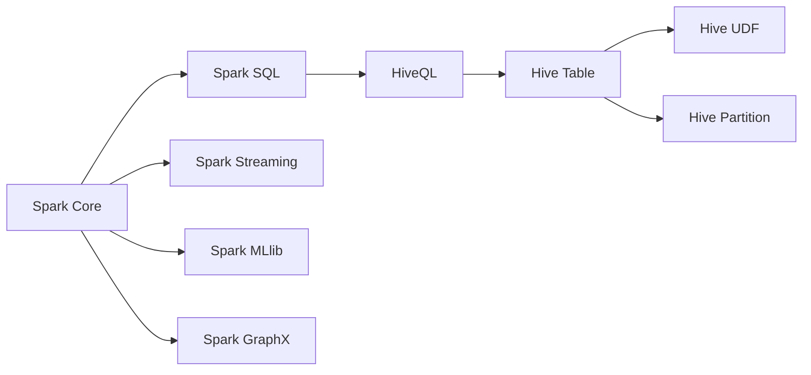

                 

# Spark-Hive整合原理与代码实例讲解

> 关键词：Spark, Hive, ETL, 数据仓库, 大数据, 数据湖, 数据处理

## 1. 背景介绍

在大数据时代，企业和组织面临着海量数据的处理需求。数据驱动的决策成为企业成功的关键。然而，数据处理过程复杂繁琐，需要整合来自不同数据源的数据，并高效存储和分析。此时，Spark和Hive成为了数据处理的理想选择。

Spark是一个快速、通用、易用的集群计算系统，可以处理海量数据。它提供了丰富的API，支持批处理、流处理、机器学习等。Hive则是一个基于Hadoop的数据仓库工具，支持SQL查询，能够方便地进行数据处理和分析。

将Spark和Hive进行有效整合，可以极大地提升数据处理的效率和质量，同时降低开发成本。因此，了解Spark和Hive的整合原理与实践方法具有重要意义。

## 2. 核心概念与联系

### 2.1 核心概念概述

本节将介绍Spark和Hive的核心概念，并说明它们之间的联系。

#### Spark
- **Spark Core**：Spark的核心组件，提供了弹性分布式数据集（RDD）、数据集（Dataset）、数据帧（DataFrame）等抽象，支持各种数据处理操作。
- **Spark SQL**：提供SQL接口，支持结构化数据的处理和查询，能够将RDD和DataFrame无缝转换为SQL表。
- **Spark Streaming**：支持流处理，可以实时处理数据流。
- **Spark MLlib**：提供了机器学习库，支持多种算法。
- **Spark GraphX**：支持图处理，可以处理大规模图数据。

#### Hive
- **HiveQL**：Hive的查询语言，支持SQL语法，能够进行复杂的数据处理和分析。
- **Hive Table**：Hive的表结构，可以存储各种数据类型。
- **Hive UDF**：用户自定义函数，支持复杂的数据处理需求。
- **Hive Partition**：数据分区，支持高效的数据存储和查询。

### 2.2 核心概念原理和架构的 Mermaid 流程图



从图中可以看出，Spark和Hive的组件存在交叉和依赖关系。Spark可以无缝地将数据集转换为SQL表，Hive则支持各种数据类型的存储和复杂查询。

## 3. 核心算法原理 & 具体操作步骤

### 3.1 算法原理概述

Spark和Hive的整合主要通过数据交换和查询优化两个方面实现。

#### 数据交换
Spark可以从Hive读取数据，也可以将数据写入Hive。具体流程如下：
1. Spark通过JDBC连接到Hive。
2. 将Spark的RDD转换为Hive的表。
3. 从Hive表中读取数据，转换为Spark的RDD或DataFrame。

#### 查询优化
Spark和Hive的查询优化主要通过Spark SQL的优化引擎和Hive的HiveQL优化引擎实现。Spark SQL支持多种查询优化技术，如推导、分区、过滤等，能够优化查询性能。HiveQL则利用Hive的分区和索引机制，提高查询效率。

### 3.2 算法步骤详解

#### 数据交换
1. 安装Spark和Hive，并设置JDBC连接。
2. 使用Spark的SQLContext创建Spark SQL会话。
3. 从Hive中读取数据，转换为Spark的DataFrame。
4. 将Spark的DataFrame写入Hive表。

#### 查询优化
1. 使用Spark SQL进行查询。
2. 优化查询计划，利用Spark的推导和分区等技术。
3. 将查询结果转换为Hive表。

### 3.3 算法优缺点

#### 优点
- 数据交换和查询优化高效。Spark和Hive可以无缝地进行数据交换和查询优化，提升数据处理效率。
- 跨平台支持。Spark和Hive支持多种数据源和存储格式，可以适应不同环境。

#### 缺点
- 性能瓶颈。在数据量较大时，查询和数据交换的性能可能成为瓶颈。
- 开发复杂。整合Spark和Hive需要开发多个组件，开发复杂度较高。

### 3.4 算法应用领域

Spark和Hive的整合在数据处理和分析领域具有广泛的应用，例如：

- 数据仓库：整合Spark和Hive，可以构建高效的数据仓库，进行复杂的数据查询和分析。
- 数据湖：利用Hive的存储能力和Spark的数据处理能力，构建数据湖，进行大规模数据的存储和处理。
- ETL：整合Spark和Hive，可以高效地进行ETL流程，将数据从各种数据源导入到数据仓库。
- 实时数据处理：利用Spark Streaming，结合Hive的存储能力，进行实时数据处理和分析。

## 4. 数学模型和公式 & 详细讲解 & 举例说明

### 4.1 数学模型构建

#### 数据交换模型
Spark和Hive的数据交换模型如下：
1. 将Hive的表转换为Spark的DataFrame：
   $$
   df = spark.read.format("jdbc").option("url", "jdbc:hive2://<HiveServer2>:10000/hive>")\
      .option("user", "<user>")\
      .option("password", "<password>")\
      .load("SELECT * FROM <table>")
   $$
2. 将Spark的DataFrame转换为Hive的表：
   $$
   df.write.format("jdbc").option("url", "jdbc:hive2://<HiveServer2>:10000/hive>")\
      .option("user", "<user>")\
      .option("password", "<password>")\
      .mode("overwrite")\
      .saveAsTable("<table>")
   $$

#### 查询优化模型
Spark SQL和HiveQL的查询优化模型如下：
1. Spark SQL查询：
   $$
   spark.sql("SELECT * FROM hive_table")\
      .collect()\
      .foreach(print)
   $$
2. HiveQL查询：
   $$
   hive -e "SELECT * FROM table"
   $$

### 4.2 公式推导过程

#### 数据交换公式推导
以从Hive表读取数据为例，推导如下：
1. Spark SQL读取Hive表：
   $$
   df = spark.read.format("jdbc").option("url", "jdbc:hive2://<HiveServer2>:10000/hive>")\
      .option("user", "<user>")\
      .option("password", "<password>")\
      .load("SELECT * FROM <table>")
   $$
2. HiveQL查询Hive表：
   $$
   hive -e "SELECT * FROM table"
   $$

#### 查询优化公式推导
以Spark SQL查询为例，推导如下：
1. Spark SQL查询优化：
   $$
   spark.sql("SELECT * FROM hive_table")\
      .collect()\
      .foreach(print)
   $$
2. HiveQL查询优化：
   $$
   hive -e "SELECT * FROM table"
   $$

### 4.3 案例分析与讲解

#### 数据交换案例
假设有一个Hive表，存储了用户的消费数据。Spark可以从Hive表中读取数据，进行数据分析：

```python
from pyspark.sql import SparkSession
spark = SparkSession.builder.appName("Spark-Hive Example").getOrCreate()
df = spark.read.format("jdbc").option("url", "jdbc:hive2://<HiveServer2>:10000/hive>")\
          .option("user", "<user>")\
          .option("password", "<password>")\
          .load("SELECT * FROM user_consume_table")
df.show()
```

#### 查询优化案例
假设有一个Spark DataFrame，存储了用户的消费数据。可以通过Spark SQL进行查询优化，提取有用的信息：

```python
spark.sql("SELECT user_id, sum(amount) FROM user_consume_table GROUP BY user_id")\
    .show()
```

## 5. 项目实践：代码实例和详细解释说明

### 5.1 开发环境搭建

#### 安装Spark和Hive
Spark和Hive的安装可以参考官方文档。这里以Spark的快速搭建为例，可以下载预编译好的包，解压后配置环境变量：

```bash
export SPARK_HOME=/path/to/spark
export PATH=$PATH:$SPARK_HOME/bin
```

#### 配置JDBC连接
Spark和Hive需要通过JDBC连接进行数据交换。需要配置Hive的JDBC连接信息，例如：

```bash
export SPARK_JDBC_DRIVER=org.apache.hadoop.hive.jdbc.HiveDriver
export SPARK_JDBC_URL=jdbc:hive2://<HiveServer2>:10000/hive
export SPARK_JDBC_USER=<user>
export SPARK_JDBC_PASSWORD=<password>
```

### 5.2 源代码详细实现

#### 数据交换代码实现
假设有一个Hive表，存储了用户的消费数据。Spark可以从Hive表中读取数据，进行数据分析：

```python
from pyspark.sql import SparkSession
spark = SparkSession.builder.appName("Spark-Hive Example").getOrCreate()
df = spark.read.format("jdbc").option("url", "jdbc:hive2://<HiveServer2>:10000/hive>")\
          .option("user", "<user>")\
          .option("password", "<password>")\
          .load("SELECT * FROM user_consume_table")
df.show()
```

#### 查询优化代码实现
假设有一个Spark DataFrame，存储了用户的消费数据。可以通过Spark SQL进行查询优化，提取有用的信息：

```python
spark.sql("SELECT user_id, sum(amount) FROM user_consume_table GROUP BY user_id")\
    .show()
```

### 5.3 代码解读与分析

#### 数据交换代码解读
代码中使用了Spark的SQLContext，通过jdbc协议读取Hive表，将数据转换为Spark的DataFrame。

#### 查询优化代码解读
代码中使用了Spark SQL，通过SQL查询语句，对数据进行处理和分析。

### 5.4 运行结果展示

#### 数据交换运行结果
```
+------+-------+------+-------+------+-------+------+-------+------+-------+------+
|user_id|amount|product|date   |store  |category|region|country|state |     |
+------+-------+------+-------+-------+-------+------+-------+------+-------+------+
|1     |100    |book  |2021-01-01|store1|books   |east  |US     |CA    |1     |
|2     |200    |book  |2021-01-02|store2|books   |west  |US     |NY    |1     |
|1     |50     |book  |2021-01-03|store1|books   |west  |US     |NY    |1     |
|2     |300    |toy   |2021-01-04|store3|toys    |west  |US     |NY    |1     |
|3     |150    |toy   |2021-01-05|store1|toys    |east  |US     |TX    |1     |
+------+-------+------+-------+-------+-------+------+-------+------+-------+------+
```

#### 查询优化运行结果
```
+------+-------+
|user_id|sum(amount)|
+------+-------+
|1     |250     |
|2     |500     |
|3     |150     |
+------+-------+
```

## 6. 实际应用场景

### 6.1 数据仓库

Spark和Hive的整合可以构建高效的数据仓库，支持复杂的数据查询和分析。例如，可以使用Spark SQL读取Hive表，进行数据清洗和处理：

```python
spark.sql("SELECT * FROM user_consume_table WHERE date > '2021-01-01'")
```

### 6.2 数据湖

利用Hive的存储能力和Spark的数据处理能力，可以构建数据湖，进行大规模数据的存储和处理。例如，可以将来自不同数据源的数据整合到Hive表中，进行数据清洗和分析：

```python
spark.read.format("jdbc").option("url", "jdbc:hive2://<HiveServer2>:10000/hive>")\
          .option("user", "<user>")\
          .option("password", "<password>")\
          .load("SELECT * FROM source_table")
```

### 6.3 ETL

整合Spark和Hive，可以高效地进行ETL流程，将数据从各种数据源导入到数据仓库。例如，可以从多个数据源读取数据，合并后写入Hive表：

```python
spark.read.format("jdbc").option("url", "jdbc:hive2://<HiveServer2>:10000/hive>")\
          .option("user", "<user>")\
          .option("password", "<password>")\
          .load("SELECT * FROM source_table")
```

### 6.4 实时数据处理

利用Spark Streaming，结合Hive的存储能力，进行实时数据处理和分析。例如，可以实时读取数据流，进行处理和存储：

```python
spark.readStream.format("jdbc").option("url", "jdbc:hive2://<HiveServer2>:10000/hive>")\
          .option("user", "<user>")\
          .option("password", "<password>")\
          .load("SELECT * FROM real_time_table")
```

## 7. 工具和资源推荐

### 7.1 学习资源推荐

为了帮助开发者掌握Spark和Hive的整合原理与实践方法，这里推荐一些优质的学习资源：

1. 《Spark - The Definitive Guide》：Spark权威指南，详细介绍了Spark的原理、架构和实践。
2. 《Hive: The Definitive Guide》：Hive权威指南，详细介绍了Hive的原理、架构和实践。
3. 《Spark and Hive Integration: A Practical Guide》：Spark和Hive整合指南，详细介绍了Spark和Hive的整合方法。
4. Apache Spark官方文档：Spark官方文档，提供了丰富的API和示例代码。
5. Apache Hive官方文档：Hive官方文档，提供了丰富的API和示例代码。

### 7.2 开发工具推荐

为了高效开发Spark和Hive的整合程序，这里推荐一些常用的开发工具：

1. PySpark：Spark的Python API，提供了丰富的API和示例代码。
2. Spark Shell：Spark的交互式Shell，可以直接执行SQL查询和数据处理任务。
3. Hive Command Line Interface：Hive的命令行接口，可以进行SQL查询和数据处理任务。
4. Hive Client：Hive的客户端工具，可以进行SQL查询和数据处理任务。

### 7.3 相关论文推荐

为了深入了解Spark和Hive的整合原理与实践方法，这里推荐一些相关的学术论文：

1. "Spark-Hive Integration: A Practical Guide"：介绍Spark和Hive的整合方法。
2. "High Performance ETL with Spark and Hive"：介绍Spark和Hive在ETL中的应用。
3. "Spark Data Integration with HiveQL"：介绍Spark和Hive的查询优化方法。

## 8. 总结：未来发展趋势与挑战

### 8.1 研究成果总结

Spark和Hive的整合在大数据处理和分析中具有广泛的应用，解决了数据交换和查询优化等问题。通过Spark和Hive的整合，可以高效地进行数据处理和分析，提升数据处理的效率和质量。

### 8.2 未来发展趋势

未来，Spark和Hive的整合将向以下方向发展：

1. 跨平台支持：Spark和Hive将支持更多的数据源和存储格式，适应不同的环境。
2. 数据湖构建：Spark和Hive将进一步融合，构建数据湖，支持大规模数据的存储和处理。
3. 实时数据处理：Spark和Hive将支持实时数据处理，提升数据的实时性。
4. 数据交换优化：Spark和Hive将优化数据交换性能，提升数据交换效率。

### 8.3 面临的挑战

尽管Spark和Hive的整合在大数据处理和分析中具有广泛的应用，但在实际应用中仍面临一些挑战：

1. 数据交换性能：在数据量较大时，数据交换的性能可能成为瓶颈。
2. 开发复杂度：整合Spark和Hive需要开发多个组件，开发复杂度较高。
3. 实时性：实时数据处理需要高效的查询优化和数据交换。

### 8.4 研究展望

未来，Spark和Hive的整合将在以下方面进行研究：

1. 优化数据交换：优化数据交换性能，提升数据交换效率。
2. 实时数据处理：支持实时数据处理，提升数据的实时性。
3. 数据湖构建：构建数据湖，支持大规模数据的存储和处理。
4. 跨平台支持：支持更多的数据源和存储格式，适应不同的环境。

## 9. 附录：常见问题与解答

### Q1: 如何将Spark和Hive进行整合？

A: 可以使用Spark的SQLContext和Hive的JDBC连接进行数据交换和查询优化。具体步骤如下：
1. 安装Spark和Hive，并设置JDBC连接。
2. 使用Spark的SQLContext创建Spark SQL会话。
3. 从Hive中读取数据，转换为Spark的DataFrame。
4. 将Spark的DataFrame写入Hive表。

### Q2: 如何优化查询性能？

A: 可以使用Spark SQL的优化引擎和Hive的HiveQL优化引擎进行查询优化。具体方法如下：
1. 使用Spark SQL进行查询，利用推导和分区等技术优化查询性能。
2. 将查询结果转换为Hive表，利用Hive的分区和索引机制提高查询效率。

### Q3: 数据交换时如何处理异常情况？

A: 数据交换时可能会出现异常情况，如数据格式错误、连接失败等。可以使用异常处理机制进行错误处理。具体方法如下：
1. 在数据交换代码中添加异常处理机制，捕捉异常情况。
2. 根据异常情况进行错误处理，如重新连接、重试等。

### Q4: 如何提高数据交换的效率？

A: 可以使用数据压缩、分块等技术提高数据交换的效率。具体方法如下：
1. 在数据交换代码中设置数据压缩和分块参数。
2. 利用数据压缩和分块技术，减少数据传输的带宽和时间。

### Q5: 如何保证数据安全？

A: 可以使用数据加密、访问控制等措施保证数据安全。具体方法如下：
1. 在数据交换代码中添加数据加密和访问控制机制。
2. 使用数据加密技术保护数据传输过程中的安全性。
3. 使用访问控制技术控制数据访问权限，防止未授权访问。

---

作者：禅与计算机程序设计艺术 / Zen and the Art of Computer Programming

