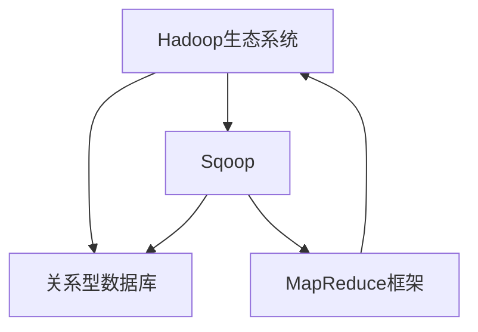

                 

## 1. 背景介绍

### 1.1 问题由来

Sqoop是一个重要的开源工具，用于在Hadoop和关系型数据库（如MySQL、PostgreSQL、Oracle等）之间进行数据迁移。通过Sqoop，用户可以将结构化数据从关系型数据库导出到Hadoop，或者将数据从Hadoop导入到关系型数据库中。这种数据迁移对于大数据分析和处理尤为重要，因为Hadoop可以处理海量的非结构化数据，而关系型数据库则更适合存储结构化数据。

### 1.2 问题核心关键点

Sqoop的核心在于实现两个数据源之间的数据迁移。其工作原理是将数据源中的数据转换为Hadoop的键值对形式，然后通过MapReduce框架在Hadoop上进行并行处理。具体来说，Sqoop支持以下几种数据迁移方式：

- 从关系型数据库中导出数据到Hadoop。
- 将数据从Hadoop导入到关系型数据库中。
- 将数据从一个关系型数据库导出到另一个关系型数据库中。

这些操作都是通过Sqoop的命令行工具实现的。Sqoop的强大之处在于它可以支持各种类型的数据库和Hadoop版本，使得数据迁移变得非常灵活和高效。

## 2. 核心概念与联系

### 2.1 核心概念概述

为了更好地理解Sqoop的原理，本节将介绍几个密切相关的核心概念：

- **Hadoop生态系统**：包括HDFS、MapReduce、YARN等组件，用于分布式存储和计算。
- **关系型数据库（RDBMS）**：如MySQL、PostgreSQL、Oracle等，用于存储结构化数据。
- **数据迁移**：将数据从一个数据源迁移到另一个数据源的过程。
- **Sqoop**：一个开源的数据迁移工具，用于在Hadoop和关系型数据库之间进行数据迁移。
- **MapReduce框架**：用于分布式并行计算的框架，可以处理大规模数据集。

这些核心概念之间的逻辑关系可以通过以下Mermaid流程图来展示：



这个流程图展示了大数据处理和关系型数据库之间的数据迁移关系，以及Sqoop在其中扮演的角色。

## 3. 核心算法原理 & 具体操作步骤
### 3.1 算法原理概述

Sqoop的核心算法原理包括以下几个步骤：

1. **数据源连接**：Sqoop首先连接到数据源，获取数据源的元数据信息。
2. **数据格式转换**：将数据源中的数据转换为Hadoop的键值对形式。
3. **MapReduce并行处理**：使用MapReduce框架对转换后的数据进行并行处理，并行化数据迁移过程。
4. **数据写入Hadoop**：将处理后的数据写入Hadoop的分布式文件系统中。

Sqoop支持多种数据格式，包括CSV、JSON、XML等。在数据格式转换过程中，Sqoop会根据目标数据格式自动生成对应的键值对。例如，对于CSV格式的数据，Sqoop会将每一行数据转换为一个键值对，键为行号，值为该行的数据。

### 3.2 算法步骤详解

Sqoop的完整操作流程包括以下几个关键步骤：

1. **安装和配置**：首先需要在Hadoop集群上安装Sqoop，并配置好相关的环境变量和依赖库。
2. **创建导出任务**：使用Sqoop的命令行工具，创建一个导出任务，指定数据源、目标目录和数据格式等参数。
3. **创建导入任务**：创建导入任务，指定数据源、目标数据库表和数据格式等参数。
4. **执行任务**：执行导出或导入任务，Sqoop会自动生成相应的MapReduce作业，并使用Hadoop的分布式计算能力进行数据迁移。
5. **任务监控和优化**：监控导出或导入任务的执行进度，根据需要进行优化，如调整MapReduce作业的参数、增加节点等。

### 3.3 算法优缺点

Sqoop具有以下优点：

- **灵活性高**：支持多种数据源和目标，可以灵活地进行数据迁移。
- **高性能**：利用Hadoop的分布式计算能力，可以高效地处理大规模数据迁移。
- **易用性**：使用简单的命令行工具，易于上手和操作。

同时，Sqoop也存在一些缺点：

- **复杂性较高**：需要熟悉Hadoop和关系型数据库的配置和操作。
- **数据格式限制**：目前Sqoop支持的数据格式有限，对于一些特殊格式的数据可能需要自定义转换。
- **性能瓶颈**：在数据格式转换和MapReduce作业调度等环节可能存在性能瓶颈。

### 3.4 算法应用领域

Sqoop广泛应用于各种数据迁移场景，例如：

- **大数据分析**：将结构化数据从关系型数据库导入到Hadoop，进行大数据分析和处理。
- **数据仓库建设**：将历史数据从关系型数据库导入到Hadoop，构建数据仓库。
- **数据备份和恢复**：将数据从关系型数据库备份到Hadoop，或者在Hadoop中恢复数据。
- **ETL流程构建**：在ETL（Extract, Transform, Load）流程中使用Sqoop进行数据提取和加载。

除了以上应用场景，Sqoop还可以用于数据同步、数据清洗、数据预处理等操作，是数据迁移和处理的重要工具。

## 4. 数学模型和公式 & 详细讲解 & 举例说明
### 4.1 数学模型构建

Sqoop的数据迁移过程可以抽象为以下几个步骤：

1. **数据源获取**：获取数据源中的数据，记为$D$。
2. **数据格式转换**：将数据$D$转换为Hadoop的键值对形式，记为$KV$。
3. **并行处理**：使用MapReduce框架对$KV$进行并行处理，生成中间结果$I$。
4. **结果写入Hadoop**：将中间结果$I$写入Hadoop的分布式文件系统中。

数学模型可以表示为：

$$ I = M(D) $$

其中$M$表示数据格式转换和并行处理的映射关系。

### 4.2 公式推导过程

以下我们以从MySQL数据库导出数据到Hadoop为例，推导Sqoop的数据迁移过程。

假设MySQL数据库中的表为`orders`，其中包含以下字段：

| 字段名     | 数据类型 | 描述       |
|------------|----------|------------|
| order_id   | int      | 订单ID     |
| customer   | varchar  | 客户名称   |
| product    | varchar  | 产品名称   |
| price      | decimal  | 产品价格   |
| order_date | date     | 订单日期   |

首先，我们需要将`orders`表中的数据导出到本地文件中。使用Sqoop命令如下：

```bash
s sqoop export --connect jdbc:mysql://localhost:3306/mydb --username root --password mypassword --table orders --outdir /tmp/orders --target-dir /tmp/hadoop_data --from-date-format "%Y-%m-%d" --driver org.mysql.jdbc.Driver
```

上述命令会将`orders`表中的数据导出到本地文件`/tmp/orders`中，并将数据写入Hadoop的分布式文件系统中。

接下来，我们需要将导出后的数据转换为Hadoop的键值对形式。在Sqoop中，可以使用`orderid`字段作为键，`orderid, product, price`字段作为值。这样转换后的数据将具有以下形式：

| 键     | 值       |
|--------|----------|
| 1      | 产品A, 100.00 |
| 2      | 产品B, 200.00 |
| ...    | ...      |

转换后的数据将存储在Hadoop的分布式文件系统中，形成中间结果$I$。

### 4.3 案例分析与讲解

在实际使用中，Sqoop还可以根据不同的数据源和目标，进行各种自定义配置和优化。例如，对于大型数据库的导出任务，可以使用`--bulk-load`选项进行批量加载，减少中间结果的读写操作，提高数据迁移效率。

此外，Sqoop还支持数据格式化、数据压缩、数据校验等高级功能。例如，可以使用`--date-format`选项指定日期格式，使用`--compress`选项对导出数据进行压缩，使用`--check-column`选项进行数据校验等。

## 5. 项目实践：代码实例和详细解释说明
### 5.1 开发环境搭建

在进行Sqoop的数据迁移实践前，我们需要准备好开发环境。以下是使用Python进行Sqoop开发的环境配置流程：

1. **安装Python**：从官网下载并安装Python 3.x版本。
2. **安装Sqoop**：在Linux系统上，可以使用以下命令安装Sqoop：

   ```bash
   sudo wget http://s3.amazonaws.com/hadoop/archive/sqoop-1.4.0-java9.tar.gz
   sudo tar -xvzf sqoop-1.4.0-java9.tar.gz -C /usr/local/
   sudo ln -s /usr/local/sqoop-1.4.0-java9 /usr/local/sqoop
   ```

3. **配置环境变量**：在`~/.bashrc`文件中添加以下内容，以确保Sqoop工具在命令行中可用：

   ```bash
   export SQOOP_HOME=/usr/local/sqoop
   export PATH=$PATH:$SQOOP_HOME/bin
   ```

完成上述步骤后，即可在Linux系统中使用Sqoop工具进行数据迁移操作。

### 5.2 源代码详细实现

这里我们以从MySQL数据库导出数据到Hadoop为例，给出Sqoop的数据迁移代码实现。

首先，需要编写一个Python脚本来进行数据导出操作。以下是示例代码：

```python
import subprocess
import os

# 设置MySQL数据库连接信息
url = "jdbc:mysql://localhost:3306/mydb"
user = "root"
password = "mypassword"
table = "orders"
outdir = "/tmp/orders"
targetdir = "/tmp/hadoop_data"

# 设置导出参数
from_date_format = "%Y-%m-%d"
driver = "org.mysql.jdbc.Driver"

# 执行Sqoop导出命令
squop_command = f"s sqoop export --connect {url} --username {user} --password {password} --table {table} --outdir {outdir} --target-dir {targetdir} --from-date-format {from_date_format} --driver {driver}"
subprocess.run(squop_command, shell=True)
```

上述代码中，我们首先设置了MySQL数据库的连接信息，包括数据库URL、用户名、密码、导出表名和目标目录等参数。然后，设置了导出的日期格式和驱动程序。最后，使用`subprocess`模块执行Sqoop的导出命令，将数据导出到指定的本地目录和Hadoop分布式文件系统中。

### 5.3 代码解读与分析

让我们再详细解读一下关键代码的实现细节：

**Sqoop导出命令解析**：

- `s sqoop export`：执行Sqoop导出命令。
- `--connect`：指定MySQL数据库连接信息。
- `--username`：指定MySQL数据库用户名。
- `--password`：指定MySQL数据库密码。
- `--table`：指定要导出的表名。
- `--outdir`：指定导出数据存储的本地目录。
- `--target-dir`：指定数据导入Hadoop分布式文件系统中的目标目录。
- `--from-date-format`：指定导出数据的日期格式。
- `--driver`：指定JDBC驱动程序。

这些参数控制了Sqoop的导出行为，确保导出操作能够顺利进行。

**导出操作流程**：

- 首先，在Linux系统上使用Python脚本执行Sqoop导出命令。
- Sqoop工具会将MySQL数据库中的数据导出到本地文件中。
- 然后，将导出后的数据转换为Hadoop的键值对形式，并写入Hadoop的分布式文件系统中。

通过上述步骤，实现了从MySQL数据库导出数据到Hadoop的完整流程。

### 5.4 运行结果展示

运行上述代码后，MySQL数据库中的`orders`表数据将被导出到本地目录`/tmp/orders`中，并在Hadoop的分布式文件系统中生成对应的中间结果。可以使用Hadoop的HDFS命令行工具查看导出结果，例如：

```bash
hdfs dfs -ls /tmp/hadoop_data
```

该命令会列出目标目录中的所有文件，以验证数据是否成功导入Hadoop。

## 6. 实际应用场景
### 6.1 智能数据分析

在智能数据分析领域，Sqoop可以用于将结构化数据从关系型数据库导入到Hadoop，进行大数据分析和处理。例如，可以使用Hadoop的Hive、Spark等工具对数据进行统计、挖掘和预测，从而获取有价值的商业洞察。

在实际应用中，Sqoop可以将用户行为数据、销售数据、市场数据等结构化数据导入Hadoop，进行综合分析和预测。例如，可以通过用户行为数据预测用户购买意愿，通过销售数据分析销售趋势，通过市场数据发现市场机会等。这些分析结果可以用于指导企业决策，提升市场竞争力。

### 6.2 数据仓库建设

数据仓库是企业级数据管理的重要基础设施，用于存储历史数据和分析数据。在数据仓库建设中，Sqoop可以用于将历史数据从关系型数据库导入到Hadoop，构建数据仓库。

在数据仓库建设中，首先需要将历史数据从关系型数据库导出到本地文件系统中，然后导入到Hadoop中。Sqoop工具可以自动完成这些数据迁移操作，大大简化数据仓库的建设过程。

### 6.3 数据备份和恢复

数据备份和恢复是数据管理中的重要环节，用于保证数据的可靠性和安全性。在数据备份和恢复中，Sqoop可以用于将数据从关系型数据库备份到Hadoop，或者在Hadoop中恢复数据。

在实际应用中，Sqoop可以将关系型数据库中的重要数据备份到Hadoop中，避免数据丢失和损坏。在恢复数据时，只需要从Hadoop中读取数据并导入到关系型数据库中即可。

### 6.4 未来应用展望

随着Sqoop功能的不断扩展和优化，未来的应用场景将更加广泛。以下是Sqoop未来的发展方向：

1. **支持更多数据源和目标**：Sqoop将支持更多类型的数据源和目标，如NoSQL数据库、对象存储等，使其应用范围更加广泛。
2. **支持更多数据格式**：Sqoop将支持更多数据格式，如Avro、Parquet等，提高数据迁移效率和灵活性。
3. **优化性能**：Sqoop将通过优化数据格式转换和MapReduce作业调度等环节，进一步提升数据迁移性能。
4. **增强监控和管理**：Sqoop将增强监控和管理功能，提供更详细的任务监控和管理界面，提高数据迁移的可操作性和可控性。
5. **集成更多工具和框架**：Sqoop将集成更多工具和框架，如Apache Spark、Apache Flink等，提升数据迁移的复杂性和灵活性。

这些发展方向将使Sqoop成为企业级数据迁移和处理的重要工具，进一步推动大数据技术的应用和发展。

## 7. 工具和资源推荐
### 7.1 学习资源推荐

为了帮助开发者掌握Sqoop的使用和优化，以下是一些推荐的资源：

1. **Sqoop官方文档**：Sqoop的官方文档提供了详细的安装和使用指南，涵盖了Sqoop的所有功能和参数。
2. **Apache Hadoop官方网站**：Apache Hadoop官方网站提供了Hadoop的详细文档和教程，帮助开发者深入理解Hadoop的架构和应用。
3. **Hadoop生态系统文档**：Hadoop生态系统文档涵盖了HDFS、MapReduce、YARN等组件的详细使用方法和最佳实践。
4. **《Hadoop权威指南》**：这是一本权威的Hadoop入门书籍，涵盖了Hadoop的原理、架构和应用。
5. **《Sqoop实战》**：这是一本实战性的Sqoop教程，介绍了Sqoop在数据迁移和处理中的应用案例。

通过这些资源的学习和实践，相信你一定能够掌握Sqoop的使用方法，并用于解决实际的数据迁移问题。

### 7.2 开发工具推荐

Sqoop是一个命令行工具，开发环境相对简单，但为了提高开发效率，以下是一些推荐的开发工具：

1. **IntelliJ IDEA**：IntelliJ IDEA是一个流行的Java开发工具，支持Sqoop脚本的编写和调试。
2. **Jupyter Notebook**：Jupyter Notebook是一个交互式开发环境，支持Python脚本的编写和运行，方便开发者进行Sqoop数据迁移的实验和调试。
3. **VS Code**：VS Code是一个轻量级的开发工具，支持Python脚本的编写和运行，方便开发者进行Sqoop数据迁移的实验和调试。
4. **DBeaver**：DBeaver是一个流行的数据库管理工具，支持多种数据库和数据源，方便开发者进行Sqoop数据迁移的实验和调试。

这些工具可以帮助开发者提高Sqoop数据迁移的开发效率，加快创新迭代的步伐。

### 7.3 相关论文推荐

以下是几篇与Sqoop相关的经典论文，推荐阅读：

1. **《Sqoop: A Simple Framework for Hadoop Streaming》**：这篇文章详细介绍了Sqoop的设计原理和实现方式，是Sqoop的奠基性论文。
2. **《Sqoop: The Early Adoption of a Software Tool》**：这篇文章介绍了Sqoop工具的早期采用情况和实际应用效果，展示了Sqoop在数据迁移中的重要价值。
3. **《Sqoop: Extending MapReduce for Large-Scale Data Transfer》**：这篇文章讨论了Sqoop在大型数据集上的应用，介绍了Sqoop在数据迁移中的扩展和优化。

这些论文代表了Sqoop技术的发展脉络，通过学习这些前沿成果，可以帮助研究者把握学科前进方向，激发更多的创新灵感。

## 8. 总结：未来发展趋势与挑战
### 8.1 总结

本文对Sqoop的数据迁移原理和代码实现进行了全面系统的介绍。首先阐述了Sqoop的应用背景和核心概念，明确了Sqoop在Hadoop和关系型数据库之间数据迁移中的重要作用。其次，从原理到实践，详细讲解了Sqoop的数据迁移数学模型和操作流程，给出了Sqoop数据迁移的完整代码实现。同时，本文还广泛探讨了Sqoop在智能数据分析、数据仓库建设、数据备份和恢复等多个场景中的应用前景，展示了Sqoop工具的强大灵活性和高效性。此外，本文精选了Sqoop的相关资源，力求为读者提供全方位的技术指引。

通过本文的系统梳理，可以看到，Sqoop在数据迁移和处理中发挥着不可或缺的作用，是Hadoop和关系型数据库之间数据交换的重要工具。Sqoop的大规模应用将进一步推动大数据技术的发展和应用，为各行各业带来新的变革和机遇。

### 8.2 未来发展趋势

展望未来，Sqoop的发展将呈现以下几个趋势：

1. **功能增强和优化**：Sqoop将不断增强和优化其功能，支持更多类型的数据源和目标，提升数据迁移的灵活性和性能。
2. **与Hadoop生态系统深度融合**：Sqoop将进一步融入Hadoop生态系统，提供更丰富和便捷的数据迁移解决方案。
3. **自动化和智能化**：Sqoop将实现更多的自动化和智能化功能，如自动监控、自动调优等，提升数据迁移的可靠性和效率。
4. **与AI技术的结合**：Sqoop将结合人工智能技术，提升数据迁移的智能化水平，提供更深入的数据分析和处理能力。

这些发展趋势将使Sqoop成为企业级数据迁移和处理的重要工具，进一步推动大数据技术的应用和发展。

### 8.3 面临的挑战

尽管Sqoop已经取得了诸多成功，但在迈向更加智能化、普适化应用的过程中，仍面临一些挑战：

1. **复杂性较高**：Sqoop的使用和配置相对复杂，需要具备一定的技术背景。
2. **性能瓶颈**：在数据格式转换和MapReduce作业调度等环节可能存在性能瓶颈，需要进一步优化。
3. **数据格式限制**：Sqoop目前支持的格式有限，对于特殊格式的数据可能需要自定义转换。
4. **数据安全和隐私**：在数据迁移过程中，需要确保数据的安全和隐私，避免数据泄露和损坏。
5. **数据一致性**：在数据迁移过程中，需要确保数据的一致性，避免数据丢失和重复。

这些挑战需要开发者不断探索和优化，才能充分发挥Sqoop的数据迁移能力。

### 8.4 研究展望

未来，Sqoop的研究将主要集中在以下几个方向：

1. **多数据源和多目标的支持**：进一步扩展Sqoop的功能，支持更多类型的数据源和目标，提升数据迁移的灵活性和广泛性。
2. **性能优化**：通过优化数据格式转换和MapReduce作业调度等环节，提高数据迁移的性能和效率。
3. **自动化和智能化**：实现更多的自动化和智能化功能，提升数据迁移的可操作性和可控性。
4. **与AI技术的结合**：结合人工智能技术，提升数据迁移的智能化水平，提供更深入的数据分析和处理能力。

这些研究方向的探索，将使Sqoop成为企业级数据迁移和处理的重要工具，进一步推动大数据技术的应用和发展。

## 9. 附录：常见问题与解答
### Q1：Sqoop导出数据时，如何进行数据校验？

A: Sqoop提供了`--check-column`选项，可以用于校验导出数据。具体来说，可以使用以下命令进行数据校验：

```bash
s sqoop export --connect jdbc:mysql://localhost:3306/mydb --username root --password mypassword --table orders --outdir /tmp/orders --target-dir /tmp/hadoop_data --from-date-format "%Y-%m-%d" --driver org.mysql.jdbc.Driver --check-column order_id=INT,product=VARCHAR,price=DECIMAL
```

上述命令会在导出数据的同时，校验`order_id`、`product`和`price`字段的格式和值，确保数据的正确性和一致性。

### Q2：Sqoop导入数据时，如何进行数据格式转换？

A: Sqoop提供了`--map`选项，可以用于自定义数据格式转换。具体来说，可以使用以下命令进行数据格式转换：

```bash
s sqoop import --connect jdbc:mysql://localhost:3306/mydb --username root --password mypassword --table orders --outdir /tmp/hadoop_data --from-dir /tmp/hadoop_data --target-dir /tmp/orders --from-enclosure '' --from-quote '' --from-line-separator ',' --map='col1 col2 col3=COL1:COL2'
```

上述命令会将`col1`和`col2`合并为`COL1:COL2`格式，并将`col3`转换为`COL3`格式。具体来说，`col1`和`col2`合并后的格式为`col1 col2`，以逗号为分隔符；`col3`的格式为`COL3`。

### Q3：Sqoop导出数据时，如何进行数据压缩？

A: Sqoop提供了`--compress`选项，可以用于压缩导出数据。具体来说，可以使用以下命令进行数据压缩：

```bash
s sqoop export --connect jdbc:mysql://localhost:3306/mydb --username root --password mypassword --table orders --outdir /tmp/orders --target-dir /tmp/hadoop_data --from-date-format "%Y-%m-%d" --driver org.mysql.jdbc.Driver --compress
```

上述命令会在导出数据的同时，对数据进行压缩，减少存储空间的使用。

### Q4：Sqoop导入数据时，如何进行数据格式转换和校验？

A: 在Sqoop导入数据时，可以使用`--map`和`--check-column`选项进行数据格式转换和校验。具体来说，可以使用以下命令进行数据格式转换和校验：

```bash
s sqoop import --connect jdbc:mysql://localhost:3306/mydb --username root --password mypassword --table orders --outdir /tmp/hadoop_data --from-dir /tmp/hadoop_data --target-dir /tmp/orders --from-enclosure '' --from-quote '' --from-line-separator ',' --map='col1 col2 col3=COL1:COL2' --check-column order_id=INT,product=VARCHAR,price=DECIMAL
```

上述命令会将`col1`和`col2`合并为`COL1:COL2`格式，并将`col3`转换为`COL3`格式。同时，对`order_id`、`product`和`price`字段进行校验，确保数据的正确性和一致性。

### Q5：Sqoop数据迁移过程中，如何进行错误处理？

A: Sqoop提供了`--stderr-threshold`选项，可以用于设置日志错误级别。具体来说，可以使用以下命令进行错误处理：

```bash
s sqoop export --connect jdbc:mysql://localhost:3306/mydb --username root --password mypassword --table orders --outdir /tmp/orders --target-dir /tmp/hadoop_data --from-date-format "%Y-%m-%d" --driver org.mysql.jdbc.Driver --stderr-threshold ERROR
```

上述命令会将日志错误级别设置为ERROR，确保在数据迁移过程中出现错误时，能够及时发现和处理。

---

作者：禅与计算机程序设计艺术 / Zen and the Art of Computer Programming

