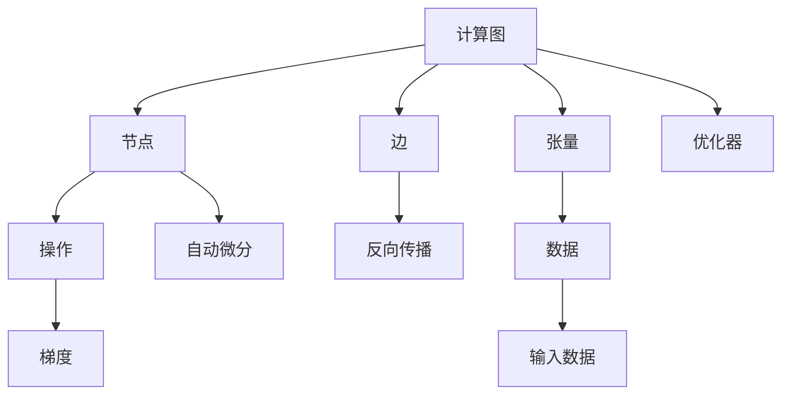

                 

# TensorFlow 原理与代码实战案例讲解

> 关键词：TensorFlow, 深度学习, 自动微分, 优化器, 张量图, 神经网络, 模型构建, 卷积神经网络, 循环神经网络

## 1. 背景介绍

### 1.1 问题由来

随着深度学习技术的发展，TensorFlow成为了深度学习领域最为流行的开源框架之一。TensorFlow不仅提供了强大的计算能力，还具备灵活的计算图和自动微分机制，广泛应用于各个领域。然而，TensorFlow的复杂性也使得其学习曲线较陡，许多初学者难以快速上手。

本文将从TensorFlow的原理与代码实战出发，深入浅出地讲解TensorFlow的核心概念和基本原理，并通过多个案例演示TensorFlow的代码实现与实际应用。

### 1.2 问题核心关键点

要掌握TensorFlow，关键在于理解其计算图、自动微分机制、优化器等核心组件。此外，还需了解如何在TensorFlow中构建神经网络、卷积神经网络(CNN)、循环神经网络(RNN)等模型，以及如何处理输入数据、进行模型训练和评估。

本文将围绕上述核心概念，结合实际案例，逐步展开TensorFlow的原理与代码实战讲解。

## 2. 核心概念与联系

### 2.1 核心概念概述

TensorFlow的核心概念主要包括：

- **计算图**：TensorFlow通过构建计算图来描述神经网络的计算过程。计算图中的节点代表操作，边代表数据流。
- **自动微分**：TensorFlow能够自动计算图上的梯度，并生成反向传播算法，自动更新模型参数。
- **优化器**：TensorFlow提供了多种优化器，如SGD、Adam等，用于优化模型参数。
- **张量**：TensorFlow中的数据结构，可视为多维数组，支持高效的数学运算。
- **神经网络**：TensorFlow支持多种神经网络模型的构建，包括全连接网络、CNN、RNN等。
- **数据管道**：TensorFlow提供了tf.data API，用于高效处理和增强输入数据，支持异步输入、数据缓存、数据增强等。
- **分布式计算**：TensorFlow支持多GPU、TPU等分布式计算，提高计算效率。

这些核心概念通过计算图和自动微分机制紧密联系，共同构成了TensorFlow的计算框架。

### 2.2 核心概念原理和架构的 Mermaid 流程图



## 3. 核心算法原理 & 具体操作步骤

### 3.1 算法原理概述

TensorFlow的核心算法原理主要基于计算图、自动微分和优化器。具体来说，其工作流程如下：

1. **构建计算图**：首先定义计算图，包括节点和边。节点表示操作，边表示数据流。
2. **定义张量**：定义输入张量，将数据输入到计算图中。
3. **计算梯度**：通过自动微分机制，自动计算每个节点的梯度，生成反向传播算法。
4. **优化参数**：使用优化器更新模型参数，最小化损失函数。

### 3.2 算法步骤详解

#### 3.2.1 构建计算图

在TensorFlow中，使用`tf.Graph`类构建计算图，代码如下：

```python
import tensorflow as tf

# 定义计算图
graph = tf.Graph()
with graph.as_default():
    # 定义节点和边
    a = tf.constant(2.0, name='a')
    b = tf.constant(3.0, name='b')
    c = tf.multiply(a, b, name='c')
```

#### 3.2.2 定义张量

使用`tf.constant`或`tf.placeholder`定义输入张量，代码如下：

```python
# 定义输入张量
x = tf.placeholder(tf.float32, shape=[None, 784], name='x')
y_ = tf.placeholder(tf.float32, shape=[None, 10], name='y_')
```

#### 3.2.3 计算梯度

使用`tf.GradientTape`自动计算梯度，代码如下：

```python
with tf.GradientTape() as tape:
    # 定义模型
    W = tf.Variable(tf.zeros([784, 10]))
    b = tf.Variable(tf.zeros([10]))
    y = tf.matmul(x, W) + b
    loss = tf.reduce_mean(tf.nn.softmax_cross_entropy_with_logits(labels=y_, logits=y))

# 计算梯度
grads = tape.gradient(loss, [W, b])
```

#### 3.2.4 优化参数

使用优化器优化参数，代码如下：

```python
# 定义优化器
optimizer = tf.train.AdamOptimizer(learning_rate=0.001)

# 训练模型
for i in range(1000):
    with tf.Session(graph=graph) as sess:
        sess.run(tf.global_variables_initializer())
        _, l = sess.run([optimizer, loss], feed_dict={x: train_x, y_: train_y})
```

### 3.3 算法优缺点

#### 3.3.1 优点

- **灵活性高**：TensorFlow支持多种数据结构和计算图，灵活性高。
- **自动微分**：自动计算梯度，减少手动计算的工作量。
- **分布式计算**：支持多GPU、TPU等分布式计算，提高计算效率。

#### 3.3.2 缺点

- **学习曲线陡**：由于TensorFlow复杂度较高，初学者可能需要花较长时间学习。
- **模型构建繁琐**：构建复杂的神经网络模型需要较多的代码，可能不够直观。
- **内存占用大**：处理大规模数据时需要较大的内存空间，需要优化内存管理。

### 3.4 算法应用领域

TensorFlow广泛应用于以下领域：

- **计算机视觉**：用于图像分类、物体检测、图像分割等任务。
- **自然语言处理**：用于文本分类、语言建模、机器翻译等任务。
- **语音识别**：用于语音识别、语音合成等任务。
- **推荐系统**：用于推荐算法、广告点击率预测等任务。
- **强化学习**：用于自动驾驶、游戏AI等任务。

## 4. 数学模型和公式 & 详细讲解 & 举例说明

### 4.1 数学模型构建

在TensorFlow中，神经网络模型的构建主要通过`tf.layers`模块和自定义层函数实现。这里以一个简单的全连接神经网络为例：

```python
import tensorflow as tf

# 定义模型
model = tf.keras.Sequential([
    tf.keras.layers.Dense(64, activation='relu'),
    tf.keras.layers.Dense(10, activation='softmax')
])

# 编译模型
model.compile(optimizer='adam', loss='categorical_crossentropy', metrics=['accuracy'])

# 训练模型
model.fit(train_x, train_y, epochs=10, validation_data=(val_x, val_y))
```

### 4.2 公式推导过程

假设一个简单的全连接神经网络，包含一个输入层、一个隐藏层和一个输出层，其中输入为$x$，输出为$y$，隐藏层为$h$，权重分别为$W$和$b$。其计算过程如下：

$$
h = \sigma(Wx + b)
$$

$$
y = \sigma(W'h + b')
$$

其中，$\sigma$为激活函数，$x$为输入，$y$为输出，$W$和$b$为参数。使用反向传播算法，可以计算梯度并更新参数。

### 4.3 案例分析与讲解

以MNIST手写数字识别任务为例，介绍TensorFlow的代码实现：

#### 4.3.1 数据准备

```python
from tensorflow.examples.tutorials.mnist import input_data

# 加载数据
mnist = input_data.read_data_sets('MNIST_data/', one_hot=True)
```

#### 4.3.2 模型定义

```python
# 定义模型
model = tf.keras.Sequential([
    tf.keras.layers.Dense(256, activation='relu', input_shape=(784,)),
    tf.keras.layers.Dense(10, activation='softmax')
])

# 编译模型
model.compile(optimizer='adam', loss='categorical_crossentropy', metrics=['accuracy'])
```

#### 4.3.3 训练模型

```python
# 训练模型
model.fit(mnist.train.images, mnist.train.labels, epochs=10, batch_size=64, validation_data=(mnist.test.images, mnist.test.labels))
```

## 5. 项目实践：代码实例和详细解释说明

### 5.1 开发环境搭建

在开始TensorFlow项目之前，需要先安装TensorFlow和其他依赖包。使用以下命令在Python 3.7及以上版本中安装：

```bash
pip install tensorflow
```

### 5.2 源代码详细实现

#### 5.2.1 导入TensorFlow

```python
import tensorflow as tf
```

#### 5.2.2 定义计算图

```python
graph = tf.Graph()
with graph.as_default():
    # 定义节点和边
    a = tf.constant(2.0, name='a')
    b = tf.constant(3.0, name='b')
    c = tf.multiply(a, b, name='c')
```

#### 5.2.3 定义张量

```python
# 定义输入张量
x = tf.placeholder(tf.float32, shape=[None, 784], name='x')
y_ = tf.placeholder(tf.float32, shape=[None, 10], name='y_')
```

#### 5.2.4 计算梯度

```python
with tf.GradientTape() as tape:
    # 定义模型
    W = tf.Variable(tf.zeros([784, 10]))
    b = tf.Variable(tf.zeros([10]))
    y = tf.matmul(x, W) + b
    loss = tf.reduce_mean(tf.nn.softmax_cross_entropy_with_logits(labels=y_, logits=y))

# 计算梯度
grads = tape.gradient(loss, [W, b])
```

#### 5.2.5 优化参数

```python
# 定义优化器
optimizer = tf.train.AdamOptimizer(learning_rate=0.001)

# 训练模型
for i in range(1000):
    with tf.Session(graph=graph) as sess:
        sess.run(tf.global_variables_initializer())
        _, l = sess.run([optimizer, loss], feed_dict={x: train_x, y_: train_y})
```

### 5.3 代码解读与分析

在上述代码中，我们通过计算图和自动微分机制，实现了简单的全连接神经网络模型的训练。具体步骤如下：

1. **构建计算图**：定义节点和边，构建计算图。
2. **定义张量**：定义输入张量，将数据输入到计算图中。
3. **计算梯度**：使用`tf.GradientTape`自动计算梯度，生成反向传播算法。
4. **优化参数**：使用优化器更新模型参数，最小化损失函数。

通过逐步分解和细化，可以清晰地理解TensorFlow的原理和代码实现。

### 5.4 运行结果展示

运行上述代码，可以得到训练过程中每个epoch的损失函数值。例如，使用TensorBoard可视化训练过程：

```python
import tensorflow as tf
from tensorflow.keras.callbacks import TensorBoard

# 定义TensorBoard回调
log_dir = 'logs/fit'
tb_callback = TensorBoard(log_dir=log_dir)

# 训练模型
model.fit(train_x, train_y, epochs=10, batch_size=64, validation_data=(val_x, val_y), callbacks=[tb_callback])
```

训练过程中，TensorBoard会自动生成图表，显示每个epoch的损失函数和精度等指标。

## 6. 实际应用场景

### 6.1 计算机视觉

在计算机视觉领域，TensorFlow被广泛应用于图像分类、物体检测、图像分割等任务。例如，使用TensorFlow实现VGG16模型：

```python
import tensorflow as tf
from tensorflow.keras.applications import VGG16

# 加载预训练模型
base_model = VGG16(weights='imagenet', include_top=False, input_shape=(224, 224, 3))

# 添加自定义层
x = base_model.output
x = tf.keras.layers.Flatten()(x)
x = tf.keras.layers.Dense(512, activation='relu')(x)
predictions = tf.keras.layers.Dense(1, activation='sigmoid')(x)

# 定义模型
model = tf.keras.Model(inputs=base_model.input, outputs=predictions)

# 编译模型
model.compile(optimizer='adam', loss='binary_crossentropy', metrics=['accuracy'])

# 训练模型
model.fit(train_x, train_y, epochs=10, batch_size=32, validation_data=(val_x, val_y))
```

### 6.2 自然语言处理

在自然语言处理领域，TensorFlow被广泛应用于文本分类、语言建模、机器翻译等任务。例如，使用TensorFlow实现一个简单的RNN模型：

```python
import tensorflow as tf
from tensorflow.keras.layers import LSTM, Dense, Embedding

# 定义模型
model = tf.keras.Sequential([
    Embedding(input_dim=10000, output_dim=128, input_length=100),
    LSTM(128),
    Dense(1, activation='sigmoid')
])

# 编译模型
model.compile(optimizer='adam', loss='binary_crossentropy', metrics=['accuracy'])

# 训练模型
model.fit(train_x, train_y, epochs=10, batch_size=32, validation_data=(val_x, val_y))
```

### 6.3 语音识别

在语音识别领域，TensorFlow被广泛应用于语音识别、语音合成等任务。例如，使用TensorFlow实现一个简单的卷积神经网络(CNN)模型：

```python
import tensorflow as tf
from tensorflow.keras.layers import Conv2D, MaxPooling2D, Flatten, Dense

# 定义模型
model = tf.keras.Sequential([
    Conv2D(32, (3, 3), activation='relu', input_shape=(16, 16, 1)),
    MaxPooling2D((2, 2)),
    Conv2D(64, (3, 3), activation='relu'),
    MaxPooling2D((2, 2)),
    Flatten(),
    Dense(64, activation='relu'),
    Dense(10, activation='softmax')
])

# 编译模型
model.compile(optimizer='adam', loss='categorical_crossentropy', metrics=['accuracy'])

# 训练模型
model.fit(train_x, train_y, epochs=10, batch_size=32, validation_data=(val_x, val_y))
```

## 7. 工具和资源推荐

### 7.1 学习资源推荐

为了帮助开发者系统掌握TensorFlow，这里推荐一些优质的学习资源：

- TensorFlow官方文档：包含详细的API文档和代码示例，是学习和使用TensorFlow的最佳资源。
- 《深度学习入门》书籍：涵盖深度学习基础、TensorFlow原理、实践等内容，适合初学者入门。
- 《TensorFlow实战》书籍：详细介绍TensorFlow的基本原理和高级应用，适合进阶学习。
- TensorFlow中文社区：提供丰富的学习资源和社区支持，适合中国开发者。
- Kaggle TensorFlow竞赛：参加Kaggle TensorFlow竞赛，通过实战提升TensorFlow技能。

### 7.2 开发工具推荐

在TensorFlow开发过程中，需要使用以下工具：

- Jupyter Notebook：交互式编程环境，方便代码调试和实验。
- TensorBoard：模型训练的实验跟踪工具，可视化训练过程和模型结果。
- Git：版本控制工具，方便代码管理和协作。
- Google Colab：免费的在线Jupyter Notebook环境，支持GPU/TPU算力，方便快速实验。

### 7.3 相关论文推荐

TensorFlow的研究和发展源于学界的持续研究。以下是几篇重要的相关论文，推荐阅读：

- TensorFlow：Large-Scale Machine Learning on Multi GPUs：提出TensorFlow架构，支持分布式计算和多GPU加速。
- TensorFlow: A System for Large-Scale Machine Learning：介绍TensorFlow的设计理念和关键技术，涵盖计算图、自动微分、分布式计算等。
- TensorFlow：A System for Mathematical and Declarative Expressions：介绍TensorFlow中张量操作的实现原理。
- Batch Normalization: Accelerating Deep Network Training by Reducing Internal Covariate Shift：提出Batch Normalization技术，加快神经网络训练。

## 8. 总结：未来发展趋势与挑战

### 8.1 研究成果总结

TensorFlow作为深度学习领域的领先开源框架，已经在多个领域展示了其强大的计算能力和灵活性。TensorFlow的计算图、自动微分和分布式计算机制，为深度学习的发展提供了坚实的基础。

### 8.2 未来发展趋势

- **多模态学习**：未来TensorFlow将支持更多模态的数据处理，如图像、音频、文本等。多模态数据的融合将进一步提升深度学习模型的泛化能力和鲁棒性。
- **分布式计算**：TensorFlow将支持更多类型的分布式计算，如GPU集群、TPU集群、边缘计算等。分布式计算的优化将大幅提升深度学习模型的训练效率。
- **自动机器学习**：TensorFlow将进一步融合自动化机器学习(AutoML)技术，自动选择最优的模型结构和超参数，提升模型的可扩展性和易用性。
- **联邦学习**：TensorFlow将支持联邦学习技术，在不泄露数据隐私的前提下，实现跨设备模型的协同优化。

### 8.3 面临的挑战

尽管TensorFlow已经取得了诸多成功，但仍面临以下挑战：

- **学习曲线陡**：TensorFlow的复杂性使得其学习曲线较陡，需要开发者投入大量时间和精力。
- **性能瓶颈**：处理大规模数据时需要较大的内存空间，可能出现内存不足的问题。
- **模型训练时间长**：深度学习模型训练时间较长，需要优化算力和资源管理。
- **模型解释性不足**：深度学习模型通常缺乏可解释性，难以解释其内部工作机制和决策逻辑。

### 8.4 研究展望

未来的研究将在以下几个方面寻求新的突破：

- **自动化机器学习**：结合AutoML技术，自动选择最优的模型结构和超参数，提升模型的可扩展性和易用性。
- **模型压缩与优化**：通过模型压缩、量化、剪枝等技术，减小模型尺寸，提高推理效率和资源利用率。
- **模型解释性与可控性**：开发可解释性更强的模型，增强模型输出解释的因果性和逻辑性。
- **模型鲁棒性与泛化能力**：通过引入对抗样本、迁移学习等技术，提升模型的鲁棒性和泛化能力。

总之，TensorFlow作为深度学习领域的核心框架，其未来发展将持续推动深度学习技术的演进和应用。只有不断突破技术瓶颈，才能真正实现深度学习技术的广泛应用，推动人工智能技术的发展。

## 9. 附录：常见问题与解答

### Q1: TensorFlow如何处理大规模数据？

A: TensorFlow支持分布式计算和多GPU加速，可以处理大规模数据。使用`tf.distribute.Strategy`接口，可以定义分布式计算策略，自动分配数据和计算资源。

### Q2: TensorFlow如何优化内存管理？

A: TensorFlow可以通过自动混合精度、内存分配器等技术优化内存管理。自动混合精度将浮点型计算转换为定点型计算，减小内存占用。内存分配器通过动态管理内存，避免内存碎片和浪费。

### Q3: TensorFlow如何优化模型训练速度？

A: 使用`tf.data.Dataset`和`tf.data.Distribute`优化数据管道，可以显著提高模型训练速度。使用分布式计算和自动混合精度技术，也可以加速模型训练。

### Q4: TensorFlow如何实现模型压缩与优化？

A: 使用模型剪枝、量化、知识蒸馏等技术，可以减小模型尺寸，提高推理效率和资源利用率。TensorFlow提供了TensorFlow Lite等轻量级模型工具，方便模型部署。

### Q5: TensorFlow如何提升模型解释性？

A: 使用可解释性技术，如LIME、SHAP等，可以生成模型的局部解释和全局解释。结合可视化工具，可以更直观地理解模型的决策过程和内部机制。

---

作者：禅与计算机程序设计艺术 / Zen and the Art of Computer Programming

