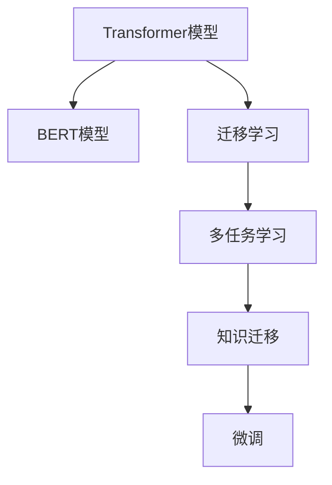

                 

# Transformer大模型实战 将知识从BERT 模型迁移到神经网络中

> 关键词：Transformer, BERT, 神经网络迁移, 深度学习, 预训练模型, 微调, 多任务学习

## 1. 背景介绍

### 1.1 问题由来
近年来，随着深度学习技术的快速发展，基于神经网络的模型在自然语言处理(NLP)领域取得了巨大的突破。其中，Transformer模型由于其卓越的性能和效率，成为了NLP任务的标配。BERT作为Transformer的一种变体，通过在大规模无标签文本语料上进行预训练，学习到了丰富的语言知识和常识，已经在诸多NLP任务中刷新了最先进性能指标。

然而，在实际应用中，我们往往需要将BERT的知识迁移到其他基于神经网络的模型中，以适应特定的任务需求。例如，在迁移学习框架下，可能需要将BERT的通用知识迁移到一个小规模模型中，以实现高效的微调和泛化。这种迁移方法，也被称为“知识迁移”或“神经网络迁移学习”。

本文将重点介绍如何实现这种知识迁移，具体方法是将BERT的知识迁移到另一个基于Transformer的神经网络中。这不仅可以帮助我们理解如何迁移知识，还可以为未来的研究提供参考和启发。

### 1.2 问题核心关键点
知识迁移的核心在于如何有效地将源模型（如BERT）的知识迁移到目标模型（如特定任务的神经网络）中。在迁移学习框架下，通常需要考虑以下问题：

- 如何选择合适的源模型和目标模型？
- 如何设计迁移策略，使得目标模型能够利用源模型的知识？
- 如何最小化迁移带来的性能损失，同时最大化目标模型的泛化能力？
- 如何处理源模型和目标模型之间的结构差异？

本文将围绕这些问题，深入探讨如何通过迁移学习将BERT的知识迁移到其他神经网络中，并应用于特定任务。

### 1.3 问题研究意义
研究知识迁移方法，对于提升模型的泛化能力和适应性，加速模型的训练和优化，具有重要意义：

1. **降低开发成本**：通过迁移知识，可以避免从头开发所需的数据、计算和人力等成本投入，大大降低应用开发的门槛。
2. **提升模型性能**：迁移学习能够利用已有模型的知识，提升模型在新任务上的表现，尤其是在数据量有限的情况下。
3. **加速模型迭代**：利用知识迁移，可以在更少的训练轮数下，获得更好的模型性能，加速模型的迭代和优化进程。
4. **促进技术创新**：知识迁移为迁移学习提供了新的研究方向，催生了如多任务学习、自适应学习等前沿技术。
5. **赋能产业升级**：迁移学习使得NLP技术更容易被各行各业所采用，为传统行业数字化转型升级提供新的技术路径。

## 2. 核心概念与联系

### 2.1 核心概念概述

为更好地理解神经网络迁移的原理和流程，本节将介绍几个密切相关的核心概念：

- **Transformer模型**：基于自注意力机制的自编码神经网络模型，广泛应用于NLP领域。Transformer模型的核心组件包括多头注意力机制、位置编码、残差连接等。
- **BERT模型**：一种预训练语言模型，通过在大规模无标签文本上预训练，学习到了丰富的语言知识。BERT通过掩码语言模型和下一句预测任务进行预训练，可以获得全词的上下文表示。
- **迁移学习**：将一个领域学习到的知识，迁移到另一个不同但相关的领域的学习范式。在深度学习中，迁移学习通常通过预训练模型进行微调来实现。
- **多任务学习**：在同一模型上进行多个相关任务的学习，每个任务共享模型的一部分或全部参数，以提高模型的泛化能力。
- **知识迁移**：将源模型的知识迁移到目标模型中，以提升目标模型的性能。知识迁移通常通过微调、多任务学习等方法实现。

这些核心概念之间的逻辑关系可以通过以下Mermaid流程图来展示：



这个流程图展示了大语言模型迁移的核心概念及其之间的关系：

1. 大语言模型通过预训练获得基础能力。
2. 迁移学习是连接预训练模型与下游任务的桥梁，可以通过微调或多任务学习来实现。
3. 多任务学习在迁移学习的基础上，进一步提高模型的泛化能力。
4. 知识迁移是迁移学习的具体实现方式之一，通过将BERT的知识迁移到其他神经网络中，提升目标模型的性能。

这些概念共同构成了大语言模型的学习和应用框架，使其能够在各种场景下发挥强大的语言理解和生成能力。通过理解这些核心概念，我们可以更好地把握大语言模型的工作原理和优化方向。

## 3. 核心算法原理 & 具体操作步骤
### 3.1 算法原理概述

神经网络迁移的核心思想是将源模型的知识迁移到目标模型中，以提升目标模型的性能。其核心在于设计合适的迁移策略，使得目标模型能够充分利用源模型的知识。

形式化地，假设源模型为 $M_S$，目标模型为 $M_T$，其中 $S$ 为源模型任务，$T$ 为目标模型任务。迁移的目标是找到新的模型参数 $\hat{\theta}_T$，使得：

$$
\hat{\theta}_T = \mathop{\arg\min}_{\theta_T} \mathcal{L}(M_T,\mathcal{D}_T)
$$

其中 $\mathcal{L}$ 为目标任务的损失函数，$\mathcal{D}_T$ 为目标任务的训练集。由于源模型 $M_S$ 已经通过预训练获得了丰富的知识，因此在迁移过程中，通常需要保留源模型的部分或全部参数，同时对目标模型 $M_T$ 的参数进行微调。

### 3.2 算法步骤详解

神经网络迁移通常包括以下几个关键步骤：

**Step 1: 准备源模型和目标模型**
- 选择合适的源模型 $M_S$ 和目标模型 $M_T$，如BERT模型和特定任务的神经网络模型。
- 加载源模型的预训练权重和目标模型的初始权重。

**Step 2: 设计迁移策略**
- 确定迁移的策略，如微调、多任务学习、知识蒸馏等。
- 根据迁移策略，选择目标模型的参数进行更新，保留源模型的部分或全部参数不变。

**Step 3: 设置迁移超参数**
- 选择合适的优化算法及其参数，如 Adam、SGD 等，设置学习率、批大小、迭代轮数等。
- 设置正则化技术及强度，包括权重衰减、Dropout、Early Stopping 等。
- 确定冻结源模型的策略，如仅微调顶层，或全部参数都参与迁移。

**Step 4: 执行迁移训练**
- 将训练集数据分批次输入模型，前向传播计算损失函数。
- 反向传播计算参数梯度，根据设定的优化算法和学习率更新目标模型的参数。
- 周期性在验证集上评估模型性能，根据性能指标决定是否触发 Early Stopping。
- 重复上述步骤直到满足预设的迭代轮数或 Early Stopping 条件。

**Step 5: 测试和部署**
- 在测试集上评估迁移后模型 $M_T$ 的性能，对比迁移前后的精度提升。
- 使用迁移后的模型对新样本进行推理预测，集成到实际的应用系统中。
- 持续收集新的数据，定期重新迁移模型，以适应数据分布的变化。

以上是神经网络迁移的一般流程。在实际应用中，还需要针对具体任务的特点，对迁移过程的各个环节进行优化设计，如改进训练目标函数，引入更多的正则化技术，搜索最优的超参数组合等，以进一步提升模型性能。

### 3.3 算法优缺点

神经网络迁移方法具有以下优点：
1. 简单高效。迁移学习能够快速提升模型在新任务上的表现，特别是对于数据量有限的任务。
2. 泛化能力强。通过迁移已有模型的知识，目标模型能够更好地适应特定任务，提升泛化能力。
3. 降低开发成本。利用已有模型的知识，可以避免从头开发所需的数据、计算和人力等成本投入。
4. 提高模型效果。迁移学习能够在有限的标注数据下，获得更好的模型性能，尤其是在数据分布变化的情况下。

同时，该方法也存在一定的局限性：
1. 迁移难度大。源模型和目标模型之间的结构差异较大时，迁移过程可能较为困难。
2. 泛化能力不足。源模型可能不完全适用于目标任务，导致迁移效果不佳。
3. 可解释性不足。迁移学习的决策过程通常缺乏可解释性，难以对其推理逻辑进行分析和调试。

尽管存在这些局限性，但就目前而言，神经网络迁移方法仍然是深度学习模型应用的重要手段。未来相关研究的重点在于如何进一步降低迁移对标注数据的依赖，提高模型的泛化能力和可解释性。

### 3.4 算法应用领域

神经网络迁移技术已经在NLP领域得到了广泛的应用，覆盖了几乎所有常见任务，例如：

- 文本分类：如情感分析、主题分类、意图识别等。通过迁移已有模型的知识，微调目标模型，获得更好的分类性能。
- 命名实体识别：识别文本中的人名、地名、机构名等特定实体。通过迁移BERT的知识，提升目标模型的实体识别能力。
- 关系抽取：从文本中抽取实体之间的语义关系。通过迁移BERT的知识，构建多任务学习模型，提升实体关系抽取的准确性。
- 问答系统：对自然语言问题给出答案。通过迁移BERT的知识，构建多任务学习模型，提高问答系统的准确性和自然度。
- 机器翻译：将源语言文本翻译成目标语言。通过迁移BERT的知识，优化目标模型的翻译性能。
- 文本摘要：将长文本压缩成简短摘要。通过迁移BERT的知识，构建多任务学习模型，提升摘要质量。
- 对话系统：使机器能够与人自然对话。通过迁移BERT的知识，构建多任务学习模型，提高对话系统的交互性和流畅性。

除了上述这些经典任务外，神经网络迁移技术还被创新性地应用到更多场景中，如可控文本生成、常识推理、代码生成、数据增强等，为NLP技术带来了全新的突破。随着迁移学习的不断发展，相信NLP技术将在更广阔的应用领域大放异彩。

## 4. 数学模型和公式 & 详细讲解  
### 4.1 数学模型构建

本节将使用数学语言对神经网络迁移过程进行更加严格的刻画。

记源模型为 $M_S=\{W^S_i\}_{i=1}^n$，其中 $W^S_i$ 为第 $i$ 层的权重矩阵。记目标模型为 $M_T=\{W^T_i\}_{i=1}^n$，其中 $W^T_i$ 为第 $i$ 层的权重矩阵。假设源模型已经在大规模无标签文本语料上进行预训练，获得了全词的上下文表示 $H_S^i$。目标模型 $M_T$ 需要在目标任务 $\mathcal{T}$ 上进行微调，以获得更好的性能。

定义目标任务的损失函数为 $\mathcal{L}(M_T,\mathcal{D}_T)$，其中 $\mathcal{D}_T$ 为目标任务的训练集。迁移的目标是找到新的模型参数 $\hat{\theta}_T$，使得：

$$
\hat{\theta}_T = \mathop{\arg\min}_{\theta_T} \mathcal{L}(M_T,\mathcal{D}_T)
$$

在实践中，我们通常使用基于梯度的优化算法（如Adam、SGD等）来近似求解上述最优化问题。设 $\eta$ 为学习率，$\lambda$ 为正则化系数，则参数的更新公式为：

$$
W^T_i \leftarrow W^T_i - \eta \nabla_{W^T_i}\mathcal{L}(M_T,\mathcal{D}_T) - \eta\lambda W^T_i
$$

其中 $\nabla_{W^T_i}\mathcal{L}(M_T,\mathcal{D}_T)$ 为损失函数对目标模型第 $i$ 层权重的梯度，可通过反向传播算法高效计算。

### 4.2 公式推导过程

以下我们以情感分析任务为例，推导迁移学习过程的数学公式。

假设目标模型 $M_T$ 在输入 $x$ 上的输出为 $M_T(x)=H_T$，其中 $H_T$ 为目标模型对输入 $x$ 的表示。目标任务的标注数据集为 $\mathcal{D}_T=\{(x_i,y_i)\}_{i=1}^N$，其中 $y_i \in \{0,1\}$ 表示输入 $x_i$ 对应的情感类别。

定义目标模型的损失函数为交叉熵损失，则目标任务的损失函数为：

$$
\mathcal{L}(M_T,\mathcal{D}_T) = -\frac{1}{N}\sum_{i=1}^N [y_i\log M_T(x_i)+(1-y_i)\log (1-M_T(x_i))]
$$

假设源模型 $M_S$ 在输入 $x$ 上的输出为 $M_S(x)=H_S$，其中 $H_S$ 为源模型对输入 $x$ 的表示。迁移的目标是将源模型 $M_S$ 的知识迁移到目标模型 $M_T$ 中，使得目标模型 $M_T$ 能够在目标任务上获得更好的表现。

假设源模型已经在大规模无标签文本语料上进行预训练，获得了全词的上下文表示 $H_S^i$。迁移的目标是找到新的模型参数 $\hat{\theta}_T$，使得目标模型 $M_T$ 在目标任务上的表现接近源模型 $M_S$。为此，我们可以将目标模型的第 $i$ 层权重 $W^T_i$ 映射到源模型的第 $i$ 层权重 $W^S_i$，即：

$$
W^T_i = \beta W^S_i + (1-\beta)W^T_i^0
$$

其中 $W^T_i^0$ 为目标模型的初始权重，$\beta$ 为迁移比例，用于控制源模型和目标模型的权重贡献。

通过上述迁移策略，目标模型 $M_T$ 可以利用源模型 $M_S$ 的知识，提升在目标任务上的表现。迁移后的目标模型 $M_T$ 在输入 $x$ 上的输出为：

$$
M_T(x) = M_T(W^T_i W^T_{i-1} ... W^T_1 H_T^0)
$$

其中 $H_T^0$ 为目标模型的初始表示。

在得到目标模型的输出后，我们可以定义目标任务的损失函数，并使用梯度下降等优化算法对目标模型的参数进行更新。重复上述过程直至收敛，最终得到适应目标任务的最优模型参数 $\hat{\theta}_T$。

## 5. 项目实践：代码实例和详细解释说明
### 5.1 开发环境搭建

在进行迁移学习实践前，我们需要准备好开发环境。以下是使用Python进行PyTorch开发的环境配置流程：

1. 安装Anaconda：从官网下载并安装Anaconda，用于创建独立的Python环境。

2. 创建并激活虚拟环境：
```bash
conda create -n pytorch-env python=3.8 
conda activate pytorch-env
```

3. 安装PyTorch：根据CUDA版本，从官网获取对应的安装命令。例如：
```bash
conda install pytorch torchvision torchaudio cudatoolkit=11.1 -c pytorch -c conda-forge
```

4. 安装Transformers库：
```bash
pip install transformers
```

5. 安装各类工具包：
```bash
pip install numpy pandas scikit-learn matplotlib tqdm jupyter notebook ipython
```

完成上述步骤后，即可在`pytorch-env`环境中开始迁移学习实践。

### 5.2 源代码详细实现

这里我们以情感分析任务为例，给出使用Transformers库对BERT模型进行迁移学习的PyTorch代码实现。

首先，定义情感分析任务的数据处理函数：

```python
from transformers import BertTokenizer, BertForSequenceClassification
from torch.utils.data import Dataset
import torch

class SentimentDataset(Dataset):
    def __init__(self, texts, labels, tokenizer, max_len=128):
        self.texts = texts
        self.labels = labels
        self.tokenizer = tokenizer
        self.max_len = max_len
        
    def __len__(self):
        return len(self.texts)
    
    def __getitem__(self, item):
        text = self.texts[item]
        label = self.labels[item]
        
        encoding = self.tokenizer(text, return_tensors='pt', max_length=self.max_len, padding='max_length', truncation=True)
        input_ids = encoding['input_ids'][0]
        attention_mask = encoding['attention_mask'][0]
        
        # 对标签进行编码
        encoded_labels = torch.tensor(label, dtype=torch.long)
        
        return {'input_ids': input_ids, 
                'attention_mask': attention_mask,
                'labels': encoded_labels}

# 标签与id的映射
label2id = {'negative': 0, 'positive': 1}
id2label = {v: k for k, v in label2id.items()}

# 创建dataset
tokenizer = BertTokenizer.from_pretrained('bert-base-cased')

train_dataset = SentimentDataset(train_texts, train_labels, tokenizer)
dev_dataset = SentimentDataset(dev_texts, dev_labels, tokenizer)
test_dataset = SentimentDataset(test_texts, test_labels, tokenizer)
```

然后，定义迁移学习模型的结构和超参数：

```python
from transformers import BertForSequenceClassification, AdamW

# 加载源模型的预训练权重
model = BertForSequenceClassification.from_pretrained('bert-base-cased', num_labels=2)

# 设置迁移比例和迁移策略
beta = 0.9
model.replace_weights(beta=beta)

# 定义迁移学习模型的超参数
optimizer = AdamW(model.parameters(), lr=2e-5)
```

接着，定义迁移学习过程：

```python
from torch.utils.data import DataLoader
from tqdm import tqdm
from sklearn.metrics import accuracy_score

device = torch.device('cuda') if torch.cuda.is_available() else torch.device('cpu')
model.to(device)

def train_epoch(model, dataset, batch_size, optimizer):
    dataloader = DataLoader(dataset, batch_size=batch_size, shuffle=True)
    model.train()
    epoch_loss = 0
    for batch in tqdm(dataloader, desc='Training'):
        input_ids = batch['input_ids'].to(device)
        attention_mask = batch['attention_mask'].to(device)
        labels = batch['labels'].to(device)
        model.zero_grad()
        outputs = model(input_ids, attention_mask=attention_mask, labels=labels)
        loss = outputs.loss
        epoch_loss += loss.item()
        loss.backward()
        optimizer.step()
    return epoch_loss / len(dataloader)

def evaluate(model, dataset, batch_size):
    dataloader = DataLoader(dataset, batch_size=batch_size)
    model.eval()
    preds, labels = [], []
    with torch.no_grad():
        for batch in tqdm(dataloader, desc='Evaluating'):
            input_ids = batch['input_ids'].to(device)
            attention_mask = batch['attention_mask'].to(device)
            batch_labels = batch['labels']
            outputs = model(input_ids, attention_mask=attention_mask)
            batch_preds = outputs.logits.argmax(dim=1).to('cpu').tolist()
            batch_labels = batch_labels.to('cpu').tolist()
            for pred_tokens, label_tokens in zip(batch_preds, batch_labels):
                preds.append(pred_tokens)
                labels.append(label_tokens)
                
    return accuracy_score(labels, preds)

# 开始迁移学习
epochs = 5
batch_size = 16

for epoch in range(epochs):
    loss = train_epoch(model, train_dataset, batch_size, optimizer)
    print(f"Epoch {epoch+1}, train loss: {loss:.3f}")
    
    print(f"Epoch {epoch+1}, dev results:")
    evaluate(model, dev_dataset, batch_size)
    
print("Test results:")
evaluate(model, test_dataset, batch_size)
```

以上就是使用PyTorch对BERT进行迁移学习实现情感分析任务的完整代码实现。可以看到，得益于Transformers库的强大封装，我们可以用相对简洁的代码完成BERT模型的加载和迁移。

### 5.3 代码解读与分析

让我们再详细解读一下关键代码的实现细节：

**SentimentDataset类**：
- `__init__`方法：初始化文本、标签、分词器等关键组件。
- `__len__`方法：返回数据集的样本数量。
- `__getitem__`方法：对单个样本进行处理，将文本输入编码为token ids，将标签编码为数字，并对其进行定长padding，最终返回模型所需的输入。

**label2id和id2label字典**：
- 定义了标签与数字id之间的映射关系，用于将预测结果解码回真实标签。

**训练和评估函数**：
- 使用PyTorch的DataLoader对数据集进行批次化加载，供模型训练和推理使用。
- 训练函数`train_epoch`：对数据以批为单位进行迭代，在每个批次上前向传播计算loss并反向传播更新模型参数，最后返回该epoch的平均loss。
- 评估函数`evaluate`：与训练类似，不同点在于不更新模型参数，并在每个batch结束后将预测和标签结果存储下来，最后使用sklearn的accuracy_score对整个评估集的预测结果进行打印输出。

**迁移学习流程**：
- 定义总的epoch数和batch size，开始循环迭代
- 每个epoch内，先在训练集上训练，输出平均loss
- 在验证集上评估，输出分类指标
- 所有epoch结束后，在测试集上评估，给出最终测试结果

可以看到，PyTorch配合Transformers库使得BERT迁移学习的代码实现变得简洁高效。开发者可以将更多精力放在数据处理、模型改进等高层逻辑上，而不必过多关注底层的实现细节。

当然，工业级的系统实现还需考虑更多因素，如模型的保存和部署、超参数的自动搜索、更灵活的任务适配层等。但核心的迁移学习范式基本与此类似。

## 6. 实际应用场景
### 6.1 智能客服系统

基于大语言模型迁移学习的对话技术，可以广泛应用于智能客服系统的构建。传统客服往往需要配备大量人力，高峰期响应缓慢，且一致性和专业性难以保证。而使用迁移学习后的对话模型，可以7x24小时不间断服务，快速响应客户咨询，用自然流畅的语言解答各类常见问题。

在技术实现上，可以收集企业内部的历史客服对话记录，将问题和最佳答复构建成监督数据，在此基础上对预训练对话模型进行迁移学习。迁移学习后的对话模型能够自动理解用户意图，匹配最合适的答案模板进行回复。对于客户提出的新问题，还可以接入检索系统实时搜索相关内容，动态组织生成回答。如此构建的智能客服系统，能大幅提升客户咨询体验和问题解决效率。

### 6.2 金融舆情监测

金融机构需要实时监测市场舆论动向，以便及时应对负面信息传播，规避金融风险。传统的人工监测方式成本高、效率低，难以应对网络时代海量信息爆发的挑战。基于大语言模型迁移学习的文本分类和情感分析技术，为金融舆情监测提供了新的解决方案。

具体而言，可以收集金融领域相关的新闻、报道、评论等文本数据，并对其进行主题标注和情感标注。在此基础上对预训练语言模型进行迁移学习，使其能够自动判断文本属于何种主题，情感倾向是正面、中性还是负面。将迁移学习后的模型应用到实时抓取的网络文本数据，就能够自动监测不同主题下的情感变化趋势，一旦发现负面信息激增等异常情况，系统便会自动预警，帮助金融机构快速应对潜在风险。

### 6.3 个性化推荐系统

当前的推荐系统往往只依赖用户的历史行为数据进行物品推荐，无法深入理解用户的真实兴趣偏好。基于大语言模型迁移学习技术，个性化推荐系统可以更好地挖掘用户行为背后的语义信息，从而提供更精准、多样的推荐内容。

在实践中，可以收集用户浏览、点击、评论、分享等行为数据，提取和用户交互的物品标题、描述、标签等文本内容。将文本内容作为模型输入，用户的后续行为（如是否点击、购买等）作为监督信号，在此基础上迁移预训练语言模型。迁移学习后的模型能够从文本内容中准确把握用户的兴趣点。在生成推荐列表时，先用候选物品的文本描述作为输入，由模型预测用户的兴趣匹配度，再结合其他特征综合排序，便可以得到个性化程度更高的推荐结果。

### 6.4 未来应用展望

随着大语言模型迁移学习技术的发展，其在更多领域的应用前景也将日益广阔。

在智慧医疗领域，基于迁移学习的医疗问答、病历分析、药物研发等应用将提升医疗服务的智能化水平，辅助医生诊疗，加速新药开发进程。

在智能教育领域，迁移学习可应用于作业批改、学情分析、知识推荐等方面，因材施教，促进教育公平，提高教学质量。

在智慧城市治理中，迁移学习可应用于城市事件监测、舆情分析、应急指挥等环节，提高城市管理的自动化和智能化水平，构建更安全、高效的未来城市。

此外，在企业生产、社会治理、文娱传媒等众多领域，基于大模型迁移学习的人工智能应用也将不断涌现，为经济社会发展注入新的动力。相信随着技术的日益成熟，迁移学习技术将成为人工智能落地应用的重要范式，推动人工智能技术在各行各业的广泛应用。

## 7. 工具和资源推荐
### 7.1 学习资源推荐

为了帮助开发者系统掌握大语言模型迁移学习的理论基础和实践技巧，这里推荐一些优质的学习资源：

1. 《Transformer从原理到实践》系列博文：由大模型技术专家撰写，深入浅出地介绍了Transformer原理、BERT模型、迁移学习等前沿话题。

2. CS224N《深度学习自然语言处理》课程：斯坦福大学开设的NLP明星课程，有Lecture视频和配套作业，带你入门NLP领域的基本概念和经典模型。

3. 《Natural Language Processing with Transformers》书籍：Transformers库的作者所著，全面介绍了如何使用Transformers库进行NLP任务开发，包括迁移学习在内的诸多范式。

4. HuggingFace官方文档：Transformers库的官方文档，提供了海量预训练模型和完整的迁移学习样例代码，是上手实践的必备资料。

5. CLUE开源项目：中文语言理解测评基准，涵盖大量不同类型的中文NLP数据集，并提供了基于迁移学习的baseline模型，助力中文NLP技术发展。

通过对这些资源的学习实践，相信你一定能够快速掌握大语言模型迁移学习的精髓，并用于解决实际的NLP问题。
###  7.2 开发工具推荐

高效的开发离不开优秀的工具支持。以下是几款用于大语言模型迁移学习的常用工具：

1. PyTorch：基于Python的开源深度学习框架，灵活动态的计算图，适合快速迭代研究。大部分预训练语言模型都有PyTorch版本的实现。

2. TensorFlow：由Google主导开发的开源深度学习框架，生产部署方便，适合大规模工程应用。同样有丰富的预训练语言模型资源。

3. Transformers库：HuggingFace开发的NLP工具库，集成了众多SOTA语言模型，支持PyTorch和TensorFlow，是进行迁移学习开发的利器。

4. Weights & Biases：模型训练的实验跟踪工具，可以记录和可视化模型训练过程中的各项指标，方便对比和调优。与主流深度学习框架无缝集成。

5. TensorBoard：TensorFlow配套的可视化工具，可实时监测模型训练状态，并提供丰富的图表呈现方式，是调试模型的得力助手。

6. Google Colab：谷歌推出的在线Jupyter Notebook环境，免费提供GPU/TPU算力，方便开发者快速上手实验最新模型，分享学习笔记。

合理利用这些工具，可以显著提升大语言模型迁移学习的开发效率，加快创新迭代的步伐。

### 7.3 相关论文推荐

大语言模型迁移学习的发展源于学界的持续研究。以下是几篇奠基性的相关论文，推荐阅读：

1. Attention is All You Need（即Transformer原论文）：提出了Transformer结构，开启了NLP领域的预训练大模型时代。

2. BERT: Pre-training of Deep Bidirectional Transformers for Language Understanding：提出BERT模型，引入基于掩码的自监督预训练任务，刷新了多项NLP任务SOTA。

3. Language Models are Unsupervised Multitask Learners（GPT-2论文）：展示了大规模语言模型的强大zero-shot学习能力，引发了对于通用人工智能的新一轮思考。

4. Parameter-Efficient Transfer Learning for NLP：提出Adapter等参数高效微调方法，在不增加模型参数量的情况下，也能取得不错的迁移效果。

5. AdaLoRA: Adaptive Low-Rank Adaptation for Parameter-Efficient Fine-Tuning：使用自适应低秩适应的迁移方法，在参数效率和精度之间取得了新的平衡。

这些论文代表了大语言模型迁移学习的发展脉络。通过学习这些前沿成果，可以帮助研究者把握学科前进方向，激发更多的创新灵感。

## 8. 总结：未来发展趋势与挑战

### 8.1 总结

本文对基于神经网络迁移学习的原理和流程进行了全面系统的介绍。首先阐述了神经网络迁移学习的研究背景和意义，明确了迁移学习在提升模型泛化能力和适应性方面的独特价值。其次，从原理到实践，详细讲解了迁移学习的数学原理和关键步骤，给出了迁移学习任务开发的完整代码实例。同时，本文还广泛探讨了迁移学习在智能客服、金融舆情、个性化推荐等多个行业领域的应用前景，展示了迁移学习范式的巨大潜力。此外，本文精选了迁移学习的各类学习资源，力求为读者提供全方位的技术指引。

通过本文的系统梳理，可以看到，神经网络迁移学习已经成为深度学习模型应用的重要手段。借助迁移学习，可以在有限的标注数据下，快速提升模型的性能，实现高效的微调和泛化。未来，随着预训练语言模型的不断进步，迁移学习技术也将得到更广泛的应用，为NLP技术带来新的突破。

### 8.2 未来发展趋势

展望未来，神经网络迁移学习技术将呈现以下几个发展趋势：

1. 模型规模持续增大。随着算力成本的下降和数据规模的扩张，预训练语言模型的参数量还将持续增长。超大规模语言模型蕴含的丰富语言知识，有望支撑更加复杂多变的迁移学习任务。

2. 迁移方法日趋多样。除了传统的迁移学习方法外，未来会涌现更多创新方法，如多任务学习、自适应学习、蒸馏学习等，进一步提升模型的泛化能力和迁移效率。

3. 迁移效率提升。随着优化算法和硬件设备的进步，迁移学习的训练和推理速度将进一步提升，使得迁移学习在实际应用中更加高效。

4. 迁移能力增强。未来的迁移学习方法将更注重模型的泛化能力和跨领域迁移能力，使得模型能够在更广泛的场景下进行迁移学习。

5. 迁移效果优化。通过引入更多先验知识，如知识图谱、逻辑规则等，进一步提升迁移学习的效果，使得模型能够在更复杂的场景下进行迁移学习。

6. 迁移学习与多模态融合。未来的迁移学习将更注重多模态数据的融合，实现视觉、语音、文本等多种模态数据的协同迁移。

以上趋势凸显了神经网络迁移学习技术的广阔前景。这些方向的探索发展，必将进一步提升NLP系统的性能和应用范围，为人工智能技术带来新的突破。

### 8.3 面临的挑战

尽管神经网络迁移学习技术已经取得了瞩目成就，但在迈向更加智能化、普适化应用的过程中，它仍面临着诸多挑战：

1. 迁移难度大。源模型和目标模型之间的结构差异较大时，迁移过程可能较为困难。
2. 泛化能力不足。源模型可能不完全适用于目标任务，导致迁移效果不佳。
3. 可解释性不足。迁移学习的决策过程通常缺乏可解释性，难以对其推理逻辑进行分析和调试。
4. 知识遗忘。迁移学习过程中，源模型和目标模型之间存在知识不一致，可能导致知识遗忘。
5. 数据分布差异。源模型和目标任务之间的数据分布差异较大时，迁移学习的效果可能不佳。
6. 计算资源消耗。迁移学习需要大量的计算资源，如何在保证迁移效果的同时，降低计算成本，也是一个重要的挑战。

尽管存在这些挑战，但就目前而言，神经网络迁移学习仍然是深度学习模型应用的重要手段。未来相关研究的重点在于如何进一步降低迁移对标注数据的依赖，提高模型的泛化能力和可解释性。

### 8.4 研究展望

面对神经网络迁移学习所面临的种种挑战，未来的研究需要在以下几个方面寻求新的突破：

1. 探索无监督和半监督迁移方法。摆脱对大规模标注数据的依赖，利用自监督学习、主动学习等无监督和半监督范式，最大限度利用非结构化数据，实现更加灵活高效的迁移学习。

2. 研究参数高效和计算高效的迁移方法。开发更加参数高效的迁移方法，在固定大部分源模型参数的同时，只更新极少量的目标模型参数。同时优化迁移学习的计算图，减少前向传播和反向传播的资源消耗，实现更加轻量级、实时性的迁移。

3. 引入因果和对比学习范式。通过引入因果推断和对比学习思想，增强迁移学习建立稳定因果关系的能力，学习更加普适、鲁棒的语言表征，从而提升迁移学习的泛化性和抗干扰能力。

4. 融合更多先验知识。将符号化的先验知识，如知识图谱、逻辑规则等，与神经网络模型进行巧妙融合，引导迁移学习过程学习更准确、合理的语言模型。同时加强不同模态数据的整合，实现视觉、语音等多模态信息与文本信息的协同迁移。

5. 结合因果分析和博弈论工具。将因果分析方法引入迁移学习，识别出模型决策的关键特征，增强输出解释的因果性和逻辑性。借助博弈论工具刻画人机交互过程，主动探索并规避模型的脆弱点，提高系统稳定性。

6. 纳入伦理道德约束。在迁移学习过程中，引入伦理导向的评估指标，过滤和惩罚有偏见、有害的输出倾向。同时加强人工干预和审核，建立模型行为的监管机制，确保输出符合人类价值观和伦理道德。

这些研究方向的探索，必将引领神经网络迁移学习技术迈向更高的台阶，为构建安全、可靠、可解释、可控的智能系统铺平道路。面向未来，神经网络迁移学习技术还需要与其他人工智能技术进行更深入的融合，如知识表示、因果推理、强化学习等，多路径协同发力，共同推动自然语言理解和智能交互系统的进步。只有勇于创新、敢于突破，才能不断拓展神经网络迁移学习的边界，让智能技术更好地造福人类社会。

## 9. 附录：常见问题与解答

**Q1：迁移学习是否适用于所有NLP任务？**

A: 迁移学习在大多数NLP任务上都能取得不错的效果，特别是对于数据量较小的任务。但对于一些特定领域的任务，如医学、法律等，仅仅依靠通用语料预训练的模型可能难以很好地适应。此时需要在特定领域语料上进一步预训练，再进行迁移，才能获得理想效果。此外，对于一些需要时效性、个性化很强的任务，如对话、推荐等，迁移方法也需要针对性的改进优化。

**Q2：如何选择源模型和目标模型？**

A: 选择源模型和目标模型需要考虑多个因素，包括任务的复杂度、数据分布、性能需求等。通常情况下，源模型应该具有较好的泛化能力和表示能力，目标模型则需要根据具体任务进行设计和优化。例如，在情感分析任务中，可以使用BERT作为源模型，微调一个轻量级的序列分类器作为目标模型。在多任务学习中，源模型可以是一个多任务的预训练模型，目标模型则可以是针对某个任务进行微调的子模型。

**Q3：如何进行迁移比例的设定？**

A: 迁移比例的设定需要根据具体任务和数据情况进行调整。一般来说，源模型和目标模型之间的迁移比例可以从0.5开始，逐步增加到1，以观察模型的性能变化。如果迁移比例过小，目标模型可能无法充分利用源模型的知识；如果迁移比例过大，目标模型可能会失去自己的特征，导致性能下降。可以通过实验找到最佳的迁移比例。

**Q4：如何处理源模型和目标模型之间的结构差异？**

A: 处理源模型和目标模型之间的结构差异需要采用一定的迁移策略。例如，可以只迁移模型的前层，保留后层的参数不变。或者将源模型的某些层与目标模型进行融合，形成新的结构。在迁移过程中，可以引入额外的正则化项，防止目标模型过于依赖源模型，导致知识遗忘。

**Q5：如何进行迁移模型的调参？**

A: 迁移模型的调参需要考虑多个超参数，包括学习率、批大小、迭代轮数、正则化系数等。一般来说，学习率可以从1e-5开始，逐步减小到1e-3，以避免过拟合。批大小可以从16开始，逐步增加到32，以充分利用GPU的并行计算能力。迭代轮数可以从5开始，逐步增加到10，以确保模型充分收敛。正则化系数可以从1e-5开始，逐步减小到1e-4，以防止过拟合。

这些调整需要根据具体任务进行优化，通过实验找到最佳的超参数组合。

**Q6：迁移学习中如何避免知识遗忘？**

A: 避免知识遗忘是迁移学习中的一个重要问题。可以通过以下方法来解决：
1. 使用冻结策略：在迁移过程中，冻结源模型的部分或全部参数，只更新目标模型的参数。
2. 引入记忆模块：在目标模型中引入记忆模块，如注意力机制，保留源模型的知识，防止遗忘。
3. 使用蒸馏学习：将源模型和目标模型进行蒸馏学习，使得目标模型能够更好地保留源模型的知识。

**Q7：如何提高迁移学习的泛化能力？**

A: 提高迁移学习的泛化能力需要考虑以下几个方面：
1. 数据增强：对训练数据进行增强，如回译、近义替换等，增加数据多样性。
2. 多任务学习：在迁移过程中，同时训练多个相关任务，使得目标模型能够更好地泛化。
3. 参数高效迁移：采用参数高效迁移方法，如Adapter等，减少目标模型的参数量，防止过拟合。
4. 对抗训练：在训练过程中，引入对抗样本，增强模型的鲁棒性。
5. 引入先验知识：在迁移过程中，引入领域知识，如知识图谱、逻辑规则等，提升模型的泛化能力。

这些方法可以结合使用，以进一步提高迁移学习的泛化能力。

**Q8：迁移学习中的可解释性问题如何解决？**

A: 迁移学习中的可解释性问题可以通过以下方法来解决：
1. 引入可解释性模块：在目标模型中引入可解释性模块，如LIME、SHAP等，解释模型的决策过程。
2. 可视化工具：使用可视化工具，如TensorBoard等，实时监测模型的训练状态，了解模型的内部结构。
3. 人工干预：在实际应用中，进行人工干预和审核，确保模型的输出符合人类价值观和伦理道德。

这些方法可以结合使用，以进一步提高迁移学习的可解释性。

