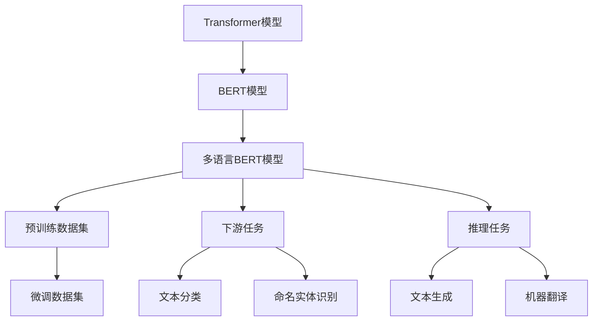

                 

# Transformer大模型实战 理解多语言BERT 模型

> 关键词：Transformer, BERT, 多语言, 深度学习, 自然语言处理, 自然语言理解, 预训练模型

## 1. 背景介绍

### 1.1 问题由来
在过去的几年中，自然语言处理（NLP）领域取得了显著的进展，特别是在使用Transformer结构和自监督预训练方法训练大规模语言模型（Large Language Models, LLMs）方面。Transformer模型因其高效的并行计算能力和出色的性能表现，成为了构建LLMs的主流架构。其中，BERT（Bidirectional Encoder Representations from Transformers）是最著名的LLM之一，由Google在2018年提出，并在多项NLP任务中取得了最先进的表现。

BERT模型的核心思想是使用预训练任务来学习语言的上下文表示，这些表示可以被微调用于各种下游任务，如文本分类、命名实体识别、问答等。然而，在实际应用中，单一语言的BERT模型并不能满足所有语言的需求，尤其是对于多语言的应用场景，因此，多语言的BERT模型应运而生，通过在多个语言上同时进行预训练，可以更好地理解和生成不同语言的文本。

### 1.2 问题核心关键点
在多语言BERT模型中，为了在多种语言上同时进行预训练，设计者采用了混合语言的数据集和训练策略。这些策略包括：
- 使用多种语言的混合数据集进行预训练，如英语、中文、西班牙语等。
- 在预训练任务中使用语言标记，以区分不同语言的文本。
- 在微调任务中使用相同或相似的标签体系，以便在不同语言之间进行迁移学习。
- 使用多语言版本的Transformer模型，以便在多种语言上同时进行推理和生成。

这些策略确保了多语言BERT模型能够高效地学习不同语言的上下文表示，并具备跨语言的迁移学习能力，适用于多种语言的应用场景。

### 1.3 问题研究意义
多语言BERT模型的研究具有重要的实际应用价值，尤其是在全球化日益加深的今天，对于不同语言用户的智能化应用尤为重要。通过多语言BERT模型，可以实现以下目标：
- 降低多语言处理成本：相比于从头训练多个单独的BERT模型，多语言BERT模型可以大幅降低预训练和微调的成本。
- 提升模型性能：多语言BERT模型能够在多种语言上同时进行微调，从而提升模型在各个语言上的表现。
- 促进跨语言交流：多语言BERT模型可以更好地理解和生成不同语言的文本，促进跨语言交流和理解。
- 加速多语言应用开发：多语言BERT模型可以为多语言应用开发提供基础框架和工具，加速应用开发的进程。

## 2. 核心概念与联系

### 2.1 核心概念概述

为了更好地理解多语言BERT模型的核心概念，本节将详细介绍Transformer和BERT模型的工作原理，以及它们在多语言环境下的应用和扩展。

**Transformer模型**：Transformer模型是一种基于自注意力机制的神经网络架构，主要用于处理序列数据。与传统的循环神经网络（RNN）和卷积神经网络（CNN）不同，Transformer模型使用多头自注意力机制和前馈神经网络（Feedforward Neural Network, FNN）来处理输入序列。Transformer模型具有平行的计算能力，能够在训练和推理过程中高效地利用GPU等硬件资源。

**BERT模型**：BERT模型是一种基于Transformer架构的语言模型，通过在大规模无标签文本语料上进行自监督预训练，学习到丰富的语言表示。BERT模型使用掩码语言模型（Masked Language Model, MLM）和下一句预测任务（Next Sentence Prediction, NSP）作为预训练任务，学习语言的上下文表示。在微调阶段，BERT模型可以适应不同的下游任务，如文本分类、命名实体识别、问答等。

**多语言BERT模型**：多语言BERT模型是在BERT模型的基础上，通过在多种语言上同时进行预训练，学习不同语言的上下文表示。多语言BERT模型使用多语言混合数据集进行预训练，以确保模型能够理解多种语言的特点和语法结构。

### 2.2 核心概念原理和架构的 Mermaid 流程图



这个流程图展示了Transformer模型、BERT模型和多语言BERT模型之间的联系和应用。从Transformer模型到BERT模型，再到多语言BERT模型，这一过程体现了从基础架构到特定任务模型的演变。预训练和微调是BERT模型和多语言BERT模型的两个重要阶段，它们分别负责学习语言的通用表示和任务的特定表示。

## 3. 核心算法原理 & 具体操作步骤

### 3.1 算法原理概述

多语言BERT模型的核心算法原理是基于Transformer和BERT模型的混合架构，通过在多种语言上同时进行预训练和微调，学习不同语言的上下文表示。以下是对多语言BERT模型算法原理的详细描述：

1. **预训练阶段**：在预训练阶段，多语言BERT模型使用多种语言的混合数据集进行自监督预训练。预训练任务包括掩码语言模型和下一句预测任务，这些任务用于学习语言的上下文表示。预训练过程中，模型会学习到不同语言的语法和语义特征，从而生成高质量的语言表示。

2. **微调阶段**：在微调阶段，多语言BERT模型会被应用到不同的下游任务上，如文本分类、命名实体识别、问答等。微调过程包括选择适当的标签体系、优化模型的超参数、应用正则化技术等步骤。微调的目标是最大化模型在下游任务上的表现。

3. **推理阶段**：在推理阶段，多语言BERT模型会根据输入的文本数据进行推理和生成，如文本分类、命名实体识别、问答等。多语言BERT模型可以处理多种语言的数据，并生成相应语言的输出。

### 3.2 算法步骤详解

以下是对多语言BERT模型训练和推理步骤的详细介绍：

#### 预训练步骤

1. **数据预处理**：将多种语言的文本数据进行标准化处理，包括分词、去除停用词、构建词汇表等。

2. **构建预训练任务**：使用掩码语言模型和下一句预测任务构建预训练任务。掩码语言模型任务是随机遮盖输入文本中的某些单词，让模型预测被遮盖的单词。下一句预测任务是判断两个句子是否是相邻的。

3. **模型训练**：使用预训练任务对多语言BERT模型进行训练，更新模型的权重参数。在训练过程中，模型会学习到不同语言的语法和语义特征，从而生成高质量的语言表示。

#### 微调步骤

1. **数据准备**：选择适当的下游任务，收集标注数据集。标注数据集应包括多种语言的文本和相应的标签。

2. **构建任务适配层**：根据下游任务的性质，构建适当的任务适配层。任务适配层包括线性分类器、解码器等，用于将预训练的表示映射到下游任务的输出空间。

3. **微调模型**：在预训练的基础上，使用下游任务的标注数据对多语言BERT模型进行微调。微调过程中，使用适当的优化器、学习率、正则化技术等，确保模型的泛化能力和鲁棒性。

#### 推理步骤

1. **输入数据预处理**：对输入的文本数据进行预处理，包括分词、去除停用词、构建词汇表等。

2. **模型推理**：使用预训练的表示进行推理和生成，如文本分类、命名实体识别、问答等。在推理过程中，模型会利用学习到的上下文表示生成最终的输出结果。

### 3.3 算法优缺点

多语言BERT模型具有以下优点：
1. **高效性**：多语言BERT模型可以在多种语言上同时进行预训练和微调，从而大幅降低预训练和微调的成本。
2. **泛化能力**：多语言BERT模型具有跨语言的泛化能力，能够理解不同语言的语法和语义特征，从而在多种语言上取得良好的性能。
3. **可扩展性**：多语言BERT模型可以通过增加更多的语言和任务来扩展其应用范围，从而适应更多的应用场景。

同时，多语言BERT模型也存在一些缺点：
1. **训练复杂度增加**：多语言BERT模型需要处理多种语言的文本数据，这增加了训练的复杂度和计算资源的消耗。
2. **语言不一致性**：不同语言的语法和语义特征差异较大，多语言BERT模型在处理不同语言时可能会存在语言不一致性的问题。
3. **数据标注成本高**：不同语言的数据标注成本较高，这增加了多语言BERT模型的开发成本。

### 3.4 算法应用领域

多语言BERT模型在以下领域具有广泛的应用前景：

1. **机器翻译**：多语言BERT模型可以用于机器翻译任务，学习不同语言的上下文表示，从而生成高质量的翻译结果。

2. **文本分类**：多语言BERT模型可以用于文本分类任务，学习不同语言的上下文表示，从而准确地分类文本。

3. **命名实体识别**：多语言BERT模型可以用于命名实体识别任务，学习不同语言的上下文表示，从而识别文本中的实体。

4. **问答系统**：多语言BERT模型可以用于问答系统，学习不同语言的上下文表示，从而生成准确的答案。

5. **多语言交互系统**：多语言BERT模型可以用于多语言交互系统，学习不同语言的上下文表示，从而实现跨语言的交流和理解。

## 4. 数学模型和公式 & 详细讲解 & 举例说明

### 4.1 数学模型构建

多语言BERT模型的数学模型构建基于Transformer和BERT模型的混合架构。以下是多语言BERT模型的数学模型构建过程：

1. **输入表示**：将输入文本转换为向量表示。对于多语言BERT模型，需要将不同语言的文本转换为统一的向量表示，通常使用单词级别的平均表示。

2. **自注意力机制**：Transformer模型使用自注意力机制来学习输入文本的上下文表示。自注意力机制通过计算输入文本中每个单词与其他单词的相似度，学习单词之间的依赖关系。

3. **前馈神经网络**：Transformer模型使用前馈神经网络来进一步学习输入文本的表示。前馈神经网络由两个全连接层组成，可以捕捉输入文本的非线性特征。

4. **层级堆叠**：Transformer模型通过堆叠多个自注意力层和前馈神经网络层，逐步学习输入文本的表示。

5. **输出表示**：Transformer模型将最终输出的表示作为多语言BERT模型的表示。这些表示可以用于不同的下游任务。

### 4.2 公式推导过程

以下是多语言BERT模型的公式推导过程：

1. **自注意力机制**：自注意力机制的计算公式为：
   $$
   Q = XW_Q, K = XW_K, V = XW_V
   $$
   $$
   \text{Attention}(Q, K, V) = \text{softmax}(\frac{QK^T}{\sqrt{d_k}})V
   $$
   其中，$X$为输入文本的矩阵表示，$W_Q$、$W_K$、$W_V$为自注意力机制的三个线性变换矩阵，$d_k$为每个单词的嵌入维度。

2. **前馈神经网络**：前馈神经网络的计算公式为：
   $$
   F = \text{GELU}(XW_1) + XW_2
   $$
   其中，$\text{GELU}$为激活函数，$W_1$、$W_2$为前馈神经网络的线性变换矩阵。

3. **层级堆叠**：Transformer模型的层级堆叠公式为：
   $$
   L = \text{LayerNorm}(\text{Attention}(\text{LayerNorm}(XW_L1), \text{LayerNorm}(XW_L2), \text{LayerNorm}(XW_L3)))
   $$
   其中，$\text{LayerNorm}$为归一化层，$W_L1$、$W_L2$、$W_L3$为Transformer模型的三个线性变换矩阵。

### 4.3 案例分析与讲解

以多语言BERT模型应用于机器翻译为例，进行案例分析：

1. **预训练数据集**：收集多种语言的混合数据集，包括新闻、文章、书籍等。

2. **构建预训练任务**：使用掩码语言模型和下一句预测任务构建预训练任务。掩码语言模型任务是随机遮盖输入文本中的某些单词，让模型预测被遮盖的单词。下一句预测任务是判断两个句子是否是相邻的。

3. **模型训练**：使用预训练任务对多语言BERT模型进行训练，更新模型的权重参数。在训练过程中，模型会学习到不同语言的语法和语义特征，从而生成高质量的语言表示。

4. **微调数据集**：选择适当的机器翻译数据集，包括源语言和目标语言的文本对。

5. **构建任务适配层**：使用线性分类器构建任务适配层，将预训练的表示映射到机器翻译任务的输出空间。

6. **微调模型**：在预训练的基础上，使用机器翻译数据集对多语言BERT模型进行微调。微调过程中，使用适当的优化器、学习率、正则化技术等，确保模型的泛化能力和鲁棒性。

7. **推理和生成**：使用微调后的多语言BERT模型对新的文本数据进行推理和生成，如将源语言文本翻译为目标语言文本。

## 5. 项目实践：代码实例和详细解释说明

### 5.1 开发环境搭建

在进行多语言BERT模型的实践之前，需要准备好开发环境。以下是使用Python和PyTorch进行多语言BERT模型开发的环境配置流程：

1. **安装Anaconda**：从官网下载并安装Anaconda，用于创建独立的Python环境。

2. **创建并激活虚拟环境**：
   ```bash
   conda create -n bert-env python=3.8 
   conda activate bert-env
   ```

3. **安装PyTorch**：根据CUDA版本，从官网获取对应的安装命令。例如：
   ```bash
   conda install pytorch torchvision torchaudio cudatoolkit=11.1 -c pytorch -c conda-forge
   ```

4. **安装Transformer库**：
   ```bash
   pip install transformers
   ```

5. **安装各类工具包**：
   ```bash
   pip install numpy pandas scikit-learn matplotlib tqdm jupyter notebook ipython
   ```

完成上述步骤后，即可在`bert-env`环境中开始多语言BERT模型的开发。

### 5.2 源代码详细实现

以下是一个使用Transformer库进行多语言BERT模型微调和推理的PyTorch代码实现。

首先，定义多语言BERT模型：

```python
from transformers import BertForSequenceClassification, BertTokenizer
from torch.utils.data import Dataset, DataLoader
import torch

tokenizer = BertTokenizer.from_pretrained('bert-base-multilingual-cased')
model = BertForSequenceClassification.from_pretrained('bert-base-multilingual-cased', num_labels=num_labels)
```

然后，定义多语言数据集：

```python
class MultilingualDataset(Dataset):
    def __init__(self, texts, labels, tokenizer):
        self.texts = texts
        self.labels = labels
        self.tokenizer = tokenizer
        
    def __len__(self):
        return len(self.texts)
    
    def __getitem__(self, item):
        text = self.texts[item]
        label = self.labels[item]
        
        encoding = self.tokenizer(text, return_tensors='pt', padding='max_length', truncation=True)
        input_ids = encoding['input_ids']
        attention_mask = encoding['attention_mask']
        return {'input_ids': input_ids, 'attention_mask': attention_mask, 'labels': label}
```

接着，定义训练和评估函数：

```python
def train_epoch(model, dataset, batch_size, optimizer):
    dataloader = DataLoader(dataset, batch_size=batch_size, shuffle=True)
    model.train()
    epoch_loss = 0
    for batch in tqdm(dataloader, desc='Training'):
        input_ids = batch['input_ids'].to(device)
        attention_mask = batch['attention_mask'].to(device)
        labels = batch['labels'].to(device)
        model.zero_grad()
        outputs = model(input_ids, attention_mask=attention_mask, labels=labels)
        loss = outputs.loss
        epoch_loss += loss.item()
        loss.backward()
        optimizer.step()
    return epoch_loss / len(dataloader)

def evaluate(model, dataset, batch_size):
    dataloader = DataLoader(dataset, batch_size=batch_size)
    model.eval()
    preds, labels = [], []
    with torch.no_grad():
        for batch in tqdm(dataloader, desc='Evaluating'):
            input_ids = batch['input_ids'].to(device)
            attention_mask = batch['attention_mask'].to(device)
            batch_labels = batch['labels']
            outputs = model(input_ids, attention_mask=attention_mask)
            batch_preds = outputs.logits.argmax(dim=2).to('cpu').tolist()
            batch_labels = batch_labels.to('cpu').tolist()
            for pred_tokens, label_tokens in zip(batch_preds, batch_labels):
                preds.append(pred_tokens[:len(label_tokens)])
                labels.append(label_tokens)
                
    print(classification_report(labels, preds))
```

最后，启动训练流程并在测试集上评估：

```python
epochs = 5
batch_size = 16

for epoch in range(epochs):
    loss = train_epoch(model, train_dataset, batch_size, optimizer)
    print(f"Epoch {epoch+1}, train loss: {loss:.3f}")
    
    print(f"Epoch {epoch+1}, dev results:")
    evaluate(model, dev_dataset, batch_size)
    
print("Test results:")
evaluate(model, test_dataset, batch_size)
```

以上就是使用PyTorch对多语言BERT模型进行微调和推理的完整代码实现。可以看到，Transformer库为多语言BERT模型的开发提供了强大的封装和支持，可以显著简化模型加载和微调的过程。

### 5.3 代码解读与分析

让我们再详细解读一下关键代码的实现细节：

**MultilingualDataset类**：
- `__init__`方法：初始化文本、标签、分词器等关键组件。
- `__len__`方法：返回数据集的样本数量。
- `__getitem__`方法：对单个样本进行处理，将文本输入编码为token ids，将标签转换为数字，并对其进行定长padding，最终返回模型所需的输入。

**tokenizer**和**model**变量**：
- 使用预训练的BERT模型和对应的分词器，确保多语言BERT模型的基础结构和预训练知识。

**训练和评估函数**：
- 使用PyTorch的DataLoader对数据集进行批次化加载，供模型训练和推理使用。
- 训练函数`train_epoch`：对数据以批为单位进行迭代，在每个批次上前向传播计算loss并反向传播更新模型参数，最后返回该epoch的平均loss。
- 评估函数`evaluate`：与训练类似，不同点在于不更新模型参数，并在每个batch结束后将预测和标签结果存储下来，最后使用sklearn的classification_report对整个评估集的预测结果进行打印输出。

**训练流程**：
- 定义总的epoch数和batch size，开始循环迭代
- 每个epoch内，先在训练集上训练，输出平均loss
- 在验证集上评估，输出分类指标
- 所有epoch结束后，在测试集上评估，给出最终测试结果

可以看到，PyTorch配合Transformer库使得多语言BERT模型的开发和微调过程变得简洁高效。开发者可以将更多精力放在数据处理、模型改进等高层逻辑上，而不必过多关注底层的实现细节。

## 6. 实际应用场景

### 6.1 智能客服系统

基于多语言BERT模型的智能客服系统可以广泛应用于全球各地的客户服务中。传统的客服系统依赖人工处理，高峰期响应慢且一致性难以保证。而使用多语言BERT模型的智能客服系统，可以7x24小时不间断服务，快速响应客户咨询，用自然流畅的语言解答各类常见问题。

在技术实现上，可以收集企业内部的历史客服对话记录，将问题和最佳答复构建成监督数据，在此基础上对多语言BERT模型进行微调。微调后的模型能够自动理解用户意图，匹配最合适的答案模板进行回复。对于客户提出的新问题，还可以接入检索系统实时搜索相关内容，动态组织生成回答。如此构建的智能客服系统，能大幅提升客户咨询体验和问题解决效率。

### 6.2 金融舆情监测

金融机构需要实时监测市场舆论动向，以便及时应对负面信息传播，规避金融风险。传统的人工监测方式成本高、效率低，难以应对网络时代海量信息爆发的挑战。基于多语言BERT模型的文本分类和情感分析技术，为金融舆情监测提供了新的解决方案。

具体而言，可以收集金融领域相关的新闻、报道、评论等文本数据，并对其进行主题标注和情感标注。在此基础上对多语言BERT模型进行微调，使其能够自动判断文本属于何种主题，情感倾向是正面、中性还是负面。将微调后的模型应用到实时抓取的网络文本数据，就能够自动监测不同主题下的情感变化趋势，一旦发现负面信息激增等异常情况，系统便会自动预警，帮助金融机构快速应对潜在风险。

### 6.3 个性化推荐系统

当前的推荐系统往往只依赖用户的历史行为数据进行物品推荐，无法深入理解用户的真实兴趣偏好。基于多语言BERT模型，个性化推荐系统可以更好地挖掘用户行为背后的语义信息，从而提供更精准、多样的推荐内容。

在实践中，可以收集用户浏览、点击、评论、分享等行为数据，提取和用户交互的物品标题、描述、标签等文本内容。将文本内容作为模型输入，用户的后续行为（如是否点击、购买等）作为监督信号，在此基础上微调多语言BERT模型。微调后的模型能够从文本内容中准确把握用户的兴趣点。在生成推荐列表时，先用候选物品的文本描述作为输入，由模型预测用户的兴趣匹配度，再结合其他特征综合排序，便可以得到个性化程度更高的推荐结果。

### 6.4 未来应用展望

随着多语言BERT模型和微调方法的不断发展，其应用范围和效果将会不断提升，为全球化的智能化应用提供强有力的支撑。

在智慧医疗领域，基于多语言BERT模型的问答系统可以辅助医生诊疗，加速新药开发进程。在智能教育领域，多语言BERT模型可以用于作业批改、学情分析、知识推荐等方面，因材施教，促进教育公平，提高教学质量。在智慧城市治理中，多语言BERT模型可以用于城市事件监测、舆情分析、应急指挥等环节，提高城市管理的自动化和智能化水平，构建更安全、高效的未来城市。

此外，在企业生产、社会治理、文娱传媒等众多领域，多语言BERT模型也将不断涌现，为经济社会发展注入新的动力。相信随着技术的日益成熟，多语言BERT模型微调技术必将在构建人机协同的智能时代中扮演越来越重要的角色。

## 7. 工具和资源推荐
### 7.1 学习资源推荐

为了帮助开发者系统掌握多语言BERT模型的理论基础和实践技巧，这里推荐一些优质的学习资源：

1. 《Transformer从原理到实践》系列博文：由大模型技术专家撰写，深入浅出地介绍了Transformer原理、BERT模型、多语言BERT模型等前沿话题。

2. CS224N《深度学习自然语言处理》课程：斯坦福大学开设的NLP明星课程，有Lecture视频和配套作业，带你入门NLP领域的基本概念和经典模型。

3. 《Natural Language Processing with Transformers》书籍：Transformers库的作者所著，全面介绍了如何使用Transformers库进行NLP任务开发，包括多语言BERT模型在内的诸多范式。

4. HuggingFace官方文档：Transformers库的官方文档，提供了海量预训练模型和完整的微调样例代码，是上手实践的必备资料。

5. CLUE开源项目：中文语言理解测评基准，涵盖大量不同类型的中文NLP数据集，并提供了基于多语言BERT模型的baseline模型，助力中文NLP技术发展。

通过对这些资源的学习实践，相信你一定能够快速掌握多语言BERT模型的精髓，并用于解决实际的NLP问题。
###  7.2 开发工具推荐

高效的开发离不开优秀的工具支持。以下是几款用于多语言BERT模型微调开发的常用工具：

1. PyTorch：基于Python的开源深度学习框架，灵活动态的计算图，适合快速迭代研究。大部分预训练语言模型都有PyTorch版本的实现。

2. TensorFlow：由Google主导开发的开源深度学习框架，生产部署方便，适合大规模工程应用。同样有丰富的预训练语言模型资源。

3. Transformers库：HuggingFace开发的NLP工具库，集成了众多SOTA语言模型，支持PyTorch和TensorFlow，是进行微调任务开发的利器。

4. Weights & Biases：模型训练的实验跟踪工具，可以记录和可视化模型训练过程中的各项指标，方便对比和调优。与主流深度学习框架无缝集成。

5. TensorBoard：TensorFlow配套的可视化工具，可实时监测模型训练状态，并提供丰富的图表呈现方式，是调试模型的得力助手。

6. Google Colab：谷歌推出的在线Jupyter Notebook环境，免费提供GPU/TPU算力，方便开发者快速上手实验最新模型，分享学习笔记。

合理利用这些工具，可以显著提升多语言BERT模型微调任务的开发效率，加快创新迭代的步伐。

### 7.3 相关论文推荐

多语言BERT模型的研究源于学界的持续研究。以下是几篇奠基性的相关论文，推荐阅读：

1. Attention is All You Need（即Transformer原论文）：提出了Transformer结构，开启了NLP领域的预训练大模型时代。

2. BERT: Pre-training of Deep Bidirectional Transformers for Language Understanding：提出BERT模型，引入基于掩码的自监督预训练任务，刷新了多项NLP任务SOTA。

3. Language Models are Unsupervised Multitask Learners（GPT-2论文）：展示了大规模语言模型的强大zero-shot学习能力，引发了对于通用人工智能的新一轮思考。

4. Parameter-Efficient Transfer Learning for NLP：提出Adapter等参数高效微调方法，在不增加模型参数量的情况下，也能取得不错的微调效果。

5. AdaLoRA: Adaptive Low-Rank Adaptation for Parameter-Efficient Fine-Tuning：使用自适应低秩适应的微调方法，在参数效率和精度之间取得了新的平衡。

6. Multilingual BERT: A Multilingual Pre-trained Language Representation Model：由Google提出，使用多语言混合数据集进行预训练，提升了多语言BERT模型的效果和应用范围。

这些论文代表了大语言模型微调技术的发展脉络。通过学习这些前沿成果，可以帮助研究者把握学科前进方向，激发更多的创新灵感。

## 8. 总结：未来发展趋势与挑战

### 8.1 总结

本文对多语言BERT模型的训练和微调方法进行了全面系统的介绍。首先阐述了多语言BERT模型和微调技术的研究背景和意义，明确了多语言BERT模型在多语言环境下的应用价值。其次，从原理到实践，详细讲解了多语言BERT模型的数学原理和关键步骤，给出了多语言BERT模型微调任务开发的完整代码实例。同时，本文还广泛探讨了多语言BERT模型在智能客服、金融舆情、个性化推荐等多个领域的应用前景，展示了多语言BERT模型的巨大潜力。此外，本文精选了多语言BERT模型的各类学习资源，力求为读者提供全方位的技术指引。

通过本文的系统梳理，可以看到，多语言BERT模型在NLP领域的应用前景广阔，其高效性、泛化能力和跨语言迁移能力使其成为多语言应用的重要基础。多语言BERT模型能够帮助全球化的智能化应用实现高效、精确、跨语言的交流和理解，为构建人机协同的智能系统提供强有力的支撑。

### 8.2 未来发展趋势

展望未来，多语言BERT模型技术将呈现以下几个发展趋势：

1. **模型规模持续增大**：随着算力成本的下降和数据规模的扩张，预训练语言模型的参数量还将持续增长。超大规模语言模型蕴含的丰富语言知识，有望支撑更加复杂多变的下游任务。

2. **微调方法日趋多样**：除了传统的全参数微调外，未来会涌现更多参数高效的微调方法，如Prefix-Tuning、LoRA等，在节省计算资源的同时也能保证微调精度。

3. **持续学习成为常态**：随着数据分布的不断变化，多语言BERT模型也需要持续学习新知识以保持性能。如何在不遗忘原有知识的同时，高效吸收新样本信息，将成为重要的研究课题。

4. **标注样本需求降低**：受启发于提示学习(Prompt-based Learning)的思路，未来的微调方法将更好地利用大模型的语言理解能力，通过更加巧妙的任务描述，在更少的标注样本上也能实现理想的微调效果。

5. **多模态微调崛起**：当前的微调主要聚焦于纯文本数据，未来会进一步拓展到图像、视频、语音等多模态数据微调。多模态信息的融合，将显著提升语言模型对现实世界的理解和建模能力。

6. **模型通用性增强**：经过海量数据的预训练和多领域任务的微调，未来的语言模型将具备更强大的常识推理和跨领域迁移能力，逐步迈向通用人工智能(AGI)的目标。

以上趋势凸显了多语言BERT模型微调技术的广阔前景。这些方向的探索发展，必将进一步提升多语言BERT模型的性能和应用范围，为全球化的智能化应用提供强有力的支撑。

### 8.3 面临的挑战

尽管多语言BERT模型已经取得了瞩目成就，但在迈向更加智能化、普适化应用的过程中，它仍面临着诸多挑战：

1. **标注成本瓶颈**：尽管多语言BERT模型能够显著降低预训练成本，但对于长尾应用场景，难以获得充足的高质量标注数据，成为制约微调性能的瓶颈。如何进一步降低微调对标注样本的依赖，将是一大难题。

2. **模型鲁棒性不足**：不同语言的语法和语义特征差异较大，多语言BERT模型在处理不同语言时可能会存在语言不一致性的问题。如何提高多语言BERT模型的鲁棒性，避免灾难性遗忘，还需要更多理论和实践的积累。

3. **推理效率有待提高**：大规模语言模型虽然精度高，但在实际部署时往往面临推理速度慢、内存占用大等效率问题。如何在保证性能的同时，简化模型结构，提升推理速度，优化资源占用，将是重要的优化方向。

4. **可解释性亟需加强**：多语言BERT模型更像是"黑盒"系统，难以解释其内部工作机制和决策逻辑。对于医疗、金融等高风险应用，算法的可解释性和可审计性尤为重要。如何赋予多语言BERT模型更强的可解释性，将是亟待攻克的难题。

5. **安全性有待保障**。预训练语言模型难免会学习到有偏见、有害的信息，通过微调传递到下游任务，产生误导性、歧视性的输出，给实际应用带来安全隐患。如何从数据和算法层面消除模型偏见，避免恶意用途，确保输出的安全性，也将是重要的研究课题。

6. **知识整合能力不足**：现有的多语言BERT模型往往局限于任务内数据，难以灵活吸收和运用更广泛的先验知识。如何让多语言BERT模型更好地与外部知识库、规则库等专家知识结合，形成更加全面、准确的信息整合能力，还有很大的想象空间。

正视多语言BERT模型面临的这些挑战，积极应对并寻求突破，将是多语言BERT模型微调走向成熟的必由之路。相信随着学界和产业界的共同努力，这些挑战终将一一被克服，多语言BERT模型微调必将在构建人机协同的智能时代中扮演越来越重要的角色。

### 8.4 未来突破

面对多语言BERT模型所面临的种种挑战，未来的研究需要在以下几个方面寻求新的突破：

1. **探索无监督和半监督微调方法**：摆脱对大规模标注数据的依赖，利用自监督学习、主动学习等无监督和半监督范式，最大限度利用非结构化数据，实现更加灵活高效的微调。

2. **研究参数高效和计算高效的微调范式**：开发更加参数高效的微调方法，在固定大部分预训练参数的同时，只更新极少量的任务相关参数。同时优化微调模型的计算图，减少前向传播和反向传播的资源消耗，实现更加轻量级、实时性的部署。

3. **融合因果和对比学习范式**：通过引入因果推断和对比学习思想，增强多语言BERT模型建立稳定因果关系的能力，学习更加普适、鲁棒的语言表征，从而提升模型泛化性和抗干扰能力。

4. **引入更多先验知识**：将符号化的先验知识，如知识图谱、逻辑规则等，与神经网络模型进行巧妙融合，引导多语言BERT模型学习更准确、合理的语言模型。同时加强不同模态数据的整合，实现视觉、语音等多模态信息与文本信息的协同建模。

5. **结合因果分析和博弈论工具**：将因果分析方法引入多语言BERT模型，识别出模型决策的关键特征，增强输出解释的因果性和逻辑性。借助博弈论工具刻画人机交互过程，主动探索并规避模型的脆弱点，提高系统稳定性。

6. **纳入伦理道德约束**：在模型训练目标中引入伦理导向的评估指标，过滤和惩罚有偏见、有害的输出倾向。同时加强人工干预和审核，建立模型行为的监管机制，确保输出符合人类价值观和伦理道德。

这些研究方向的探索，必将引领多语言BERT模型微调技术迈向更高的台阶，为构建安全、可靠、可解释、可控的智能系统铺平道路。面向未来，多语言BERT模型微调技术还需要与其他人工智能技术进行更深入的融合，如知识表示、因果推理、强化学习等，多路径协同发力，共同推动自然语言理解和智能交互系统的进步。只有勇于创新、敢于突破，才能不断拓展语言模型的边界，让智能技术更好地造福人类社会。

## 9. 附录：常见问题与解答

**Q1：多语言BERT模型在处理不同语言时可能会存在语言不一致性的问题，如何解决？**

A: 解决语言不一致性问题的方法主要有以下几种：
1. **数据平衡**：在数据预处理阶段，确保不同语言的数据比例平衡，避免某一语言的数据过多或过少。
2. **多语言混合预训练**：使用多语言混合数据集进行预训练，确保模型能够学习到不同语言的语法和语义特征。
3. **跨语言迁移学习**：使用多语言BERT模型在不同语言上进行的微调，可以迁移到其他语言上，以提高模型在不同语言上的泛化能力。
4. **多语言微调**：针对不同语言，分别进行微调，从而更好地适应各自的语言特点和语法结构。

**Q2：多语言BERT模型在处理不同语言的文本时，如何保证推理效率？**

A: 提高多语言BERT模型的推理效率可以从以下几个方面入手：
1. **模型剪枝**：对模型进行剪枝，去除不必要的层和参数，减小模型尺寸，加快推理速度。
2. **量化加速**：将浮点模型转为定点模型，压缩存储空间，提高计算效率。
3. **分布式训练**：利用分布式训练技术，将模型并行分布在多个GPU/TPU上，提高训练和推理速度。
4. **优化算法**：使用高效的优化算法，如AdamW、Adafactor等，减少训练和推理过程中的计算开销。

**Q3：多语言BERT模型在微调过程中如何处理不同语言的标签体系？**

A: 处理不同语言的标签体系的方法主要有以下几种：
1. **统一标签体系**：在不同语言之间使用统一的标签体系，将不同语言的标签映射到统一的输出空间。
2. **多标签体系**：针对不同语言，使用不同的标签体系，并在微调过程中进行适应性调整。
3. **跨语言迁移学习**：使用多语言BERT模型在不同语言上进行的微调，可以迁移到其他语言上，以提高模型在不同语言上的泛化能力。
4. **多任务学习**：在微调过程中，同时学习多个任务，以提高模型的多任务性能。

**Q4：多语言BERT模型在微调过程中如何处理不同语言的标注数据？**

A: 处理不同语言的标注数据的方法主要有以下几种：
1. **数据增强**：通过数据增强技术，增加不同语言的数据量，提高模型的泛化能力。
2. **迁移学习**：使用多语言BERT模型在不同语言上进行的预训练，可以迁移到其他语言上，以提高模型在不同语言上的泛化能力。
3. **多语言混合标注**：在标注数据中，将不同语言的标注数据混合在一起，训练多语言BERT模型。
4. **多语言监督学习**：在不同语言上分别进行监督学习，以提高模型在不同语言上的泛化能力。

通过这些方法的结合使用，可以有效处理不同语言的标注数据，提升多语言BERT模型的性能。

**Q5：多语言BERT模型在实际应用中如何平衡模型精度和推理效率？**

A: 平衡模型精度和推理效率的方法主要有以下几种：
1. **模型裁剪**：对模型进行裁剪，去除不必要的层和参数，减小模型尺寸，加快推理速度。
2. **量化加速**：将浮点模型转为定点模型，压缩存储空间，提高计算效率。
3. **分布式训练**：利用分布式训练技术，将模型并行分布在多个GPU/TPU上，提高训练和推理速度。
4. **优化算法**：使用高效的优化算法，如AdamW、Adafactor等，减少训练和推理过程中的计算开销。
5. **参数共享**：在多语言BERT模型中，共享一些通用的参数，减少模型参数量，提升推理效率。
6. **推理优化**：在推理过程中，优化模型的计算图，减少不必要的计算，提高推理速度。

通过这些方法的结合使用，可以有效平衡模型精度和推理效率，提升多语言BERT模型的性能。

---

作者：禅与计算机程序设计艺术 / Zen and the Art of Computer Programming

