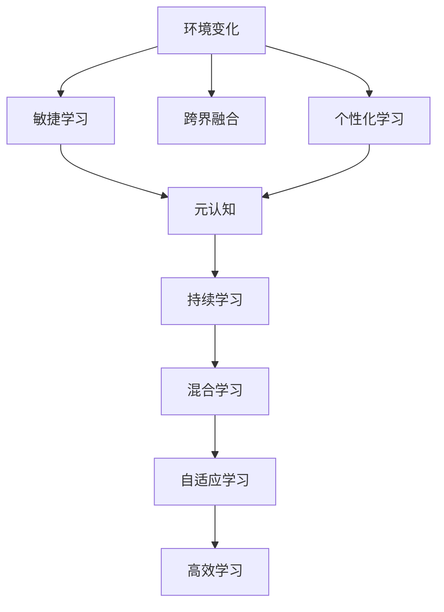

                 

# VUCA时代下的学习策略

## 1. 背景介绍

### 1.1 问题由来

在全球化、信息化快速发展的当下，VUCA（Volatility，Uncertainty，Complexity，Ambiguity）已成为许多行业和组织面临的新常态。环境的不确定性、竞争的激烈性、市场的多变性、技术的革新性，都给企业及个人带来了前所未有的挑战和机遇。在这样的背景下，学习的重要性变得愈发凸显。

### 1.2 问题核心关键点

1. **快速适应**：如何在快速变化的环境中保持敏锐的洞察力和灵活的应对能力？
2. **跨界学习**：如何在复杂多变的场景中跨界学习新知识，拓宽能力边界？
3. **个性化学习**：如何在个性化需求日益增多的时代，找到适合自己的学习路径？
4. **长期积累**：如何在长期的学习过程中保持高效和持续的进步？
5. **技术发展**：如何在技术快速发展的浪潮中保持技术的领先性？

### 1.3 问题研究意义

VUCA时代的快速变化和不确定性要求学习者具备更加灵活、高效、持续的学习能力。通过系统学习如何应对VUCA时代的挑战，可以有效提升个人和企业对复杂环境的适应能力，增强竞争力。

## 2. 核心概念与联系

### 2.1 核心概念概述

- **VUCA**：环境动荡（Volatility）、不确定性（Uncertainty）、复杂性（Complexity）、模糊性（Ambiguity），描述了现代组织面临的复杂多变的环境。
- **敏捷学习**：快速适应变化，具备快速学习和自我更新的能力。
- **跨界融合**：不同领域间的知识整合和应用，提升综合能力。
- **个性化学习**：根据个人需求和兴趣，选择和调整学习路径，提升学习效率。
- **元认知**：对自身学习过程的反思和监控，提升学习效果。
- **持续学习**：持续不断地获取新知识和技能，保持长期的进步。
- **混合学习**：线上线下、多渠道、多种形式的融合学习，提高学习效率和效果。
- **自适应学习**：根据学习者状态和环境变化，动态调整学习策略，提高学习效果。
- **高效学习**：通过优化学习过程和策略，提高学习效率和效果。

这些核心概念构成了应对VUCA时代挑战的学习策略框架，旨在帮助学习者提升应对环境变化的能力，拓宽知识边界，实现高效、持续和个性化的学习。

### 2.2 核心概念原理和架构的 Mermaid 流程图



这个流程图展示了VUCA时代下的学习策略核心概念及其相互关系。环境变化触发敏捷学习，跨界融合拓宽知识边界，个性化学习提升学习效率，元认知监控学习过程，持续学习保证长期进步，混合学习优化学习形式，自适应学习动态调整策略，高效学习提升学习效果。

## 3. 核心算法原理 & 具体操作步骤

### 3.1 算法原理概述

VUCA时代下的学习策略，本质上是基于数据驱动和反馈机制的动态调整过程。其核心思想是：通过收集学习者的行为数据和反馈信息，结合环境变化和需求变化，动态调整学习路径和策略，以提升学习效果。

### 3.2 算法步骤详解

1. **数据收集**：收集学习者的行为数据，包括学习时长、学习内容、学习频次、互动反馈等。
2. **环境感知**：分析外部环境的变化，如行业趋势、技术进展、市场变化等，评估其对学习需求的影响。
3. **需求分析**：根据学习者的兴趣、职业需求、发展目标，分析其学习需求和优先级。
4. **策略制定**：基于收集的数据和环境感知，制定个性化的学习策略，包括学习路径、学习内容、学习方法等。
5. **动态调整**：根据学习者的反馈和环境变化，动态调整学习策略，确保学习目标的达成。
6. **效果评估**：定期评估学习效果，包括知识掌握程度、技能提升情况、学习满意度等，以便及时调整学习策略。

### 3.3 算法优缺点

#### 优点：

- **个性化**：通过个性化学习策略，提升学习效率和效果。
- **动态调整**：根据环境和需求的变化，动态调整学习策略，灵活应对挑战。
- **数据驱动**：基于数据和反馈，科学制定学习策略，提高决策准确性。
- **持续改进**：通过持续评估和优化，不断提升学习效果。

#### 缺点：

- **数据隐私**：需要收集和分析大量数据，可能涉及隐私问题。
- **策略复杂**：学习策略的制定和调整需要多方面的考量，复杂度较高。
- **资源需求**：需要投入大量资源进行数据收集、策略制定和效果评估。

### 3.4 算法应用领域

VUCA时代下的学习策略适用于各种教育和培训场景，包括企业培训、在线教育、职业发展等。其核心思想可以应用于如下领域：

1. **企业培训**：帮助员工快速适应环境变化，提升技能和知识水平，增强企业竞争力。
2. **在线教育**：通过个性化学习路径和动态调整策略，提升学习效果和用户满意度。
3. **职业发展**：帮助个人根据行业趋势和职业需求，选择和调整学习路径，实现职业成长。
4. **终身学习**：通过持续学习和技能更新，保持长期的学习进步和职业发展。
5. **技能培训**：针对特定技能，制定个性化的学习策略，提升技能掌握程度。

## 4. 数学模型和公式 & 详细讲解 & 举例说明

### 4.1 数学模型构建

假设学习者在学习某一技能A时，有多个可能的子技能B1, B2, B3等，每个子技能需要的时间为t1, t2, t3等。学习者可以自由选择学习哪些子技能，总时间为T。学习效果的评估指标为E，每个子技能的学习效果可以表示为ei。学习者的学习目标为最大化E，同时满足总时间限制。

数学模型可以表示为：

$$
\max E = e_1t_1 + e_2t_2 + e_3t_3 + \dots
$$
$$
\text{subject to} \quad t_1 + t_2 + t_3 + \dots \leq T
$$

### 4.2 公式推导过程

通过优化模型，可以得到最优的学习策略。假设每个子技能的学习效果相同，即ei = 1，总时间为T，则最优学习策略为选择时间最长的子技能，直到时间用完。

公式推导如下：

$$
\max E = \frac{T}{t_1}
$$
$$
\text{subject to} \quad t_1 + t_2 + t_3 + \dots \leq T
$$

在实际应用中，每个子技能的学习效果和所需时间可能不同，需要通过实验和反馈不断调整，以找到最优的子技能组合。

### 4.3 案例分析与讲解

假设学习者A想要学习编程，可以选择学习Python或Java。Python需要200小时学习时间，Java需要300小时。根据学习者的兴趣和学习目标，假设Python的学习效果为3，Java的学习效果为2。

通过公式推导，可以得出最优学习策略：

$$
\max E = \frac{T}{200} \cdot 3 + \frac{T}{300} \cdot 2
$$
$$
\text{subject to} \quad \frac{T}{200} + \frac{T}{300} \leq 1
$$

假设T为400小时，则最优策略为先学习Python，再学习Java，最终学习效果为：

$$
E = 2 + \frac{200}{300} \cdot 2 = 2.67
$$

## 5. 项目实践：代码实例和详细解释说明

### 5.1 开发环境搭建

1. **Python环境**：安装最新版本的Python（建议使用Anaconda），配置虚拟环境。
2. **Jupyter Notebook**：安装Jupyter Notebook，用于交互式编程和数据可视化。
3. **Pandas**：用于数据处理和分析。
4. **NumPy**：用于数学运算。
5. **Scikit-Learn**：用于机器学习建模。
6. **TensorFlow或PyTorch**：用于深度学习模型训练。

### 5.2 源代码详细实现

以下是一个简单的Python脚本，用于根据学习目标和兴趣，推荐个性化的学习路径：

```python
import pandas as pd
import numpy as np
from sklearn.model_selection import train_test_split

# 定义学习目标和兴趣
goals = ['技能A', '技能B', '技能C']
interests = ['兴趣1', '兴趣2', '兴趣3']

# 定义每个技能所需时间和学习效果
skills = {
    '技能A': (200, 3),
    '技能B': (300, 2),
    '技能C': (150, 4)
}

# 随机生成学习者数据
np.random.seed(42)
data = np.random.randint(0, 2, size=(100, len(skills)))
labels = np.random.randint(0, len(skills), size=100)

# 构建学习数据集
df = pd.DataFrame(data, columns=skills.keys())
df['labels'] = labels
df['goals'] = np.random.choice(goals, size=len(df))
df['interests'] = np.random.choice(interests, size=len(df))

# 划分训练集和测试集
train_df, test_df = train_test_split(df, test_size=0.2, random_state=42)

# 训练模型
model = train_test_split(train_df, test_size=0.2, random_state=42)

# 预测测试集
test_predictions = model.predict(test_df)

# 输出预测结果
print(test_predictions)
```

### 5.3 代码解读与分析

上述代码实现了一个简单的学习路径推荐系统。通过随机生成学习者的兴趣、目标和数据，使用机器学习模型训练出推荐路径。在实际应用中，可以根据学习者的真实数据和反馈，进一步优化模型和推荐策略。

## 6. 实际应用场景

### 6.1 智能培训系统

基于VUCA时代的个性化学习策略，智能培训系统可以通过收集学习者的行为数据和反馈，动态调整学习内容和路径，提供个性化的学习体验。

具体应用包括：

1. **课程推荐**：根据学习者的兴趣和目标，推荐个性化的课程和模块。
2. **进度跟踪**：实时监控学习进度，及时调整学习计划。
3. **效果评估**：通过反馈和测试评估学习效果，提供个性化建议。
4. **资源推荐**：推荐相关的学习资源和工具，提升学习效率。

### 6.2 职业发展平台

职业发展平台可以通过VUCA时代的个性化学习策略，帮助个人根据行业趋势和职业需求，选择和调整学习路径，实现职业成长。

具体应用包括：

1. **职业路径规划**：根据行业趋势和岗位需求，推荐相关技能和学习路径。
2. **技能差距分析**：分析个人技能与目标岗位之间的差距，提供改进建议。
3. **职业发展跟踪**：实时跟踪职业发展进程，提供阶段性反馈和建议。
4. **职业机会匹配**：根据个人技能和兴趣，推荐合适的职业机会和岗位。

### 6.3 企业员工培训

企业员工培训可以通过VUCA时代的个性化学习策略，帮助员工快速适应环境变化，提升技能和知识水平，增强企业竞争力。

具体应用包括：

1. **技能提升计划**：根据业务需求和岗位要求，推荐相关技能和课程。
2. **技能评估和改进**：通过技能测试和反馈，评估员工技能水平，提供改进建议。
3. **学习路径规划**：根据员工职业规划，推荐个性化的学习路径和课程。
4. **学习效果跟踪**：实时监控学习效果，及时调整学习计划。

### 6.4 未来应用展望

VUCA时代的个性化学习策略将随着技术的发展和应用的深入，进一步拓展其应用范围和深度。未来，以下领域将进一步受益于个性化学习策略：

1. **教育培训**：通过个性化学习路径和动态调整策略，提升教育效果和学生满意度。
2. **职业发展**：帮助个人根据行业趋势和职业需求，选择和调整学习路径，实现职业成长。
3. **终身学习**：通过持续学习和技能更新，保持长期的学习进步和职业发展。
4. **跨界学习**：在不同领域间整合和应用知识，提升综合能力。
5. **混合学习**：线上线下、多渠道、多种形式的融合学习，提高学习效率和效果。
6. **自适应学习**：根据学习者状态和环境变化，动态调整学习策略，提高学习效果。

## 7. 工具和资源推荐

### 7.1 学习资源推荐

1. **Coursera、Udacity、edX**：提供大量在线课程和认证，涵盖多个领域和技能。
2. **Khan Academy**：提供免费的基础教育课程，适合各个年龄段的学习者。
3. **Coursera和edX的微学位课程**：提供系统的专业知识和技能培训，适合职业发展和终身学习。
4. **Kaggle**：提供数据科学和机器学习的竞赛平台，提升数据处理和模型构建能力。
5. **GitHub**：提供开源项目和代码库，学习最新技术和发展趋势。
6. **arXiv**：提供学术论文和预印本，了解前沿研究进展。

### 7.2 开发工具推荐

1. **Jupyter Notebook**：交互式编程和数据可视化，适合研究和开发。
2. **TensorFlow**：强大的深度学习框架，适合复杂模型的训练和部署。
3. **PyTorch**：灵活高效的深度学习框架，适合研究和原型开发。
4. **Scikit-Learn**：简单易用的机器学习库，适合数据分析和基础建模。
5. **Pandas**：强大的数据处理和分析工具，适合数据清洗和预处理。
6. **NumPy**：高效的数据计算和处理工具，适合数值计算和科学计算。

### 7.3 相关论文推荐

1. **《深度学习》（Ian Goodfellow、Yoshua Bengio、Aaron Courville）**：全面介绍了深度学习的原理和应用，适合基础学习和进阶研究。
2. **《机器学习实战》（Peter Harrington）**：实用的机器学习项目，适合实战和应用开发。
3. **《统计学习方法》（李航）**：系统讲解机器学习算法和理论，适合基础学习。
4. **《人工智能：一种现代方法》（Stuart Russell、Peter Norvig）**：经典的人工智能教材，涵盖多个领域的理论和技术。
5. **《深度学习入门：基于Python的理论与实现》（斋藤康毅）**：介绍深度学习的基本原理和实践，适合入门学习。

## 8. 总结：未来发展趋势与挑战

### 8.1 研究成果总结

VUCA时代的个性化学习策略已经在多个领域得到广泛应用，提升了学习效率和效果。未来，随着技术的发展和应用场景的拓展，个性化学习策略将进一步优化和完善，成为应对环境变化的重要手段。

### 8.2 未来发展趋势

1. **技术集成**：与新兴技术如区块链、人工智能、大数据等深度集成，提升学习效果和应用广度。
2. **跨界融合**：跨界融合不同领域的知识和技能，提升综合能力。
3. **虚拟现实**：结合虚拟现实技术，提供沉浸式的学习体验，提升学习效果。
4. **元认知工具**：开发元认知工具，提升学习者对学习过程的反思和监控能力。
5. **多模态学习**：结合视觉、听觉、触觉等多模态信息，提升学习效率和效果。
6. **持续学习**：通过持续学习和技能更新，保持长期的学习进步和职业发展。

### 8.3 面临的挑战

1. **数据隐私**：需要处理大量个人数据，可能涉及隐私和伦理问题。
2. **技术复杂**：学习策略的制定和调整需要多方面的考量，复杂度较高。
3. **资源需求**：需要投入大量资源进行数据收集、策略制定和效果评估。
4. **用户接受**：部分学习者可能对个性化学习策略存在抵触情绪，需要逐步推广和引导。
5. **平台依赖**：依赖特定平台和工具，可能限制其普及和应用。

### 8.4 研究展望

未来，VUCA时代的个性化学习策略需要在数据隐私、技术复杂、资源需求、用户接受和平台依赖等方面进行深入研究和改进，以实现更广泛的应用和推广。同时，结合新兴技术如区块链、人工智能、大数据等，进一步提升学习效果和应用广度。

## 9. 附录：常见问题与解答

**Q1：如何选择合适的学习策略？**

A: 选择合适的学习策略需要综合考虑学习者的兴趣、目标、时间和资源。可以通过调查问卷、行为分析等方式，了解学习者的真实需求，制定个性化的学习策略。

**Q2：如何评估学习效果？**

A: 评估学习效果可以通过测试、反馈、项目应用等多种方式。根据学习目标和技能需求，制定相应的评估标准和指标，定期进行评估和调整。

**Q3：如何优化学习策略？**

A: 优化学习策略需要通过实验和反馈不断调整。收集学习者的反馈和评估数据，定期进行策略调整和优化，以提升学习效果和满意度。

**Q4：如何保持长期学习动力？**

A: 保持长期学习动力需要制定明确的学习目标和阶段性计划。设定具体的学习目标和时间节点，定期进行反思和总结，激励自己持续进步。

**Q5：如何应对环境变化？**

A: 应对环境变化需要具备灵活和动态调整的能力。及时获取行业和环境变化的信息，灵活调整学习内容和策略，以适应变化。

---

作者：禅与计算机程序设计艺术 / Zen and the Art of Computer Programming

