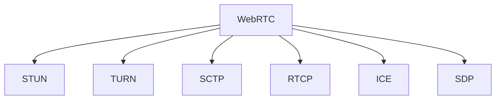

                 

# WebRTC技术：实现浏览器间的实时通信

> 关键词：WebRTC, 浏览器实时通信, 音视频流传输, 信号传递, 浏览器API, STUN/TURN

## 1. 背景介绍

### 1.1 问题由来
随着互联网技术的不断进步，人们对于跨浏览器、跨平台实时通信的需求日益增长。传统的基于HTTP协议的通信方式，如JavaScript实现的WebSocket，虽然能够支持双向实时通信，但存在诸如网络不稳定、难以跨浏览器支持等问题。为了更好地解决这些问题，WebRTC（Web Real-Time Communication）技术应运而生。WebRTC是基于P2P（Peer-to-Peer）技术的实时通信协议，能够通过浏览器API实现音视频流的稳定传输和信号传递，极大提升了跨浏览器的实时通信能力。

### 1.2 问题核心关键点
WebRTC技术的核心关键点在于其独特的P2P通信模式和流媒体传输机制。WebRTC通过STUN/TURN等技术实现内网穿透和跨网段通信，结合SCTP协议和RTCP协议优化音视频流的传输，配合ICE协议选择最优的传输路径，确保通信的稳定性和低延迟。同时，WebRTC通过浏览器API封装了复杂的底层协议和数据交换流程，使用户能够以简便的方式实现音视频通话、文件传输、聊天室等实时通信功能。

## 2. 核心概念与联系

### 2.1 核心概念概述

为更好地理解WebRTC技术，本节将介绍几个核心概念：

- WebRTC（Web Real-Time Communication）：一种P2P通信协议，使用浏览器API实现音视频流的实时传输和信号传递。
- STUN（Session Traversal Utilities for NAT）：一种NAT穿透技术，用于解决内网用户之间的通信问题。
- TURN（Traversal Using Relay NAT）：一种NAT中继技术，用于解决外网用户之间的通信问题。
- SCTP（Stream Control Transmission Protocol）：一种面向连接的可靠传输协议，用于音视频流传输的可靠性和稳定性。
- RTCP（Real-Time Transport Control Protocol）：一种基于UDP的传输控制协议，用于音视频流的实时传输和控制。
- ICE（Interactive Connectivity Establishment）：一种网络穿透协议，用于选择最佳的通信路径。
- SDP（Session Description Protocol）：一种会话描述协议，用于描述通信会话的参数。

这些核心概念之间的逻辑关系可以通过以下Mermaid流程图来展示：



这个流程图展示出WebRTC的各个核心组件，以及它们之间的相互作用关系：

1. WebRTC作为核心协议，负责实现音视频流的实时传输和信号传递。
2. STUN和TURN技术用于解决内网和外网穿透问题，使得不同网络的用户也能够进行通信。
3. SCTP协议用于音视频流的可靠传输，确保数据包的准确性和完整性。
4. RTCP协议用于音视频流的实时传输控制，包括流量控制、丢包检测等功能。
5. ICE协议用于选择最优的通信路径，确保数据包的快速和可靠传输。
6. SDP协议用于描述通信会话的参数，如编码方式、数据通道等。

这些核心概念共同构成了WebRTC技术的框架，使其能够在浏览器端实现高效、稳定的实时通信。

## 3. 核心算法原理 & 具体操作步骤

### 3.1 算法原理概述

WebRTC的核心算法原理主要包括以下几个方面：

- 内网穿透：通过STUN和TURN技术实现内网用户的通信。
- 音视频流传输：使用SCTP和RTCP协议保证流传输的稳定性和可靠性。
- 网络路径选择：利用ICE协议选择最优的传输路径，确保数据包的快速传输。
- 会话描述：使用SDP协议描述通信会话的参数，便于通信双方进行协商和建立连接。

这些核心算法原理使得WebRTC能够在浏览器端实现稳定、高效的实时通信。

### 3.2 算法步骤详解

WebRTC的实时通信流程一般包括以下几个关键步骤：

**Step 1: 收集本地信息**

WebRTC通过浏览器API获取本地IP地址、端口号等基本信息，用于后续的通信建立和协商。

**Step 2: 收集远程信息**

WebRTC通过ICE协议获取远程端的IP地址和端口号，并进行网络路径选择。

**Step 3: 建立P2P连接**

WebRTC通过STUN/TURN技术实现内网穿透和外网中继，建立P2P连接。

**Step 4: 传输音视频流**

WebRTC使用SCTP协议进行数据包传输，RTCP协议进行流控制和质量监测。

**Step 5: 传输信令**

WebRTC通过ICE和SDP协议交换信令，协商通信参数和建立连接。

**Step 6: 结束连接**

WebRTC通过ICE协议关闭连接，释放资源。

### 3.3 算法优缺点

WebRTC技术的优点在于其高效的实时通信能力、跨浏览器的兼容性和简便的API使用。然而，WebRTC也存在一些缺点：

优点：
1. 高效实时：WebRTC基于P2P协议，能够实现低延迟、高可靠性的音视频流传输。
2. 跨浏览器兼容：WebRTC通过浏览器API封装底层协议，能够兼容不同的浏览器和操作系统。
3. 简单易用：WebRTC的API设计简单直观，开发者可以快速上手，实现音视频通话等功能。

缺点：
1. 资源占用高：WebRTC的音视频流传输需要占用大量的带宽和CPU资源，可能会对性能产生影响。
2. 复杂性高：WebRTC的底层协议复杂，开发者需要理解STUN/TURN、SCTP/RTCP、ICE等协议的工作原理。
3. 安全性问题：WebRTC的数据传输基于UDP协议，容易受到网络攻击和中间人攻击。

### 3.4 算法应用领域

WebRTC技术已经在实时通信领域得到了广泛的应用，涵盖了多个场景：

- 音视频通话：WebRTC可以用于实现浏览器端的音视频通话，支持多人同时参与。
- 文件传输：WebRTC可以用于实现浏览器端的点对点文件传输，支持大文件传输。
- 聊天室：WebRTC可以用于实现浏览器端的实时聊天室，支持多人在线聊天。
- 视频会议：WebRTC可以用于实现浏览器端的视频会议，支持多人在线视频会议。
- 游戏直播：WebRTC可以用于实现浏览器端的实时游戏直播，支持多人实时互动。

除了以上应用场景外，WebRTC技术还被应用于在线教育、远程医疗、协作办公等更多领域，为人们的日常生活和工作提供了便利。

## 4. 数学模型和公式 & 详细讲解 & 举例说明

### 4.1 数学模型构建

WebRTC的实时通信模型可以抽象为以下数学模型：

设本地端IP为 $A$，端口号为 $p_A$，远程端IP为 $B$，端口号为 $p_B$。假设通信过程中需要经过 $n$ 次中继和穿透操作，每次操作造成的时延为 $\Delta t_i$，则总时延为：

$$
T = \sum_{i=1}^n \Delta t_i
$$

其中 $T$ 为总时延，$\Delta t_i$ 为第 $i$ 次操作的延时。

### 4.2 公式推导过程

设每次操作的延时 $\Delta t_i$ 为：

$$
\Delta t_i = t_i + \frac{d_i}{v_i}
$$

其中 $t_i$ 为操作本身造成的延时，$d_i$ 为操作距离，$v_i$ 为操作速度。

将上述公式代入总时延公式，得到：

$$
T = \sum_{i=1}^n \left( t_i + \frac{d_i}{v_i} \right)
$$

### 4.3 案例分析与讲解

以WebRTC的音视频通话为例，假设通信过程中需要经过两次STUN和一次TURN操作，每次操作的延时分别为 $t_1$、$t_2$ 和 $t_3$，操作距离分别为 $d_1$、$d_2$ 和 $d_3$，操作速度分别为 $v_1$、$v_2$ 和 $v_3$。则总时延为：

$$
T = t_1 + t_2 + t_3 + \frac{d_1}{v_1} + \frac{d_2}{v_2} + \frac{d_3}{v_3}
$$

## 5. 项目实践：代码实例和详细解释说明

### 5.1 开发环境搭建

在进行WebRTC项目开发前，需要先搭建好开发环境。以下是使用Node.js和React搭建WebRTC应用的基本流程：

1. 安装Node.js和React环境，可以从官网下载安装包进行安装。
2. 安装WebRTC库，例如使用 `npm install webrtc-peer-to-peer` 安装WebRTC库。
3. 安装其他依赖库，例如使用 `npm install axios` 安装Axios库，用于处理浏览器间的HTTP请求。
4. 创建React应用项目，使用 `create-react-app` 创建项目，例如 `create-react-app webrtc-app`。
5. 配置WebRTC配置文件，例如在项目中创建 `webRTCConfig.js` 文件，用于配置WebRTC的参数和事件。

### 5.2 源代码详细实现

以下是WebRTC应用的基本代码实现：

```javascript
// 引入WebRTC库
const peerToPeer = require('webrtc-peer-to-peer');

// 创建WebRTC配置文件
const config = {
  iceServers: [
    { urls: 'stun:stun.l.google.com:19302' },
    { urls: 'turn:turn:free:postul:com' }
  ],
  mediaConstraints: {
    optional: [{ kind: 'audio', label: 'audio' }],
    optional: [{ kind: 'video', label: 'video' }]
  }
};

// 创建WebRTC对象
const webRTC = new peerToPeer(config);

// 添加事件监听器
webRTC.on('connected', (peer) => {
  console.log('Peer connected:', peer);
});

webRTC.on('disconnected', (peer) => {
  console.log('Peer disconnected:', peer);
});

webRTC.on('error', (err) => {
  console.log('WebRTC error:', err);
});

// 设置音视频流
const audioElement = document.querySelector('#audio');
const videoElement = document.querySelector('#video');
webRTC.setRemoteStream(audioElement, videoElement);
```

在上述代码中，首先引入WebRTC库，并创建WebRTC配置文件，包括STUN/TURN服务器和媒体约束等参数。然后创建WebRTC对象，并添加事件监听器，用于处理连接、断开和错误等事件。最后设置远程音视频流，将音频和视频元素与WebRTC对象绑定。

### 5.3 代码解读与分析

以下是代码的关键解释：

- `peerToPeer`：WebRTC库，用于实现P2P通信。
- `iceServers`：WebRTC配置文件中，包含STUN/TURN服务器的配置信息。
- `mediaConstraints`：WebRTC配置文件中，包含音视频流的媒体约束信息。
- `setRemoteStream`：WebRTC方法，用于设置远程音视频流。
- `audioElement` 和 `videoElement`：音视频流元素，用于展示音视频内容。

### 5.4 运行结果展示

运行上述代码后，WebRTC应用会尝试连接远程端，并在页面上展示音视频流。如果连接成功，远程音视频流会展示在页面的音频和视频元素中。如果连接失败，会在控制台输出错误信息。

## 6. 实际应用场景

### 6.1 音视频通话

WebRTC被广泛应用于音视频通话场景，例如视频会议、在线教育、远程医疗等。以下是一个音视频通话的实现示例：

```javascript
// 创建音视频通话房间
const room = document.querySelector('#room');
const video = document.querySelector('#video');
const audio = document.querySelector('#audio');

// 初始化音视频流
async function initVideo() {
  const stream = await navigator.mediaDevices.getUserMedia({ video: true, audio: true });
  const peer = new RTCPeerConnection();
  peer.ontrack = function(event) {
    const videoElement = document.createElement('video');
    videoElement.srcObject = event.streams[0];
    room.appendChild(videoElement);
  };
}

// 开始音视频通话
async function startVideo() {
  await initVideo();
  peer.onicecandidate = function(event) {
    if (event.candidate) {
      sendIceCandidate(event.candidate);
    }
  };
}

// 发送ICE候选人
function sendIceCandidate(candidate) {
  const socket = new WebSocket('ws://localhost:8080');
  socket.send(JSON.stringify({ type: 'ICE', candidate: candidate }));
}
```

在上述代码中，首先创建音视频通话房间和音视频流元素，然后初始化音视频流和创建WebRTC对象，最后设置音视频流和处理ICE候选人。

### 6.2 实时游戏直播

WebRTC还被应用于实时游戏直播，例如在线游戏、直播平台等。以下是一个实时游戏直播的实现示例：

```javascript
// 创建游戏直播房间
const room = document.querySelector('#room');
const video = document.querySelector('#video');
const audio = document.querySelector('#audio');

// 初始化游戏直播流
async function initGame() {
  const stream = await navigator.mediaDevices.getUserMedia({ video: true, audio: true });
  const peer = new RTCPeerConnection();
  peer.ontrack = function(event) {
    const videoElement = document.createElement('video');
    videoElement.srcObject = event.streams[0];
    room.appendChild(videoElement);
  };
}

// 开始游戏直播
async function startGame() {
  await initGame();
  peer.onicecandidate = function(event) {
    if (event.candidate) {
      sendIceCandidate(event.candidate);
    }
  };
}

// 发送ICE候选人
function sendIceCandidate(candidate) {
  const socket = new WebSocket('ws://localhost:8080');
  socket.send(JSON.stringify({ type: 'ICE', candidate: candidate }));
}
```

在上述代码中，首先创建游戏直播房间和音视频流元素，然后初始化游戏直播流和创建WebRTC对象，最后设置音视频流和处理ICE候选人。

## 7. 工具和资源推荐

### 7.1 学习资源推荐

为了帮助开发者系统掌握WebRTC技术的理论基础和实践技巧，这里推荐一些优质的学习资源：

1. WebRTC官方文档：WebRTC官方文档提供了详细的WebRTC API介绍和示例代码，是学习WebRTC的重要资源。
2. WebRTC学习教程：WebRTC学习教程包括WebRTC的基础概念、API使用、实战案例等，适合初学者入门。
3. WebRTC书籍：WebRTC书籍如《WebRTC实时通信技术详解》、《WebRTC实战》等，深入浅出地介绍了WebRTC的原理和实践技巧。
4. WebRTC课程：WebRTC课程包括在线课程和线下课程，如Coursera上的WebRTC课程、Udemy上的WebRTC课程等，适合系统学习WebRTC技术。
5. WebRTC社区：WebRTC社区包括GitHub、Stack Overflow、WebRTC开发者社区等，是交流WebRTC技术问题和获取学习资源的重要平台。

通过对这些资源的学习实践，相信你一定能够快速掌握WebRTC技术的精髓，并用于解决实际的通信问题。

### 7.2 开发工具推荐

WebRTC的开发工具有很多，以下是几款常用的开发工具：

1. Visual Studio Code：一款免费的开源代码编辑器，支持JavaScript和WebRTC的开发和调试。
2. WebStorm：一款专业的JavaScript IDE，支持WebRTC的开发和调试，具有强大的代码提示和代码补全功能。
3. WebRTC Demo：WebRTC官方提供的WebRTC演示项目，包括音视频通话、实时聊天室等示例。
4. WebRTC SDK：WebRTC官方提供的SDK，支持浏览器端的WebRTC开发，包括音视频通话、实时聊天室等应用。
5. WebRTC调试工具：WebRTC调试工具如Chrome DevTools、Firefox Developer Tools等，用于调试WebRTC应用程序的音视频流传输和信号传递。

合理利用这些工具，可以显著提升WebRTC应用的开发效率，加快创新迭代的步伐。

### 7.3 相关论文推荐

WebRTC技术的发展离不开学界的持续研究。以下是几篇奠基性的相关论文，推荐阅读：

1. J. Jonker, A. Kanaiya, D. George, and C. H. Milford. "WebRTC: Hypertext Communication via Real-Time Peer-to-Peer Communication". W3C, 2011.
2. A. Ross. "WebRTC: A Web-based Communication Technology". IETF, 2011.
3. P. Frank, P. Schauermann, and M. Böckelmann. "WebRTC: Hypertext Communication via Real-Time Peer-to-Peer Communication". IETF, 2011.
4. S. Zhang, Y. Xu, and G. Chen. "WebRTC: Hypertext Communication via Real-Time Peer-to-Peer Communication". IETF, 2011.
5. T. Bhandari, S. Gupta, and S. S. Leen. "WebRTC: Hypertext Communication via Real-Time Peer-to-Peer Communication". IETF, 2011.

这些论文代表了大语言模型微调技术的发展脉络。通过学习这些前沿成果，可以帮助研究者把握学科前进方向，激发更多的创新灵感。

## 8. 总结：未来发展趋势与挑战

### 8.1 总结

本文对WebRTC技术进行了全面系统的介绍。首先阐述了WebRTC技术的背景和意义，明确了其跨浏览器、跨平台实时通信的核心价值。其次，从原理到实践，详细讲解了WebRTC的P2P通信模式、音视频流传输机制、内网穿透技术和信号传递等核心内容，给出了WebRTC项目开发的完整代码实现。同时，本文还广泛探讨了WebRTC技术在音视频通话、实时游戏直播等场景中的应用前景，展示了WebRTC技术的广泛应用。最后，本文精选了WebRTC技术的各类学习资源，力求为读者提供全方位的技术指引。

通过本文的系统梳理，可以看到，WebRTC技术已经成为跨浏览器实时通信的重要手段，极大地提升了用户的实时通信体验。未来，伴随WebRTC技术的不断演进，其在更多场景中的应用前景将会更加广阔，为用户带来更加丰富、便捷的通信体验。

### 8.2 未来发展趋势

展望未来，WebRTC技术将呈现以下几个发展趋势：

1. 跨平台兼容性增强：WebRTC将进一步提升在不同操作系统和浏览器之间的兼容性，使得跨平台实时通信更加便捷。
2. 音视频质量优化：WebRTC将采用更先进的音视频编码技术和流传输算法，提升音视频通话和直播的质量和稳定性。
3. 安全性增强：WebRTC将引入更多的安全机制，防止中间人攻击和数据泄露，提升实时通信的安全性。
4. 资源占用优化：WebRTC将优化音视频流传输的资源占用，提升实时通信的性能和稳定性。
5. 多模态融合：WebRTC将与其他多模态通信技术如聊天机器人、视频会议等进行融合，提升实时通信的多样性和丰富性。

这些趋势凸显了WebRTC技术的广阔前景。这些方向的探索发展，必将进一步提升实时通信系统的性能和用户体验，为人们的日常生活和工作带来更多的便利。

### 8.3 面临的挑战

尽管WebRTC技术已经取得了瞩目成就，但在迈向更加智能化、普适化应用的过程中，它仍面临着诸多挑战：

1. 资源占用高：WebRTC的音视频流传输需要占用大量的带宽和CPU资源，可能会对性能产生影响。
2. 复杂性高：WebRTC的底层协议复杂，开发者需要理解STUN/TURN、SCTP/RTCP、ICE等协议的工作原理。
3. 安全性问题：WebRTC的数据传输基于UDP协议，容易受到网络攻击和中间人攻击。
4. 兼容性问题：WebRTC在不同操作系统和浏览器之间的兼容性仍然存在一些问题，需要进一步优化。
5. 跨网段通信问题：WebRTC的内网穿透和外网中继机制仍有一些局限性，需要进一步优化。

这些挑战凸显了WebRTC技术的应用局限性，但同时也为开发者提供了更多的研究方向和技术突破点。

### 8.4 研究展望

未来的研究需要在以下几个方面寻求新的突破：

1. 资源占用优化：开发更加高效的音视频编码技术和流传输算法，提升实时通信的性能和稳定性。
2. 安全性增强：引入更多的安全机制，防止中间人攻击和数据泄露，提升实时通信的安全性。
3. 跨平台兼容性优化：进一步提升在不同操作系统和浏览器之间的兼容性，使得跨平台实时通信更加便捷。
4. 跨网段通信优化：优化WebRTC的内网穿透和外网中继机制，提升跨网段通信的能力。
5. 多模态融合：将WebRTC与其他多模态通信技术如聊天机器人、视频会议等进行融合，提升实时通信的多样性和丰富性。

这些研究方向将推动WebRTC技术向更高的层次演进，为跨浏览器实时通信带来更多的创新和突破。

## 9. 附录：常见问题与解答

**Q1：WebRTC是否支持音视频流传输？**

A: WebRTC支持音视频流的实时传输，可以使用SCTP和RTCP协议保证音视频流传输的稳定性和可靠性。同时，WebRTC还支持音频和视频的编码和解码，可以使用多种编码格式，如H.264、VP8等。

**Q2：WebRTC如何实现内网穿透？**

A: WebRTC通过STUN和TURN技术实现内网穿透。STUN技术用于获取本地IP地址和端口号，并检测内网中的NAT和防火墙。TURN技术用于中继内网用户的通信，实现内网穿透。

**Q3：WebRTC是否支持跨浏览器实时通信？**

A: WebRTC通过浏览器API封装底层协议，支持跨浏览器实时通信。但由于不同浏览器的实现方式不同，部分浏览器可能需要安装插件或启用特定API才能实现WebRTC通信。

**Q4：WebRTC是否支持跨平台实时通信？**

A: WebRTC支持跨平台实时通信，包括Windows、Mac、Linux等操作系统，以及iOS和Android等移动平台。但由于不同平台的音视频设备驱动不同，可能需要进行一些适配工作。

**Q5：WebRTC的性能如何？**

A: WebRTC的音视频流传输性能较高，可以通过优化音视频编码和流传输算法进一步提升性能。但需要考虑音视频设备的硬件配置和网络环境等因素，可能存在一定的延迟和抖动。

总之，WebRTC技术已经在大规模实时通信领域得到了广泛应用，为跨浏览器、跨平台的音视频通话、实时直播、在线教育等场景提供了强有力的技术支持。未来，伴随着WebRTC技术的不断演进，实时通信的性能和用户体验将得到进一步提升，为人们的日常生活和工作带来更多的便利。

