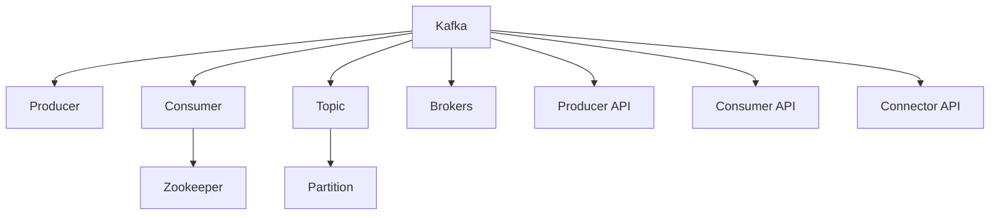

                 

# 【AI大数据计算原理与代码实例讲解】Kafka

> 关键词：Kafka, 分布式流处理, 高可用, 低延迟, 高吞吐量, 数据流管理, 实时数据流处理, 大数据计算

## 1. 背景介绍

### 1.1 问题由来
在当今数据驱动的世界中，实时数据流处理变得越来越重要。随着互联网、物联网(IoT)和云计算等技术的普及，产生了大量实时数据，需要高效、可靠地进行存储、传输和处理。传统的单点系统无法满足这一需求，而分布式流处理系统如Kafka成为了首选解决方案。

### 1.2 问题核心关键点
Kafka是一个分布式流处理平台，主要用于处理实时数据流。它能够高效、可靠地存储和传输大规模数据，支持高吞吐量、低延迟的数据流处理。Kafka的核心组件包括生产者(Producer)、消费者(Consumer)和集群管理器(Zookeeper)。通过Kafka，用户可以构建高效、可扩展的实时数据流处理系统，满足各种业务需求。

## 2. 核心概念与联系

### 2.1 核心概念概述

为更好地理解Kafka的原理和架构，本节将介绍几个密切相关的核心概念：

- Kafka：分布式流处理平台，用于实时数据流的存储、传输和处理。
- Producer：向Kafka集群发送数据的实体。
- Consumer：从Kafka集群读取数据的实体。
- Zookeeper：用于集群管理和配置的分布式协调服务。
- Topic：Kafka中用于分区的数据流，类似于数据库的表。
- Partition：Kafka中每个Topic的多个分区，用于并行读写和负载均衡。
- Brokers：Kafka集群中的节点，负责数据存储和传输。
- Producer API：用于向Kafka集群发送数据的API。
- Consumer API：用于从Kafka集群读取数据的API。
- Connector API：用于将外部数据源与Kafka集群进行数据交换的API。

这些核心概念之间的逻辑关系可以通过以下Mermaid流程图来展示：



这个流程图展示了Kafka的核心组件及其之间的联系：

1. Kafka作为分布式流处理平台，支持数据的高吞吐量、低延迟处理。
2. Producer负责向Kafka集群发送数据。
3. Consumer负责从Kafka集群读取数据。
4. Zookeeper用于集群管理和配置，提供分布式协调服务。
5. Topic是Kafka中用于分区的数据流，类似于数据库的表。
6. Partition是Kafka中每个Topic的多个分区，用于并行读写和负载均衡。
7. Brokers是Kafka集群中的节点，负责数据存储和传输。
8. Producer API和Consumer API用于向Kafka集群发送和读取数据。
9. Connector API用于将外部数据源与Kafka集群进行数据交换。

这些概念共同构成了Kafka的核心逻辑，使其能够在各种场景下发挥强大的数据流处理能力。通过理解这些核心概念，我们可以更好地把握Kafka的工作原理和优化方向。

## 3. 核心算法原理 & 具体操作步骤
### 3.1 算法原理概述

Kafka的分布式流处理是基于日志存储和消息传递机制实现的。其核心算法原理包括以下几个方面：

- 日志存储：Kafka将数据存储为日志文件，支持高效的写入和读取操作。每个Topic由多个分区组成，数据按时间顺序写入每个分区。
- 消息传递：Kafka提供消息传递机制，支持数据的高吞吐量、低延迟传输。通过生产者(Producer)将数据发送到Kafka集群，通过消费者(Consumer)从Kafka集群读取数据。
- 数据分区：Kafka将数据按分区存储，每个分区由多个Brokers负责存储和传输。数据分区可以提升Kafka的可扩展性和负载均衡能力。
- 分布式协调：Kafka通过Zookeeper进行集群管理和配置，提供分布式协调服务，确保集群的高可用性和稳定性。

### 3.2 算法步骤详解

Kafka的分布式流处理一般包括以下几个关键步骤：

**Step 1: 安装和配置Kafka集群**
- 下载Kafka安装包，解压并解压缩。
- 配置Kafka的日志存储目录、Broker ID、Zookeeper连接信息等参数。
- 启动Kafka集群中的Broker和Zookeeper服务。

**Step 2: 创建Topic**
- 使用Kafka的命令行工具或编程接口，创建Topic。
- 指定Topic的分区数和复制因子，控制数据的可靠性和可扩展性。
- 设置Retention Policy，控制数据保留时间。

**Step 3: 发送数据**
- 使用Kafka的Producer API，将数据发送给Kafka集群。
- 指定Topic和Partition，控制数据的目标位置。
- 使用回调函数或监听器，处理数据发送的反馈信息。

**Step 4: 接收数据**
- 使用Kafka的Consumer API，从Kafka集群中读取数据。
- 指定Topic和Partition，控制数据的目标位置。
- 设置Consumer Group，控制数据的并行消费。

**Step 5: 应用业务逻辑**
- 对从Kafka中读取到的数据进行处理和分析，执行具体的业务逻辑。
- 使用分布式计算框架如Spark、Flink等，处理大规模数据流。
- 使用存储系统如HDFS、HBase等，将处理结果进行持久化存储。

**Step 6: 监控和管理**
- 使用Kafka的监控工具如Kafka Manager，实时监控集群状态和数据流。
- 设置告警规则，及时发现和处理集群异常。
- 定期备份和恢复数据，确保数据的可靠性和完整性。

以上是Kafka分布式流处理的一般流程。在实际应用中，还需要根据具体业务需求，对每个步骤进行优化设计，如选择合适的分区策略、优化数据压缩方式、配置合适的数据持久化等，以进一步提升Kafka性能。

### 3.3 算法优缺点

Kafka的分布式流处理具有以下优点：
1. 高吞吐量：通过并行读写和负载均衡，Kafka支持高吞吐量数据流处理。
2. 低延迟：Kafka采用异步写入和传输机制，支持低延迟数据流处理。
3. 高可靠性：Kafka支持数据分片和复制，提供高可靠性数据存储和传输。
4. 灵活性：Kafka支持多种数据源和数据目标，适应各种业务需求。
5. 可扩展性：Kafka支持水平扩展，可以无缝添加更多的Broker节点，提升集群容量。

同时，Kafka的分布式流处理也存在一定的局限性：
1. 部署复杂：Kafka集群需要多台机器，部署和维护较为复杂。
2. 延迟受限：虽然Kafka支持低延迟数据流处理，但在数据量较大时，可能仍存在一定的延迟。
3. 资源消耗：Kafka集群需要占用大量的CPU、内存和磁盘资源，部署成本较高。
4. 数据丢失风险：在数据传输过程中，如果Broker节点发生故障，可能存在数据丢失的风险。

尽管存在这些局限性，但Kafka仍然是目前最流行的分布式流处理平台之一。未来相关研究的重点在于如何进一步降低Kafka的部署和维护成本，提高集群的高可用性和稳定性，同时兼顾数据的实时性和可靠性。

### 3.4 算法应用领域

Kafka的分布式流处理广泛应用于各种数据驱动的业务场景，包括但不限于：

- 实时数据采集：从各种数据源（如日志、传感器、社交媒体等）采集实时数据。
- 数据实时存储：将实时数据高效地存储到分布式系统中，支持海量数据的处理和存储。
- 数据实时传输：支持数据的高吞吐量、低延迟传输，满足各种业务对实时性的需求。
- 数据实时分析：对实时数据进行分布式分析和处理，提供实时洞察和决策支持。
- 数据实时监控：实时监控各种业务指标和系统状态，确保系统的稳定性和可靠性。
- 数据实时流处理：使用分布式流处理框架如Apache Flink、Apache Spark等，对实时数据流进行复杂的分析和处理。

## 4. 数学模型和公式 & 详细讲解 & 举例说明

### 4.1 数学模型构建

Kafka的分布式流处理可以抽象为以下几个关键数学模型：

- **日志存储模型**：将数据存储为日志文件，支持高效的写入和读取操作。每个日志文件由多个记录组成，每个记录包含一个键(Key)和值(Value)，表示一条完整的数据记录。
- **消息传递模型**：支持高吞吐量、低延迟的数据流传递。每个消息包含一个键(Key)、一个值(Value)和一个时间戳(Timestamp)，表示一条完整的数据消息。
- **数据分区模型**：将数据按分区存储，每个分区由多个Brokers负责存储和传输。数据分区可以提升Kafka的可扩展性和负载均衡能力。
- **分布式协调模型**：通过Zookeeper进行集群管理和配置，提供分布式协调服务，确保集群的高可用性和稳定性。

### 4.2 公式推导过程

以下我们以Kafka的日志存储模型为例，推导数据写入和读取的公式。

设Kafka集群中共有 $n$ 个Broker节点，每个Topic有 $m$ 个分区，每个记录的大小为 $c$ 字节。则Kafka的日志存储模型可以表示为：

$$
S = n \times m \times c
$$

其中 $S$ 表示Kafka集群的总存储容量。假设每个记录的写入时间为 $t_w$，每个Broker的传输带宽为 $b$，每个分区的并发写入数为 $p$。则单个Broker的平均写入速度为：

$$
W = \frac{S}{n} \times \frac{p \times c}{t_w}
$$

而Kafka集群的总写入速度为：

$$
W_{total} = W \times n = \frac{S \times p \times c}{t_w \times n}
$$

类似地，Kafka集群的总读取速度为：

$$
R_{total} = \frac{S \times p \times c}{t_r \times n}
$$

其中 $t_r$ 表示每个记录的读取时间。

### 4.3 案例分析与讲解

**案例1：日志存储和消息传递模型**

假设Kafka集群中共有 $n=3$ 个Broker节点，每个Topic有 $m=2$ 个分区，每个记录的大小为 $c=100$ 字节，每个分区的并发写入数为 $p=10$，每个记录的写入时间为 $t_w=1$ 秒，每个Broker的传输带宽为 $b=100$ MB/s。则Kafka集群的总存储容量为：

$$
S = n \times m \times c = 3 \times 2 \times 100 = 600 \text{ GB}
$$

Kafka集群的总写入速度为：

$$
W_{total} = \frac{S \times p \times c}{t_w \times n} = \frac{600 \times 10 \times 100}{1 \times 3} = 20000 \text{ KB/s}
$$

Kafka集群的总读取速度为：

$$
R_{total} = \frac{S \times p \times c}{t_r \times n} = \frac{600 \times 10 \times 100}{0.01 \times 3} = 600000 \text{ KB/s}
$$

**案例2：数据分区和分布式协调模型**

假设Kafka集群中共有 $n=3$ 个Broker节点，每个Topic有 $m=2$ 个分区，每个分区的数据量为 $d=500$ GB，每个分区的复制因子为 $r=3$。则Kafka集群的总数据量为：

$$
D = n \times m \times d = 3 \times 2 \times 500 = 3000 \text{ GB}
$$

Kafka集群的总数据冗余量为：

$$
R = D \times r = 3000 \times 3 = 9000 \text{ GB}
$$

## 5. 项目实践：代码实例和详细解释说明

### 5.1 开发环境搭建

在进行Kafka项目实践前，我们需要准备好开发环境。以下是使用Python进行Kafka开发的环境配置流程：

1. 安装Kafka客户端和生产者：
```bash
pip install kafka-python kafka-console-producer
```

2. 下载Kafka安装包，解压并解压缩。

3. 配置Kafka的日志存储目录、Broker ID、Zookeeper连接信息等参数。

4. 启动Kafka集群中的Broker和Zookeeper服务。

完成上述步骤后，即可在本地或分布式环境下进行Kafka项目开发。

### 5.2 源代码详细实现

下面我们以Kafka的生产者和消费者为例，给出使用Python进行Kafka开发的代码实现。

首先，定义生产者代码：

```python
from kafka import KafkaProducer

producer = KafkaProducer(bootstrap_servers='localhost:9092', value_serializer=str.encode)

def send_message(message, topic):
    producer.send(topic, value=message)

# 发送消息
send_message('Hello Kafka', 'hello-world')
```

然后，定义消费者代码：

```python
from kafka import KafkaConsumer

consumer = KafkaConsumer('hello-world', bootstrap_servers='localhost:9092')

for message in consumer:
    print(message.value.decode('utf-8'))
```

以上代码实现了Kafka的生产者和消费者，可以向Kafka集群发送和接收消息。在实际开发中，还需要考虑更多的细节，如错误处理、流量控制、连接管理等。

### 5.3 代码解读与分析

让我们再详细解读一下关键代码的实现细节：

**发送消息**

```python
from kafka import KafkaProducer

producer = KafkaProducer(bootstrap_servers='localhost:9092', value_serializer=str.encode)

def send_message(message, topic):
    producer.send(topic, value=message)
```

- `KafkaProducer` 用于创建生产者对象，指定Bootstrap服务器的地址。
- `value_serializer=str.encode` 将消息转换为字节串，用于序列化和反序列化。
- `send` 方法将消息发送到指定的Topic。

**接收消息**

```python
from kafka import KafkaConsumer

consumer = KafkaConsumer('hello-world', bootstrap_servers='localhost:9092')

for message in consumer:
    print(message.value.decode('utf-8'))
```

- `KafkaConsumer` 用于创建消费者对象，指定要读取的Topic。
- `for message in consumer:` 循环读取Topic中的消息。
- `message.value.decode('utf-8')` 将消息转换为字符串，输出到控制台。

可以看到，Python提供了方便的API，使得Kafka的开发变得简洁高效。开发者可以专注于业务逻辑的实现，而不必过多关注底层的技术细节。

## 6. 实际应用场景

### 6.1 实时数据采集

Kafka可以用于实时采集各种数据源的数据，如日志文件、传感器数据、社交媒体数据等。通过Kafka的生产者将数据发送到集群，消费者从集群中读取数据，进行实时处理和分析。

例如，在电商系统中，可以使用Kafka实时采集用户的购买记录和浏览记录，进行用户行为分析和个性化推荐。在金融系统中，可以使用Kafka实时采集交易数据，进行风险控制和实时监控。在物联网系统中，可以使用Kafka实时采集传感器数据，进行设备状态监测和数据分析。

### 6.2 数据实时存储

Kafka可以用于实时存储大规模数据，支持海量数据的处理和存储。通过Kafka的日志存储机制，将实时数据高效地存储到分布式系统中，方便后续的数据分析和处理。

例如，在新闻系统中，可以使用Kafka实时存储用户评论和反馈数据，进行数据分析和舆情监测。在社交媒体系统中，可以使用Kafka实时存储用户动态和互动数据，进行数据分析和用户行为分析。在物流系统中，可以使用Kafka实时存储物流数据，进行物流跟踪和数据分析。

### 6.3 数据实时传输

Kafka可以用于实时传输大规模数据，支持高吞吐量、低延迟的数据流传递。通过Kafka的生产者将数据发送到集群，消费者从集群中读取数据，进行实时处理和分析。

例如，在新闻系统中，可以使用Kafka实时传输新闻数据，进行实时推送和数据分析。在视频系统中，可以使用Kafka实时传输视频流数据，进行视频直播和数据分析。在电商系统中，可以使用Kafka实时传输订单数据，进行实时处理和数据分析。

### 6.4 数据实时分析

Kafka可以用于实时分析大规模数据，提供实时洞察和决策支持。通过Kafka的分布式流处理机制，对实时数据进行复杂的分析和处理，进行实时监控和决策支持。

例如，在金融系统中，可以使用Kafka实时分析交易数据，进行实时监控和风险控制。在电商系统中，可以使用Kafka实时分析用户行为数据，进行实时推荐和营销策略优化。在物联网系统中，可以使用Kafka实时分析设备数据，进行实时监控和数据分析。

## 7. 工具和资源推荐

### 7.1 学习资源推荐

为了帮助开发者系统掌握Kafka的原理和实践技巧，这里推荐一些优质的学习资源：

1. Kafka官方文档：Kafka的官方文档，提供了详细的API文档和配置指南，是学习Kafka的必备资料。
2. Kafka在Twitter中的应用案例：Kafka在Twitter中的应用案例，展示了Kafka在实时数据流处理中的强大能力。
3. Kafka权威指南：Kafka权威指南，由Kafka之父Kafka一书作者撰写，全面介绍了Kafka的核心原理和实践经验。
4. Kafka与Spark结合实战：Kafka与Spark结合实战，展示了Kafka与Spark进行实时数据处理和分析的完整流程。
5. Kafka大数据计算实战：Kafka大数据计算实战，展示了Kafka在大数据计算中的应用案例，如实时流处理、实时监控等。

通过对这些资源的学习实践，相信你一定能够快速掌握Kafka的精髓，并用于解决实际的业务问题。

### 7.2 开发工具推荐

高效的开发离不开优秀的工具支持。以下是几款用于Kafka开发的常用工具：

1. Kafka Manager：Kafka的管理工具，用于监控和管理Kafka集群状态和数据流。
2. kafka-console-producer：Kafka的生产者工具，用于方便地发送数据到Kafka集群。
3. kafka-console-consumer：Kafka的消费者工具，用于方便地读取数据从Kafka集群。
4. Kafka Streams：Kafka的分布式流处理框架，用于高效地处理实时数据流。
5. Apache Flink：Apache的分布式计算框架，用于与Kafka结合进行实时数据处理和分析。

合理利用这些工具，可以显著提升Kafka开发和部署的效率，加快创新迭代的步伐。

### 7.3 相关论文推荐

Kafka的研究始于2010年，在过去十多年间，陆续发表了许多重要的学术论文。以下是几篇奠基性的相关论文，推荐阅读：

1. "Replicated logs for building reliable, distributed systems"（Kafka的论文）：提出Kafka的分布式日志存储机制，支持高可靠性数据存储和传输。
2. "Apache Kafka: The Future-Proof Platform for Building Real-Time Data Pipelines"（Kafka入门指南）：由Kafka之父撰写，全面介绍了Kafka的核心原理和实践经验。
3. "Extending Kafka: The Next Generation Real-time Stream Platform"（Kafka的扩展）：介绍了Kafka的扩展和升级，包括数据分区、流处理等新特性。
4. "Efficient Stream Processing for High Throughput: The Kafka Experience"（Kafka的高吞吐量处理）：展示了Kafka在数据流处理中的高效性和可靠性。
5. "Real-time streaming: Build your data pipelines on Kafka"（Kafka的实时流处理）：展示了Kafka在实时流处理中的应用案例，如实时数据分析、实时监控等。

这些论文代表了大数据计算技术的发展脉络。通过学习这些前沿成果，可以帮助研究者把握Kafka的研究方向和前沿进展，激发更多的创新灵感。

## 8. 总结：未来发展趋势与挑战

### 8.1 总结

本文对Kafka的分布式流处理进行了全面系统的介绍。首先阐述了Kafka的分布式流处理技术背景和核心概念，明确了Kafka在实时数据流处理中的独特优势。其次，从原理到实践，详细讲解了Kafka的日志存储、消息传递、数据分区和分布式协调等核心算法原理，给出了Kafka项目开发的完整代码实例。同时，本文还广泛探讨了Kafka在实时数据采集、实时数据存储、实时数据传输、实时数据分析等实际应用场景中的应用前景，展示了Kafka技术的重要价值。

通过本文的系统梳理，可以看到，Kafka作为最流行的分布式流处理平台之一，极大地提升了实时数据流处理的效率和可靠性。未来，伴随Kafka技术的不断演进，其应用领域将进一步拓展，为大数据计算带来新的突破。

### 8.2 未来发展趋势

展望未来，Kafka的分布式流处理技术将呈现以下几个发展趋势：

1. 高吞吐量和高可靠性：Kafka将进一步优化数据分区和复制机制，提升数据的吞吐量和可靠性。
2. 低延迟和实时性：Kafka将采用更高效的传输和存储机制，提升数据的实时性和延迟性。
3. 高扩展性和分布式协调：Kafka将支持更多的扩展方式和分布式协调机制，提升集群的高可用性和可扩展性。
4. 多数据源和多数据目标：Kafka将支持更多的数据源和数据目标，适应各种业务需求。
5. 大数据计算的深度融合：Kafka将与大数据计算框架如Spark、Flink等深度融合，提供更高效的数据流处理能力。

以上趋势凸显了Kafka技术的广阔前景。这些方向的探索发展，必将进一步提升Kafka的性能和应用范围，为大数据计算带来新的突破。

### 8.3 面临的挑战

尽管Kafka已经取得了瞩目成就，但在迈向更加智能化、普适化应用的过程中，仍面临诸多挑战：

1. 部署复杂：Kafka集群需要多台机器，部署和维护较为复杂。
2. 延迟受限：虽然Kafka支持低延迟数据流处理，但在数据量较大时，可能仍存在一定的延迟。
3. 资源消耗：Kafka集群需要占用大量的CPU、内存和磁盘资源，部署成本较高。
4. 数据丢失风险：在数据传输过程中，如果Broker节点发生故障，可能存在数据丢失的风险。
5. 数据一致性：Kafka的分布式流处理需要确保数据的一致性和完整性，但在大规模数据处理中，可能存在一定的数据不一致性问题。

尽管存在这些挑战，但Kafka仍然是当今最流行的分布式流处理平台之一。未来相关研究的重点在于如何进一步降低Kafka的部署和维护成本，提高集群的高可用性和稳定性，同时兼顾数据的实时性和可靠性。

### 8.4 研究展望

面对Kafka面临的种种挑战，未来的研究需要在以下几个方面寻求新的突破：

1. 优化数据分区和复制机制：通过更高效的分区和复制策略，提升数据的吞吐量和可靠性。
2. 引入新的传输和存储机制：采用更高效的传输和存储机制，提升数据的实时性和延迟性。
3. 支持更多的扩展方式和分布式协调机制：支持更多的扩展方式和分布式协调机制，提升集群的高可用性和可扩展性。
4. 增强数据一致性和完整性：通过更严格的数据一致性和完整性机制，提升数据处理的可靠性和安全性。
5. 优化多数据源和多数据目标的融合：优化多数据源和多数据目标的融合机制，提升数据处理的灵活性和适应性。

这些研究方向的应用和实践，必将进一步提升Kafka的性能和应用范围，为大数据计算带来新的突破。相信随着学界和产业界的共同努力，Kafka技术必将走向更高的台阶，为构建高效、可靠、可扩展的数据流处理系统铺平道路。

## 9. 附录：常见问题与解答

**Q1：Kafka的生产者和消费者有哪些优点？**

A: Kafka的生产者和消费者具有以下优点：
1. 高吞吐量：通过并行读写和负载均衡，Kafka的生产者和消费者支持高吞吐量数据流处理。
2. 低延迟：Kafka的生产者和消费者采用异步写入和传输机制，支持低延迟数据流处理。
3. 高可靠性：Kafka的生产者和消费者支持数据分片和复制，提供高可靠性数据存储和传输。
4. 灵活性：Kafka的生产者和消费者支持多种数据源和数据目标，适应各种业务需求。
5. 可扩展性：Kafka的生产者和消费者支持水平扩展，可以无缝添加更多的Broker节点，提升集群容量。

**Q2：如何选择合适的Kafka数据分区策略？**

A: 选择合适的Kafka数据分区策略需要考虑以下几个因素：
1. 数据量大小：数据量较大的数据流，应采用更多的分区来提升吞吐量。
2. 数据分布：数据分布均匀的，应采用均分策略；数据分布不均匀的，应采用自定义分区策略。
3. 读写负载：读负载较高的数据流，应采用更多的分区来提升读取效率；写负载较高的数据流，应采用更少的分区来减少写入延迟。
4. 数据持久化：需要高可靠性的数据流，应采用更多的复制因子；需要高吞吐量的数据流，应采用更少的复制因子。

**Q3：如何在Kafka中进行数据压缩？**

A: 在Kafka中进行数据压缩可以通过以下步骤实现：
1. 配置Kafka的日志存储目录，打开日志压缩功能。
2. 配置Kafka的分区数量，每个分区开启不同的日志压缩策略，如GZIP、Snappy等。
3. 使用Kafka的日志存储工具，如Kafka Manager，监控日志压缩的性能和效果。
4. 根据实际测试结果，调整日志压缩策略，找到最优的压缩率。

通过数据压缩，可以显著减小Kafka的存储空间占用，提升数据传输效率，降低存储成本。

**Q4：如何在Kafka中进行数据一致性控制？**

A: 在Kafka中进行数据一致性控制可以通过以下步骤实现：
1. 配置Kafka的日志存储目录，开启日志备份和复制功能。
2. 配置Kafka的分区数量和复制因子，确保数据的高可靠性和一致性。
3. 使用Kafka的分布式协调服务，如Zookeeper，进行数据一致性的监控和管理。
4. 设置Kafka的检查点机制，确保数据的一致性和完整性。

通过数据一致性控制，可以确保Kafka集群的高可靠性和数据的完整性，提升数据处理的可靠性和安全性。

**Q5：如何在Kafka中进行数据监控和告警？**

A: 在Kafka中进行数据监控和告警可以通过以下步骤实现：
1. 使用Kafka的监控工具，如Kafka Manager，实时监控集群状态和数据流。
2. 设置告警规则，及时发现和处理集群异常。
3. 定期备份和恢复数据，确保数据的可靠性和完整性。
4. 使用日志系统，记录和分析监控日志，进行故障排查和优化。

通过数据监控和告警，可以及时发现和处理集群异常，确保Kafka集群的高可靠性和数据的完整性。

---

作者：禅与计算机程序设计艺术 / Zen and the Art of Computer Programming

