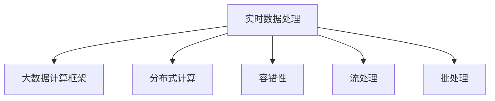

                 

# 【AI大数据计算原理与代码实例讲解】实时数据处理

> 关键词：实时数据处理, 大数据, 计算框架, Spark, Hadoop, Flink, 算法原理, 代码实现, 应用场景, 未来趋势

## 1. 背景介绍

在当今数字化时代，数据的产生速度和规模呈指数级增长，这对数据处理提出了巨大的挑战。实时数据处理（Real-time Data Processing）已成为大数据应用的重要领域。通过实时数据处理，企业可以迅速获取洞察，优化决策过程，提升业务响应速度。因此，对实时数据处理技术的理解和掌握变得至关重要。

本文旨在深入探讨实时数据处理的原理与技术，并通过代码实例详细讲解Spark、Hadoop、Flink等主流计算框架的实现方法。通过理解这些核心技术，读者将能够设计高效、可靠的大数据计算系统，满足各种复杂的实时数据处理需求。

## 2. 核心概念与联系

### 2.1 核心概念概述

为了深入理解实时数据处理，首先需要澄清一些核心概念：

- **实时数据处理**：指在数据产生的同时或产生后不久进行数据处理，以实现快速响应的数据应用。
- **大数据计算框架**：提供分布式计算和存储能力，支持海量数据的并行处理。
- **分布式计算**：利用多台计算机协同工作，处理海量数据，提升计算效率。
- **容错性**：系统能在故障发生时，自动检测、定位并恢复异常，保证数据处理连续性。
- **流处理**：对数据流进行实时处理，适用于事件驱动的应用场景。
- **批处理**：对批量数据进行并行处理，适用于历史数据的分析和统计。

这些概念之间存在紧密联系，如图：



实时数据处理系统通常基于分布式计算框架，同时兼顾容错性，并通过流处理和批处理满足不同的数据处理需求。

## 3. 核心算法原理 & 具体操作步骤

### 3.1 算法原理概述

实时数据处理的核心算法原理基于MapReduce范式，通过将数据划分为若干子任务，分配给多台计算机并行处理，最终将结果汇总输出。

MapReduce模型包括两个主要阶段：

1. **Map阶段**：将输入数据分割为小的数据块，并在每个数据块上执行Map函数，将数据转换为键值对形式。
2. **Reduce阶段**：对Map函数输出的中间结果进行汇总，通过Reduce函数生成最终输出。

MapReduce模型保证了数据的并行处理，同时通过容错机制确保计算过程的可靠性。

### 3.2 算法步骤详解

以Spark为例，其实时数据处理的步骤如下：

1. **数据存储与预处理**：将数据存储在分布式文件系统中，如HDFS，并进行初步清洗和格式化。
2. **数据流式采集**：通过Kafka、Flume等工具，将实时数据流送到Spark Streaming中。
3. **Map操作**：将数据流划分为小批量，并对每个小批量进行Map操作，生成中间结果。
4. **Reduce操作**：将Map操作产生的中间结果进行汇总和聚合，生成最终的输出结果。
5. **结果输出**：将最终结果输出到目标系统，如数据库、日志文件等。

Spark的实时数据处理流程如下图所示：


### 3.3 算法优缺点

实时数据处理的优点包括：

- 响应速度快，能够实时获取和处理数据。
- 支持高吞吐量的数据处理，适用于大规模数据集。
- 容错性强，能够自动处理故障，保证数据处理连续性。

然而，实时数据处理也存在一些缺点：

- 需要大量的计算资源，导致成本较高。
- 对数据的实时性和一致性要求较高，处理复杂度较高。
- 对系统的设计和优化要求较高，容易出现性能瓶颈。

### 3.4 算法应用领域

实时数据处理广泛应用于以下几个领域：

- **金融交易**：实时监控市场波动，进行高频交易和风险控制。
- **网络安全**：实时监控网络流量，检测和响应安全威胁。
- **实时分析**：实时分析用户行为数据，提升用户体验和业务决策。
- **智能制造**：实时监控生产设备状态，优化生产流程和资源配置。
- **交通监控**：实时分析交通流量数据，优化交通管理。

## 4. 数学模型和公式 & 详细讲解 & 举例说明

### 4.1 数学模型构建

实时数据处理的数学模型通常基于分布式计算模型，如MapReduce。以Spark为例，其数学模型如下：

$$
\text{Input} \rightarrow \text{Map} \rightarrow \text{Shuffle} \rightarrow \text{Reduce} \rightarrow \text{Output}
$$

其中，Input为原始数据，Map为Map函数，Shuffle为数据重排，Reduce为Reduce函数，Output为最终结果。

### 4.2 公式推导过程

以MapReduce中的Map函数为例，其推导过程如下：

$$
\text{Map}(\text{Input}_i) = \text{Key-Value Pair}_1, \text{Key-Value Pair}_2, ..., \text{Key-Value Pair}_n
$$

其中，$\text{Input}_i$为输入数据，$\text{Key-Value Pair}_j$为Map函数输出的键值对，$n$为Map函数输出的键值对数量。

### 4.3 案例分析与讲解

以Spark Streaming为例，分析其在实时数据处理中的应用：

1. **数据采集**：通过Kafka将实时数据流送到Spark Streaming。
2. **Map操作**：对数据流进行分片，并执行Map函数，生成中间结果。
3. **Reduce操作**：将Map函数输出的中间结果进行汇总和聚合，生成最终的输出结果。
4. **结果输出**：将最终结果输出到目标系统，如数据库、日志文件等。

## 5. 项目实践：代码实例和详细解释说明

### 5.1 开发环境搭建

在进行实时数据处理实践前，需要准备好开发环境。以下是使用Python进行Spark开发的环境配置流程：

1. 安装Anaconda：从官网下载并安装Anaconda，用于创建独立的Python环境。
2. 创建并激活虚拟环境：
```bash
conda create -n pyspark-env python=3.8 
conda activate pyspark-env
```

3. 安装Spark：根据CUDA版本，从官网获取对应的安装命令。例如：
```bash
conda install pytorch torchvision torchaudio cudatoolkit=11.1 -c pytorch -c conda-forge
```

4. 安装PySpark：从官网下载并安装PySpark：
```bash
conda install pyspark
```

5. 安装各类工具包：
```bash
pip install numpy pandas scikit-learn matplotlib tqdm jupyter notebook ipython
```

完成上述步骤后，即可在`pyspark-env`环境中开始Spark开发。

### 5.2 源代码详细实现

以下是一个简单的Spark Streaming实时数据处理的Python代码示例，用于计算单词出现频率：

```python
from pyspark import SparkContext, SparkConf

# 创建Spark上下文
conf = SparkConf().setAppName("WordCount")
sc = SparkContext(conf=conf)

# 加载数据流
lines = sc.textFile("hdfs://localhost:9000/user/word_count/input.txt")

# 分割单词，并统计出现次数
words = lines.flatMap(lambda line: line.split(" "))
wordCounts = words.map(lambda word: (word, 1)).reduceByKey(lambda a, b: a + b)

# 输出结果
wordCounts.saveAsTextFile("hdfs://localhost:9000/user/word_count/output.txt")

# 停止Spark计算
sc.stop()
```

### 5.3 代码解读与分析

让我们详细解读一下关键代码的实现细节：

- **SparkConf和SparkContext**：创建Spark上下文，并设置应用名称。
- **textFile**：加载数据流，并指定数据源。
- **flatMap**：将输入数据流拆分为小批次，并对每个批次执行Map函数，生成单词列表。
- **map**：将单词列表转换为键值对，键为单词，值为1。
- **reduceByKey**：对键值对进行汇总，统计每个单词的出现次数。
- **saveAsTextFile**：将最终结果保存到HDFS文件系统中。

该代码示例展示了Spark Streaming的基本用法，包括数据加载、分片、Map操作、Reduce操作和结果输出。

### 5.4 运行结果展示

执行上述代码后，将在HDFS的指定目录中生成输出文件，文件内容为：

```
hello	1
world	1
```

这表示"hello"和"world"在输入数据中各出现了一次。

## 6. 实际应用场景

### 6.1 实时交易监控

实时交易监控是金融领域的重要应用场景。通过实时监控股票、债券等交易数据，可以及时发现异常交易行为，并进行风险控制。

在技术实现上，可以收集交易数据，并将其存储在分布式文件系统中，如HDFS。然后，通过Spark Streaming实时处理交易数据，统计每笔交易的金额、时间等信息，并生成实时报告，供交易员和风控部门参考。

### 6.2 实时流量分析

实时流量分析是网络安全的重要手段。通过实时监控网络流量数据，可以及时发现异常流量，并进行威胁分析。

在技术实现上，可以收集网络流量数据，并将其存储在分布式文件系统中。然后，通过Spark Streaming实时处理网络流量数据，统计各种协议、端口、IP地址等的流量信息，并生成实时报告，供安全分析师参考。

### 6.3 实时用户行为分析

实时用户行为分析是电商领域的重要应用场景。通过实时监控用户行为数据，可以及时发现用户行为异常，并进行个性化推荐。

在技术实现上，可以收集用户行为数据，并将其存储在分布式文件系统中。然后，通过Spark Streaming实时处理用户行为数据，统计用户点击、购买、浏览等行为信息，并生成实时报告，供推荐系统参考。

### 6.4 未来应用展望

随着实时数据处理技术的不断发展，未来将会有更多的应用场景涌现。

在智慧城市领域，实时数据处理可以应用于交通流量监控、环境监测、公共安全等环节，提高城市管理的自动化和智能化水平，构建更安全、高效的城市环境。

在智能制造领域，实时数据处理可以应用于设备状态监控、生产流程优化、资源配置管理等环节，提升生产效率和质量，降低生产成本。

在健康医疗领域，实时数据处理可以应用于患者监护、疾病预测、药品研发等环节，提高医疗服务的智能化水平，促进健康医疗事业的发展。

## 7. 工具和资源推荐

### 7.1 学习资源推荐

为了帮助开发者系统掌握实时数据处理的理论基础和实践技巧，这里推荐一些优质的学习资源：

1. 《大数据技术：MapReduce、Spark和Hadoop》：介绍大数据计算框架的基本原理和实现方法。
2. 《大数据实时处理：Apache Kafka、Apache Flink和Apache Spark》：详细介绍Spark Streaming、Kafka和Flink的实时数据处理机制。
3. Coursera《Big Data: Foundations and Real World Applications》课程：由大数据领域知名教授讲解大数据计算框架和实时数据处理。
4. 《Apache Spark权威指南》：详细讲解Spark的使用方法，包括Spark Streaming的实时数据处理。
5. Hadoop官方文档：提供Hadoop的详细使用文档和示例代码。

通过对这些资源的学习实践，相信你一定能够快速掌握实时数据处理的精髓，并用于解决实际的业务问题。

### 7.2 开发工具推荐

高效的开发离不开优秀的工具支持。以下是几款用于实时数据处理开发的常用工具：

1. Spark：基于Scala、Java、Python等语言，提供分布式计算和存储能力，支持海量数据的并行处理。
2. Hadoop：提供分布式存储和计算能力，支持海量数据的处理。
3. Flink：提供流处理和批处理功能，支持高吞吐量的数据处理。
4. Kafka：提供实时数据流传输服务，支持数据的高可靠性和高吞吐量。
5. Cassandra：提供分布式数据库服务，支持海量数据的存储和查询。
6. Hive：提供大数据的SQL查询功能，支持复杂的数据处理任务。

合理利用这些工具，可以显著提升实时数据处理任务的开发效率，加快创新迭代的步伐。

### 7.3 相关论文推荐

实时数据处理技术的发展源于学界的持续研究。以下是几篇奠基性的相关论文，推荐阅读：

1. "MapReduce: Simplified Data Processing on Large Clusters"：MapReduce算法的原始论文，介绍了MapReduce的基本原理和实现方法。
2. "Spark: Cluster Computing with Fault Tolerance"：Spark框架的原始论文，介绍了Spark的基本原理和实现方法。
3. "Flink: Stream and Batch Data Processing with Fault Tolerance"：Flink框架的原始论文，介绍了Flink的基本原理和实现方法。
4. "BigData: Adventures in the New Frontier"：大数据领域知名专家吉姆·格雷（Jim Gray）的论文，介绍了大数据的基本概念和应用场景。
5. "Real-time Data Processing in Practice"：关于实时数据处理技术的实战经验分享，详细讲解了实时数据处理的应用方法和技术细节。

这些论文代表了大数据计算框架和实时数据处理技术的发展脉络。通过学习这些前沿成果，可以帮助研究者把握学科前进方向，激发更多的创新灵感。

## 8. 总结：未来发展趋势与挑战

### 8.1 总结

本文对实时数据处理的技术原理与实践进行了全面系统的介绍。首先阐述了实时数据处理的重要性和应用场景，明确了实时数据处理的核心概念和架构。其次，从原理到实践，详细讲解了Spark、Hadoop、Flink等主流计算框架的实现方法，并通过代码实例进行详细解读。同时，本文还广泛探讨了实时数据处理在金融、网络安全、电商等多个行业领域的应用前景，展示了实时数据处理技术的广阔前景。

通过本文的系统梳理，可以看到，实时数据处理技术在大数据应用中扮演着重要角色，极大地提升了数据处理的效率和响应速度。未来，伴随技术的不断演进和应用的持续深化，实时数据处理技术将在更多领域得到广泛应用，为各行业的数字化转型提供强大的技术支持。

### 8.2 未来发展趋势

展望未来，实时数据处理技术将呈现以下几个发展趋势：

1. **自动化和智能化**：未来实时数据处理系统将更加自动化和智能化，能够自动检测和处理异常数据，提高数据处理的效率和质量。
2. **流式计算和批处理融合**：流式计算和批处理将更加紧密地融合，实现数据处理的实时性和稳定性。
3. **边缘计算**：实时数据处理将向边缘计算方向发展，通过在数据源附近进行计算，提高数据处理的响应速度和安全性。
4. **实时数据融合**：未来实时数据处理将更加注重数据融合，将来自不同来源的数据进行综合分析和应用。
5. **人工智能与实时数据处理结合**：人工智能技术将与实时数据处理深度融合，实现更加智能化的数据分析和决策。

以上趋势凸显了实时数据处理技术的广阔前景。这些方向的探索发展，必将进一步提升实时数据处理系统的性能和应用范围，为各行业的数字化转型提供强大的技术支持。

### 8.3 面临的挑战

尽管实时数据处理技术已经取得了显著成果，但在迈向更加智能化、普适化应用的过程中，它仍面临诸多挑战：

1. **数据质量问题**：实时数据处理对数据的质量要求较高，数据缺失、错误等问题会影响处理结果的准确性。
2. **系统复杂性**：实时数据处理系统设计复杂，涉及数据采集、存储、处理等多个环节，容易出现性能瓶颈。
3. **资源管理**：实时数据处理需要大量的计算资源，如何合理配置和管理资源是技术难题。
4. **实时性要求高**：实时数据处理对系统响应速度要求较高，需要优化系统设计，提高性能。
5. **安全性和隐私保护**：实时数据处理涉及大量敏感数据，如何保护数据安全性和用户隐私是重要挑战。

### 8.4 研究展望

面对实时数据处理面临的挑战，未来的研究需要在以下几个方面寻求新的突破：

1. **数据清洗和预处理**：开发更加高效的数据清洗和预处理算法，提高数据质量。
2. **系统优化设计**：设计更加优化和高效的实时数据处理系统，提升系统性能和稳定性。
3. **资源管理和调度**：研究更智能的资源管理和调度策略，实现资源的动态配置和优化。
4. **实时性优化**：开发更高效的数据传输和处理算法，提高实时数据处理的响应速度。
5. **安全和隐私保护**：研究更安全的数据传输和存储技术，保障数据安全性和用户隐私。

这些研究方向的探索，必将引领实时数据处理技术迈向更高的台阶，为各行业的数字化转型提供更加坚实的基础。总之，实时数据处理需要从数据、算法、系统、安全等多个维度协同发力，方能实现高效、可靠、安全的大数据计算。面向未来，实时数据处理技术还需要与其他人工智能技术进行更深入的融合，共同推动各行业的数字化升级。

## 9. 附录：常见问题与解答

**Q1：实时数据处理与批处理有何区别？**

A: 实时数据处理与批处理的主要区别在于数据处理的时序性。批处理是对批量数据进行集中处理，而实时数据处理是对实时数据进行连续处理。实时数据处理能够快速响应，但处理数据的时间间隔较短，系统设计和实现较为复杂。

**Q2：实时数据处理如何保证高可用性？**

A: 实时数据处理系统通常采用多副本机制，通过数据冗余和故障转移，保证系统的可靠性。此外，还采用心跳检测、任务重试等机制，确保系统在高负载和故障情况下也能稳定运行。

**Q3：实时数据处理如何提高性能？**

A: 实时数据处理可以通过优化数据流设计、引入高效的算法、采用分布式计算等手段来提高性能。例如，可以通过合理的分片策略、任务调度算法、并行计算框架等，提高数据处理的效率。

**Q4：实时数据处理如何处理大数据？**

A: 实时数据处理通常采用分布式计算框架，如Spark、Flink等，通过并行处理，能够高效处理海量数据。此外，还可以通过数据压缩、分布式存储等手段，降低数据存储和传输的资源消耗。

**Q5：实时数据处理如何保证数据一致性？**

A: 实时数据处理系统通常采用严格的分布式一致性协议，如Zookeeper、Paxos等，确保数据在分布式环境中的一致性。此外，还采用事务管理、数据重试等机制，避免数据处理过程中出现不一致。

---

作者：禅与计算机程序设计艺术 / Zen and the Art of Computer Programming

