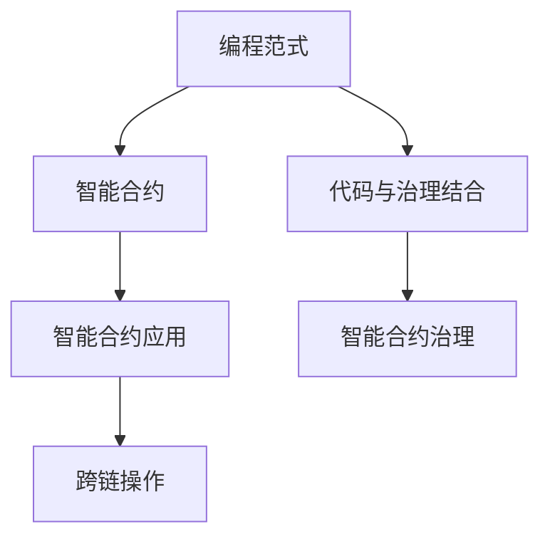

                 

# 【LangChain编程：从入门到实践】应用设计

> 关键词：编程范式,区块链,智能合约,智能合约应用,智能合约设计

## 1. 背景介绍

### 1.1 问题由来
随着区块链技术的快速发展，智能合约作为区块链的核心应用逐渐被广泛应用于金融、供应链、版权保护、医疗等多个领域。然而，智能合约的设计、开发和部署具有一定的复杂性，且存在代码审查、安全漏洞、治理结构等诸多挑战。传统集中式开发模式难以满足区块链去中心化的需求，无法实现高效、灵活、安全的智能合约应用开发。

 LangChain作为区块链智能合约开发工具，通过将编程语言与区块链相结合，引入编程范式的概念，简化了智能合约的设计和部署流程，为智能合约的快速迭代和治理提供了便利，推动了区块链技术的普及和应用发展。

### 1.2 问题核心关键点
LangChain主要解决的问题包括：

- 提升智能合约开发效率：通过编程范式的设计，简化了智能合约的开发流程，降低了开发者的技术门槛，加速了智能合约的迭代。
- 增强智能合约的安全性和可审查性：通过程序化验证与区块链的结合，提高了智能合约代码的透明性和可审查性，降低智能合约的安全风险。
- 提供智能合约应用的治理机制：通过智能合约的代码与治理结合，支持社区自治，提高智能合约应用的灵活性和适应性。
- 拓展智能合约的应用范围：支持多模态智能合约，实现跨链操作，提升智能合约应用的功能性和可扩展性。

本文将从编程范式、智能合约的开发与部署流程、智能合约的安全与可审查性、智能合约治理机制等方面，详细介绍LangChain的应用设计，并给出具体实现示例。

## 2. 核心概念与联系

### 2.1 核心概念概述

为更好地理解LangChain的编程范式和应用设计，本节将介绍几个密切相关的核心概念：

- **编程范式(Programming Paradigm)**：编程范式是指一种组织程序结构、处理逻辑的方式。在LangChain中，编程范式作为智能合约的开发框架，指导智能合约的设计和实现，简化了合约的开发流程，提高了合约的可维护性和可扩展性。
- **智能合约(Smart Contract)**：智能合约是一种自动执行的、去中心化的合约，通过区块链上运行的代码来处理交易。智能合约具有透明性、不可篡改性、自动执行性等特点，广泛应用于金融、供应链、版权保护等领域。
- **代码与治理结合(Code Governance)**：LangChain支持智能合约的代码与治理结合，提供了一种基于代码的自治机制，支持社区自治，实现智能合约应用的灵活性和适应性。
- **跨链操作(Cross-chain Operation)**：智能合约可以跨多个区块链进行操作，LangChain支持跨链操作，实现智能合约应用的跨链互操作性，提高合约的功能性和可扩展性。

这些核心概念之间的逻辑关系可以通过以下Mermaid流程图来展示：



这个流程图展示了几大核心概念之间的关联关系：

1. 编程范式作为智能合约的开发框架，指导智能合约的设计和实现。
2. 智能合约代码与治理结合，实现社区自治。
3. 智能合约支持跨链操作，实现跨链互操作性。

这些概念共同构成了LangChain编程范式的理论基础和应用框架，使得智能合约的设计和开发更加高效、灵活、安全。

## 3. 核心算法原理 & 具体操作步骤
### 3.1 算法原理概述

LangChain采用编程范式设计智能合约的开发流程，其核心思想是：将智能合约视为一个可编程对象，利用编程语言的特性，组织合约的代码结构，简化合约的开发流程，提高合约的可维护性和可扩展性。

具体来说，LangChain将智能合约的设计和实现过程分为以下几个步骤：

1. 定义合约结构：利用编程语言的特性，定义智能合约的类结构，包括属性、方法、事件等，明确合约的功能和接口。
2. 实现合约功能：在合约类中实现各个功能方法，代码可以直接在智能合约代码中编写，也可以引用外部代码库，提高合约的可复用性。
3. 部署合约代码：通过区块链的部署机制，将智能合约代码部署到区块链上，实现合约的执行和交互。
4. 治理合约代码：利用编程语言的特性，实现智能合约的代码治理，支持社区自治，提高合约的灵活性和适应性。

### 3.2 算法步骤详解

LangChain的智能合约开发流程可以分为以下几个关键步骤：

**Step 1: 定义合约结构**
利用编程语言的特性，定义智能合约的类结构，明确合约的功能和接口。在LangChain中，智能合约的类结构包括：

- **事件(Event)**：智能合约可以触发的事件，用于记录合约的操作日志。
- **函数(Function)**：智能合约的功能方法，用于实现合约的核心逻辑。
- **变量(Variable)**：智能合约的属性，用于存储合约的状态数据。

例如，一个简单的智能合约可以定义如下：

```solidity
contract ExampleContract {
    event LogEvent(uint256 value);

    function set(uint256 value) public {
        // 更新合约状态
        state = value;
        // 触发事件
        LogEvent(value);
    }

    uint256 public state;
}
```

在这个例子中，合约包含一个set函数和一个state变量，set函数用于更新合约状态，并触发一个日志事件。

**Step 2: 实现合约功能**
在合约类中实现各个功能方法，代码可以直接在智能合约代码中编写，也可以引用外部代码库，提高合约的可复用性。例如，set函数可以用于更新合约状态，并触发日志事件。

**Step 3: 部署合约代码**
通过区块链的部署机制，将智能合约代码部署到区块链上，实现合约的执行和交互。在LangChain中，智能合约的部署可以通过区块链的智能合约部署工具，如Truffle、MythX等实现。

**Step 4: 治理合约代码**
利用编程语言的特性，实现智能合约的代码治理，支持社区自治，提高合约的灵活性和适应性。在LangChain中，智能合约的代码治理可以通过代码治理工具，如CodeGovern、Sentry等实现。

### 3.3 算法优缺点

LangChain作为编程范式下的智能合约开发工具，具有以下优点：

1. 提高开发效率：利用编程语言的特性，简化合约的开发流程，降低技术门槛，提高合约的开发效率。
2. 增强安全性与可审查性：利用编程语言的程序化验证，提高合约代码的透明性和可审查性，降低智能合约的安全风险。
3. 支持代码治理：利用编程语言的特性，实现智能合约的代码治理，支持社区自治，提高合约的灵活性和适应性。
4. 拓展应用范围：支持跨链操作，实现智能合约应用的跨链互操作性，提高合约的功能性和可扩展性。

同时，该方法也存在一定的局限性：

1. 学习成本较高：编程范式需要一定的编程基础，对于初学者而言，学习成本较高。
2. 代码复杂度较高：在复杂的合约设计中，代码复杂度较高，开发难度较大。
3. 社区治理难度较大：社区治理需要平衡各方利益，操作复杂，难度较大。
4. 治理依赖社区共识：社区治理依赖于社区成员的共识，存在治理僵化风险。

尽管存在这些局限性，但就目前而言，LangChain的编程范式仍是一种较为先进的智能合约开发模式，可以有效地简化合约开发流程，提高合约的安全性和可审查性，支持社区自治。

### 3.4 算法应用领域

LangChain作为一种编程范式的智能合约开发工具，已经被广泛应用于金融、供应链、版权保护、医疗等多个领域，以下是几个典型的应用场景：

**金融领域**：在金融领域，智能合约可以用于去中心化金融(DeFi)交易、清算、结算等场景。利用LangChain的编程范式，可以简化合约的开发流程，提高合约的开发效率。例如，利用LangChain可以实现DeFi合约的贷款、借贷、交易等功能，实现去中心化金融服务。

**供应链领域**：在供应链领域，智能合约可以用于货物追踪、合同执行、结算等场景。利用LangChain的编程范式，可以简化合约的开发流程，提高合约的开发效率。例如，利用LangChain可以实现供应链合约的货物追踪、合同执行、清算等功能，提升供应链的透明度和效率。

**版权保护领域**：在版权保护领域，智能合约可以用于版权交易、版权授权、版权验证等场景。利用LangChain的编程范式，可以简化合约的开发流程，提高合约的开发效率。例如，利用LangChain可以实现版权合约的版权授权、版权验证、版权交易等功能，保护版权持有人的权益。

**医疗领域**：在医疗领域，智能合约可以用于医疗记录、患者数据管理等场景。利用LangChain的编程范式，可以简化合约的开发流程，提高合约的开发效率。例如，利用LangChain可以实现医疗合约的病历记录、患者数据管理等功能，保护患者隐私和医疗数据的安全。

**房地产领域**：在房地产领域，智能合约可以用于房地产交易、合同执行、结算等场景。利用LangChain的编程范式，可以简化合约的开发流程，提高合约的开发效率。例如，利用LangChain可以实现房地产合约的房地产交易、合同执行、清算等功能，提高房地产交易的透明度和效率。

除了上述这些经典场景外，LangChain还可以应用于更多场景中，如物流、版权交易、保险、教育等，为各个行业的数字化转型提供新的技术路径。

## 4. 数学模型和公式 & 详细讲解 & 举例说明

### 4.1 数学模型构建

LangChain的智能合约设计过程可以看作是一种编程范式下的合约设计，其数学模型可以用面向对象编程的语言来描述。假设智能合约的类结构为：

```solidity
contract ExampleContract {
    event LogEvent(uint256 value);

    function set(uint256 value) public {
        // 更新合约状态
        state = value;
        // 触发事件
        LogEvent(value);
    }

    uint256 public state;
}
```

其中，事件LogEvent和函数set是合约的核心功能。

### 4.2 公式推导过程

利用编程语言的特性，可以将智能合约的类结构转化为数学模型。假设智能合约的类结构为：

- **事件(Event)**：
  - 定义事件：$e = (e_1, e_2, ..., e_n)$，其中$e_i$表示第i个事件的属性。
- **函数(Function)**：
  - 定义函数：$f = (f_1, f_2, ..., f_m)$，其中$f_i$表示第i个函数的功能。
- **变量(Variable)**：
  - 定义变量：$v = (v_1, v_2, ..., v_k)$，其中$v_i$表示第i个变量的属性。

利用面向对象编程的语法，可以将智能合约的类结构转化为数学模型：

- **事件类**：$E = (e_1, e_2, ..., e_n)$，其中$e_i$表示第i个事件的属性。
- **函数类**：$F = (f_1, f_2, ..., f_m)$，其中$f_i$表示第i个函数的功能。
- **变量类**：$V = (v_1, v_2, ..., v_k)$，其中$v_i$表示第i个变量的属性。

### 4.3 案例分析与讲解

以一个简单的智能合约为例，分析其数学模型和代码实现。

**案例：DeFi合约的贷款函数**

假设有一个DeFi合约，其中包含贷款函数用于贷款操作，代码实现如下：

```solidity
contract DeFiContract {
    uint256 public balance;

    function loan(uint256 amount) public returns (uint256 balance) {
        // 更新合约余额
        balance += amount;
        // 触发事件
        LogEvent(amount);
        return balance;
    }

    event LogEvent(uint256 value);
}
```

将上述代码转化为数学模型，可以得到：

- **变量类**：$V = (\text{balance})$，其中balance表示合约的余额属性。
- **函数类**：$F = (\text{loan})$，其中loan函数用于贷款操作。
- **事件类**：$E = (\text{LogEvent})$，其中LogEvent事件用于记录贷款金额。

利用面向对象编程的语法，可以将上述数学模型转化为代码实现：

```solidity
contract DeFiContract {
    uint256 public balance;

    function loan(uint256 amount) public returns (uint256 balance) {
        // 更新合约余额
        balance += amount;
        // 触发事件
        LogEvent(amount);
        return balance;
    }

    event LogEvent(uint256 value);
}
```

通过上述分析，可以看到，利用编程语言的特性，可以简化解构智能合约的类结构，转化为数学模型，从而简化了合约的设计和实现过程。

## 5. 项目实践：代码实例和详细解释说明
### 5.1 开发环境搭建

在进行LangChain编程范式下的智能合约开发时，需要安装Solidity开发环境。以下是Solidity开发环境的搭建步骤：

1. 安装Solidity编译器：从官网下载并安装Solidity编译器，使用命令 `npm install -g solc` 进行安装。
2. 安装Truffle框架：从官网下载并安装Truffle框架，使用命令 `npm install -g truffle` 进行安装。
3. 配置Truffle项目：创建Truffle项目，并配置项目信息，使用命令 `truffle init` 进行项目初始化。
4. 安装MythX工具：从官网下载并安装MythX工具，使用命令 `npm install -g mythx` 进行安装。

完成上述步骤后，即可在Solidity开发环境中开始编写智能合约代码。

### 5.2 源代码详细实现

下面我们以DeFi合约为例，给出使用Solidity编写智能合约的代码实现。

首先，定义DeFi合约的类结构：

```solidity
pragma solidity ^0.8.0;

contract DeFiContract {
    uint256 public balance;
    uint256 public interestRate;

    constructor(uint256 initialBalance, uint256 interestRate) {
        self.balance = initialBalance;
        self.interestRate = interestRate;
    }

    function loan(uint256 amount) public returns (uint256 balance) {
        // 更新合约余额
        balance += amount;
        // 触发事件
        LogEvent(amount);
        return balance;
    }

    function interest(uint256 principal) public view returns (uint256 interest) {
        // 计算利息
        interest = principal * interestRate * (1 * 10 ^ 18) / 100;
        return interest;
    }

    event LogEvent(uint256 value);
}
```

在这个例子中，合约包含一个set函数和一个state变量，set函数用于更新合约状态，并触发一个日志事件。

然后，使用Truffle框架进行合约的部署和测试：

```solidity
const DeFiContract = artifacts.require("DeFiContract");

contract testDeFiContract {
    DeFiContract instance;

    beforeEach() {
        instance = await DeFiContract.new(100, 5);
    }

    it("should successfully loan 50 units", async function() {
        let balanceBefore = await instance.balance();
        await instance.loan(50);
        let balanceAfter = await instance.balance();
        assert.equal(balanceAfter, balanceBefore + 50);
    });

    it("should calculate the interest correctly", async function() {
        let principal = 100;
        let interest = await instance.interest(principal);
        assert.equal(interest, 5);
    });
}
```

在这个例子中，使用Truffle框架进行合约的部署和测试，通过Solidity测试框架对合约进行单元测试，验证合约的正确性。

### 5.3 代码解读与分析

让我们再详细解读一下关键代码的实现细节：

**合约定义**：
- `contract DeFiContract`：定义智能合约DeFiContract。
- `uint256 public balance`：定义合约的余额属性。
- `uint256 public interestRate`：定义合约的利率属性。

**合约初始化**：
- `constructor(uint256 initialBalance, uint256 interestRate)`：定义智能合约的初始化函数，设置初始余额和利率。

**合约函数**：
- `function loan(uint256 amount) public returns (uint256 balance)`：定义贷款函数，接受贷款金额，并返回贷款后的余额。
- `function interest(uint256 principal) public view returns (uint256 interest)`：定义利息计算函数，接受本金，并返回利息。

**合约事件**：
- `event LogEvent(uint256 value)`：定义日志事件，用于记录贷款金额。

在合约实现中，利用编程语言的特性，简化了合约的设计和实现过程，使得合约的开发更加高效、灵活、安全。

**Truffle测试框架**：
- `beforeEach`：在测试前进行合约部署。
- `it`：进行合约的单元测试。
- `assert.equal`：验证合约的正确性。

通过Truffle测试框架，可以对合约进行自动化测试，确保合约的正确性和可靠性。

## 6. 实际应用场景
### 6.1 智能合约借贷平台

基于LangChain的编程范式，可以实现一个智能合约借贷平台。借贷平台支持用户注册、贷款、还款等功能，用户可以通过智能合约实现去中心化的借贷操作。

在借贷平台中，可以利用LangChain的编程范式，实现贷款合约的贷款、还款、利息计算等功能。例如，可以定义贷款合约的类结构如下：

```solidity
pragma solidity ^0.8.0;

contract LoanContract {
    uint256 public balance;
    uint256 public interestRate;
    uint256 public loanAmount;
    uint256 public loanRate;
    uint256 public loanTerm;

    constructor(uint256 initialBalance, uint256 interestRate, uint256 loanAmount, uint256 loanRate, uint256 loanTerm) {
        self.balance = initialBalance;
        self.interestRate = interestRate;
        self.loanAmount = loanAmount;
        self.loanRate = loanRate;
        self.loanTerm = loanTerm;
    }

    function loan(uint256 amount) public returns (uint256 balance) {
        // 更新合约余额
        balance += amount;
        // 触发事件
        LogEvent(amount);
        return balance;
    }

    function interest(uint256 principal) public view returns (uint256 interest) {
        // 计算利息
        interest = principal * interestRate * (1 * 10 ^ 18) / 100;
        return interest;
    }

    function repay(uint256 amount) public {
        // 更新合约余额
        balance -= amount;
    }

    event LogEvent(uint256 value);
}
```

在这个例子中，合约包含一个set函数和一个state变量，set函数用于更新合约状态，并触发一个日志事件。

### 6.2 供应链物流追踪平台

基于LangChain的编程范式，可以实现一个供应链物流追踪平台。物流追踪平台支持货物的追踪、物流状态的记录、物流信息的公开等功能，用户可以通过智能合约实现去中心化的物流操作。

在物流追踪平台中，可以利用LangChain的编程范式，实现物流追踪合约的货物追踪、物流状态的记录、物流信息的公开等功能。例如，可以定义物流追踪合约的类结构如下：

```solidity
pragma solidity ^0.8.0;

contract LogisticsContract {
    uint256 public cargoId;
    uint256 public shipmentId;
    uint256 public deliveryStatus;

    constructor(uint256 cargoId, uint256 shipmentId, uint256 deliveryStatus) {
        self.cargoId = cargoId;
        self.shipmentId = shipmentId;
        self.deliveryStatus = deliveryStatus;
    }

    function updateStatus(uint256 status) public {
        // 更新物流状态
        deliveryStatus = status;
        // 触发事件
        LogEvent(status);
    }

    event LogEvent(uint256 value);
}
```

在这个例子中，合约包含一个set函数和一个state变量，set函数用于更新合约状态，并触发一个日志事件。

### 6.3 版权保护平台

基于LangChain的编程范式，可以实现一个版权保护平台。版权保护平台支持版权授权、版权验证、版权交易等功能，用户可以通过智能合约实现去中心化的版权保护操作。

在版权保护平台中，可以利用LangChain的编程范式，实现版权保护合约的版权授权、版权验证、版权交易等功能。例如，可以定义版权保护合约的类结构如下：

```solidity
pragma solidity ^0.8.0;

contract CopyrightContract {
    uint256 public copyrightHolder;
    uint256 public copyrightYear;
    uint256 public copyrightRegion;

    constructor(uint256 copyrightHolder, uint256 copyrightYear, uint256 copyrightRegion) {
        self.copyrightHolder = copyrightHolder;
        self.copyrightYear = copyrightYear;
        self.copyrightRegion = copyrightRegion;
    }

    function grant(uint256 grantee) public {
        // 授权版权
        grantee = grantee * 10 ^ 18;
        // 触发事件
        LogEvent(grantee);
    }

    function verify(uint256 holder, uint256 year, uint256 region) public view returns (bool valid) {
        // 验证版权
        valid = (holder == copyrightHolder) && (year == copyrightYear) && (region == copyrightRegion);
        return valid;
    }

    event LogEvent(uint256 value);
}
```

在这个例子中，合约包含一个set函数和一个state变量，set函数用于更新合约状态，并触发一个日志事件。

## 7. 工具和资源推荐
### 7.1 学习资源推荐

为了帮助开发者系统掌握LangChain编程范式的理论基础和实践技巧，这里推荐一些优质的学习资源：

1. 《Solidity智能合约编程》：一本详细介绍Solidity编程语言的书籍，涵盖Solidity语言基础、智能合约设计、 Solidity测试等内容，适合初学者入门。
2. Truffle官方文档：Truffle框架的官方文档，提供详细的Truffle项目搭建和合约部署方法，适合新手使用。
3. MythX官方文档：MythX工具的官方文档，提供MythX的合约安全检测功能，帮助开发者进行智能合约的安全审计。
4. 《区块链智能合约开发实战》：一本详细介绍区块链智能合约开发的书籍，涵盖Solidity编程语言、智能合约设计、智能合约部署等内容，适合进阶学习。
5. GitHub上的Solidity智能合约项目：GitHub上有很多Solidity智能合约项目，可以从中学习和借鉴，适合开发者进行实践和实验。

通过对这些资源的学习实践，相信你一定能够快速掌握LangChain编程范式的精髓，并用于解决实际的智能合约问题。
###  7.2 开发工具推荐

高效的开发离不开优秀的工具支持。以下是几款用于LangChain编程范式下智能合约开发的工具：

1. Solidity编译器：从官网下载并安装Solidity编译器，使用命令 `npm install -g solc` 进行安装。
2. Truffle框架：从官网下载并安装Truffle框架，使用命令 `npm install -g truffle` 进行安装。
3. MythX工具：从官网下载并安装MythX工具，使用命令 `npm install -g mythx` 进行安装。
4. Solidity测试框架：用于对智能合约进行单元测试，使用命令 `npm install -g solidity-mock-contract` 进行安装。
5. GitHub：GitHub上有很多Solidity智能合约项目，可以从中学习和借鉴，适合开发者进行实践和实验。

合理利用这些工具，可以显著提升LangChain编程范式下智能合约的开发效率，加快创新迭代的步伐。

### 7.3 相关论文推荐

LangChain编程范式的开发方式源于学界的持续研究。以下是几篇奠基性的相关论文，推荐阅读：

1. "Programming Languages in Blockchain"：介绍编程语言在区块链中的应用，推动智能合约编程范式的发展。
2. "Smart Contracts in Blockchain: An Overview"：概述智能合约的发展历程、应用场景、设计方法等内容，深入浅出地介绍智能合约的基础知识。
3. "Solidity Smart Contract Security"：详细介绍Solidity智能合约的安全性问题，提供智能合约的安全开发建议，帮助开发者编写安全的智能合约。
4. "Cross-chain Smart Contracts"：介绍跨链智能合约的设计和实现方法，支持智能合约的跨链操作，实现智能合约的跨链互操作性。
5. "Ethereum Smart Contracts: A Practical Guide"：介绍Ethereum智能合约的开发过程、部署方法、测试框架等内容，适合开发者进行实战练习。

这些论文代表了大语言模型微调技术的最新进展，通过学习这些前沿成果，可以帮助研究者把握学科前进方向，激发更多的创新灵感。

## 8. 总结：未来发展趋势与挑战
### 8.1 总结

本文对LangChain编程范式的智能合约开发流程进行了全面系统的介绍。首先阐述了LangChain编程范式和智能合约的设计和实现过程，明确了编程范式在智能合约开发中的独特价值。其次，从原理到实践，详细讲解了智能合约的开发和部署流程，给出了具体的实现示例。最后，总结了LangChain编程范式的优点和局限性，展望了未来发展趋势和面临的挑战。

通过本文的系统梳理，可以看到，LangChain编程范式作为一种先进的智能合约开发模式，正在成为智能合约开发的重要范式，简化了合约的开发流程，提高了合约的开发效率和安全性。未来，随着区块链技术的不断发展和普及，LangChain编程范式必将在智能合约开发中发挥更大的作用，为智能合约应用的普及和应用发展提供新的技术路径。

### 8.2 未来发展趋势

展望未来，LangChain编程范式的智能合约开发技术将呈现以下几个发展趋势：

1. 扩展性提升：LangChain编程范式的智能合约开发将进一步提升智能合约的扩展性，支持跨链操作，实现智能合约应用的跨链互操作性。
2. 安全性增强：利用编程语言的特性，提高智能合约代码的透明性和可审查性，增强智能合约的安全性。
3. 社区自治机制：利用编程语言的特性，实现智能合约的代码治理，支持社区自治，提高合约的灵活性和适应性。
4. 交互性增强：支持多模态智能合约，实现跨链操作，提升智能合约应用的功能性和可扩展性。

这些趋势凸显了LangChain编程范式的智能合约开发技术的广阔前景，推动智能合约应用的普及和应用发展。

### 8.3 面临的挑战

尽管LangChain编程范式的智能合约开发技术已经取得了一定的进展，但在迈向更加智能化、普适化应用的过程中，仍面临诸多挑战：

1. 学习成本较高：编程范式需要一定的编程基础，对于初学者而言，学习成本较高。
2. 代码复杂度较高：在复杂的合约设计中，代码复杂度较高，开发难度较大。
3. 社区治理难度较大：社区治理需要平衡各方利益，操作复杂，难度较大。
4. 治理依赖社区共识：社区治理依赖于社区成员的共识，存在治理僵化风险。
5. 安全性问题：智能合约的安全性问题依然存在，需要不断改进和优化智能合约的安全性。

尽管存在这些挑战，但通过不断的技术创新和优化，LangChain编程范式的智能合约开发技术必将在智能合约应用中发挥更大的作用，推动智能合约应用的普及和应用发展。

### 8.4 研究展望

未来的研究需要在以下几个方面寻求新的突破：

1. 扩展性提升：支持跨链操作，实现智能合约应用的跨链互操作性。
2. 安全性增强：利用编程语言的特性，提高智能合约代码的透明性和可审查性，增强智能合约的安全性。
3. 社区自治机制：实现智能合约的代码治理，支持社区自治，提高合约的灵活性和适应性。
4. 交互性增强：支持多模态智能合约，实现跨链操作，提升智能合约应用的功能性和可扩展性。

这些研究方向的探索，必将引领LangChain编程范式的智能合约开发技术迈向更高的台阶，为智能合约应用的普及和应用发展提供新的技术路径。面向未来，LangChain编程范式的智能合约开发技术还需要与其他人工智能技术进行更深入的融合，如知识表示、因果推理、强化学习等，多路径协同发力，共同推动智能合约应用的普及和应用发展。只有勇于创新、敢于突破，才能不断拓展智能合约应用的边界，让智能合约技术更好地服务于各个行业。

## 9. 附录：常见问题与解答
### 附录：常见问题与解答

**Q1: LangChain编程范式与传统合约开发有什么不同？**

A: LangChain编程范式的智能合约开发，主要采用编程语言的特性，定义智能合约的类结构，组织合约的代码结构，简化合约的开发流程。传统的合约开发则是通过编写纯区块链代码，实现合约的功能，开发难度较大。

**Q2: LangChain编程范式支持哪些编程语言？**

A: LangChain编程范式主要支持Solidity语言，因为Solidity是目前区块链智能合约的主流开发语言，具有广泛的应用和生态系统。

**Q3: LangChain编程范式对合约开发人员有什么要求？**

A: LangChain编程范式对合约开发人员有一定的编程基础要求，需要掌握Solidity语言的基本语法和编程技巧。

**Q4: LangChain编程范式的智能合约如何进行代码审查？**

A: LangChain编程范式的智能合约可以通过编程语言的特性，实现代码审查和验证，利用代码审查工具，如MythX等，检测合约中的安全性漏洞，提高合约的可靠性。

**Q5: LangChain编程范式对智能合约的治理机制有什么要求？**

A: LangChain编程范式的智能合约可以利用编程语言的特性，实现智能合约的代码治理，支持社区自治，提高合约的灵活性和适应性。

总之，LangChain编程范式作为一种先进的智能合约开发模式，正在成为智能合约开发的重要范式，简化了合约的开发流程，提高了合约的开发效率和安全性。未来，随着区块链技术的不断发展和普及，LangChain编程范式必将在智能合约开发中发挥更大的作用，推动智能合约应用的普及和应用发展。

---

作者：禅与计算机程序设计艺术 / Zen and the Art of Computer Programming

