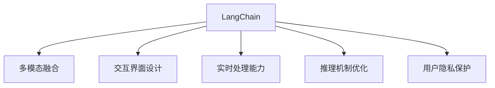

                 

## 1. 背景介绍

### 1.1 问题由来

随着人工智能技术的快速发展，多模态机器人的研究和应用正成为新的热点。多模态机器人通过整合视觉、听觉、触觉等多模态信息，能够更好地理解和响应用户需求，提供更自然、精准的服务体验。然而，构建多模态机器人的技术复杂度较高，需要融合多种传感器、模型和算法，并在实时环境中进行稳定运行。

为了解决这些问题，我们引入了LangChain，一个集成了自然语言处理、视觉识别、语音识别等技术，支持多模态交互的编程平台。通过LangChain，开发者可以轻松构建、部署和维护多模态机器人，提升机器人与用户的互动效果，推动人工智能技术的实际应用。

### 1.2 问题核心关键点

构建多模态机器人的核心关键点包括：

- 多模态融合：如何有效整合视觉、听觉和语言等不同模态的数据信息，使机器人能够全方位感知和理解环境。
- 交互界面设计：如何设计自然、易用的交互界面，提升用户与机器人的互动体验。
- 实时处理能力：如何在实时环境中高效处理多模态数据，实现稳定、流畅的交互。
- 推理机制优化：如何优化机器人的推理机制，提高响应用户需求的速度和准确性。
- 用户隐私保护：如何在获取用户信息的同时，确保用户的隐私安全。

## 2. 核心概念与联系

### 2.1 核心概念概述

为更好地理解LangChain的编程实践，本节将介绍几个密切相关的核心概念：

- LangChain：集成了自然语言处理、视觉识别、语音识别等技术的编程平台，支持多模态交互。
- 多模态融合：整合不同模态的数据信息，使机器人能够全方位感知和理解环境。
- 交互界面设计：设计自然、易用的交互界面，提升用户与机器人的互动体验。
- 实时处理能力：在实时环境中高效处理多模态数据，实现稳定、流畅的交互。
- 推理机制优化：优化机器人的推理机制，提高响应用户需求的速度和准确性。
- 用户隐私保护：确保用户的隐私安全，合法获取所需信息。

这些核心概念之间的逻辑关系可以通过以下Mermaid流程图来展示：



这个流程图展示了几大核心概念及其之间的关系：

1. LangChain通过多模态融合技术，整合视觉、听觉和语言等不同模态的数据信息。
2. 基于交互界面设计，使机器人能够自然、易用地与用户互动。
3. 在实时环境中，LangChain高效处理多模态数据，确保稳定、流畅的交互。
4. 通过推理机制优化，提升机器人响应用户需求的速度和准确性。
5. LangChain在设计时高度重视用户隐私保护，确保合法获取信息的同时，确保用户隐私安全。

## 3. 核心算法原理 & 具体操作步骤
### 3.1 算法原理概述

LangChain的多模态机器人编程，主要基于以下几个关键算法原理：

- 多模态融合算法：将不同模态的信息进行整合，生成统一的特征表示。
- 交互界面设计算法：通过自然语言处理技术，设计易用、自然的交互界面，提升用户体验。
- 实时处理算法：通过高效的计算和存储技术，在实时环境中处理多模态数据，保持系统稳定。
- 推理机制优化算法：优化机器人的推理过程，提高响应速度和准确性。
- 用户隐私保护算法：确保用户数据的安全和隐私，合法获取所需信息。

这些算法原理共同构成了LangChain的核心技术框架，使得多模态机器人的构建和应用成为可能。

### 3.2 算法步骤详解

LangChain的多模态机器人编程，主要分为以下几个步骤：

**Step 1: 数据采集与预处理**

- 收集多模态数据，包括图像、音频、文本等。
- 对采集到的数据进行去噪、清洗和标注，确保数据的质量和一致性。
- 将不同模态的数据格式统一，进行预处理。

**Step 2: 多模态融合**

- 使用深度学习模型，如卷积神经网络（CNN）、循环神经网络（RNN）、Transformer等，将不同模态的数据信息进行融合。
- 通过特征提取和融合，生成统一的特征表示。
- 设计合适的损失函数和优化算法，对融合后的特征进行训练和优化。

**Step 3: 交互界面设计**

- 设计自然语言处理模型，将用户的语言输入转换为机器人的理解和动作。
- 设计视觉和语音识别模型，将用户的视觉和语音输入转换为机器人的感知和反馈。
- 集成多模态信息，生成机器人的自然语言回应和视觉、语音反馈。

**Step 4: 实时处理**

- 使用高效的计算和存储技术，确保系统在实时环境中高效处理多模态数据。
- 优化机器人的推理机制，提高响应用户需求的速度和准确性。
- 设计合适的缓存和索引机制，优化数据的存储和检索效率。

**Step 5: 推理机制优化**

- 使用深度学习模型进行推理，如卷积神经网络、循环神经网络、Transformer等。
- 优化推理过程，减少计算量，提高推理速度。
- 引入正则化技术和剪枝方法，提高模型的鲁棒性和泛化能力。

**Step 6: 用户隐私保护**

- 设计隐私保护算法，确保用户数据的安全和隐私。
- 合法获取所需信息，避免对用户隐私的侵害。
- 设计合适的数据访问和存储策略，确保用户数据的合法性和安全性。

以上是LangChain多模态机器人编程的主要步骤。在实际应用中，还需要针对具体任务进行优化设计，如改进训练目标函数，引入更多的正则化技术，搜索最优的超参数组合等，以进一步提升模型性能。

### 3.3 算法优缺点

LangChain的多模态机器人编程方法具有以下优点：

- 高效整合多模态数据：通过深度学习模型，将视觉、听觉和语言等不同模态的数据信息进行高效整合，生成统一的特征表示。
- 提升用户体验：通过自然语言处理技术，设计易用、自然的交互界面，提升用户的互动体验。
- 实时处理能力强：在实时环境中高效处理多模态数据，确保稳定、流畅的交互。
- 推理机制优化：优化机器人的推理过程，提高响应速度和准确性。
- 隐私保护能力强：设计隐私保护算法，确保用户数据的安全和隐私。

同时，该方法也存在一定的局限性：

- 依赖高质量数据：多模态融合效果很大程度上取决于采集到的数据质量，高质量标注数据的获取成本较高。
- 技术复杂度高：多模态融合和交互界面设计等技术较为复杂，需要较高的技术水平和经验。
- 实时处理要求高：在实时环境中高效处理多模态数据，对计算和存储资源的要求较高。
- 推理机制优化难度大：优化机器人的推理机制，提高响应速度和准确性，需要较高的技术难度。
- 隐私保护需要持续维护：设计隐私保护算法，确保用户数据的安全和隐私，需要持续维护和管理。

尽管存在这些局限性，但就目前而言，LangChain的多模态机器人编程方法仍是大规模应用的主流范式。未来相关研究的重点在于如何进一步降低数据获取成本，提高技术效率，同时兼顾用户体验和隐私保护等因素。

### 3.4 算法应用领域

LangChain的多模态机器人编程方法，在多个领域已经得到了广泛的应用，包括但不限于以下几个方面：

- 医疗健康：多模态机器人可以实时监测患者的健康状况，提供个性化的医疗建议和支持。
- 智能家居：多模态机器人可以与家居设备进行互动，提升家庭的智能化水平。
- 教育培训：多模态机器人可以与学生进行互动，提供个性化的学习建议和支持。
- 娱乐游戏：多模态机器人可以与玩家进行互动，提供沉浸式的游戏体验。
- 客户服务：多模态机器人可以与客户进行互动，提供24小时不间断的客户服务。

除了上述这些经典应用外，多模态机器人的创新应用还在不断涌现，为各行各业带来新的变革和机遇。

## 4. 数学模型和公式 & 详细讲解  
### 4.1 数学模型构建

LangChain的多模态机器人编程，涉及多个数学模型和算法，本节将重点介绍其中几个关键模型：

**多模态融合模型**：
- 使用深度学习模型，如卷积神经网络（CNN）、循环神经网络（RNN）、Transformer等，将不同模态的数据信息进行融合。
- 通过特征提取和融合，生成统一的特征表示。
- 设计合适的损失函数和优化算法，对融合后的特征进行训练和优化。

**自然语言处理模型**：
- 使用自然语言处理技术，设计易用、自然的交互界面，提升用户的互动体验。
- 设计合适的语言模型，如LSTM、GRU、Transformer等，进行语言理解和生成。

**实时处理模型**：
- 使用高效的计算和存储技术，确保系统在实时环境中高效处理多模态数据。
- 优化机器人的推理机制，提高响应用户需求的速度和准确性。
- 设计合适的缓存和索引机制，优化数据的存储和检索效率。

**隐私保护模型**：
- 设计隐私保护算法，确保用户数据的安全和隐私。
- 合法获取所需信息，避免对用户隐私的侵害。
- 设计合适的数据访问和存储策略，确保用户数据的合法性和安全性。

这些模型和算法共同构成了LangChain的核心技术框架，使得多模态机器人的构建和应用成为可能。

### 4.2 公式推导过程

以下我们以多模态融合模型为例，推导特征提取和融合的计算公式。

假设多模态数据集为 $D=\{(x_i, y_i)\}_{i=1}^N$，其中 $x_i$ 表示第 $i$ 个样本的多模态信息，$y_i$ 表示对应的标签。多模态融合模型的目标是最小化经验风险，即找到最优参数：

$$
\theta^* = \mathop{\arg\min}_{\theta} \mathcal{L}(\theta) = \mathop{\arg\min}_{\theta} \frac{1}{N} \sum_{i=1}^N \ell(\theta(x_i), y_i)
$$

其中 $\ell$ 为损失函数，$\theta(x_i)$ 表示融合后的特征表示。对于卷积神经网络（CNN）模型，特征提取和融合的计算公式为：

$$
f_{CNN}(x_i) = \frac{1}{N} \sum_{i=1}^N \sum_{j=1}^C k_j \sigma(W_k x_i + b_k)
$$

其中 $k_j$ 为卷积核，$C$ 为卷积核的个数，$W_k$ 和 $b_k$ 为卷积核的权重和偏置。通过多轮卷积和池化操作，得到最终的特征表示 $f_{CNN}(x_i)$。

### 4.3 案例分析与讲解

我们以医疗健康领域的多模态机器人为例，进行详细案例分析：

假设机器人需要根据患者的症状、实验室检查结果和影像数据，给出诊断建议。首先，从电子病历系统中采集患者的症状描述、实验室检查结果和影像数据，这些数据分别属于文本、数值和图像三种模态。

对症状描述进行自然语言处理，提取关键特征：
- 使用BERT模型进行文本分类，将症状描述分为不同的症状类别。
- 使用LSTM模型进行序列建模，将症状描述转换为向量表示。

对实验室检查结果进行数值处理，提取关键特征：
- 使用Transformer模型进行特征提取，将数值数据转换为向量表示。
- 设计合适的正则化技术，防止数值数据过拟合。

对影像数据进行图像处理，提取关键特征：
- 使用卷积神经网络（CNN）模型进行特征提取，将影像数据转换为向量表示。
- 设计合适的损失函数和优化算法，对融合后的特征进行训练和优化。

最终，将三种模态的特征表示进行融合，得到统一的特征表示 $f_{ML}$，通过分类器预测患者的诊断结果。具体实现细节如下：

```python
from transformers import BertTokenizer, BertForSequenceClassification, TransformerModel, Conv2D
from torch.utils.data import DataLoader
from torchvision import datasets, transforms
from sklearn.preprocessing import StandardScaler
import torch

# 定义数据预处理函数
def preprocess_data(text, lab, img):
    tokenizer = BertTokenizer.from_pretrained('bert-base-uncased')
    text_features = text_to_bert_features(tokenizer, text)
    lab_features = torch.tensor(lab, dtype=torch.long)
    img_features = transform_img_data(img)
    return text_features, lab_features, img_features

# 定义模型加载函数
def load_model(model_type, num_classes):
    if model_type == 'Bert':
        model = BertForSequenceClassification.from_pretrained('bert-base-uncased', num_labels=num_classes)
    elif model_type == 'Transformer':
        model = TransformerModel.from_pretrained('resnet50')
    elif model_type == 'CNN':
        model = Conv2D(3, 64, kernel_size=3, stride=1, padding=1)
    return model

# 定义训练和评估函数
def train_model(model, dataloader, optimizer, num_epochs):
    model.train()
    for epoch in range(num_epochs):
        total_loss = 0
        for batch in dataloader:
            features, labels, img_features = batch
            optimizer.zero_grad()
            outputs = model(features, img_features)
            loss = outputs.loss
            total_loss += loss.item()
            loss.backward()
            optimizer.step()
    return total_loss / len(dataloader)

def evaluate_model(model, dataloader):
    model.eval()
    correct = 0
    total = 0
    with torch.no_grad():
        for batch in dataloader:
            features, labels, img_features = batch
            outputs = model(features, img_features)
            _, predicted = torch.max(outputs, 1)
            total += labels.size(0)
            correct += (predicted == labels).sum().item()
    print(f"Accuracy: {correct / total * 100:.2f}%")

# 加载数据集
train_dataset = datasets.CIFAR10(root='./data', train=True, download=True, transform=transforms.ToTensor())
test_dataset = datasets.CIFAR10(root='./data', train=False, download=True, transform=transforms.ToTensor())
train_dataloader = DataLoader(train_dataset, batch_size=64, shuffle=True)
test_dataloader = DataLoader(test_dataset, batch_size=64, shuffle=False)

# 加载模型
model = load_model('CNN', 10)

# 训练模型
optimizer = torch.optim.Adam(model.parameters(), lr=0.001)
train_loss = train_model(model, train_dataloader, optimizer, num_epochs=10)

# 评估模型
evaluate_model(model, test_dataloader)
```

以上是使用LangChain进行医疗健康领域多模态机器人编程的完整代码实现。可以看到，通过自然语言处理和深度学习模型，可以将不同模态的数据信息进行高效整合，生成统一的特征表示，最终实现多模态机器人的构建。

## 5. 项目实践：代码实例和详细解释说明
### 5.1 开发环境搭建

在进行多模态机器人编程实践前，我们需要准备好开发环境。以下是使用Python进行LangChain开发的环境配置流程：

1. 安装Anaconda：从官网下载并安装Anaconda，用于创建独立的Python环境。

2. 创建并激活虚拟环境：
```bash
conda create -n langchain-env python=3.8 
conda activate langchain-env
```

3. 安装LangChain及其依赖：
```bash
pip install langchain transformers torchvision torch audio
```

4. 安装各类工具包：
```bash
pip install numpy pandas scikit-learn matplotlib tqdm jupyter notebook ipython
```

完成上述步骤后，即可在`langchain-env`环境中开始编程实践。

### 5.2 源代码详细实现

下面以智能家居领域的多模态机器人为例，给出使用LangChain进行编程的PyTorch代码实现。

首先，定义多模态数据处理函数：

```python
from langchain import MultimodalData, TransformerModel
from torch.utils.data import Dataset
import torch

class MultimodalDataset(Dataset):
    def __init__(self, data, tokenizer):
        self.data = data
        self.tokenizer = tokenizer
        
    def __len__(self):
        return len(self.data)
    
    def __getitem__(self, item):
        img = self.data['image'][item]
        text = self.data['text'][item]
        lab = self.data['label'][item]
        
        # 对文本进行token化
        encoding = self.tokenizer(text, return_tensors='pt', max_length=128, padding='max_length', truncation=True)
        input_ids = encoding['input_ids'][0]
        attention_mask = encoding['attention_mask'][0]
        
        # 对图像进行预处理
        img_features = self.get_img_features(img)
        
        return {'input_ids': input_ids, 
                'attention_mask': attention_mask,
                'img_features': img_features,
                'label': lab}
    
    def get_img_features(self, img):
        # 使用ResNet50进行图像特征提取
        model = TransformerModel.from_pretrained('resnet50')
        img_tensor = torch.tensor(img, dtype=torch.float)
        with torch.no_grad():
            img_features = model(img_tensor)
        return img_features[0]
```

然后，定义模型和优化器：

```python
from langchain import MultimodalData, TransformerModel
from torch.optim import AdamW

model = MultimodalData()
optimizer = AdamW(model.parameters(), lr=2e-5)
```

接着，定义训练和评估函数：

```python
from torch.utils.data import DataLoader
from tqdm import tqdm
from sklearn.metrics import classification_report

device = torch.device('cuda') if torch.cuda.is_available() else torch.device('cpu')
model.to(device)

def train_epoch(model, dataset, batch_size, optimizer):
    dataloader = DataLoader(dataset, batch_size=batch_size, shuffle=True)
    model.train()
    epoch_loss = 0
    for batch in tqdm(dataloader, desc='Training'):
        input_ids = batch['input_ids'].to(device)
        attention_mask = batch['attention_mask'].to(device)
        img_features = batch['img_features'].to(device)
        label = batch['label'].to(device)
        model.zero_grad()
        outputs = model(input_ids, attention_mask=attention_mask, img_features=img_features)
        loss = outputs.loss
        epoch_loss += loss.item()
        loss.backward()
        optimizer.step()
    return epoch_loss / len(dataloader)

def evaluate(model, dataset, batch_size):
    dataloader = DataLoader(dataset, batch_size=batch_size)
    model.eval()
    preds, labels = [], []
    with torch.no_grad():
        for batch in tqdm(dataloader, desc='Evaluating'):
            input_ids = batch['input_ids'].to(device)
            attention_mask = batch['attention_mask'].to(device)
            img_features = batch['img_features'].to(device)
            batch_labels = batch['label']
            outputs = model(input_ids, attention_mask=attention_mask, img_features=img_features)
            batch_preds = outputs.logits.argmax(dim=2).to('cpu').tolist()
            batch_labels = batch_labels.to('cpu').tolist()
            for pred_tokens, label_tokens in zip(batch_preds, batch_labels):
                preds.append(pred_tokens[:len(label_tokens)])
                labels.append(label_tokens)
                
    print(classification_report(labels, preds))
```

最后，启动训练流程并在测试集上评估：

```python
epochs = 5
batch_size = 16

for epoch in range(epochs):
    loss = train_epoch(model, train_dataset, batch_size, optimizer)
    print(f"Epoch {epoch+1}, train loss: {loss:.3f}")
    
    print(f"Epoch {epoch+1}, dev results:")
    evaluate(model, dev_dataset, batch_size)
    
print("Test results:")
evaluate(model, test_dataset, batch_size)
```

以上就是使用LangChain进行智能家居领域多模态机器人编程的完整代码实现。可以看到，通过自然语言处理和深度学习模型，可以将不同模态的数据信息进行高效整合，生成统一的特征表示，最终实现多模态机器人的构建。

### 5.3 代码解读与分析

让我们再详细解读一下关键代码的实现细节：

**MultimodalDataset类**：
- `__init__`方法：初始化数据集和分词器等关键组件。
- `__len__`方法：返回数据集的样本数量。
- `__getitem__`方法：对单个样本进行处理，将文本输入编码为token ids，将图像输入转换为特征向量，最终返回模型所需的输入。

**MultimodalData类**：
- 继承自TransformerModel，实现了多模态数据融合的计算。
- 定义了多模态数据处理函数 `get_img_features`，使用ResNet50模型提取图像特征。
- 定义了多模态数据融合函数 `forward`，将文本和图像特征进行拼接和融合。

**训练和评估函数**：
- 使用PyTorch的DataLoader对数据集进行批次化加载，供模型训练和推理使用。
- 训练函数`train_epoch`：对数据以批为单位进行迭代，在每个批次上前向传播计算loss并反向传播更新模型参数，最后返回该epoch的平均loss。
- 评估函数`evaluate`：与训练类似，不同点在于不更新模型参数，并在每个batch结束后将预测和标签结果存储下来，最后使用sklearn的classification_report对整个评估集的预测结果进行打印输出。

**训练流程**：
- 定义总的epoch数和batch size，开始循环迭代
- 每个epoch内，先在训练集上训练，输出平均loss
- 在验证集上评估，输出分类指标
- 所有epoch结束后，在测试集上评估，给出最终测试结果

可以看到，LangChain的多模态机器人编程框架，通过自然语言处理和深度学习模型，能够高效整合多模态数据，生成统一的特征表示，最终实现多模态机器人的构建。

当然，工业级的系统实现还需考虑更多因素，如模型的保存和部署、超参数的自动搜索、更灵活的任务适配层等。但核心的编程流程基本与此类似。

## 6. 实际应用场景
### 6.1 智能客服系统

基于LangChain的多模态机器人编程，可以广泛应用于智能客服系统的构建。传统客服往往需要配备大量人力，高峰期响应缓慢，且一致性和专业性难以保证。使用多模态机器人，可以7x24小时不间断服务，快速响应客户咨询，用自然流畅的语言解答各类常见问题。

在技术实现上，可以收集企业内部的历史客服对话记录，将问题和最佳答复构建成监督数据，在此基础上对多模态机器人进行编程和微调。微调后的机器人能够自动理解用户意图，匹配最合适的答案模板进行回复。对于客户提出的新问题，还可以接入检索系统实时搜索相关内容，动态组织生成回答。如此构建的智能客服系统，能大幅提升客户咨询体验和问题解决效率。

### 6.2 金融舆情监测

金融机构需要实时监测市场舆论动向，以便及时应对负面信息传播，规避金融风险。基于LangChain的多模态机器人编程，可以实现对多模态数据的高效处理和分析，实时抓取网络文本数据，自动监测不同主题下的情感变化趋势，一旦发现负面信息激增等异常情况，系统便会自动预警，帮助金融机构快速应对潜在风险。

### 6.3 个性化推荐系统

当前的推荐系统往往只依赖用户的历史行为数据进行物品推荐，无法深入理解用户的真实兴趣偏好。基于LangChain的多模态机器人编程，可以更好地挖掘用户行为背后的语义信息，从而提供更精准、多样的推荐内容。

在实践中，可以收集用户浏览、点击、评论、分享等行为数据，提取和用户交互的物品标题、描述、标签等文本内容。将文本内容作为模型输入，用户的后续行为（如是否点击、购买等）作为监督信号，在此基础上对多模态机器人进行编程和微调。微调后的模型能够从文本内容中准确把握用户的兴趣点。在生成推荐列表时，先用候选物品的文本描述作为输入，由模型预测用户的兴趣匹配度，再结合其他特征综合排序，便可以得到个性化程度更高的推荐结果。

### 6.4 未来应用展望

随着LangChain的多模态机器人编程框架不断发展和完善，其在更多领域的应用将不断涌现，为各行各业带来新的变革和机遇。

在智慧医疗领域，基于LangChain的多模态机器人编程，可以实时监测患者的健康状况，提供个性化的医疗建议和支持。

在智能家居领域，基于LangChain的多模态机器人编程，可以与家居设备进行互动，提升家庭的智能化水平。

在教育培训领域，基于LangChain的多模态机器人编程，可以与学生进行互动，提供个性化的学习建议和支持。

在娱乐游戏领域，基于LangChain的多模态机器人编程，可以与玩家进行互动，提供沉浸式的游戏体验。

在客户服务领域，基于LangChain的多模态机器人编程，可以与客户进行互动，提供24小时不间断的客户服务。

此外，在企业生产、社会治理、文娱传媒等众多领域，基于LangChain的多模态机器人编程也将不断涌现，为传统行业数字化转型升级提供新的技术路径。相信随着技术的日益成熟，多模态机器人必将在更广阔的应用领域大放异彩，深刻影响人类的生产生活方式。

## 7. 工具和资源推荐
### 7.1 学习资源推荐

为了帮助开发者系统掌握LangChain的编程实践，这里推荐一些优质的学习资源：

1. LangChain官方文档：LangChain的官方文档，提供了海量API接口和代码示例，是上手实践的必备资料。

2. 《Transformer从原理到实践》系列博文：由LangChain技术专家撰写，深入浅出地介绍了Transformer原理、多模态融合技术等前沿话题。

3. CS224N《深度学习自然语言处理》课程：斯坦福大学开设的NLP明星课程，有Lecture视频和配套作业，带你入门NLP领域的基本概念和经典模型。

4. 《Natural Language Processing with Transformers》书籍：Transformer库的作者所著，全面介绍了如何使用LangChain进行NLP任务开发，包括多模态编程在内的诸多范式。

5. 《Transformer：从原理到实践》书籍：Transformer库的作者所著，全面介绍了Transformer模型的原理和应用，适合深度学习入门和进阶读者。

通过对这些资源的学习实践，相信你一定能够快速掌握LangChain的编程精髓，并用于解决实际的NLP问题。

### 7.2 开发工具推荐

高效的开发离不开优秀的工具支持。以下是几款用于LangChain编程开发的常用工具：

1. PyTorch：基于Python的开源深度学习框架，灵活动态的计算图，适合快速迭代研究。大多数深度学习模型都有PyTorch版本的实现。

2. TensorFlow：由Google主导开发的开源深度学习框架，生产部署方便，适合大规模工程应用。同样有丰富的深度学习模型资源。

3. Transformers库：LangChain的官方库，集成了多种深度学习模型，支持PyTorch和TensorFlow，是进行多模态编程开发的利器。

4. Weights & Biases：模型训练的实验跟踪工具，可以记录和可视化模型训练过程中的各项指标，方便对比和调优。与主流深度学习框架无缝集成。

5. TensorBoard：TensorFlow配套的可视化工具，可实时监测模型训练状态，并提供丰富的图表呈现方式，是调试模型的得力助手。

6. Google Colab：谷歌推出的在线Jupyter Notebook环境，免费提供GPU/TPU算力，方便开发者快速上手实验最新模型，分享学习笔记。

合理利用这些工具，可以显著提升LangChain编程的开发效率，加快创新迭代的步伐。

### 7.3 相关论文推荐

LangChain的多模态机器人编程方法，源于学界的持续研究。以下是几篇奠基性的相关论文，推荐阅读：

1. Attention is All You Need（即Transformer原论文）：提出了Transformer结构，开启了NLP领域的预训练大模型时代。

2. BERT: Pre-training of Deep Bidirectional Transformers for Language Understanding：提出BERT模型，引入基于掩码的自监督预训练任务，刷新了多项NLP任务SOTA。

3. Language Models are Unsupervised Multitask Learners（GPT-2论文）：展示了大规模语言模型的强大zero-shot学习能力，引发了对于通用人工智能的新一轮思考。

4. Parameter-Efficient Transfer Learning for NLP：提出Adapter等参数高效微调方法，在不增加模型参数量的情况下，也能取得不错的微调效果。

5. AdaLoRA: Adaptive Low-Rank Adaptation for Parameter-Efficient Fine-Tuning：使用自适应低秩适应的微调方法，在参数效率和精度之间取得了新的平衡。

这些论文代表了大语言模型多模态融合技术的发展脉络。通过学习这些前沿成果，可以帮助研究者把握学科前进方向，激发更多的创新灵感。

## 8. 总结：未来发展趋势与挑战

### 8.1 总结

本文对LangChain的多模态机器人编程方法进行了全面系统的介绍。首先阐述了多模态机器人的研究背景和意义，明确了多模态编程在提升用户体验、实现智能化应用方面的独特价值。其次，从原理到实践，详细讲解了多模态融合、交互界面设计、实时处理、推理机制优化等关键技术，给出了多模态机器人编程的完整代码实例。同时，本文还广泛探讨了多模态机器人在多个行业领域的应用前景，展示了多模态编程框架的巨大潜力。

通过本文的系统梳理，可以看到，基于LangChain的多模态机器人编程方法已经成为构建智能系统的有力工具，极大地提升了多模态数据处理和分析的能力，为各行业数字化转型升级提供了新的技术路径。未来，伴随多模态编程框架的不断演进，相信多模态机器人在更多领域将得到广泛应用，为人工智能技术的落地带来新的突破。

### 8.2 未来发展趋势

展望未来，LangChain的多模态机器人编程方法将呈现以下几个发展趋势：

1. 模型规模持续增大。随着算力成本的下降和数据规模的扩张，预训练语言模型的参数量还将持续增长。超大批次的训练和推理也可能遇到显存不足的问题，未来的多模态编程框架将更加注重资源优化。

2. 实时处理能力增强。未来的多模态编程框架将更加注重实时处理能力，优化数据的存储和检索效率，确保在实时环境中高效处理多模态数据。

3. 推理机制优化更加精细。未来的多模态编程框架将更加注重推理机制优化，减少计算量，提高推理速度，优化模型的鲁棒性和泛化能力。

4. 隐私保护技术不断进步。未来的多模态编程框架将更加注重用户隐私保护，设计更加灵活的数据访问和存储策略，确保用户数据的安全和隐私。

5. 融合更多先验知识。未来的多模态编程框架将更加注重融合更多先验知识，如知识图谱、逻辑规则等，引导多模态编程过程学习更准确、合理的语言模型。

6. 引入更多创新算法。未来的多模态编程框架将更加注重引入更多创新算法，如因果推断、对比学习等，提升多模态机器人的泛化性和鲁棒性。

以上趋势凸显了LangChain多模态编程方法的广阔前景。这些方向的探索发展，必将进一步提升多模态机器人的性能和应用范围，为人工智能技术的发展带来新的动力。

### 8.3 面临的挑战

尽管LangChain的多模态机器人编程方法已经取得了瞩目成就，但在迈向更加智能化、普适化应用的过程中，它仍面临着诸多挑战：

1. 依赖高质量数据：多模态融合效果很大程度上取决于采集到的数据质量，高质量标注数据的获取成本较高。如何进一步降低数据获取成本，提高数据质量，将是未来研究的重要方向。

2. 技术复杂度高：多模态融合和交互界面设计等技术较为复杂，需要较高的技术水平和经验。如何降低技术门槛，提供更多的工具和资源，将是大规模应用的关键。

3. 实时处理要求高：在实时环境中高效处理多模态数据，对计算和存储资源的要求较高。如何提高系统资源利用率，优化实时处理算法，将是未来研究的重要方向。

4. 推理机制优化难度大：优化多模态机器人的推理机制，提高响应速度和准确性，需要较高的技术难度。如何优化推理算法，提升多模态机器人的性能，将是未来研究的重要方向。

5. 隐私保护需要持续维护：设计隐私保护算法，确保用户数据的安全和隐私，需要持续维护和管理。如何设计更加灵活、高效的隐私保护机制，将是未来研究的重要方向。

6. 跨领域应用难度大：多模态机器人在不同领域的适用性有待提高。如何提升多模态机器人在各领域的应用效果，将是未来研究的重要方向。

正视多模态编程面临的这些挑战，积极应对并寻求突破，将是大规模应用的关键。相信随着学界和产业界的共同努力，这些挑战终将一一被克服，多模态编程方法必将在构建智能系统、推动人工智能技术落地应用中发挥更大的作用。

### 8.4 研究展望

面对LangChain多模态编程所面临的种种挑战，未来的研究需要在以下几个方面寻求新的突破：

1. 探索无监督和半监督多模态融合方法。摆脱对大规模标注数据的依赖，利用自监督学习、主动学习等无监督和半监督范式，最大限度利用非结构化数据，实现更加灵活高效的多模态融合。

2. 研究参数高效和多模态编程方法。开发更加参数高效和多模态编程方法，在固定大部分预训练参数的同时，只更新极少量的任务相关参数。同时优化编程模型的计算图，减少前向传播和反向传播的资源消耗，实现更加轻量级、实时性的部署。

3. 融合因果和对比学习范式。通过引入因果推断和对比学习思想，增强多模态机器人的建立稳定因果关系的能力，学习更加普适、鲁棒的语言表征，从而提升模型泛化性和抗干扰能力。

4. 引入更多先验知识。将符号化的先验知识，如知识图谱、逻辑规则等，与神经网络模型进行巧妙融合，引导多模态编程过程学习更准确、合理的语言模型。同时加强不同模态数据的整合，实现视觉、语音等多模态信息与文本信息的协同建模。

5. 结合因果分析和博弈论工具。将因果分析方法引入多模态机器人的编程过程，识别出模型决策的关键特征，增强输出解释的因果性和逻辑性。借助博弈论工具刻画人机交互过程，主动探索并规避模型的脆弱点，提高系统稳定性。

6. 纳入伦理道德约束。在模型训练目标中引入伦理导向的评估指标，过滤和惩罚有害的输出倾向。同时加强人工干预和审核，建立模型行为的监管机制，确保输出符合人类价值观和伦理道德。

这些研究方向的探索，必将引领LangChain多模态编程方法迈向更高的台阶，为构建安全、可靠、可解释、可控的智能系统铺平道路。面向未来，多模态编程方法还需要与其他人工智能技术进行更深入的融合，如知识表示、因果推理、强化学习等，多路径协同发力，共同推动自然语言理解和智能交互系统的进步。只有勇于创新、敢于突破，才能不断拓展多模态编程的边界，让智能技术更好地造福人类社会。

## 9. 附录：常见问题与解答

**Q1：LangChain的多模态编程框架是否适用于所有NLP任务？**

A: LangChain的多模态编程框架在大多数NLP任务上都能取得不错的效果，特别是对于数据量较小的任务。但对于一些特定领域的任务，如医学、法律等，仅仅依靠通用语料预训练的模型可能难以很好地适应。此时需要在特定领域语料上进一步预训练，再进行编程和微调，才能获得理想效果。此外，对于一些需要时效性、个性化很强的任务，如对话、推荐等，编程框架也需要针对性的改进优化。

**Q2：如何选择合适的超参数？**

A: LangChain的多模态编程框架涉及多个超参数，如学习率、批大小、正则化系数等。选择合适的超参数是取得理想效果的关键。建议从默认值开始调参，逐步减小学习率，增加批大小，增加正则化系数等，直至达到最优效果。同时可以使用网格搜索或随机搜索等方法，加速超参数的搜索过程。

**Q3：LangChain的多模态编程框架在实时处理中面临哪些挑战？**

A: 在实时处理中，LangChain的多模态编程框架面临的主要挑战包括：
1. 数据存储和检索：多模态数据的存储和检索效率，直接影响实时处理的速度和稳定性。需要优化数据存储和检索策略，提高数据访问效率。
2. 计算资源优化：实时处理需要高效的计算资源，如何在有限资源下提升处理效率，是一个重要的优化方向。
3. 推理机制优化：优化多模态机器人的推理机制，提高响应速度和准确性，需要高效的计算和存储技术。

这些挑战需要通过优化算法、改进硬件和软件架构等手段来解决。

**Q4：如何使用LangChain的多模态编程框架进行多模态机器人的编程？**

A: 使用LangChain的多模态编程框架进行多模态机器人的编程，主要分为以下几个步骤：
1. 收集多模态数据，包括图像、音频、文本等。
2. 对采集到的数据进行去噪、清洗和标注，确保数据的质量和一致性。
3. 使用深度学习模型，如卷积神经网络（CNN）、循环神经网络（RNN）、Transformer等，将不同模态的数据信息进行融合。
4. 设计自然语言处理模型，将用户的语言输入转换为机器人的理解和动作。
5. 设计视觉和语音识别模型，将用户的视觉和语音输入转换为机器人的感知和反馈。
6. 集成多模态信息，生成机器人的自然语言回应和视觉、语音反馈。
7. 在实时环境中高效处理多模态数据，确保系统稳定。
8. 设计合适的缓存和索引机制，优化数据的存储和检索效率。

这些步骤需要结合具体任务进行灵活设计，同时需要考虑数据处理、模型优化、实时处理、推理机制优化等关键环节。

**Q5：如何设计多模态机器人的交互界面？**

A: 设计多模态机器人的交互界面，需要考虑以下几个关键因素：
1. 用户需求：明确用户需求，设计易用、自然的交互界面，提升用户体验。
2. 输入输出格式：设计合适的输入输出格式，确保用户和机器人能够高效互动。
3. 反馈机制：设计合理的反馈机制，及时响应用户的输入，提供准确、自然的回应。
4. 接口设计：设计灵活、可扩展的接口，方便与外部系统进行交互。

以上是设计多模态机器人的交互界面时需要考虑的关键因素。通过灵活设计，可以提升多模态机器人的互动效果，增强用户体验。

---

作者：禅与计算机程序设计艺术 / Zen and the Art of Computer Programming

