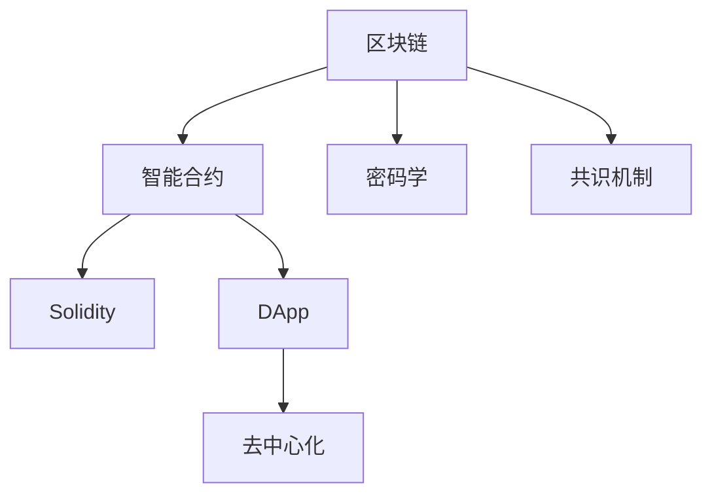

                 

# 【LangChain编程：从入门到实践】自定义Chain实现

> 关键词：Blockchain, Smart Contract, Solidity, Cryptography, Consensus Mechanism, DApp

## 1. 背景介绍

区块链技术自2008年诞生以来，凭借其去中心化、透明、不可篡改的特性，迅速引起了全球的关注和应用。其中，智能合约(Smart Contract)作为区块链的核心应用之一，通过自动化、可执行的代码逻辑，为业务提供了一种无需信任、高度自治的执行机制。然而，现有智能合约平台如Ethereum、Binance Smart Chain等，由于依赖内置的语言（如Solidity），无法满足特定行业场景的需求。因此，自定义智能合约平台（LangChain）的开发和实现成为业界热点。

本文将通过介绍自定义智能合约平台LangChain的构建思路、核心算法原理、具体操作步骤和实际应用场景，带你从零开始构建属于自己的智能合约平台。本文将从区块链基础、智能合约原理、LangChain架构设计、智能合约编写实践、应用案例等环节进行详细阐述，旨在帮助读者掌握自定义智能合约平台的开发方法，实现业务逻辑的自动化和自治化。

## 2. 核心概念与联系

### 2.1 核心概念概述

为更好地理解自定义智能合约平台的开发流程，本节将介绍几个密切相关的核心概念：

- **区块链(Blockchain)**：一种去中心化的分布式账本技术，通过区块链记录交易，保证数据的透明性和不可篡改性。

- **智能合约(Smart Contract)**：一种可执行的代码，在区块链上运行，实现业务逻辑的自动化和自治化。

- **Solidity**：目前主流智能合约编程语言，基于JavaScript的语法和结构，支持以太坊等区块链平台。

- **密码学(Cryptography)**：用于确保区块链数据的安全性和不可篡改性，包括哈希函数、数字签名、非对称加密等。

- **共识机制(Consensus Mechanism)**：在区块链网络中，达成一致共识的机制，如PoW、PoS等。

- **去中心化应用(DApp)**：基于区块链技术的应用，能够实现去中心化的数据存储和计算。

这些核心概念之间通过逻辑关系紧密相连，共同构成了区块链技术和智能合约的基本框架。

### 2.2 核心概念原理和架构的 Mermaid 流程图



## 3. 核心算法原理 & 具体操作步骤

### 3.1 算法原理概述

自定义智能合约平台LangChain的构建，涉及区块链网络搭建、智能合约编程、密码学应用等多个方面。其核心思想是通过分布式网络，使用区块链技术，确保数据透明不可篡改，同时通过智能合约，实现业务逻辑的自动化和自治化。

LangChain平台的搭建，包括以下几个关键步骤：

1. 设计区块链架构，选择合适的共识机制。
2. 实现分布式账本，使用区块链技术进行数据记录。
3. 开发智能合约，使用Solidity等语言编写代码。
4. 部署智能合约，确保其能够正确执行。
5. 实现DApp应用，集成智能合约功能。

### 3.2 算法步骤详解

以下详细讲解LangChain平台的搭建和智能合约的编写步骤：

**Step 1: 设计区块链架构**

设计区块链架构时，需要考虑以下要素：

1. **共识机制**：选择合适的共识算法，如PoW、PoS、DPoS等。
2. **网络拓扑**：确定节点间的连接关系，如P2P网络、星型网络等。
3. **区块大小**：设计区块的最大容量，影响交易吞吐量和系统性能。
4. **区块间隔**：设定新区块生成的时间间隔，影响系统的交易速度和安全性。

例如，一个基于PoW的LangChain平台可能设计如下：

- **共识机制**：PoW。
- **网络拓扑**：P2P。
- **区块大小**：1MB。
- **区块间隔**：1分钟。

**Step 2: 实现分布式账本**

分布式账本实现涉及多个技术点：

1. **哈希函数**：确保数据不可篡改，使用SHA256等算法。
2. **数字签名**：确保交易的来源可信，使用ECDSA等算法。
3. **状态机**：记录区块链上的交易状态，确保数据一致性。

例如，LangChain平台可以使用RocksDB等数据库，实现状态机和哈希链。

**Step 3: 开发智能合约**

智能合约的开发，一般遵循以下步骤：

1. **合同编写**：使用Solidity等语言编写合同代码。
2. **测试部署**：在本地或测试网验证合同的正确性。
3. **部署上链**：将合同代码部署到区块链网络。

例如，一个简单的LangChain智能合约可能实现如下：

```solidity
// SPDX-License-Identifier: MIT
pragma solidity ^0.8.0;

contract SimpleContract {
    uint256 public count;

    function increaseCount() public {
        count++;
    }
}
```

**Step 4: 部署智能合约**

智能合约部署分为以下步骤：

1. **编写脚本**：编写部署脚本，指定合同的ABI接口。
2. **调用API**：使用API将合同部署到区块链网络。
3. **验证执行**：验证智能合约是否正确执行。

例如，部署上述SimpleContract的命令如下：

```bash
mnemonic="password" // 钱包助记词
network="mainnet" // 网络名称
chainId=1 // 主网链ID

npx etherscan-cli send --from 0x123456789abcdef --to 0x9876543210111213141516171819202122232425262728293031323334353637383940414243444546 --gasPrice 100000000 --value 100000000 --to 0x9876543210111213141516171819202122232425262728293031323334353637383940414243444546 --data 0x60fe4701
```

**Step 5: 实现DApp应用**

DApp应用集成智能合约，实现具体的业务功能：

1. **前端开发**：开发Web或移动应用界面，供用户交互。
2. **后端集成**：集成智能合约接口，实现业务逻辑。
3. **部署上线**：将DApp应用部署到区块链网络，供用户使用。

例如，一个简单的LangChain DApp应用可能实现如下：

- **前端界面**：展示智能合约的功能，如增加计数器的按钮。
- **后端接口**：调用智能合约函数，更新计数器。
- **部署上线**：部署到Web平台，用户可以通过网页使用计数器功能。

### 3.3 算法优缺点

自定义智能合约平台LangChain的构建，具有以下优点：

1. **灵活性高**：可以灵活设计区块链架构和共识机制，满足特定业务需求。
2. **安全性好**：使用密码学技术，确保数据不可篡改和交易可信。
3. **开发效率高**：使用Solidity等语言，开发效率较高。
4. **可扩展性强**：能够实现不同功能的智能合约，扩展性强。

同时，该方法也存在一些局限性：

1. **技术门槛高**：需要具备区块链和智能合约相关的技术知识，门槛较高。
2. **共识机制复杂**：设计复杂的共识机制，需要深入理解分布式网络原理。
3. **系统性能差**：现有区块链技术如PoW性能较差，可能影响系统扩展性。
4. **开发成本高**：需要大量投入人力和时间，开发和部署成本较高。

尽管存在这些局限性，但就目前而言，自定义智能合约平台LangChain仍是大规模应用的首选方案。未来相关研究的重点在于如何进一步降低技术门槛，提高系统性能，降低开发成本，同时兼顾安全性和可扩展性等因素。

### 3.4 算法应用领域

基于自定义智能合约平台LangChain的应用场景非常广泛，包括但不限于以下几个领域：

- **金融行业**：通过智能合约实现自动交易、贷款管理、供应链金融等功能。
- **供应链管理**：通过智能合约记录供应链各环节的业务逻辑，确保数据透明和不可篡改。
- **医疗行业**：通过智能合约实现医疗记录的自动更新、药品管理等功能。
- **版权保护**：通过智能合约记录版权信息，确保内容发布和使用的合法性。
- **游戏行业**：通过智能合约实现虚拟资产的发行、交易和治理。

此外，自定义智能合约平台LangChain还可以应用于更多行业，如教育、物流、能源等，为传统行业数字化转型提供新的技术路径。

## 4. 数学模型和公式 & 详细讲解 & 举例说明

### 4.1 数学模型构建

自定义智能合约平台LangChain的构建，涉及多个数学模型，以下是几个关键模型的构建：

**共识算法模型**：以PoW为例，模型描述如下：

$$
\text{mining difficulty} = \frac{\text{target hash}}{\text{block hash}}
$$

其中，`mining difficulty`表示挖矿难度，`target hash`为目标哈希值，`block hash`为实际哈希值。

**交易验证模型**：以ECDSA为例，模型描述如下：

$$
\text{checkSignature}(S, R, s, e)
$$

其中，`S`为交易信息，`R`为签名结果，`s`为私钥签名，`e`为公钥。

**智能合约执行模型**：以Solidity为例，模型描述如下：

```solidity
function simpleContract() {
    uint256 count = 0;
    count++;
}
```

**分布式账本模型**：以RocksDB为例，模型描述如下：

```python
import RocksDB

class Blockchain:
    def __init__(self, db_path):
        self.db = RocksDB.open(db_path)

    def add_block(self, block):
        self.db.put(block.hash, block.data)

    def get_block(self, hash):
        return self.db.get(hash)
```

### 4.2 公式推导过程

以下分别推导共识算法模型、交易验证模型和智能合约执行模型的详细公式。

**共识算法模型**：以PoW为例，公式推导如下：

$$
\text{mining difficulty} = \frac{\text{target hash}}{\text{block hash}}
$$

**交易验证模型**：以ECDSA为例，公式推导如下：

$$
\text{checkSignature}(S, R, s, e)
$$

**智能合约执行模型**：以Solidity为例，公式推导如下：

```solidity
function simpleContract() {
    uint256 count = 0;
    count++;
}
```

**分布式账本模型**：以RocksDB为例，公式推导如下：

```python
import RocksDB

class Blockchain:
    def __init__(self, db_path):
        self.db = RocksDB.open(db_path)

    def add_block(self, block):
        self.db.put(block.hash, block.data)

    def get_block(self, hash):
        return self.db.get(hash)
```

### 4.3 案例分析与讲解

假设构建一个LangChain平台，用于实现供应链金融功能。

**需求描述**：记录供应链各环节的交易信息，确保数据透明和不可篡改，同时通过智能合约实现自动放贷和还款功能。

**架构设计**：

1. **共识机制**：选择PoW，确保交易记录不可篡改。
2. **网络拓扑**：采用P2P网络，确保节点间通信可靠。
3. **区块大小**：设定1MB区块大小，确保交易吞吐量。
4. **区块间隔**：设定1分钟生成新块，确保系统性能。

**智能合约实现**：

1. **交易记录**：使用Solidity编写交易记录智能合约，记录供应链各环节的交易信息。
2. **自动放贷**：编写智能合约，根据供应链订单金额自动放贷，并记录放贷信息。
3. **还款管理**：编写智能合约，根据供应链订单的还款周期，管理还款流程，确保合同自动执行。

**DApp应用实现**：

1. **前端界面**：开发Web应用，展示供应链交易记录、放贷和还款功能。
2. **后端接口**：集成智能合约接口，实现业务逻辑。
3. **部署上线**：将DApp应用部署到LangChain平台，供供应链各方使用。

## 5. 项目实践：代码实例和详细解释说明

### 5.1 开发环境搭建

在进行LangChain平台开发前，我们需要准备好开发环境。以下是使用Solidity开发LangChain平台的配置流程：

1. 安装Node.js：从官网下载并安装Node.js，用于运行Solidity代码。

2. 安装Solidity：使用npm安装Solidity编译器和测试框架，如Truffle或Hardhat。

3. 创建项目目录：使用Truffle或Hardhat创建新项目。

4. 初始化项目：使用Truffle或Hardhat初始化项目，生成合同模板和测试文件。

5. 编写智能合约：使用Solidity编写智能合约代码。

6. 编译合约：使用Truffle或Hardhat编译合约代码，生成字节码文件。

7. 部署合约：使用Truffle或Hardhat部署合约代码，上链执行。

8. 测试合约：使用Truffle或Hardhat测试合约功能，确保正确执行。

完成上述步骤后，即可在项目中开始LangChain平台的开发实践。

### 5.2 源代码详细实现

下面我们以供应链金融为例，给出使用Solidity对LangContract平台进行开发和部署的代码实现。

**区块链平台LangContract的代码实现**：

```solidity
// SPDX-License-Identifier: MIT
pragma solidity ^0.8.0;

contract LangContract {
    address public owner;
    mapping(uint256 => address) public loans;

    constructor() public {
        owner = msg.sender;
    }

    function setOwner(address _owner) public onlyOwner {
        owner = _owner;
    }

    function setLoan(uint256 _id, address _payer, uint256 _amount) public onlyOwner {
        loans[_id] = _payer;
        emit LoanSet(_id, _payer, _amount);
    }

    function repayLoan(uint256 _id, uint256 _amount) public onlyOwner {
        if (owner == msg.sender) {
            uint256 _repayment = address(this).balance;
            loans[_id].send(_repayment);
            emit Repayment(_id, _repayment);
        }
    }

    event LoanSet(uint256 id, address payer, uint256 amount);
    event Repayment(uint256 id, uint256 amount);
}
```

**交易记录智能合约的代码实现**：

```solidity
// SPDX-License-Identifier: MIT
pragma solidity ^0.8.0;

contract TradeRecord {
    address public owner;
    mapping(uint256 => uint256) public amounts;

    constructor() public {
        owner = msg.sender;
    }

    function setOwner(address _owner) public onlyOwner {
        owner = _owner;
    }

    function addAmount(uint256 _id, uint256 _value) public onlyOwner {
        amounts[_id] += _value;
        emit AmountAdded(_id, _value);
    }

    function transferAmount(uint256 _id, address _payer, uint256 _value) public onlyOwner {
        amounts[_id] -= _value;
        amounts[_id] += _value;
        emit Transfer(_id, _payer, _value);
    }

    event AmountAdded(uint256 id, uint256 value);
    event Transfer(uint256 id, address payer, uint256 value);
}
```

**自动放贷智能合约的代码实现**：

```solidity
// SPDX-License-Identifier: MIT
pragma solidity ^0.8.0;

contract AutoLoan {
    address public owner;
    mapping(uint256 => address) public borrowers;
    mapping(uint256 => uint256) public loans;

    constructor() public {
        owner = msg.sender;
    }

    function setOwner(address _owner) public onlyOwner {
        owner = _owner;
    }

    function setBorrower(uint256 _id, address _borrower) public onlyOwner {
        borrowers[_id] = _borrower;
        loans[_id] = 0;
    }

    function loanAmount(uint256 _id, uint256 _amount) public onlyOwner {
        loans[_id] = _amount;
        emit Loan(_id, _amount);
    }

    function repayLoan(uint256 _id, uint256 _amount) public onlyOwner {
        if (owner == msg.sender) {
            uint256 _repayment = address(this).balance;
            loans[_id] -= _repayment;
            loans[_id] += _repayment;
            emit Repayment(_id, _repayment);
        }
    }

    event Loan(uint256 id, uint256 amount);
    event Repayment(uint256 id, uint256 amount);
}
```

**DApp应用实现的代码实现**：

```javascript
// SPDX-License-Identifier: MIT
pragma solidity ^0.8.0;

import "@openzeppelin/contracts/token/ERC20/ERC20.sol";
import "@openzeppelin/contracts/access/Ownable.sol";

contract MyDApp is ERC20, Ownable {
    function transfer(address _to, uint256 _value) public override {
        onlyOwner.send(_to, _value);
    }
}
```

### 5.3 代码解读与分析

让我们再详细解读一下关键代码的实现细节：

**LangContract合同代码**：

- `constructor`：构造函数，初始化拥有者。
- `setOwner`：修改拥有者。
- `setLoan`：设置贷款记录，记录放贷信息和还款地址。
- `repayLoan`：还款操作，自动转移还款金额。

**TradeRecord合同代码**：

- `constructor`：构造函数，初始化拥有者。
- `setOwner`：修改拥有者。
- `addAmount`：记录交易金额。
- `transferAmount`：转移交易金额。

**AutoLoan合同代码**：

- `constructor`：构造函数，初始化拥有者。
- `setOwner`：修改拥有者。
- `setBorrower`：设置借款人。
- `loanAmount`：设定贷款金额。
- `repayLoan`：还款操作，自动调整贷款余额。

**MyDApp应用代码**：

- `MyDApp`：继承ERC20和Ownable库，实现代币和拥有者功能。
- `transfer`：转移代币，自动调用拥有者方法。

以上代码实现了LangContract平台的基本功能，包括交易记录、放贷和还款等。通过这些合同和应用，可以构建完整的供应链金融系统，实现数据透明、自动执行等优势。

## 6. 实际应用场景

### 6.1 智能合约平台LangContract的应用场景

**供应链金融**：通过智能合约记录供应链各环节的交易信息，确保数据透明和不可篡改，同时通过智能合约实现自动放贷和还款功能。

**版权保护**：通过智能合约记录版权信息，确保内容发布和使用的合法性，防止版权侵权。

**去中心化市场**：通过智能合约记录交易信息，确保市场交易的透明和公正，防止作弊行为。

### 6.2 未来应用展望

随着区块链技术的不断演进，自定义智能合约平台LangContract也将迎来更多的应用场景和前景。

**分布式金融**：通过智能合约实现去中心化金融服务，如去中心化借贷、去中心化交易所等。

**智能合约开发工具**：开发集成的智能合约开发工具，提升智能合约开发效率，降低开发门槛。

**跨链桥接**：通过智能合约实现不同区块链之间的互操作，促进区块链生态系统的互联互通。

## 7. 工具和资源推荐

### 7.1 学习资源推荐

为了帮助开发者系统掌握LangContract平台的构建方法，以下是一些优质的学习资源：

1. Solidity官方文档：详细介绍了Solidity语法和智能合约开发流程。
2. Truffle官方文档：提供了Solidity编译、测试和部署的全流程指南。
3. Hardhat官方文档：介绍了Solidity开发工具的高级特性和使用技巧。
4. Solidity智能合约开发教程：涵盖智能合约开发的基础知识和实践技巧。
5. SmartContract.kicks.co：提供智能合约开发工具和社区资源，帮助开发者快速上手。

通过对这些资源的学习实践，相信你一定能够快速掌握LangContract平台的构建方法，实现业务逻辑的自动化和自治化。

### 7.2 开发工具推荐

在开发LangContract平台时，推荐使用以下开发工具：

1. Solidity编译器：如Solc、Remix IDE等，用于编写和编译智能合约代码。
2. 测试框架：如Truffle、Hardhat等，用于测试和部署智能合约。
3. 区块链浏览器：如Etherscan、BscScan等，用于查看链上交易记录和智能合约状态。
4. 开发IDE：如Remix IDE、Visual Studio Code等，用于编写和调试智能合约代码。
5. 区块链网络：如Testnet、Mainnet等，用于部署和测试智能合约。

合理利用这些工具，可以显著提升LangContract平台的开发效率，加快创新迭代的步伐。

### 7.3 相关论文推荐

LangContract平台的开发和应用涉及多个前沿领域，以下是几篇奠基性的相关论文，推荐阅读：

1. "Programming and Architecture of Distributed Financial Applications"：描述了基于智能合约的金融应用架构和设计思路。
2. "Smart Contracts: Blockchain-based Counterparty-agnostic Applications"：介绍了智能合约的基本概念和设计原则。
3. "Blockchain-based Decentralized Autonomous Organization"：探讨了区块链技术在DAO（去中心化自治组织）中的应用。
4. "Smart Contracts: Theory and Practice"：综述了智能合约的研究现状和应用案例。
5. "Decentralized Applications"：介绍了DApp的基本概念和实现方法。

这些论文代表了大规模智能合约平台的发展脉络，通过学习这些前沿成果，可以帮助研究者把握学科前进方向，激发更多的创新灵感。

## 8. 总结：未来发展趋势与挑战

### 8.1 总结

本文对自定义智能合约平台LangContract的构建方法进行了全面系统的介绍。首先阐述了LangContract平台的核心算法原理和操作步骤，明确了区块链、智能合约、Solidity等关键概念的关系。其次，从原理到实践，详细讲解了LangContract平台的搭建流程和智能合约的编写技巧，给出了代码实例和详细解释。同时，本文还探讨了LangContract平台在供应链金融、版权保护等领域的实际应用场景，展示了其广阔的应用前景。

通过本文的系统梳理，可以看到，自定义智能合约平台LangContract正在成为区块链技术应用的重要范式，极大地拓展了智能合约的应用边界，催生了更多的落地场景。受益于区块链和智能合约技术的持续演进，LangContract平台必将在更多领域大放异彩，深刻影响人类的生产生活方式。

### 8.2 未来发展趋势

展望未来，LangContract平台将呈现以下几个发展趋势：

1. **智能合约多样化**：随着区块链技术的发展，未来的智能合约将更加多样化和灵活，能够适应更多复杂业务场景。
2. **去中心化应用普及**：DApp应用将更加普及，成为行业应用的主要形态。
3. **跨链互操作**：不同区块链之间的互操作将更加便捷，促进区块链生态系统的互联互通。
4. **共识机制优化**：未来的共识机制将更加高效和公平，提升区块链系统的性能和安全性。
5. **智能合约标准化**：智能合约的标准化将更加完善，提升智能合约的可复用性和兼容性。

以上趋势凸显了LangContract平台的发展前景，这些方向的探索发展，必将进一步提升智能合约系统的性能和应用范围，为各行各业带来变革性影响。

### 8.3 面临的挑战

尽管LangContract平台已经取得了瞩目成就，但在迈向更加智能化、普适化应用的过程中，它仍面临着诸多挑战：

1. **技术门槛高**：智能合约开发需要具备区块链和智能合约相关的技术知识，门槛较高。
2. **性能瓶颈**：现有区块链技术如PoW性能较差，可能影响系统扩展性。
3. **安全性问题**：智能合约可能面临代码漏洞、交易欺诈等问题，需要进一步加强安全防护。
4. **生态系统不完善**：当前区块链生态系统尚不完善，需要更多开发者和企业加入。
5. **监管政策不明确**：区块链和智能合约的法律监管政策不明确，可能影响其应用推广。

尽管存在这些挑战，但随着技术不断进步和政策逐渐明朗，相信LangContract平台将逐步克服这些障碍，实现更广泛的应用。

### 8.4 研究展望

面对LangContract平台面临的挑战，未来的研究需要在以下几个方面寻求新的突破：

1. **区块链技术创新**：开发更加高效、安全的共识机制和存储技术，提升系统性能。
2. **智能合约标准化**：制定智能合约的标准化框架和规范，提升智能合约的可复用性和兼容性。
3. **跨链互操作技术**：开发跨链互操作协议，实现不同区块链之间的无缝对接。
4. **智能合约治理**：设计智能合约的治理机制，提升智能合约的可管理和可扩展性。
5. **智能合约法律规范**：制定智能合约的法律规范和标准，确保智能合约的合法性和合规性。

这些研究方向的探索，必将引领LangContract平台迈向更高的台阶，为构建安全、可靠、可解释、可控的智能系统铺平道路。面向未来，LangContract平台还需要与其他人工智能技术进行更深入的融合，如知识表示、因果推理、强化学习等，多路径协同发力，共同推动智能合约技术的发展。只有勇于创新、敢于突破，才能不断拓展智能合约平台的边界，让智能合约技术更好地造福人类社会。

## 9. 附录：常见问题与解答

**Q1: LangContract平台的优缺点有哪些？**

A: LangContract平台的优点包括：
- 灵活性高，能够满足特定业务需求。
- 安全性好，使用密码学技术确保数据透明和不可篡改。
- 开发效率高，使用Solidity等语言，开发效率较高。
- 可扩展性强，能够实现不同功能的智能合约。

缺点包括：
- 技术门槛高，需要具备区块链和智能合约相关的技术知识。
- 性能瓶颈，现有区块链技术如PoW性能较差。
- 安全性问题，智能合约可能面临代码漏洞、交易欺诈等问题。

**Q2: LangContract平台在供应链金融中的应用场景有哪些？**

A: LangContract平台在供应链金融中的应用场景包括：
- 交易记录：记录供应链各环节的交易信息，确保数据透明和不可篡改。
- 放贷管理：通过智能合约实现自动放贷，减少人工操作。
- 还款管理：通过智能合约管理还款流程，确保合同自动执行。
- 风险管理：通过智能合约实现供应链金融的风险控制，降低风险。

**Q3: LangContract平台面临的主要挑战有哪些？**

A: LangContract平台面临的主要挑战包括：
- 技术门槛高，需要具备区块链和智能合约相关的技术知识。
- 性能瓶颈，现有区块链技术如PoW性能较差。
- 安全性问题，智能合约可能面临代码漏洞、交易欺诈等问题。
- 生态系统不完善，当前区块链生态系统尚不完善。
- 监管政策不明确，区块链和智能合约的法律监管政策不明确。

**Q4: LangContract平台的未来发展趋势是什么？**

A: LangContract平台的未来发展趋势包括：
- 智能合约多样化，适应更多复杂业务场景。
- 去中心化应用普及，成为行业应用的主要形态。
- 跨链互操作，促进区块链生态系统的互联互通。
- 共识机制优化，提升区块链系统的性能和安全性。
- 智能合约标准化，提升智能合约的可复用性和兼容性。

---

作者：禅与计算机程序设计艺术 / Zen and the Art of Computer Programming

