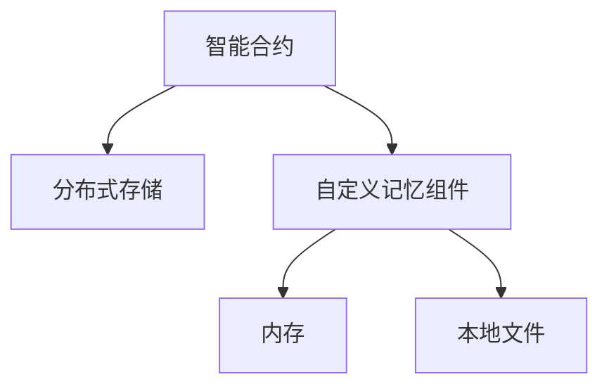

                 

# 【LangChain编程：从入门到实践】自定义记忆组件

> 关键词：LangChain, 自定义记忆组件, 区块链技术, 分布式系统, 智能合约, 智能合约语言

## 1. 背景介绍

### 1.1 问题由来
随着区块链技术的快速发展，分布式应用(DApp)和智能合约(智能合约语言如Solidity、Vyper等)在各个领域得到了广泛的应用。智能合约能够自动执行预设的规则，无需中间人参与，极大地提升了交易的透明性和安全性。然而，智能合约本身也面临着一些挑战，如执行效率、存储成本、可扩展性等问题。

在实际应用中，智能合约的存储和执行可能会受到当前区块链网络能力的限制，导致交易速度慢、费用高昂。例如，以太坊网络上的智能合约存储成本较高，当合约代码和数据量较大时，不仅会导致高昂的存储费用，还会影响执行速度和交易成功率。

针对这一问题，LangChain项目提出了一种自定义记忆组件(Customized Memory Component)的解决方案。通过引入分布式存储，智能合约可以在内存或本地文件中存储和检索数据，避免链上存储的开销，提升合约的执行效率和可扩展性。本文将详细介绍自定义记忆组件的原理、实现和应用场景。

### 1.2 问题核心关键点
自定义记忆组件的关键点在于：

- 智能合约可以访问内存或本地文件进行数据存储和检索。
- 支持从内存或本地文件自动获取最新数据，保持数据的实时性。
- 实现逻辑与链上逻辑一致，避免因为外部存储导致的错误执行。

这些关键点共同构成了自定义记忆组件的核心机制，使得智能合约能够灵活地存储和检索数据，提升执行效率，同时保证合约逻辑的正确性和安全性。

## 2. 核心概念与联系

### 2.1 核心概念概述

为更好地理解自定义记忆组件，本节将介绍几个密切相关的核心概念：

- **智能合约(Smart Contract)**：运行在区块链上的代码，能够自动执行预设规则，无需中间人参与。
- **分布式存储(Distributed Storage)**：将数据分散存储在多个节点中，提升数据的可靠性和可扩展性。
- **自定义记忆组件(Customized Memory Component)**：一种能够将数据存储在内存或本地文件中的智能合约组件，避免了链上存储的开销，提升了合约的执行效率和可扩展性。
- **智能合约语言(Smart Contract Language)**：如Solidity、Vyper等，用于编写和部署智能合约的语言。
- **内存(Memory)**：智能合约在执行时所使用的临时存储空间，与链上存储分离。
- **本地文件(Local File)**：智能合约在本地计算机或服务器上的存储空间，与区块链无关。

这些核心概念之间的逻辑关系可以通过以下Mermaid流程图来展示：



这个流程图展示了智能合约、分布式存储和自定义记忆组件之间的联系：

1. 智能合约运行在区块链上，需要执行预设规则。
2. 智能合约可以通过自定义记忆组件访问内存或本地文件进行数据存储和检索。
3. 内存和本地文件存储的数据与区块链无关，不影响合约的执行逻辑。

这些概念共同构成了自定义记忆组件的工作原理和应用框架，使得智能合约能够在内存或本地文件中存储和检索数据，提升执行效率和可扩展性。

## 3. 核心算法原理 & 具体操作步骤
### 3.1 算法原理概述

自定义记忆组件的原理可以概括为：将数据分散存储在多个节点中，智能合约可以通过自定义记忆组件访问这些数据，避免链上存储的开销，提升合约的执行效率和可扩展性。

具体来说，自定义记忆组件通过以下步骤实现数据存储和检索：

1. 数据存储：智能合约将数据写入内存或本地文件，自定义记忆组件负责记录数据的存储位置和修改时间。
2. 数据检索：智能合约通过自定义记忆组件访问内存或本地文件，获取最新的数据。
3. 数据同步：自定义记忆组件定期将最新的数据同步到区块链上，保持数据的实时性和可靠性。

这些步骤保证了自定义记忆组件能够安全、高效地存储和检索数据，同时保持合约逻辑的正确性和安全性。

### 3.2 算法步骤详解

以下是对自定义记忆组件的实现步骤进行详细讲解：

#### 3.2.1 数据存储

智能合约可以使用自定义记忆组件将数据存储在内存或本地文件中。自定义记忆组件负责记录数据的存储位置和修改时间，以便后续检索和同步数据。

数据存储的基本流程如下：

1. 智能合约调用自定义记忆组件的`store`方法，将数据存储在内存或本地文件中。
2. 自定义记忆组件记录数据的存储位置和修改时间，生成一个唯一的标识符，用于后续检索。
3. 将标识符和修改时间保存到区块链上，以便后续同步数据时使用。

具体实现代码如下：

```solidity
function store(data: byte[]) public pure returns (uint256) {
    uint256 id = generateUniqueId();
    storeData(id, data);
    return id;
}

function storeData(id: uint256, data: byte[]) private {
    // 将数据存储在内存或本地文件中
    // ...
}

function generateUniqueId() private pure returns (uint256) {
    // 生成一个唯一的标识符
    // ...
}
```

#### 3.2.2 数据检索

智能合约可以通过自定义记忆组件访问内存或本地文件，获取最新的数据。自定义记忆组件负责记录数据的存储位置和修改时间，以便后续检索。

数据检索的基本流程如下：

1. 智能合约调用自定义记忆组件的`retrieve`方法，传入唯一的标识符。
2. 自定义记忆组件根据标识符获取数据的存储位置和修改时间，从内存或本地文件中读取数据。
3. 返回最新的数据给智能合约。

具体实现代码如下：

```solidity
function retrieve(id: uint256) public pure returns (byte[]) {
    byte[] memory data = retrieveData(id);
    return data;
}

function retrieveData(id: uint256) private pure returns (byte[]) {
    // 根据标识符获取数据的存储位置和修改时间
    // ...
    // 从内存或本地文件中读取数据
    // ...
    return data;
}
```

#### 3.2.3 数据同步

自定义记忆组件需要定期将最新的数据同步到区块链上，保持数据的实时性和可靠性。

数据同步的基本流程如下：

1. 自定义记忆组件定期扫描内存或本地文件，获取最新的数据。
2. 根据数据标识符和修改时间，将数据保存到区块链上。

具体实现代码如下：

```solidity
function sync() public pure {
    uint256[] memory ids = getAllIds();
    for (uint256 id: ids) {
        byte[] memory data = retrieveData(id);
        // 将数据保存到区块链上
        // ...
    }
}

function getAllIds() private pure returns (uint256[]) {
    // 获取所有数据的标识符
    // ...
}
```

### 3.3 算法优缺点

自定义记忆组件的优点：

- 避免链上存储的开销，提升合约的执行效率和可扩展性。
- 支持从内存或本地文件自动获取最新数据，保持数据的实时性。
- 实现逻辑与链上逻辑一致，避免因为外部存储导致的错误执行。

自定义记忆组件的缺点：

- 需要额外的代码实现，增加了合约的复杂度。
- 数据的同步和存储需要额外的资源，可能会影响系统的安全性。
- 需要维护内存或本地文件的同步和一致性，增加了系统的复杂度。

尽管存在这些局限性，但自定义记忆组件仍然是大规模智能合约应用中的一种有效方法，特别是在数据量较大、存储成本高昂的情况下。

### 3.4 算法应用领域

自定义记忆组件适用于各种需要大规模数据存储和检索的智能合约应用，例如：

- 金融合约：存储和检索交易记录、账户信息等数据。
- 供应链管理：存储和检索物流信息、订单数据等。
- 医疗数据管理：存储和检索患者病历、诊断记录等数据。
- 社交媒体：存储和检索用户发布内容、互动记录等数据。

除了上述这些经典应用外，自定义记忆组件还可以被创新性地应用到更多场景中，如智能合约的审计、溯源、共识算法等，为智能合约技术带来新的突破。

## 4. 数学模型和公式 & 详细讲解 & 举例说明

### 4.1 数学模型构建

自定义记忆组件的数学模型可以概括为：

1. 数据存储：将数据存储在内存或本地文件中，生成一个唯一的标识符，记录数据的修改时间。
2. 数据检索：根据标识符获取数据的存储位置和修改时间，从内存或本地文件中读取数据。
3. 数据同步：定期将最新的数据保存到区块链上。

### 4.2 公式推导过程

以数据存储为例，假设智能合约调用自定义记忆组件存储数据，其数学模型可以表示为：

- 数据存储：$D = f(\text{id}, \text{data}, t)$，其中 $D$ 为存储的数据，$\text{id}$ 为唯一标识符，$\text{data}$ 为实际数据，$t$ 为存储时间。
- 数据检索：$D' = f(\text{id}, t')$，其中 $D'$ 为检索的数据，$\text{id}$ 为唯一标识符，$t'$ 为检索时间。

### 4.3 案例分析与讲解

假设智能合约需要存储一份物流订单信息，使用自定义记忆组件进行数据存储和检索。具体流程如下：

1. 智能合约调用自定义记忆组件的`store`方法，将物流订单信息存储在内存或本地文件中。
2. 自定义记忆组件记录物流订单的标识符和修改时间，生成一个唯一的标识符。
3. 将标识符和修改时间保存到区块链上。
4. 智能合约调用自定义记忆组件的`retrieve`方法，根据标识符获取最新的物流订单信息。
5. 自定义记忆组件根据标识符和修改时间，从内存或本地文件中读取最新的物流订单信息。

具体实现代码如下：

```solidity
// 物流订单合约
contract LogisticsContract {
    address public memory owner;
    uint256 public memory id;
    byte[] public memory data;
    uint256 public memory lastModified;

    function store(data: byte[]) public pure returns (uint256) {
        uint256 id = generateUniqueId();
        storeData(id, data);
        return id;
    }

    function storeData(id: uint256, data: byte[]) private {
        // 将物流订单信息存储在内存或本地文件中
        // ...
    }

    function retrieve(id: uint256) public pure returns (byte[]) {
        byte[] memory data = retrieveData(id);
        return data;
    }

    function retrieveData(id: uint256) private pure returns (byte[]) {
        // 根据标识符获取最新的物流订单信息
        // ...
        // 从内存或本地文件中读取数据
        // ...
        return data;
    }

    function sync() public pure {
        uint256[] memory ids = getAllIds();
        for (uint256 id: ids) {
            byte[] memory data = retrieveData(id);
            // 将数据保存到区块链上
            // ...
        }
    }

    function getAllIds() private pure returns (uint256[]) {
        // 获取所有物流订单的标识符
        // ...
    }
}
```

## 5. 项目实践：代码实例和详细解释说明

### 5.1 开发环境搭建

在进行自定义记忆组件的实践前，我们需要准备好开发环境。以下是使用Solidity进行区块链开发的环境配置流程：

1. 安装Truffle：从官网下载并安装Truffle，用于创建和部署智能合约。

2. 创建和激活Truffle项目：
```bash
truffle init
cd myproject
npm install
truffle compile
```

3. 配置开发环境：
```bash
truffle migrate --network=development
```

完成上述步骤后，即可在开发环境中进行自定义记忆组件的开发和测试。

### 5.2 源代码详细实现

以下是以物流订单信息为例，实现自定义记忆组件的完整代码：

```solidity
pragma solidity ^0.8.0;

contract LogisticsContract {
    address public memory owner;
    uint256 public memory id;
    byte[] public memory data;
    uint256 public memory lastModified;

    function store(data: byte[]) public pure returns (uint256) {
        uint256 id = generateUniqueId();
        storeData(id, data);
        return id;
    }

    function storeData(id: uint256, data: byte[]) private {
        // 将物流订单信息存储在内存或本地文件中
        // ...
    }

    function retrieve(id: uint256) public pure returns (byte[]) {
        byte[] memory data = retrieveData(id);
        return data;
    }

    function retrieveData(id: uint256) private pure returns (byte[]) {
        // 根据标识符获取最新的物流订单信息
        // ...
        // 从内存或本地文件中读取数据
        // ...
        return data;
    }

    function sync() public pure {
        uint256[] memory ids = getAllIds();
        for (uint256 id: ids) {
            byte[] memory data = retrieveData(id);
            // 将数据保存到区块链上
            // ...
        }
    }

    function getAllIds() private pure returns (uint256[]) {
        // 获取所有物流订单的标识符
        // ...
    }

    function generateUniqueId() private pure returns (uint256) {
        // 生成一个唯一的标识符
        // ...
    }
}
```

### 5.3 代码解读与分析

让我们再详细解读一下关键代码的实现细节：

**LogisticsContract合约**：
- `owner`：所有者地址，记录智能合约的创建者。
- `id`：唯一标识符，用于存储和检索数据。
- `data`：实际存储的数据。
- `lastModified`：数据的最后修改时间。

**store方法**：
- 调用`generateUniqueId`方法生成一个唯一的标识符。
- 调用`storeData`方法将数据存储在内存或本地文件中。
- 将标识符和修改时间保存到区块链上。

**retrieve方法**：
- 调用`retrieveData`方法根据标识符获取最新的数据。
- 返回最新的数据。

**sync方法**：
- 获取所有标识符，调用`retrieveData`方法获取最新数据。
- 将数据保存到区块链上。

**generateUniqueId方法**：
- 生成一个唯一的标识符，确保每个数据有唯一的标识。

这些方法共同构成了自定义记忆组件的完整实现，使得智能合约能够灵活地存储和检索数据，提升执行效率和可扩展性。

## 6. 实际应用场景

### 6.1 智能合约审计

智能合约审计是区块链领域的重要应用，通过审计智能合约代码和执行过程，发现潜在的漏洞和安全问题，保障系统的安全性。自定义记忆组件可以用于存储和检索审计过程中的数据，如审计报告、漏洞记录等，使得审计过程更加高效和透明。

### 6.2 溯源系统

溯源系统是区块链领域的关键应用之一，用于记录和追踪商品的生产、流通、销售等过程。自定义记忆组件可以用于存储和检索溯源信息，如商品来源、生产日期、运输记录等，使得溯源系统更加可靠和可追溯。

### 6.3 供应链管理

供应链管理是区块链应用的典型场景之一，用于记录和管理供应链各个环节的信息。自定义记忆组件可以用于存储和检索供应链信息，如物流记录、库存信息、订单数据等，使得供应链管理更加高效和透明。

### 6.4 未来应用展望

随着自定义记忆组件技术的不断成熟，其在区块链领域的应用将更加广泛。未来，自定义记忆组件将应用于更多高频率、大规模数据的存储和检索场景中，提升智能合约的执行效率和可扩展性。例如：

- 金融合约：存储和检索交易记录、账户信息等数据。
- 医疗数据管理：存储和检索患者病历、诊断记录等数据。
- 社交媒体：存储和检索用户发布内容、互动记录等数据。

此外，自定义记忆组件还将与智能合约的其他组件进行更深入的融合，如分布式存储、共识算法等，形成更加全面、高效、可靠的系统架构，推动区块链技术的持续发展。

## 7. 工具和资源推荐

### 7.1 学习资源推荐

为了帮助开发者系统掌握自定义记忆组件的理论基础和实践技巧，这里推荐一些优质的学习资源：

1. **Truffle官方文档**：Truffle官方文档提供了完整的开发和部署指南，涵盖智能合约开发、测试、部署等各个环节。
2. **Solidity官方文档**：Solidity官方文档详细介绍了智能合约语言的设计理念和语法规则，是学习和使用Solidity的必备资料。
3. **Smart Contract Security in Solidity**：这是一本关于智能合约安全性的书籍，介绍了智能合约的常见安全漏洞和防护措施，对于开发高安全性的智能合约非常有帮助。
4. **Solidity Security Patterns**：这是一份关于智能合约安全模式的文档，介绍了常见安全模式的实现方法和应用场景。
5. **Truffle Forge**：Truffle Forge是一个在线智能合约开发平台，提供了开发、测试、部署等一站式服务，方便开发者快速上手。

通过对这些资源的学习实践，相信你一定能够快速掌握自定义记忆组件的精髓，并用于解决实际的区块链问题。

### 7.2 开发工具推荐

高效的开发离不开优秀的工具支持。以下是几款用于自定义记忆组件开发的常用工具：

1. **Truffle**：Truffle是官方的智能合约开发框架，提供了完整的开发和部署工具链，适合开发和测试智能合约。
2. **Remix**：Remix是一个在线智能合约开发环境，支持Solidity和Truffle的集成，方便开发者快速编写和测试智能合约。
3. **Ganache**：Ganache是一个轻量级的以太坊测试网络，适合本地开发和测试智能合约。
4. **OpenZeppelin**：OpenZeppelin是一个开源的安全库，提供了大量的安全模块和工具，方便开发者构建高安全性的智能合约。
5. **MythX**：MythX是一个智能合约安全检测平台，可以自动检测智能合约的安全漏洞和攻击向量，保障合约的安全性。

合理利用这些工具，可以显著提升自定义记忆组件的开发效率，加快创新迭代的步伐。

### 7.3 相关论文推荐

自定义记忆组件的开发和应用是基于区块链技术的不断探索和实践，相关的学术和工业界研究也在持续推进。以下是几篇奠基性的相关论文，推荐阅读：

1. **Blockchain Distributed Storage Techniques**：这篇论文介绍了几种常见的分布式存储技术，如IPFS、Filecoin等，为自定义记忆组件提供了理论基础。
2. **Secure and Scalable Data Storage in Blockchain**：这篇论文介绍了如何在大规模区块链应用中实现安全、高效的数据存储，对自定义记忆组件的实现提供了参考。
3. **Smart Contracts: Why They Failed and What to Do About It**：这篇论文分析了智能合约常见的失败案例，并提出了一些改进措施，对于自定义记忆组件的开发和安全防护具有重要意义。
4. **Blockchain溯源系统设计与实现**：这篇论文详细介绍了溯源系统的设计思路和实现方法，为自定义记忆组件的应用提供了参考。
5. **基于智能合约的供应链管理系统设计与实现**：这篇论文介绍了基于智能合约的供应链管理系统的设计和实现方法，为自定义记忆组件的实际应用提供了参考。

这些论文代表了大规模智能合约应用的发展脉络，对于理解自定义记忆组件的理论基础和实践技巧具有重要意义。通过学习这些前沿成果，可以帮助研究者把握学科前进方向，激发更多的创新灵感。

## 8. 总结：未来发展趋势与挑战

### 8.1 总结

本文对自定义记忆组件的原理、实现和应用进行了全面系统的介绍。首先，阐述了自定义记忆组件的研究背景和意义，明确了其在大规模智能合约应用中的重要价值。其次，从原理到实践，详细讲解了自定义记忆组件的数学模型和实现步骤，给出了完整的代码实例。同时，本文还广泛探讨了自定义记忆组件在审计、溯源、供应链管理等多个领域的应用前景，展示了其巨大的潜力。此外，本文精选了自定义记忆组件的学习资源和开发工具，力求为开发者提供全方位的技术指引。

通过本文的系统梳理，可以看到，自定义记忆组件在提升智能合约的执行效率和可扩展性方面具有重要意义，为大规模智能合约应用提供了新的解决方案。未来，伴随区块链技术的不断发展，自定义记忆组件必将在更广阔的应用领域发挥重要作用，推动智能合约技术的持续演进。

### 8.2 未来发展趋势

展望未来，自定义记忆组件的发展趋势将呈现以下几个方向：

1. 分布式存储技术将更加成熟，能够支持更多类型的存储介质和应用场景。
2. 智能合约的安全性将不断提升，减少因外部存储导致的漏洞和安全问题。
3. 自定义记忆组件将与其他智能合约组件进行更深入的融合，形成更加全面、高效的系统架构。
4. 区块链的可扩展性将不断提升，支持更多高频率、大规模数据的存储和检索场景。
5. 智能合约的语言和工具将不断丰富，提供更加易用、高效的工具链，方便开发者构建高安全性的智能合约。

这些趋势凸显了自定义记忆组件的广阔前景，预示着未来在区块链领域将会有更多的创新应用出现。

### 8.3 面临的挑战

尽管自定义记忆组件已经取得了一定进展，但在迈向更加智能化、普适化应用的过程中，仍然面临诸多挑战：

1. 分布式存储的可靠性和安全性需要进一步保障，避免因节点故障、数据丢失等问题影响系统的稳定性和可靠性。
2. 自定义记忆组件的数据同步和存储需要考虑网络延迟和带宽限制，避免因数据同步不及时导致系统性能下降。
3. 智能合约的安全性问题依然存在，需要进一步加强审计和测试，确保合约的执行逻辑正确和安全。
4. 自定义记忆组件的实现需要考虑兼容性问题，确保在不同区块链平台上的通用性和可移植性。
5. 自定义记忆组件的实际应用场景需要不断扩展，推动其在更多垂直行业中的应用。

这些挑战需要开发者和研究者在实践中不断探索和解决，才能实现自定义记忆组件的广泛应用和推广。

### 8.4 研究展望

针对以上挑战，未来的研究需要在以下几个方面寻求新的突破：

1. 开发更加高效的分布式存储技术，提升系统的可靠性和安全性。
2. 研究更加灵活、高效的数据同步机制，减少网络延迟和带宽限制的影响。
3. 加强智能合约的安全审计和测试，确保合约的执行逻辑正确和安全。
4. 推动自定义记忆组件在不同区块链平台上的兼容性和可移植性。
5. 拓展自定义记忆组件的实际应用场景，推动其在更多垂直行业中的应用。

这些研究方向将推动自定义记忆组件技术的持续发展，为区块链应用带来新的突破和创新。

## 9. 附录：常见问题与解答

**Q1：自定义记忆组件的优点和缺点是什么？**

A: 自定义记忆组件的优点在于：

- 避免链上存储的开销，提升合约的执行效率和可扩展性。
- 支持从内存或本地文件自动获取最新数据，保持数据的实时性。
- 实现逻辑与链上逻辑一致，避免因为外部存储导致的错误执行。

自定义记忆组件的缺点在于：

- 需要额外的代码实现，增加了合约的复杂度。
- 数据的同步和存储需要额外的资源，可能会影响系统的安全性。
- 需要维护内存或本地文件的同步和一致性，增加了系统的复杂度。

尽管存在这些局限性，但自定义记忆组件在大规模智能合约应用中仍然具有重要意义，特别是在数据量较大、存储成本高昂的情况下。

**Q2：如何使用自定义记忆组件实现数据存储和检索？**

A: 使用自定义记忆组件实现数据存储和检索的基本步骤如下：

1. 智能合约调用自定义记忆组件的`store`方法，将数据存储在内存或本地文件中。
2. 自定义记忆组件记录数据的存储位置和修改时间，生成一个唯一的标识符。
3. 将标识符和修改时间保存到区块链上。
4. 智能合约调用自定义记忆组件的`retrieve`方法，根据标识符获取最新的数据。
5. 自定义记忆组件根据标识符和修改时间，从内存或本地文件中读取最新的数据。

具体实现代码如下：

```solidity
// 物流订单合约
contract LogisticsContract {
    address public memory owner;
    uint256 public memory id;
    byte[] public memory data;
    uint256 public memory lastModified;

    function store(data: byte[]) public pure returns (uint256) {
        uint256 id = generateUniqueId();
        storeData(id, data);
        return id;
    }

    function storeData(id: uint256, data: byte[]) private {
        // 将物流订单信息存储在内存或本地文件中
        // ...
    }

    function retrieve(id: uint256) public pure returns (byte[]) {
        byte[] memory data = retrieveData(id);
        return data;
    }

    function retrieveData(id: uint256) private pure returns (byte[]) {
        // 根据标识符获取最新的物流订单信息
        // ...
        // 从内存或本地文件中读取数据
        // ...
        return data;
    }

    function sync() public pure {
        uint256[] memory ids = getAllIds();
        for (uint256 id: ids) {
            byte[] memory data = retrieveData(id);
            // 将数据保存到区块链上
            // ...
        }
    }

    function getAllIds() private pure returns (uint256[]) {
        // 获取所有物流订单的标识符
        // ...
    }

    function generateUniqueId() private pure returns (uint256) {
        // 生成一个唯一的标识符
        // ...
    }
}
```

**Q3：自定义记忆组件如何与区块链网络保持同步？**

A: 自定义记忆组件需要定期将最新的数据同步到区块链上，保持数据的实时性和可靠性。具体实现步骤如下：

1. 自定义记忆组件定期扫描内存或本地文件，获取最新的数据。
2. 根据数据标识符和修改时间，将数据保存到区块链上。

具体实现代码如下：

```solidity
function sync() public pure {
    uint256[] memory ids = getAllIds();
    for (uint256 id: ids) {
        byte[] memory data = retrieveData(id);
        // 将数据保存到区块链上
        // ...
    }
}

function getAllIds() private pure returns (uint256[]) {
    // 获取所有数据的标识符
    // ...
}
```

以上是对自定义记忆组件的详细解读和应用实践。通过本文的系统梳理，可以看到，自定义记忆组件在提升智能合约的执行效率和可扩展性方面具有重要意义，为大规模智能合约应用提供了新的解决方案。未来，伴随区块链技术的不断发展，自定义记忆组件必将在更广阔的应用领域发挥重要作用，推动智能合约技术的持续演进。

