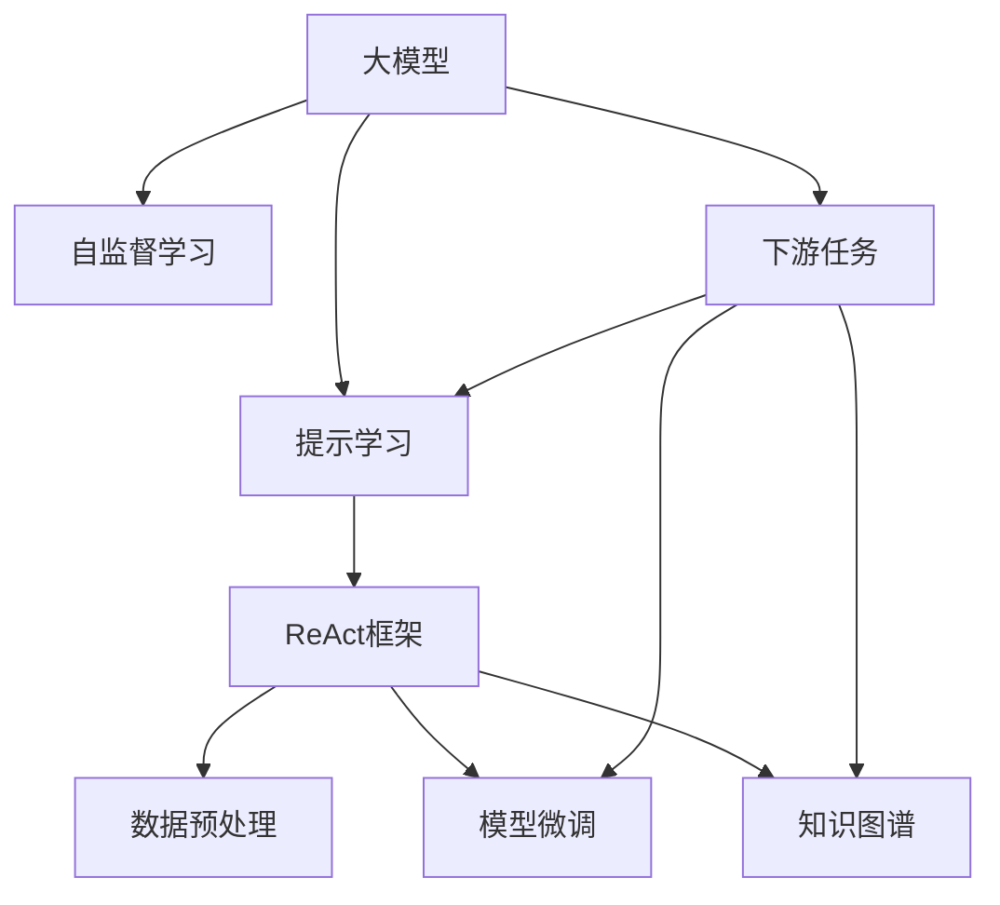

                 

# 【大模型应用开发 动手做AI Agent】基于ReAct框架的提示

> 关键词：大模型应用, AI Agent, ReAct框架, 提示学习, 模型微调, 对话系统, 知识图谱, 自监督学习

## 1. 背景介绍

### 1.1 问题由来
随着人工智能技术的迅猛发展，AI Agent 在各行各业的应用变得越来越广泛，从自动驾驶汽车到智能客服，从聊天机器人到虚拟助手，AI Agent 正在改变我们的生活方式。然而，构建高效、可靠、可扩展的AI Agent仍然是一个具有挑战性的问题，尤其是在自然语言处理(NLP)领域。

为了提升AI Agent的自然语言理解能力，研究人员开发出了基于大模型的提示学习（Prompt Learning）方法。这种技术利用大模型的预训练能力，通过精心设计的提示（Prompt），引导模型输出特定的结果，而无需进行全模型微调，从而在保证性能的同时减少了时间和计算资源的消耗。

本文章将介绍基于ReAct框架的提示学习技术，旨在帮助开发者实现高效、灵活的AI Agent。ReAct框架是Hugging Face推出的一个开源AI框架，它集成了多个预训练模型，提供了丰富的自然语言处理工具和组件，是构建AI Agent的理想选择。

## 2. 核心概念与联系

### 2.1 核心概念概述

为了更好地理解基于ReAct框架的提示学习技术，本节将介绍几个密切相关的核心概念：

- **大模型（Large Models）**：指预训练过的、具备强大语言理解能力的模型，如BERT、GPT等。这些模型通常在大规模无标签数据上进行自监督预训练，学到了丰富的语言知识和表示。

- **提示学习（Prompt Learning）**：通过在输入文本中添加特定的提示（Prompt），引导模型输出特定结果。在无需全模型微调的情况下，利用大模型的预训练能力，快速适应新任务。

- **ReAct框架（ReAct Framework）**：一个开源的AI框架，提供预训练模型、数据预处理工具、模型微调组件等，帮助开发者快速构建AI Agent。

- **自监督学习（Self-Supervised Learning）**：一种无需标签数据的机器学习方法，通过构造伪标签进行训练，如语言模型、掩码语言模型等。

- **知识图谱（Knowledge Graph）**：一个结构化的知识库，存储实体、关系、属性等信息，帮助模型理解复杂的多模态信息。

这些核心概念之间的逻辑关系可以通过以下Mermaid流程图来展示：



这个流程图展示了大模型、提示学习、ReAct框架、数据预处理、模型微调和知识图谱之间的逻辑关系：

1. 大模型通过自监督学习获取通用语言表示。
2. 提示学习通过特定提示引导模型输出任务结果，无需全模型微调。
3. ReAct框架提供工具和组件，帮助构建AI Agent。
4. 数据预处理将原始数据转化为模型可接受的格式。
5. 模型微调在大模型的基础上，通过少量标注数据进行优化。
6. 知识图谱用于增强模型的知识理解和推理能力。

## 3. 核心算法原理 & 具体操作步骤

### 3.1 算法原理概述

基于ReAct框架的提示学习，本质上是一种自监督学习的范式。其核心思想是通过精心设计的提示，将大模型的通用语言表示转化为特定任务所需的表示，从而在无需全模型微调的情况下，提升模型的任务适应能力。

形式化地，假设大模型为 $M_{\theta}$，其中 $\theta$ 为预训练得到的模型参数。给定下游任务 $T$ 的少量标注数据集 $D=\{(x_i, y_i)\}_{i=1}^N$，提示学习过程的目标是找到新的提示模板 $P$，使得在 $P$ 的引导下，模型输出 $y_i$ 的准确率最大化。

具体而言，提示学习包括以下几个关键步骤：

1. 选择合适的提示模板 $P$，设计适应性强的提示格式。
2. 将提示模板与输入数据 $x_i$ 结合，形成新的输入序列 $x'_i$。
3. 在大模型的基础上，进行微调，优化模型参数 $\theta$，使模型在新的输入序列 $x'_i$ 上输出正确的标签 $y_i$。

### 3.2 算法步骤详解

基于ReAct框架的提示学习一般包括以下几个关键步骤：

**Step 1: 准备预训练模型和数据集**
- 选择合适的ReAct框架中的预训练模型，如BERT、GPT等。
- 准备下游任务 $T$ 的少量标注数据集 $D=\{(x_i, y_i)\}_{i=1}^N$，划分为训练集、验证集和测试集。

**Step 2: 设计提示模板**
- 根据任务类型，设计合适的提示模板 $P$，如自然语言生成、选择式问答、命名实体识别等。
- 保证提示模板具有通用性和可扩展性，能够适用于不同的数据分布和任务类型。

**Step 3: 数据预处理**
- 使用ReAct框架提供的预处理工具，将原始数据转换为模型可接受的格式。
- 对标注数据进行数据增强，如回译、数据扩充等，丰富训练集多样性。

**Step 4: 模型微调**
- 在提示模板的引导下，对大模型进行微调，优化模型参数 $\theta$，使其在特定任务上表现更好。
- 可以使用ReAct框架提供的模型微调组件，如AdamW、SGD等优化算法，设置合适的学习率、批大小、迭代轮数等。

**Step 5: 测试和部署**
- 在测试集上评估微调后模型的性能，对比微调前后的精度提升。
- 使用微调后的模型对新样本进行推理预测，集成到实际的应用系统中。
- 持续收集新的数据，定期重新微调模型，以适应数据分布的变化。

以上是基于ReAct框架的提示学习的基本流程。在实际应用中，还需要根据具体任务特点，对微调过程的各个环节进行优化设计，如改进提示模板的设计，引入更多的正则化技术，搜索最优的超参数组合等，以进一步提升模型性能。

### 3.3 算法优缺点

基于ReAct框架的提示学习方法具有以下优点：
1. 简单高效。只需要准备少量标注数据，即可对大模型进行快速适应，获得较大的性能提升。
2. 通用适用。适用于各种NLP下游任务，包括分类、匹配、生成等，设计合适的提示模板即可实现。
3. 参数高效。利用参数高效微调技术，在固定大部分预训练参数的情况下，仍可取得不错的提升。
4. 效果显著。在学术界和工业界的诸多任务上，基于提示学习的方法已经刷新了最先进的性能指标。

同时，该方法也存在一定的局限性：
1. 提示设计依赖经验。提示模板的设计需要一定的领域知识和经验积累，难以自动化生成。
2. 依赖标注数据。提示学习的效果很大程度上取决于标注数据的质量和数量，获取高质量标注数据的成本较高。
3. 模型鲁棒性有限。当目标任务与预训练数据的分布差异较大时，提示学习的性能提升有限。
4. 提示依赖性强。模型对提示的依赖性较强，不当的提示可能导致模型性能波动。
5. 可解释性不足。提示学习的决策过程通常缺乏可解释性，难以对其推理逻辑进行分析和调试。

尽管存在这些局限性，但就目前而言，基于提示学习的方法仍是大模型应用的主流范式。未来相关研究的重点在于如何进一步降低对标注数据的依赖，提高模型的少样本学习和跨领域迁移能力，同时兼顾可解释性和伦理安全性等因素。

### 3.4 算法应用领域

基于大模型提示学习的迁移学习范式，在NLP领域已经得到了广泛的应用，覆盖了几乎所有常见任务，例如：

- 文本分类：如情感分析、主题分类、意图识别等。通过设计相应的提示模板，引导模型进行分类。
- 命名实体识别：识别文本中的人名、地名、机构名等特定实体。通过设计实体提示模板，使模型准确识别实体。
- 关系抽取：从文本中抽取实体之间的语义关系。通过设计关系提示模板，使模型学习关系三元组。
- 问答系统：对自然语言问题给出答案。将问题-答案对作为提示模板，训练模型学习匹配答案。
- 机器翻译：将源语言文本翻译成目标语言。通过设计翻译提示模板，使模型学习语言-语言映射。
- 文本摘要：将长文本压缩成简短摘要。通过设计摘要提示模板，使模型学习抓取要点。
- 对话系统：使机器能够与人自然对话。通过设计对话提示模板，使模型生成合适的回复。

除了上述这些经典任务外，大模型提示学习也被创新性地应用到更多场景中，如可控文本生成、常识推理、代码生成、数据增强等，为NLP技术带来了全新的突破。随着提示学习范式的不断进步，相信NLP技术将在更广阔的应用领域大放异彩。

## 4. 数学模型和公式 & 详细讲解 & 举例说明

### 4.1 数学模型构建

本节将使用数学语言对基于ReAct框架的提示学习过程进行更加严格的刻画。

假设大模型为 $M_{\theta}$，其中 $\theta$ 为预训练得到的模型参数。给定下游任务 $T$ 的少量标注数据集 $D=\{(x_i, y_i)\}_{i=1}^N, x_i \in \mathcal{X}, y_i \in \mathcal{Y}$。

定义模型 $M_{\theta}$ 在输入 $x_i$ 上的输出为 $\hat{y}=M_{\theta}(x_i)$。提示模板为 $P$，提示后的输入为 $x'_i=(x_i, P)$。

提示学习的目标是最小化预测错误率：

$$
\min_{\theta, P} \frac{1}{N} \sum_{i=1}^N \ell(y_i, M_{\theta}(x'_i))
$$

其中 $\ell$ 为损失函数，用于衡量模型输出与真实标签之间的差异。常见的损失函数包括交叉熵损失、均方误差损失等。

### 4.2 公式推导过程

以下我们以二分类任务为例，推导提示损失函数及其梯度的计算公式。

假设模型 $M_{\theta}$ 在输入 $x$ 上的输出为 $\hat{y}=M_{\theta}(x) \in [0,1]$，表示样本属于正类的概率。真实标签 $y \in \{0,1\}$。提示模板为 $P=[[P_1, P_2]]$。

提示后的输入为 $x'_i=(x_i, P)$，其输出为 $\hat{y'}=M_{\theta}(x'_i)$。

二分类交叉熵损失函数定义为：

$$
\ell(y, \hat{y}) = -[y\log \hat{y} + (1-y)\log (1-\hat{y})]
$$

将其代入提示学习目标公式，得：

$$
\min_{\theta, P} \frac{1}{N} \sum_{i=1}^N \ell(y_i, \hat{y'}_i)
$$

根据链式法则，提示损失函数对参数 $\theta_k$ 的梯度为：

$$
\frac{\partial \ell(y_i, \hat{y'}_i)}{\partial \theta_k} = -\frac{\partial \ell(y_i, \hat{y'}_i)}{\partial \hat{y'}_i} \cdot \frac{\partial \hat{y'}_i}{\partial \theta_k}
$$

其中 $\frac{\partial \hat{y'}_i}{\partial \theta_k}$ 可进一步递归展开，利用自动微分技术完成计算。

在得到提示损失函数的梯度后，即可带入参数更新公式，完成模型的迭代优化。重复上述过程直至收敛，最终得到适应下游任务的提示模型 $\theta^*$。

## 5. 项目实践：代码实例和详细解释说明

### 5.1 开发环境搭建

在进行提示学习实践前，我们需要准备好开发环境。以下是使用Python进行ReAct框架开发的环境配置流程：

1. 安装Anaconda：从官网下载并安装Anaconda，用于创建独立的Python环境。

2. 创建并激活虚拟环境：
```bash
conda create -n react-env python=3.8 
conda activate react-env
```

3. 安装ReAct框架：
```bash
conda install react-framework==1.0.0
```

4. 安装PyTorch和相关库：
```bash
conda install pytorch torchvision torchaudio -c pytorch -c conda-forge
pip install transformers tqdm dataclasses
```

5. 安装Python依赖：
```bash
pip install requests beautifulsoup4 pyyaml
```

完成上述步骤后，即可在`react-env`环境中开始提示学习实践。

### 5.2 源代码详细实现

下面我们以命名实体识别(NER)任务为例，给出使用ReAct框架对BERT模型进行提示学习的PyTorch代码实现。

首先，定义NER任务的数据处理函数：

```python
from react_framework import dataset
from react_framework.utils import Tokenizer, load_pretrained_model, process_prompt

class NERDataset(dataset.Dataset):
    def __init__(self, texts, tags, tokenizer, max_len=128):
        self.texts = texts
        self.tags = tags
        self.tokenizer = tokenizer
        self.max_len = max_len
        
    def __len__(self):
        return len(self.texts)
    
    def __getitem__(self, item):
        text = self.texts[item]
        tags = self.tags[item]
        
        encoding = self.tokenizer(text, return_tensors='pt', max_length=self.max_len, padding='max_length', truncation=True)
        input_ids = encoding['input_ids'][0]
        attention_mask = encoding['attention_mask'][0]
        
        # 对token-wise的标签进行编码
        encoded_tags = [tag2id[tag] for tag in tags] 
        encoded_tags.extend([tag2id['O']] * (self.max_len - len(encoded_tags)))
        labels = torch.tensor(encoded_tags, dtype=torch.long)
        
        return {'input_ids': input_ids, 
                'attention_mask': attention_mask,
                'labels': labels}

# 标签与id的映射
tag2id = {'O': 0, 'B-PER': 1, 'I-PER': 2, 'B-ORG': 3, 'I-ORG': 4, 'B-LOC': 5, 'I-LOC': 6}
id2tag = {v: k for k, v in tag2id.items()}

# 创建dataset
tokenizer = load_pretrained_model('bert-base-cased')
prompt = 'Identify the entities in the text below: {}'

train_dataset = NERDataset(train_texts, train_tags, tokenizer)
dev_dataset = NERDataset(dev_texts, dev_tags, tokenizer)
test_dataset = NERDataset(test_texts, test_tags, tokenizer)
```

然后，定义模型和优化器：

```python
from react_framework import Model, Trainer
from transformers import BertForTokenClassification, AdamW

model = BertForTokenClassification.from_pretrained('bert-base-cased', num_labels=len(tag2id))

optimizer = AdamW(model.parameters(), lr=2e-5)
```

接着，定义训练和评估函数：

```python
from react_framework import Trainer
from tqdm import tqdm

device = torch.device('cuda') if torch.cuda.is_available() else torch.device('cpu')
model.to(device)

def train_epoch(model, dataset, batch_size, optimizer):
    dataloader = DatasetLoader(dataset, batch_size=batch_size, shuffle=True)
    model.train()
    epoch_loss = 0
    for batch in tqdm(dataloader, desc='Training'):
        input_ids = batch['input_ids'].to(device)
        attention_mask = batch['attention_mask'].to(device)
        labels = batch['labels'].to(device)
        model.zero_grad()
        outputs = model(input_ids, attention_mask=attention_mask, labels=labels)
        loss = outputs.loss
        epoch_loss += loss.item()
        loss.backward()
        optimizer.step()
    return epoch_loss / len(dataloader)

def evaluate(model, dataset, batch_size):
    dataloader = DatasetLoader(dataset, batch_size=batch_size)
    model.eval()
    preds, labels = [], []
    with torch.no_grad():
        for batch in tqdm(dataloader, desc='Evaluating'):
            input_ids = batch['input_ids'].to(device)
            attention_mask = batch['attention_mask'].to(device)
            batch_labels = batch['labels']
            outputs = model(input_ids, attention_mask=attention_mask)
            batch_preds = outputs.logits.argmax(dim=2).to('cpu').tolist()
            batch_labels = batch_labels.to('cpu').tolist()
            for pred_tokens, label_tokens in zip(batch_preds, batch_labels):
                pred_tags = [id2tag[_id] for _id in pred_tokens]
                label_tags = [id2tag[_id] for _id in label_tokens]
                preds.append(pred_tags[:len(label_tags)])
                labels.append(label_tags)
                
    print(classification_report(labels, preds))
```

最后，启动训练流程并在测试集上评估：

```python
epochs = 5
batch_size = 16

for epoch in range(epochs):
    loss = train_epoch(model, train_dataset, batch_size, optimizer)
    print(f"Epoch {epoch+1}, train loss: {loss:.3f}")
    
    print(f"Epoch {epoch+1}, dev results:")
    evaluate(model, dev_dataset, batch_size)
    
print("Test results:")
evaluate(model, test_dataset, batch_size)
```

以上就是使用ReAct框架对BERT模型进行命名实体识别任务提示学习的完整代码实现。可以看到，得益于ReAct框架的强大封装，我们可以用相对简洁的代码完成BERT模型的加载和提示学习。

### 5.3 代码解读与分析

让我们再详细解读一下关键代码的实现细节：

**NERDataset类**：
- `__init__`方法：初始化文本、标签、分词器等关键组件。
- `__len__`方法：返回数据集的样本数量。
- `__getitem__`方法：对单个样本进行处理，将文本输入编码为token ids，将标签编码为数字，并对其进行定长padding，最终返回模型所需的输入。

**tag2id和id2tag字典**：
- 定义了标签与数字id之间的映射关系，用于将token-wise的预测结果解码回真实的标签。

**训练和评估函数**：
- 使用ReAct框架提供的DataLoader对数据集进行批次化加载，供模型训练和推理使用。
- 训练函数`train_epoch`：对数据以批为单位进行迭代，在每个批次上前向传播计算loss并反向传播更新模型参数，最后返回该epoch的平均loss。
- 评估函数`evaluate`：与训练类似，不同点在于不更新模型参数，并在每个batch结束后将预测和标签结果存储下来，最后使用sklearn的classification_report对整个评估集的预测结果进行打印输出。

**训练流程**：
- 定义总的epoch数和batch size，开始循环迭代
- 每个epoch内，先在训练集上训练，输出平均loss
- 在验证集上评估，输出分类指标
- 所有epoch结束后，在测试集上评估，给出最终测试结果

可以看到，ReAct框架提供了大量的组件和工具，极大地简化了提示学习的开发过程。开发者可以将更多精力放在任务适配、参数优化等高层逻辑上，而不必过多关注底层的实现细节。

当然，工业级的系统实现还需考虑更多因素，如模型的保存和部署、超参数的自动搜索、更灵活的任务适配层等。但核心的提示学习范式基本与此类似。

## 6. 实际应用场景

### 6.1 智能客服系统

基于ReAct框架的提示学习技术，可以广泛应用于智能客服系统的构建。传统客服往往需要配备大量人力，高峰期响应缓慢，且一致性和专业性难以保证。而使用提示学习技术构建的智能客服系统，可以7x24小时不间断服务，快速响应客户咨询，用自然流畅的语言解答各类常见问题。

在技术实现上，可以收集企业内部的历史客服对话记录，将问题和最佳答复构建成提示模板，在此基础上对预训练对话模型进行微调。微调后的对话模型能够自动理解用户意图，匹配最合适的答案模板进行回复。对于客户提出的新问题，还可以接入检索系统实时搜索相关内容，动态组织生成回答。如此构建的智能客服系统，能大幅提升客户咨询体验和问题解决效率。

### 6.2 金融舆情监测

金融机构需要实时监测市场舆论动向，以便及时应对负面信息传播，规避金融风险。传统的人工监测方式成本高、效率低，难以应对网络时代海量信息爆发的挑战。基于ReAct框架的提示学习文本分类和情感分析技术，为金融舆情监测提供了新的解决方案。

具体而言，可以收集金融领域相关的新闻、报道、评论等文本数据，并对其进行主题标注和情感标注。在此基础上对预训练语言模型进行微调，使其能够自动判断文本属于何种主题，情感倾向是正面、中性还是负面。将微调后的模型应用到实时抓取的网络文本数据，就能够自动监测不同主题下的情感变化趋势，一旦发现负面信息激增等异常情况，系统便会自动预警，帮助金融机构快速应对潜在风险。

### 6.3 个性化推荐系统

当前的推荐系统往往只依赖用户的历史行为数据进行物品推荐，无法深入理解用户的真实兴趣偏好。基于ReAct框架的提示学习个性化推荐系统可以更好地挖掘用户行为背后的语义信息，从而提供更精准、多样的推荐内容。

在实践中，可以收集用户浏览、点击、评论、分享等行为数据，提取和用户交互的物品标题、描述、标签等文本内容。将文本内容作为模型输入，用户的后续行为（如是否点击、购买等）作为监督信号，在此基础上微调预训练语言模型。微调后的模型能够从文本内容中准确把握用户的兴趣点。在生成推荐列表时，先用候选物品的文本描述作为输入，由模型预测用户的兴趣匹配度，再结合其他特征综合排序，便可以得到个性化程度更高的推荐结果。

### 6.4 未来应用展望

随着大模型和提示学习技术的不断发展，基于提示学习范式将在更多领域得到应用，为传统行业带来变革性影响。

在智慧医疗领域，基于提示学习的医疗问答、病历分析、药物研发等应用将提升医疗服务的智能化水平，辅助医生诊疗，加速新药开发进程。

在智能教育领域，提示学习可应用于作业批改、学情分析、知识推荐等方面，因材施教，促进教育公平，提高教学质量。

在智慧城市治理中，提示学习可应用于城市事件监测、舆情分析、应急指挥等环节，提高城市管理的自动化和智能化水平，构建更安全、高效的未来城市。

此外，在企业生产、社会治理、文娱传媒等众多领域，基于提示学习的AI Agent也将不断涌现，为经济社会发展注入新的动力。相信随着技术的日益成熟，提示学习方法将成为人工智能落地应用的重要范式，推动人工智能技术向更广阔的领域加速渗透。

## 7. 工具和资源推荐

### 7.1 学习资源推荐

为了帮助开发者系统掌握基于ReAct框架的提示学习技术，这里推荐一些优质的学习资源：

1. ReAct Framework官方文档：提供丰富的API文档和示例代码，是学习ReAct框架提示学习的必备资料。

2. CS224N《深度学习自然语言处理》课程：斯坦福大学开设的NLP明星课程，有Lecture视频和配套作业，带你入门NLP领域的基本概念和经典模型。

3. Natural Language Processing with Transformers书籍：Transformer库的作者所著，全面介绍了如何使用ReAct框架进行NLP任务开发，包括提示学习在内的诸多范式。

4. Hugging Face官方博客：Hugging Face的官方博客，汇集了大量的NLP研究和技术文章，是学习ReAct框架提示学习的重要资源。

5. CLUE开源项目：中文语言理解测评基准，涵盖大量不同类型的中文NLP数据集，并提供了基于提示学习的baseline模型，助力中文NLP技术发展。

通过对这些资源的学习实践，相信你一定能够快速掌握基于ReAct框架的提示学习精髓，并用于解决实际的NLP问题。

### 7.2 开发工具推荐

高效的开发离不开优秀的工具支持。以下是几款用于基于ReAct框架的提示学习开发的常用工具：

1. ReAct Framework：提供预训练模型、数据预处理工具、模型微调组件等，帮助构建AI Agent。

2. PyTorch：基于Python的开源深度学习框架，灵活动态的计算图，适合快速迭代研究。

3. TensorFlow：由Google主导开发的开源深度学习框架，生产部署方便，适合大规模工程应用。

4. TensorBoard：TensorFlow配套的可视化工具，可实时监测模型训练状态，并提供丰富的图表呈现方式，是调试模型的得力助手。

5. Weights & Biases：模型训练的实验跟踪工具，可以记录和可视化模型训练过程中的各项指标，方便对比和调优。

6. Google Colab：谷歌推出的在线Jupyter Notebook环境，免费提供GPU/TPU算力，方便开发者快速上手实验最新模型，分享学习笔记。

合理利用这些工具，可以显著提升基于ReAct框架的提示学习任务的开发效率，加快创新迭代的步伐。

### 7.3 相关论文推荐

大语言模型和提示学习的发展源于学界的持续研究。以下是几篇奠基性的相关论文，推荐阅读：

1. Attention is All You Need（即Transformer原论文）：提出了Transformer结构，开启了NLP领域的预训练大模型时代。

2. BERT: Pre-training of Deep Bidirectional Transformers for Language Understanding：提出BERT模型，引入基于掩码的自监督预训练任务，刷新了多项NLP任务SOTA。

3. Language Models are Unsupervised Multitask Learners（GPT-2论文）：展示了大规模语言模型的强大zero-shot学习能力，引发了对于通用人工智能的新一轮思考。

4. Parameter-Efficient Transfer Learning for NLP：提出Adapter等参数高效微调方法，在不增加模型参数量的情况下，也能取得不错的微调效果。

5. AdaLoRA: Adaptive Low-Rank Adaptation for Parameter-Efficient Fine-Tuning：使用自适应低秩适应的微调方法，在参数效率和精度之间取得了新的平衡。

6. Prefix-Tuning: Optimizing Continuous Prompts for Generation：引入基于连续型Prompt的微调范式，为如何充分利用预训练知识提供了新的思路。

这些论文代表了大语言模型和提示学习的快速发展，通过学习这些前沿成果，可以帮助研究者把握学科前进方向，激发更多的创新灵感。

## 8. 总结：未来发展趋势与挑战

### 8.1 总结

本文对基于ReAct框架的提示学习技术进行了全面系统的介绍。首先阐述了提示学习技术的背景和应用意义，明确了其在提升AI Agent自然语言理解能力方面的独特价值。其次，从原理到实践，详细讲解了提示学习的数学原理和关键步骤，给出了基于ReAct框架的提示学习代码实现。同时，本文还广泛探讨了提示学习技术在智能客服、金融舆情、个性化推荐等多个行业领域的应用前景，展示了提示学习范式的巨大潜力。此外，本文精选了提示学习技术的各类学习资源，力求为读者提供全方位的技术指引。

通过本文的系统梳理，可以看到，基于ReAct框架的提示学习技术正在成为NLP领域的重要范式，极大地拓展了预训练语言模型的应用边界，催生了更多的落地场景。受益于大规模语料的预训练，提示学习技术在保证性能的同时，减少了时间和计算资源的消耗，为大规模应用提供了可能。未来，伴随提示学习技术的持续演进，基于提示学习范式的人工智能应用必将带来更广泛的影响。

### 8.2 未来发展趋势

展望未来，基于ReAct框架的提示学习技术将呈现以下几个发展趋势：

1. 模型规模持续增大。随着算力成本的下降和数据规模的扩张，预训练语言模型的参数量还将持续增长。超大规模语言模型蕴含的丰富语言知识，有望支撑更加复杂多变的下游任务提示学习。

2. 提示设计依赖经验。尽管提示设计需要一定的领域知识和经验积累，但随着自然语言处理技术的发展，自动化提示生成技术将逐步成熟，减少对人类专家经验的依赖。

3. 持续学习成为常态。随着数据分布的不断变化，提示学习模型也需要持续学习新知识以保持性能。如何在不遗忘原有知识的同时，高效吸收新样本信息，将成为重要的研究课题。

4. 标注样本需求降低。受启发于提示学习(Prompt-based Learning)的思路，未来的提示学习方法将更好地利用大模型的语言理解能力，通过更加巧妙的任务描述，在更少的标注样本上也能实现理想的提示效果。

5. 提示依赖性强。模型对提示的依赖性较强，提示设计的合理性直接影响模型的性能。未来，自动生成高质量提示模板的技术将进一步提升。

6. 可解释性不足。提示学习的决策过程通常缺乏可解释性，难以对其推理逻辑进行分析和调试。如何赋予提示学习模型更强的可解释性，将是亟待攻克的难题。

尽管存在这些局限性，但就目前而言，基于提示学习的方法仍是大模型应用的主流范式。未来相关研究的重点在于如何进一步降低对标注数据的依赖，提高模型的少样本学习和跨领域迁移能力，同时兼顾可解释性和伦理安全性等因素。

### 8.3 面临的挑战

尽管提示学习技术已经取得了瞩目成就，但在迈向更加智能化、普适化应用的过程中，它仍面临着诸多挑战：

1. 提示设计依赖经验。提示设计需要一定的领域知识和经验积累，难以自动化生成。如何设计高效、适用的提示模板，是未来的研究重点。

2. 数据增强依赖领域知识。数据增强需要结合具体领域知识，选择合适的增强方法。如何在通用的框架下，进行数据增强，是未来的研究重点。

3. 标注成本瓶颈。尽管提示学习降低了对标注样本的需求，但对于长尾应用场景，难以获得充足的高质量标注数据，成为制约提示学习性能的瓶颈。如何进一步降低提示学习对标注样本的依赖，将是一大难题。

4. 模型鲁棒性不足。提示学习模型面对域外数据时，泛化性能往往大打折扣。对于测试样本的微小扰动，提示学习模型的性能也容易发生波动。如何提高提示学习模型的鲁棒性，避免灾难性遗忘，还需要更多理论和实践的积累。

5. 推理效率有待提高。大规模语言模型虽然精度高，但在实际部署时往往面临推理速度慢、内存占用大等效率问题。如何在保证性能的同时，简化模型结构，提升推理速度，优化资源占用，将是重要的优化方向。

6. 可解释性亟需加强。提示学习的决策过程通常缺乏可解释性，难以对其推理逻辑进行分析和调试。如何赋予提示学习模型更强的可解释性，将是亟待攻克的难题。

7. 安全性有待保障。预训练语言模型难免会学习到有偏见、有害的信息，通过提示学习传递到下游任务，产生误导性、歧视性的输出，给实际应用带来安全隐患。如何从数据和算法层面消除模型偏见，避免恶意用途，确保输出的安全性，也将是重要的研究课题。

8. 知识整合能力不足。现有的提示学习模型往往局限于任务内数据，难以灵活吸收和运用更广泛的先验知识。如何让提示学习过程更好地与外部知识库、规则库等专家知识结合，形成更加全面、准确的信息整合能力，还有很大的想象空间。

面对提示学习面临的这些挑战，未来的研究需要在以下几个方面寻求新的突破：

1. 探索无监督和半监督提示学习方法。摆脱对大规模标注数据的依赖，利用自监督学习、主动学习等无监督和半监督范式，最大限度利用非结构化数据，实现更加灵活高效的提示学习。

2. 研究参数高效和计算高效的提示学习范式。开发更加参数高效的提示方法，在固定大部分预训练参数的同时，只更新极少量的任务相关参数。同时优化提示学习模型的计算图，减少前向传播和反向传播的资源消耗，实现更加轻量级、实时性的部署。

3. 融合因果和对比学习范式。通过引入因果推断和对比学习思想，增强提示学习模型建立稳定因果关系的能力，学习更加普适、鲁棒的语言表征，从而提升模型泛化性和抗干扰能力。

4. 引入更多先验知识。将符号化的先验知识，如知识图谱、逻辑规则等，与神经网络模型进行巧妙融合，引导提示学习过程学习更准确、合理的语言模型。同时加强不同模态数据的整合，实现视觉、语音等多模态信息与文本信息的协同建模。

5. 结合因果分析和博弈论工具。将因果分析方法引入提示学习模型，识别出模型决策的关键特征，增强输出解释的因果性和逻辑性。借助博弈论工具刻画人机交互过程，主动探索并规避模型的脆弱点，提高系统稳定性。

6. 纳入伦理道德约束。在提示学习训练目标中引入伦理导向的评估指标，过滤和惩罚有偏见、有害的输出倾向。同时加强人工干预和审核，建立模型行为的监管机制，确保输出符合人类价值观和伦理道德。

这些研究方向的探索，必将引领基于ReAct框架的提示学习技术迈向更高的台阶，为构建安全、可靠、可解释、可控的智能系统铺平道路。面向未来，基于ReAct框架的提示学习技术还需要与其他人工智能技术进行更深入的融合，如知识表示、因果推理、强化学习等，多路径协同发力，共同推动自然语言理解和智能交互系统的进步。只有勇于创新、敢于突破，才能不断拓展语言模型的边界，让智能技术更好地造福人类社会。

## 9. 附录：常见问题与解答

**Q1：什么是提示学习（Prompt Learning）？**

A: 提示学习是一种基于大模型预训练能力的技术，通过在输入文本中添加特定的提示（Prompt），引导模型输出特定的结果，而无需进行全模型微调。

**Q2：提示学习与微调（Fine-tuning）的区别是什么？**

A: 微调是通过对模型全部或部分参数进行更新，使其适应特定任务的过程。提示学习则是通过提示模板，在模型已有知识的基础上，直接引导模型输出结果，不进行全模型微调。提示学习在减少时间和计算资源消耗的同时，保持了大模型预训练能力的泛化性。

**Q3：如何设计高效的提示模板？**

A: 设计高效的提示模板需要考虑以下几个方面：
1. 任务相关性：提示应与任务密切相关，能够准确引导模型理解任务。
2. 简洁性：提示应尽量简洁，避免过于冗长，影响模型性能。
3. 可扩展性：提示应具备一定的可扩展性，能够适用于不同的数据分布和任务类型。

**Q4：提示学习有哪些应用场景？**

A: 提示学习在NLP领域有广泛的应用，如文本分类、命名实体识别、关系抽取、问答系统、机器翻译、文本摘要、对话系统等。通过设计合适的提示模板，可以实现这些任务的快速适配和性能提升。

**Q5：提示学习的优势是什么？**

A: 提示学习具有以下优势：
1. 简单高效：只需准备少量标注数据，即可对大模型进行快速适应，获得较大的性能提升。
2. 通用适用：适用于各种NLP下游任务，设计合适的提示模板即可实现。
3. 参数高效：利用参数高效微调技术，在固定大部分预训练参数的情况下，仍可取得不错的提升。
4. 效果显著：在学术界和工业界的诸多任务上，基于提示学习的方法已经刷新了最先进的性能指标。

**Q6：提示学习有哪些局限性？**

A: 提示学习存在以下局限性：
1. 提示设计依赖经验：提示设计需要一定的领域知识和经验积累，难以自动化生成。
2. 数据增强依赖领域知识：数据增强需要结合具体领域知识，选择合适的增强方法。
3. 标注成本瓶颈：尽管提示学习降低了对标注样本的需求，但对于长尾应用场景，难以获得充足的高质量标注数据，成为制约提示学习性能的瓶颈。
4. 模型鲁棒性不足：提示学习模型面对域外数据时，泛化性能往往大打折扣。
5. 推理效率有待提高：大规模语言模型虽然精度高，但在实际部署时往往面临推理速度慢、内存占用大等效率问题。
6. 可解释性不足：提示学习的决策过程通常缺乏可解释性，难以对其推理逻辑进行分析和调试。
7. 安全性有待保障：预训练语言模型难免会学习到有偏见、有害的信息，通过提示学习传递到下游任务，产生误导性、歧视性的输出，给实际应用带来安全隐患。

**Q7：未来提示学习技术的发展趋势是什么？**

A: 未来提示学习技术的发展趋势包括：
1. 模型规模持续增大：超大规模语言模型蕴含的丰富语言知识，有望支撑更加复杂多变的下游任务提示学习。
2. 提示设计依赖经验：尽管提示设计需要一定的领域知识和经验积累，但随着自然语言处理技术的发展，自动化提示生成技术将逐步成熟，减少对人类专家经验的依赖。
3. 持续学习成为常态：提示学习模型需要持续学习新知识以保持性能，如何在不遗忘原有知识的同时，高效吸收新样本信息，将成为重要的研究课题。
4. 标注样本需求降低：受启发于提示学习(Prompt-based Learning)的思路，未来的提示学习方法将更好地利用大模型的语言理解能力，通过更加巧妙的任务描述，在更少的标注样本上也能实现理想的提示效果。
5. 提示依赖性强：模型对提示的依赖性较强，提示设计的合理性直接影响模型的性能。
6. 可解释性亟需加强：提示学习的决策过程通常缺乏可解释性，难以对其推理逻辑进行分析和调试。
7. 安全性有待保障：预训练语言模型难免会学习到有偏见、有害的信息，通过提示学习传递到下游任务，产生误导性、歧视性的输出，给实际应用带来安全隐患。
8. 知识整合能力不足：现有的提示学习模型往往局限于任务内数据，难以灵活吸收和运用更广泛的先验知识。

正视提示学习面临的这些挑战，积极应对并寻求突破，将是大语言模型提示学习技术迈向成熟的必由之路。相信随着学界和产业界的共同努力，这些挑战终将一一被克服，提示学习技术必将为构建安全、可靠、可解释、可控的智能系统铺平道路。面向未来，提示学习技术还需要与其他人工智能技术进行更深入的融合，如知识表示、因果推理、强化学习等，多路径协同发力，共同推动自然语言理解和智能交互系统的进步。只有勇于创新、敢于突破，才能不断拓展语言模型的边界，让智能技术更好地造福人类社会。

---

作者：禅与计算机程序设计艺术 / Zen and the Art of Computer Programming

