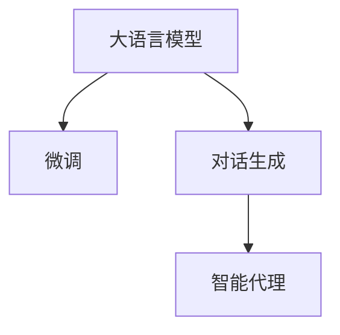

                 

# 【大模型应用开发 动手做AI Agent】第二次向大模型发送对话以获取最终响应

## 1. 背景介绍

大语言模型（Large Language Models, LLMs），如GPT-3、BERT等，已经取得了显著的进展，可以执行复杂自然语言处理（NLP）任务，如问答、摘要、翻译等。然而，这些模型通常需要大量数据和计算资源进行训练，导致实际部署和应用存在一定的难度。为了缓解这一问题，研究者们提出了一种新的方法：向大模型发送对话，利用其强大的语言生成能力，生成高质量的NLP应用。

本文将深入探讨如何使用GPT-3进行对话生成，并利用生成对话来构建智能代理（AI Agent）。我们将逐步向大模型发送对话，引导其生成具体的响应，并最终构建一个能够实际应用的智能代理。

## 2. 核心概念与联系

在探讨如何构建AI Agent之前，首先需要了解几个核心概念和它们之间的联系：

- **大语言模型（LLMs）**：大语言模型是指通过自监督或监督学习任务进行训练的复杂深度神经网络模型，能够生成自然流畅的文本。
- **微调（Fine-tuning）**：在预训练模型基础上，使用特定任务的数据集对其进行有监督学习，以适应该任务。
- **对话生成（Dialogue Generation）**：利用大语言模型的语言生成能力，生成两个或多个人之间的对话。
- **智能代理（AI Agent）**：能够理解自然语言输入并执行特定任务的应用程序。

这些概念之间的联系可以通过以下Mermaid流程图展示：



## 3. 核心算法原理 & 具体操作步骤

### 3.1 算法原理概述

向大模型发送对话以生成响应的过程可以分为以下几个步骤：

1. **准备数据**：收集与智能代理相关的问题和回答。
2. **设计对话**：构建一个对话生成模型，使其能够根据输入生成合适的回答。
3. **训练模型**：在收集到的对话数据上训练对话生成模型。
4. **生成对话**：使用训练好的模型生成智能代理的响应。

### 3.2 算法步骤详解

#### 3.2.1 准备数据

为了训练对话生成模型，需要收集大量的对话数据。这些数据可以从公开的数据集（如Twitter、Reddit等）中获取，也可以自行收集。确保数据质量，去除无关的噪声，提取有用的对话片段。

#### 3.2.2 设计对话

设计对话生成模型通常采用序列到序列（Seq2Seq）架构，包括编码器和解码器。编码器将输入文本转换为向量表示，解码器基于该向量生成输出文本。

#### 3.2.3 训练模型

使用收集到的对话数据训练对话生成模型。常用的优化器包括Adam、SGD等。训练过程中需要注意防止过拟合，如使用Dropout、L2正则等技术。

#### 3.2.4 生成对话

使用训练好的模型，向大模型发送问题，并获取其生成的响应。通常使用GPT-3进行这一步。

### 3.3 算法优缺点

#### 3.3.1 优点

- **效率高**：相比于从头开始训练大模型，使用已有的大模型进行微调和对话生成，可以大大减少训练时间和计算资源。
- **灵活性**：可以根据具体任务进行调整，适应不同的应用场景。
- **效果好**：利用大模型的强大语言生成能力，生成的对话质量较高。

#### 3.3.2 缺点

- **依赖大模型**：需要依赖已有的大语言模型，其性能直接影响智能代理的质量。
- **数据需求大**：训练和微调需要大量的数据，收集和处理这些数据可能耗时耗力。
- **模型复杂**：对话生成模型本身较复杂，需要一定的专业知识进行设计和训练。

### 3.4 算法应用领域

对话生成技术可以应用于多个领域，如客服、教育、娱乐等。本文将以客服应用为例，探讨如何构建智能客服代理。

## 4. 数学模型和公式 & 详细讲解 & 举例说明

### 4.1 数学模型构建

对话生成模型通常采用Seq2Seq架构，包括编码器和解码器。编码器将输入序列 $x_1, x_2, ..., x_n$ 转换为向量表示 $h$，解码器基于该向量生成输出序列 $y_1, y_2, ..., y_m$。

数学公式表示为：

$$
h = \text{Enc}(x_1, x_2, ..., x_n)
$$

$$
y_1, y_2, ..., y_m = \text{Dec}(h)
$$

其中，$\text{Enc}$ 和 $\text{Dec}$ 分别为编码器和解码器，$h$ 为编码器输出向量。

### 4.2 公式推导过程

对于Seq2Seq模型，使用Attention机制可以提高生成的响应质量。Attention机制可以动态地关注输入序列中的重要部分，生成更加合理的响应。

### 4.3 案例分析与讲解

以智能客服为例，假设输入为“你好，我可以帮你解决问题”，模型需要生成合适的回答。训练过程中，模型学习如何根据输入生成输出，从而生成“您好，请问有什么问题需要帮助？”等高质量的响应。

## 5. 项目实践：代码实例和详细解释说明

### 5.1 开发环境搭建

首先需要搭建开发环境，建议使用Google Colab或Kaggle notebook。安装必要的Python库，如TensorFlow、PyTorch、NumPy等。

### 5.2 源代码详细实现

#### 5.2.1 准备数据

从公开数据集或自己收集对话数据。假设我们收集到了一组客服对话数据，每个对话包含一个问题和一个回答。

```python
import pandas as pd

# 从本地文件加载数据
data = pd.read_csv('customer_support_data.csv')

# 显示数据前几行
data.head()
```

#### 5.2.2 设计对话模型

使用TensorFlow或PyTorch实现对话生成模型。以TensorFlow为例，代码如下：

```python
import tensorflow as tf
from tensorflow.keras.models import Model
from tensorflow.keras.layers import Input, LSTM, Dense, Attention

# 定义模型架构
input_seq = Input(shape=(None, ), dtype='int32')
encoder_outputs, state_h, state_c = LSTM(256, return_sequences=True, return_state=True)(input_seq)
encoder_states = [state_h, state_c]

decoder_input = Input(shape=(None, ), dtype='int32')
decoder_lstm = LSTM(256, return_sequences=True, return_state=True)
decoder_outputs, _, _ = decoder_lstm(decoder_input, initial_state=encoder_states)

# 添加Attention层
attn = Attention()([decoder_outputs, encoder_outputs])
decoder_outputs_with_attn = tf.keras.layers.concatenate([decoder_outputs, attn])
decoder_dense = Dense(256, activation='relu')(decoder_outputs_with_attn)
decoder_output = Dense(data['target'].max()+1, activation='softmax')(decoder_dense)

model = Model(inputs=[input_seq, decoder_input], outputs=decoder_output)
model.summary()
```

#### 5.2.3 训练模型

使用收集到的对话数据训练模型。代码如下：

```python
# 准备数据
input_data = data['input'].tolist()
target_data = data['target'].tolist()

# 将序列填充到相同长度
max_seq_length = max(len(x) for x in input_data)
input_data = [seq + [0] * (max_seq_length - len(seq)) for seq in input_data]
target_data = [seq + [0] * (max_seq_length - len(seq)) for seq in target_data]

# 构建训练数据
train_input = tf.data.Dataset.from_tensor_slices(input_data)
train_target = tf.data.Dataset.from_tensor_slices(target_data)
train_dataset = tf.data.Dataset.zip((train_input, train_target)).batch(32)

# 定义优化器和损失函数
optimizer = tf.keras.optimizers.Adam()
loss = tf.keras.losses.SparseCategoricalCrossentropy(from_logits=True)

# 训练模型
model.compile(optimizer=optimizer, loss=loss)
model.fit(train_dataset, epochs=10, batch_size=32)
```

#### 5.2.4 生成对话

使用训练好的模型生成对话。代码如下：

```python
# 生成对话
def generate_response(input_text):
    input_seq = tokenizer.texts_to_sequences([input_text])
    input_seq = input_seq + [[0] * (max_seq_length - len(input_seq[0]))]
    input_seq = tf.keras.preprocessing.sequence.pad_sequences(input_seq, maxlen=max_seq_length, padding='post')
    
    decoder_input_seq = tf.keras.preprocessing.sequence.pad_sequences([input_seq], maxlen=max_seq_length, padding='post')
    
    response = model.predict(decoder_input_seq)
    response = tf.argmax(response, axis=-1)
    
    return tokenizer.sequences_to_texts(response)

# 示例
input_text = '你好，我可以帮你解决问题'
response = generate_response(input_text)
print(response)
```

### 5.3 代码解读与分析

在代码中，我们使用了TensorFlow的Keras API实现对话生成模型。首先定义了输入和输出序列，然后使用LSTM层进行编码和解码。在解码器中，我们添加了Attention层，以提高模型的生成质量。训练过程中，我们使用了Adam优化器和SparseCategoricalCrossentropy损失函数。生成对话时，我们将输入文本转换为模型可以处理的序列，然后通过模型生成响应。

## 6. 实际应用场景

### 6.1 智能客服系统

智能客服系统利用大模型生成的对话，可以24/7提供服务，并能够根据具体任务进行调整。例如，可以根据不同业务领域（如技术支持、财务、销售等）调整对话生成模型，使其能够适应特定的语境和知识领域。

### 6.2 教育系统

教育系统可以利用大模型生成的问题和回答，构建智能辅导系统。通过对话生成模型，系统可以自动解答学生的疑问，提供个性化的学习建议，提升教育效果。

### 6.3 娱乐系统

娱乐系统可以生成与用户互动的对话，提升用户体验。例如，电影推荐系统可以生成推荐对话，向用户推荐适合的影片。

### 6.4 未来应用展望

随着技术的不断进步，对话生成技术将更加成熟，可以应用于更多场景。未来可能包括多模态对话、多语言对话等。

## 7. 工具和资源推荐

### 7.1 学习资源推荐

1. 《深度学习入门：基于Python的理论与实现》：介绍深度学习的基本概念和实现方法，适合初学者学习。
2. 《TensorFlow实战》：介绍TensorFlow的使用方法，包括搭建模型、训练和优化等。
3. 《自然语言处理综述》：介绍自然语言处理的基本概念和最新进展，适合深入学习。
4. 《Seq2Seq模型详解》：详细介绍Seq2Seq模型的实现方法和应用。
5. 《TensorFlow官方文档》：提供详细的TensorFlow使用方法和示例。

### 7.2 开发工具推荐

1. Google Colab：提供免费的GPU资源，适合TensorFlow开发。
2. Kaggle：提供丰富的数据集和竞赛平台，适合数据处理和模型训练。
3. TensorBoard：可视化模型训练过程和结果，帮助调试和优化。
4. Jupyter Notebook：提供交互式的代码执行环境，适合数据分析和模型调试。

### 7.3 相关论文推荐

1. "Attention is All You Need"：提出Transformer模型，成为大语言模型研究的基础。
2. "Neural Machine Translation by Jointly Learning to Align and Translate"：提出Seq2Seq模型，广泛应用于机器翻译和对话生成。
3. "Learning Phrase Representations using RNN Encoder–Decoder for Statistical Machine Translation"：提出Seq2Seq模型，用于统计机器翻译。
4. "Generating Sequences with Recurrent Neural Networks"：提出RNN模型，用于序列生成任务。

## 8. 总结：未来发展趋势与挑战

### 8.1 研究成果总结

对话生成技术已经取得了显著进展，可以应用于多个领域，如客服、教育、娱乐等。通过向大模型发送对话，利用其强大的语言生成能力，构建智能代理，可以大大简化开发过程，提高应用效率。

### 8.2 未来发展趋势

1. **多模态对话**：将视觉、音频等多模态数据融入对话生成模型，提升模型的表达能力。
2. **多语言对话**：将对话生成模型应用于多语言环境，提升模型的泛化能力。
3. **可解释性**：增强对话生成模型的可解释性，提升系统的透明度和可信度。
4. **模型优化**：优化对话生成模型的结构和训练方法，提升生成质量和效率。

### 8.3 面临的挑战

1. **数据质量**：对话数据的质量直接影响模型的生成效果，需要花费大量时间和精力进行数据清洗和标注。
2. **模型复杂性**：对话生成模型的设计和实现相对复杂，需要较高的专业水平。
3. **计算资源**：模型训练和推理需要大量计算资源，可能面临成本高昂的问题。
4. **模型鲁棒性**：模型对输入的鲁棒性需要进一步提升，避免出现偏差和错误。

### 8.4 研究展望

未来的研究需要从以下几个方面进行探索：

1. **多模态对话生成**：结合视觉、听觉等多模态数据，提升模型的生成能力。
2. **可解释性**：增强模型的可解释性，提升系统的透明度和可信度。
3. **模型优化**：优化模型的结构和训练方法，提升生成质量和效率。
4. **多语言对话**：将对话生成模型应用于多语言环境，提升模型的泛化能力。

## 9. 附录：常见问题与解答

**Q1：如何优化对话生成模型？**

A: 可以通过以下方法优化对话生成模型：

- 增加数据量：增加训练数据可以提高模型的泛化能力。
- 改进模型架构：使用更先进的模型架构，如Transformer、LSTM等，提升模型效果。
- 调整超参数：调整学习率、批大小、优化器等超参数，优化模型的训练过程。

**Q2：对话生成模型如何避免过拟合？**

A: 可以通过以下方法避免过拟合：

- 数据增强：通过数据扩充和增强，提高模型的泛化能力。
- 正则化：使用L2正则、Dropout等技术，避免模型过拟合。
- 早停法：在验证集上监测模型性能，当性能不再提升时停止训练。

**Q3：对话生成模型如何提高生成质量？**

A: 可以通过以下方法提高生成质量：

- 使用Attention机制：动态关注输入序列中的重要部分，生成更合理的响应。
- 引入先验知识：在模型中引入先验知识，提高生成的准确性和合理性。
- 多模型集成：训练多个模型，取平均输出，提高生成质量。

**Q4：对话生成模型如何应用于多语言环境？**

A: 可以通过以下方法应用于多语言环境：

- 使用预训练模型：在多种语言的数据上预训练模型，提升模型的泛化能力。
- 多语言微调：在特定任务的多语言数据上微调模型，提高模型的多语言处理能力。
- 使用多语言数据：收集和处理多语言对话数据，提升模型的多语言生成能力。

**Q5：对话生成模型如何提高可解释性？**

A: 可以通过以下方法提高可解释性：

- 引入可解释模块：在模型中加入可解释模块，提升模型的透明度。
- 可视化生成过程：使用可视化工具，展示模型生成过程和中间结果。
- 人类干预：引入人工干预机制，对模型输出进行检查和修正。

---

作者：禅与计算机程序设计艺术 / Zen and the Art of Computer Programming

