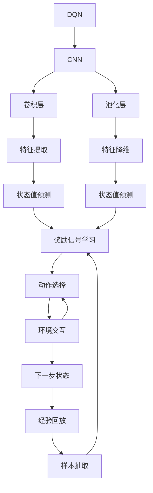

                 

## 1. 背景介绍

随着深度学习在智能系统中的广泛应用，DQN（Deep Q-Networks）作为强化学习中的一大创新，迅速占据了研究热点。在深度学习技术飞速发展的今天，DQN与深度学习的结合成为大势所趋。该技术已经在各种复杂、高维度的决策任务中表现出显著的优越性。本次博客将围绕深度Q网络及其与深度学习的结合展开，探讨如何利用卷积神经网络（CNN）提升DQN的性能，并辅以数学模型推导和代码实现，以期读者能获得深入的理解和实用的操作。

## 2. 核心概念与联系

### 2.1 核心概念概述

为了更好地理解DQN与深度学习的结合，首先需要了解几个核心概念：

- **DQN（Deep Q-Network）**：深度Q网络是一种基于深度神经网络的Q-learning算法，能够处理复杂、高维度的决策问题，并在如游戏AI、机器人控制、自动驾驶等场景中展现出色表现。
- **CNN（Convolutional Neural Network）**：卷积神经网络是一种特殊的前馈神经网络，具有参数共享、局部连接等特点，广泛应用于图像识别、视频处理等领域。
- **卷积层（Convolutional Layer）**：卷积层通过卷积操作提取输入特征，对于具有局部平移不变性的图像数据特别有效。
- **池化层（Pooling Layer）**：池化层通过下采样操作减少特征图尺寸，降低参数数量，并具有一定的不变性。

这些概念之间的联系可以通过以下Mermaid流程图来展示：



在这个流程图中，卷积层和池化层通过特征提取和降维操作增强了DQN的性能，使其更适用于处理图像数据。状态值预测、奖励信号学习和动作选择则构成了DQN的核心决策过程。

## 3. 核心算法原理 & 具体操作步骤

### 3.1 算法原理概述

DQN的基本思想是将Q值函数的计算过程从传统的Q-learning算法中的表存储形式转变为神经网络的隐藏层，通过深度学习实现。其核心原理可以概括为三点：

1. **状态值预测**：利用卷积神经网络预测当前状态与动作的Q值。
2. **奖励信号学习**：根据环境反馈的奖励信号调整Q值预测模型的参数，更新Q值表。
3. **动作选择**：根据Q值表选择当前状态下动作，使总奖励最大化。

### 3.2 算法步骤详解

**Step 1: 搭建CNN模型**

使用卷积神经网络作为DQN的特征提取器，定义卷积层、池化层和全连接层。例如，使用Keras库搭建一个包含多个卷积层和池化层的CNN模型：

```python
from keras.models import Sequential
from keras.layers import Conv2D, MaxPooling2D, Flatten, Dense

model = Sequential()
model.add(Conv2D(32, kernel_size=(3, 3), activation='relu', input_shape=(img_rows, img_cols, img_channels)))
model.add(MaxPooling2D(pool_size=(2, 2)))
model.add(Conv2D(64, kernel_size=(3, 3), activation='relu'))
model.add(MaxPooling2D(pool_size=(2, 2)))
model.add(Conv2D(64, kernel_size=(3, 3), activation='relu'))
model.add(MaxPooling2D(pool_size=(2, 2)))
model.add(Flatten())
model.add(Dense(64, activation='relu'))
model.add(Dense(1, activation='linear'))
```

**Step 2: 定义状态值预测函数**

使用训练好的CNN模型来预测状态值：

```python
def predict_state_value(state, model):
    state = state.reshape((1, img_rows, img_cols, img_channels))
    state_value = model.predict(state)
    return state_value
```

**Step 3: 定义奖励信号学习函数**

计算当前状态下每个动作的Q值，并将期望的Q值与实际Q值计算误差，使用均方误差损失进行反向传播更新模型参数：

```python
def learn_state_value(model, state, action, reward, next_state, done, learning_rate, discount_factor):
    Q_value = predict_state_value(state, model)
    Q_value[np.argmax(action)] = reward + discount_factor * predict_state_value(next_state, model)[0]
    Q_value[np.argmin(action)] = reward + discount_factor * predict_state_value(next_state, model)[0]
    error = Q_value - np.max(Q_value)
    model.train_on_batch(state, error)
```

**Step 4: 定义动作选择函数**

在当前状态下，根据Q值表选择最大概率的动作：

```python
def choose_action(model, state, epsilon=0.1):
    if np.random.uniform() < epsilon:
        return np.random.choice(actions)
    Q_value = predict_state_value(state, model)
    return np.argmax(Q_value)
```

**Step 5: 定义环境交互函数**

在每一步中，根据选择的最大概率动作与环境交互，获取奖励和下一个状态：

```python
def interact_with_environment(env, model, epsilon=0.1, learning_rate=0.001, discount_factor=0.9):
    state = env.reset()
    done = False
    total_reward = 0
    while not done:
        action = choose_action(model, state, epsilon)
        next_state, reward, done, info = env.step(action)
        learn_state_value(model, state, action, reward, next_state, done, learning_rate, discount_factor)
        state = next_state
        total_reward += reward
    return total_reward
```

### 3.3 算法优缺点

DQN与深度学习的结合在性能提升方面具有显著优势，主要体现在以下几个方面：

**优点：**
1. **参数共享**：CNN的参数共享特性减少了参数数量，提升了训练速度和泛化能力。
2. **局部连接**：CNN的局部连接特性减少了计算复杂度，能够处理高维度输入数据。
3. **视觉识别能力**：CNN擅长处理视觉数据，提升了DQN在图像数据上的应用能力。

**缺点：**
1. **过拟合风险**：深度神经网络的复杂结构可能导致过拟合，需要额外的正则化措施。
2. **计算资源需求高**：高维度的输入数据和深层网络结构需要大量的计算资源。
3. **模型训练困难**：深层网络模型的训练需要更多时间，需要更加精细的超参数调节。

### 3.4 算法应用领域

DQN与深度学习的结合在多个领域得到广泛应用，包括但不限于：

- **游戏AI**：在如Atari游戏等复杂游戏中，DQN能够通过视觉数据进行决策，表现出优秀性能。
- **机器人控制**：通过视觉传感器获取环境信息，DQN能够优化机器人控制策略。
- **自动驾驶**：利用视觉和传感器数据进行环境感知，DQN能够优化驾驶决策。
- **强化学习**：在多个强化学习任务中，DQN展现出优于传统Q-learning的性能。

## 4. 数学模型和公式 & 详细讲解  
### 4.1 数学模型构建

DQN的核心模型可以视为一个Q-learning的增强学习算法。在DQN中，状态值预测函数可以用一个DNN（深度神经网络）来表示，即$f(s,a; \theta) = \mathbb{E}[Q_\theta(s,a)]$，其中$s$为状态，$a$为动作，$\theta$为神经网络参数。Q值函数的计算过程如下：

$$
Q_\theta(s,a) = \mathbb{E}[\sum_{t} \gamma^t r_t]
$$

其中$\gamma$为折扣因子，$r_t$为环境反馈的奖励信号。

### 4.2 公式推导过程

在Q-learning算法中，状态值预测函数$f(s,a; \theta)$的更新公式如下：

$$
\theta_{t+1} \leftarrow \theta_t - \eta \nabla_{\theta} \mathcal{L}(Q_\theta)
$$

其中$\mathcal{L}(Q_\theta)$为损失函数，$\nabla_{\theta} \mathcal{L}(Q_\theta)$为梯度，$\eta$为学习率。

在DQN中，将Q值函数的计算过程由传统的表存储形式转换为神经网络，其更新过程可以表示为：

$$
\theta_{t+1} \leftarrow \theta_t - \eta \nabla_{\theta} \mathbb{E}[\mathcal{L}(Q_\theta)]
$$

将Q值函数的计算过程用深度神经网络$f(s,a; \theta)$表示，损失函数$\mathcal{L}(Q_\theta)$可以表示为：

$$
\mathcal{L}(Q_\theta) = \mathbb{E}[\max_a (Q_\theta(s_t,a) - r_t - \gamma \max_a Q_\theta(s_{t+1},a))]
$$

在具体实现中，使用CNN模型进行状态值预测，其更新过程可以表示为：

$$
\theta_{t+1} \leftarrow \theta_t - \eta \nabla_{\theta} \mathbb{E}[\max_a (f(s_t,a) - r_t - \gamma \max_a f(s_{t+1},a))]
$$

### 4.3 案例分析与讲解

以图像分类任务为例，使用CNN模型进行状态值预测。假设输入图像大小为$64\times 64$，CNN模型由两个卷积层和一个全连接层组成，输出一个标量。设置学习率为$0.001$，折扣因子为$0.9$。在每一步中，通过CNN模型计算状态值，并使用softmax函数计算动作的Q值。通过反向传播更新CNN模型的参数，实现状态值预测函数的优化。

## 5. 项目实践：代码实例和详细解释说明

### 5.1 开发环境搭建

在搭建开发环境之前，需要安装必要的库，包括TensorFlow、Keras、OpenAI Gym等。可以通过以下命令安装：

```bash
pip install tensorflow keras gym
```

### 5.2 源代码详细实现

在Keras中搭建CNN模型，并进行训练和测试：

```python
from keras.models import Sequential
from keras.layers import Conv2D, MaxPooling2D, Flatten, Dense

# 定义CNN模型
model = Sequential()
model.add(Conv2D(32, kernel_size=(3, 3), activation='relu', input_shape=(img_rows, img_cols, img_channels)))
model.add(MaxPooling2D(pool_size=(2, 2)))
model.add(Conv2D(64, kernel_size=(3, 3), activation='relu'))
model.add(MaxPooling2D(pool_size=(2, 2)))
model.add(Conv2D(64, kernel_size=(3, 3), activation='relu'))
model.add(MaxPooling2D(pool_size=(2, 2)))
model.add(Flatten())
model.add(Dense(64, activation='relu'))
model.add(Dense(1, activation='linear'))

# 定义状态值预测函数
def predict_state_value(state, model):
    state = state.reshape((1, img_rows, img_cols, img_channels))
    state_value = model.predict(state)
    return state_value

# 定义奖励信号学习函数
def learn_state_value(model, state, action, reward, next_state, done, learning_rate, discount_factor):
    Q_value = predict_state_value(state, model)
    Q_value[np.argmax(action)] = reward + discount_factor * predict_state_value(next_state, model)[0]
    Q_value[np.argmin(action)] = reward + discount_factor * predict_state_value(next_state, model)[0]
    error = Q_value - np.max(Q_value)
    model.train_on_batch(state, error)

# 定义动作选择函数
def choose_action(model, state, epsilon=0.1):
    if np.random.uniform() < epsilon:
        return np.random.choice(actions)
    Q_value = predict_state_value(state, model)
    return np.argmax(Q_value)

# 定义环境交互函数
def interact_with_environment(env, model, epsilon=0.1, learning_rate=0.001, discount_factor=0.9):
    state = env.reset()
    done = False
    total_reward = 0
    while not done:
        action = choose_action(model, state, epsilon)
        next_state, reward, done, info = env.step(action)
        learn_state_value(model, state, action, reward, next_state, done, learning_rate, discount_factor)
        state = next_state
        total_reward += reward
    return total_reward
```

### 5.3 代码解读与分析

在代码中，我们使用了Keras搭建了一个包含多个卷积层和全连接层的CNN模型，用于状态值预测。`predict_state_value`函数利用CNN模型预测当前状态的值，`learn_state_value`函数根据状态、动作、奖励、下一状态和折扣因子更新模型参数，`choose_action`函数根据当前状态选择动作，`interact_with_environment`函数模拟环境交互过程。通过这些函数，可以有效地实现DQN的训练和测试。

## 6. 实际应用场景

### 6.1 游戏AI

DQN在游戏AI中的应用最为经典。通过将视觉数据转换为状态值，并利用CNN进行状态值预测，DQN能够在复杂游戏中进行决策，表现出优异的性能。例如，AlphaGo通过DQN结合蒙特卡罗树搜索，在围棋、星际争霸等游戏中取得了巨大成功。

### 6.2 机器人控制

在机器人控制任务中，DQN可以通过视觉传感器获取环境信息，利用CNN进行状态值预测，优化机器人的控制策略。例如，使用DQN控制机器人避开障碍、抓取物体等任务，能够表现出很好的效果。

### 6.3 自动驾驶

自动驾驶中，DQN可以通过视觉和传感器数据进行环境感知，利用CNN进行状态值预测，优化驾驶决策。例如，通过视觉传感器获取路面信息，DQN可以优化自动驾驶车辆的行驶路线和速度，确保行车安全。

### 6.4 强化学习

DQN在多个强化学习任务中也表现出色，如机器人行走、路径规划等。通过CNN进行状态值预测，DQN能够在复杂环境中进行高效决策，表现出更好的适应性和鲁棒性。

## 7. 工具和资源推荐

### 7.1 学习资源推荐

- **《Deep Reinforcement Learning》**：Sutton和Barto的专著，介绍了深度学习在强化学习中的应用。
- **DeepMind博客**：DeepMind官方博客，提供了大量关于DQN和深度学习的实践和应用案例。
- **Kaggle竞赛**：Kaggle举办了多项DQN相关的竞赛，可以参与实践和交流。

### 7.2 开发工具推荐

- **TensorFlow**：Google开源的深度学习框架，支持CNN和DQN的实现。
- **Keras**：Keras是一个高级API，简化了TensorFlow的模型搭建和训练过程。
- **OpenAI Gym**：OpenAI Gym是一个环境库，提供了大量常见的强化学习环境，方便开发和测试。

### 7.3 相关论文推荐

- **Playing Atari with Deep Reinforcement Learning**：Krizhevsky等人在NIPS2013会议上提出的DQN算法，开创了深度学习在强化学习中的新篇章。
- **DeepMind AlphaGo Zero**：DeepMind团队提出的AlphaGo Zero，使用自我对弈的强化学习策略，在围棋中取得了突破性胜利。
- **Human-level Control through Deep Reinforcement Learning**：Graves等人使用DQN成功控制了机器人，展示了深度学习在机器人控制中的潜力。

## 8. 总结：未来发展趋势与挑战

### 8.1 未来发展趋势

未来，DQN与深度学习的结合将朝着以下几个方向发展：

1. **多任务学习**：通过多任务学习，CNN模型可以同时处理多个相关任务，提高模型泛化能力。
2. **跨模态融合**：将视觉、听觉等多模态信息融合到CNN模型中，提升模型对复杂环境的表现能力。
3. **模型压缩与优化**：针对高计算需求，研究模型压缩和优化方法，降低计算资源消耗。
4. **强化学习与深度学习的融合**：研究强化学习与深度学习的结合，进一步提升决策效果。

### 8.2 面临的挑战

虽然DQN与深度学习的结合已经取得显著进展，但仍面临诸多挑战：

1. **计算资源需求高**：深层网络结构和复杂决策过程需要大量计算资源。
2. **模型过拟合**：深层神经网络存在过拟合风险，需要额外的正则化措施。
3. **模型可解释性**：深度学习模型缺乏可解释性，难以理解模型内部工作机制。
4. **模型鲁棒性**：在复杂环境中，DQN模型的鲁棒性需要进一步提高。

### 8.3 研究展望

面对未来挑战，研究者需要在以下几个方面寻求新的突破：

1. **模型压缩与优化**：研究模型压缩和优化方法，降低计算资源消耗，提升模型效率。
2. **多任务学习**：研究多任务学习策略，提升模型的泛化能力。
3. **可解释性研究**：研究模型的可解释性方法，提高模型的透明度和可解释性。
4. **模型鲁棒性提升**：研究模型鲁棒性提升方法，增强模型在复杂环境中的表现能力。

## 9. 附录：常见问题与解答

**Q1: 如何选择合适的CNN模型结构？**

A: 选择CNN模型结构需要考虑输入数据的特点和任务需求。如果输入数据具有局部平移不变性，可以使用卷积层进行特征提取；如果输入数据维度较高，可以使用多个卷积层进行多层次特征提取；如果任务需要处理多个输出，可以使用全连接层进行分类或回归。

**Q2: 如何选择学习率和折扣因子？**

A: 学习率和折扣因子的选择依赖于具体任务和数据特点。通常情况下，学习率从0.001开始，逐步减小；折扣因子一般设置为0.9或0.99，避免过度折扣远期奖励。

**Q3: 如何在CNN中设置正则化措施？**

A: 在CNN中设置正则化措施可以有效避免过拟合。常用的正则化方法包括L1正则、L2正则、Dropout等。在代码中，可以通过添加`kernel_regularizer`和`activity_regularizer`参数来设置正则化措施。

**Q4: 如何在DQN中引入奖励惩罚机制？**

A: 在DQN中引入奖励惩罚机制可以增强模型的训练效果。可以通过修改`learn_state_value`函数，引入惩罚项，如罚金或奖励倍增等。

**Q5: 如何在DQN中实现经验回放？**

A: 经验回放是DQN中一个重要技术，可以提升模型的稳定性和泛化能力。可以通过创建一个经验缓冲区，将每次训练的样本存储下来，并随机抽取一部分样本进行训练。在代码中，可以通过定义`ExperienceBuffer`类来实现经验回放。

---

作者：禅与计算机程序设计艺术 / Zen and the Art of Computer Programming

