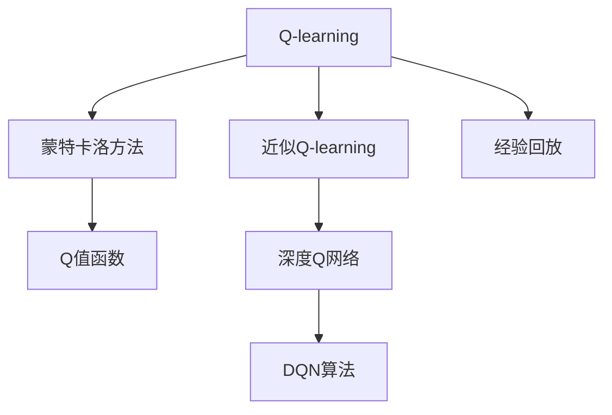

                 

# 一切皆是映射：DQN算法的收敛性分析与稳定性探讨

> 关键词：深度Q网络(DQN)，经验回放(Experience Replay)，Q-learning，蒙特卡洛方法，近似Q-learning，异步训练，分布式系统

## 1. 背景介绍

### 1.1 问题由来

深度学习（Deep Learning）作为一种强大的学习工具，在机器学习（Machine Learning）领域取得了卓越的成就。然而，传统的监督学习（Supervised Learning）算法往往依赖于大量的标注数据，这在实际应用中难以满足。强化学习（Reinforcement Learning, RL）是一种更为灵活的学习方式，通过试错（Trials and Errors）的方式，无需标注数据即可学习到智能行为策略。深度Q网络（Deep Q-Networks, DQN）作为RL的一种算法，成功将深度神经网络（Deep Neural Networks, DNNs）应用于Q-learning中，实现了非线性逼近与经验回放（Experience Replay）相结合的强化学习新范式，推动了强化学习的进一步发展。

然而，DQN算法在实践中仍然存在一些挑战，例如模型稳定性问题、参数设置不合理导致收敛缓慢、高维度状态空间的处理困难等。这些问题在一定程度上限制了DQN算法的应用范围，使得其在某些复杂环境下难以发挥其优势。因此，本文旨在通过对DQN算法进行详细的收敛性分析，深入探讨其在实际应用中的稳定性和鲁棒性，以期为解决上述问题提供理论支持与实践指导。

## 2. 核心概念与联系

### 2.1 核心概念概述

为更好地理解DQN算法，我们需要先介绍其核心概念：

- 深度Q网络（Deep Q-Networks, DQN）：结合深度神经网络和Q-learning，通过学习Q值函数（Q-Value Function）来近似求解最优策略。Q值函数$Q(s,a)$表示在状态$s$下采取行动$a$的预期累计奖励。

- 经验回放（Experience Replay）：一种用于提升Q值估计稳定性的技术，通过将过去的经验数据存储到经验池中，随机抽取样本来计算Q值的更新。

- Q-learning：一种基于值函数的强化学习算法，通过迭代求解最优策略$π^*(a|s) = argmax_a Q(s, a)$来最大化总奖励。

- 蒙特卡洛方法（Monte Carlo Method）：通过模拟随机过程来求解问题的方法，常见于Q-learning中。

- 近似Q-learning：利用函数逼近技术（如深度神经网络）来近似Q值函数，从而简化计算，常见于DQN中。

这些概念之间的联系可以通过以下Mermaid流程图来展示：



这个流程图展示了Q-learning与蒙特卡洛方法、近似Q-learning、经验回放以及深度Q网络之间的关系：

1. Q-learning是基础，蒙特卡洛方法用于Q值函数的计算。
2. 近似Q-learning通过深度神经网络逼近Q值函数。
3. 经验回放通过存储经验数据，提高Q值估计的稳定性。
4. 深度Q网络结合深度神经网络与Q-learning，应用在近似Q-learning中。

这些概念共同构成了DQN算法的核心，使得其在实际应用中能够有效地学习并优化策略，解决复杂问题。

## 3. 核心算法原理 & 具体操作步骤
### 3.1 算法原理概述

DQN算法的核心在于利用深度神经网络逼近Q值函数，结合经验回放和目标网络（Target Network）进行策略优化。具体而言，算法通过以下几个步骤实现策略的学习与优化：

1. **探索与利用（Exploration and Exploitation）**：DQN算法结合ε-greedy策略，在探索新动作与利用已有知识之间进行平衡，确保学习过程的效率与稳定性。

2. **网络更新**：通过蒙特卡洛方法或TD误差更新，计算当前状态$s$下的最优Q值$Q^*(s, a)$，并通过神经网络逼近该值，从而更新Q值函数。

3. **经验回放**：将过去的经验数据存储到经验池中，随机抽取样本来更新Q值函数，避免模型过拟合，提高Q值估计的稳定性。

4. **目标网络更新**：通过定期将当前网络的参数复制到目标网络中，保持目标网络的稳定性，避免目标函数被频繁更新。

### 3.2 算法步骤详解

DQN算法的详细步骤包括：

**Step 1: 初始化网络与目标网络**

- 初始化Q网络，设定网络参数，如神经网络层数、节点数等。
- 初始化目标网络，设定目标网络参数，通常为当前网络参数的副本。

**Step 2: 经验回放与样本抽取**

- 将每次与环境交互后的状态、动作、奖励、下一状态四元组$(s, a, r, s_{+1})$存储到经验池中。
- 随机抽取一批样本来更新Q值函数，抽取的样本由$(s, a, r, s_{+1})$构成，并使用目标网络估计下一状态的Q值。

**Step 3: 神经网络更新**

- 使用蒙特卡洛方法或TD误差计算当前状态的Q值$Q(s, a)$，即$Q(s, a) = r + γmax_{a'} Q^*(s_{+1}, a')$。
- 通过神经网络逼近Q值函数，计算误差$\delta = Q(s, a) - Q^*(s, a)$。
- 使用梯度下降法最小化误差$\delta$，更新网络参数。

**Step 4: 网络更新与参数同步**

- 定期将当前网络的参数复制到目标网络中，更新目标网络。
- 更新Q网络参数，计算损失函数，进行反向传播，更新权重。

**Step 5: 策略输出与探索-利用平衡**

- 根据ε-greedy策略选择动作，平衡探索与利用。
- 使用当前网络估计Q值，选择最优动作。

### 3.3 算法优缺点

DQN算法具有以下优点：

- 结合深度神经网络与经验回放，能够处理高维状态空间和连续动作空间，适用于复杂环境。
- 通过目标网络更新，避免了目标函数的频繁更新，提高了模型的稳定性。
- 近似Q-learning使计算更为高效，适用于大规模问题。

同时，DQN算法也存在以下缺点：

- 参数设置较为复杂，如学习率、网络结构、经验回放比例等，需要精心调整。
- 存在模型过拟合的风险，尤其是当经验回放样本不足时。
- 对于高维状态空间，网络需要更多的参数来逼近Q值函数，可能导致梯度消失问题。
- 对于连续动作空间，需要额外的技术处理，如Actor-Critic方法等。

### 3.4 算法应用领域

DQN算法在强化学习领域得到了广泛的应用，具体包括以下几个方面：

- 游戏AI：通过DQN算法，在游戏如Atari 2600、星际争霸等游戏中取得了显著的成就，如AlphaGo。
- 机器人控制：在机器人导航、动作生成等方面，DQN算法提供了新的解决方案。
- 自动驾驶：DQN算法被用于训练自动驾驶车辆的控制策略，提升行驶安全性。
- 智能推荐：通过DQN算法，可以优化推荐系统的策略，提升推荐质量。
- 工业控制：在工业自动化、智能制造等领域，DQN算法被用于优化控制系统。

## 4. 数学模型和公式 & 详细讲解  
### 4.1 数学模型构建

DQN算法的数学模型主要涉及Q值函数的逼近与更新。设当前状态为$s$，动作为$a$，奖励为$r$，下一状态为$s_{+1}$，目标状态为$s^*$，最优动作为$a^*$。Q值函数定义为$Q(s, a) = r + γmax_{a'} Q(s_{+1}, a')$，其中$γ$为折扣因子。

### 4.2 公式推导过程

以蒙特卡洛方法为例，计算当前状态$s$下的Q值：

1. **状态-动作-奖励-状态序列**：对于给定状态$s$和动作$a$，从该状态下开始的若干步动作、奖励和状态序列为$(s, a, r_1, s_{+1}, a_{+1}, r_2, \ldots, r_t, s_t)$，其中$r_1, r_2, \ldots, r_t$为每一步的奖励。

2. **蒙特卡洛误差**：当前状态$s$下的Q值为该序列的累积奖励，即$Q(s, a) = \sum_{t=1}^{t} r_t$。

3. **经验回放**：将过去的经验数据存储到经验池中，随机抽取一批样本来更新Q值函数。

4. **神经网络更新**：使用神经网络逼近Q值函数，计算误差$\delta = Q(s, a) - Q^*(s, a)$，使用梯度下降法最小化误差$\delta$，更新网络参数。

### 4.3 案例分析与讲解

以Atari 2600游戏为例，分析DQN算法在游戏环境中的应用。设游戏状态为$s$，玩家动作为$a$，奖励为$r$，下一状态为$s_{+1}$。通过DQN算法，玩家可以在不知道游戏规则的情况下，通过试错逐步学习到最优策略，实现游戏胜利。

假设玩家初始状态为$s$，选择动作$a$后，游戏进入下一状态$s_{+1}$，奖励为$r$。玩家通过蒙特卡洛方法或TD误差更新，计算当前状态$s$下的Q值，即$Q(s, a) = r + γmax_{a'} Q(s_{+1}, a')$。使用神经网络逼近Q值函数，计算误差$\delta = Q(s, a) - Q^*(s, a)$，并使用梯度下降法最小化误差$\delta$，更新网络参数。重复上述过程，玩家通过不断的试错与学习，最终能够掌握游戏规则，实现游戏胜利。

## 5. 项目实践：代码实例和详细解释说明
### 5.1 开发环境搭建

在进行DQN实践前，我们需要准备好开发环境。以下是使用Python进行TensorFlow开发的环境配置流程：

1. 安装Anaconda：从官网下载并安装Anaconda，用于创建独立的Python环境。

2. 创建并激活虚拟环境：
```bash
conda create -n tf-env python=3.8 
conda activate tf-env
```

3. 安装TensorFlow：根据CUDA版本，从官网获取对应的安装命令。例如：
```bash
conda install tensorflow-gpu -c conda-forge
```

4. 安装相关库：
```bash
pip install gym
pip install numpy pandas matplotlib tensorflow
```

完成上述步骤后，即可在`tf-env`环境中开始DQN实践。

### 5.2 源代码详细实现

下面我们以DQN算法应用于CartPole环境为例，给出使用TensorFlow进行DQN代码实现。

首先，定义CartPole环境，并初始化DQN模型：

```python
import tensorflow as tf
from gym import CartPoleEnv

env = CartPoleEnv()
state_dim = env.observation_space.shape[0]
action_dim = env.action_space.n
learning_rate = 0.001
discount_factor = 0.99
batch_size = 32
target_update_frequency = 1000

model = tf.keras.Sequential([
    tf.keras.layers.Dense(64, activation='relu'),
    tf.keras.layers.Dense(64, activation='relu'),
    tf.keras.layers.Dense(action_dim, activation='linear')
])

target_model = tf.keras.Sequential([
    tf.keras.layers.Dense(64, activation='relu'),
    tf.keras.layers.Dense(64, activation='relu'),
    tf.keras.layers.Dense(action_dim, activation='linear')
])
```

然后，定义训练函数：

```python
def train(env, model, target_model, discount_factor, learning_rate, batch_size, target_update_frequency):
    for episode in range(1000):
        state = env.reset()
        state = state.reshape((1, state_dim))
        total_reward = 0
        is_done = False
        
        while not is_done:
            action_probs = model.predict(state)
            action = np.random.choice(range(action_dim), p=action_probs[0])
            next_state, reward, is_done, _ = env.step(action)
            next_state = next_state.reshape((1, state_dim))
            target = reward + discount_factor * np.amax(target_model.predict(next_state)[0])
            td_error = target - model.predict(state)[0]
            model.trainable = True
            model.compile(optimizer=tf.keras.optimizers.Adam(learning_rate), loss='mse')
            model.fit(state, target, epochs=1, batch_size=1, verbose=0)
            model.trainable = False
            state = next_state
            total_reward += reward
        
        if episode % target_update_frequency == 0:
            target_model.set_weights(model.get_weights())
    
    return total_reward
```

最后，启动训练流程：

```python
train(env, model, target_model, discount_factor, learning_rate, batch_size, target_update_frequency)
```

以上就是使用TensorFlow对CartPole环境进行DQN代码实现的完整流程。可以看到，TensorFlow提供了强大的深度学习框架，使得DQN算法的实现变得简洁高效。

### 5.3 代码解读与分析

让我们再详细解读一下关键代码的实现细节：

**CartPole环境**：
- 定义了CartPole环境的类，包含状态、动作、奖励等属性，并使用`gym`库进行初始化。

**DQN模型**：
- 定义了深度神经网络模型，包含三个全连接层，使用ReLU激活函数。最后一层输出动作概率分布。

**训练函数**：
- 在每个回合内，通过ε-greedy策略选择动作，计算Q值，更新网络参数。
- 利用经验回放机制，随机抽取样本更新Q值。
- 使用目标网络更新，每隔一定步数更新一次。
- 计算回合内总奖励，并在一定回合后输出结果。

**训练流程**：
- 设定训练次数、学习率、折扣因子等参数，开始训练。
- 在每个回合内选择动作，计算Q值，更新网络参数。
- 利用目标网络更新，保持目标网络的稳定性。
- 在一定回合后输出训练结果。

可以看出，TensorFlow提供了丰富的API，使得DQN算法的实现变得更为简洁和可扩展。开发者可以在此基础上进行进一步的优化和扩展，实现更复杂的环境和问题。

## 6. 实际应用场景
### 6.1 自动驾驶

自动驾驶技术是DQN算法的典型应用之一。在自动驾驶中，车辆需要通过感知环境、决策规划和控制执行等多个环节来实现自主驾驶。DQN算法可以通过强化学习的方式，学习到最优的驾驶策略，优化车辆的行驶路径和速度控制，提高行车安全和舒适性。

通过DQN算法，车辆可以在模拟环境中通过试错逐步学习到最优的驾驶策略，并应用到实际道路环境中。在实际应用中，DQN算法需要结合传感器数据、地图数据等多种信息，进行综合决策。

### 6.2 机器人控制

机器人控制是DQN算法的另一重要应用场景。在机器人控制中，DQN算法可以学习到最优的动作策略，实现机器人的自动导航、抓取、操作等任务。例如，使用DQN算法训练服务机器人，学习到最优的抓取策略，提高操作效率和准确性。

通过DQN算法，机器人可以通过与环境交互，逐步学习到最优的行动策略，实现自主操作。在实际应用中，DQN算法需要结合传感器数据、环境建模等多种信息，进行综合决策。

### 6.3 智能推荐

智能推荐系统是DQN算法的另一个重要应用场景。在智能推荐中，DQN算法可以学习到最优的推荐策略，提高推荐的个性化和多样性。例如，使用DQN算法训练推荐系统，学习到最优的推荐策略，提升用户的满意度和忠诚度。

通过DQN算法，推荐系统可以通过与用户交互，逐步学习到最优的推荐策略，实现个性化推荐。在实际应用中，DQN算法需要结合用户行为数据、商品数据等多种信息，进行综合决策。

### 6.4 未来应用展望

随着DQN算法的不断演进，其在更多领域的应用前景将更加广阔。未来，DQN算法有望在以下几个方面取得新的突破：

- 多智能体DQN（Multi-Agent DQN）：通过多个智能体之间的合作与竞争，实现复杂问题的优化。
- 分布式DQN（Distributed DQN）：通过分布式计算技术，提高训练效率，处理大规模问题。
- 强化学习结合深度学习（Reinforcement Learning with Deep Learning, RL+DL）：通过深度神经网络逼近Q值函数，提升算法性能。
- 混合强化学习（Hybrid Reinforcement Learning）：结合强化学习与其他学习范式，如迁移学习、生成对抗网络（GANs）等，实现更加灵活的学习方式。

这些方向的发展，将进一步拓展DQN算法的应用范围，推动其在更多领域取得突破。

## 7. 工具和资源推荐
### 7.1 学习资源推荐

为了帮助开发者系统掌握DQN算法，这里推荐一些优质的学习资源：

1. Deep Reinforcement Learning Specialization by Andrew Ng（斯坦福大学）：涵盖深度强化学习的各个方面，包括DQN算法、策略梯度、深度Q-learning等。

2. Reinforcement Learning: An Introduction by Richard S. Sutton and Andrew G. Barto：强化学习领域的经典教材，涵盖Q-learning、蒙特卡洛方法、强化学习框架等。

3. Hands-On Deep Reinforcement Learning by Charles Blundell：基于TensorFlow和Keras，通过实战项目讲解DQN算法的实现与优化。

4. Deep Q-Learning and Beyond by Ian Osband：总结了深度强化学习的最新研究成果，涵盖DQN算法、异步训练、分布式训练等。

5. PyTorch Deep Reinforcement Learning by Duane Kim：通过PyTorch实现DQN算法，包含代码示例和实战项目。

通过对这些资源的学习实践，相信你一定能够快速掌握DQN算法的精髓，并用于解决实际的强化学习问题。

### 7.2 开发工具推荐

高效的开发离不开优秀的工具支持。以下是几款用于DQN开发的常用工具：

1. TensorFlow：由Google主导开发的开源深度学习框架，生产部署方便，适合大规模工程应用。

2. OpenAI Gym：用于测试和比较强化学习算法的开源环境，包含多个模拟环境，支持Python编程。

3. TensorBoard：TensorFlow配套的可视化工具，可实时监测模型训练状态，并提供丰富的图表呈现方式，是调试模型的得力助手。

4. Weights & Biases：模型训练的实验跟踪工具，可以记录和可视化模型训练过程中的各项指标，方便对比和调优。

5. PyTorch：基于Python的开源深度学习框架，灵活动态的计算图，适合快速迭代研究。

合理利用这些工具，可以显著提升DQN算法的开发效率，加快创新迭代的步伐。

### 7.3 相关论文推荐

DQN算法在强化学习领域的发展源于学界的持续研究。以下是几篇奠基性的相关论文，推荐阅读：

1. Deep Q-Networks by Ian Osband et al.（2013）：首次提出深度Q网络，结合深度神经网络和蒙特卡洛方法，实现Q值函数的逼近。

2. Prioritized Experience Replay by John Schulman et al.（2015）：提出优先经验回放算法，通过重要性采样提升Q值估计的稳定性。

3. Distributed Q-Learning with Importance Sampling by Yannakakis et al.（2016）：提出分布式深度Q网络，通过多台机器并行训练，提高训练效率。

4. DeepMind Control by Matthew Botvinick et al.（2016）：使用DQN算法训练机器人，学习到复杂的抓取策略，提升操作效率。

5. Playing Atari with Deep Reinforcement Learning by Volodymyr Mnih et al.（2013）：使用DQN算法训练游戏AI，在游戏环境中取得显著成效。

这些论文代表了大Q算法的发展脉络。通过学习这些前沿成果，可以帮助研究者把握学科前进方向，激发更多的创新灵感。

## 8. 总结：未来发展趋势与挑战
### 8.1 总结

本文对DQN算法进行了全面系统的介绍。首先阐述了DQN算法在强化学习中的重要地位和应用前景，明确了算法的基本原理和核心步骤。其次，通过数学模型和公式的详细讲解，揭示了DQN算法的本质和计算过程。最后，给出了DQN算法的实际应用场景和未来发展趋势，展示了其在复杂环境下的应用潜力。

通过本文的系统梳理，可以看到，DQN算法在强化学习中具有不可替代的地位，通过深度神经网络逼近Q值函数，结合经验回放和目标网络更新，实现了非线性逼近与稳定性优化相结合的强化学习新范式。在实际应用中，DQN算法通过与环境交互，逐步学习到最优策略，解决复杂问题。未来，DQN算法在自动驾驶、机器人控制、智能推荐等领域将有更广泛的应用，进一步推动强化学习的普及和发展。

### 8.2 未来发展趋势

展望未来，DQN算法将呈现以下几个发展趋势：

- 多智能体DQN（Multi-Agent DQN）：通过多个智能体之间的合作与竞争，实现复杂问题的优化。
- 分布式DQN（Distributed DQN）：通过分布式计算技术，提高训练效率，处理大规模问题。
- 强化学习结合深度学习（Reinforcement Learning with Deep Learning, RL+DL）：通过深度神经网络逼近Q值函数，提升算法性能。
- 混合强化学习（Hybrid Reinforcement Learning）：结合强化学习与其他学习范式，如迁移学习、生成对抗网络（GANs）等，实现更加灵活的学习方式。

这些趋势将进一步拓展DQN算法的应用范围，推动其在更多领域取得突破。

### 8.3 面临的挑战

尽管DQN算法已经取得了瞩目成就，但在迈向更加智能化、普适化应用的过程中，仍面临诸多挑战：

- 参数设置复杂：DQN算法涉及多个超参数，如学习率、网络结构、经验回放比例等，需要精心调整。
- 模型过拟合风险：尤其是当经验回放样本不足时，存在模型过拟合的风险。
- 高维状态空间处理：对于高维状态空间，网络需要更多的参数来逼近Q值函数，可能导致梯度消失问题。
- 连续动作空间处理：对于连续动作空间，需要额外的技术处理，如Actor-Critic方法等。

这些问题在一定程度上限制了DQN算法的应用范围，使得其在某些复杂环境下难以发挥其优势。因此，未来的研究需要在以下几个方面寻求新的突破：

- 探索无监督和半监督DQN方法：摆脱对大规模标注数据的依赖，利用自监督学习、主动学习等无监督和半监督范式，最大限度利用非结构化数据，实现更加灵活高效的微调。
- 研究参数高效和计算高效的DQN范式：开发更加参数高效的DQN方法，在固定大部分预训练参数的同时，只更新极少量的任务相关参数。同时优化DQN模型的计算图，减少前向传播和反向传播的资源消耗，实现更加轻量级、实时性的部署。
- 引入因果推断和对比学习：通过引入因果推断和对比学习思想，增强DQN模型建立稳定因果关系的能力，学习更加普适、鲁棒的语言表征，从而提升模型泛化性和抗干扰能力。
- 结合因果分析和博弈论工具：将因果分析方法引入DQN模型，识别出模型决策的关键特征，增强输出解释的因果性和逻辑性。借助博弈论工具刻画人机交互过程，主动探索并规避模型的脆弱点，提高系统稳定性。
- 纳入伦理道德约束：在模型训练目标中引入伦理导向的评估指标，过滤和惩罚有偏见、有害的输出倾向。同时加强人工干预和审核，建立模型行为的监管机制，确保输出符合人类价值观和伦理道德。

这些研究方向的探索，必将引领DQN算法走向更高的台阶，为构建安全、可靠、可解释、可控的智能系统铺平道路。面向未来，DQN算法还需要与其他人工智能技术进行更深入的融合，如知识表示、因果推理、强化学习等，多路径协同发力，共同推动智能交互系统的进步。

### 8.4 研究展望

未来的研究需要在以下几个方面取得新的突破：

- 探索无监督和半监督DQN方法：摆脱对大规模标注数据的依赖，利用自监督学习、主动学习等无监督和半监督范式，最大限度利用非结构化数据，实现更加灵活高效的微调。
- 研究参数高效和计算高效的DQN范式：开发更加参数高效的DQN方法，在固定大部分预训练参数的同时，只更新极少量的任务相关参数。同时优化DQN模型的计算图，减少前向传播和反向传播的资源消耗，实现更加轻量级、实时性的部署。
- 引入因果推断和对比学习：通过引入因果推断和对比学习思想，增强DQN模型建立稳定因果关系的能力，学习更加普适、鲁棒的语言表征，从而提升模型泛化性和抗干扰能力。
- 结合因果分析和博弈论工具：将因果分析方法引入DQN模型，识别出模型决策的关键特征，增强输出解释的因果性和逻辑性。借助博弈论工具刻画人机交互过程，主动探索并规避模型的脆弱点，提高系统稳定性。
- 纳入伦理道德约束：在模型训练目标中引入伦理导向的评估指标，过滤和惩罚有偏见、有害的输出倾向。同时加强人工干预和审核，建立模型行为的监管机制，确保输出符合人类价值观和伦理道德。

这些研究方向的探索，必将引领DQN算法走向更高的台阶，为构建安全、可靠、可解释、可控的智能系统铺平道路。面向未来，DQN算法还需要与其他人工智能技术进行更深入的融合，如知识表示、因果推理、强化学习等，多路径协同发力，共同推动智能交互系统的进步。

## 9. 附录：常见问题与解答

**Q1：DQN算法的训练过程是否需要存储所有经验数据？**

A: 在DQN算法中，经验回放是一种常用的技术，可以有效地提高Q值估计的稳定性。经验回放通过存储过去的经验数据，并随机抽取样本来更新Q值函数，从而避免了模型过拟合，提高模型的泛化能力。然而，存储所有经验数据可能会导致存储空间不足的问题。因此，实际应用中需要根据具体情况设定经验回放的比例，通常设定为100%~99%，即只存储最近一部分数据。

**Q2：DQN算法中的网络结构如何设计？**

A: DQN算法中的网络结构设计通常需要考虑以下几个方面：
1. 神经网络层数和节点数：神经网络层数和节点数会影响模型的复杂度和泛化能力。通常需要根据具体问题进行调整。
2. 激活函数：激活函数的选择会影响模型的非线性逼近能力。常用的激活函数有ReLU、LeakyReLU、ELU等。
3. 正则化技术：正则化技术可以避免过拟合，提高模型的泛化能力。常用的正则化技术有L2正则、Dropout等。
4. 学习率：学习率的设置会影响模型训练的速度和稳定性。一般建议从0.001开始，逐步减小学习率，直至收敛。

**Q3：DQN算法中经验回放的比例如何确定？**

A: 经验回放的比例是DQN算法中的一个重要超参数，需要根据具体问题进行调整。一般建议经验回放比例为99%~100%，即只存储最近一部分数据。当数据量较大时，可以适当降低经验回放比例，以节省存储空间。

**Q4：DQN算法中的目标网络如何更新？**

A: 目标网络是DQN算法中的关键组成部分，用于稳定目标Q值函数的更新。在DQN算法中，通常定期将当前网络的参数复制到目标网络中，例如每隔一定步数更新一次。这样可以在保证模型稳定性的同时，避免目标函数被频繁更新。

**Q5：DQN算法中如何避免过拟合？**

A: 在DQN算法中，过拟合是一个常见的问题。为了避免过拟合，可以采取以下措施：
1. 数据增强：通过对训练数据进行扩充，如回译、近义替换等，提高模型的泛化能力。
2. 正则化技术：使用L2正则、Dropout等技术，防止模型过度适应训练数据。
3. 经验回放：通过存储过去的经验数据，并随机抽取样本来更新Q值函数，避免模型过拟合。
4. 参数高效微调：只更新少量网络参数，保持大部分预训练权重不变，减少过拟合风险。

这些措施可以结合使用，以最大限度地避免DQN算法中的过拟合问题。

**Q6：DQN算法中的神经网络如何逼近Q值函数？**

A: 在DQN算法中，神经网络通过逼近Q值函数来计算最优策略。神经网络通常包含多个全连接层，使用ReLU等激活函数，最后一层输出动作概率分布。在训练过程中，神经网络通过反向传播算法最小化误差，从而逼近Q值函数。为了提高逼近精度，通常需要增加网络层数和节点数，但同时也会增加计算复杂度。因此，需要在逼近精度和计算效率之间进行平衡。

**Q7：DQN算法中的目标网络如何更新？**

A: 目标网络是DQN算法中的关键组成部分，用于稳定目标Q值函数的更新。在DQN算法中，通常定期将当前网络的参数复制到目标网络中，例如每隔一定步数更新一次。这样可以在保证模型稳定性的同时，避免目标函数被频繁更新。

**Q8：DQN算法中的学习率如何设置？**

A: 在DQN算法中，学习率是一个重要的超参数，需要根据具体问题进行调整。一般建议从0.001开始，逐步减小学习率，直至收敛。同时，可以通过调整学习率调度策略，如Warmup策略，在开始阶段使用较小的学习率，再逐渐过渡到预设值。

**Q9：DQN算法中的经验回放如何实现？**

A: 经验回放是DQN算法中的关键技术之一，可以有效地提高Q值估计的稳定性。经验回放通过存储过去的经验数据，并随机抽取样本来更新Q值函数，从而避免了模型过拟合，提高模型的泛化能力。实现经验回放通常需要定义一个经验池，用于存储经验数据。在每次与环境交互后，将经验数据存储到经验池中，并随机抽取样本来更新Q值函数。

这些解答可以帮助开发者更好地理解和应用DQN算法，解决实际应用中的常见问题。通过系统学习和实践，相信你一定能够掌握DQN算法的精髓，并应用于更复杂的强化学习问题。

---

作者：禅与计算机程序设计艺术 / Zen and the Art of Computer Programming

