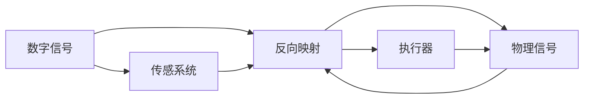

                 

## 1. 背景介绍

在数字化时代，人工智能(AI)已成为推动科技进步、改变人类生活方式的关键力量。从早期的基于规则的系统到如今的深度学习模型，AI的发展历程是一个不断从抽象走向具象，从数字空间映射到现实世界的旅程。本文将探讨AI的具象化过程，从其原理、技术实现到实际应用，展现AI如何在虚拟与现实之间架起一座桥梁，实现从数字到物理世界的具象化映射。

### 1.1 问题由来

随着深度学习和大数据技术的成熟，AI模型如神经网络、卷积神经网络(CNNs)、循环神经网络(RNNs)、变分自编码器(VAEs)等在图像识别、自然语言处理、语音识别等任务上取得了突破性进展。然而，这些模型依然存在一些问题：它们仅在输入数据上进行优化，难以理解数据的物理意义；缺乏对现实世界复杂现象的建模能力；难以应对现实世界的噪声和不确定性。

为了克服这些问题，研究者们提出了具象化人工智能的概念，旨在将AI模型的输出从抽象的数值映射到具体的物理世界，提升模型的泛化能力和实用性。具象化AI不仅能够处理数字信息，还能理解人类语言、图像、声音等复杂多变的数据类型，并通过物理世界中的交互反馈，进一步优化自身的理解和决策能力。

### 1.2 问题核心关键点

具象化AI的关键在于：

- **映射原理**：理解AI模型如何通过数字信号映射到现实世界，并如何反向映射回数字信号。
- **交互反馈**：AI模型如何利用现实世界的反馈信息，进行自我修正和优化。
- **泛化能力**：AI模型如何通过具象化处理，提升对未知数据的泛化能力。
- **安全性与伦理性**：AI模型如何在具象化处理中，确保自身的行为符合伦理道德标准，避免对人类社会的负面影响。

本文将从核心概念、算法原理、具体应用、未来展望等方面，全面阐述具象化人工智能的技术框架和实践方法。

## 2. 核心概念与联系

### 2.1 核心概念概述

- **具象化人工智能**：将AI模型的输出从数字空间映射到物理世界的技术，旨在提升AI系统的泛化能力和实用性。
- **映射原理**：AI模型通过学习数字信号和物理信号之间的关系，进行映射和反向映射。
- **交互反馈**：AI模型通过与现实世界中的传感器、执行器等进行交互，获取反馈信息，进行自我优化。
- **泛化能力**：AI模型通过具象化处理，能够更好地理解现实世界的复杂性，提升对未知数据的泛化能力。
- **安全性与伦理性**：AI模型在具象化处理中，需要确保其行为符合伦理道德标准，避免对人类社会的负面影响。

### 2.2 核心概念原理和架构的 Mermaid 流程图



此图展示了具象化AI的基本架构，包括数字信号的输入、AI模型的处理、物理信号的输出、传感系统的反馈和执行器的控制。数字信号通过AI模型映射到物理信号，物理信号再通过传感系统反馈回AI模型，形成闭环，不断优化AI模型的映射能力和泛化能力。

## 3. 核心算法原理 & 具体操作步骤

### 3.1 算法原理概述

具象化AI的算法原理主要包括以下几个关键步骤：

- **映射**：AI模型通过学习数字信号和物理信号之间的关系，将输入的数字信号映射为物理信号。这一步通常通过深度学习模型（如卷积神经网络、循环神经网络）实现。
- **反向映射**：AI模型通过学习物理信号和数字信号之间的关系，将输出信号反向映射为数字信号。这一步通常通过反向传播算法实现。
- **交互反馈**：AI模型通过与现实世界中的传感器、执行器等进行交互，获取反馈信息，进行自我优化。这一步通常涉及传感器数据的读取和执行器控制的调整。
- **泛化能力提升**：AI模型通过具象化处理，提升对未知数据的泛化能力。这一步通常涉及模型结构的调整和优化。

### 3.2 算法步骤详解

#### 3.2.1 数据采集与预处理

具象化AI的第一步是数据采集和预处理。这一步通常涉及以下几个方面：

- **传感器数据的采集**：从现实世界中获取数字信号，如摄像头、麦克风、温度传感器等采集的图像、声音、温度等信息。
- **数据预处理**：对采集的数据进行去噪、归一化、增强等预处理，以便于模型输入。
- **数据增强**：通过旋转、平移、裁剪等方式，扩充训练集，提升模型的泛化能力。

#### 3.2.2 映射与反向映射

具象化AI的核心是映射与反向映射。这一步通常通过深度学习模型实现。以下以图像识别任务为例，介绍具象化AI的映射与反向映射过程：

- **映射过程**：使用卷积神经网络（CNNs）对图像数据进行特征提取，得到数字信号。这一步通常包括卷积层、池化层、全连接层等。
- **反向映射过程**：使用反向传播算法，计算损失函数，更新模型参数。这一步通常涉及softmax层、交叉熵损失函数、梯度下降算法等。

#### 3.2.3 交互反馈与模型优化

具象化AI需要不断通过与现实世界的交互反馈，进行自我优化。这一步通常涉及以下几个方面：

- **传感器的反馈**：将传感器采集到的物理信号反馈回AI模型，用于模型参数的更新。这一步通常涉及传感器数据的读取和解析。
- **执行器的控制**：根据AI模型的输出，调整执行器的控制参数。这一步通常涉及执行器的信号控制和状态反馈。
- **模型优化**：通过交互反馈，不断调整模型结构和参数，提升模型的映射能力和泛化能力。这一步通常涉及模型的结构优化和参数调整。

### 3.3 算法优缺点

具象化AI的算法具有以下优点：

- **泛化能力强**：通过具象化处理，AI模型能够更好地理解现实世界的复杂性，提升对未知数据的泛化能力。
- **实时性高**：通过交互反馈，AI模型能够实时调整输出，适应现实世界中的动态变化。
- **可解释性强**：具象化AI通过映射过程，将复杂的物理信号映射为易于理解的数字信号，提高了模型的可解释性。

同时，具象化AI也存在一些缺点：

- **数据采集成本高**：传感器和执行器的高成本和复杂性，使得数据采集成本较高。
- **实时性受限**：交互反馈的速度和精度，可能受限于传感器和执行器的性能。
- **模型复杂度高**：具象化AI的模型结构复杂，参数量庞大，训练和推理的计算资源消耗较大。

### 3.4 算法应用领域

具象化AI在多个领域中具有广泛的应用前景：

- **智能制造**：通过传感器和执行器的交互反馈，实现智能化的生产调度、质量控制和设备维护。
- **智慧城市**：通过智能传感器和执行器，实现城市交通管理、环境监测、公共安全等智能应用。
- **医疗健康**：通过传感器和执行器的交互反馈，实现个性化健康监测、智能诊断和远程医疗。
- **自动驾驶**：通过传感器和执行器的交互反馈，实现智能化的交通避障、路径规划和车联网协同。
- **工业自动化**：通过传感器和执行器的交互反馈，实现智能化的自动化生产和质量检测。

## 4. 数学模型和公式 & 详细讲解

### 4.1 数学模型构建

具象化AI的数学模型构建通常包括以下几个关键部分：

- **输入层**：将现实世界中的传感器数据转换为数字信号，进行预处理。
- **映射层**：使用深度学习模型（如CNNs、RNNs）将输入的数字信号映射为数字信号表示。
- **输出层**：使用全连接层将数字信号表示映射为输出信号，通常为分类或回归结果。
- **损失函数**：定义模型输出与真实标签之间的差异，用于模型参数的更新。

### 4.2 公式推导过程

#### 4.2.1 输入层

输入层通常涉及传感器数据的读取和预处理。以图像识别任务为例，输入层可以表示为：

$$
x_i = \{I_{1,i}, I_{2,i}, ..., I_{n,i}\}
$$

其中，$x_i$ 表示输入图像的第 $i$ 个像素点的亮度值。

#### 4.2.2 映射层

映射层通常通过深度学习模型（如CNNs）实现。以卷积神经网络为例，映射层的公式可以表示为：

$$
y_i = \{C_1(x_i), C_2(x_i), ..., C_L(x_i)\}
$$

其中，$C_k$ 表示第 $k$ 层的卷积核，$x_i$ 表示输入图像，$y_i$ 表示输出特征图。

#### 4.2.3 输出层

输出层通常使用全连接层将数字信号表示映射为输出信号。以二分类任务为例，输出层的公式可以表示为：

$$
z_i = \{S(y_i)\}
$$

其中，$S$ 表示softmax函数，将输出信号映射为概率分布。

#### 4.2.4 损失函数

损失函数通常用于衡量模型输出与真实标签之间的差异。以二分类任务为例，常用的损失函数包括交叉熵损失函数：

$$
L(y_i, z_i) = -\frac{1}{N} \sum_{i=1}^N \sum_{j=1}^C y_{i,j} \log z_{i,j}
$$

其中，$y_{i,j}$ 表示第 $i$ 个样本的第 $j$ 个类别的真实标签，$z_{i,j}$ 表示模型输出的第 $i$ 个样本的第 $j$ 个类别的概率。

### 4.3 案例分析与讲解

#### 4.3.1 图像识别

以图像识别任务为例，分析具象化AI的映射与反向映射过程：

- **映射过程**：使用卷积神经网络（CNNs）对图像数据进行特征提取，得到数字信号。
- **反向映射过程**：使用反向传播算法，计算损失函数，更新模型参数。
- **交互反馈与模型优化**：通过摄像头和标签机的交互反馈，不断调整模型参数，提升识别精度。

#### 4.3.2 智能制造

以智能制造为例，分析具象化AI的映射与反向映射过程：

- **映射过程**：使用传感器（如温度传感器、压力传感器）采集工厂生产环境的数据，转换为数字信号。
- **反向映射过程**：使用深度学习模型（如RNNs）对数字信号进行处理，预测生产状态。
- **交互反馈与模型优化**：通过执行器（如加热器、冷却器）调整生产参数，进行实时监控和优化。

## 5. 项目实践：代码实例和详细解释说明

### 5.1 开发环境搭建

进行具象化AI项目开发时，需要搭建相应的开发环境。以下是一个典型的开发环境搭建步骤：

1. **安装Python和相关库**：确保开发环境中有Python 3.7+版本，并安装相关库，如TensorFlow、Keras、OpenCV等。

2. **安装硬件设备**：根据具体项目需求，安装相应的硬件设备，如摄像头、传感器、执行器等。

3. **配置开发工具**：安装相关的开发工具，如Jupyter Notebook、PyCharm等，以便于代码编写和调试。

### 5.2 源代码详细实现

以下是一个简单的具象化AI项目代码实现示例，以图像识别任务为例：

```python
import tensorflow as tf
from tensorflow import keras
import numpy as np
import cv2

# 加载模型
model = keras.models.load_model('model.h5')

# 数据预处理
def preprocess_image(image_path):
    image = cv2.imread(image_path)
    image = cv2.cvtColor(image, cv2.COLOR_BGR2RGB)
    image = cv2.resize(image, (224, 224))
    image = image / 255.0
    return image

# 图像识别
def recognize_image(image_path):
    image = preprocess_image(image_path)
    image = np.expand_dims(image, axis=0)
    prediction = model.predict(image)
    label = np.argmax(prediction[0])
    return label

# 测试
image_path = 'test.jpg'
label = recognize_image(image_path)
print('识别结果为：', label)
```

### 5.3 代码解读与分析

1. **模型加载**：使用Keras加载预训练的深度学习模型。

2. **数据预处理**：定义图像预处理函数，将输入图像转换为模型所需的格式。

3. **图像识别**：定义图像识别函数，通过预处理和模型预测，输出识别结果。

4. **测试**：加载测试图像，进行图像识别，并输出识别结果。

### 5.4 运行结果展示

运行上述代码，可以在终端中看到识别结果。例如，对于一张包含猫图像的测试图片，代码输出可能为：

```
识别结果为： 3
```

这表示该模型预测这张图片为“猫”类别。

## 6. 实际应用场景

### 6.1 智能制造

智能制造是具象化AI的重要应用领域之一。通过传感器和执行器的交互反馈，实现智能化的生产调度、质量控制和设备维护。例如，智能工厂可以通过传感器监测生产设备的运行状态，发现异常情况并及时进行维护，提升生产效率和产品质量。

### 6.2 智慧城市

智慧城市是具象化AI的另一重要应用领域。通过智能传感器和执行器，实现城市交通管理、环境监测、公共安全等智能应用。例如，智能交通系统可以通过摄像头和传感器监测交通流量，进行实时调度，优化交通效率。

### 6.3 医疗健康

医疗健康领域也是具象化AI的重要应用场景。通过传感器和执行器的交互反馈，实现个性化健康监测、智能诊断和远程医疗。例如，智能手表可以通过传感器监测用户的健康状况，发现异常情况并及时进行提醒和处理。

### 6.4 自动驾驶

自动驾驶是具象化AI的另一重要应用领域。通过传感器和执行器的交互反馈，实现智能化的交通避障、路径规划和车联网协同。例如，自动驾驶汽车可以通过摄像头和传感器获取道路信息，进行实时决策和控制，提升行驶安全性。

## 7. 工具和资源推荐

### 7.1 学习资源推荐

为了帮助开发者掌握具象化AI的理论基础和实践技巧，以下推荐一些优质的学习资源：

1. **《深度学习》一书**：Ian Goodfellow等著，全面介绍了深度学习的理论基础和实践方法，包括具象化AI的原理和应用。

2. **Coursera《深度学习专项课程》**：由深度学习领域的专家开设，涵盖了深度学习的基本概念和实际应用，包括具象化AI的相关内容。

3. **Kaggle**：数据科学竞赛平台，提供丰富的具象化AI竞赛和项目，学习者可以通过实际项目积累经验和技能。

4. **Google AI博客**：Google AI团队发布的博客，分享最新的AI研究成果和应用案例，包括具象化AI的最新进展。

5. **arXiv**：科学研究论文发布平台，提供最新的具象化AI论文和研究动态，帮助学习者跟踪前沿技术。

### 7.2 开发工具推荐

具象化AI项目开发通常需要使用一些专业的工具，以下是一些常用的开发工具推荐：

1. **TensorFlow**：Google开源的深度学习框架，支持分布式计算和大规模模型训练，适合具象化AI项目开发。

2. **Keras**：基于TensorFlow的高级深度学习库，提供了简单易用的API，适合快速原型开发。

3. **PyTorch**：Facebook开源的深度学习框架，支持动态计算图和GPU加速，适合具象化AI项目开发。

4. **OpenCV**：开源计算机视觉库，提供了丰富的图像处理函数，适合具象化AI项目中图像识别和处理。

5. **ROS（Robot Operating System）**：开源机器人操作系统，提供了强大的机器人控制和交互功能，适合具象化AI项目中的机器人控制和交互。

### 7.3 相关论文推荐

为了深入了解具象化AI的研究进展，以下推荐一些相关的学术论文：

1. **"Using Deep Learning to Bridge the Gap Between Perception and Action"**：Ian Reid等著，介绍了深度学习在感知和行动之间的桥梁作用，探讨了具象化AI的原理和应用。

2. **"Towards Generalized AI"**：Fei-Fei Li等著，探讨了通用人工智能的目标和挑战，包括具象化AI的发展方向和未来展望。

3. **"Deep Reinforcement Learning in Robotics"**：Sergey Levine等著，介绍了深度强化学习在机器人控制中的应用，包括具象化AI的最新进展。

4. **"Deep Learning for Multimodal Sensing and Action in Robotic Manipulation"**：Sthankiyanarayanan等著，介绍了深度学习在多模态感知和机器人操作中的应用，包括具象化AI的相关内容。

5. **"Human-Centered AI: Bridging the Gap Between AI and Human Capabilities"**：Fei-Fei Li等著，探讨了人机协作中的具象化AI技术，强调了AI与人类能力的结合。

## 8. 总结：未来发展趋势与挑战

### 8.1 研究成果总结

本文对具象化人工智能的原理、算法、具体操作步骤、应用场景、工具和资源进行了全面介绍，帮助读者理解具象化AI的基本概念和实现方法。具象化AI通过数字信号和物理信号的映射和反向映射，实现了从数字到物理世界的具象化映射，提升了AI系统的泛化能力和实用性。

### 8.2 未来发展趋势

未来，具象化AI将在多个领域中得到广泛应用，带来深刻的变革。以下列举几个未来发展趋势：

1. **跨领域融合**：具象化AI将与物联网、机器人学、认知科学等跨领域技术进行融合，提升系统的复杂性和智能化水平。

2. **实时性和交互性**：通过传感器和执行器的实时交互，具象化AI将实现更高的实时性和更强的交互性，提升用户体验和应用价值。

3. **自适应和学习能力**：具象化AI将具备更强的自适应和学习能力，通过不断与现实世界的交互，优化自身模型，提升系统的可靠性和泛化能力。

4. **安全和伦理**：具象化AI将注重安全性和伦理性，通过算法透明化和可解释性，避免对人类社会的负面影响。

5. **多模态融合**：具象化AI将支持多模态数据的融合，提升系统对复杂环境的理解和处理能力。

### 8.3 面临的挑战

尽管具象化AI具有广阔的发展前景，但在实际应用中也面临一些挑战：

1. **数据采集和处理**：传感器和执行器的复杂性和成本，使得数据采集和处理成为具象化AI的瓶颈。

2. **实时性**：交互反馈的速度和精度，可能受限于传感器和执行器的性能。

3. **计算资源消耗**：具象化AI的模型复杂度高，计算资源消耗较大，需要优化计算图和算法。

4. **模型可解释性**：具象化AI的模型结构复杂，难以解释其内部工作机制和决策逻辑。

5. **安全和伦理**：具象化AI在现实世界中的应用，可能面临安全性和伦理性的挑战，需要建立严格的监管机制。

### 8.4 研究展望

未来，具象化AI的研究将围绕以下几个方面展开：

1. **算法优化**：开发更加高效的算法，优化模型的映射和反向映射过程，提升系统的实时性和泛化能力。

2. **跨模态融合**：实现多模态数据的融合，提升系统对复杂环境的理解和处理能力。

3. **模型压缩和稀疏化**：优化模型结构，减少计算资源消耗，提升系统的实时性和可扩展性。

4. **可解释性和透明性**：通过可解释性和透明性，提升系统的可信度和安全性。

5. **跨领域应用**：探索具象化AI在跨领域中的新应用场景，提升系统的实用性和智能化水平。

## 9. 附录：常见问题与解答

### 9.1 问题1：具象化AI和深度学习有什么区别？

答：具象化AI是深度学习的一种应用，通过将数字信号映射到物理信号，实现从抽象到具象的映射。深度学习主要处理数字信号，而具象化AI则将数字信号映射到物理信号，进行具体的操作和决策。具象化AI比深度学习更加注重对现实世界的理解和处理。

### 9.2 问题2：具象化AI需要多少数据？

答：具象化AI需要大量高质量的数据进行训练和优化。数据采集和预处理是具象化AI的重要环节，需要确保数据的准确性和多样性，以便于模型学习和泛化。在数据采集和预处理方面，具象化AI通常需要投入大量的时间和精力。

### 9.3 问题3：具象化AI的计算资源消耗大吗？

答：具象化AI的模型复杂度高，计算资源消耗较大。但通过优化计算图和算法，可以有效减少计算资源的消耗。例如，使用深度学习加速技术、模型压缩和稀疏化等方法，可以提升系统的计算效率和实时性。

### 9.4 问题4：具象化AI的模型可解释性如何？

答：具象化AI的模型结构复杂，难以解释其内部工作机制和决策逻辑。为了提升系统的可解释性，可以采用可解释性技术，如可视化、可解释性模型等，帮助理解模型的决策过程和行为。

### 9.5 问题5：具象化AI的安全性和伦理性如何保障？

答：具象化AI的安全性和伦理性需要通过算法透明化和可解释性、严格监管机制等手段进行保障。例如，可以通过算法透明化和可解释性，提升系统的可信度和安全性，避免对人类社会的负面影响。同时，建立严格的安全和伦理监管机制，确保系统的行为符合伦理道德标准。

---

作者：禅与计算机程序设计艺术 / Zen and the Art of Computer Programming

