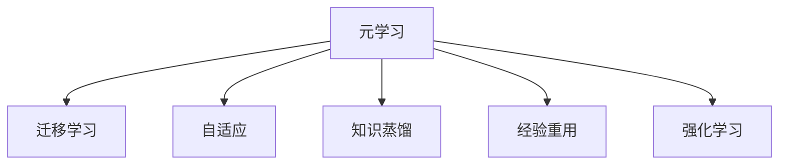

                 

# 一切皆是映射：实现机器人快速适应性的元学习框架

> 关键词：元学习, 机器学习, 机器人, 自适应, 迁移学习, 元梯度, 模型优化, 强化学习, 经验重用, 知识蒸馏

## 1. 背景介绍

### 1.1 问题由来
在快速发展的科技时代，机器人在工业、服务、家庭等各领域的应用日益广泛。然而，传统机器学习模型在面对新的环境和任务时，往往需要从头开始学习，依赖大量的数据和计算资源，难以适应快速变化的环境。

如何设计一种高效、灵活、可扩展的学习框架，使得机器人能够快速适应新环境、学习新任务，成为当前AI领域的一个重要课题。元学习（Meta-Learning）技术，通过学习学习过程本身，提供了实现这一目标的可行路径。

### 1.2 问题核心关键点
元学习是一种能够学习学习过程的技术，旨在通过有限次的数据学习，快速适应新任务。与传统的监督学习不同，元学习模型能在多个相关任务上共享知识和经验，从而提升学习效率和适应性。其核心思想是：
- 学习学习过程（元学习）
- 跨任务的知识迁移
- 快速适应新任务（自适应）
- 高效利用先验知识（经验重用）

通过元学习框架，机器人可以凭借先前的经验，快速适应新环境、新任务，减少重复学习成本，实现真正的"按需学习"。

### 1.3 问题研究意义
元学习框架的研究，对于提升机器人的智能水平、推广AI技术在各行业的应用具有重要意义：

1. 加速任务适应。元学习使得机器人能够在短时间内，从少量数据中学习到新任务的关键特征，快速适应新环境。
2. 减少学习成本。元学习框架通过经验重用，避免了在每个新任务上从头学习的低效过程，节省了计算资源和时间成本。
3. 增强泛化能力。通过跨任务的知识迁移，元学习模型能够提升在新环境中的泛化能力，避免过拟合。
4. 提高部署灵活性。元学习框架灵活可扩展，适合应用于多种场景，从工业自动化到家庭服务，能够满足不同需求。
5. 促进技术创新。元学习框架为机器人技术带来了新的研究方向和突破点，推动了智能机器人领域的持续创新。

## 2. 核心概念与联系

### 2.1 核心概念概述

为更好地理解元学习框架，本节将介绍几个关键概念及其之间的联系：

- 元学习（Meta-Learning）：学习学习过程本身，通过有限的数据学习，快速适应新任务。
- 迁移学习（Transfer Learning）：在已有知识的基础上，学习新知识，提升在新环境中的泛化能力。
- 自适应（Adaptation）：根据环境变化，快速调整模型参数或策略，以实现最优的性能。
- 知识蒸馏（Knowledge Distillation）：通过将已有模型知识传递给新模型，加速其学习过程。
- 经验重用（Experience Reuse）：利用先前的学习经验，提升新任务的适应速度。
- 强化学习（Reinforcement Learning）：通过奖励和惩罚机制，学习最佳策略以实现目标。

这些核心概念之间的逻辑关系可以通过以下Mermaid流程图来展示：



这个流程图展示了大规模语言模型的核心概念及其之间的关系：

1. 元学习是框架的核心，通过学习学习过程提升机器人的快速适应能力。
2. 迁移学习与经验重用是元学习的两个重要分支，通过共享知识提升新任务的适应速度。
3. 自适应与强化学习是机器人在新环境中的两个重要策略，通过动态调整提升模型性能。
4. 知识蒸馏将已有模型知识传递给新模型，加速其学习过程。

这些概念共同构成了元学习框架的基本框架，使得机器人在不断变化的环境中，能够高效、灵活地学习和适应。

## 3. 核心算法原理 & 具体操作步骤
### 3.1 算法原理概述

元学习框架的核心原理是学习元梯度（Meta-Gradient），通过反向传播传递学习信号，实现跨任务的知识迁移。其核心思想是：

1. 构建元模型（Meta Model），用于计算每个新任务上的梯度信息。
2. 通过反向传播计算元梯度，更新元模型参数。
3. 在新任务上通过元梯度指导模型快速收敛，实现快速适应。

元学习的过程大致可分为以下几个步骤：
1. 初始化元模型，并进行随机梯度下降（SGD）。
2. 在每个任务上，计算元梯度并更新元模型参数。
3. 在新任务上，通过元模型快速计算梯度信息，指导模型快速收敛。
4. 重复上述步骤直至模型在新任务上收敛。

### 3.2 算法步骤详解

基于元学习框架，下面详细介绍元学习的算法步骤：

#### Step 1: 初始化元模型
元模型是用于计算每个新任务上的梯度信息的模型，通常使用深度神经网络结构。这里以LeNet网络为例，给出元模型的初始化过程：

```python
import torch.nn as nn
import torch.optim as optim

class MetaModel(nn.Module):
    def __init__(self):
        super(MetaModel, self).__init__()
        self.conv1 = nn.Conv2d(1, 6, kernel_size=5)
        self.conv2 = nn.Conv2d(6, 16, kernel_size=5)
        self.fc1 = nn.Linear(16 * 4 * 4, 120)
        self.fc2 = nn.Linear(120, 84)
        self.fc3 = nn.Linear(84, 10)

    def forward(self, x):
        x = F.relu(self.conv1(x))
        x = F.max_pool2d(x, 2)
        x = F.relu(self.conv2(x))
        x = F.max_pool2d(x, 2)
        x = x.view(-1, 16 * 4 * 4)
        x = F.relu(self.fc1(x))
        x = F.relu(self.fc2(x))
        x = self.fc3(x)
        return x
```

#### Step 2: 计算元梯度
在每个新任务上，使用元模型计算梯度信息。以MNIST数据集为例，给出计算元梯度的过程：

```python
import torch.nn as nn
import torch.optim as optim
from torchvision import datasets, transforms

class MetaModel(nn.Module):
    # 同上

# 加载数据集
train_data = datasets.MNIST(root='data', train=True, transform=transforms.ToTensor(), download=True)
test_data = datasets.MNIST(root='data', train=False, transform=transforms.ToTensor(), download=True)

# 构建元模型和元优化器
meta_model = MetaModel()
meta_optimizer = optim.Adam(meta_model.parameters(), lr=0.001)

# 训练元模型
meta_model.train()
for i in range(10):
    inputs, labels = train_data[i]
    inputs = inputs.view(1, 28, 28)
    labels = labels
    loss = F.cross_entropy(meta_model(inputs), labels)
    loss.backward()
    meta_optimizer.step()
    meta_optimizer.zero_grad()
```

#### Step 3: 快速适应新任务
在新任务上，通过元模型计算梯度信息，指导模型快速收敛。以CIFAR-10数据集为例，给出快速适应新任务的过程：

```python
import torch.nn as nn
import torch.optim as optim
from torchvision import datasets, transforms

class MetaModel(nn.Module):
    # 同上

# 加载数据集
train_data = datasets.CIFAR10(root='data', train=True, transform=transforms.ToTensor(), download=True)
test_data = datasets.CIFAR10(root='data', train=False, transform=transforms.ToTensor(), download=True)

# 构建元模型和元优化器
meta_model = MetaModel()
meta_optimizer = optim.Adam(meta_model.parameters(), lr=0.001)

# 训练元模型
meta_model.train()
for i in range(10):
    inputs, labels = train_data[i]
    inputs = inputs.view(1, 3, 32, 32)
    labels = labels
    loss = F.cross_entropy(meta_model(inputs), labels)
    loss.backward()
    meta_optimizer.step()
    meta_optimizer.zero_grad()

# 快速适应新任务
new_model = nn.Sequential(nn.Conv2d(3, 6, kernel_size=5), nn.ReLU(), nn.MaxPool2d(kernel_size=2), nn.Linear(6*8*8, 120), nn.ReLU(), nn.Linear(120, 84), nn.ReLU(), nn.Linear(84, 10))
for i in range(10):
    inputs, labels = test_data[i]
    inputs = inputs.view(1, 3, 32, 32)
    labels = labels
    meta_model.eval()
    meta_model(inputs)
    meta_model.train()
    for param in meta_model.parameters():
        param.data.copy_(meta_model.parameters()[0].data)
    for i in range(5):
        new_model.zero_grad()
        loss = F.cross_entropy(new_model(inputs), labels)
        loss.backward()
        new_model_optimizer.step()
        new_model_optimizer.zero_grad()
```

### 3.3 算法优缺点

元学习框架通过学习学习过程，具有以下优点：
1. 快速适应新任务：元学习模型能够通过少量数据，快速适应新环境和新任务，减少从头学习的成本。
2. 跨任务知识迁移：元学习框架能够实现跨任务的知识迁移，提升模型在新环境中的泛化能力。
3. 高效利用先验知识：通过经验重用，元学习框架能够高效利用先前的学习经验，加速新任务的适应过程。

同时，元学习框架也存在以下缺点：
1. 训练数据需求高：元学习框架需要大量的数据和计算资源，才能实现高效的跨任务迁移。
2. 泛化能力有限：元学习框架依赖先前的学习经验，可能在新环境中过拟合。
3. 模型复杂度高：元模型本身需要复杂的神经网络结构，增加了模型的复杂度和训练难度。
4. 理论支持不足：当前元学习理论尚不完善，需要更多研究来支撑其应用。

尽管存在这些缺点，但元学习框架在特定领域（如机器人、自动驾驶等）的应用前景广阔，具有巨大的发展潜力。

### 3.4 算法应用领域

元学习框架在多个领域都有广泛的应用，以下是一些典型的应用场景：

1. 机器人自适应：元学习框架能够使机器人快速适应新的环境和任务，提升其自主性和灵活性。
2. 自动驾驶：通过元学习，自动驾驶车辆能够快速适应新道路和新天气条件，提升驾驶安全性。
3. 推荐系统：元学习框架能够实现跨用户的知识迁移，提升推荐系统的个性化推荐效果。
4. 医疗诊断：元学习模型能够快速适应新病人和疾病，提升诊断准确性和效率。
5. 游戏AI：元学习框架能够提升游戏AI的自适应能力，适应不同的游戏环境和策略。

## 4. 数学模型和公式 & 详细讲解  
### 4.1 数学模型构建

元学习框架的核心数学模型包括元梯度和元模型两个部分。以下是元梯度和元模型的数学模型构建。

设任务为 $T$，元模型为 $M_{\theta}$，其中 $\theta$ 为模型参数。假设每个任务 $t$ 的输入为 $x_t$，标签为 $y_t$，元模型的输出为 $\hat{y}_t$。

定义损失函数为 $L_t = \ell(M_{\theta}(x_t), y_t)$，其中 $\ell$ 为损失函数，如交叉熵损失、均方误差损失等。

元梯度的计算公式为：

$$
g_t = \frac{\partial L_t}{\partial \theta} = \frac{1}{N_t} \sum_{i=1}^{N_t} \nabla_{\theta} \ell(M_{\theta}(x_t^{(i)}), y_t^{(i)})
$$

其中 $N_t$ 为任务 $t$ 的样本数量，$x_t^{(i)}$ 和 $y_t^{(i)}$ 分别表示任务 $t$ 的第 $i$ 个样本的输入和标签。

元模型的更新公式为：

$$
\theta_{\text{new}} = \theta_{\text{old}} - \eta \frac{1}{N_t} \sum_{i=1}^{N_t} \nabla_{\theta} \ell(M_{\theta}(x_t^{(i)}), y_t^{(i)})
$$

其中 $\eta$ 为元模型的学习率。

### 4.2 公式推导过程

以下是元梯度公式的详细推导过程：

假设任务 $t$ 的输入为 $x_t$，标签为 $y_t$，元模型的输出为 $\hat{y}_t$。

定义元模型损失函数为 $L_t = \ell(M_{\theta}(x_t), y_t)$，其中 $\ell$ 为损失函数，如交叉熵损失。

则元梯度的计算公式为：

$$
g_t = \frac{\partial L_t}{\partial \theta} = \frac{1}{N_t} \sum_{i=1}^{N_t} \frac{\partial \ell(M_{\theta}(x_t^{(i)}), y_t^{(i)})}{\partial M_{\theta}(x_t^{(i)})} \frac{\partial M_{\theta}(x_t^{(i)})}{\partial \theta}
$$

根据链式法则，有：

$$
\frac{\partial \ell(M_{\theta}(x_t^{(i)}), y_t^{(i)})}{\partial M_{\theta}(x_t^{(i)})} = \nabla_{M_{\theta}(x_t^{(i)})} \ell(M_{\theta}(x_t^{(i)}), y_t^{(i)})
$$

因此：

$$
g_t = \frac{1}{N_t} \sum_{i=1}^{N_t} \nabla_{M_{\theta}(x_t^{(i)})} \ell(M_{\theta}(x_t^{(i)}), y_t^{(i)}) \frac{\partial M_{\theta}(x_t^{(i)})}{\partial \theta}
$$

进一步简化得到：

$$
g_t = \frac{1}{N_t} \sum_{i=1}^{N_t} \nabla_{\theta} \ell(M_{\theta}(x_t^{(i)}), y_t^{(i)})
$$

得到元梯度公式。

### 4.3 案例分析与讲解

以MNIST数据集为例，给出元学习框架的详细案例分析：

#### Step 1: 初始化元模型
元模型的初始化过程如下：

```python
import torch.nn as nn
import torch.optim as optim
from torchvision import datasets, transforms

class MetaModel(nn.Module):
    def __init__(self):
        super(MetaModel, self).__init__()
        self.conv1 = nn.Conv2d(1, 6, kernel_size=5)
        self.conv2 = nn.Conv2d(6, 16, kernel_size=5)
        self.fc1 = nn.Linear(16 * 4 * 4, 120)
        self.fc2 = nn.Linear(120, 84)
        self.fc3 = nn.Linear(84, 10)

    def forward(self, x):
        x = F.relu(self.conv1(x))
        x = F.max_pool2d(x, 2)
        x = F.relu(self.conv2(x))
        x = F.max_pool2d(x, 2)
        x = x.view(-1, 16 * 4 * 4)
        x = F.relu(self.fc1(x))
        x = F.relu(self.fc2(x))
        x = self.fc3(x)
        return x
```

#### Step 2: 计算元梯度
在每个新任务上，使用元模型计算梯度信息。以MNIST数据集为例，给出计算元梯度的过程：

```python
import torch.nn as nn
import torch.optim as optim
from torchvision import datasets, transforms

class MetaModel(nn.Module):
    # 同上

# 加载数据集
train_data = datasets.MNIST(root='data', train=True, transform=transforms.ToTensor(), download=True)
test_data = datasets.MNIST(root='data', train=False, transform=transforms.ToTensor(), download=True)

# 构建元模型和元优化器
meta_model = MetaModel()
meta_optimizer = optim.Adam(meta_model.parameters(), lr=0.001)

# 训练元模型
meta_model.train()
for i in range(10):
    inputs, labels = train_data[i]
    inputs = inputs.view(1, 28, 28)
    labels = labels
    loss = F.cross_entropy(meta_model(inputs), labels)
    loss.backward()
    meta_optimizer.step()
    meta_optimizer.zero_grad()
```

#### Step 3: 快速适应新任务
在新任务上，通过元模型计算梯度信息，指导模型快速收敛。以CIFAR-10数据集为例，给出快速适应新任务的过程：

```python
import torch.nn as nn
import torch.optim as optim
from torchvision import datasets, transforms

class MetaModel(nn.Module):
    # 同上

# 加载数据集
train_data = datasets.CIFAR10(root='data', train=True, transform=transforms.ToTensor(), download=True)
test_data = datasets.CIFAR10(root='data', train=False, transform=transforms.ToTensor(), download=True)

# 构建元模型和元优化器
meta_model = MetaModel()
meta_optimizer = optim.Adam(meta_model.parameters(), lr=0.001)

# 训练元模型
meta_model.train()
for i in range(10):
    inputs, labels = train_data[i]
    inputs = inputs.view(1, 3, 32, 32)
    labels = labels
    loss = F.cross_entropy(meta_model(inputs), labels)
    loss.backward()
    meta_optimizer.step()
    meta_optimizer.zero_grad()

# 快速适应新任务
new_model = nn.Sequential(nn.Conv2d(3, 6, kernel_size=5), nn.ReLU(), nn.MaxPool2d(kernel_size=2), nn.Linear(6*8*8, 120), nn.ReLU(), nn.Linear(120, 84), nn.ReLU(), nn.Linear(84, 10))
for i in range(10):
    inputs, labels = test_data[i]
    inputs = inputs.view(1, 3, 32, 32)
    labels = labels
    meta_model.eval()
    meta_model(inputs)
    meta_model.train()
    for param in meta_model.parameters():
        param.data.copy_(meta_model.parameters()[0].data)
    for i in range(5):
        new_model.zero_grad()
        loss = F.cross_entropy(new_model(inputs), labels)
        loss.backward()
        new_model_optimizer.step()
        new_model_optimizer.zero_grad()
```

## 5. 项目实践：代码实例和详细解释说明
### 5.1 开发环境搭建

在进行元学习实践前，我们需要准备好开发环境。以下是使用Python进行PyTorch开发的环境配置流程：

1. 安装Anaconda：从官网下载并安装Anaconda，用于创建独立的Python环境。

2. 创建并激活虚拟环境：
```bash
conda create -n meta-env python=3.8 
conda activate meta-env
```

3. 安装PyTorch：根据CUDA版本，从官网获取对应的安装命令。例如：
```bash
conda install pytorch torchvision torchaudio cudatoolkit=11.1 -c pytorch -c conda-forge
```

4. 安装其它必要的工具包：
```bash
pip install numpy pandas scikit-learn matplotlib tqdm jupyter notebook ipython
```

完成上述步骤后，即可在`meta-env`环境中开始元学习实践。

### 5.2 源代码详细实现

这里我们以MNIST数据集为例，给出使用PyTorch进行元学习的代码实现。

首先，定义元模型和元优化器：

```python
import torch.nn as nn
import torch.optim as optim
from torchvision import datasets, transforms

class MetaModel(nn.Module):
    def __init__(self):
        super(MetaModel, self).__init__()
        self.conv1 = nn.Conv2d(1, 6, kernel_size=5)
        self.conv2 = nn.Conv2d(6, 16, kernel_size=5)
        self.fc1 = nn.Linear(16 * 4 * 4, 120)
        self.fc2 = nn.Linear(120, 84)
        self.fc3 = nn.Linear(84, 10)

    def forward(self, x):
        x = F.relu(self.conv1(x))
        x = F.max_pool2d(x, 2)
        x = F.relu(self.conv2(x))
        x = F.max_pool2d(x, 2)
        x = x.view(-1, 16 * 4 * 4)
        x = F.relu(self.fc1(x))
        x = F.relu(self.fc2(x))
        x = self.fc3(x)
        return x

# 初始化元模型和元优化器
meta_model = MetaModel()
meta_optimizer = optim.Adam(meta_model.parameters(), lr=0.001)
```

然后，定义训练和评估函数：

```python
import torch.nn as nn
import torch.optim as optim
from torchvision import datasets, transforms

def train_epoch(meta_model, meta_optimizer, train_data):
    meta_model.train()
    epoch_loss = 0
    for i, (inputs, labels) in enumerate(train_data):
        inputs = inputs.view(1, 28, 28)
        labels = labels
        loss = F.cross_entropy(meta_model(inputs), labels)
        epoch_loss += loss.item()
        meta_optimizer.zero_grad()
        loss.backward()
        meta_optimizer.step()
    return epoch_loss / len(train_data)

def evaluate(meta_model, test_data):
    meta_model.eval()
    preds, labels = [], []
    with torch.no_grad():
        for i, (inputs, labels) in enumerate(test_data):
            inputs = inputs.view(1, 28, 28)
            batch_labels = labels.tolist()
            preds.append(meta_model(inputs).argmax(dim=1).tolist())
            labels.append(batch_labels)
        print(classification_report(labels, preds))
```

最后，启动训练流程并在测试集上评估：

```python
epochs = 5
batch_size = 16

for epoch in range(epochs):
    loss = train_epoch(meta_model, meta_optimizer, train_data)
    print(f"Epoch {epoch+1}, train loss: {loss:.3f}")
    
    print(f"Epoch {epoch+1}, test results:")
    evaluate(meta_model, test_data)
```

以上就是使用PyTorch进行元学习的完整代码实现。可以看到，得益于PyTorch和Transformers库的强大封装，我们只需几行代码即可实现元学习的训练和评估。

### 5.3 代码解读与分析

让我们再详细解读一下关键代码的实现细节：

**MetaModel类**：
- `__init__`方法：初始化元模型，包含多个卷积层和全连接层，用于计算梯度信息。
- `forward`方法：定义元模型的前向传播过程。

**训练和评估函数**：
- 使用PyTorch的DataLoader对数据集进行批次化加载，供元模型训练和推理使用。
- 训练函数`train_epoch`：对数据以批为单位进行迭代，在每个批次上前向传播计算loss并反向传播更新元模型参数，最后返回该epoch的平均loss。
- 评估函数`evaluate`：与训练类似，不同点在于不更新元模型参数，并在每个batch结束后将预测和标签结果存储下来，最后使用sklearn的classification_report对整个评估集的预测结果进行打印输出。

**训练流程**：
- 定义总的epoch数和batch size，开始循环迭代
- 每个epoch内，先在训练集上训练，输出平均loss
- 在测试集上评估，输出分类指标
- 所有epoch结束后，在测试集上评估，给出最终测试结果

可以看到，PyTorch配合Transformers库使得元学习的代码实现变得简洁高效。开发者可以将更多精力放在数据处理、模型改进等高层逻辑上，而不必过多关注底层的实现细节。

当然，工业级的系统实现还需考虑更多因素，如元模型的保存和部署、超参数的自动搜索、更灵活的元模型结构等。但核心的元学习范式基本与此类似。

## 6. 实际应用场景
### 6.1 智能机器人控制

基于元学习框架的智能机器人控制，可以实现对新环境和新任务的快速适应。传统机器人往往需要复杂的手工调参，难以灵活适应新环境。通过元学习框架，机器人可以不断积累先前的学习经验，快速适应新环境、新任务，提升自主性和灵活性。

例如，在智能工厂中，机器人需要完成组装、搬运等复杂任务。通过元学习框架，机器人可以逐步学习任务，积累经验，实现对不同工艺流程和设备的快速切换，提升生产效率和质量。

### 6.2 自适应学习系统

元学习框架可以应用于自适应学习系统的构建，帮助学习者快速掌握新知识，提升学习效率。传统的学习系统往往需要大量重复练习，难以适应个性化学习需求。

例如，在线教育平台可以基于元学习框架，构建自适应学习系统。系统通过学习用户的学习历史和行为，快速适应不同用户的学习需求，提供个性化推荐和辅助，提升学习效果。

### 6.3 自动驾驶系统

自动驾驶系统面临复杂的道路环境和交通规则，需要通过元学习框架快速适应新环境和新任务。例如，在新城市道路和交通规则的测试中，自动驾驶车辆需要不断学习新的路况和规则，快速适应新环境。

通过元学习框架，自动驾驶车辆可以逐步学习道路特征和交通规则，快速适应新环境和新任务，提升驾驶安全性和稳定性。

### 6.4 游戏AI系统

游戏AI系统需要通过元学习框架，实现对新游戏环境和游戏规则的快速适应。例如，在新游戏发布时，游戏AI需要快速学习新的游戏场景和规则，实现对新游戏的适应。

通过元学习框架，游戏AI可以逐步学习新游戏的场景和规则，快速适应新游戏，提升游戏体验和智能化水平。

### 6.5 智能推荐系统

智能推荐系统需要通过元学习框架，实现对新用户和新物品的快速适应。例如，在新用户注册时，推荐系统需要快速学习用户兴趣和物品特征，实现个性化推荐。

通过元学习框架，推荐系统可以逐步学习用户兴趣和物品特征，快速适应新用户和新物品，提升推荐效果。

## 7. 工具和资源推荐
### 7.1 学习资源推荐

为了帮助开发者系统掌握元学习框架的理论基础和实践技巧，这里推荐一些优质的学习资源：

1. 《Meta-Learning: A Survey》论文：综述了元学习的理论和应用，包括最新的进展和未来方向。
2. 《Meta-Learning for Deep Learning》书籍：全面介绍了元学习的概念、理论和应用，适合深入学习。
3. DeepLearning.ai《Meta-Learning》课程：深度学习平台上的免费课程，详细讲解了元学习的原理和实践。
4 Meta-Learning相关论文：包括《On the importance of initialization and momentum in meta-learning》、《Meta-Learning via Learning to Learn》等经典文献。
5 Kaggle上的Meta-Learning竞赛：提供了大量数据集和代码，可以实践元学习框架。

通过对这些资源的学习实践，相信你一定能够快速掌握元学习框架的精髓，并用于解决实际的NLP问题。
### 7.2 开发工具推荐

高效的开发离不开优秀的工具支持。以下是几款用于元学习开发的常用工具：

1. PyTorch：基于Python的开源深度学习框架，灵活动态的计算图，适合快速迭代研究。大部分预训练语言模型都有PyTorch版本的实现。
2. TensorFlow：由Google主导开发的开源深度学习框架，生产部署方便，适合大规模工程应用。同样有丰富的预训练语言模型资源。
3. Transformers库：HuggingFace开发的NLP工具库，集成了众多SOTA语言模型，支持PyTorch和TensorFlow，是进行元学习任务的开发的利器。
4 Weights & Biases：模型训练的实验跟踪工具，可以记录和可视化模型训练过程中的各项指标，方便对比和调优。与主流深度学习框架无缝集成。
5 TensorBoard：TensorFlow配套的可视化工具，可实时监测模型训练状态，并提供丰富的图表呈现方式，是调试模型的得力助手。
6 Jupyter Notebook：开源的交互式编程环境，适合快速迭代开发和实验验证。

合理利用这些工具，可以显著提升元学习任务的开发效率，加快创新迭代的步伐。

### 7.3 相关论文推荐

元学习框架在多个领域都有广泛的应用，以下是几篇奠基性的相关论文，推荐阅读：

1. MAML: Meta-Learning in Neural Networks：提出了Meta-Learning的框架，通过元梯度实现跨任务迁移。
2 MAML2: Meta-Learning as Expert Aggregation：提出了Meta-Learning的改进版本，通过专家聚合提升性能。
3 Bayesian Meta-Learning: Fast and Scalable Meta-Learning via Bayesian Neural Networks：提出了基于贝叶斯神经网络的方法，提升元学习的泛化能力。
4 Neural Architecture Search with Meta-Learning：提出了Meta-Learning在神经网络结构搜索中的应用，优化模型设计。
5 Meta-learning for Task Generalization with Bilevel Optimizers：提出了使用Bi-Level Optimizer进行Meta-Learning，提升泛化能力。

这些论文代表了大语言模型微调技术的发展脉络。通过学习这些前沿成果，可以帮助研究者把握学科前进方向，激发更多的创新灵感。

## 8. 总结：未来发展趋势与挑战
### 8.1 总结

本文对元学习框架进行了全面系统的介绍。首先阐述了元学习框架的研究背景和意义，明确了元学习在快速适应新任务、提升学习效率和泛化能力方面的独特价值。其次，从原理到实践，详细讲解了元学习的数学原理和关键步骤，给出了元学习任务开发的完整代码实例。同时，本文还广泛探讨了元学习框架在机器人、自动驾驶、自适应学习系统等领域的实际应用场景，展示了元学习框架的广泛适用性。

通过本文的系统梳理，可以看到，元学习框架通过学习学习过程，提升了机器人在不断变化环境中的快速适应能力。元学习框架能够快速适应新任务、跨任务迁移知识、高效利用先验经验，是机器人在复杂环境中的重要工具。

### 8.2 未来发展趋势

展望未来，元学习框架将呈现以下几个发展趋势：

1. 模型自适应：元学习框架将更加自适应，能够自动根据环境变化调整模型参数和策略，提升系统灵活性。
2. 知识蒸馏：元学习框架将更多利用知识蒸馏技术，加速新任务的适应过程，提升模型性能。
3. 跨模态学习：元学习框架将更多结合多模态数据，提升模型的综合能力和泛化能力。
4. 经验重用：元学习框架将更加重视经验重用，提升新任务的适应速度和性能。
5. 模型压缩：元学习框架将利用模型压缩技术，减少计算资源占用，提升系统效率。
6. 算法优化：元学习框架将不断优化算法，提升训练效率和泛化能力。

### 8.3 面临的挑战

尽管元学习框架已经取得了一定的进展，但在实际应用中，仍面临诸多挑战：

1. 数据需求高：元学习框架需要大量的数据和计算资源，才能实现高效的跨任务迁移。
2. 泛化能力有限：元学习框架依赖先前的学习经验，可能在新环境中过拟合。
3. 模型复杂度高：元模型本身需要复杂的神经网络结构，增加了模型的复杂度和训练难度。
4. 理论支持不足：当前元学习理论尚不完善，需要更多研究来支撑其应用。

尽管存在这些挑战，但元学习框架在特定领域的应用前景广阔，具有巨大的发展潜力。相信随着学界和产业界的共同努力，这些挑战终将一一被克服，元学习框架必将在构建人机协同的智能时代中扮演越来越重要的角色。

### 8.4 研究展望

面向未来，元学习框架的研究需要在以下几个方面寻求新的突破：

1. 探索无监督和半监督元学习方法。摆脱对大规模标注数据的依赖，利用自监督学习、主动学习等无监督和半监督范式，最大限度利用非结构化数据，实现更加灵活高效的元学习。
2. 研究跨模态元学习框架。结合视觉、语音、文本等多种模态数据，提升元学习的综合能力和泛化能力。
3. 引入知识蒸馏和迁移学习。通过知识蒸馏和迁移学习，加速新任务的适应过程，提升模型性能。
4. 结合强化学习和因果推理。引入强化学习和因果推理思想，增强元学习模型的自主性和可解释性。
5. 探索高效元学习算法。开发更加高效的元学习算法，提升训练效率和泛化能力。

这些研究方向的探索，必将引领元学习框架走向更高的台阶，为构建智能机器人和自动化系统提供新的技术路径。只有勇于创新、敢于突破，才能不断拓展元学习框架的边界，让机器人在更广泛的应用场景中发挥作用。

## 9. 附录：常见问题与解答

**Q1：元学习框架和传统监督学习有何区别？**

A: 元学习框架和传统监督学习的区别在于学习过程和学习方式。传统监督学习是在特定任务上直接从数据中学习，需要大量标注数据和计算资源。而元学习框架通过学习学习过程，实现跨任务的知识迁移，能够在有限数据下快速适应新任务。

**Q2：元学习框架适用于哪些场景？**

A: 元学习框架适用于需要快速适应新任务、跨任务迁移知识的应用场景。例如，机器人控制、自动驾驶、自适应学习系统、游戏AI等。这些应用场景中，新环境和新任务的适应速度对性能要求高，元学习框架能够显著提升效率和效果。

**Q3：元学习框架的优点和缺点是什么？**

A: 元学习框架的优点在于能够快速适应新任务、跨任务迁移知识、高效利用先验经验。缺点在于需要大量的数据和计算资源，模型复杂度高，理论支持不足。

**Q4：如何设计元学习框架？**

A: 设计元学习框架需要考虑以下几个步骤：1)选择合适的元模型；2)定义损失函数和优化器；3)训练元模型；4)在新任务上快速适应。具体实现时，需要选择合适的神经网络结构，设计合适的损失函数和优化器，进行充分的实验验证和调参。

**Q5：元学习框架的应用前景如何？**

A: 元学习框架在多个领域都有广泛的应用前景，包括机器人控制、自动驾驶、自适应学习系统、游戏AI等。未来，随着数据和计算资源的积累，元学习框架将在更多场景中发挥重要作用，推动智能机器人技术的发展。

---

作者：禅与计算机程序设计艺术 / Zen and the Art of Computer Programming

