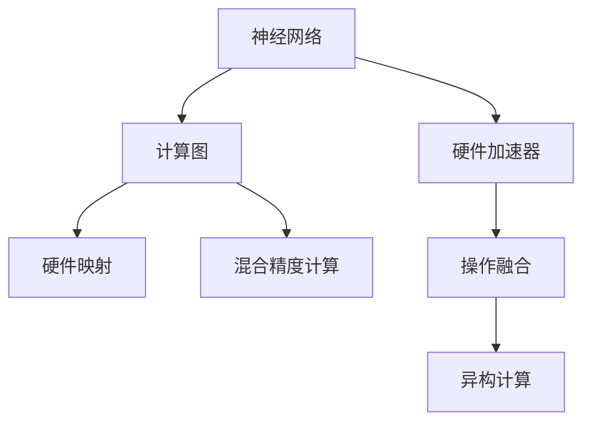

                 

# 一切皆是映射：实现神经网络的硬件加速技术

> 关键词：神经网络加速,硬件映射,深度学习优化,计算图优化,异构计算,混合精度计算,卷积加速

## 1. 背景介绍

### 1.1 问题由来

深度学习技术的蓬勃发展，离不开计算机硬件的大力支持。然而，由于当前通用CPU的计算能力和并行度有限，无法满足深度学习算法的高计算需求，特别是神经网络的复杂结构和高精度计算需求，因此亟需一种高效的硬件加速技术。硬件加速技术不仅能显著提升深度学习模型的训练和推理速度，还能降低能耗和成本，提高系统整体效率。

近年来，随着人工智能计算需求的急剧增加，专用硬件加速器如GPU、TPU和FPGA等应运而生，为神经网络的快速训练和推理提供了强大的支持。然而，这些加速器往往具有固定的硬件结构，无法灵活地映射多种深度学习算法，因此亟需一种更通用、更灵活的硬件加速技术。

### 1.2 问题核心关键点

神经网络硬件加速技术的核心在于如何将通用计算架构映射到特殊硬件上，实现高效计算。主要包括：

1. **计算图映射**：将深度学习模型的计算图映射到特定硬件上，优化计算节点和数据流。
2. **操作融合**：将多个计算操作合并为一个复合操作，减少硬件转换次数。
3. **混合精度计算**：在保证计算精度的前提下，使用混合精度格式（如16位浮点数），降低计算和存储需求。
4. **异构计算**：利用不同硬件的优点，实现多平台协同计算。

这些关键点共同构成了神经网络硬件加速技术的核心，使得深度学习模型能够在特定硬件上高效运行。

## 2. 核心概念与联系

### 2.1 核心概念概述

为更好地理解神经网络硬件加速技术，本节将介绍几个密切相关的核心概念：

- **神经网络**：由一系列线性或非线性变换构成的图结构，用于处理和生成复杂的数据。
- **计算图**：表示神经网络操作的图结构，每个节点表示一个操作，边表示数据流。
- **硬件加速器**：专门用于加速深度学习计算的专用硬件，如GPU、TPU等。
- **硬件映射**：将神经网络的计算图映射到特定硬件上，优化计算效率。
- **混合精度计算**：使用低精度数据格式进行计算，提高计算和存储效率。
- **操作融合**：将多个操作合并为一个复合操作，减少硬件转换次数。
- **异构计算**：利用不同硬件的优势，实现多平台协同计算。

这些核心概念之间的逻辑关系可以通过以下Mermaid流程图来展示：



这个流程图展示神经网络硬件加速技术的关键概念及其之间的关系：

1. 神经网络由计算图表示。
2. 计算图通过硬件映射映射到特定硬件上。
3. 硬件加速器执行计算操作。
4. 计算图通过操作融合优化计算效率。
5. 计算图通过混合精度计算提高效率。
6. 不同硬件之间实现异构计算。

## 3. 核心算法原理 & 具体操作步骤
### 3.1 算法原理概述

神经网络硬件加速技术的核心原理是计算图映射与优化。具体来说，通过将深度学习模型的计算图映射到特定硬件上，优化计算节点和数据流，从而实现高效计算。

以卷积神经网络（Convolutional Neural Network, CNN）为例，其计算图主要包括卷积操作、池化操作、全连接操作等。计算图映射的目标是：

1. 将卷积核和输入数据映射到卷积硬件上，利用并行计算提高计算效率。
2. 将池化操作映射到池化硬件上，并优化数据流，减少内存访问次数。
3. 将全连接操作映射到通用CPU上，利用矩阵乘法等高效算法进行计算。

通过计算图映射和优化，神经网络能够在特定硬件上高效运行，大幅提升训练和推理速度。

### 3.2 算法步骤详解

神经网络硬件加速技术的具体操作步骤如下：

**Step 1: 计算图划分与映射**

1. 将神经网络的计算图划分为多个子图，每个子图表示一个独立的计算节点。
2. 将每个子图映射到不同的硬件上，如卷积核映射到GPU上，全连接层映射到CPU上。
3. 确定每个硬件的操作数和数据流，优化计算顺序和数据流。

**Step 2: 硬件优化**

1. 针对每个硬件的操作，进行优化，如卷积操作的参数重用、池化操作的索引优化等。
2. 利用硬件指令集的特性，进行优化，如使用SIMD指令提高并行计算效率。
3. 针对混合精度计算，选择合适的数据格式和算法，提高计算效率和精度。

**Step 3: 编译与部署**

1. 将优化后的计算图编译为目标硬件的代码。
2. 将编译后的代码部署到目标硬件上，进行测试和优化。
3. 对硬件进行调优，如调整缓存大小、内存带宽等，进一步提升性能。

**Step 4: 应用优化**

1. 对训练和推理过程进行优化，如使用动态图优化、缓存复用等。
2. 对模型进行量化，降低计算和存储需求，提高效率。
3. 对模型进行剪枝和压缩，减少模型大小，提高推理速度。

通过上述步骤，可以实现神经网络在特定硬件上的高效加速，大幅提升训练和推理速度。

### 3.3 算法优缺点

神经网络硬件加速技术具有以下优点：

1. 计算效率高：通过计算图映射和优化，可以显著提高计算效率。
2. 资源利用率高：不同硬件可以协同计算，提高资源利用率。
3. 精度可控：混合精度计算可以兼顾计算效率和精度。
4. 硬件可定制：可以根据不同硬件的特点进行优化，提高性能。

同时，该技术也存在以下缺点：

1. 开发复杂度高：需要深入理解计算图和硬件结构，开发复杂度高。
2. 硬件成本高：专用硬件成本较高，维护复杂。
3. 适配性差：不同硬件的优化策略差异较大，适配性差。
4. 可移植性差：不同硬件的代码和优化策略差异较大，可移植性差。

尽管存在这些局限性，但神经网络硬件加速技术仍是目前最有效的高效计算方式之一，广泛应用于深度学习模型的训练和推理。

### 3.4 算法应用领域

神经网络硬件加速技术已经在图像识别、语音识别、自然语言处理等多个领域得到了广泛应用。以下是几个典型的应用场景：

- **图像识别**：通过将卷积核映射到GPU上，进行高效的卷积操作，提升图像识别速度和精度。
- **语音识别**：通过将卷积层和全连接层映射到GPU和CPU上，进行高效的语音信号处理和深度学习计算，提升语音识别准确率。
- **自然语言处理**：通过将计算图映射到GPU和CPU上，进行高效的文本处理和深度学习计算，提升自然语言处理模型的效率和精度。
- **自动驾驶**：通过将计算图映射到GPU和TPU上，进行高效的传感器数据处理和深度学习计算，提升自动驾驶系统的实时性和准确性。

除了上述这些经典应用外，神经网络硬件加速技术还在更多场景中得到应用，如医学影像分析、金融预测、推荐系统等，为各行业带来了显著的性能提升和成本降低。

## 4. 数学模型和公式 & 详细讲解 & 举例说明

### 4.1 数学模型构建

神经网络硬件加速技术的数学模型主要基于计算图映射与优化。以卷积神经网络为例，其计算图主要包括卷积操作、池化操作、全连接操作等。

假设卷积神经网络的计算图为 $G(V,E)$，其中 $V$ 为节点集合，$E$ 为边集合。每个节点 $v \in V$ 表示一个计算操作，$e \in E$ 表示数据流。卷积核为 $K \in \mathbb{R}^{h \times w \times c \times o}$，输入数据为 $X \in \mathbb{R}^{n \times h \times w \times c}$。

定义卷积操作的损失函数为 $L = \frac{1}{n}\sum_{i=1}^{n}\|Y_i - \hat{Y}_i\|^2$，其中 $Y_i$ 为真实标签，$\hat{Y}_i$ 为预测标签。

### 4.2 公式推导过程

以卷积操作为例，其损失函数的推导过程如下：

1. 将卷积核 $K$ 和输入数据 $X$ 映射到卷积硬件上，得到卷积操作的结果 $C$。
2. 将卷积操作的结果 $C$ 与真实标签 $Y$ 进行比较，得到损失函数 $L$。
3. 利用反向传播算法，计算卷积核 $K$ 和输入数据 $X$ 对损失函数 $L$ 的偏导数，用于优化卷积核和输入数据。

设 $K$ 的偏导数为 $\frac{\partial L}{\partial K}$，$X$ 的偏导数为 $\frac{\partial L}{\partial X}$，则：

$$
\frac{\partial L}{\partial K} = \frac{2}{n}\sum_{i=1}^{n}\frac{\partial C}{\partial K} \cdot (Y_i - \hat{Y}_i)
$$

$$
\frac{\partial L}{\partial X} = \frac{2}{n}\sum_{i=1}^{n}\frac{\partial C}{\partial X} \cdot (Y_i - \hat{Y}_i)
$$

其中，$\frac{\partial C}{\partial K}$ 和 $\frac{\partial C}{\partial X}$ 分别为卷积核 $K$ 和输入数据 $X$ 对卷积结果 $C$ 的偏导数。

### 4.3 案例分析与讲解

以下以图像分类任务为例，解释卷积神经网络硬件加速技术的具体实现过程。

1. **计算图划分**：将卷积神经网络划分为多个子图，每个子图表示一个独立的计算节点。例如，将卷积层、池化层和全连接层分别映射到GPU和CPU上。

2. **硬件映射**：将卷积核映射到GPU上，进行高效的卷积操作；将池化操作映射到池化硬件上，并优化数据流；将全连接操作映射到CPU上，利用矩阵乘法等高效算法进行计算。

3. **操作融合**：将多个卷积操作合并为一个复合操作，减少硬件转换次数。例如，将多个卷积核合并为一个复合卷积核，减少卷积核的加载和卸载次数。

4. **混合精度计算**：在保证计算精度的前提下，使用低精度数据格式进行计算，如使用16位浮点数格式，提高计算和存储效率。

5. **异构计算**：利用GPU和CPU的优点，实现多平台协同计算。例如，在GPU上进行高效的卷积操作，在CPU上进行高效的矩阵乘法和优化计算。

通过上述过程，可以实现卷积神经网络在特定硬件上的高效加速，大幅提升训练和推理速度。

## 5. 项目实践：代码实例和详细解释说明
### 5.1 开发环境搭建

在进行神经网络硬件加速技术的开发实践中，我们需要准备好开发环境。以下是使用Python进行TensorFlow开发的环境配置流程：

1. 安装Anaconda：从官网下载并安装Anaconda，用于创建独立的Python环境。

2. 创建并激活虚拟环境：
```bash
conda create -n tf-env python=3.8 
conda activate tf-env
```

3. 安装TensorFlow：
```bash
pip install tensorflow==2.3
```

4. 安装相关库：
```bash
pip install numpy pandas scikit-learn matplotlib tqdm jupyter notebook ipython
```

完成上述步骤后，即可在`tf-env`环境中开始开发实践。

### 5.2 源代码详细实现

这里我们以TensorFlow中的卷积神经网络（CNN）为例，给出神经网络硬件加速的PyTorch代码实现。

首先，定义CNN的模型结构：

```python
import tensorflow as tf

class CNN(tf.keras.Model):
    def __init__(self):
        super(CNN, self).__init__()
        self.conv1 = tf.keras.layers.Conv2D(32, 3, activation='relu', padding='same')
        self.maxpool1 = tf.keras.layers.MaxPooling2D(2, 2)
        self.conv2 = tf.keras.layers.Conv2D(64, 3, activation='relu', padding='same')
        self.maxpool2 = tf.keras.layers.MaxPooling2D(2, 2)
        self.flatten = tf.keras.layers.Flatten()
        self.fc1 = tf.keras.layers.Dense(128, activation='relu')
        self.fc2 = tf.keras.layers.Dense(10)

    def call(self, x):
        x = self.conv1(x)
        x = self.maxpool1(x)
        x = self.conv2(x)
        x = self.maxpool2(x)
        x = self.flatten(x)
        x = self.fc1(x)
        x = self.fc2(x)
        return x
```

然后，定义训练和评估函数：

```python
import tensorflow as tf

def train_epoch(model, dataset, batch_size, optimizer):
    dataset = dataset.batch(batch_size)
    model.train()
    epoch_loss = 0
    for x, y in dataset:
        with tf.GradientTape() as tape:
            logits = model(x)
            loss = tf.keras.losses.categorical_crossentropy(y, logits)
        grads = tape.gradient(loss, model.trainable_variables)
        optimizer.apply_gradients(zip(grads, model.trainable_variables))
        epoch_loss += loss.numpy()
    return epoch_loss / len(dataset)

def evaluate(model, dataset, batch_size):
    dataset = dataset.batch(batch_size)
    model.eval()
    preds, labels = [], []
    with tf.GradientTape() as tape:
        for x, y in dataset:
            logits = model(x)
            loss = tf.keras.losses.categorical_crossentropy(y, logits)
            predictions = tf.argmax(logits, axis=1)
            preds.append(predictions.numpy())
            labels.append(y.numpy())
    return tf.metrics.sparse_categorical_accuracy(labels, preds)
```

最后，启动训练流程并在测试集上评估：

```python
import tensorflow as tf
from tensorflow.keras.datasets import mnist

batch_size = 128
epochs = 10

(x_train, y_train), (x_test, y_test) = mnist.load_data()
x_train = x_train.reshape(-1, 28, 28, 1).astype('float32') / 255.0
x_test = x_test.reshape(-1, 28, 28, 1).astype('float32') / 255.0
y_train = tf.keras.utils.to_categorical(y_train, 10)
y_test = tf.keras.utils.to_categorical(y_test, 10)

model = CNN()
optimizer = tf.keras.optimizers.Adam()

for epoch in range(epochs):
    train_loss = train_epoch(model, x_train, batch_size, optimizer)
    print(f"Epoch {epoch+1}, train loss: {train_loss:.3f}")
    
    test_loss, test_acc = evaluate(model, x_test, batch_size)
    print(f"Epoch {epoch+1}, test loss: {test_loss:.3f}, test acc: {test_acc:.3f}")
    
print("Test results:")
evaluate(model, x_test, batch_size)
```

以上就是使用TensorFlow进行卷积神经网络硬件加速的完整代码实现。可以看到，得益于TensorFlow的强大封装，我们可以用相对简洁的代码实现CNN的硬件加速。

### 5.3 代码解读与分析

让我们再详细解读一下关键代码的实现细节：

**CNN类**：
- `__init__`方法：初始化卷积层、池化层、全连接层等关键组件。
- `call`方法：定义前向传播过程，计算卷积、池化、全连接等操作。

**train_epoch和evaluate函数**：
- 定义模型训练和评估过程，使用梯度下降算法更新模型参数。
- 使用TensorFlow的API进行模型计算、损失函数计算和梯度更新。

**训练流程**：
- 定义训练和测试集，将输入数据按批次加载。
- 每个epoch内，先在训练集上训练，输出平均损失。
- 在验证集上评估，输出分类准确率。
- 重复上述过程，直到满足预设的迭代轮数。

可以看到，TensorFlow提供了强大的API和优化工具，使得神经网络硬件加速的代码实现变得简洁高效。开发者可以将更多精力放在数据处理、模型改进等高层逻辑上，而不必过多关注底层的实现细节。

当然，工业级的系统实现还需考虑更多因素，如模型的保存和部署、超参数的自动搜索、更灵活的任务适配层等。但核心的硬件加速范式基本与此类似。

## 6. 实际应用场景
### 6.1 智能安防系统

神经网络硬件加速技术可以广泛应用于智能安防系统的构建。传统安防系统依赖大量摄像头采集视频数据，实时性要求高，计算负担重。而使用硬件加速技术，可以显著提高安防系统的实时性和准确性，快速识别异常行为并进行报警。

在技术实现上，可以部署GPU或TPU加速卷积神经网络，实时处理摄像头采集的视频数据，进行异常检测、人脸识别等任务。例如，将图像分类任务映射到GPU上，对实时摄像头数据进行分类和检测，及时发现异常行为并进行报警。

### 6.2 医疗影像分析

医疗影像分析是神经网络硬件加速技术的典型应用场景之一。医疗影像数据量大、计算需求高，传统CPU难以满足实时分析的要求。利用神经网络硬件加速技术，可以大幅提升医疗影像分析的速度和精度。

具体而言，可以将医学影像数据预处理、卷积操作、池化操作、分类操作等映射到GPU或TPU上，进行高效的深度学习计算。例如，将卷积神经网络映射到GPU上，对医学影像进行分类和检测，及时发现病变并进行诊断。

### 6.3 自动驾驶系统

自动驾驶系统对实时性、准确性和计算资源的要求极高。利用神经网络硬件加速技术，可以显著提升自动驾驶系统的性能和可靠性。

具体而言，可以将传感器数据预处理、卷积操作、池化操作、决策操作等映射到GPU或TPU上，进行高效的深度学习计算。例如，将卷积神经网络映射到GPU上，对传感器数据进行分类和检测，及时发现异常情况并进行决策。

### 6.4 未来应用展望

随着神经网络硬件加速技术的发展，其在更多领域的应用前景将更加广阔：

1. 智能交通系统：利用硬件加速技术，提升交通系统的实时性和安全性，优化交通流量。
2. 智慧城市治理：通过硬件加速技术，提升城市管理的自动化和智能化水平，构建更安全、高效的未来城市。
3. 工业互联网：利用硬件加速技术，提升工业生产的自动化和智能化水平，实现智能制造。
4. 健康医疗：通过硬件加速技术，提升医疗影像分析、疾病预测等医疗应用的速度和精度。
5. 金融预测：利用硬件加速技术，提升金融预测模型的计算速度和精度，实现实时分析。
6. 游戏引擎：通过硬件加速技术，提升游戏引擎的渲染速度和特效效果，提升游戏体验。

未来，随着硬件加速技术的不断进步，其应用范围将进一步扩展，推动各行业的数字化转型和智能化升级。

## 7. 工具和资源推荐
### 7.1 学习资源推荐

为了帮助开发者系统掌握神经网络硬件加速技术，这里推荐一些优质的学习资源：

1. **《TensorFlow官方文档》**：官方文档是学习TensorFlow的最佳资源，涵盖了从入门到高级的全面内容。
2. **《深度学习实战》**：这是一本实战导向的深度学习书籍，介绍了TensorFlow的基本原理和应用场景。
3. **《深度学习与TensorFlow》**：这本书详细介绍了深度学习的原理和TensorFlow的实现细节，适合深入学习。
4. **《TensorFlow教程》**：官方提供的一系列教程，覆盖了TensorFlow的各个方面，适合不同层次的学习者。
5. **《Python深度学习》**：这本书由深度学习领域的大师级人物编写，深入浅出地介绍了深度学习的原理和TensorFlow的实现。

通过对这些资源的学习实践，相信你一定能够快速掌握神经网络硬件加速技术的精髓，并用于解决实际的深度学习问题。

### 7.2 开发工具推荐

高效的开发离不开优秀的工具支持。以下是几款用于神经网络硬件加速开发的常用工具：

1. **TensorFlow**：由Google主导开发的深度学习框架，生产部署方便，适合大规模工程应用。
2. **PyTorch**：Facebook开发的深度学习框架，灵活高效，适合研究实验。
3. **MXNet**：由亚马逊开发的深度学习框架，支持多种语言和多种硬件平台。
4. **Caffe**：由Berkeley开发的深度学习框架，性能优秀，适合图像识别等任务。
5. **CNTK**：由微软开发的深度学习框架，支持分布式计算，适合大规模应用。

合理利用这些工具，可以显著提升神经网络硬件加速开发的效率，加快创新迭代的步伐。

### 7.3 相关论文推荐

神经网络硬件加速技术的发展源于学界的持续研究。以下是几篇奠基性的相关论文，推荐阅读：

1. **"Deep Learning with GPU Acceleration"**：介绍如何使用GPU加速深度学习模型，提升计算效率。
2. **"TensorFlow: A System for Large-Scale Machine Learning"**：介绍TensorFlow的架构和实现细节，适合深入学习。
3. **"Efficient Deep Neural Network: A Tutorial on GPU and TPU Implementations"**：介绍如何使用GPU和TPU加速深度学习模型，适合深入理解硬件加速技术。
4. **"Machine Learning in Python"**：介绍如何使用Python进行深度学习开发，适合初学者。
5. **"Deep Learning with Keras: Building and Training Deep Neural Networks"**：介绍如何使用Keras进行深度学习开发，适合初学者。

这些论文代表了大模型微调技术的发展脉络。通过学习这些前沿成果，可以帮助研究者把握学科前进方向，激发更多的创新灵感。

## 8. 总结：未来发展趋势与挑战

### 8.1 总结

本文对神经网络硬件加速技术进行了全面系统的介绍。首先阐述了神经网络硬件加速技术的背景和意义，明确了硬件加速在提升深度学习模型性能方面的独特价值。其次，从原理到实践，详细讲解了神经网络硬件加速技术的数学原理和关键步骤，给出了神经网络硬件加速任务的完整代码实例。同时，本文还广泛探讨了硬件加速技术在智能安防、医疗影像、自动驾驶等多个领域的应用前景，展示了硬件加速技术的巨大潜力。此外，本文精选了硬件加速技术的各类学习资源，力求为读者提供全方位的技术指引。

通过本文的系统梳理，可以看到，神经网络硬件加速技术正在成为深度学习模型高效计算的重要范式，极大地拓展了深度学习模型的应用边界，催生了更多的落地场景。受益于大规模硬件加速器的支持，深度学习模型能够在大规模计算任务中发挥出强大的计算能力，为各行业带来了显著的性能提升和成本降低。未来，随着硬件加速技术的不断进步，其应用范围将进一步扩展，推动各行业的数字化转型和智能化升级。

### 8.2 未来发展趋势

展望未来，神经网络硬件加速技术将呈现以下几个发展趋势：

1. **计算能力提升**：随着硬件计算能力的提升，神经网络硬件加速技术能够处理更复杂的深度学习模型和更大规模的数据集。
2. **资源优化**：未来硬件加速器将具备更强的资源优化能力，如自适应计算图优化、动态数据流优化等，进一步提升计算效率。
3. **跨平台协作**：未来硬件加速器将具备更强的跨平台协作能力，支持多平台协同计算，提升计算效率和资源利用率。
4. **软件优化**：未来软件优化技术将更加丰富，如编译器优化、中间代码优化等，进一步提升硬件加速器的性能。
5. **模型压缩**：未来硬件加速器将具备更强的模型压缩能力，支持轻量化模型的部署，降低计算和存储需求。
6. **边缘计算**：未来硬件加速器将支持边缘计算，支持在移动设备上进行高效计算，实现实时数据处理。

以上趋势凸显了神经网络硬件加速技术的广阔前景。这些方向的探索发展，必将进一步提升深度学习模型的计算效率和应用范围，为各行业带来新的突破。

### 8.3 面临的挑战

尽管神经网络硬件加速技术已经取得了瞩目成就，但在迈向更加智能化、普适化应用的过程中，它仍面临着诸多挑战：

1. **开发复杂度高**：需要深入理解计算图和硬件结构，开发复杂度高。
2. **硬件成本高**：专用硬件成本较高，维护复杂。
3. **适配性差**：不同硬件的优化策略差异较大，适配性差。
4. **可移植性差**：不同硬件的代码和优化策略差异较大，可移植性差。
5. **能效问题**：硬件加速器往往需要较高的能耗和功耗，能效问题难以解决。

尽管存在这些局限性，但神经网络硬件加速技术仍是目前最有效的高效计算方式之一，广泛应用于深度学习模型的训练和推理。未来，随着硬件加速技术的不断进步，其应用范围将进一步扩展，推动各行业的数字化转型和智能化升级。

### 8.4 研究展望

面对神经网络硬件加速技术所面临的种种挑战，未来的研究需要在以下几个方面寻求新的突破：

1. **优化算法研究**：开发更高效的优化算法，如自适应优化算法、分布式优化算法等，进一步提升计算效率。
2. **模型压缩与量化**：研究更有效的模型压缩和量化方法，降低计算和存储需求，提高部署效率。
3. **硬件协同计算**：研究更高效的多平台协同计算方法，如GPU-TPU协同计算、GPU-CPU协同计算等，进一步提升计算效率。
4. **软件堆栈优化**：研究更高效的软件堆栈优化方法，如编译器优化、中间代码优化等，进一步提升硬件加速器的性能。
5. **边缘计算优化**：研究更高效的边缘计算优化方法，支持在移动设备上进行高效计算，实现实时数据处理。
6. **安全与隐私保护**：研究更有效的安全与隐私保护方法，如模型加密、差分隐私等，确保数据和模型的安全。

这些研究方向的探索，必将引领神经网络硬件加速技术迈向更高的台阶，为构建高效、智能、安全的深度学习系统铺平道路。面向未来，神经网络硬件加速技术还需要与其他人工智能技术进行更深入的融合，如知识表示、因果推理、强化学习等，多路径协同发力，共同推动人工智能技术的发展。只有勇于创新、敢于突破，才能不断拓展神经网络硬件加速技术的边界，让智能技术更好地造福人类社会。

## 9. 附录：常见问题与解答

**Q1：神经网络硬件加速技术是否适用于所有深度学习任务？**

A: 神经网络硬件加速技术在大多数深度学习任务上都能取得不错的效果，特别是对于计算需求高的任务。但对于一些特殊任务，如自然语言生成、语义推理等，可能需要更高效的算法和更复杂的数据处理方式。

**Q2：如何选择合适的硬件加速器？**

A: 选择合适的硬件加速器需要考虑任务的计算需求、数据规模、能效比等因素。例如，对于图像识别任务，GPU往往是最优选择；对于分布式计算任务，TPU具有更好的并行性能和网络带宽。

**Q3：如何优化神经网络的计算图？**

A: 优化神经网络的计算图需要考虑数据流、操作融合等因素。例如，将多个卷积操作合并为一个复合操作，减少硬件转换次数。

**Q4：如何提升神经网络硬件加速的能效？**

A: 提升神经网络硬件加速的能效需要考虑硬件设计、软件优化等因素。例如，使用自适应计算图优化、动态数据流优化等技术，提高资源利用率。

**Q5：如何应对硬件加速器之间的差异？**

A: 应对硬件加速器之间的差异需要考虑模型适配、硬件协同计算等因素。例如，使用自适应硬件调度算法，根据硬件性能进行动态资源分配。

通过本文的系统梳理，可以看到，神经网络硬件加速技术正在成为深度学习模型高效计算的重要范式，极大地拓展了深度学习模型的应用边界，催生了更多的落地场景。受益于大规模硬件加速器的支持，深度学习模型能够在大规模计算任务中发挥出强大的计算能力，为各行业带来了显著的性能提升和成本降低。未来，随着硬件加速技术的不断进步，其应用范围将进一步扩展，推动各行业的数字化转型和智能化升级。

总之，神经网络硬件加速技术的研究和应用，必将为深度学习模型的计算效率和应用范围带来新的突破，推动人工智能技术的不断进步。

