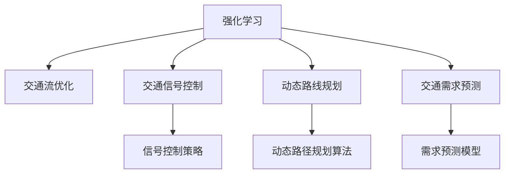

                 

# 一切皆是映射：强化学习在交通规划中的应用：智能交通的挑战与机遇

## 1. 背景介绍

### 1.1 问题由来
随着城市化进程的不断加快，交通问题成为了影响城市运行效率、居民生活质量乃至城市可持续发展的重要因素。拥堵、事故频发、环境污染等问题，已经成为各大城市亟需解决的“城市病”。面对如此复杂的交通系统，传统交通规划和管理方式显得力不从心。

智能化交通系统的建设，利用先进的信息技术、大数据分析、人工智能等手段，为交通规划和管理提供了新的可能性。其中，强化学习作为一种重要的AI技术，以其在动态决策、优化控制等方面的优势，逐渐成为交通规划和智能交通系统的重要工具。本文将探讨强化学习在交通规划中的应用，分析其在智能交通中的挑战与机遇。

### 1.2 问题核心关键点
强化学习在交通规划中的应用，主要包括智能交通信号控制、动态路线规划、交通需求预测等多个方面。其核心在于通过实时采集交通数据，训练智能体进行交通场景决策，优化交通流的动态分配与控制，从而提高道路通行效率、降低事故发生率、减轻环境污染。

强化学习的关键在于构建环境模型、定义智能体的决策目标和策略空间，以及设计合适的奖励机制。相比于传统交通规划方法，强化学习能够处理高维、非线性的决策问题，适应实时变化的交通环境，优化交通流的动态管理。

## 2. 核心概念与联系

### 2.1 核心概念概述

为更好地理解强化学习在交通规划中的应用，本节将介绍几个密切相关的核心概念：

- 强化学习(Reinforcement Learning, RL)：一种通过智能体与环境交互，利用奖励机制指导智能体进行最优决策的机器学习范式。智能体通过不断与环境交互，学习到最优的决策策略。
- 交通流优化(Optimization of Traffic Flow)：利用智能算法对交通流进行优化，旨在提高道路通行效率，减少拥堵和事故。
- 交通信号控制(Traffic Signal Control, TSC)：通过对交通信号灯的动态控制，实现交通流的平稳和高效。
- 动态路线规划(Dynamic Routing)：基于实时交通数据，为车辆动态规划最优路线，提高出行效率。
- 交通需求预测(Traffic Demand Prediction)：利用历史数据和当前状态，预测未来交通需求，为交通管理提供决策支持。

这些核心概念之间的逻辑关系可以通过以下Mermaid流程图来展示：



这个流程图展示了他强化学习与其他交通规划概念的逻辑关系：

1. 强化学习提供了一种通过智能体与环境交互的方式，训练最优决策策略。
2. 交通流优化、交通信号控制、动态路线规划和交通需求预测都是交通规划中的重要环节。
3. 强化学习可以应用于这些环节，提供智能化的决策支持。

## 3. 核心算法原理 & 具体操作步骤

### 3.1 算法原理概述

强化学习在交通规划中的应用，主要通过智能体与环境进行交互，利用奖励机制指导智能体进行最优决策。其核心思想是：

1. 定义环境状态：将交通系统的状态抽象为环境状态，包括交通流量、车辆位置、信号灯状态等。
2. 设计智能体决策策略：智能体根据环境状态，采取不同的决策动作，如调整信号灯周期、改变车辆行驶路径等。
3. 定义奖励机制：根据智能体的决策结果，给予奖励或惩罚，以指导智能体学习最优策略。
4. 学习最优策略：智能体通过不断与环境交互，利用奖励机制指导决策，学习到最优的策略。

强化学习的核心在于构建环境模型、定义智能体的决策目标和策略空间，以及设计合适的奖励机制。

### 3.2 算法步骤详解

基于强化学习的交通规划应用一般包括以下几个关键步骤：

**Step 1: 构建环境模型**
- 收集交通系统数据，如车辆位置、速度、交通信号灯状态等。
- 将交通系统抽象为状态空间，定义状态转移规则，构建环境模型。

**Step 2: 设计智能体决策策略**
- 设计智能体的决策空间，包括交通信号控制策略、动态路径规划算法等。
- 选择合适的智能体模型，如Q-learning、策略梯度等。

**Step 3: 定义奖励机制**
- 根据智能体的决策结果，定义奖励函数，如根据交通流量、延误时间、环境污染等指标，计算奖励值。
- 确定奖励函数的权重，平衡不同指标的重要性。

**Step 4: 训练智能体**
- 使用强化学习算法，对智能体进行训练，迭代优化决策策略。
- 在训练过程中，采用探索-利用策略，平衡对未知状态和已知状态的处理。

**Step 5: 评估与优化**
- 在训练结束后，使用验证集评估智能体的性能。
- 根据评估结果，对智能体进行优化，调整决策策略。

### 3.3 算法优缺点

强化学习在交通规划中的应用具有以下优点：

1. 动态决策：强化学习能够处理实时变化的交通环境，动态调整决策策略，提高交通系统的灵活性和适应性。
2. 优化效率：强化学习可以通过不断的试错和优化，逐步学习到最优的决策策略，提高交通系统的运行效率。
3. 适应性强：强化学习可以应用于各种交通场景，具有较高的普适性。

但同时，强化学习在交通规划中也存在一些局限性：

1. 计算复杂度高：强化学习需要大量数据进行训练，计算复杂度较高，对资源需求较大。
2. 数据获取难度大：交通系统数据量庞大且复杂，难以获取高质量的数据。
3. 模型鲁棒性不足：强化学习模型容易受到噪声和异常值的影响，鲁棒性较弱。
4. 可解释性差：强化学习模型难以解释决策过程，缺乏透明度。

尽管存在这些局限性，但强化学习在交通规划中的应用前景广阔，具有重要的研究和应用价值。

### 3.4 算法应用领域

强化学习在交通规划中的应用，主要集中在以下几个领域：

- 智能交通信号控制：通过智能体学习最优信号控制策略，实现交通信号灯的动态控制。
- 动态路线规划：基于实时交通数据，为车辆动态规划最优路径。
- 交通需求预测：利用历史数据和当前状态，预测未来交通需求，优化交通资源分配。
- 事故预防与应急响应：通过智能体学习最优决策策略，预防和应对交通事故，提高应急响应效率。
- 环境友好型交通管理：设计智能体策略，优化交通流的排放，降低环境污染。

强化学习在交通规划中的应用，能够提高交通系统的运行效率、降低事故发生率、减轻环境污染，具有重要的应用前景。

## 4. 数学模型和公式 & 详细讲解  
### 4.1 数学模型构建

强化学习在交通规划中的应用，可以通过马尔可夫决策过程(Markov Decision Process, MDP)进行建模。MDP包含状态空间$S$、动作空间$A$、状态转移概率$P$、奖励函数$R$、折扣因子$\gamma$等要素。

假设智能体在状态$s_t$下采取动作$a_t$，得到状态$s_{t+1}$和奖励$r_t$，则MDP的表示形式为：

$$
(s_t, a_t, r_t, s_{t+1}) \sim P(a_t|s_t) \times R(s_t, a_t, s_{t+1})
$$

其中$s_t \in S$、$a_t \in A$、$r_t \in R$、$s_{t+1} \in S$。

### 4.2 公式推导过程

在强化学习中，智能体的目标是通过学习到最优策略$\pi^*$，最大化累计奖励的期望值。策略$\pi$表示智能体在每个状态$s_t$下采取动作$a_t$的概率，即$\pi(a_t|s_t)$。

策略$\pi$和奖励函数$R$之间存在动态关系，即策略$\pi^*$满足贝尔曼方程(Bellman Equation)：

$$
V^\pi(s) = \max_{a} \left\{ \sum_{s'} P(s'|s,a) [R(s,a,s') + \gamma V^\pi(s')] \right\}
$$

其中$V^\pi(s)$表示策略$\pi$下状态$s$的期望累计奖励，$P(s'|s,a)$表示状态转移概率。

为了求解最优策略$\pi^*$，常用的算法包括值迭代、策略迭代、Q-learning等。值迭代算法通过迭代计算每个状态的价值函数$V^\pi(s)$，策略迭代算法通过迭代计算策略$\pi$，Q-learning算法则通过迭代更新Q值，学习到最优策略$\pi^*$。

### 4.3 案例分析与讲解

以智能交通信号控制为例，说明强化学习的应用过程。

假设智能体面临的交通信号灯状态空间$S$包含绿灯、黄灯、红灯三种状态，动作空间$A$包含向左、向右、直行三种动作。奖励函数$R$定义为：

- 当智能体采取动作直行，状态变为绿灯时，奖励$R=1$；
- 当智能体采取动作直行，状态变为黄灯时，奖励$R=0.5$；
- 当智能体采取动作直行，状态变为红灯时，奖励$R=0$；
- 其他情况奖励$R=-0.1$。

智能体的目标是在保证交通流安全、平稳的前提下，最大化累计奖励。

通过Q-learning算法，智能体可以逐步学习到最优的决策策略。具体步骤如下：

1. 初始化Q值$Q(s,a)$，设定学习率$\alpha$和折扣因子$\gamma$。
2. 在每个时间步$t$，智能体观察到状态$s_t$，根据当前策略$\pi$采取动作$a_t$。
3. 观察到状态$s_{t+1}$和奖励$r_t$。
4. 更新Q值：
   $$
   Q(s_t,a_t) \leftarrow Q(s_t,a_t) + \alpha [r_t + \gamma \max_{a} Q(s_{t+1},a) - Q(s_t,a_t)]
   $$
5. 重复步骤2-4，直到收敛。

通过上述步骤，智能体可以学习到最优的交通信号控制策略，提高交通系统的运行效率。

## 5. 项目实践：代码实例和详细解释说明
### 5.1 开发环境搭建

在进行强化学习实践前，我们需要准备好开发环境。以下是使用Python进行Reinforcement Learning开发的环境配置流程：

1. 安装Anaconda：从官网下载并安装Anaconda，用于创建独立的Python环境。

2. 创建并激活虚拟环境：
```bash
conda create -n reinforcement-env python=3.8 
conda activate reinforcement-env
```

3. 安装Reinforcement Learning相关的库：
```bash
pip install gym gym-super-mario-learning tensorflow-gpu
```

4. 安装可视化工具：
```bash
pip install matplotlib
```

完成上述步骤后，即可在`reinforcement-env`环境中开始强化学习实践。

### 5.2 源代码详细实现

下面我们以智能交通信号控制为例，给出使用Gym库对交通信号灯进行强化学习的PyTorch代码实现。

首先，定义交通信号灯环境的Gym环境：

```python
from gym import spaces
import numpy as np
from gym.envs.classic_control import discrete
from gym.utils import seeding

class TrafficSignalEnv(discrete.DiscreteEnv):
    def __init__(self):
        super(TrafficSignalEnv, self).__init__(n=3, dtype='uint8')
        self.action_space = spaces.Discrete(3)
        self.observation_space = spaces.Discrete(3)
        self.seed()
        self._reset()
    
    def seed(self, seed=None):
        self.np_random, seed = seeding.np_random(seed)
        return [seed]
    
    def step(self, action):
        if action == 0:  # 直行
            next_state = self.np_random.randint(3)
        elif action == 1:  # 左转
            next_state = (self.state + 2) % 3
        elif action == 2:  # 右转
            next_state = (self.state + 1) % 3
        reward = 0
        done = False
        if next_state == 0:  # 绿灯
            reward = 1
        elif next_state == 1:  # 黄灯
            reward = 0.5
        elif next_state == 2:  # 红灯
            reward = 0
        self.state = next_state
        return np.array(next_state), reward, done, {}
    
    def reset(self):
        self.state = 0
        return np.array(0)
    
    def render(self, mode='human'):
        pass
```

然后，定义强化学习代理的代码：

```python
from gym import wrappers
import numpy as np
import tensorflow as tf
from tensorflow.keras.models import Sequential
from tensorflow.keras.layers import Dense

class QNetwork:
    def __init__(self, state_size, action_size):
        self.model = Sequential([
            Dense(24, input_dim=state_size, activation='relu'),
            Dense(24, activation='relu'),
            Dense(action_size, activation='linear')
        ])
        self.model.compile(loss='mse', optimizer=tf.keras.optimizers.Adam(learning_rate=0.001))
    
    def act(self, state):
        q_values = self.model.predict(state)
        return np.argmax(q_values[0])
    
    def train(self, state, action, reward, next_state, done):
        target = reward + 0.9 * np.amax(self.model.predict(next_state)[0])
        target_f = self.model.predict(state)
        target_f[0][action] = target
        self.model.fit(state, target_f, epochs=1, verbose=0)

env = TrafficSignalEnv()
env = wrappers.Monitor(env, "./gym-TrafficSignalEnv")
env = gym.make("TrafficSignalEnv")

state_size = env.observation_space.n
action_size = env.action_space.n
q_network = QNetwork(state_size, action_size)

for episode in range(1000):
    state = env.reset()
    state = np.reshape(state, [1, state_size])
    done = False
    while not done:
        action = q_network.act(state)
        next_state, reward, done, _ = env.step(action)
        next_state = np.reshape(next_state, [1, state_size])
        q_network.train(state, action, reward, next_state, done)
        state = next_state
env.close()
```

以上就是使用PyTorch和Gym库对智能交通信号灯进行强化学习的完整代码实现。可以看到，Gym库为开发者提供了一个便捷的环境模拟平台，可以方便地定义和测试强化学习模型。

### 5.3 代码解读与分析

让我们再详细解读一下关键代码的实现细节：

**TrafficSignalEnv类**：
- `__init__`方法：定义环境的状态空间、动作空间、奖励函数等属性。
- `seed`方法：实现环境种子生成。
- `step`方法：定义智能体采取动作后的环境状态转移和奖励计算。
- `reset`方法：重置环境状态。

**QNetwork类**：
- `__init__`方法：定义Q网络的结构和损失函数。
- `act`方法：根据状态选择最优动作。
- `train`方法：定义Q网络的训练过程。

**训练流程**：
- 定义智能体（QNetwork）和环境（TrafficSignalEnv）。
- 在每个训练回合中，智能体在环境中采取动作，观察状态转移和奖励。
- 根据状态、动作、奖励和下一状态，更新Q值，训练Q网络。

可以看到，强化学习在交通信号控制中的应用，可以通过定义环境、设计智能体、构建奖励机制等步骤，完成模型训练和部署。

## 6. 实际应用场景

### 6.1 智能交通信号控制

智能交通信号控制是强化学习在交通规划中的典型应用之一。通过智能体学习最优的信号控制策略，可以动态调整信号灯周期，提高道路通行效率，减少交通拥堵和事故。

智能交通信号控制的核心在于实时获取交通数据，构建交通信号灯的环境模型，设计智能体的决策策略，并定义奖励机制。通过不断迭代优化，智能体能够逐步学习到最优的信号控制策略。

### 6.2 动态路线规划

动态路线规划是强化学习在交通规划中的另一个重要应用。基于实时交通数据，智能体可以动态规划最优的车辆行驶路线，提高出行效率。

动态路线规划的核心在于实时获取交通数据，构建路线规划的环境模型，设计智能体的决策策略，并定义奖励机制。通过不断迭代优化，智能体能够逐步学习到最优的路线规划策略。

### 6.3 交通需求预测

交通需求预测是强化学习在交通规划中的又一应用。通过历史数据和当前状态，智能体可以预测未来交通需求，优化交通资源的分配。

交通需求预测的核心在于构建需求预测的环境模型，设计智能体的决策策略，并定义奖励机制。通过不断迭代优化，智能体能够逐步学习到最优的需求预测策略。

### 6.4 未来应用展望

随着强化学习技术的不断发展，其在交通规划中的应用前景将更加广阔。未来，强化学习将能够处理更加复杂、动态的交通场景，提供更智能、高效的决策支持。

在智能交通信号控制方面，强化学习将能够实时响应交通流量变化，动态调整信号灯周期，提高道路通行效率。同时，结合多智能体的协同控制，可以实现交通流更平稳、更高效的运行。

在动态路线规划方面，强化学习将能够实时获取交通数据，动态调整路线规划策略，提供最优的出行路线。结合自动驾驶技术的推广，智能体将能够更加高效、安全地导航，提升出行体验。

在交通需求预测方面，强化学习将能够结合历史数据和实时状态，准确预测未来交通需求，优化交通资源的分配。结合实时动态调度，可以更合理地分配交通资源，提高城市运行效率。

总之，强化学习在交通规划中的应用，将为智能交通系统提供强大的决策支持，带来更加高效、智能、可持续的交通解决方案。

## 7. 工具和资源推荐
### 7.1 学习资源推荐

为了帮助开发者系统掌握强化学习在交通规划中的应用，这里推荐一些优质的学习资源：

1. 《强化学习》系列书籍：如《Reinforcement Learning: An Introduction》、《Hands-On Reinforcement Learning with PyTorch》等，系统介绍了强化学习的基本概念和应用实践。

2. OpenAI Gym：一个Python开源环境库，提供多种模拟环境，方便开发者进行强化学习实验。

3. Udacity强化学习纳米学位课程：提供系统的强化学习理论和实践课程，涵盖强化学习在交通规划中的应用。

4. Reinforcement Learning State of the Art项目：由DeepMind开发的强化学习库，包含最新的强化学习算法和应用案例。

通过对这些资源的学习实践，相信你一定能够快速掌握强化学习在交通规划中的应用，并用于解决实际的交通问题。

### 7.2 开发工具推荐

高效的开发离不开优秀的工具支持。以下是几款用于强化学习开发的常用工具：

1. PyTorch：基于Python的开源深度学习框架，灵活动态的计算图，适合快速迭代研究。

2. TensorFlow：由Google主导开发的开源深度学习框架，生产部署方便，适合大规模工程应用。

3. OpenAI Gym：一个Python开源环境库，提供多种模拟环境，方便开发者进行强化学习实验。

4. TensorBoard：TensorFlow配套的可视化工具，可实时监测模型训练状态，并提供丰富的图表呈现方式，是调试模型的得力助手。

5. Weights & Biases：模型训练的实验跟踪工具，可以记录和可视化模型训练过程中的各项指标，方便对比和调优。

6. Jupyter Notebook：开源的Web交互式编程工具，支持Python、R、JavaScript等多种编程语言，方便开发者进行代码调试和版本控制。

合理利用这些工具，可以显著提升强化学习在交通规划中的开发效率，加快创新迭代的步伐。

### 7.3 相关论文推荐

强化学习在交通规划中的应用，源于学界的持续研究。以下是几篇奠基性的相关论文，推荐阅读：

1. Deep reinforcement learning for autonomous driving（Deep reinforcement learning for autonomous driving）：提出了一种基于强化学习的自动驾驶方案，通过智能体学习最优驾驶策略，提高自动驾驶的安全性和效率。

2. Traffic signal control using a multi-agent reinforcement learning approach（Traffic signal control using a multi-agent reinforcement learning approach）：提出了一种基于多智能体的强化学习交通信号控制方法，通过协同控制，优化交通信号灯的周期分配。

3. Reinforcement learning for real-time path selection in autonomous driving（Reinforcement learning for real-time path selection in autonomous driving）：提出了一种基于强化学习的自动驾驶路径规划方法，通过智能体学习最优的路径规划策略，提高自动驾驶的效率和安全性。

4. Predictive traffic demand estimation using reinforcement learning（Predictive traffic demand estimation using reinforcement learning）：提出了一种基于强化学习的交通需求预测方法，通过智能体学习最优的预测策略，提高交通需求预测的准确性。

这些论文代表了大语言模型微调技术的发展脉络。通过学习这些前沿成果，可以帮助研究者把握学科前进方向，激发更多的创新灵感。

## 8. 总结：未来发展趋势与挑战

### 8.1 总结

本文对强化学习在交通规划中的应用进行了全面系统的介绍。首先阐述了强化学习在智能交通中的重要意义和应用潜力，明确了其在交通流优化、交通信号控制、动态路线规划、交通需求预测等方面的独特价值。其次，从原理到实践，详细讲解了强化学习在交通规划中的数学模型和算法步骤，给出了强化学习应用的具体代码实现。同时，本文还广泛探讨了强化学习在智能交通中的挑战与机遇，展示了其在未来智能化交通系统中的广阔前景。

通过本文的系统梳理，可以看到，强化学习在交通规划中的应用前景广阔，具有重要的研究和应用价值。然而，面对智能交通的复杂性和动态性，强化学习仍面临诸多挑战，需要不断地探索和优化。

### 8.2 未来发展趋势

展望未来，强化学习在交通规划中的应用将呈现以下几个发展趋势：

1. 多智能体协同控制：未来的交通系统将更加复杂和动态，需要多个智能体协同工作，实现更高效、更平稳的交通管理。

2. 实时动态优化：强化学习将结合实时交通数据，实现交通流的动态优化，提高交通系统的灵活性和适应性。

3. 融合多模态数据：交通系统数据不仅包含文本信息，还包含图像、语音等多模态数据。未来的强化学习将融合多模态数据，提升系统的感知能力和决策能力。

4. 优化目标多样化：交通系统的优化目标不仅包括通行效率，还涵盖安全、环保、社会效益等多个方面。未来的强化学习将结合多目标优化，提升系统的综合性能。

5. 自动化和可解释性：未来的强化学习将结合自动化和可解释性技术，提升模型的可操作性和透明度，帮助决策者理解和优化模型。

这些趋势凸显了强化学习在交通规划中的广阔前景。这些方向的探索发展，必将进一步提升交通系统的运行效率、安全性和可持续性。

### 8.3 面临的挑战

尽管强化学习在交通规划中的应用前景广阔，但在迈向更加智能化、普适化应用的过程中，它仍面临诸多挑战：

1. 数据获取难度大：交通系统数据量庞大且复杂，难以获取高质量的数据。需要采用多种数据采集和处理技术，提升数据获取的效率和质量。

2. 计算资源需求高：强化学习需要大量数据进行训练，计算复杂度较高，对资源需求较大。需要结合云计算、分布式计算等技术，提高计算效率。

3. 模型鲁棒性不足：强化学习模型容易受到噪声和异常值的影响，鲁棒性较弱。需要结合多种模型融合技术，提升系统的鲁棒性和稳定性。

4. 可解释性差：强化学习模型难以解释决策过程，缺乏透明度。需要结合可解释性技术，提升系统的可信度和安全性。

5. 伦理和道德问题：强化学习模型可能学习到有偏见、有害的信息，通过交通管理传递到社会。需要结合伦理和道德约束，确保模型的公平性和安全性。

这些挑战凸显了强化学习在交通规划中的复杂性和多样性。解决这些挑战，需要学界和产业界的共同努力，不断探索和优化强化学习技术。

### 8.4 研究展望

面对强化学习在交通规划中面临的诸多挑战，未来的研究需要在以下几个方面寻求新的突破：

1. 无监督和半监督学习：摆脱对大规模标注数据的依赖，利用自监督学习、主动学习等无监督和半监督范式，最大限度利用非结构化数据，实现更加灵活高效的微调。

2. 多模态数据融合：结合视觉、语音等多模态数据，提升系统的感知能力和决策能力。

3. 多目标优化：结合安全、环保、社会效益等多个优化目标，提升系统的综合性能。

4. 自动化和可解释性：结合自动化和可解释性技术，提升系统的可操作性和透明度。

5. 伦理和道德约束：结合伦理和道德约束，确保模型的公平性和安全性。

这些研究方向的探索，必将引领强化学习在交通规划中的技术演进，为构建智能、高效、可持续的交通系统铺平道路。面向未来，强化学习在交通规划中的研究还需要与其他AI技术进行更深入的融合，如知识表示、因果推理、强化学习等，多路径协同发力，共同推动交通系统的进步。

## 9. 附录：常见问题与解答

**Q1：强化学习在交通规划中的数据获取有哪些难点？**

A: 强化学习在交通规划中的数据获取主要有以下几个难点：

1. 数据量庞大：交通系统数据量庞大且复杂，难以一次性采集和处理。需要采用分布式数据采集和处理技术，提高数据获取的效率。

2. 数据质量不高：交通数据中存在噪声、异常值等问题，影响模型的训练效果。需要采用数据清洗、异常值处理等技术，提升数据质量。

3. 数据隐私问题：交通数据涉及个人隐私和公共安全，数据采集和使用需要遵守相关法规和隐私保护要求。需要采用数据匿名化、数据脱敏等技术，保护数据隐私。

4. 数据获取成本高：交通数据采集和处理成本较高，难以大规模推广。需要结合物联网、传感器等技术，降低数据采集和处理成本。

**Q2：强化学习在交通规划中的计算资源需求有哪些？**

A: 强化学习在交通规划中的计算资源需求主要有以下几个方面：

1. 训练数据量大：强化学习需要大量数据进行训练，数据集大小对计算资源需求较高。需要采用分布式计算、云计算等技术，提高计算效率。

2. 模型复杂度高：强化学习模型结构复杂，训练和推理计算复杂度较高。需要采用高效计算框架，如TensorFlow、PyTorch等，提升计算效率。

3. 计算精度要求高：强化学习需要高精度的计算结果，计算误差对模型性能影响较大。需要采用高精度计算技术，如浮点数扩展、混合精度计算等，提高计算精度。

4. 模型更新频率高：强化学习模型需要频繁更新，计算频率对计算资源需求较高。需要采用高效的模型更新策略，如模型裁剪、量化加速等，降低计算资源需求。

**Q3：强化学习在交通规划中的模型鲁棒性如何提升？**

A: 强化学习在交通规划中的模型鲁棒性可以从以下几个方面提升：

1. 数据增强：通过数据增强技术，增加训练数据的多样性，提升模型的鲁棒性。例如，通过数据变换、数据扩增等技术，增加训练数据的数量和质量。

2. 正则化技术：通过L1正则、L2正则、Dropout等正则化技术，避免过拟合，提升模型的鲁棒性。例如，通过L2正则化，限制模型的复杂度，防止模型过拟合。

3. 多模型融合：通过融合多个强化学习模型，提升模型的鲁棒性。例如，通过集成学习技术，结合多个模型的预测结果，提高模型的鲁棒性。

4. 模型裁剪：通过裁剪模型，降低模型的复杂度，提升模型的鲁棒性。例如，通过剪枝技术，去除冗余层和参数，减小模型的计算量。

5. 量化加速：通过量化加速技术，提升模型的鲁棒性。例如，通过定点化技术，减少模型的内存占用和计算量，提高模型的运行速度和稳定性。

这些方法可以帮助提升强化学习模型在交通规划中的鲁棒性，提高系统的稳定性和可靠性。

**Q4：强化学习在交通规划中的可解释性如何提升？**

A: 强化学习在交通规划中的可解释性可以从以下几个方面提升：

1. 模型解释性技术：通过模型解释性技术，提升模型的可解释性。例如，通过Attention机制、LIME、SHAP等技术，分析模型的决策过程，解释模型的预测结果。

2. 数据可视化技术：通过数据可视化技术，提升模型的可解释性。例如，通过绘制决策树、特征重要性图等技术，展示模型的决策过程和特征权重。

3. 决策规则提取技术：通过决策规则提取技术，提升模型的可解释性。例如，通过规则提取技术，从模型中提取出决策规则，方便解释模型的决策过程。

4. 模型透明化技术：通过模型透明化技术，提升模型的可解释性。例如，通过模型开源和分享，让更多人了解和监督模型的决策过程，提高模型的透明度。

这些方法可以帮助提升强化学习模型在交通规划中的可解释性，提高系统的可信度和安全性。

**Q5：强化学习在交通规划中的伦理和道德问题如何处理？**

A: 强化学习在交通规划中的伦理和道德问题可以从以下几个方面处理：

1. 数据隐私保护：在数据采集和使用过程中，遵守相关法规和隐私保护要求，保护数据隐私。例如，通过数据匿名化、数据脱敏等技术，保护数据隐私。

2. 模型公平性保障：在模型设计和使用过程中，保障模型的公平性和公正性。例如，通过模型公平性评估，检测模型的偏见和歧视，确保模型的公平性。

3. 社会责任考虑：在模型设计和使用过程中，考虑模型的社会责任。例如，通过模型评估和审查，检测模型的负面影响，避免模型对社会造成不利影响。

4. 用户透明沟通：在模型应用过程中，与用户透明沟通，确保用户了解模型的决策过程和效果。例如，通过用户界面和反馈机制，与用户进行互动，提升用户满意度。

5. 伦理和道德约束：在模型设计和应用过程中，遵守伦理和道德约束。例如，通过伦理和道德审查，确保模型的行为符合伦理和道德标准。

这些方法可以帮助处理强化学习在交通规划中的伦理和道德问题，确保模型的公平性、公正性和可信度。

---

作者：禅与计算机程序设计艺术 / Zen and the Art of Computer Programming

