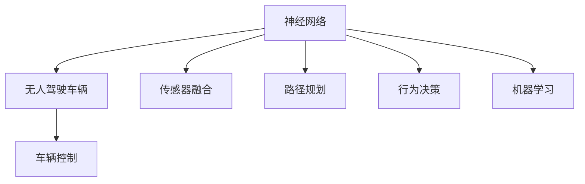

                 

# 一切皆是映射：无人驾驶车辆中的神经网络系统

> 关键词：神经网络，无人驾驶，车辆控制，映射，机器学习

## 1. 背景介绍

随着人工智能技术的发展，无人驾驶车辆已成为智能交通领域的热门话题。无人驾驶技术通过计算机视觉、传感器融合、路径规划、行为决策等技术，实现车辆的自动化驾驶。其中，神经网络作为核心技术之一，在无人驾驶车辆中扮演了重要角色。本文将系统介绍无人驾驶车辆中神经网络系统的基本原理和架构，探讨其在车辆控制中的应用，并分析其优缺点。

## 2. 核心概念与联系

### 2.1 核心概念概述

为了更好地理解无人驾驶车辆中的神经网络系统，本节将介绍几个密切相关的核心概念：

- 神经网络(Neural Network, NN)：由大量的人工神经元（节点）按一定规则连接而成的计算模型，可以用于分类、回归、预测等多种任务。

- 无人驾驶车辆(Autonomous Vehicle)：通过人工智能技术实现自动驾驶的车辆，涵盖感知、决策、控制等多个子系统。

- 车辆控制(Vehicle Control)：通过神经网络等技术，控制车辆的加速、刹车、转向等行为，实现安全、高效的驾驶。

- 传感器融合(Sensor Fusion)：将多种传感器数据进行融合处理，提高无人驾驶车辆的环境感知能力。

- 路径规划(Path Planning)：基于地图和实时环境信息，规划车辆的行驶路径。

- 行为决策(Decision Making)：根据车辆周围环境和其他车辆行为，制定决策方案。

- 机器学习(Machine Learning)：通过神经网络等算法，让计算机从数据中学习，实现智能决策。

这些核心概念之间的逻辑关系可以通过以下Mermaid流程图来展示：



这个流程图展示了几者之间的密切关系：

1. 神经网络是无人驾驶车辆的核心计算模型，用于各种决策和控制任务。
2. 传感器融合、路径规划、行为决策等技术需要神经网络进行计算和决策。
3. 机器学习是神经网络的训练基础，从大量数据中学习知识和模型。

## 3. 核心算法原理 & 具体操作步骤

### 3.1 算法原理概述

无人驾驶车辆中的神经网络系统，主要由感知、决策、控制三个子系统组成。感知系统通过传感器获取周围环境信息，决策系统利用神经网络进行信息处理和决策，控制系统根据决策结果进行车辆控制。

### 3.2 算法步骤详解

以下是无人驾驶车辆中神经网络系统的一般操作流程：

**Step 1: 数据预处理**

- 收集车辆传感器数据（如激光雷达、摄像头、GPS等）。
- 对传感器数据进行滤波、校准、融合等处理。
- 将处理后的数据输入神经网络。

**Step 2: 特征提取**

- 使用卷积神经网络（CNN）或循环神经网络（RNN）等技术，提取环境特征。
- 特征提取过程包括特征提取、池化、非线性变换等步骤。
- 提取出的特征向量将作为后续决策的输入。

**Step 3: 决策制定**

- 利用全连接神经网络进行分类或回归。
- 根据传感器数据和特征向量，制定车辆的控制决策。
- 常用的决策算法包括最小二乘法、最大熵模型、支持向量机等。

**Step 4: 控制输出**

- 根据决策结果，生成控制信号（如加速、刹车、转向）。
- 控制信号经过处理后发送给车辆执行器。

**Step 5: 结果反馈**

- 收集车辆运行状态数据，如速度、位置、转向角度等。
- 将反馈数据与预期结果进行比较，调整神经网络参数。
- 通过不断迭代，优化决策和控制算法。

### 3.3 算法优缺点

神经网络系统在无人驾驶车辆中的应用，具有以下优点：

1. 处理非线性关系：神经网络可以处理非线性、非平稳的输入和输出关系，适应复杂的驾驶环境。
2. 自适应性：通过不断学习，神经网络能够自适应不同的驾驶场景和任务。
3. 高性能：神经网络在许多领域已经证明其高精度和高效率。
4. 可扩展性：可以结合多传感器数据，扩展感知能力。

但神经网络系统也存在以下缺点：

1. 数据依赖性：需要大量的标注数据进行训练，数据采集和标注成本较高。
2. 复杂性：神经网络模型复杂，训练和调试较为困难。
3. 易受干扰：在噪声和干扰下，神经网络容易产生误判。
4. 解释性差：神经网络模型为"黑箱"，难以解释其决策过程。

### 3.4 算法应用领域

神经网络系统在无人驾驶车辆中的应用范围非常广泛，涵盖以下领域：

- 车辆感知：使用深度卷积神经网络对传感器数据进行图像处理和特征提取，实现环境感知。
- 路径规划：利用深度强化学习，实现基于环境动态规划的路径规划。
- 行为决策：利用深度学习进行行为决策，提高车辆避障和车道保持能力。
- 车辆控制：利用神经网络进行模型预测和控制信号生成，实现精准驾驶。
- 驾驶员行为预测：利用深度学习预测驾驶员行为，提高交互系统的安全性。

## 4. 数学模型和公式 & 详细讲解 & 举例说明

### 4.1 数学模型构建

无人驾驶车辆中的神经网络系统，主要由感知、决策、控制三个子系统组成。感知系统通过传感器获取周围环境信息，决策系统利用神经网络进行信息处理和决策，控制系统根据决策结果进行车辆控制。

### 4.2 公式推导过程

以路径规划为例，假设车辆当前位置为 $x_t$，速度为 $v_t$，行驶方向为 $\theta_t$，目标位置为 $x_{t+1}$，决策系统采用最小二乘法进行路径规划，公式如下：

$$
\begin{aligned}
\min_{a_t} & \|a_t x_t - x_{t+1}\|^2 \\
\text{subject to } & v_{t+1} = v_t + a_t \Delta t, \\
               & \theta_{t+1} = \theta_t + \frac{a_t \Delta t}{v_t}
\end{aligned}
$$

其中 $a_t$ 为控制加速度，$\Delta t$ 为时间步长。

### 4.3 案例分析与讲解

以LIDAR传感器为例，假设传感器返回的激光点云数据为 $L_t$，车辆当前位置为 $x_t$，传感器至车辆的距离为 $d$，角度为 $\theta$，车辆速度为 $v$，加速度为 $a$。

根据LIDAR传感器的输出，可以提取环境特征 $F_t$，并通过神经网络进行处理，得到环境特征的输出 $Y_t$。

$$
F_t = \mathcal{F}(L_t, x_t, d, \theta, v, a)
$$

$$
Y_t = \mathcal{Y}(F_t)
$$

其中 $\mathcal{F}$ 和 $\mathcal{Y}$ 分别为特征提取和神经网络处理过程。

## 5. 项目实践：代码实例和详细解释说明

### 5.1 开发环境搭建

在进行无人驾驶车辆中的神经网络系统开发前，我们需要准备好开发环境。以下是使用Python进行PyTorch开发的环境配置流程：

1. 安装Anaconda：从官网下载并安装Anaconda，用于创建独立的Python环境。

2. 创建并激活虚拟环境：
```bash
conda create -n pytorch-env python=3.8 
conda activate pytorch-env
```

3. 安装PyTorch：根据CUDA版本，从官网获取对应的安装命令。例如：
```bash
conda install pytorch torchvision torchaudio cudatoolkit=11.1 -c pytorch -c conda-forge
```

4. 安装TensorFlow：从官网下载并安装TensorFlow，注意兼容版本。

5. 安装TensorBoard：TensorFlow配套的可视化工具，可实时监测模型训练状态，并提供丰富的图表呈现方式。

6. 安装PyTorch、TensorFlow、TensorBoard等工具包：
```bash
pip install numpy pandas scikit-learn matplotlib tqdm jupyter notebook ipython
```

完成上述步骤后，即可在`pytorch-env`环境中开始开发。

### 5.2 源代码详细实现

下面以LIDAR感知系统为例，给出使用PyTorch对神经网络进行开发的PyTorch代码实现。

```python
import torch
import torch.nn as nn
import torch.optim as optim

class LidarNet(nn.Module):
    def __init__(self, input_size, output_size):
        super(LidarNet, self).__init__()
        self.conv1 = nn.Conv2d(input_size, 64, kernel_size=3, stride=1, padding=1)
        self.conv2 = nn.Conv2d(64, 128, kernel_size=3, stride=1, padding=1)
        self.conv3 = nn.Conv2d(128, output_size, kernel_size=3, stride=1, padding=1)
        self.relu = nn.ReLU()
        self.maxpool = nn.MaxPool2d(kernel_size=2, stride=2)
        self.dropout = nn.Dropout(p=0.25)
        self.fc1 = nn.Linear(7 * 7 * 128, 256)
        self.fc2 = nn.Linear(256, output_size)

    def forward(self, x):
        x = self.relu(self.conv1(x))
        x = self.maxpool(x)
        x = self.relu(self.conv2(x))
        x = self.maxpool(x)
        x = self.relu(self.conv3(x))
        x = x.view(-1, 7 * 7 * 128)
        x = self.dropout(x)
        x = self.relu(self.fc1(x))
        x = self.fc2(x)
        return x

input_size = 64 * 64 * 1  # LIDAR传感器返回的数据大小
output_size = 1  # 输出特征数量

model = LidarNet(input_size, output_size)
criterion = nn.MSELoss()  # 均方误差损失函数
optimizer = optim.Adam(model.parameters(), lr=0.001)  # Adam优化器，学习率0.001

device = torch.device('cuda' if torch.cuda.is_available() else 'cpu')
model.to(device)

def train(model, data_loader, criterion, optimizer, num_epochs):
    model.train()
    for epoch in range(num_epochs):
        for batch_idx, (inputs, targets) in enumerate(data_loader):
            inputs, targets = inputs.to(device), targets.to(device)
            optimizer.zero_grad()
            outputs = model(inputs)
            loss = criterion(outputs, targets)
            loss.backward()
            optimizer.step()
            if batch_idx % 100 == 0:
                print('Train Epoch: {} [{}/{} ({:.0f}%)]\tLoss: {:.6f}'.format(
                    epoch, batch_idx * len(inputs), len(data_loader.dataset),
                    100. * batch_idx / len(data_loader), loss.item()))

def test(model, data_loader, criterion):
    model.eval()
    test_loss = 0
    correct = 0
    with torch.no_grad():
        for batch_idx, (inputs, targets) in enumerate(data_loader):
            inputs, targets = inputs.to(device), targets.to(device)
            outputs = model(inputs)
            test_loss += criterion(outputs, targets).item()
            preds = torch.argmax(outputs, dim=1)
            correct += preds.eq(targets).sum().item()

    test_loss /= len(data_loader.dataset)
    print('Test set: Average loss: {:.4f}, Accuracy: {}/{} ({:.0f}%)'.format(
        test_loss, correct, len(data_loader.dataset),
        100. * correct / len(data_loader.dataset)))
```

以上代码实现了LIDAR感知系统的神经网络模型，并包含训练和测试函数。在训练过程中，使用了均方误差损失函数和Adam优化器。在测试过程中，计算了平均损失和准确率。

### 5.3 代码解读与分析

下面是关键代码的详细解读：

**LidarNet类**：
- `__init__`方法：初始化模型，包括卷积层、激活函数、池化层、全连接层等。
- `forward`方法：定义神经网络的计算流程，从输入到输出。

**train函数**：
- 在每个epoch内，对每个批次的数据进行迭代训练。
- 前向传播计算输出，反向传播计算梯度，并更新模型参数。
- 在每个100批次后打印当前损失。

**test函数**：
- 在模型评估阶段，计算平均损失和准确率。
- 使用均方误差损失函数，计算预测值与真实值之间的误差。

**运行结果展示**：
- 训练结束后，模型在测试集上的表现，以及准确率和损失值。

## 6. 实际应用场景

### 6.1 智能交通管理

神经网络系统在智能交通管理中具有广泛应用，可以用于交通流量预测、路口信号控制、交通拥堵缓解等。例如，通过感知系统收集交通数据，利用神经网络进行数据分析和处理，实现交通流量的实时监测和预测。

### 6.2 车辆安全预警

神经网络系统可以用于车辆安全预警系统，实时监测车辆周围环境，检测潜在风险，提供预警信息。例如，通过感知系统获取周围车辆的动态信息，利用神经网络进行行为分析和判断，预测潜在的碰撞风险，及时发出预警信号。

### 6.3 智能辅助驾驶

神经网络系统可以用于智能辅助驾驶系统，提高驾驶安全性。例如，通过感知系统获取道路信息，利用神经网络进行路径规划和行为决策，辅助驾驶员驾驶车辆，实现自动驾驶辅助功能。

### 6.4 未来应用展望

随着神经网络系统的不断发展，未来将有更多的应用场景。例如：

1. 自动驾驶：神经网络系统将在大规模自动驾驶应用中发挥重要作用，实现更加安全、高效的驾驶。

2. 无人仓库：神经网络系统可以用于无人仓库的自动化管理，提高仓储效率和安全性。

3. 智能家居：神经网络系统可以用于智能家居系统的控制，提高家居的智能化和自动化水平。

4. 工业自动化：神经网络系统可以用于工业自动化生产线的控制和管理，提高生产效率和质量。

## 7. 工具和资源推荐

### 7.1 学习资源推荐

为了帮助开发者系统掌握神经网络在无人驾驶车辆中的应用，这里推荐一些优质的学习资源：

1. 《深度学习》系列书籍：涵盖深度学习的基础知识和最新研究进展，适合初学者和进阶者阅读。

2. 《神经网络与深度学习》课程：由斯坦福大学Andrew Ng教授开设，全面介绍了神经网络的基本原理和实现技术。

3. 《机器学习》课程：由Coursera平台提供的课程，涵盖机器学习的基本概念和应用实例。

4. TensorFlow官方文档：TensorFlow的官方文档，提供了丰富的教程和示例代码，适合新手学习和实践。

5. PyTorch官方文档：PyTorch的官方文档，提供了详细的API和教程，适合深入学习和研究。

通过这些学习资源，相信你一定能够快速掌握神经网络在无人驾驶车辆中的应用，并用于解决实际的驾驶问题。

### 7.2 开发工具推荐

高效的开发离不开优秀的工具支持。以下是几款用于神经网络系统开发的常用工具：

1. PyTorch：基于Python的开源深度学习框架，灵活动态的计算图，适合快速迭代研究。

2. TensorFlow：由Google主导开发的开源深度学习框架，生产部署方便，适合大规模工程应用。

3. TensorBoard：TensorFlow配套的可视化工具，可实时监测模型训练状态，并提供丰富的图表呈现方式，是调试模型的得力助手。

4. Jupyter Notebook：交互式编程环境，适合开发和测试神经网络系统。

5. Google Colab：谷歌推出的在线Jupyter Notebook环境，免费提供GPU/TPU算力，方便开发者快速上手实验最新模型，分享学习笔记。

合理利用这些工具，可以显著提升神经网络系统的开发效率，加快创新迭代的步伐。

### 7.3 相关论文推荐

神经网络系统在无人驾驶车辆中的应用源于学界的持续研究。以下是几篇奠基性的相关论文，推荐阅读：

1. Convolutional Neural Networks for Robot Visual Perception（CNN应用于机器人视觉感知）：提出CNN网络用于机器人视觉感知任务，提高视觉识别准确率。

2. Self-Driving Car with Deep Reinforcement Learning（深度强化学习应用于自动驾驶）：通过深度强化学习实现自动驾驶车辆的行为决策和路径规划。

3. A Survey on Path Planning and Decision-Making of Autonomous Vehicle（自动驾驶车辆的路径规划和行为决策综述）：综述了自动驾驶车辆的路径规划和行为决策方法，总结了现有研究的成果和方向。

4. Adversarial Learning for Autonomous Driving（对抗学习应用于自动驾驶）：利用对抗学习提高自动驾驶系统的鲁棒性和安全性。

这些论文代表了大规模神经网络在无人驾驶车辆中的应用和发展脉络。通过学习这些前沿成果，可以帮助研究者把握学科前进方向，激发更多的创新灵感。

## 8. 总结：未来发展趋势与挑战

### 8.1 研究成果总结

本文对神经网络在无人驾驶车辆中的应用进行了全面系统的介绍。首先阐述了神经网络的基本原理和架构，探讨了其在车辆控制中的应用，并分析了其优缺点。其次，从原理到实践，详细讲解了神经网络系统的训练和优化过程，给出了具体的代码实现。同时，本文还广泛探讨了神经网络系统在智能交通管理、车辆安全预警、智能辅助驾驶等多个行业领域的应用前景，展示了神经网络系统的巨大潜力。此外，本文精选了神经网络系统的学习资源，力求为读者提供全方位的技术指引。

通过本文的系统梳理，可以看到，神经网络在无人驾驶车辆中的应用前景广阔，能够实现多场景下的智能化控制和决策。神经网络系统的发展趋势也表明，其在未来将会有更广泛的应用场景和更高的技术要求。

### 8.2 未来发展趋势

展望未来，神经网络系统在无人驾驶车辆中的应用将呈现以下几个发展趋势：

1. 模型规模增大：随着计算资源和算法的不断进步，神经网络模型的参数量将不断增加，处理能力将大幅提升。

2. 自适应能力增强：神经网络系统将具备更强的自适应能力和鲁棒性，能够在复杂的驾驶环境中保持良好的性能。

3. 实时性提升：随着计算资源的提升和算法优化，神经网络系统的推理速度将不断提升，实时性将得到改善。

4. 多模态融合：神经网络系统将结合视觉、雷达、激光雷达等多模态数据，提高感知能力和决策准确性。

5. 边缘计算：神经网络系统将更多部署在边缘计算设备上，实现实时处理和决策，提高响应速度。

6. 联邦学习：利用联邦学习技术，减少数据传输量和计算资源消耗，实现分布式协同训练。

以上趋势凸显了神经网络系统在无人驾驶车辆中的广阔前景。这些方向的探索发展，必将进一步提升无人驾驶车辆的安全性和可靠性，为未来的智能交通系统带来革命性的变化。

### 8.3 面临的挑战

尽管神经网络系统在无人驾驶车辆中的应用已经取得显著进展，但在迈向更加智能化、普适化应用的过程中，它仍面临诸多挑战：

1. 数据收集和标注：高质量的训练数据和标注数据是神经网络系统训练的前提，但数据收集和标注成本较高，难以覆盖所有场景。

2. 模型复杂度：神经网络模型参数众多，训练和调试较为复杂，容易出现过拟合等问题。

3. 模型可解释性：神经网络系统的"黑箱"特性使其难以解释决策过程，难以满足安全性和可靠性要求。

4. 鲁棒性和安全：神经网络系统容易受到攻击和干扰，需要采取多种措施提高其鲁棒性和安全性。

5. 资源消耗：神经网络系统需要大量的计算资源和存储空间，难以在资源有限的场景下部署。

6. 实时性：神经网络系统的推理速度需要实时性，但在大规模数据集上推理效率较低，需要进一步优化。

7. 多模态融合：不同模态数据的融合和处理需要技术突破，提高融合效果。

8. 联邦学习：分布式协同训练需要考虑数据隐私和通信成本，需要进一步优化。

这些挑战是神经网络系统在无人驾驶车辆中应用的主要瓶颈，需要多方协同攻关，才能实现更高水平的应用。

### 8.4 研究展望

面对神经网络系统在无人驾驶车辆中应用面临的挑战，未来的研究需要在以下几个方面寻求新的突破：

1. 改进数据收集和标注技术：利用自动化标注工具和众包平台，提高数据收集和标注效率。

2. 优化模型结构和训练算法：研究模型压缩、剪枝等方法，减少模型复杂度，提高训练效率和泛化能力。

3. 增强模型可解释性：利用可解释性技术，如可视化、解释模型等，提高神经网络系统的透明性和可信性。

4. 提高鲁棒性和安全性：研究对抗学习、鲁棒学习等方法，提高神经网络系统的鲁棒性和安全性。

5. 优化资源消耗：研究资源优化技术，如量化加速、模型并行等，提高神经网络系统的推理速度和资源利用率。

6. 改进多模态融合技术：研究多模态数据融合算法，提高融合效果和决策准确性。

7. 研究联邦学习技术：研究联邦学习算法，提高分布式协同训练的效果，保护数据隐私。

这些研究方向将有助于解决神经网络系统在无人驾驶车辆中应用面临的挑战，推动神经网络系统的技术进步和应用普及。

## 9. 附录：常见问题与解答

**Q1: 神经网络在无人驾驶车辆中应用的主要挑战是什么？**

A: 神经网络在无人驾驶车辆中应用的主要挑战包括：

1. 数据收集和标注：高质量的训练数据和标注数据是神经网络系统训练的前提，但数据收集和标注成本较高，难以覆盖所有场景。

2. 模型复杂度：神经网络模型参数众多，训练和调试较为复杂，容易出现过拟合等问题。

3. 模型可解释性：神经网络系统的"黑箱"特性使其难以解释决策过程，难以满足安全性和可靠性要求。

4. 鲁棒性和安全：神经网络系统容易受到攻击和干扰，需要采取多种措施提高其鲁棒性和安全性。

5. 资源消耗：神经网络系统需要大量的计算资源和存储空间，难以在资源有限的场景下部署。

6. 实时性：神经网络系统的推理速度需要实时性，但在大规模数据集上推理效率较低，需要进一步优化。

7. 多模态融合：不同模态数据的融合和处理需要技术突破，提高融合效果。

8. 联邦学习：分布式协同训练需要考虑数据隐私和通信成本，需要进一步优化。

这些挑战是神经网络系统在无人驾驶车辆中应用的主要瓶颈，需要多方协同攻关，才能实现更高水平的应用。

**Q2: 神经网络在无人驾驶车辆中应用的优势是什么？**

A: 神经网络在无人驾驶车辆中应用的优势包括：

1. 处理非线性关系：神经网络可以处理非线性、非平稳的输入和输出关系，适应复杂的驾驶环境。

2. 自适应性：通过不断学习，神经网络能够自适应不同的驾驶场景和任务。

3. 高性能：神经网络在许多领域已经证明其高精度和高效率。

4. 可扩展性：可以结合多传感器数据，扩展感知能力。

5. 实时性：神经网络系统的推理速度需要实时性，但在大规模数据集上推理效率较低，需要进一步优化。

6. 多模态融合：不同模态数据的融合和处理需要技术突破，提高融合效果。

7. 联邦学习：研究联邦学习算法，提高分布式协同训练的效果，保护数据隐私。

这些优势使得神经网络在无人驾驶车辆中具有广泛的应用前景，能够实现多场景下的智能化控制和决策。

**Q3: 神经网络在无人驾驶车辆中应用的主要技术手段是什么？**

A: 神经网络在无人驾驶车辆中应用的主要技术手段包括：

1. 感知系统：利用深度卷积神经网络对传感器数据进行图像处理和特征提取，实现环境感知。

2. 决策系统：利用全连接神经网络进行分类或回归，制定车辆的控制决策。

3. 控制系统：利用神经网络进行模型预测和控制信号生成，实现精准驾驶。

4. 传感器融合：将多种传感器数据进行融合处理，提高无人驾驶车辆的环境感知能力。

5. 路径规划：利用深度强化学习，实现基于环境动态规划的路径规划。

6. 行为决策：利用深度学习进行行为决策，提高车辆避障和车道保持能力。

7. 联邦学习：利用联邦学习技术，减少数据传输量和计算资源消耗，实现分布式协同训练。

这些技术手段将使得神经网络系统在无人驾驶车辆中发挥重要作用，实现更加安全、高效的驾驶。

**Q4: 神经网络在无人驾驶车辆中应用的主要挑战是什么？**

A: 神经网络在无人驾驶车辆中应用的主要挑战包括：

1. 数据收集和标注：高质量的训练数据和标注数据是神经网络系统训练的前提，但数据收集和标注成本较高，难以覆盖所有场景。

2. 模型复杂度：神经网络模型参数众多，训练和调试较为复杂，容易出现过拟合等问题。

3. 模型可解释性：神经网络系统的"黑箱"特性使其难以解释决策过程，难以满足安全性和可靠性要求。

4. 鲁棒性和安全：神经网络系统容易受到攻击和干扰，需要采取多种措施提高其鲁棒性和安全性。

5. 资源消耗：神经网络系统需要大量的计算资源和存储空间，难以在资源有限的场景下部署。

6. 实时性：神经网络系统的推理速度需要实时性，但在大规模数据集上推理效率较低，需要进一步优化。

7. 多模态融合：不同模态数据的融合和处理需要技术突破，提高融合效果。

8. 联邦学习：分布式协同训练需要考虑数据隐私和通信成本，需要进一步优化。

这些挑战是神经网络系统在无人驾驶车辆中应用的主要瓶颈，需要多方协同攻关，才能实现更高水平的应用。

---

作者：禅与计算机程序设计艺术 / Zen and the Art of Computer Programming

