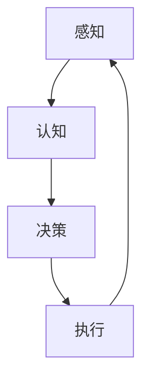

# AI Agent: AI的下一个风口 AI的起源与进化

## 1.背景介绍
### 1.1 人工智能的发展历程
#### 1.1.1 早期人工智能
#### 1.1.2 专家系统时代
#### 1.1.3 机器学习与深度学习崛起

### 1.2 AI Agent的诞生
#### 1.2.1 AI Agent的定义
#### 1.2.2 AI Agent的特点
#### 1.2.3 AI Agent的优势

### 1.3 AI Agent的应用前景
#### 1.3.1 个人助理
#### 1.3.2 企业服务
#### 1.3.3 行业应用

## 2.核心概念与联系
### 2.1 AI Agent的核心概念
#### 2.1.1 感知
#### 2.1.2 认知
#### 2.1.3 决策
#### 2.1.4 执行

### 2.2 AI Agent与其他AI技术的关系
#### 2.2.1 机器学习
#### 2.2.2 深度学习
#### 2.2.3 自然语言处理
#### 2.2.4 计算机视觉

### 2.3 AI Agent的架构


## 3.核心算法原理具体操作步骤
### 3.1 强化学习
#### 3.1.1 Q-Learning
#### 3.1.2 Policy Gradient
#### 3.1.3 Actor-Critic

### 3.2 深度强化学习
#### 3.2.1 DQN Deep Q-Network
#### 3.2.2 DDPG Deep Deterministic Policy Gradient
#### 3.2.3 A3C Asynchronous Advantage Actor-Critic

### 3.3 多智能体强化学习
#### 3.3.1 Independent Q-Learning
#### 3.3.2 Joint Action Learning
#### 3.3.3 Decentralized Actor, Centralized Critic

## 4.数学模型和公式详细讲解举例说明
### 4.1 马尔可夫决策过程MDP
一个MDP可以表示为一个五元组 $\langle S,A,P,R,\gamma \rangle$：

- $S$ 是有限的状态集合
- $A$ 是有限的动作集合
- $P$ 是状态转移概率矩阵，$P_{ss'}^a=P[S_{t+1}=s'|S_t=s,A_t=a]$
- $R$ 是回报函数，$R_s^a=E[R_{t+1}|S_t=s,A_t=a]$
- $\gamma$ 是折扣因子，$\gamma \in [0,1]$

求解MDP的目标是寻找一个最优策略 $\pi^*$，使得期望总回报最大化：

$$\pi^* = \arg\max_\pi E[\sum_{t=0}^\infty \gamma^t R_{t+1}|S_0,\pi]$$

### 4.2 Q-Learning
Q-Learning是一种无模型、异策略的时序差分学习算法。其迭代更新Q值的公式为：

$$Q(S_t,A_t) \leftarrow Q(S_t,A_t)+\alpha[R_{t+1}+\gamma \max_a Q(S_{t+1},a)-Q(S_t,A_t)]$$

其中，$\alpha \in (0,1]$ 是学习率，$\gamma \in [0,1]$ 是折扣因子。

### 4.3 Policy Gradient
Policy Gradient方法直接对策略函数 $\pi_\theta(a|s)$ 的参数 $\theta$ 进行优化，其目标函数为：

$$J(\theta)=E_{s_0,a_0,...}[\sum_{t=0}^\infty \gamma^t r_t]$$

其中，$s_0 \sim \rho_0(s_0), a_t \sim \pi_\theta(a_t|s_t), s_{t+1} \sim P(s_{t+1}|s_t,a_t)$。

根据策略梯度定理，策略梯度可以表示为：

$$\nabla_\theta J(\theta) = E_{s_0,a_0,...}[\sum_{t=0}^\infty \gamma^t \nabla_\theta \log \pi_\theta(a_t|s_t) Q^{\pi_\theta}(s_t,a_t)]$$

## 5.项目实践：代码实例和详细解释说明
下面是一个简单的Q-Learning算法在网格世界环境中寻找最优路径的Python实现：

```python
import numpy as np

# 定义网格世界环境
class GridWorld:
    def __init__(self, width, height, start, goal):
        self.width = width
        self.height = height
        self.start = start
        self.goal = goal
        self.agent_pos = start

    def reset(self):
        self.agent_pos = self.start
        return self.agent_pos

    def step(self, action):
        if action == 0:  # 上
            next_pos = (self.agent_pos[0], max(0, self.agent_pos[1]-1))
        elif action == 1:  # 下
            next_pos = (self.agent_pos[0], min(self.height-1, self.agent_pos[1]+1))
        elif action == 2:  # 左
            next_pos = (max(0, self.agent_pos[0]-1), self.agent_pos[1])
        elif action == 3:  # 右
            next_pos = (min(self.width-1, self.agent_pos[0]+1), self.agent_pos[1])
        else:
            raise ValueError("Invalid action!")

        self.agent_pos = next_pos
        reward = 0
        done = False
        if next_pos == self.goal:
            reward = 1
            done = True
        return next_pos, reward, done

# 定义Q-Learning智能体
class QLearningAgent:
    def __init__(self, env, alpha, gamma, epsilon):
        self.env = env
        self.alpha = alpha
        self.gamma = gamma
        self.epsilon = epsilon
        self.Q = np.zeros((env.width, env.height, 4))

    def choose_action(self, state):
        if np.random.uniform() < self.epsilon:
            action = np.random.choice(4)
        else:
            action = np.argmax(self.Q[state[0], state[1], :])
        return action

    def learn(self, state, action, reward, next_state, done):
        td_target = reward + self.gamma * np.max(self.Q[next_state[0], next_state[1], :]) * (1-done)
        td_error = td_target - self.Q[state[0], state[1], action]
        self.Q[state[0], state[1], action] += self.alpha * td_error

# 主程序
if __name__ == "__main__":
    env = GridWorld(5, 5, (0, 0), (4, 4))
    agent = QLearningAgent(env, alpha=0.1, gamma=0.9, epsilon=0.1)

    num_episodes = 500
    for _ in range(num_episodes):
        state = env.reset()
        done = False
        while not done:
            action = agent.choose_action(state)
            next_state, reward, done = env.step(action)
            agent.learn(state, action, reward, next_state, done)
            state = next_state

    print(agent.Q)  # 输出学到的Q表
```

这个示例中，我们首先定义了一个简单的5x5网格世界环境`GridWorld`，智能体从左上角(0,0)出发，目标是到达右下角(4,4)。环境中一共有4个动作：上、下、左、右。

然后我们定义了一个Q-Learning智能体`QLearningAgent`，使用 $\epsilon$-greedy 探索策略选择动作，并根据Q-Learning算法更新Q表。

在主程序中，我们让智能体与环境进行500轮交互，在每一轮中，智能体从初始状态出发，根据当前Q表选择动作，执行动作后获得下一个状态和奖励，并更新Q表，直到到达终止状态。最后输出学习到的Q表。

通过Q-Learning算法，智能体可以逐步学习到在每一个状态下采取最优动作的策略，从而找到从起点到终点的最短路径。

## 6.实际应用场景
### 6.1 智能客服
AI Agent可以作为智能客服，7x24小时为用户提供咨询服务，解答各种常见问题，提高客户满意度和工作效率。

### 6.2 个人助理
AI Agent可以作为个人助理，根据用户的喜好和行为习惯，主动提供个性化的信息和服务，如日程管理、购物推荐等。

### 6.3 自动驾驶
AI Agent可以应用于自动驾驶领域，通过感知环境信息，预测行人和车辆的运动趋势，规划行驶路线，控制车辆安全行驶。

### 6.4 智能制造
AI Agent可以应用于工业生产领域，通过分析设备运行数据，优化生产流程，预测设备故障，提高生产效率和产品质量。

## 7.工具和资源推荐
### 7.1 开发平台
- [OpenAI Gym](https://gym.openai.com/) - 强化学习环境模拟器
- [DeepMind Lab](https://github.com/deepmind/lab) - 首款面向研究人员的3D游戏学习平台
- [Unity ML-Agents](https://github.com/Unity-Technologies/ml-agents) - 将游戏开发与深度强化学习相结合的开源项目

### 7.2 深度学习框架
- [TensorFlow](https://www.tensorflow.org/) - 谷歌开源的端到端机器学习平台
- [PyTorch](https://pytorch.org/) - Facebook开源的深度学习框架
- [Keras](https://keras.io/) - 基于TensorFlow和Theano的高层神经网络API

### 7.3 学习资源
- [Deep Reinforcement Learning Nanodegree](https://www.udacity.com/course/deep-reinforcement-learning-nanodegree--nd893) - Udacity提供的深度强化学习纳米学位
- [Reinforcement Learning: An Introduction](http://incompleteideas.net/book/the-book-2nd.html) - Richard S. Sutton和Andrew G. Barto所著的强化学习经典教材
- [Deep Learning](https://www.deeplearningbook.org/) - Ian Goodfellow等人所著的深度学习圣经

## 8.总结：未来发展趋势与挑战
### 8.1 AI Agent的发展趋势
- 多模态感知与交互
- 持续学习与自主进化
- 群体协作与涌现智能
- 安全可控与伦理道德

### 8.2 AI Agent面临的挑战
- 环境建模与仿真
- 样本效率与泛化能力
- 因果推理与可解释性
- 目标设定与价值对齐

### 8.3 AI Agent的未来展望
AI Agent作为人工智能的下一个风口，必将在各行各业掀起智能化变革的浪潮。随着AI Agent在感知、认知、决策、执行等方面能力的不断提升，未来将诞生越来越多形态各异、功能强大的智能体，它们将无处不在地渗透到人类生活的方方面面，成为人类智慧的延伸和拓展。同时，AI Agent的发展也对人类社会提出了新的挑战，需要在技术创新的同时兼顾伦理、法律和社会影响等因素。人工智能的未来充满无限可能，让我们拭目以待！

## 9.附录：常见问题与解答
### 9.1 什么是AI Agent？它与其他AI技术有何不同？
AI Agent是一种能够感知环境、自主决策和执行动作的人工智能系统。与传统的机器学习和深度学习相比，AI Agent更加强调主动性、自适应性和目标导向性，能够在复杂多变的环境中学习和进化。

### 9.2 AI Agent的核心算法有哪些？各有何特点？
AI Agent的核心算法主要包括强化学习、深度强化学习和多智能体强化学习。其中，强化学习通过试错与环境交互，不断优化策略以获得最大化累积奖励；深度强化学习将深度学习与强化学习相结合，利用神经网络逼近值函数或策略函数；多智能体强化学习考虑了多个智能体之间的互动与协作，更加贴近现实世界的应用场景。

### 9.3 如何设计一个AI Agent系统？需要考虑哪些因素？
设计AI Agent系统需要考虑以下几个关键因素：
1. 明确系统目标和应用场景
2. 选择合适的环境模型和状态表示
3. 设计有效的奖励函数引导智能体学习
4. 权衡探索和利用，平衡样本效率和策略优化
5. 采用稳定高效的学习算法更新策略
6. 引入先验知识和人类反馈提升学习效果
7. 验证算法的收敛性、鲁棒性和泛化能力
8. 评估系统的安全性、可解释性和伦理合规性

### 9.4 如何评估一个AI Agent系统的性能？有哪些指标？
评估AI Agent系统的性能一般采用以下指标：
- 累积奖励：衡量智能体在整个交互过程中获得的总