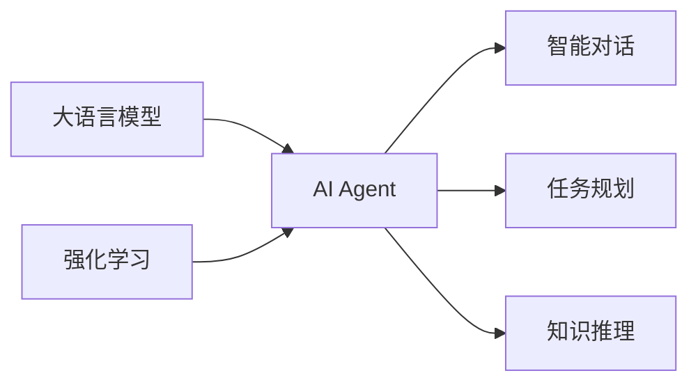

# AI Agent: AI的下一个风口 大模型驱动的智能体

## 1. 背景介绍
### 1.1 人工智能的发展历程
#### 1.1.1 早期的人工智能
#### 1.1.2 机器学习的兴起
#### 1.1.3 深度学习的突破

### 1.2 大语言模型的出现
#### 1.2.1 Transformer架构的提出
#### 1.2.2 GPT系列模型的发展
#### 1.2.3 大模型的广泛应用

### 1.3 AI Agent的概念
#### 1.3.1 智能体的定义
#### 1.3.2 AI Agent的特点
#### 1.3.3 AI Agent的发展现状

## 2. 核心概念与联系
### 2.1 大语言模型
#### 2.1.1 语言模型的基本原理
#### 2.1.2 大语言模型的特点
#### 2.1.3 大语言模型的训练方法

### 2.2 AI Agent
#### 2.2.1 AI Agent的组成部分
#### 2.2.2 AI Agent的工作原理
#### 2.2.3 AI Agent与大语言模型的关系

### 2.3 强化学习
#### 2.3.1 强化学习的基本概念
#### 2.3.2 强化学习在AI Agent中的应用
#### 2.3.3 强化学习与大语言模型的结合



## 3. 核心算法原理具体操作步骤
### 3.1 Transformer架构
#### 3.1.1 Self-Attention机制
#### 3.1.2 Multi-Head Attention
#### 3.1.3 位置编码

### 3.2 GPT模型
#### 3.2.1 GPT模型的结构
#### 3.2.2 GPT模型的训练过程
#### 3.2.3 GPT模型的生成过程

### 3.3 强化学习算法
#### 3.3.1 Q-Learning算法
#### 3.3.2 Policy Gradient算法
#### 3.3.3 Actor-Critic算法

## 4. 数学模型和公式详细讲解举例说明
### 4.1 Transformer的数学表示
#### 4.1.1 Self-Attention的计算公式
$$
Attention(Q,K,V) = softmax(\frac{QK^T}{\sqrt{d_k}})V
$$
其中，$Q$、$K$、$V$分别表示查询、键、值矩阵，$d_k$为键向量的维度。

#### 4.1.2 Multi-Head Attention的计算公式
$$
MultiHead(Q,K,V) = Concat(head_1, ..., head_h)W^O \
head_i = Attention(QW_i^Q, KW_i^K, VW_i^V)
$$
其中，$W_i^Q$、$W_i^K$、$W_i^V$、$W^O$为可学习的权重矩阵。

### 4.2 强化学习的数学表示
#### 4.2.1 Q-Learning的更新公式
$$
Q(s,a) \leftarrow Q(s,a) + \alpha[r + \gamma \max_{a'}Q(s',a') - Q(s,a)]
$$
其中，$s$为当前状态，$a$为当前动作，$r$为奖励，$s'$为下一个状态，$\alpha$为学习率，$\gamma$为折扣因子。

#### 4.2.2 Policy Gradient的目标函数
$$
J(\theta) = \mathbb{E}_{\tau \sim p_{\theta}(\tau)}[R(\tau)]
$$
其中，$\theta$为策略的参数，$\tau$为轨迹，$R(\tau)$为轨迹的累积奖励。

## 5. 项目实践：代码实例和详细解释说明
### 5.1 使用PyTorch实现Transformer
```python
import torch
import torch.nn as nn

class SelfAttention(nn.Module):
    def __init__(self, embed_size, heads):
        super(SelfAttention, self).__init__()
        self.embed_size = embed_size
        self.heads = heads
        self.head_dim = embed_size // heads

        assert (self.head_dim * heads == embed_size), "Embed size needs to be divisible by heads"

        self.values = nn.Linear(self.head_dim, self.head_dim, bias=False)
        self.keys = nn.Linear(self.head_dim, self.head_dim, bias=False)
        self.queries = nn.Linear(self.head_dim, self.head_dim, bias=False)
        self.fc_out = nn.Linear(heads * self.head_dim, embed_size)

    def forward(self, values, keys, query, mask):
        N = query.shape[0]
        value_len, key_len, query_len = values.shape[1], keys.shape[1], query.shape[1]

        values = values.reshape(N, value_len, self.heads, self.head_dim)
        keys = keys.reshape(N, key_len, self.heads, self.head_dim)
        queries = query.reshape(N, query_len, self.heads, self.head_dim)

        values = self.values(values)
        keys = self.keys(keys)
        queries = self.queries(queries)

        energy = torch.einsum("nqhd,nkhd->nhqk", [queries, keys])

        if mask is not None:
            energy = energy.masked_fill(mask == 0, float("-1e20"))

        attention = torch.softmax(energy / (self.embed_size ** (1/2)), dim=3)

        out = torch.einsum("nhql,nlhd->nqhd", [attention, values]).reshape(
            N, query_len, self.heads * self.head_dim
        )

        out = self.fc_out(out)
        return out
```
以上代码实现了Transformer中的Self-Attention机制，通过计算查询、键、值之间的注意力权重，实现了对输入序列的编码。

### 5.2 使用TensorFlow实现强化学习
```python
import tensorflow as tf

class PolicyGradientAgent:
    def __init__(self, state_size, action_size, learning_rate):
        self.state_size = state_size
        self.action_size = action_size
        self.learning_rate = learning_rate

        self.gamma = 0.99
        self.states, self.actions, self.rewards = [], [], []

        self.model = self.build_model()
        self.optimizer = tf.keras.optimizers.Adam(learning_rate)

    def build_model(self):
        model = tf.keras.Sequential([
            tf.keras.layers.Dense(64, activation='relu', input_shape=(self.state_size,)),
            tf.keras.layers.Dense(64, activation='relu'),
            tf.keras.layers.Dense(self.action_size, activation='softmax')
        ])
        return model

    def remember(self, state, action, reward):
        self.states.append(state)
        self.actions.append(action)
        self.rewards.append(reward)

    def act(self, state):
        state = np.reshape(state, (1, self.state_size))
        action_probs = self.model.predict(state)[0]
        action = np.random.choice(self.action_size, p=action_probs)
        return action

    def train(self):
        states = np.array(self.states)
        actions = np.array(self.actions)
        rewards = np.array(self.rewards)

        discounted_rewards = np.zeros_like(rewards)
        running_add = 0
        for t in reversed(range(len(rewards))):
            running_add = running_add * self.gamma + rewards[t]
            discounted_rewards[t] = running_add

        discounted_rewards -= np.mean(discounted_rewards)
        discounted_rewards /= np.std(discounted_rewards)

        with tf.GradientTape() as tape:
            action_probs = self.model(states)
            action_mask = tf.one_hot(actions, self.action_size)
            log_probs = tf.math.log(tf.reduce_sum(action_probs * action_mask, axis=1))
            loss = -tf.reduce_sum(log_probs * discounted_rewards)

        grads = tape.gradient(loss, self.model.trainable_variables)
        self.optimizer.apply_gradients(zip(grads, self.model.trainable_variables))

        self.states, self.actions, self.rewards = [], [], []
```
以上代码实现了Policy Gradient算法，通过构建策略网络，根据状态生成动作概率分布，并使用梯度上升优化策略网络的参数，最大化期望回报。

## 6. 实际应用场景
### 6.1 智能客服
AI Agent可以作为智能客服，利用大语言模型的自然语言理解和生成能力，与用户进行多轮对话，解答用户的问题，提供个性化的服务。

### 6.2 个人助理
AI Agent可以作为个人助理，根据用户的需求和偏好，提供日程管理、信息检索、推荐等服务，提高用户的工作和生活效率。

### 6.3 智能教育
AI Agent可以作为智能教育助手，根据学生的学习进度和掌握程度，提供个性化的学习内容和练习，实现自适应学习。

## 7. 工具和资源推荐
### 7.1 开源框架
- PyTorch: 基于Python的深度学习框架，提供了灵活的API和动态计算图。
- TensorFlow: 由Google开发的开源机器学习框架，提供了丰富的工具和资源。
- Hugging Face Transformers: 提供了各种预训练的Transformer模型和工具，方便快速开发。

### 7.2 数据集
- GPT-3 API: OpenAI提供的GPT-3 API，可以直接使用GPT-3模型进行文本生成和对话。
- MultiWOZ: 多领域对话数据集，包含酒店、餐厅、出租车等多个领域的对话数据。
- bAbI: Facebook提供的问答数据集，用于测试AI系统的推理和理解能力。

### 7.3 学习资源
- 《Attention Is All You Need》: Transformer的原始论文，介绍了Self-Attention机制和Transformer架构。
- 《Reinforcement Learning: An Introduction》: 强化学习的经典教材，系统介绍了强化学习的基本概念和算法。
- 《Deep Learning with PyTorch》: PyTorch的入门教程，通过实例讲解如何使用PyTorch进行深度学习。

## 8. 总结：未来发展趋势与挑战
### 8.1 未来发展趋势
- 大模型的持续发展：随着计算能力的提升和数据的积累，大语言模型将继续发展，模型规模将进一步扩大，性能将不断提高。
- 多模态融合：将语言、视觉、音频等多种模态信息融合，实现更加全面和智能的AI Agent。
- 个性化和定制化：根据用户的特点和需求，提供个性化和定制化的AI Agent服务，提高用户体验。

### 8.2 面临的挑战
- 数据隐私和安全：如何在保护用户隐私的同时，获取足够的数据来训练AI Agent，是一个需要解决的问题。
- 伦理和道德问题：AI Agent在使用过程中可能涉及伦理和道德问题，需要建立相应的规范和准则。
- 可解释性和可控性：如何让AI Agent的决策过程更加透明和可解释，如何对AI Agent的行为进行有效控制，是亟待解决的难题。

## 9. 附录：常见问题与解答
### 9.1 AI Agent和传统的规则系统有什么区别？
AI Agent基于大语言模型和强化学习，具有更强的自然语言理解和生成能力，可以进行开放域的对话和任务处理。而传统的规则系统基于预先定义的规则，只能处理有限的场景和问题。

### 9.2 AI Agent需要多少数据才能训练出来？
训练一个高质量的AI Agent需要大量的数据，包括语料库、知识库、对话数据等。具体所需的数据量取决于任务的复杂度和模型的规模。一般来说，数据量越大，模型的性能就越好。

### 9.3 AI Agent能否完全取代人工客服？
目前AI Agent在一些常见问题的解答和简单任务的处理上已经可以达到较高的水平，但是对于复杂的问题和决策，仍然需要人工客服的参与。AI Agent可以作为人工客服的辅助工具，提高工作效率和服务质量。

作者：禅与计算机程序设计艺术 / Zen and the Art of Computer Programming