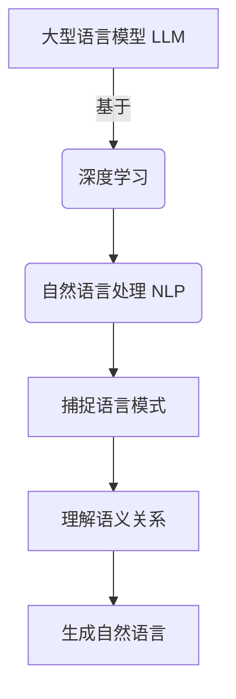
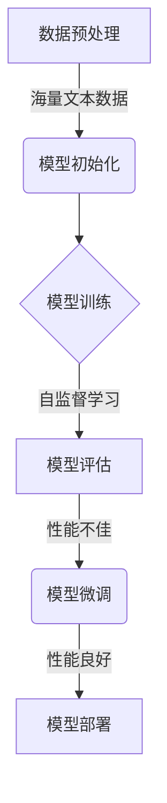
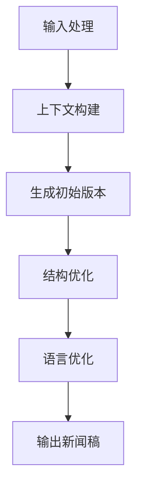

# AI LLM如何重塑新闻产业：自动生成文章

## 1.背景介绍

### 1.1 新闻行业的现状与挑战

在当今快节奏的数字时代，新闻行业正面临前所未有的挑战。传统的新闻编辑室不得不与社交媒体上的即时新闻源以及各种在线媒体平台展开激烈竞争,以吸引读者的注意力。此外,新闻从业者还必须满足读者对高质量、及时、个性化内容的日益增长的需求。

### 1.2 人工智能在新闻领域的应用

为了应对这些挑战,新闻机构开始转向人工智能(AI)技术,尤其是大型语言模型(LLM),以提高新闻生产的效率和质量。LLM是一种基于深度学习的自然语言处理(NLP)模型,能够理解和生成人类语言。它们被训练在海量文本数据上,可以捕捉语言的复杂模式和语义关系。

### 1.3 LLM在新闻生成中的作用

LLM在新闻生成中可以发挥多方面的作用,包括:

- 自动撰写新闻稿
- 生成个性化新闻摘要
- 自动生成标题和元描述
- 根据关键词生成报道框架
- 自动生成多语种新闻内容

通过利用LLM的强大语言生成能力,新闻机构可以大幅提高内容生产效率,同时确保质量和准确性。

## 2.核心概念与联系

### 2.1 大型语言模型(LLM)

LLM是一种基于深度学习的NLP模型,旨在捕捉和理解人类语言的复杂模式。它们通过在大量文本数据上进行训练,学习语言的语法、语义和上下文关系。常见的LLM包括GPT-3、BERT、XLNet等。



### 2.2 自然语言生成(NLG)

自然语言生成(NLG)是将结构化数据转换为自然语言文本的过程。它是NLP的一个重要分支,与自然语言理解(NLU)相对应。NLG系统通常包括以下几个关键步骤:

1. 文本规划:确定要传达的信息和结构
2. 句子规划:将信息组织成单独的句子
3. 实现:将句子转换为最终文本输出

LLM可以作为NLG系统的核心组件,负责生成高质量、流畅的自然语言输出。

### 2.3 LLM与NLG在新闻生成中的结合

在新闻生成过程中,LLM和NLG可以紧密结合:

1. LLM从大量新闻语料中学习语言模式
2. NLG系统利用LLM生成初步新闻稿
3. 人工编辑审核并完善生成的新闻内容

通过这种人机协作,新闻机构可以充分利用AI的优势,同时确保内容质量。

## 3.核心算法原理具体操作步骤

### 3.1 LLM训练过程

训练大型语言模型是一个计算密集型任务,需要大量的计算资源和训练数据。以GPT-3为例,其训练过程可分为以下几个关键步骤:

1. **数据预处理**: 从互联网上收集海量文本数据,并进行清洗、标记和格式化处理。

2. **模型初始化**: 初始化一个基于Transformer的序列到序列模型,包括embedding层、编码器和解码器等模块。

3. **模型训练**: 采用自监督的方式,在预处理后的文本数据上训练模型,目标是最大化下一个词的条件概率。训练过程通常需要数周甚至数月的时间。

4. **模型评估**: 在保留的测试集上评估模型的性能,包括困惑度(Perplexity)、BLEU分数等指标。

5. **模型微调**: 根据评估结果,对模型进行微调,如调整超参数、增加训练数据等。

6. **模型部署**: 将训练好的模型部署到生产环境中,用于各种下游任务,如文本生成、机器翻译等。



### 3.2 LLM生成新闻的流程

利用训练好的LLM生成新闻内容,一般需要以下几个步骤:

1. **输入处理**: 将新闻主题、关键词等输入信息转换为模型可以理解的形式,如文本嵌入向量。

2. **上下文构建**: 根据输入,为LLM构建合适的上下文,包括新闻领域的语料、样例等。

3. **生成初始版本**: 利用LLM生成初步的新闻稿,包括标题、导语和主体内容。

4. **结构优化**: 对生成的新闻稿进行结构优化,如调整段落顺序、添加过渡句等。

5. **语言优化**: 进一步优化语言表达,包括语法纠正、同义词替换、语气调整等。

6. **输出新闻稿**: 将优化后的新闻稿输出为最终版本。



通过这一系列步骤,LLM可以自动生成高质量、符合新闻写作规范的内容,大幅提高新闻生产效率。

## 4.数学模型和公式详细讲解举例说明

### 4.1 Transformer模型

Transformer是LLM中常用的一种序列到序列模型,它完全基于注意力机制,不使用循环神经网络(RNN)或卷积神经网络(CNN)。Transformer的核心思想是通过自注意力机制来捕捉输入序列中任意两个位置之间的依赖关系。

Transformer模型由编码器(Encoder)和解码器(Decoder)两个主要部分组成。编码器将输入序列映射为一系列连续的向量表示,解码器则根据这些向量表示生成目标序列。

自注意力机制的数学表达式如下:

$$\mathrm{Attention}(Q, K, V) = \mathrm{softmax}(\frac{QK^T}{\sqrt{d_k}})V$$

其中:

- $Q$是查询向量(Query)
- $K$是键向量(Key)
- $V$是值向量(Value)
- $d_k$是缩放因子,用于防止内积过大导致的梯度消失

通过计算查询向量与所有键向量的点积,并对结果进行软最大值归一化,我们可以获得注意力权重。然后,将注意力权重与值向量相乘,即可得到加权后的值向量表示。

### 4.2 掩码语言模型(Masked Language Model)

掩码语言模型(Masked Language Model, MLM)是训练LLM的一种常用技术,它通过随机掩码输入序列中的部分词元,并要求模型预测被掩码的词元。

具体来说,给定一个输入序列$X = (x_1, x_2, \ldots, x_n)$,我们随机选择一些位置$\mathcal{M} \subset \{1, 2, \ldots, n\}$,并将对应的词元$x_i(i \in \mathcal{M})$替换为特殊的掩码符号[MASK]。模型的目标是最大化被掩码词元的条件概率:

$$\mathcal{L}_\text{MLM} = -\mathbb{E}_{X, \mathcal{M}} \left[\sum_{i \in \mathcal{M}} \log P(x_i | X_{\backslash \mathcal{M}}) \right]$$

其中$X_{\backslash \mathcal{M}}$表示去掉被掩码位置后的输入序列。

MLM任务可以看作是一种自监督学习,它迫使模型从上下文中捕捉词元之间的语义关系,从而学习更好的语言表示。

## 5.项目实践:代码实例和详细解释说明

为了更好地理解LLM在新闻生成中的应用,我们将使用Python和Hugging Face的Transformers库,构建一个基于GPT-2的新闻生成系统。

### 5.1 安装依赖库

首先,我们需要安装所需的Python库:

```bash
pip install transformers
```

### 5.2 加载预训练模型

接下来,我们加载GPT-2模型并设置一些参数:

```python
from transformers import GPT2LMHeadModel, GPT2Tokenizer

model_name = "gpt2"
tokenizer = GPT2Tokenizer.from_pretrained(model_name)
model = GPT2LMHeadModel.from_pretrained(model_name)
```

### 5.3 定义生成函数

我们定义一个函数`generate_news`,它接受新闻主题作为输入,并生成相应的新闻稿:

```python
import torch

def generate_news(topic, max_length=500, num_beams=5, early_stopping=True):
    input_ids = tokenizer.encode(topic, return_tensors="pt")
    output = model.generate(
        input_ids,
        max_length=max_length,
        num_beams=num_beams,
        early_stopping=early_stopping,
    )
    news_text = tokenizer.decode(output[0], skip_special_tokens=True)
    return news_text
```

这个函数使用了Beam Search解码策略,可以生成更加流畅和连贯的文本。

### 5.4 生成新闻并输出

现在,我们可以调用`generate_news`函数来生成新闻稿了:

```python
topic = "人工智能在新闻行业的应用"
generated_news = generate_news(topic)
print(generated_news)
```

输出结果将是一篇关于给定主题的新闻稿。

虽然这个示例相对简单,但它展示了如何利用LLM生成新闻内容。在实际应用中,我们还需要进行更多的优化和调整,如上下文构建、结构优化和语言优化等,以提高生成质量。

## 6.实际应用场景

### 6.1 自动化新闻生产

LLM在新闻生成领域的主要应用场景是自动化新闻生产流程。通过将LLM集成到新闻编辑系统中,新闻机构可以大幅提高内容生产效率,同时降低人力成本。

具体来说,LLM可以用于:

- 根据新闻主题和关键词自动生成初步新闻稿
- 生成个性化的新闻摘要和标题
- 自动翻译新闻内容,实现多语种覆盖
- 根据读者偏好生成定制化的新闻推荐

通过人机协作,人工编辑可以专注于内容审核、编辑和优化,而将大部分繁重的写作工作交给LLM系统处理。

### 6.2 实时新闻报道

除了常规新闻生产外,LLM还可以应用于实时新闻报道场景。由于LLM具有快速生成文本的能力,它可以根据不断更新的事件信息,实时生成最新的新闻报道。

这种应用模式对于报道突发事件、体育赛事等实时新闻尤为有用。新闻机构可以利用LLM快速生成初步报道,然后由人工编辑进行审核和补充,从而大幅缩短新闻发布的时间周期。

### 6.3 知识图谱辅助新闻生成

为了提高生成新闻的质量和准确性,我们可以将LLM与知识图谱相结合。知识图谱是一种结构化的知识表示形式,它将实体、概念及其关系以图形的方式组织起来。

通过将知识图谱与LLM相结合,我们可以:

1. 从知识图谱中提取相关事实和背景知识,作为LLM的输入上下文
2. 利用知识图谱中的实体和关系约束LLM的生成,确保生成内容的准确性
3. 使用知识图谱进行事实核查,验证生成内容的真实性

这种方法可以有效提高LLM生成新闻的可信度和质量,是未来发展的一个重要方向。

## 7.